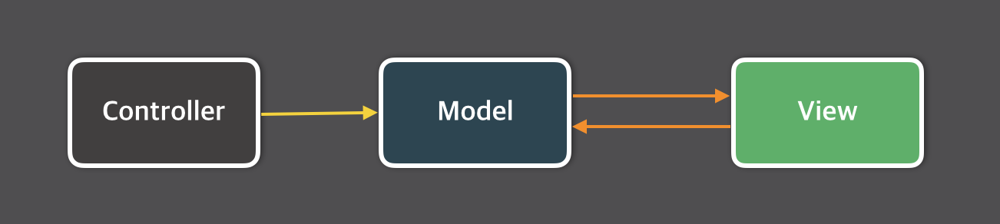
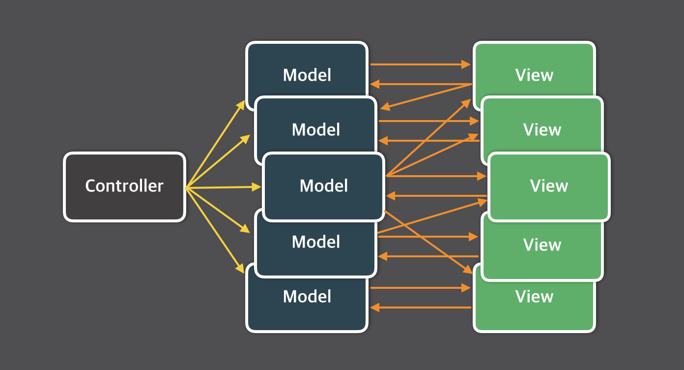

# 들어가며

## 리액트 독주 체제의 이유: 단방향 바인딩

### 기존 MVC 패턴

나날이 복잡해지는 JS 코드를 체계화하고자 탄생한 패턴



Controller가 Model의 데이터를 관리하고, Model의 데이터가 변경되면 View로 전달되어 사용자에게 보여진다.

문제는 사용자가 View를 통해 데이터를 관리하면 View 역시 Model를 업데이트 할 수 있다는 것. (양방향 바인딩 지원)



사용자와의 상호작용이 증가하는 인터랙티브한 웹 앱이 중요해지면서 상태의 변화가 무엇으로 인해 일어났는지 파악하기 어려워진다.

<br>

리액트는 이 문제를 해결하기 위해 단방향 바인딩만 지원한다.
단방향 바인딩이란 데이터의 흐름이 한쪽으로만 간다는 것이다.
상태가 변화했다면 그 상태 변화를 명시적으로 일으키는 함수만 찾으면 된다.

### Flux 패턴

단방향 데이터 흐름을 강조하여 애플리케이션의 상태 관리와 디버깅을 용이하게 한다.


- Action: 데이터 변경 요청을 나타내는 객체
- Dispatcher: 모든 Action을 중앙에서 처리하는 허브
- Store: 애플리케이션의 상태와 상태를 변경하는 메서드를 가지고 있음
- View: 리액트 컴포넌트, Store로부터 상태 변경 알림을 받고, 이를 기반으로 UI 갱신.
  View 또한 사용자와 상호작용하여 새로운 Aciton을 생성할 수 있다.

## 리액트의 역사

### 2010년대 페이스북이 직면한 문제

2010년대 들어서면서 JS는 적극적으로 DOM을 수정해 다양한 인터랙션을 보여주었고, Ajax를 활용해 클라이언트에서도 서버와 통신해서 데이터를 불러오기 시작했다. 이에 따라 JS 코드가 점차 복잡해지기 시작했다.

페이스북은 많은 사용자가 이용하는 서비스로 성능이 그 무엇보다 중요했다.
하지만 JS 코드는 커질 수 밖에 없고, 서버 렌더링이 처리할 수 있는 규모에는 한계가 있을 수 밖에 없었다.

### 새로운 아이디어

리액트 초기 프로젝트인 BoltJS를 개선하면서 무언가 변경되면 단순히 UI를 초기화하고 새로 렌더링하자는 아이디어가 제시되었다.

### 빛을 보는 리액트

리액트를 오픈소스로 전화나면서 리액트 커뮤니티가 활성화되었고,
대형 IT 기업들이 리액트를 채택하면서 프런트엔드 시장에서 전성기를 맞는다.

### 리액트의 미래

과거 리액트는 클라이언트에 초점을 맞추었지만
리액트 팀은 앞으로 서버에서의 작업, 서버에서 작동할 수 있는 다양한 기능을 추가할 것으로 보인다.

<br>

# 01장: 리액트 개발을 위해 꼭 알아야 할 자바스크립트

## 1.1 자바스크립트의 동등 비교

### `Object.is`

`Object.is`는 두 개의 인수를 받으며, 이 인수 두 개가 동일한지 확인하고 반환하는 메서드다.
`===`과 다른 점은 `Object.is`가 좀 더 개발자가 기대하는 방식으로 비교한다.

### 리액트에서의 동등 비교

리액트에서 사용하는 동등 비교는 `Object.is`다.
리액트에서는 이 `Object.is`를 기반으로 동등 비교를 하는 `shallowEqual`이라는 함수를 만들어 사용한다.
이 `shallowEqual`은 의존성 비교 등 리액트의 동등 비교가 필요한 다양한 곳에서 사용된다.

[shallowEqual](https://github.com/facebook/react/blob/main/packages/shared/shallowEqual.js)

리액트에서의 동등 비교는 `Object.is`로 먼저 비교를 수행한 다음, 객체 간 얕은 비교(객체의 첫 번째 깊이에 존재하는 값만 비교)를 한 번 더 수행한다.

```js
Object.is({ hello: "world" }, { hello: "world" }); // false

shallowEqual({ hello: "world" }, { hello: "world" }); // true

shallowEqual({ hello: { hi: "world" } }, { hello: { hi: "world" } }); // false
```

객체의 첫 번째 깊이에 존재하는 값만 비교하는 이유는 JSX props는 객체이며, 여기에 있는 프로퍼티만 일차적으로 비교하면 되기 때문이다.

### 정리

JS는 객체 비교의 불완전성을 가지고 있고, 이런 JS를 기반으로 한 리액트의 함수형 프로그래밍 모델에서도 이러한 언어적인 한계를 뛰어넘을 수 없으므로 얕은 비교만을 사용해 필요한 기능을 구현하고 있다.

## 1.2 함수

### 화살표 함수와 일반 함수의 차이점: this 바인딩

일반 함수에서 this 바인딩은 함수가 호출될 때 결정되며,
함수 내부의 this에는 전역 객체가 바인딩된다. (strict mode의 경우 undefined 바인딩)
이는 일반 함수로 선언된 콜백 함수, 중첩 함수가 헬퍼 함수로 동작하기 어렵게 만든다.

화살표 함수는 함수 자체의 this 바인딩을 갖지 않는다.
따라서 화살표 함수 내부에서 this를 참조하면 **상위 스코프**의 this를 그대로 참조한다.
이를 lexical this라 한다. (**화살표 함수의 this가 함수가 정의된 위치에 의해 결정된다.**)
따라서 화살표 함수 내부에서 this를 참조하면 **일반적인 식별자**처럼 **스코프 체인**을 통해 상위 스코프에서 this를 탐색한다.

_이는 콜백 함수의 내부 this가 외부 this와 다르기 때문에 발생하는 문제를 해결하기 위해 의도적으로 설계된 것이다._

### 함수를 만들 때 주의해야 할 사항

#### 함수의 부수 효과를 최대한 억제하라

부수 효과: 함수 내의 작동으로 함수 외부에 영향을 끼치는 것
순수 함수: 부수 효과가 없고, 동일한 인수를 받으면 동일한 결과를 반환하는 함수

그렇다면 항상 순수 함수로만 작성해야 할까?
웹 애플리케이션을 만드는 과정에서 부수 효과는 피할 수 없는 요소다.

API를 호출한다면 외부 영향(HTTP request)을 끼쳤으므로 부수효과다.
`console.log` 브라우저의 콘솔 창이라는 외부에 영향을 끼쳤으므로 부수효과다.

부수효과를 만드는 것은 피할 수 없는 요소지만 이러한 부수 효과를 최대한 억제할 수 있는 방향으로 함수를 설계해야 한다.
리액트에 관점에서 본다면 부수 효과를 처리하는 훅인 `useEffect`의 사용을 최소화하는 것이 그 일환이다.

---

### 새로 알게된 개념

- 리액트의 역사
- `Object.is`, `shallowEqual`
- useEffect 사용의 최소화

### 읽으면서 어려웠거나 이해가 잘 안됐던 부분

- 단방향 바인딩
- 객체 간 얕은 비교 개념
- this 바인딩
