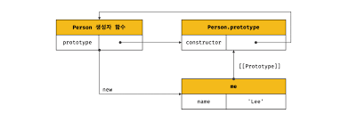
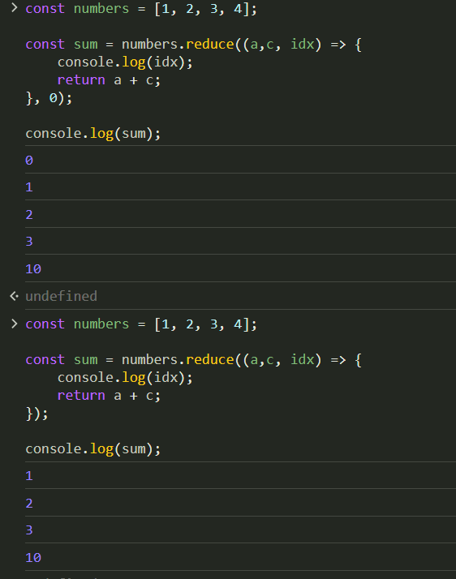

# 들어가며

## 리액트 독주 체제의 이유: 단방향 바인딩

### 기존 MVC 패턴

나날이 복잡해지는 JS 코드를 체계화하고자 탄생한 패턴


Controller가 Model의 데이터를 관리하고, Model의 데이터가 변경되면 View로 전달되어 사용자에게 보여진다.

문제는 사용자가 View를 통해 데이터를 관리하면 View 역시 Model를 업데이트 할 수 있다는 것. (양방향 바인딩 지원)


사용자와의 상호작용이 증가하는 인터랙티브한 웹 앱이 중요해지면서 상태의 변화가 무엇으로 인해 일어났는지 파악하기 어려워진다.

<br>

리액트는 이 문제를 해결하기 위해 단방향 바인딩만 지원한다.
단방향 바인딩이란 데이터의 흐름이 한쪽으로만 간다는 것이다.
상태가 변화했다면 그 상태 변화를 명시적으로 일으키는 함수만 찾으면 된다.

### Flux 패턴

단방향 데이터 흐름을 강조하여 애플리케이션의 상태 관리와 디버깅을 용이하게 한다.


- Action: 데이터 변경 요청을 나타내는 객체
- Dispatcher: 모든 Action을 중앙에서 처리하는 허브
- Store: 애플리케이션의 상태와 상태를 변경하는 메서드를 가지고 있음
- View: 리액트 컴포넌트, Store로부터 상태 변경 알림을 받고, 이를 기반으로 UI 갱신.
  View 또한 사용자와 상호작용하여 새로운 Aciton을 생성할 수 있다.

## 리액트의 역사

### 2010년대 페이스북이 직면한 문제

2010년대 들어서면서 JS는 적극적으로 DOM을 수정해 다양한 인터랙션을 보여주었고, Ajax를 활용해 클라이언트에서도 서버와 통신해서 데이터를 불러오기 시작했다. 이에 따라 JS 코드가 점차 복잡해지기 시작했다.

페이스북은 많은 사용자가 이용하는 서비스로 성능이 그 무엇보다 중요했다.
하지만 JS 코드는 커질 수 밖에 없고, 서버 렌더링이 처리할 수 있는 규모에는 한계가 있을 수 밖에 없었다.

### 새로운 아이디어

리액트 초기 프로젝트인 BoltJS를 개선하면서 무언가 변경되면 단순히 UI를 초기화하고 새로 렌더링하자는 아이디어가 제시되었다.

### 빛을 보는 리액트

리액트를 오픈소스로 전화나면서 리액트 커뮤니티가 활성화되었고,
대형 IT 기업들이 리액트를 채택하면서 프런트엔드 시장에서 전성기를 맞는다.

### 리액트의 미래

과거 리액트는 클라이언트에 초점을 맞추었지만
리액트 팀은 앞으로 서버에서의 작업, 서버에서 작동할 수 있는 다양한 기능을 추가할 것으로 보인다.

<br>

# 01장: 리액트 개발을 위해 꼭 알아야 할 자바스크립트

## 1.1 자바스크립트의 동등 비교

### `Object.is`

`Object.is`는 두 개의 인수를 받으며, 이 인수 두 개가 동일한지 확인하고 반환하는 메서드다.
`===`과 다른 점은 `Object.is`가 좀 더 개발자가 기대하는 방식으로 비교한다.

### 리액트에서의 동등 비교

리액트에서 사용하는 동등 비교는 `Object.is`다.
리액트에서는 이 `Object.is`를 기반으로 동등 비교를 하는 `shallowEqual`이라는 함수를 만들어 사용한다.
이 `shallowEqual`은 의존성 비교 등 리액트의 동등 비교가 필요한 다양한 곳에서 사용된다.

[shallowEqual](https://github.com/facebook/react/blob/main/packages/shared/shallowEqual.js)

리액트에서의 동등 비교는 `Object.is`로 먼저 비교를 수행한 다음, 객체 간 얕은 비교(객체의 첫 번째 깊이에 존재하는 값만 비교)를 한 번 더 수행한다.

```js
Object.is({ hello: "world" }, { hello: "world" }); // false

shallowEqual({ hello: "world" }, { hello: "world" }); // true

shallowEqual({ hello: { hi: "world" } }, { hello: { hi: "world" } }); // false
```

객체의 첫 번째 깊이에 존재하는 값만 비교하는 이유는 JSX props는 객체이며, 여기에 있는 프로퍼티만 일차적으로 비교하면 되기 때문이다.

### 정리

JS는 객체 비교의 불완전성을 가지고 있고, 이런 JS를 기반으로 한 리액트의 함수형 프로그래밍 모델에서도 이러한 언어적인 한계를 뛰어넘을 수 없으므로 얕은 비교만을 사용해 필요한 기능을 구현하고 있다.

## 1.2 함수

### 화살표 함수와 일반 함수의 차이점: this 바인딩

일반 함수에서 this 바인딩은 함수가 호출될 때 결정되며,
함수 내부의 this에는 전역 객체가 바인딩된다. (strict mode의 경우 undefined 바인딩)
이는 일반 함수로 선언된 콜백 함수, 중첩 함수가 헬퍼 함수로 동작하기 어렵게 만든다.

화살표 함수는 함수 자체의 this 바인딩을 갖지 않는다.
따라서 화살표 함수 내부에서 this를 참조하면 **상위 스코프**의 this를 그대로 참조한다.
이를 lexical this라 한다. (**화살표 함수의 this가 함수가 정의된 위치에 의해 결정된다.**)
따라서 화살표 함수 내부에서 this를 참조하면 **일반적인 식별자**처럼 **스코프 체인**을 통해 상위 스코프에서 this를 탐색한다.

_이는 콜백 함수의 내부 this가 외부 this와 다르기 때문에 발생하는 문제를 해결하기 위해 의도적으로 설계된 것이다._

### 함수를 만들 때 주의해야 할 사항

#### 함수의 부수 효과를 최대한 억제하라

부수 효과: 함수 내의 작동으로 함수 외부에 영향을 끼치는 것
순수 함수: 부수 효과가 없고, 동일한 인수를 받으면 동일한 결과를 반환하는 함수

그렇다면 항상 순수 함수로만 작성해야 할까?
웹 애플리케이션을 만드는 과정에서 부수 효과는 피할 수 없는 요소다.

API를 호출한다면 외부 영향(HTTP request)을 끼쳤으므로 부수효과다.
`console.log` 브라우저의 콘솔 창이라는 외부에 영향을 끼쳤으므로 부수효과다.

부수효과를 만드는 것은 피할 수 없는 요소지만 이러한 부수 효과를 최대한 억제할 수 있는 방향으로 함수를 설계해야 한다.
리액트에 관점에서 본다면 부수 효과를 처리하는 훅인 `useEffect`의 사용을 최소화하는 것이 그 일환이다.

---

### 새로 알게된 개념

- 리액트의 역사
- `Object.is`, `shallowEqual`
- useEffect 사용의 최소화

### 읽으면서 어려웠거나 이해가 잘 안됐던 부분

- 단방향 바인딩
- 객체 간 얕은 비교 개념
- this 바인딩

---

## 1.3 클래스

클래스에 대해 이해한다면, 왜 리액트가 패러다임을 바꾼지도 알 수 있고 나아가 오래된 리액트 코드를 리팩터링하는데 도움이 될 것이다.

### 클래스, 프로토타입, 인스턴스의 관계

**모든 객체는 생성자 함수와 연결되어 있고, 프로토타입과 생성자 함수는 언제나 쌍으로 존재한다.**

1. 프로토타입은 생성자 함수가 생성되는 시점에 더불어 생성된다.
2. 생성자 함수로 인스턴스를 생성하면 생성된 인스턴스의 `[[Prototype]]` 내부 슬롯에 프로토타입이 할당된다.



<br>

📖 추가) `[[Prototype]]`이란?
모든 객체는 `[[Prototype]]`이라는 내부 슬롯을 가지며 이 내부 슬롯의 값은 프로토타입의 참조다.

`[[Prototype]]`에 저장되는 프로토타입은 **객체 생성 방식**에 의해 결정된다.
ex)
객체 리터럴 => 프로토타입: Object.prototype
생성자 함수 => 프로토타입: 생성자 함수의 prototype 프로퍼티에 바인딩되어 있는 객체

### 클래스와 함수의 관계

클래스는 ES6에서 나온 개념으로, ES6 이전에는 프로토타입을 활용해 클래스의 작동 방식을 구현할 수 있었다.

```js
// 클래스를 일반 함수로 구현하는 예시
// IIFE로 함수를 반환하여 Car에 할당하며, Car는 클래스(생성자 함수)가 된다.
const Car = (function () {
  function Car(name){
    this.name = name;
  }

  Car.prototpye.honk = function () {
    console.log(`${this.name}이(가) 경적을 갈긴다.`);
  }

  Car.hello = function () {
    console.log(`저는 자동차입니다`);
  }

  Car.defineProperty(Car, 'age'){
    get: function () {
      return this.carAge;
    },
    set: function () {
      this.carAge = value;
    }
  }
  return Car;
  })();
```

## 1.4 클로저

함수 컴포넌트에 대한 이해는 클로저에 달려 있다.
함수 컴포넌트의 구조와 작동 방식, 훅의 원리, 의존성 배열 등 함수 컴포넌트의 대부분의 기술이 모두 클로제에 의존하고 있기 때문에 클로저에 대해 이해하는 것이 필수다.

> 클로저는 함수와 그 함수가 선언된 렉시컬 환경(상위 스코프)과의 조합이다. 😵‍💫

### 클로저는 기술인가, 중첩된 함수인가?

- 기술: 함수가 자신이 선언된 환경을 기억하고, 이 환경 내의 변수에 접근할 수 있도록 하는 기술
- 중첩된 함수: 클로저는 중첩된 함수로 구현된다.

클로저는 함수가 선언된 환경을 기억하여 외부 변수에 접근하는 기능을 말하며 이는 중첩된 함수로 구현된다.

### 클로저의 활용

모든 함수는 선언된 환경을 기억하고 외부 변수에 접근할 수 있지만, 일반적으로 이를 클로저라고 하지는 않는다.

**클로저는 외부 함수의 실행이 종료되고 콜 스택에서 제거된 후에도 내부 함수가 외부 함수의 변수를 계속해서 참조하는 경우를 의미한다.**

```js
function Counter() {
  let counter = 0;

  return {
    increase() {
      return ++counter;
    },
    decrease() {
      return --counter;
    },
    counter() {
      return counter;
    },
  };
}

const c = Counter();

// 외부 함수 Counter가 실행 후 콜 스택에서 제거되었지만 Counter의 counter 변수를 계속해서 참조하고 있다.
console.log(c.increase()); // 1
console.log(c.decrease()); // 0
console.log(c.counter()); // 0
```

**이점**

- 사용자가 직접 변수에 접근하는 것을 막을 수 있다.
- 개발자가 원하는 정보만 원하는 방향으로 노출시킬 수 있다.

리액트의 useState도 함수 호출은 컴포넌트의 첫 줄에서 종료되더라도, 상태를 계속해서 참조할 수 있다. 이는 useState가 클로저를 활용하기 때문이다.

### 주의할 점

❗클로저는 공짜가 아니다. 클로저를 사용하는 데는 비용이 든다.

**이유**

1. 클로저는 생성될 때마다 외부 함수의 선언적 환경을 기억해야 한다.
2. 외부 함수가 종료되어도 클로저가 참조하는 외부 변수는 사라지지 않고 메모리에 유지된다.

## 1.5 이벤트 루프와 비동기 통신의 이해

### 프로세스와 스레드

프로그램: 정적인 코드 덩어리

프로세스: 정적인 프로그램이 동적으로 변하여 프로그램이 돌아가고 있는 상태
코드 덩어리가 컴퓨터 메모리에 올라가고 자원을 할당받아 프로그램이 실행되고 있는 상태

스레드: 하나의 프로그램에서 동시에 여러 개의 복잡한 작업을 수행할 필요성
프로세스 내부에서의 더 작은 실행 단위

### 이벤트 루프란?

이벤트 루프는 ECMAScript 사양에 나와 있는 내용은 아니다.
즉, 이벤트 루프란 JS 실행 환경에서 비동기 실행을 돕기 위해 만들어진 장치다.

**이벤트 루프의 역할**

1. 콜 스택이 비어 있는지 확인하고, 수행해야 할 코드가 있다면 JS 엔진을 이용해 실행한다.
2. 콜 스택이 비어 있다면, 태스크 큐 / 마이크로 태스크 큐의 작업을 콜 스택으로 올린다.

<br>

**그렇다면 setTimeout, fetch 등의 작업은 어디서 실행되는 것?**

JS 실행 환경에 해당하는 Web API나 Node.js에서 실행
JS 런타임 외부에서 실행되고 완료 후 콜백 함수가 태스크 큐로 들어간다.

애초에 setTimeout, fetch는 ECMAScript 사양에 정의되어 있지 않다.
(JS 엔진의 함수가 아니다, 실행 환경이 제공하는 API)

### 태스크 큐와 마이크로 태스크 큐

마이크로 태스크 큐는 태스크 큐보다 우선권을 갖는다.
마이크로 태스크에는 대표적으로 Promise가 있다.

그렇다면 렌더링은 언제 실행될까?
렌더링은 마이크로 태스크 큐를 실행한 뒤에 렌더링이 일어난다.
각 마이크로 태스크 큐가 빌 때마다 한 번씩 렌더링할 기회를 얻게 된다.

**우선 순위**

1. 콜 스택
2. 마이크로 태스크 큐
3. 렌더링
4. 태스크 큐

이러한 작업 순서는 브라우저에서 다음 리페인트 전에 콜백 함수 호출을 가능하게 하는 `requestAnimationFrame`으로도 확인할 수 있다.

```js
console.log("a");

setTimeout(() => {
  console.log("b");
}, 0);

Promise.resolve().then(() => {
  console.log("c");
});

window.requestAnimationFrame(() => {
  console.log("d");
});

// a, c, d, b
```

<br>

📖 추가) 작업 순서 이해해보기

```js
function blockFor10Seconds() {
  const start = Date.now();
  while (Date.now() - start < 10000) {}
  console.log("Blocked for 10 seconds");
}

const myPromise = new Promise((resolve, reject) => {
  setTimeout(() => resolve("Promise 객체 상태 변경"), 3000);
});

myPromise.then(() => console.log("then 메서드의 콜백 함수 실행"));

blockFor10Seconds();
```

1. myPromise 객체 생성과 동시에 executor 함수 호출
2. 콜 스택: `blockFor10Seconds` 함수는 10초 동안 콜 스택을 점유
   Web API: setTimeout 실행, 3초 후에 setTimeout의 콜백 함수는 태스크 큐로 이동
3. 10초 블로킹 이후 이벤트 루프의 동작으로 setTimeout의 콜백 함수는 콜 스택으로 이동 후 실행됨
4. resolve 함수가 실행되어 myPromise의 상태가 fulfilled가 되면, then 메서드의 콜백이 마이크로 태스크 큐에 등록되고 바로 실행됨

---

### 새로 알게된 개념

- 클로저의 정의
- 렌더링 과정이 마이크로 태스크 작업 뒤에 일어나는 것

### 읽으면서 어려웠거나 이해가 잘 안됐던 부분

- 프로세스와 스레드
- 태스크 큐와 마이크로 태스크 큐 예제 이해하기

---

## 1.6 리액트에서 자주 사용하는 자바스크립트 문법

### 구조 분해 할당

> 배열 또는 객체의 값을 분해해 **개별 변수**에 즉시 할당하는 것

🛑 주의할 점

- 구조 분해 할당 시 undefined일 때만 기본값을 사용한다.

```js
const [a = 1, b = 1, c = 1] = [undefined, null, 0];

b; // null
```

#### 객체 구조 분해 할당

객체에서 값을 꺼내온 뒤 할당한다.
객체 내부의 이름으로 값을 꺼내온다.

꺼내온 값을 새로운 이름으로 다시 할당 가능하다.

```js
const { a: first, b: second } = object;
// 할당 방향: 값 ----> 변수
// 오른쪽에 선언한 변수에 a, b의 값이 할당됨
```

변수의 값으로 객체의 값을 꺼내올 수도 있다.

```js
const key = "a";
const obj = {
  a: 1,
  b: 1,
};

const { [key]: a } = obj;
// 변수의 값으로 객체의 값을 꺼냈으면 반드시 변수를 선언해 할당해줘야 한다.
```

### Spread Syntas vs Rest Parameter

#### Spread Syntax

> 하나로 뭉쳐 있는 여러 값들의 집합을 펼쳐서 **값의 목록**으로 만든다.

🛑 주의할 점

- 스프레드 문법의 결과는 값이 아니다.

```js
// 에러 발생, 스프레드 문법의 결과는 값이 아니다.
const a = ...[1, 2, 3];
```

- 스프레드 문법을 사용할 수 있는 대상은 순회할 수 있는 이터러블에 한정된다.

#### Rest Parmeter

> 여러 개 값의 목록을 하나로 **묶는** 기능

🛑 주의할 점

- 항상 마지막에 위치해야 한다.
- 기본값을 사용할 수 없다.

#### 구분 기준

- 함수 정의에서 사용되면 Rest Parameter, 함수 호출에서 사용되면 Spread Syntax

```js
function printNums(...numbers) {
  // 함수 정의에서 사용된 numbers => Rest Parameter
  numbers.forEach((num) => console.log(num));
}

const numbers = [1, 2, 3];
// 함수 호출에서 사용된 numbers => Spread Syntax
printNums(...numbers);
```

- 좌변에 위치하면(구조 분해 할당) Rest Parameter, 우변에 위치하면 Spread Syntax

```js
// 좌변에 위치하여 구조 분해 할당 수행 => Rest Parameter
const [first, second, ...rest] = [1, 2, 3, 4, 5];

const arr = [1, 2, 3, 4, 5];
// 우변에 위치하여 전개 구문 수행 => Spread Syntax
const newArr = [...arr];
```

중요한 것은 문맥에 따라 값을 묶는 경우는 Rest Parameter, 값을 펼치는 경우는 Spread Syntax라는 것을 인지하는 것이다.

### 객체 초기자

> 객체를 선언할 때 객체에 넣고자 하는 키와 값을 가지고 있는 변수가 이미 존재한다면 해당 값을 간결하게 넣어줄 수 있는 방식

### Array.prototype.reduce

인수로 전달받은 콜백 함수를 반복 호출하고, 반환값을 다음 순회 시에 콜백 함수의 첫 번째 인수로 전달하면서 **하나의 결과값**을 만들어 반환한다.

```js
const numbers = [1, 2, 3, 4, 5];

const sum = numbers.reduce((acc, cur, idx) => {
  return acc + cur;
}, 0);
```

#### 초기값을 주지 않으면?

- 초기값을 주는 경우
  첫 번째 인수 acc에 초기값이 할당된다.
  두 번째 인수 cur에 첫 번째 원소가 할당된다.
  세 번째 인수 idx에 0이 할당된다.

- 초기값이 없는 경우
  첫 번째 인수 acc에 첫 번째 원소가 할당된다.
  두 번째 인수 cur에 두 번째 원소가 할다오딘다.
  세 번째 인수 idx에 1이 할당된다.



### Array.prototype.forEach

🛑 주의할 점

- forEach의 반환값은 undefined이다.
- 중간에 배열 순회를 멈출 수 없다.

## 1.7 선택이 아닌 필수, 타입스크립트

### 리액트 코드를 효과적으로 작성하기 위한 타입스크립트 활용법

#### any 대신 unknown을 사용하자

불가피하게 타입을 단정할 수 없는 경우에는 unknown을 사용하는 것이 좋다.
unknown은 모든 값을 할당할 수 있는 top type이다.
그러나 any와 다르게 이 값을 바로 사용하는 것은 불가능하다.

unknown으로 선언된 변수를 **사용**하기 위해서는 type narrowing 과정이 필요하다.

```js
function doSomething(cb: unknown) {
  if (typeof cb === "function") {
    callback();
  }

  throw new Error("cb는 함수여야 합니다.");
}
```

#### 타입 가드를 적극 활용하자

타입을 사용하는 쪽에서는 최대한 타입을 좁히는 것이 좋다.
조건문과 함께 타입 가드를 사용하면 타입을 효과적으로 좁힐 수 있다.
타입 가드는 JS로 트랜스파일해도 사라지지 않는 값 공간의 영역이다.

##### instanceof

instanceof는 지정한 인스턴스가 특정 클래스의 인스턴스인지 확인할 수 있는 연산자
instanceof는 값 공간 심벌을 확인한다.

```ts
if (e instanceof UnaurhorizedError) {
  // do something...
}
```

##### typeof

특정 요소에 대해 자료형을 확인하는데 사용한다.
타입에서 쓰일 때와 값에서 쓰일 때 다른 기능을 한다.

타입: 타입스크립트 타입을 반환
값: 런타임 타입을 가리키는 문자열 반환

```ts
if (typeof value === "string") {
  // do something...
}
```

##### in

어떤 객체에 키가 존재하는지 확인하는 용도로 사용된다.

```ts
if ("age" in person) {
  // do something...
}
```

<br>

📖 추가) TS / JS의 `in`

`in` keyword가 반복해서 사용되는데 이를 정리하여 헷갈리지 않도록 하자.

**1. 반복문에서의 `in`**

`for-in` 구문의 `in`
객체의 속성을 순회할 때 사용

**2. 객체의 특정 프로퍼티 확인**

```ts
const person = {
  name: "Alice",
  age: 25,
};

if ("name" in person) {
  console.log("Name exists");
}
```

**3. 매핑된 타입의 `in`**

유니온 타입의 각 타입을 순회할 때 사용

```ts
type Partial<T, K> = { [k in K]?: T[k] };

interface User {
  id: number;
  name: string;
  age: number;
}

type PartialUser = Partial<User, "name" | "age">;
```

#### 제네릭

제네릭은 단일 타입이 아닌 다양한 타입에 대응할 수 있도록 도와주는 도구다.
제네릭을 사용하면 타입만 다른 비슷한 작업을 하는 컴포넌트를 단일 제네릭 컴포넌트로 선언해 중복을 줄일 수 있다.

```ts
// top type을 사용하는 경우
function getFirstAndLast(list: unknown[]) {
  return [list[0], list[list.length - 1]];
}

const [first, last] = getFirstAndLast([1, 2, 3]);

first; // unknown
last; // unknown
```

다양한 타입을 받아들이기 위해 unknown을 사용했지만 결과물도 unknown이 나와
해당 변수를 사용하려면 결국에 타입 내로잉을 해줘야 한다.

제네릭을 사용하면 해당 문제를 해결할 수 있다.

```ts
function getFirstAndLast<T>(list: T[]): [T, T] {
  return [list[0], list[list.length - 1]];
}

const [first, last] = getFirstAndLast([1, 2, 3]);

first; // numer
last; // numer
```

리액트에서 `useState`의 경우 기본값을 넘기지 않고 사용할 때 값을 undefined로 추론해버린다.
제네릭으로 타입을 선언해준다면 이러한 문제를 방지할 수 있다.

#### 인덱스 시그니처

```ts
type Hello = {
  [key: string]: string;
};

const hello: Hello = {
  hello: "hello",
  hi: "hi",
};
```

`[key: string]: string;` 이 부분이 바로 인덱스 시그니처다.
동적인 객체를 정의할 때 유용하지만, 타입의 범위가 너무 커지는 단점이 존재한다.

##### 타입 좁히기

```ts
// Record 사용
type Hello = Record<"hello" | "hi", string>;

// 타입을 사용한 인덱스 시그니처
type Hello = { [key in "hello" | "hi"]: string };

// 객체 타입 선언
type Hello = {
  hello: string;
  hi: string;
};
```

##### 좁힌 타입의 key 사용 문제점

```ts
type Hello = {
  hello: string;
  hi: string;
};

const hello: Hello = {
  hello: "hello",
  hi: "hi",
};

Object.keys(hello).map((key) => {
  // 변수의 key를 Hello 타입에 사용하려고 하면 타입 에러 발생
  const value = hello[key];
  return value;
});
```

##### Why?

타입스크립트의 구조적 타이핑 특징 때문이다.
타입스크립트는 타입의 확장에 열려있다.

```ts
interface Book {
  name: string;
  price: number;
}

interface ProgrammingBook {
  name: string;
  price: number;
  skill: string;
}

let book: Book;

let programmingBook: ProgrammingBook = {
  name: "타입스크립트",
  price: 33000,
  skill: "reactjs",
};

book = programmingBook;
```

`programmingBook`은 Book 타입으로 선언된 `book` 변수에 할당 가능하다.
`ProgrammingBook`은 `Book`의 서브 타입이기 때문이다.

<br>

다시 인덱스 시그니처 예시로 돌아가서 `hello` 변수에 `Hello` 타입의 선언된 key 이외에 다른 프로퍼티가 추가된 객체도 할당 가능하다.

```ts
const obj = {
  hello: "hello",
  hi: "hi",
  temp: "temp",
};

const hello: Hello = obj; // OK
```

따라서 `Object.keys(hello)`의 반환값에 `Hello` 타입 이외의 값이 있을 수 있고, 타입 에러가 발생한다.

<br>

📖 추가 1: 구조적 타이핑

구조적 타이핑이란 객체가 어떤 타입에 부합하는 프로퍼티와 메서드를 가질 경우 객체를 해당 타입에 속하는 것으로 간주하는 방식이다.

JS는 동적 타입 언어로 본질적으로 구조적 타이핑 기반이다.
따라서 객체의 타입을 클래스가 아닌, 객체의 프로퍼티와 메서드의 존재에 따라 객체의 타입을 결정한다.

```java
// 명목적 타이핑 (Java의 예시)

class Point {
  int x;
  int y;
}

class Coordinate {
  int x;
  int y;
}

public class Main {
  public static void main(String[] args) {
    Point point = new Point();
    Coordinate coord = new Coordinate();

    point = coord;
    // 컴파일 에러: 타입이 일치하지 않음
  }
}
```

```js
// 구조적 타이핑

interface Point {
  x: number;
  y: number;
}

function logPoint(point: Point) {
  console.log(`x: ${point.x}, y: ${point.y}`);
}

let point = { x: 10, y: 20 };
logPoint(point); // 정상 작동

let point3D = { x: 10, y: 20, z: 30 };
logPoint(point3D); // 정상 작동
```

<br>

📖 추가 2: 잉여 속성 체크

```ts
type Hello = {
  hello: string;
  hi: string;
};

const hello: Hello = {
  hello: "hello",
  hi: "hi",
  temp: "temp",
}; // Error
```

이전의 코드와 같아보이는데 이번에는 타입 체커를 통과하지 못했다.

**Why?**

잉여 속성 체크: 타입이 명시된 변수에 **객체 리터럴**을 할당할 때 타입스크립트는 해당 타입의 속성이 있는지, 그리고 **그 외 속성은 없는지** 확인한다.

잉여 속성 체크는 타입이 명시된 변수에 객체 리터럴을 할당할 때 일어난다.
**잉여 속성 체크와 할당 가능 검사는 별도의 과정이다.**

##### 객체 key 사용 해결 방법

타입 단언을 통해 이를 해결할 수 있다.

```ts
// 1)
(Object.keys(hello) as Array<keyof Hello>).map((key) => {
  const value = hello[key];
  return value;
});

// 2)
Object.keys(hello).map((key) => {
  const value = hello[key as keyof Hello];
  return value;
});
```

### 타입스크립트 전환 가이드

#### tsconfig.json 먼저 작성하기

- outDir: 트랜스파일된 결과가 저장되는 폴더
- allowJs: js 파일을 허용할 것인지 여부
- target: 결과물이 될 JS 버전
- include: 트랜스파일할 대상

#### JSDoc과 @ts-check를 활용해 점진적으로 전환하기

상단에 `//@ts-check`를 선언하고 JSDoc을 활용해 변수나 함수에 타입을 제공하면 TS 컴파일러가 JS 파일의 타입을 확인한다.

```js
// @ts-check

/**
 * @type {string}
 */
const str = "hello";

/**
 * @param {number} a
 * @param {number} b
 * @return {number}
 */
function sum(a, b) {
  return a + b;
}
```

#### 타입 기반 라이브러리 사용을 위해 @types 모듈 설치하기

과거에 JS 기반으로 작성된 라이브러리를 설치해서 사용하고 있다면 TS에서는 이러한 라이브러리를 정상적으로 사용하기 위해서 `@types`라 불리는 DefinitelyTyped를 설치해야 한다.
이는 타입스크립트로 작성되지 않은 코드에 대한 타입을 제공하는 라이브러리다.
당장 리액트도 `@types/react`, `@types/react-dom` 등에 리액트에 대한 타입이 정의되어 있다.

모든 라이브러리가 `@types`를 필요로 하는 것은 아니다.
비교적 최근에 만들어진 라이브러들은 자체적으로 타입스크립트 지원 기능이 라이브러리에 내장되어 있다.

#### 파일 단위로 조금씩 전환하기

JS에서 TS로 전환할 때는 상수나 유틸과 같이 별도의 의존성을 가지고 있지 않은 파일 먼저 전환하자.

---

### 새로 알게된 개념

- 전개 구문과 Rest 파라미터 구분 기준
- forEach의 순회를 중지할 수 없다.
- unknown과 타입 내로잉
- 타입 가드

### 읽으면서 어려웠거나 이해가 잘 안됐던 부분

- 전개 구문과 Rest 파라미터 구분 기준
