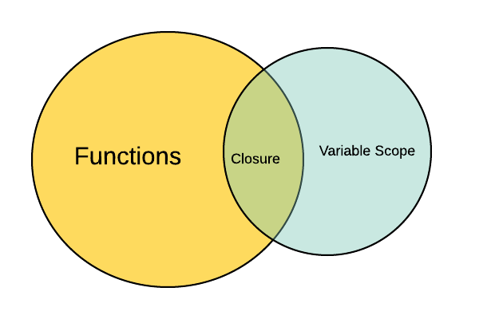

# 1회차

## 리액트 등장 배경

- 대부분의 프레임워크들이 양방향 바인딩을 지원함.
  > 뷰와 컴포넌트가 서로 상태를 변화 시키므로 편리하지만, 규모가 커질수록 상태 변화의 원인을 파악하는게 어려워짐.
- 서버에서 모든 렌더링 작업을 처리함.
  > JS 코드의 크기가 커질수록 서버의 성능이 하락함.
- JS(당시 웹 개발 필수)를 쓰는 웹 개발 도구, 기능들이 늘어남에 따라 코드가 복잡해짐.

## 리액트 개발 일지

실시간 렌더링이 핵심인 페이스북에서 개발을 시작.

1. **BoltJS**: createClass로 내부에 객체를 선언해서 컴포넌트를 만드는 방식(React가 이어받음)  
   => 기능이 늘어날수록 변화를 가져가기 어려워져서 도태됨.

2. **FBolt**: 변화에 따라 UI를 초기화하고 새로 렌더링 하는 방식.  
   => 아이디어에서 끝났지만, react에서 수용함.

3. **React**: JSX, Flux패턴, shouldComponentUpdate 도입.
   - **JSX**: JS 코드 내에 HTML추가 => 동적기능 구현이 간편해짐.
   - **Flux패턴**: 복잡한 MVC패턴 대체제. 단방향, 데이터가 한 방향으로만 흐르게함. => 상태 변화 원인 찾기쉬움, 상태 변화 일으키기 어려움.
   - **shouldComponentUpdate**: 불필요한 렌더링 생략. DOM요소를 초기화 하지않고, 변화를 추가해주는 방식.

리액트를 위한 프레임워크들의 등장과 웹 개발 원툴이 아니라는 점으로 인해 다양한 라이브러리와 호환되는 특징으로 대세가 됨.

## 01장 리액트 개발을 위해 꼭 알아야 할 자바스크립트

리액트의 기반이 되는 자바스크립트를 알아보자.

### 1.1 자바스크립트의 동등 비교

리액트 컴포넌트의 렌더링이 일어나는 이유 중 하나가 props의 동등 비교에 따른 결과임. props의 동등 비교는 객체의 얕은 비교를 기반으로 이뤄지니 자바스크립트의 동등 비교부터 살펴보자.

#### 원시 타입(primitive type)

객체가 아닌 다른 모든 타입. 할당 시점에 메모리 영역을 차지하고, 불변 형태의 값으로 저장.

- undefined: 선언됐지만 할당되지 않은 값. 값이 없으면 자동으로 할당됨(개발자 의도X).
- null: 아직 값이 없거나 비어 있는 값을 표현(개발자 의도O).
- Boolean: true 또는 false를 가짐. truthy, falsy 값이 존재(조건문 내부에서 true, false로 변함).
- Number: 모든 숫자, JS는 2진수 같은 것들도 자동으로 10진수로 변경해줌. -(2<sup>53</sup>-1)과 (2<sup>53</sup>-1) 사이의 값이 한계 <= 한계치 넘으면 동등 비교시 같다고 나옴.
- BigInt: Number의 한계를 넘을 수 있음. 숫자끝에 n을 붙이거나 BigInt함수 쓰면됨.
- String: ', ", ` 으로 표현. 한번 문자열이 생성되면 변경할 수 없음.
- Symbol: 고유한 값을 나타냄. 같은 형태의 키 값을 할당해도 다르다고 나옴.

#### 객체 타입(object/reference type)

배열, 함수, 정규식, 클래스 등이 포함. 참조를 전달하므로 참조 타입이라고도 불림.

**참조가 뭐지??**  
값으로 향하는 주소값을 말하는 것.

```
var a = {
    greet: 'hello',
}

var b = {
    greet: 'hello',
}

console.log(a === b) // false
console.log(a.greet === b.greet) // true
```

a와 b는 같은 값을 가져도 값으로 향하는 주소 값이 다름.  
즉, 객체끼리 비교하면 주소 값이 달라서 false가 나오지만,  
객체안의 값끼리 비교하면 같은 값이므로 true.  
 .

```
var c = {
    greet: "hi",
}

var d = c

console.log(c === d) // true
```

이거는 c와 d가 주소 값을 서로 공유하게 되서 true.

동등 연산자 구린데? 더 좋은거 없어? 있지. **Object.is**!

```
const a = {
    hi: 'hi',
}

const b = a

Object.is(a, b) // true
a === b // true
```

몇몇 케이스에서는 동등 비교보다 나은 모습을 보여주지만, 객체 간 비교에 있어서는 동등 비교와 다를게 없다...

#### 리액트에서의 동등 비교

리액트에서는 **ObjectIs**(object.is)를 기반으로 한 **shallowEqual**이라는 함수를 사용.

```
PropsA, B, C, D 모두 참조가 다름. ObjectIS는 참조 같아야 비교가능.
let propsA = {
    hello: 'hi', // <= 첫번째 깊이
}

let propsB = {
    hello: 'hi',
}

shallowEqual({ hello: 'hi' }, { hello: 'hi' }) // true

let propsC = {
    hello: { // <= 첫번째 깊이
        hello: 'hi', // <= 두번째 깊이
    },
}

let PropsD = {
    hello: {
        hello: 'hi',
    },
}

shallowEqual({ hello: { hello: 'hi' } }, { hello: { hello: 'hi' } }) // false
```

shallowEqual은 객체 간 얕은 비교만 가능. <= 객체의 첫 번째 깊이에 존재하는 값만 비교.  
이는 shallowEqual함수 내에서 각 키 배열을 꺼내고 서로 비교해서 같은지 확인을 하는데,  
키 배열을 한 번만 꺼내기 때문에 그럼.  
키 배열을 꺼내고 각각의 키 배열안에서 또 한번 키 배열을 꺼냈으면 두 번째 깊이까지 비교가 가능함.

### 1.2 함수

하나의 블록으로 감싸서 실행 단위로 만들어 놓은 것. **일급 객체**임, 다른 객체들에 일반적으로 적용 가능한 연산을 모두 지원하는 객체를 의미.

#### 일급 객체 특징

- 다른 함수의 매개변수가 될 수 있음.
- 반환값이 될 수도 있다.
- 변수에 할당할 수 있다.

**호이스팅**: 변수와 함수 선언이 코드가 실행되기 전에 메모리에 등록됨. 이로 인해 변수와 함수 선언이 코드의 최상단으로 끌어올려진 것처럼 동작.

함수의 종류와 차이점을 알아보자.

- 함수 선언문: 변수에 할당되지 않음. 어떠한 값도 표현 안함. 호이스팅, 함수를 호출하기 전에 메모리에 등록되있어서 호출 잘됨.

  ```
  hi() // hi

  function hi() {
      console.log('hi')
  }

  hi() // hi
  ```

- 함수 선언문 + 표현식: 함수 표현식에서 함수에 이름을 주는것. JS엔진이 문맥에 따라 선언문 또는 표현식으로 해석함(쓰지마).

  ```
  const sum = function add(a, b) {
      return a + b
  }

  add(1, 1) // Uncaught ReferenceError: add is not defined
  sum(1, 1) // 2, 함수의 이름이 아닌 변수이름을 줘야 작동함.
  ```

- 함수 표현식: 함수를 변수에 할당하는 것. 변수도 호이스팅이 발생하지만, let, const는 데드존에 있고 var는 undefined로 초기화된 상태다(함수 호출 불가능).

  ```
  hi() // hi

  const hi = function(a, b) {
    console.log('hi')
  }

  hi() // hi
  ```

- 즉시 실행 함수: 한 번 선언하고 호출되면, 재호출이 불가능함. 리팩터링에 좋음.
  ```
  ((a, b) => {
      return a + b
    },
  )(1, 1) // 2
  ```
- 고차 함수: 함수를 인수로 받거나 결과로 새로운 함수를 반환함.

  ```
  // 함수를 인수로 받는 고차 함수.
  const array = [1, 2, 3].map((item) => item * 2)

  array // [2, 4, 6]

  // 함수를 반환하는 고차 함수.
  const add = function(a) { // a가 존재하는 클로저 생성 ㄷㄷ
      return function(b) {
          return a + b
      }
  }

  add(1)(3) // 4
  ```

- 화살표 함수: function 대신 '=>' 씀. 글자 수 줄어드는게 장점.
  ```
  const add = (a, b) => {
      return a + b
  }
  ```

#### 화살표 함수의 특징

- 생성자 함수(new)로 화살표 함수를 사용하는 것은 불가능.

  ```
  const Hi = (name) => {
      this.name = name
  }

  const hiHi = new Hi("hi") // Uncaught TypeError: Hi is not a constructor
  ```

- arguments가 존재하지 않음.

  ```
  function hi() {
      console.log(arguments)
  }

  hi(1, 2, 3) // Arguments(3) [1, 2, 3, callee: f, Symbol(Symbol.iterator): f]
  const hello = () => {
      console.log(arguments)
  }

  hello(1, 2, 3) // Uncaught ReferenceError: arguments is not defined
  ```

- this 바인딩 차이. 일반 함수 내부의 this는 런타임 시점에서 전역 개체를 가르키지만, 화살표 함수 내부의 this는 선언 시점에서 상위 스코프의 this를 따르게 된다.

  ```
  // 바벨 트랜스파일 전
  const hello = () => {
      console.log(this)
  }

  function hi() {
      console.log(this)
  }

  // 바벨 트랜스파일 후
  var _this = void 0

  var hello = function hello() {
      console.log(_this)
  }

  function hi () {
      console.log(this)
  }
  ```

### 좋은 함수란?

- **부수효과**, 함수 내의 작동으로 인해 함수 외부에 영향주는 것. 부수 효과가 없으면 순수 함수임. 순수 함수만을 쓸 수는 없겠지만 최대한 부수 효과를 억제하는 방향으로 설계해야함.
- 최대한 함수의 크기를 작게 만들자. 하나의 함수는 하나의 역할을 맡도록 **단일 책임 원칙**을 잘 지켜보자.
- 이름 잘 짓기. => Terse를 이용해 한글로 짓거나 GPT한테 부탁하자.
  (훅에 넘겨주는 콜백 함수에 이름 붙여보자.)

# 2회차

## 클래스

안쓰는데 왜 배워야함? 😟

- 오래된 코드를 읽기 위해서(취직시 리팩토링).
- 프로토타입에 대한 이해도 높아짐.

### 클래스란?

특정한 형태의 객체를 반복적으로 만들기 위해 사용되는 것.  
함수로도 가능하다며? 근데 왜 이거씀?  
클래스를 쓰면 아래의 특수한 메서드들을 사용 가능.

- **constructor**: 객체를 생성하는 데 씀. 단 하나만 존재가능.
  ```
  class Car {
      constructor (name) {
          this.name = name
      }
  }
  ```
- **프러퍼티**: constructor 내부 빈 객체에 키와 값을 넣어줌.
  ```
  const myCar = new Car('자동차') // name 값에 '자동차'할당
  ```
- **getter**: 값을 꺼내올 때 씀. get붙여서 쓰면됨
  ```
  get firstCharacter() {
      return this.name[0]
  }
  myCar.firstCharacter //차
  ```
- **setter**: get으로 선언한 친구(클래스 필드)에게 값을 할당할 때 씀 get으로 선언한 이름과 똑같이 쓰고, set을 앞에 넣으면됨.
  ```
  set firstCharacter(char) {
      this.name = [char, ...this.name.slice(1)].join('')
  }
  myCar.firstCharacter = '차' // '차'가 할당됨.
  ```
- **인스턴스 메서드**: 클래스 내부에서 선언한 메서드. 프로토타입 메서드라고도 불림. ?? 위에 메서드들도 클래스 내부에서 선언됬는데? 뭐지?

  ```
  hello() {
      console.log("hi, `${this.name}임`)
  }

  const myCar = new Car('자동차')
  myCar.hello() // hi, 자동차임, 메서드가 prototype에 선언됐기 때문에 바로 이런식으로 접근 가능

  Object.getPrototypeOf(myCar) // {constructor: f. hello: f}, 변수의 prototype 확인 가능 Car의 prototype을 받음.
  Object.getProtoTypeOf(myCar) === Car.prototype // true
  myCar.__proto__ === Car.prototype // true
  ```

  - \***\*proto\*\***잘못된 코드지만, 과거 브라우저와의 호환성을 위해서 수정하지 않았기 때문에 가급적 안쓰는게 좋음 => object.getProtoypeOf로 prototype을 확인하자.
  - **프로토 타입 체이닝**: 객체에서 선언하지 않았음에도 prototype에 있는 메서드를 찾아서 실행 시켜주는 것. 자기 자신부터 시작해서 최상위 객체인 Object까지 흝음.

- **정적 메서드**: 클래스의 인스턴스가 아닌 이름으로 호출. this에 접근할 수 없지만 인스턴스를 생성하지 않아도 사용 가능. 생성자가 없어도 접근 가능해서 여러곳에서 재사용이 가능.

  ```
  class Car {
      static hi() {
          console.log('hi')
      }
  }

  const myCar = new Car()

  myCar.hello() // uncaught TypeError: myCar.hello is not a function
  Car.hello() // hi
  ```

- **상속**: extends를 이용해서 부모 클래스의 기능을 상속받음(할당해줬다고 보면됨)
  ```
  class Truck extends Car {
      constructor(name) { // 부모인 Car의 constructor 호출
          super(name)
      }
  }
  ```

## 클로저



함수와 함수가 선언된 어휘적 환경? 의 조합  
변수가 어디에 선언 됐는지에 따라 변수의 유효 범위(스코프)가 결정된다. "선언된 어휘적 환경"은 변수가 코드 내부에서 어디서 선언됐는지를 말함.

```
function add() {
    const a = 10 // add전체를 유효 범위로 가짐.
    function innerAdd() {
        const b = 20 // innerAdd전체를 유효 범위로 가짐.
        console.log(a + b)
    }
    innerAdd() // 30
}

add()
```

### 스코프

변수의 유효 범위를 뜻함.

- 전역스코프: 전역 레벨에서 선언하는 것. 브라우저 환경은 전역 객체windows, Node.js 환경은 global이 있는데, 이 객체에 전역 레벨에서 선언한 스코프가 바인딩됨.

  ```
  var global = 'global scope'
  function hello() {
      console.log(global)
  }

  console.log(global) // global scope
  hello() // global scope
  console.log(global === window.global) // true
  ```

  var로 선언된 global이 전역 스코프에서 선언한 변수임. 그래서 전역 스코프와 hello 스코프 모두에서 global 변수에 접근할 수 있음.

- **함수 스코프**: JS는 함수 레벨 스코프를 기준으로함. {}블록에 있다고해서 스코프 범위가 결정되는게 아님(let, const는 블록 스코프를 가지지만, 그중 함수만 인정함).

  ```
  if(true) {
      var global = 'global scope'
  }

  console.log(global) // 'global scope'
  console.log(global == window.global) // true

  function hello() {
      var local = 'local variable'
      console.log(local) // local variable
  }

  hello()
  console.log(local) // Uncaught ReferenceError: local is not defined
  ```

  global은 {}내부에서 선언돼 있어도, {} 밖에서도 접근이 가능함. JS는 함수 레벨 스코프만 인정함.

  스코프가 중첩돼 있다면❓

  ```
  var x = 10
  function foo() {
      var x = 100
      console.log(x) // 100
      function bar() {
          var x = 1000
          console.log(x) // 1000
      }
      bar()
  }

  console.log(x) // 10
  foo()
  ```

  스코프는 가장 가까운 스코프에서 변수 존재를 확인한다. console.log(x)는 전역 스코프에서 위치해있기에 가장 가까운 x는 전역 스코프에 선언된 x = 10 이다.

### 클로저의 활용

```
function outer() {
    var x = 'hello'
    function inner() {
        console.log(x)
    }

    return inner
}

const inner = outer()
inner() // hello
```

위 코드에서 outer는 inner를 반환하며 종료됐다.
여기에서 반환한 함수에는 x라는 변수가 없지만, 선언된 어휘적 환경에서는 x라는 변수가 존재하며 접근할 수 있다. 같은 환경에서 선언된 outer는 x라는 변수가 존재하던 환경을 기억해서 정상 출력이된다.. 😨

**클로저를 활용해보면?**

```
var counter = 0

function handleClick() {
    counter++
}
```

bad코드. counter변수가 전역 레벨에 선언돼 있어서 window.counter를 활용하면 누구나 수정할 수 있음.

```
function Counter() {
    var counter = 0

    return {
        increase: function() {
            return ++counter
        }
    }
}

var c = Counter

console.log(c.increase()) // 1증가
```

good코드. counter변수가 함수레벨에 선언됌으로써 직접 수정이 불가능하고, 변수의 업데이트를 increase로 제한 함으로써 무분별하게 변경되는 것을 막음. 클로저를 활용해서 전역 스코프의 사용을 막아보자.

### 리액트에서의 클로저

```
function Component() {
    const [state, setSate] = useState()

    function handleClick() {
        setState((prev) => prev + 1)
    }
}
```

useState 내부에서 클로저가 활용됐기에 setState는 useState 내부의 최신값을 계속 확인 가능. setState는 외부 함수useState의 호출이 끝났음에도 자신이 선언된 외부 함수가 선언된 환경을 기억하기에 가능한 것.

**클로저 함수와 일반 함수**

- 클로저 함수: 스크립트를 실행하는 시점부터 메모리에 값을 저장함(내부함수가 외부함수의 선언적인 환경을 기억하기 위해).
- 일반 함수: 스크립트 실행 시, 선언과 작업이 모두 스코프 내부에서 끝나기 때문에 메모리에 영향없음.

클로저는 부수 효과가 없는 함수를 만들기 위해 쓰이지만 잘써야함. 무분별하게 클로저 함수를 남용하면 성능에 안좋은 영향을 미칠 수 있음.

## 이벤트 루프와 비동기 통신의 이해

JS는 기본적으로 싱글 스레드임. => 한 번에 하나의 작업만 동기 방식으로만 처리 가능.  
그런데 웹페이서는 어떻게 여러 작업을 동시에 처리하는걸까❓

**동기**: 직렬 방식으로 작업, 무조건 응답을 받은 이 후에 다른 작업을 처리할 수 있음.  
**비동기**: 병렬 방식으로 작업, 요청을 시작한 후 응답에 상관없이 다음 작업이 이뤄짐. 한번에 여러 작업을 실행할 수 있음.

### 싱글 스레드 자바스크립트

과거에는 프로그램을 실행하는 단위가 **프로세스**뿐임.  
**프로세스**는 프로그램의 상태가 메모리상에서 실행되는 작업 단위. => 하나의 프로그램 실행은 하나의 프로세스를 가짐. 그러다가 소프트 웨어가 복잡해짐에 따라 **스레드**라는 더 작은 실행 단위가 필요해지고, 프로세스 내의 스레드들은 메모리를 서로 공유해서 여러 가지 작업을 동시에 할수 있게됨. 멀티스레드가 가능해진 것.

**JS가 싱글 스레드를 채택한 이유**

- 멀티 스레드는 같은 자원을 공유하기 때문에 동시성 문제가 발생함.
- 하나의 스레드에 문제가 생기면 다른 스레드에도 문제가 생길 수 있음.
- JS개발 당시에는 멀티 스레드 개념이 대중화되기 전임.

JS는 싱글 스레드 기반으로써, 하나의 코드가 실행하는 데 오래 걸리면 뒤에 코드는 실행되지 않음. 이러한 특징을 **"Run-to-completion"** 이라함.  
복잡한 웹페이지에서는 별로 좋지 않음.  
이를 극복하기 위해 async 를 사용해서 비동기 함수를 만듬.

비동기 코드를 처리하는데 기반이 되는 이벤트 루프를 알아보자.

### 이벤트 루프란?

JS 런타임 외부에서 JS의 비동기 실행을 돕기 위해 만든 장치. 대표적으로 V8에 장착돼있음.

**호출 스택(call stack)**: JS에서 수행해야 할 코드나 함수를 담아두는 스택.

**이벤트 루프**: 호출 스택이 비어 있는지 여부를 확인하는 것. 호출 스택 내부에서 수행해야 할 코드가 있으면 JS엔진을 이용해 실행함.  
=> "코드 실행"과 "호출 스택이 비어 있는지 확인"모두가 단일 스레드에서 일어남. 즉, 두 작업은 스레드에서 순차적으로 일어남.

- 동기 코드에서의 호출 스택

  ```
  function jan() {          // 1. jon()이 호출 스택에 들어감.
      console.log('jan')    // 2. jon() 내부의 console.log도 호출 스택에 들어감.
  }                         // 3. jan()이 호출 스택에 들어감.
                            // 4. jan() 내부의 console.log도 호출 스택에 들어감.
  function jon() {          // 5. jan()에 남은게 없으므로 호출 스택에서 제거.
      console.log('jon')    // 6. jon()에 남은게 없으므로 호출 스택에서 제거.
      jun()                 // 7. 호출 스택이 비워지고 얘도 종료.
  }

  jon()
  ```

- 비동기 코드에서의 호출 스택

  ```
  function blue() {         // 1. red()가 호출 스택에 들어감.
      console.log('blue')   // 2. red() 내부의 console.log가 호출 스택에 들어감.
  }                         // 3. setTimeout이 호출 스택에 들어감.
                            // 4. 3번에 대해 타이머 이벤트 실행. 태스크 큐로 들어가고 스택에서 제거.
  function dark() {         // 5. dark()가 호출 스택에 들어감.
      console.log('dark')   // 6. dark() 내부의 console.log가 호출 스택에 들어감.
  }                         // 7. dark()에 남은게 없으므로 호출 스택에서 제거.
                            // 8. red()에 남은게 없으므로 호출 스택에서 제거.
  function red() {          // 9. 이벤트 루프가 호출 스택이 비어진걸 확인. 태스크 큐에 있는 blue()를 추가.
      console.log('red')    // 10. blue() 내부의 console.log가 호출 스택에 들어감.
      setTimeout(blue(), 0) // 11. blue()에 남은게 없으므로 호출 스택에서 제거.
      dark()
  }

  red()
  ```

  

  JS코드 실행에서 비동기 코드들은 JS코드 외부에서 실행되고 콜백이 태스크 큐로 들어가게됨.  
   이벤트 루프는 호출 스택이 비고, 콜백이 실행 가능한 때가 오면 이것을 꺼내서 호출 스택으로 옮겨줌.

  **태스크 큐**

  - 실행해야 할 태스크의 집합 => 비동기 코드들 짬때리는 곳.
  - set형태의 큐구조. => 선택된 큐 중 실행가능한 가장 오래된 태스크를 가져와야 하기 때문.
  - setTimeout, setInterval, setImmediate

  **마이크로 태스크 큐**

  - 태스크 큐보다 우선권이 높은 비동기 코드들 집합.
  - 작업이 끝날 때마다 한 번씩 렌더링할 기회를 얻게됨. => 렌더링 작업은 마이크로 태스트 큐와 태스크 큐 사이에서 일어남.
  - process.nextTick, Promises, queueMicroTask, MutationObserver

JS 코드는 싱글 스레드라 비동기 처리가 어렵지만 태스크 큐, 이벤트 루프, 브라우저/Node.js API 등의 힘을 빌려 비동기 이벤트 처리가 가능해졌다.

### 어려운거..

- useState의 동작 원리.
- 클래스 부분의 prototype 매우 생소한 개념이라 어려웠음.
- 클로저의 "선언된 어휘적 환경" 계속 다시봤음.

### 새로안거

- 모든 객체는 프로토 타입을 가지고있고, 프로토 체이닝 개념
- var, let, const 모두 다른 레벨의 스코프를 갖는다는거(까먹었었음)
- 이벤트 루프의 역할.

# 3회차(1.6 ~)

## 리액트에서 자주 사용하는 자바스크립트 문법

리액트를 이해하려면 자바스크립트 문법을 이해해야함.

**자바스크립트 문법을 이해하는법.**

- 작성하고자하는 자바스크립트 문법이 어느 ECMAScript버전에서 만들어졌는지도 파악해야함 => 브라우저와 JS 런타임이 항상 새로운 자바스크립트 문법을 지원하는 것이 아니기 때문.
- 바벨이 어떻게 최신 코드를 트랜스파일하는지, 그 결과를 보고 이해하면 애플리케이션을 디버깅하는 데 도움 됨.

### 구조 분해 할당

배열 또는 객체의 값을 분해해 개별 변수에 즉시 할당하는 것.

#### 배열 구조 분해 할당

배열 구조 분해 할당은 자유롭게 이름을 선언할 수 있음 =>  
useState도 배열을 반환함.

```
const array = [1, 2, 3, 4, 5] // ","의 위치에 따라 값이 결정됨.
const [first, , , , fifth] = array
first // 1
fifth // 5

const array2 = [1, 2]         // 값이 없거나 undefined일 때 기본값을 할당할 수 있음(c처럼)
const [a= 10, b= 10, c = 10] =array2
// a 1
// b 2
// c 10

const array3 = [1, 2, 3, 4, 5]// 뒤에 ...전개 연산자를 사용해서 나머지 값들을 해당 변수의 배열로 넣을 수 있음.
const [first, ...rest] = array
// first 1
// rest [2, 3, 4, 5]
```

트랜스파일시, 구조분해 할당은 단순히 배열에서 꺼내오고, rest는 slice해서 값을 할당해버림.

#### 객체 구조 분해 할당

객체에서 값을 꺼내온 뒤 할당하는 것.  
=> 객체의 경우 배열에 비해 트랜스파일시, 번들링 크기가 커서 주의해야함

```
const key = 'a'
const object = {
    a: 1,
}
const {[key]} = object // Uncaught SyntaxError: Unexpected token '['

const { [key]: a } = object
// a = 1
```

object의 프로퍼티에 변수명을 넣기위해 [key] 문법을 사용함.  
=> 반드시 뒤에 :a 와같은 이름을 붙여줘야함.

### 전개 구문

배열, 객체, 문자열과 같이 순회할 수 있는 값을 전개할 수 있음.

#### 배열의 전개 구문

배열 간에 합성하기 위해서는 메서드를 사용해야했지만, 전개 구문을 사용하면 쉽게 합성할 수 있음.

```
const arr1 = ['a', 'b']
const arr2 - [...arr1, 'c', 'd', 'e'] // ['a', 'b', 'c', 'd', 'e']
```

...**배열을 사용해서 참조는 다르게 하는것도 가능**

```
const arr1 = ['a', 'b']
const arr2 = arr1

arr1 === arr2 // true. 참조를 복사해서 true반환

const arr1 = ['a', 'b']
const arr2 = [...arr1]

arr1 === arr2 // false. 값만 복사되고, 참조는 다르므로 false반환
```

#### 객체의 전개 구문

객체를 합성할 때 사용함.  
=> 객체 전개 연산자와 마찬가지로 트랜스파일 시, 번들링이 커짐.

```
const obj1 = {
    a: 1,
    b: 2,
}

const obj2 = {
    c: 3,
    d: 4,
}

const newObj = {...obj1, ...obj2}
// {"a": 1, "b": 2, "c": 3, "d": 4}
```

```
const obj = {
    a: 1,
    b: 1,
}

const aObj = {
    ...obj,
    b: 10,
}
// {a: 1, b: 10}

const bObj = {
    b: 10,
    ...obj,
}
// {a: 1, b: 1}
```

전개 구문 이후에 값 할당이 있으면 구문 값을 덮어씌어버림. 즉 나중에 할당된 값이 덮어씌우는 구조.

```
// 트랜스파일 전
const arr1 = ['a', 'b']
const arr2 = [...arr1, 'c', 'd', 'e']

// 트랜스파일 후
var arr1 = ['a', 'b']
var arr2 = [].concat(arr1, ['a', 'b', 'c'])
```

**concat** 메서드가 빈 배열에 arr1과 배열들을 합성해줌.

### 객체 초기자

원시 타입 변수가 존재한다면, 변수 이름만 객체에 넣어줘도 작동함.  
=> 트랜스파일 이후에도 큰 부담이 없음.

```
const a = 1

const obj = {
    a,        // 원래는 a: 1, 이렇게 넣어줘야하지만 변수가 존재하므로 저렇게 축약 가능.
}

// {a: 1}
```

### Array 프로토타입의 메서드:map, filter, reduce, forEach

**Array.prototype.map, Array.prototype.filter, Array.prototype.reduce 특징**

- JSX내부에서 배열을 조작해 JSX를 반환하는 특성상 자주씀.
- 새로운 값을 만들어 반환하기 때문에 안전함.
- 트랜스파일이나 폴리필이 없어도 사용할 수 있음.

#### Array.prototype.map

- 인수로 전달받은 배열과 똑같은 길이의 새로운 배열을 반환함.
- 배열을 순회하면서 각 아이템을 콜백으로 연산한 결과로 구성됨.

  ```
  // JS식
  const arr = [1, 2, 3, 4, 5]
  const doubledArr = arr.map((item) => item * 2)
  // [2, 4, 6, 8, 10]

  // 리액트식
  const arr = [1, 2, 3, 4, 5]
  const Elements = arr.map((item) => {
      return <Fragment key={item}>{item}</Fragment>
  })
  ```

#### Array.prototype.filter

    - 콜백 함수에서 truthy 조건을 만족하는 경우에 해당 원소 반환.
    - filter의 결과에 따라 새로운 배열 반환.
    ```
    const arr = [1, 2, 3, 4, 5]
    const evenArr = arr.filter((item) => item % 2 === 0)
    // [2, 4]
    ```

#### Array.prototype.reduce

- 초기값에 따라 배열, 객체 등을 반환할 수 있음.
- 초기값에 콜백의 반환 값을 계속 누적하는 방식.
- filter, map의 작동을 reduce로 구현이 가능하지만, 직관적이지 않음.
  ```
  const arr = [1, 2, 3, 4, 5]
  const sum = arr.reduce((result, item) => {
      return result + item // result에 계속 다음 item이 합쳐짐
  }, 0 // <= 초기값임)
  ```

#### Array.prototype.forEach

- 배열을 순회하면서 콜백 함수를 실행시키기만 함.
- 반환값이 없음, undefined임
- 에러나 프로세스 종료가 아니면 **절대 배열 순회를 멈출 수 없음**...

  ````
  const arr = [1, 2, 3]

      arr.forEach((item) => console.log(item))
      // 1, 2, 3

      function run() {
          arr.forEach((item) => {
              console.log(item)
              if (item === 1) {
                  console.log("끝")
                  return
              }
          })
      }
      run()
      // 1
      // 끝
      // 2
      // 3
      ```

  return으로 실행을 종료시켜줘도 계속 실행된다;;
  ````

#### 삼항 조건 연산자

- JS에서 유일하게 3개의 피연산자를 취할 수 있음.
- 조건문(true or false) ? true일 시 값: false일 시 값
- if 조건문을 간단하게 쓸 수 있음.
- 가급적 중첩해서 쓰지 않는게 좋음.
  ```
  const value = 10
  const result = value % 2 === 0 ? '짝수' : '홀수'
  // 짝수
  ```

**최신 문법을 반영하기전에 주의할 것**

- 트랜스파일을 지원하는지 여부
- 사용자의 디바이스에서 별도 조치 없이 사용 가능한지

## 타입스크립트

**TS가 필수인 이유**

- Deno, Bun 등 많은 런타임들이 TS를 기본으로 지원함.
- 현업에서도 대다수의 프로젝트가 TS로 개발됨.
- JS에서 런타입에서만 타입을 체크할 수 있는 한계를 극복 => 버그 감소, 안정성 증가

### 타입스크립트란?

JS는 동적 타입의 언어라 코드를 실행해야 에러를 확인할 수 있음  
JS에서도 if문으로 type을 체크해서 에러를 방지할 수 있지만 번거러움

- JS, 복잡함

  ```
  function test(a, b) {
      if(typeof a !== 'number' || typeof b !== 'number') {
          throw new Error('a와 b 모두 숫자여야됨')
      }
      return a / b
  }

  test('안녕하세요', '하이') // Uncaught Error: a와 b 모두 숫자여야됨
  ```

- TS, 매우 간단함

  ```
  function test(a: number, b: number) {
  return a / b
  }

  test('안녕하세요', '하이') // Argument of type 'string' is not assignable to parameter of type 'number'
  ```

  변수에 타입을 설정할 수 있어서, 런타임 전 빌드하는 시점에서 에러 코드를 감지할 수 있음.
  => JS의 슈퍼셋(확장). JS에서 불가능한 일은 TS에서도 불가능.

**Flow**  
리액트는 Flow를 기반으로 작성됐지만 @types/react 라이브러리의 등장으로 TS로도 작성 가능해짐.

- TS가 없던시대에 태어난 정적 타입 체크 라이브러리.
- TS와는 다르게 내부 정적 타이핑을 도와주는 역할.
- JS에 **애너테이션**을 추가하는 형태로 구성됨.  
   **애너테이션**?  
   코드에 넣는 주석. 애너테이션이 달린 코드에 직접적인 영향은 없음.
  - 컴파일러에게 코드 작성 문법 에러를 체크하도록 정보를 제공한다.
  - 프로그램을 빌드할 때 코드를 자동으로 생성할 수 있도록 정보를 제공한다.
  - 런타임 시 특정 기능을 실행하도록 정보를 제공한다.

### 타입스크립트 활용법

#### any 대신 unknown쓰자

any는 불가피한 경우에만 써야함. 남발하면 TS를 쓰는 의미가 없음.  
 => JS에서 TS로 마이그레이션하는 경우에는 허락해줌.

```
function doSomething(callback: any) {
   callback()
}
               // 함수가 들어가야하는데, 1이 들어가버림;
doSomething(1) // TS에서 에러가 없지만, 실행 시 에러가 발생함.
```

**unknown**

- 모든 값을 할당할 수 있는 top type.
- 값을 바로 사용하는 것은 불가능.

  ```
  function doSomething(callback: unknown) {
      callback() // 'callback' is of type 'unknown'
  }
  ```

  값을 알 수 없다는 내용의 에러가뜸.  
   => type narrowing, 타입을 좁혀줘야함.

  ```
  function doSomething(callback: unknown) {
      if (typeof callback === 'function') {
          callback()
          return
      }

      throw new Error('callback은 함수여야됨.')
  }
  ```

  typeof로 타입을 좁혀서, 원하는 타입일 때만 동작하도록함.

**never**

- 어떠한 값도 들어갈 수 없는 bottom type.

  ```
  type what = string & number
  type why = ('hi' | 'hello') & 'react'
  ```

  첫번째 타입 what은 string과 number의 조건을 만족하는 타입이 들어가야함  
   두번째 타입 why는 react인 동시에 hi나 hello여야함 얘도 만족하는 타입 없음  
   => 둘다 만족할 수 있는 타입 없으니 never.

  **활용법**

  ```
  type Props = Record<string, never>
  type State = {
      counter: 0
  }

  class SampleComponent extends React.Component<Props, State> {
      constructor(props: Props) {
          super(props)
          this.state = {
              counter: 0,
          }
      }

      render() {
      return <>...</>
      }
  }
  ```

  Props는 없지만 state가 존재하는 상황에서는 어떠한 Props도 받지 않겠다는 뜻으로 사용 가능.

#### 타입 가드를 적극 활용하자

- 타입을 효과적으로 좁힐 수 있어 명확해짐.

**instanceof**

- instanceof는 지정한 인스턴스가 특정 클래스의 인스턴스인지 확인가능.
- object instanceof type => object가 type이거나 type을 상속받는 클래스면 true리턴.

  ```
  class UnAuthorizedError extends Error {
      constructor() {
          super()
      }
  }

  async function fetchSomething() {
      try{
          const response = await fetch('')
          return await response.json()
      } catch (e) {
          // e는 unknown

      // UnAuthorizedError 전용 타입 조건문.
      if (e instanceof UnAuthorizedError) {
          // do something...
      }

      throw e
      }
  }
  ```

**typeof**

- 특정 요소의 자료형을 확인 가능.

  ```
  function logging(value: string | undefined) {
      if(typeof value === 'string') {
          console.log(value)
      }

      if(typeof value === 'undefined') {
          return
      }
  }
  ```

  **in**

- property in object로 사용(for in)
- 객체에 키가 존재하는지 확인 가능.
- 여러 가지 객체가 존재할 때 유용.

  ```
  interface Student {
      age: number;
      score: number;
  }

  interface Teacher {
      name: string;
  }

  function doSchool(person: Student | Teacher) {
      if('age' in person) {   // person객체에 age프로퍼티 존재 확인
          person.age          // age프로퍼티를 가진 타입은 Student
          person.score        // person은 Student임
      }

      if('name' in person) {
          person.name
      }
  }
  ```

#### 제네릭

- 함수나 클래스 내부에서 다양한 타입에 대응할 수 있게해줌.  
   any랑 다른게 뭐임???

  - 제네릭은 동적으로 타입이 결정됨  
    => 함수에 들어오는 매개 변수에 맞춰서 타입이 정해짐.

  ```
  function getFistAndLast<T>(list: T[]): [T, T] {
      return [list[0], list[list.length - 1]]
  }

  // 숫자. number타입이 왔으니 T는 number타입이됨.
  const [first, last] = getFirstAndLast([1, 2, 3, 4, 5])

  first // number
  last // number

  // 문자. string타입이 왔으니 T는 string타입이됨.
  const [first, last] = getFirstAndLast(['a', 'b', 'c', 'd', 'e'])

  first // string
  last // string
  ```

  **useState에서는?**

  ```
  function Component() {
      // state: string
      const [state, setSate] = useState<string>()
  }
  ```

  useState()와 같이 기본값이 없는 경우에는 제네릭으로 기본값을 주는게 좋음.  
   => 기본값이 있을경우 타입추론에의해 자동으로 타입이 정해짐.

#### 인덱스 시그니처

- 객체의 키를 정의하는 방식을 의미.  
  => 객체에 앞으로 추가될 프로퍼티의 타입을 정해줌.

  ````
  type Hello = {
  [key: string]: string
  }

      const hello: Hello = {
          hello: 'hello',
          hi: 'hi',
      }

      hello.hi // hi
      hello.안녕 // undefined
      ```
      키의 범위가 너무 커지고, 존재하지않는 키는 undefined를 반환할 수 있음
      => 객체의 키는 동적으로 선언되는 경우를 지양하고, 타입도 좁혀야함.
      ```
      type hello = { [key in 'hello' | 'hi']: string} // hi, hello만 프로퍼티로 선언 가능.
      const hello: Hello = {
          hello: 'hello',
          hi: 'hi',
      }
      ```
  ````

#### Record

- 객체의 키와 밸류의 타입을 정의  
  => 객체의 프로퍼티와 값의 타입을 정해줘버림.

  ````
  type Hello = Record<'hello' | 'hi', string>

      const hello: Hello = {
          hello: 'hello',
          hi: 'hi',
      }
      ```
  ````

#### 타입단언

- TS가 추론한 타입이 있더라도 강제로 타입을 고정시킴  
  => 컴파일러가 해당 값의 타입을 유추할 필요가 없게 만듬.  
  => any같은 준치트키임 남용시 TS의미가 없어짐.

  ```
    const someValue: any = "this is a string";
    const strLength: number = (someValue as string).length;

    console.log(strLength); // 16
  ```

  **언제 써야함??**

      ```
      type hello = { [key in 'hello' | 'hi']: string}
      const hello: Hello = {
          hello: 'hello',
          hi: 'hi',
      }

      Object.keys(hello).map((key) => {
          //Element implicitly has an 'any' type because expression of type 'string'
          // can't be used to index type 'hello'
          // No index signature with a parameter of type 'string' was found on type 'hello'
          const value= hello[key]
          const value
      })
      ```

  object.keys로 key를 뽑았지만, 객체에 접근하니 에러가 발생함.

  why?

  ```
    // string[]
    const result = Object.keys(hello)
  ```

  Object.keys는 string[]을 반환함
  => 'type hello = { [key in 'hello' | 'hi']: string}' 이부분 때문에 hello의 인덱스 키로 접근할 수 없음.

  해결법은??
  1.as쓰기

  ```
  // Object.keys를 as로 타입단언 해줌.
  (Object.keys(hello) as Array<keyof Hello>).map((key) => {
      const value = hello[key]
      return value
  })
  ```

      Object.keys에 대한 반환 타입을 개발자가 단언한 타입으로 강제.

  2.타입 가드 함수

  ```
  // 만드는 방법
  function keyOf<T extends Object>(obj: T): Array<keyof T> {
      return Array.from(Object.keys(obj)) as Array<keyof T>
  }

  keysOf(hello).map((key) => {
      const value = hello[key]
      return value
  })
  ```

  return Array.from(Object.keys(obj)) as Array<keyof T> 키를 가져오면 타입단언으로 처리해버림.

  3.key를 단언해버리기

  ```
  Object.keys(hello).map((key) => {
      const value = hello[key as keyof Hello]
      return value
  })
  ```

  hello[key as keyof Hello] 키 자체를 타입단언 해줌.

**Object.key가 string[]으로 강제된 이유**

- JS의 덕타이핑 또는 구조적 타이핑 때문.

  1. JS는 객체가 필요한 변수와 메서드만 지니면 해당 타입에 속하도록 인정해줌.
  2. TS는 타입 체크를 할 때 값이 가진 형태에 집중함.
  3. JS에 TS가 맞춰줘야함
  4. 모든 키가 들어올 수 있기에 객체의 키에 포괄적으로 대응할려고 string[]타입을 제공함.

### 타입스크립트 전환 팁

1. tsconfig.json 먼저 작성하기.  
   => TS를 작성할 환경을 만드는 것. 너무나 당연하다.
   - 코드의 규모가 작으면 시도해보자.
2. JSDoc과 @ts-check를 활용해 천천히하기  
   => 파일 최상단에 //@ts-check를 선언, JSDoc을 활용해 변수, 함수에 타입을 제공. - 기존 프로젝트에 JSDoc을 사용했거나, TS로 전환하기 어려울 때
3. @types 모듈 설치하기  
   => "Cannot find module 'lodash' or its corresponding type declarations" 오류 뜨면 설치하자. - 최근에 만들어진 라이브러리 쓰는거아니면 걍 설치하자.
4. 파일 단위로 조금씩 전환하기
   - 상수, 유틸 처럼 의존성 적은 것 부터
   - 상수의 경우에는 원시값 대신에 가능한 타입을 좁혀보자.
   - 급한게 아니면 js-to-ts-converter는 쓰지말자.

### 정리

TS가 매우 유망하지만 JS를 등한시 해도 되는건 아니다.  
TS는 모든게 JS기반으로 동작하니 JS부터 잘 이해해보자.

### 어려운거..

- instanceof 의미가 이해가 되질 않아 해맷음.
- 덕타이핑과 Object.keys..

### 새로안거

- 배열의 전개 구문 으로 참조는 다르게 복사하기.
- 제네릭 타입에 대한 이해도
- as의 단점
