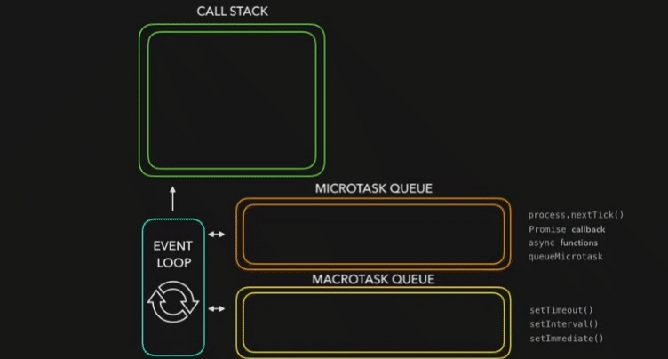

# 리액트 책 속으로 들어가며…🥹

## 리액트 왜 씀?

왜 리액트가 지난 몇 년간 많은 개발자들이 선호하는 라이브러리가 됐을까?

- **단방향 바인딩**
  만약 양방향으로 바인딩되면 뷰의 변화가 컴포넌트에 영향을 미칠 수도, 반대로 컴포넌트의 상태가 변경되면 뷰의 상태도 변할 수 있다. 리액트는 단방향 바인딩을 통해 상태 변화를 감지하고 업데이트한다.
- JSX
- 배우기 쉽고 간결함
- 활발한 커뮤니티 활성화

# [1장] 리액트 개발을 위해 꼭 알아야 할 자바스크립트

## 1.1 자바스크립트의 동등 비교

리액트의 가상 DOM과 실제 DOM의 비교, 리액트 컴포넌트가 렌더링하지 판다하는 방법, 변수나 함수의 메모이제이션 등 모든 작업은 자바스크립트의 동등 비교를 기반으로 한다.

리액트 컴포넌트의 렌더링이 일어나는 이유 중 하나가 바로 props의 동등 비교때문이다. props의 동등 비교는 객체의 얕은 비교를 기반으로 이뤄진다.

### 📍자바스크립트 데이터 타입

**✨원시타입**

> 메서드를 갖지 않는다.

- undefined: 선언됐지만 할당되지 않은 값
- null: 명시적으로 비어 있음을 나타내는 값 <br>
  💡typeof로 null을 확인하면 object가 반환된다. (초창기 JS가 값을 표현하는 방식 때문에 null로 표현하려 했지만 호환성이 깨져 받아들여지지 않음)
- boolean
- number
- bigInt: number가 다룰 수 있는 숫자 크기의 제한을 극복<br>
  💡bigInt를 number로 변환하면 데이터 손실 가능성이 있음

  ```js
  // BigInt를 만드는 방법
  let bigInt1 = BigInt(1234567890123456789012345678901234567890n)
  let bigInt2 = 1234567890123456789012345678901234567890n // 끝에 'n'을 붙여서 선언

  // number와 BigInt 비교
  let bigInt = 12345678901234567890n
  let number = 12345678901234567890

  console.log(bigInt == number) // true
  console.log(bigInt === number) // false
  ```

- string<br>
  💡문자열은 변경 X

  ```jsx
  const name = '보미'
  name[1] = '파'
  console.log(name) // 보미
  ```

- symbol: 중복되지 않는 고유한 값

  ```jsx
  const key = Symbol('key')
  const key2 = Symbol('key')

  console.log(sym1 === sym2) // false

  // Symbol.for
  const sym1 = Symbol.for('sharedSymbol')
  const sym2 = Symbol.for('sharedSymbol')

  // 같은 키로 생성된 심볼은 동일함
  console.log(sym1 === sym2) // true
  ```

**✨객체 타입**

> 참조를 전달한다고 해서 참조 타입이라고도 불림

```jsx
const bomi = function () {}
const bopa = bomi // bomi와 동일한 함수 객체를 참조(복붙 느낌)

// 동일한 메모리 주소 참조
console.log(bomi === bopa) // true
```

```jsx
const bomi = function () {}
const bopa = function () {}

// 서로 다른 메모리 주소를 참조
console.log(bomi === bopa) // false
```

### 📍자바스크립트의 또 다른 비교 공식 Object.is

> 두 개의 인수가 동일한지 확인하고 반환하는 메서드

- === 연산자와 비슷하게 작동하지만 NaN과 -0을 다루는 방식에서 차이가 있음<br>
  💡==: 같음을 비교하기 전에 양쪽이 같은 타입이 아니라면 비교할 수 있도록 강제로 형변환 한 후 비교한다.

```jsx
console.log(NaN === NaN) // false
console.log(Object.is(NaN, NaN)) // true

console.log(-0 === +0) // true
console.log(Object.is(-0, +0)) // false
```

```jsx
// 숫자 비교
console.log(Object.is(25, 25)) // true
console.log(Object.is(25, '25')) // false

// 객체 비교
const obj1 = { a: 1 }
const obj2 = { a: 1 }
const obj3 = obj1

console.log(Object.is(obj1, obj2)) // false (서로 다른 객체)
console.log(Object.is(obj1, obj3)) // true (같은 객체를 참조)

// 문자열 비교
console.log(Object.is('hello', 'hello')) // true
console.log(Object.is('hello', 'world')) // false

// 특별한 값 비교
console.log(Object.is(NaN, NaN)) // true
console.log(Object.is(0, -0)) // false
console.log(Object.is(-0, -0)) // true
```

### 📍리액트에서의 동등 비교

리액트는 Object.is를 폴리필과 함께 사용해 일관된 동등 비교를 한다. 모든 브라우저가 Object.is를 지원하지 않을 수 있어 폴리필을 사용해 해당 기능을 지원한다.

> **❓폴리필**<br>
> 최신 웹 기술을 이전 브라우저에서도 사용할 수 있게 해주는 도구

리액트는 이 Object.is를 기반으로 동등 비교를 하는 shallowEqual이라는 함수를 만들어 사용한다. 상태(state)나 속성(props)을 비교할 때 사용한다. 그래서 값과 타입이 정확히 같은지 확인할 수 있고, 이전 상태나 속성과의 비교를 안전하게 수행할 수 있다. 특히, React.memo나 useMemo 등 최적화 기능을 사용할 때 Object.is를 사용해 얕은 비교로 불필요한 리렌더링을 방지할 수 있다.

리액트는 Object.is로 먼저 비교를 수행한 후, 객체 간 얕은 비교를 한 번 더 수행한다.

```jsx
// Object.is는 참조가 다른 객체에 대해 비교가 불가능
Object.is({ hello: 'bomi' }, { hello: 'bomi' }) // false

// shallowEqual은 객체의 1 depth까지는 비교 가능
shallowEqual({ hello: 'bomi' }, { hello: 'bomi' }) // true

// 2 depth까지 가면 비교할 방법이 없어 false 반환
shallowEqual({ hello: { hi: 'bomi' } }, { hello: { hi: 'bomi' } }) //false
```

> **❓왜 얕은 비교까지만 구현했을까**<br>
> 리액트는 props만 일차적으로 비교하면 되기 때문.<br>
> 리액트는 props에서 꺼내온 값만 기준으로 렌더링을 수행하기 때문에 일반적인 케이스에서는 얕은 비교로 충분하다.

## 1.2 함수

> 함수: 작업을 수행하거나 값을 계산하는 등의 과정을 표현하고, 하나의 블록으로 감싸 실행 단위로 만들어 놓은 것

**✨함수 선언식**

```jsx
function add(x, y) {
  return x + y
}
```

**✨함수 표현식**

> 💡일급 객체: 다른 객체들에 일반적으로 적용 가능한 연산을 모두 지원하는 객체

**자바스크립트에서 함수는 일급 객체임**

>

```jsx
const add = function (x, y) {
  return x + y
}
```

**🔥함수 선언식과 함수 표현식 차이**

> 💡호이스팅: 변수 및 함수 선언을 컨텍스트 상단으로 옮겨지는 것

- 함수 선언식은 호이스팅 O
- 함수 표현식은 호이스팅 X

```jsx
// 함수 선언식
add(2, 3) // 호출 가능

function add(x, y) {
  return x + y
}

// 함수 표현식
subtract(5, 3) // 에러: TypeError: subtract is not a function

const subtract = function (x, y) {
  return x - y
}
```

### **🔥화살표 함수의 차이**

1.  Constructor를 사용할 수 없다.
2.  arguments가 존재하지 않는다.
3.  자신의 this를 가지지 않는다. 언제나 상위 스코프의 this를 상속받는다.

    💡this: 자신이 속한 객체나 자신이 생성할 인스턴스를 가리키는 값 <br>
    💡일반함수는 호출될 때마다 this가 동적으로 결정된다.

    ````jsx
    const obj = {
      name: 'bomi',
      greet: function() {
        console.log(`Hello, ${this.name}!`);
      },
      greetArrow: () => {
        console.log(`Hello, ${this.name}!`);
    }
    };

        obj.greet(); // Hello, bomi! (일반 함수 내부의 this는 해당 객체를 참조)
        obj.greetArrow(); // Hello, undefined! (화살표 함수 내부의 this는 상위 스코프의 this를 가리킴)
        ```
    ````

### 📍다양한 함수 살펴보기

**✨즉시 실행 함수**: 함수를 정의하고 그 순간 즉시 실행되는 함수

```jsx
;(function (a, b) {
  return a + b
})(10, 24) // 34
```

**✨고차 함수**: 함수를 인수로 받거나 결과로 새로운 함수를 반환시키는 역할

```jsx
//함수를 매개변수로 받는 대표적 고차함수: Array.prototype.map
const doubleArray = [1, 2, 3].map((item) => item * 2)

doubleArray // [2, 4, 6]
```

### 📍함수를 만들 때 주의해야 할 사항

- 함수의 부수효과를 최대한 억제하기
- 가능한 한 함수를 작게 만들기
- 누구나 이해할 수 있는 이름 붙이기

## 1.3 클래스

버전 16.8 이전에는 리액트에서 모든 컴포넌트가 클래스로 작성되어있었다.

❓옛날 이 작동법을 왜 알아야 하는가

- 함수 컴포넌트로 개선하기 위해 클래스가 어떤식으로 작동하지는지 이해할 수 있음
- 리액트가 왜 패러다임을 바꿨는지 알 수 있음
- 오래된 리액트 코드를 리팩토링하는 데 도움이 됨
- 자바스크립트의 프로토타입 기반으로 작동하는 클래스의 원리를 이해한다면 프로토타입에 대해 알 수 있음

### ✨클래스

> ❓클래스
> 특정 객체를 만들기 위한 템플릿 같은 것
> 객체를 반복적으로 만들기 위해 사용되는 것

**📍constructor**

- 객체를 생성하는 데 사용하는 특수한 메서드
- 하나만 존재할 수 있고, 여러 개 사용하면 에러 발생
- 생략 가능

**📍프로퍼티**

- 클래스로 인스턴스를 생성할 때 내부에 정의할 수 있는 속성값

💡기본적으로 인스턴스 생성 시 constructor 내부에는 빈 객체가 할당되는데 이 빈 객체에 프로퍼티의 키-값을 넣어 활용할 수 있도록 도와줌.

```jsx
class MyClass {
  // 클래스 프로퍼티 선언
  name = ''
  age = 0

  // 생성자
  constructor(name, age) {
    this.name = name
    this.age = age
  }

  // 메서드
  sayHello() {
    console.log(`내 이름은 ${this.name}고, 나이는 ${this.age} 이야.`)
  }
}

const myObject = new MyClass('보미', 20)
myObject.sayHello() // 출력: 내 이름은 보미고, 나이는 20이야.
```

**📍getter, setter**

- getter: 클래스에서 무언가 값을 가져올 때
- setter: 클래스 필드에 값을 할당할 때

```jsx
class Person {
  constructor(name) {
    this._name = name
  }

  get name() {
    return this._name
  }

  set name(newName) {
    this._name = newName
  }
}

const person = new Person('보미')
console.log(person.name) // "보미"

person.name = '보파'
console.log(person.name) // "보파"
```

**📍인스턴스 메서드**

- 클래스 내부에서 선언한 메서드(자바스크립트의 prototype에 선언되어 프로토타입 메서드라고 불리기도 함)

```jsx
class Person {
  constructor(name) {
    this.name = name
  }

  // 인스턴스 메서드
  hello() {
    console.log(`내 이름은 ${this.name}`)
  }
}

// 메서드 부르기
const myPerson = new Person('보미')
myPerson.hello()
```

새롭게 생성한 객체에서 인스턴스 메서드에 접근할 수 있다.

> ❓어떻게
> 메서드가 prototype에 선언됐기 때문

💡`__proto__`는 가급적 사용하지말자
null이 object로 나오는 것처럼 과거 브라우저 때문에 존재하는 기능

**➕프로토타입 체이닝**

- 직접 객체에서 선언하지 않았음에도 프로토타입에 있는 메서드를 찾아서 실행을 도와주는 것
- 자기 자신부터 시작해 이 프로토타입을 타고 최상위 객체인 Object까지 훑는다.
- myPerson에서 hello를 찾는 프로토타입 체이닝을 거쳐서 hello를 호출하는 것임.
- 🔥프로토타입과 프로토타입 체이닝이라는 특성 덕분에 생성한 객체에서도 직접 선언하지 않은 클래스에 선언한 hello() 메서드를 호출할 수 있고, 이 메서드 내부에서 this도 접근해 사용할 수 있다.

**📍정적 메서드**

- 클래스의 인스턴스가 아닌 이름으로 호출할 수 있는 메서드
- 정적 메서드는 클래스의 인스턴스가 아닌 클래스 자체에 속하는 메서드라 클래스 이름을 사용해 호출해야 한다.

```jsx
class Person {
  constructor(name) {
    this.name = name
  }

  // 인스턴스 메서드
  hello() {
    console.log(`내 이름은 ${this.name}`)
  }

  // 정적 메서드
  static hi() {
    console.log('하이')
  }
}

// 메서드 호출
const myPerson = new Person('보미')
myPerson.hello() // 인스턴스 메서드 호출
Person.hi() // 정적 메서드 호출
myPerson.hi() // Uncaught TypeError: myPerson.info is not a function
```

**📍상속**

- 기존 클래스를 상속받아서 자식 클래스에서 이 상속받은 클래스를 기반으로 확장하는 것

```jsx
// 부모 클래스
class Person {
  constructor(name) {
    this.name = name
  }

  // 메서드
  introduce() {
    console.log(`안녕하세요, 제 이름은 ${this.name}입니다.`)
  }
}

// 자식 클래스
class Student extends Person {
  // 부모 클래스의 생성자 호출
  constructor(name, grade) {
    super(name)
    this.grade = grade
  }

  // 자식 클래스의 메서드
  study() {
    console.log(
      `${this.name}은(는) ${this.grade}학년입니다. 열심히 공부합니다!`
    )
  }
}

// 자식 클래스의 인스턴스 생성
const myStudent = new Student('보미', 3)
myStudent.introduce() // 부모 클래스의 메서드 호출
myStudent.study() // 자식 클래스의 메서드 호출
```

기존에 자바스크립트는 프로토타입 기반 언어로서 클래스라는 개념이 별도로 없었다. 대신, 프로토타입을 이용하여 객체를 생성하고 상속을 구현했다.

하지만 많은 개발자들이 객체지향 언어에서 익숙한 클래스 기반의 문법을 원했다. 이에 따라 ECMAScript 2015(ES6)에서 클래스 문법이 도입되었다. 이렇게 클래스 문법이 도입되면서 자바스크립트는 기존의 객체지향 언어들과 비슷한 형태로 코드를 작성할 수 있게 되었다.

**→ 클래스는 객체지향 언어를 사용하던 다른 프로그래머가 좀 더 자바스크립트에 접근하기 쉽게 만들어주는 문법적 설탕**

## 1.4 클로저

> ❓클로저<br>
> 함수와 함수가 선언된 어휘적 환경의 조합 <br>
> 함수가 자신을 포함하고 있는 외부 함수의 변수에 접근할 수 있는 환경을 유지하는 것

```jsx
function createCounter() {
  let count = 0

  function increment() {
    count++
    console.log(`현재 카운트: ${count}`)
  }

  return increment
}

// createCounter 함수 호출 후 반환된 increment 함수를 counter에 할당
const counter = createCounter()
counter() // 현재 카운트: 1 출력
counter() // 현재 카운트: 2 출력
```

createCounter함수가 반환된 후에도 increment 함수가 여전히 createCount함수의 렉시컬 환경에 대한 참조를 유지한다. 따라서 반환된 increment함수를 호출될 때마다 createCount함수의 렉시컬 환경에 접근해 count값을 변경하고 출력할 수 있다.

**📍전역 스코프**

- 전역 레벨에 선언하는 것
- 이 스코프에서 변수를 선언하면 어디서든 호출할 수 있다.

**📍함수 스코프**

- 함수 내에서 선언된 변수와 함수가 해당 함수 내에서만 유효한 범위를 가지는 것

```jsx
var x = 10

function number() {
  var x = 100
  console.log(x) // 100

  function number2() {
    var x = 1000
    console.log(x) // 1000
  }
  number2()
}

console.log(x) // 10
number()
```

**📍리액트에서의 클로저**

```jsx
const [count, setCount] = useState(0)

// 클로저를 사용하여 이벤트 핸들러 정의
const handleClick = () => {
  setCount(count + 1) // 외부 스코프의 count 변수에 접근
}
```

❓useState 함수의 호출은 컴포넌트 내부 첫 줄에서 종료됐는데, setCount는 useState 내부의 최신 값을 어떻게 계속해서 확인할 수 있을까

클로저가 useState 내에서 활용되었기 때문

**외부함수 (useState)가 반환한 내부함수(setCount)는 외부함수 (useState)의 호출이 끝났음에도 자신이 선언된 외부함수가 선언된 환경을 기억하기 때문에 계속해서 state 값을 사용할 수 있는 것이다.**

**⚠️주의**

```jsx
for (var i = 0; i < 5; i++) {
  setTimeout(function () {
    console.log(i)
  }, i * 1000)
}
// setTimeout 콜백 함수가 실행될 때 이미 반복문이 종료되고 i의 최종 값이 5가 되어있다.
```

결과) 5만 5번 출력됨.

> ❓왜<br> > **`var`로 선언한 변수는 함수 범위 또는 전역 범위를 가진다.**<br>
> var는 함수 스코프를 가지기 때문에 바로 전역변수로 등록되어있다.

**→ var를 let으로 바꾸자.**

```jsx
for (let i = 0; i < 5; i++) {
  setTimeout(function () {
    console.log(i)
  }, i * 1000)
}
```

→ **클로저 사용**

```jsx
for (var i = 0; i < 5; i++) {
  ;(function (j) {
    setTimeout(function () {
      console.log(j)
    }, j * 1000)
  })(i)
}
```

**⚠️클로저를 남용하면 안 되는 이유**

- 클로저를 사용하는 데 비용이 든다.: 클로저는 생성될 때마다 그 선언적 환경을 기억해야 하기 때문.
- 클로저에 꼭 필요한 작업만 남겨두지 않는다면 메모리를 불필요하게 잡아먹는 결과를 야기함.

## 1.5 이벤트 루프와 비동기 통신의 이해

> ❓**동기**<br>
> 직렬 방식으로 작업을 처리하는 것<br>
> 하나의 작업이 완료되기 전까지 다음 작업이 시작되지 않음

> ❓**비동기**<br>
> 병렬 방식으로 작업을 처리하는 것<br>
> 특정 작업이 완료될 때까지 기다리지 않고, 다음 작업을 즉시 시작할 수 있음

자바스크립트는 싱글스레드언어다.

자바스크립트를 멀티스레드처럼 동작할 수 있게 하는 것이 바로 비동기처리다.

**✨이벤트 루프**

- 자바스크립트 런타임 외부에서 자바스크립트의 비동기 실행을 돕기 위해 만들어진 장치
- 콜 스택이 비어있고 태스크 큐에 대기 중인 함수가 있다면 이벤트 루프는 순차적으로 태스크 큐에 대기 중인 함수를 콜 스택으로 이동시킨다.


**📍콜 스택**

- 자바스크립트에서 수행해야 할 코드나 함수를 순차적으로 담아두는 스택
- 함수 호출 시 실행 컨텍스트가 생성된다.
- 함수를 호출하면 실행 컨텍스트가 순차적으로 콜 스택에 푸시되어 순차적으로 실행된다. 단 하나의 콜 스택을 사용하기 때문에 최상위 실행 컨텍스트가 종료되어 콜 스택에서 제거되기 전까지는 다른 어떤 태스크도 실행하지 않음.

**📍태스크 큐**

- 실행해야 할 태스크의 집합
- 비동기 함수의 콜백 함수 또는 이벤트 핸들러가 일시적으로 보관되는 영역
  - 마이크로 태스크 큐: Promise의 후속 처리 (then, catch, finally)
  - 매크로 태스크 큐: 타이머(setTimeout, setInterval), I/O(네트워크 요청) 작업
  - **마이크로가 매크로보다 우선순위가 높다.**

> 마이크로태스크 큐는 태스크 큐보다 우선순위가 높다.<br>
> → 이벤트 루프는 콜 스택이 비면 먼저 마이크로태스크 큐에서 대기하고 있는 함수를 가져와 실행한다.<br>
> → 마이크로태스크 큐가 비면 매크로태스크 큐에서 대기하고 있는 함수를 가져와 실행한다.



```jsx
console.log('start') // 1

setTimeout(() => {
  console.log('setTimeout') // 5 (매크로 태스크)
}, 0)

Promise.resolve()
  .then(() => {
    console.log('promise1') // 3 (마이크로 태스크)
  })
  .then(() => {
    console.log('promise2') // 4 (마이크로 태스크)
  })

console.log('end') // 2
```

## 1.6 리액트에서 자주 사용하는 자바스크립트 문법

리액트의 독특한 특징(JSX 구문 내부에서 객체를 조작하거나 객체의 얕은 동등 비교 문제를 피하기 위해 객체 분해 할당을 하는 등)을 이해하려면 리액트에서 자주 사용되는 자바스크립트 문법을 이해해야 한다.

### ✨구조 분해 할당

배열 또는 객체의 값을 분해해 개별 변수에 즉시 할당하는 것

**📍배열 구조 분해 할당**

```jsx
const array = [1, 2, 3, 4, 5]

const [first, second, third, ...arrayRest] = array
```

```jsx
const array = [1, 2] // 배열 정의
const [a = 10, b = 10, c = 10] = array // 구조 분해 할당과 기본값 설정

console.log(a) // 출력: 1 (배열에 첫 번째 요소가 존재하므로 기본값 무시)
console.log(b) // 출력: 2 (배열에 두 번째 요소가 존재하므로 기본값 무시)
console.log(c) // 출력: 10 (배열에 세 번째 요소가 없으므로 기본값 사용)
```

```jsx
const arrayWithUndefined = [1, undefined] // 배열에 undefined 요소 포함
const [x = 10, y = 10, z = 10] = arrayWithUndefined // 구조 분해 할당과 기본값 설정

console.log(x) // 출력: 1 (배열에 첫 번째 요소가 존재하므로 기본값 무시)
console.log(y) // 출력: 10 (배열에 두 번째 요소가 undefined이므로 기본값 사용)
console.log(z) // 출력: 10 (배열에 세 번째 요소가 없으므로 기본값 사용)
```

- 배열 분해 할당에는 기본값을 선언할 수 있다.
- ⚠️undefined일 때만 기본값을 사용한다.

---

❓React의 `useState` 훅이 배열을 반환하는 이유

- 배열을 반환하면 구조 분해 할당을 통해 변수들을 간편하게 추출
  ```jsx
  // 배열 구조 분해 할당을 사용하여 상태 값(state)과 상태를 갱신하는 함수(setState)를 쉽게 추출
  const [state, setState] = useState(initialState)
  ```
- `useState`는 항상 상태 값이 첫 번째, 상태 갱신 함수가 두 번째로 반환된다.
  ```jsx
  // 배열로 반환
  const [state, setState] = useState(initialState)

  // 객체로 반환 (순서가 보장되지 않음)
  const { state, setState } = useState(initialState)
  ```
- 변수 이름을 개발자가 직접 지정할 수 있기 때문에, 네이밍 충돌의 가능성이 줄어든다.
  ```jsx
  // 배열 구조 분해 할당 (변수 이름을 자유롭게 지정 가능)
  const [count, setCount] = useState(0)

  // 객체 구조 분해 할당 (키 이름이 고정됨)
  const { state: count, setState: setCount } = useState(0)
  ```

---

**📍객체 구조 분해 할당**

객체에서 값을 꺼내온 뒤 할당하는 것

p.83 객체는 객체 내부 이름으로 꺼내온다 <br> → `배열은 인덱스를 기준으로 값을 추출하지만, 객체는 속성 이름을 기준으로 값을 추출합니다.`

```jsx
const person = {
  name: 'bomi',
  age: 20,
  city: 'seoul',
}

// 객체 구조 분해 할당
const { name, age, city } = person

console.log(name) // 출력: bomi
console.log(age) // 출력: 20
console.log(city) // 출력: seoul
```

**객체의 속성 값을 새로운 변수 이름으로 할당하기**

```jsx
const person = {
  name: 'bomi',
  age: 20,
  city: 'seoul',
}

// 객체 구조 분해 할당과 변수 이름 변경
const { name: fullName, age: years, city: location } = person

console.log(fullName) // 출력: bomi
console.log(years) // 출력: 20
console.log(location) // 출력: seoul
```

**계산된 속성 이름 방식(Computed Property Names)**

객체를 생성할 때 런타임에 속성 이름을 동적으로 생성하는 방법
객체 리터럴 내에서 대괄호(`[]`)를 사용하여 속성 이름을 계산한다.

```jsx
const key = 'name'
const person = {
  name: 'bomi',
  age: 20,
  city: 'seoul',
}

// 계산된 속성 이름을 사용하여 구조 분해 할당
const { [key]: personName, age, city } = person

console.log(personName) // 출력: bomi
console.log(age) // 출력: 20
console.log(city) // 출력: seoul
```

- 계산된 속성 이름을 사용하려면 반드시 이름을 선언하는 `:personName` 과 같은 변수 네이밍이 필요하다. 안 쓰면 오류 발생
- 왜❓<br>
  계산된 이름인 [key]로 값을 꺼내기만 했을 뿐, 어느 변수명으로 할당해야 할지 알 수 없기 때문

### ✨전개 구문

구조 분해 할당과는 다르게 배열이나 객체, 문자열과 같이 순회할 수 있는 값에 대해 전개해 간결하게 사용할 수 있는 구문

**배열에서의 전개 연산자 순서**

배열에서 전개 연산자를 사용할 때, 다른 요소들보다 나중에 위치해야 한다.

```jsx
const arr1 = ['a', 'b']
const arr2 = arr1

arr1 === arr2 // true: 내용이 아닌 참조를 복사함

const arr1 = ['a', 'b']
const arr2 = [...arr1]

arr1 === arr2 // false: 실제로 값만 복사되고, 참조는 다름
```

**객체에서의 전개 연산자 순서**

객체에서도 전개 연산자는 다른 속성들보다 뒤에 위치해야 한다. 동일한 키가 있는 경우 나중에 나오는 속성이 이전에 나온 속성을 덮어쓸 수 있기 때문에.

```jsx
const obj1 = { a: 1, b: 2 }
const obj2 = { c: 3, d: 4, ...obj1 }

console.log(obj2) // { c: 3, d: 4, a: 1, b: 2 }

const obj1 = { a: 1, b: 2 }
const obj2 = { a: 3, ...obj1 }

console.log(obj2) // { a: 1, b: 2 }
```

→ 단순히 값을 복사하는 배열과는 다르게, 객체의 경우 객체의 속성값 및 설명자 확인, 심벌 체크 등 때문에 트랜스파일된 코드가 커지는 것을 볼 수 있다. 객체 구조 분해 할당과 마찬가지로, 객체 전개 연사자 또한 트랜스파일되면 상대적으로 번들링이 커지기 때문에 사용할 때 주의해야 한다.

### ✨객체 초기자

객체를 선언할 때 객체에 넣고자 하는 키와 값을 가지고 있는 변수가 이미 존재한다면 해당 값을 간결하게 넣어줄 수 있는 방식

```jsx
const a = 1
const b = 2

const obg = {
  a,
  b,
}
// {a: 1, b: 2}
```

### ✨Array 프로토타입의 메서드

**📍Array.prototype.map**

인수로 전달받은 배열과 똑같은 길이의 새로운 배열을 반환하는 메서드

```jsx
const numbers = [1, 2, 3, 4, 5]
const doubled = numbers.map((num) => num * 2)

console.log(doubled) // [2, 4, 6, 8, 10]
```

**📍Array.prototype.filter**

콜백 함수를 인수로 받고, truthy조건을 만족하는 경우에만 해당 원소를 반환하는 메서드

filter의 결과에 따라 원본 배열의 길이 이하의 새로운 배열이 반환된다.

```jsx
const numbers = [1, 2, 3, 4, 5]
const evenNumbers = numbers.filter((num) => num % 2 === 0)

console.log(evenNumbers) // [2, 4]
```

⚠️리액트에서 filter로 삭제하는 기능 만들기

```jsx
import React, { useState } from 'react'

const TodoList = () => {
  // 초기 todo 리스트
  const [todos, setTodos] = useState([
    { id: 1, text: '밥 먹기' },
    { id: 2, text: '운동하기' },
    { id: 3, text: '책 읽기' },
  ])

  // 항목 삭제 함수
  const deleteTodo = (id) => {
    // filter를 사용하여 항목 삭제
    const updatedTodos = todos.filter((todo) => todo.id !== id)
    setTodos(updatedTodos)
  }

  return (
    <div>
      <h1>Todo List</h1>
      <ul>
        {todos.map((todo) => (
          <li key={todo.id}>
            {todo.text}
            <button onClick={() => deleteTodo(todo.id)}>삭제</button>
          </li>
        ))}
      </ul>
    </div>
  )
}

export default TodoList
```

`deleteTodo` 함수는 주어진 `id`를 인수로 받아, `filter` 메서드를 사용하여 해당 `id`를 제외한 새로운 배열을 만든다.

**📍Array.prototype.reduce**

- 콜백 함수와 함께 초깃값을 추가로 인수를 받는데, 이 초깃값에 따라 배열이나 객체, 또는 그 외의 다른 무언가를 반환할 수 있는 메서드
- 배열을 하나의 값으로 줄이기 위해 배열의 각 요소에 대해 제공된 함수를 순차적으로 호출한다.
- 단순히 합계를 구하는 것뿐만 아니라 배열을 원하는 하나의 객체로 변환한다.

```jsx
const numbers = [1, 2, 3, 4, 5]
const sum = numbers.reduce(
  (accumulator, currentValue) => accumulator + currentValue,
  0
)

console.log(sum) // 15
```

> 간단한 배열 변환 작업에서는 `filter`와 `map` 조합이 더 가독성이 좋고 유지보수가 쉽다.
>
> 성능이 중요한 경우나 복잡한 배열 처리 로직이 필요한 경우 `reduce`를 고려하자.

**📍Array.prototype.forEach**

콜백 함수를 받아 배열을 순회하면서 단순히 그 콜백 함수를 실행하기만 하는 메서드

```jsx
const numbers = [1, 2, 3, 4, 5]
numbers.forEach((num) => console.log(num * 2))

// 2
// 4
// 6
// 8
// 10
```

- 반환값이 없다. 이 반환값은 undefined로 의미 없다.
- forEach는 실행되는 순간 에러를 던지거나 프로세스를 종료하지 않는 이상 멈출 수 없다. (break, return 등 X)

```jsx
const numbers = [1, 2, 3, 4, 5]

numbers.forEach((num) => {
  console.log(num)
  if (num === 3) {
    console.log('끝인줄 알았지?')
    return
  }
})

console.log('끝')

// 1
// 2
// 3
// 끝인줄 알았지?
// 4
// 5
// 끝
```

### ✨삼항 조건 연산자

자바스크립트에서 유일하게 3개의 피연산자를 취할 수 있는 문법

```jsx
condition ? expr1 : expr2
```

⚠️삼항 조건 연산자를 중첩해서 쓰면 가독성이 떨어져 연산 결과를 쉽게 예측하기 어렵다. 가급적 중첩해서 쓰지말자.

## 1.7 선택이 아닌 필수, 타입스크립트

타입스크립트는 동적언어인 자바스크립트에서 런타임에만 타입을 체크할 수 있는 한계를 극복해 코드를 더욱 안전하게 작업하면서도 잠재적인 버그도 줄일 수 있다.

> ❓**타입스크립트란**
>
> 기존 자바스크립트 문법에 타입을 가미한 것
>
> 자바스크립트는 대부분 에러를 코드를 실행했을 때만 확인 할 수 있다.

```jsx
function add(a, b) {
  if (typeof a !== 'number' || typeof b !== 'number') {
    throw new TypeError('두 인수는 모두 숫자여야 합니다')
  }

  return a + b
}

// 테스트
console.log(add(2, 3)) // 출력: 5
console.log(add('2', 3)) // TypeError: 두 인수는 모두 숫자여야 합니다
```

물론 자바스크립트에서 타입을 체크해 문제를 방지할 수 있다. 하지만 모든 함수와 변수에 이러한 타입 확인 연산자인 typeof를 적용해 체크하는 것은 너무 번거롭고 코드 크기를 과도하게 키운다.

**🔥타입스크립트는 이러한 자바스크립트의 한계를 벗어나 타입 체크를 정적으로 런타임이 아닌 빌드타임에 수행할 수 있게 해준다.**

### ✨리액트 코드를 효과적으로 작성하기 위한 타입스크립트 활용법


**📍any대신 unknown을 사용하자**

- any는 정말로 불가피할 때만 사용해야 하는 타입이다. (any 쓸거면 왜 타스 씀?)
- any는 JS에서 TS로 넘어가는 과도기와 같은 정말로 예외적인 경우에만 쓰자.
- 불가피하게 아직 타입을 단정할 수 없는 경우 unknown을 사용하자.

```jsx
function printString(value: unknown) {
  if (typeof value === 'string') {
    console.log(value)
  } else {
    console.log('입력값이 문자열이 아닙니다')
  }
}

printString('Hello, TypeScript!') // 출력: Hello, TypeScript!
printString(42) // 출력: 입력값이 문자열이 아닙니다
```

> **📍never**
> 어떠한 타입도 들어올 수 없음<br>
> 코드상으로 존재가 불가능한 타입을 나타낼 때 <br>→ 클래스 컴포넌트를 선언할 때 props는 없지만 state가 존재하는 상황에서 빈 props, 어떠한 props도 받아들이지 않는다는 뜻으로 사용가능.
>
> ```jsx
> import React, { Component } from 'react'
>
> // Props가 존재하지 않음을 나타내는 never 타입을 사용합니다.
> type EmptyProps = never
>
> interface MyComponentState {
>   count: number;
> }
>
> class MyComponent extends Component<EmptyProps, MyComponentState> {
>   state: MyComponentState = {
>     count: 0,
>   }
>
>   render() {
>     return (
>       <div>
>         <p>Count: {this.state.count}</p>
>         {/* 컴포넌트 내용 */}
>       </div>
>     )
>   }
> }
>
> export default MyComponent
> ```

**📍타입 가드를 적극 활용하자**

```jsx
function func(value: number | string) {
  if (typeof value === 'number') {
    console.log(value.toFixed())
  } else if (typeof value === 'string') {
    console.log(value.toUpperCase())
  }
}
```

이렇게 조건문을 이용해 조건문 내부에서 변수가 특정 타입임을 보장하면 해당 조건문 내부에서는 변수의 타입이 보장된 타입으로 좁혀진다.

**🔥if (typeof === …) 처럼 조건문과 함께 사용해 타입을 좁히는 이런 표현들을 “타입 가드”라고 부른다.**

**💡instanceof**

- 지정한 인스턴스가 특정 클래스의 인스턴스인지 확인할 수 있는 연산자
- 내장 클래스 또는 직접 만든 클래스에만 사용이 가능한 연산

  **💡in**

- property in object
- 어떤 객체에 키가 존재하는지 확인하는 용도

```jsx
type Person = {
  name: string,
  age: number,
}

function func(value: number | string | Date | null | Person) {
  if (typeof value === 'number') {
    console.log(value.toFixed())
  } else if (typeof value === 'string') {
    console.log(value.toUpperCase())
  } else if (value instanceof Date) {
    console.log(value.getTime())
  } else if (value && 'age' in value) {
    console.log(`${value.name}은 ${value.age}살 입니다`)
  }
}
```

**📍제네릭**

- 함수나 클래스 내부에서 단일 타입이 아닌 다양한 타입에 대응할 수 있도록 도와주는 도구
- 다른 비슷한 작업을 하는 컴포넌트를 단일 제네릭 컴포넌트로 선언해 간결하게 작성할 수 있다.

```jsx
function func<T>(value: T): T {
  return value
}

let num = func(10)
// number 타입
```

- T에 어떤 타입이 할당될 지는 함수가 호출될 때 결정된다.
- func(10) 처럼 Number 타입의 값을 인수로 전달하면 매개변수 value에 Number 타입의 값이 저장되면서 T가 Number 타입으로 추론된다.

**📍인덱스 시그니처**

- 객체의 키를 정의하는 방식

```jsx
interface StringArray {
  [index: number]: string;
}

const myArray: StringArray = ['hello', 'world']
const firstItem: string = myArray[0]
```

**인덱스 시그니처를 사용할 때, 키의 범위가 넓어서 해당 키에 대응하는 값이 항상 존재하지 않는 경우에는 `undefined`가 반환된다.** 객체의 키는 동적으로 선언되는 경우를 최대한 지양해야 하고, 객체의 타입도 필요에 따라 좁혀야 한다.

```jsx
interface NumberToString {
  [index: number]: string;
}

const myObject: NumberToString = {
  0: 'zero',
  1: 'one',
  2: 'two',
}

console.log(myObject[3]) // 출력: undefined
```

→ `Record`를 사용하여 객체를 생성하는 방법

```jsx
const myRecord: Record<string, number> = {
  a: 1,
  b: 2,
  c: 3,
}
```

→ 타입을 사용한 인덱스 시그니처

```jsx
type StringToNumber = {
  [key: string]: number,
}

const myObject: StringToNumber = {
  a: 1,
  b: 2,
  c: 3,
}
```

---

```jsx
Object.keys(hello).map((key) => {
  const value = hello[key]
  return value
})
// Uncaught ReferenceError: hello is not defined at <anonymous>:1:13
```

**🔥 `Object.keys(hello)` 의 반환 타입**

`Object.keys()` 메서드는 주어진 객체의 속성 이름들을 문자열 배열로 반환한다. → `string[]`

이 string은 hello의 인덱스 키로 접근할 수 없다.

해결하기)

1. `Object.keys(hello)` 를 as로 타입을 단언하는 방법

   ```jsx
   // Object.keys에 대한 반환 타입을 string[]대신 개발자가 단언한 타입으로 강제하는 방법
   (Object.keys(hello) as Array<keyof Hello>).map((key) => {
   	const value = hello[key]
   	return value
   })
   ```

2. 타입 가드 함수를 만드는 방법

   ```jsx
   // keysOf라고 하는 Object.keys를 대신할 함수 만들기
   // 객체의 키를 가지고 오면서 동시에
   // 이 가져온 배열에 대해서도 마찬가지로 타입 단언으로 처리하는 과정을 거친다.
   function keysOf<T extends Object>(obj: T): Array<keyof T> {
   	return Array.from(Object.keys(obj)) as Array<keyof T>
   }

   keysOf.keys(hello).map((key) => {
   	const value = hello[key]
   	return value
   })
   ```

3. 가져온 key를 단언하는 방법

   ```jsx
   Object.keys(hello).map((key) => {
   	const value = hello[key as keyof Hello]
   	return value
   })
   ```

**❓왜 `string[]`**

TypeScript의 구조적 타이핑 시스템을 사용해서 \*\*\*\*`Object.keys()`의 반환 타입이 정확하게 추론되지 않는다. (타입 체크를 할 때 그 값이 가진 형태에 집중함)

자바스크립트는 다른언어에 비해 객체가 열려 있는 구조로 만들어져 있어 덕 타이핑으로 객체를 비교해야 하는 특징이 있다.

자바스크립트는 객체의 타입에 구애받지 않고 객체의 타입에 열려 있으므로 타입스크립트도 이러한 자바스크립트의 특징을 맞춰줘야 한다. **타입스크립트는 이렇게 모든 키가 들어올 수 있는 가능성이 열려 있는 객체의 키에 포괄적으로 대응하기 위해 string[]으로 타입을 제공하는 것이다.**

> **❓구조적 타이핑 = 덕 타이핑** <br>
> 객체의 타입이 클래스 상속, 인터페이스 구현 등으로 결정되는 것이 아니라 어떤 객체가 필요한 변수와 메서드만 지니고 있다면 그냥 해당 타입에 속하도록 인정해주는 것

### ✨타입스크립트 전환 가이드

**📍tsconfig.json 먼저 작성하기** <br>
https://typescript-kr.github.io/pages/tsconfig.json.html

**📍JSDoc과 @ts-check를 활용해 점진적으로 전환하기**

**📍타입 기반 라이브러리 사용을 위해 @types 모듈 설치하기**

**📍파일 단위로 조금씩 전환하기**
