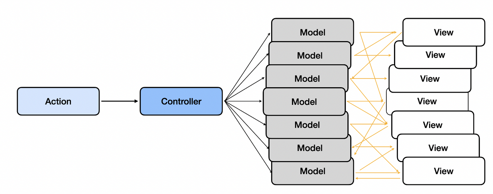
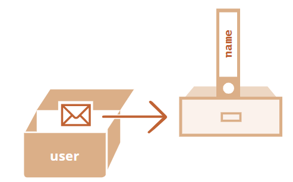
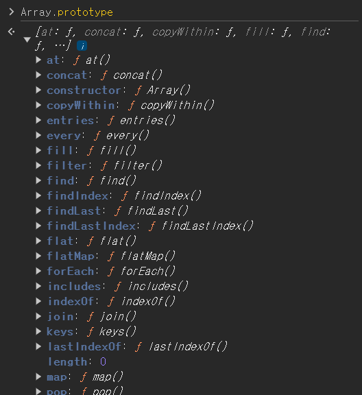
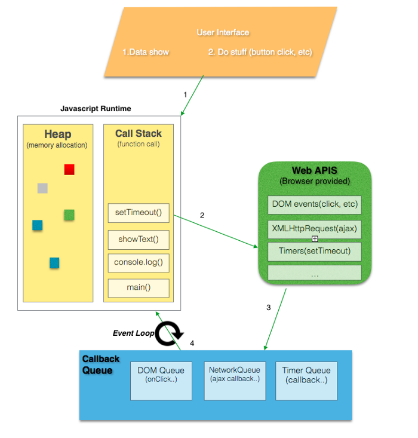

# 들어가며

## 왜 리액트인가 ?

리액트를 선호하는 이유

- 단방향 바인딩
  - 데이터의 흐름이 단방향(부모 → 하위 컴포넌트)
  - 장점 : 코드를 이해하기 쉽고, 데이터의 추적과 디버깅이 용이함
  - 단점 : 변화를 감지하고 업데이트하는 코드를 매번 작성해야 함

## 리액트의 역사

### 2010년대 프론트엔드 개발 환경을 향한 페이스북의 도전

2010년경 JS를 포함한 웹 생태계의 디자인 패턴

- 디자인 패턴 : 어플리케이션 설계 중 자주 발생하는 문제에 대한 모범답안
- MVC 패턴
  - Model-View-Controller의 약자
  - Model : 정보 및 데이터 관리하는 역할
  - View : 브라우저 화면, 사용자 인터페이스 요소 담당
  - Controller : 사용자 액션에 의해 이벤트 감지하고 처리하는 역할
  - DB에서 필요한 데이터를 불러온 다음, 웹 서버에서 HTML 페이지를 만들어 클라이언트에 제공하면, 프론트는 단순히 **서버에서 만든 HTML 페이지를 보여주고 간단한 폼 처리의 역할**을 함
    한계
  - 양방향 데이터 흐름을 가지고 있어, 연쇄적인 데이터 변화가 발생할 수 있음
  - 모델과 뷰의 업데이트 예측이 어려워짐
    
- 이러한 양방향 데이터 흐름을 보완하기 위해 단방향 데이터 흐름 제안
- 데이터가 한 방향으로 흐르기 때문에 각각의 구조가 서로 의지하지 않아 데이터 구조 파악과 흐름을 예측하기 용이함

---

# 1장 - 리액트 개발을 위해 꼭 알아야 할 자바스크립트

## [1-1] 자바스크립트의 동등 비교

- 리액트에서 JS의 동등 비교 기반
  - 리액트의 가상 DOM과 실제 DOM 비교
  - 리액트 컴포넌트가 렌더링 여부 판단
  - 변수,함수의 메모이제이션 등의 작업

### 1.1.1 자바스크립트의 데이터 타입

- JS의 모든 값은 데이터 타입을 가짐

**데이터 타입**

- 원시 타입 (7)
  - boolean
  - number
  - string
  - null
  - undefined
  - symbol
  - bigint
- 객체 타입 (1)
  - object

**원시 타입 (primiitive type)**

- 객체가 아닌 다른 모든 타입 의미

1. undefined

   - 선언한 후 값을 할당하지 않은 변수
   - 값이 주어지지 않은 인수에 자동으로 할당되는 값
   - 선언만 된 경우

   ```jsx
   let seo0;

   console.log(seo0); //undefined
   ```

2. null

   - 의도적으로 값이 없음을 할당한 경우에 사용
   - reference 변수에 대한 주소값이 없는 것을 표현

   ❓레퍼런스 변수 : 객체와 같이 힙(heap) 공유 메모리 영역에 저장되는 포인터

   - null은 다른 원시값과 달리 type

✨ null과 undefined의 차이점

내부 메모리적인 측면에서의 차이점

- undefined는 선언만 되고 값이 할당되지 않는 경우
- 변수는 메모리에 존재하지만 값이 없기 때문에 크기가 매우 작음
- 반면, null은 개발자가 의도적으로 값이 없음을 할당하는 경우
- 이때 변수는 빈 객체를 가리키는 객체 포인터이기 때문에 주소값을 나중에라도 받기 위해 크기가 있어 메모리를 차지함
- 즉, undefined 값을 가진 변수의 메모리 용량은 작고 상대적으로 null 값을 가진 변수의 메모리 용량은 크다. (차이가 크진 않음)

1. Boolean

- true, false
- true, false처럼 취급되는 truthy,falsy 값 존재
  - falsy - fasle, 0, NaN, “”(빈문자열), null, undefined
  - truthy - falsy로 취급되는 값 외 모두, 빈 객체와 빈 배열 포함

**객체 타입(object type)**

- 원시 타입 이외 모든 것 - 배열, 함수 등
- 참조를 전달한다고 해서 참조 타입(reference type)으로도 불림

### 1.1.2 값을 저장하는 방식의 차이

원시 타입


- 불변 형태의 값으로 저장
- 변수 할당 시점에 메모리 영역을 차지
- 변수의 실제 값을 저장

객체 타입



- 객체는 프로퍼티를 삭제, 추가, 수정할 수 있기 때문에 원시 값과 달리 변경 가능한 형태로 저장
- 객체의 참조값(주소값)을 저장
- 변수에 참조값을 저장하면 객체는 독립적인 메모리 공간(Heap)에 저장되고, 변수에 저장된 메모리 공간의 참조를 저장하게 된다.
- 즉, **변수의 값이 저장된 메모리의 주소**인 객체에 대한 참조값이 저장되는 것

### 1.1.3 자바스크립트의 또 다른 비교 공식, Object.is

- Object.is(x, y) : 두 개의 인수를 받고, 인수의 비교 결과를 반환하는 메서드
- 동등 비교 연산자(==)와의 차이점
  - 동등 비교는 양쪽이 같은 타입이 아니면 비교할 수 있도록 강제 형변환한 후 비교
  - Object.is는 타입이 다르면 그냥 false
- 일치 비교 연산자(===)와의 차이점

  - NaN비교와 +0, -0의 비교가 가능해짐

  ```jsx
  -0 === +0; // true
  Object.is(-0, +0); // false

  Number.NaN === NaN; // false
  Object.is(Number.NaN, NaN); // true

  NaN === 0 / 0; // false
  Object.is(NaN, 0 / 0); //true
  ```

- 객체 간 비교에 있어서는 ===과 동일

### 1.1.4 리액트에서의 동등 비교

- 리액트에선 object.is를 이용해 동등 비교를 함 . 구형 브라우저 지원을 위해 폴리필을 함께 사용

  ❓폴리필(Polyfill) : 최신 사양의 기능을 지원하지 않는 브라우저를 위해 누락된 최신 사양의 기능을 구현하여 추가하는 것

  - Object.is를 기반으로 동등 비교를 하는 shallowEqual 이라는 함수를 만들어 사용
  - 객체의 얕은 비교를 수행하는 함수

- Object.is로 먼저 비교를 수행한 다음, Object.is로 수행하지 못하는 비교,
- 즉, 객체 간 얕은 비교를 shallowEqual으로 한 번 더 수행한다.
  - 객체 간 얕은 비교 : 객체의 첫번째 깊이에 존재하는 값만 비교하는 것을 의미
  - 객체의 얕은 비교까지만 구현하는 이유는 JSX의 props가 객체이고, 이들 props만 일차적으로 비교하면 되기 때문이다.

## [1-2] 함수

### 1.2.1 함수란 무엇인가 ?

- 작업을 수행하거나 값을 계산하는 등의 과정을 표현하고, 이를 하나의 블록으로 감싸 실행 단위로 만들어 놓은 것
- 리액트에서 컴포넌트를 만드는 함수도 이 함수의 형태를 따름

```jsx
function Component(props) {
  return <div>{props.hello}</div>;
}
```

### 1.2.2 함수를 정의하는 4가지 방법

1️⃣ 함수 선언문

- JS에서 함수 선언 시 가장 일반적으로 사용하는 방식
  ```jsx
  function add(a, b) {
    return a + b;
  }
  ```
- 선언문은 선언만 하고, 어떠한 값도 표현하지 않았음
- 변수에 함수를 할당함으로서 JS 엔진이 표현식으로 해석
  - 같은 선언문으로 표현식으로도 사용될 수 있음
  ```jsx
  const sum = function add(a, b) {
    return a + b;
  };
  sum(10, 24); // 34
  ```

2️⃣ 함수 표현식

❓일급 객체

- 다른 객체들에 일반적으로 적용 가능한 연산을 모두 지원하는 객체
- 일급 객체 조건
  - 변수에 할당할 수 있다
  - 다른 함수를 인자로 전달 받는다
  - 다른 함수의 결과로서 리턴될 수 있다.
- 함수를 데이터 다루 듯 다룰 수 있다 = 변수에 할당이 가능하다
  ```jsx
  const sum = function add(a, b) {
    return a + b;
  };
  sum(10, 24); // 34
  ```

---

- 함수 표현식에서 함수명을 생략하는 것이 일반적
- add는 함수 내부에서만 유효

함수 표현식과 선언식의 차이

✅ 호이스팅

- 함수에 대한 선언을 실행 전에 미리 메모리에 등록하는 작업
- 함수를 선언한 코드 이전에 함수를 호출해도 정상 작동
- 코드의 순서에 상관없이 정상적으로 함수를 호출 가능
- 함수 표현식은 런타임 이전에 undefined로 초기화되고, 런타임 시점에 함수가 할당되어 작동함

함수 선언문 사용하는 경우

- 함수를 자유롭게 산언하고 어디서든 자유롭게 호출하고 싶은 경우
- 변수 선언과 다르게 명시적으로 함수를 구별하고 싶은 경우

3️⃣ Function 생성자

```jsx
const add = new Function("a", "b", "return a + b");
add(10, 24); // 34
```

- Function 생성자를 사용
- 매개변수 및 함수 로직을 문자열로 작성
- 권장되지 않는 방식

4️⃣ 화살표 함수

- ES6에서 추가된 문법
- function 키워드 대신 ⇒ 화살표 사용

  ```jsx
  cosnt add = (a, b) => {
  	return a + b
  }

  const add = (a, b) => a + b
  ```

✅ 일반 함수와의 차이점

- 생성자 함수로 화살표 사용 불가
- arguments 존재 X
- 화살표 함수에서 this는 상위 스코프의 this를 가리킴
  - this : 자신이 속한 객체나 자신이 생성할 인스턴스를 가리키는 값

### 1.2.3 다양한 함수 살펴보기

1️⃣ 즉시 실행 함수 (Immediately Invoked Funcion Expression, IIFE)

- 함수를 정의하는 동시에 즉시 실행되는 함수
- 단 한 번만 호출되며 재호출 불가

  ```jsx
  (fuction (a, b) {
  	return a + b
  }) (10, 24); // 34

  ((a, b) => a + b) (10, 24); // 34
  ```

- 독립적인 함수 스코프를 운용할 수 있음
- 코드를 읽는 이에게 이 함수가 다시 사용되지 않는다는 것을 각인시킬 수 있어 리팩토링에 도움
- 재사용되지 않고, 단 한 번만 실행되고 쓰이지 않는 경우 사용

2️⃣ 고차 함수

- 함수를 인수로 받거나 결과로 새로운 함수를 받환하는 함수

```jsx
const doubleArr = [1, 2, 3].map((item) => item * 2);
```

- 함수 컴포넌트를 인수로 받아 새로운 함수 컴포넌트를 반환하는 고차 함수를 만들 수 있음

### 1.2.4 함수를 만들 때 주의해야 할 사항

1️⃣ 함수의 부수 효과를 최대한 억제하라

- 함수의 부수 효과(side-effect)란 함수 내의 작동으로 인해 함수가 아닌 함수 외부에 영향을 끼치는 것
- 순수 함수 : 부수 효과가 없는 함수
  - 어떤 상황에서도 동일한 인수를 받으면 동일한 결과를 반환
- 비순수 함수 : 부수 효과가 있는 함수
- 컴포넌트 내부에서 API를 호출 → HTTP 요청에 영향
- console.log → 브라우저 콘솔 창에 영향
- 부수 효과를 만드는 것은 피할 수 없는 요소지만 부수 효과를 최대한 억제할 수 있는 방향으로 함수를 설계해야 함
- 리액트에서 부수 효과를 처리하는 훅인 useEffect() 작동 최소화
- useEffect 함수의 역할을 좁히고, 버그를 줄이며, 컴포넌트의 안정성을 높일 수 있음

2️⃣ 가능한 한 함수를 작게 만들어라

- 하나의 함수에서 많은 일을 하지 않게 하는 것
- 하나의 함수가 하나의 일을 하게 되면 함수의 재사용성을 높일 수 있음

3️⃣ 누구나 이해할 수 있는 이름을 붙여라

- 함수 이름은 간결하고 이해하기 쉽게 네이밍
- 직관적인 네이밍을 통해 해당 함수가 어떤 작업을 처리하는지 파악 용이

---

## 1.3 클래스

- 리액트 16,8 이전 버전까지는 클래스 컴포넌트
- 레거시 코드를 리팩토링하는 경우

### 1.3.1 클래스란 무엇인가 ?

JS의 클래스

- 특정 객체를 만들기 위한 일종의 템플릿과 같은 개념
- 특정 객체를 반복적으로 만들기 위해 사용
- 클래스로 하는 모든 것들을 함수로도 동일하게 표현 가능

constructor (생성자)

- 객체를 생성하는 데 사용하는 특수한 메서드
- 단 하나의 생성자만 존재하며 생략 가능
- new 키워드와 함께 객체를 생성하고 초기화하는 함수

```jsx
// Car 클래스 선언
class Car {
  // 생성자
  constructor(name) {
    this.name = name;
  }
}
```

프로퍼티

- 클래스로 인스턴스를 생성할 때 내부에 정의할 수 있는 속성값

✨ 인스턴스 (instance) : 생성자 함수를 통해 생성된 객체

```jsx
class Car {
  constructor(name) {
    this.name = name;
  }
}

// myCar 인스턴스
//  seo0 Car가 프로퍼티 !
const myCar = new Car("seo0 Car");
```

- 인스턴스 생성 시 constructor 내부에 기본적으로 빈 객체가 할당되어 있으며, 이 빈 객체에 프로퍼티의 키와 값을 넣어서 활용할 수 있는 것
- TS를 활용하면 접근 제한자 (public, private, protected 등) 사용 가능
- JS에서 기본적으로 모든 프로퍼티는 public (어디서든 접근 가능)

getter, setter

- getter
  - 값을 가져올 때 사용
  - get을 붙이고 getter 이름 선언
- setter
  - 클래스 필드에 값을 할당할 때 사용
  - set을 붙이고 setter 이름 선언

```jsx
class Car {
  constructor(name) {
    this.name = name;
  }

  get firstCharacter() {
    return this.name[0];
  }

  set firstCharacter(char) {
    this.name = [char, ...this.name.slice(1)].join("");
  }
}

const myCar = new Car("자동차");
myCar.firstCar; // 자
myCar.firstCar = "차"; // myCar.name : 차동차
```

인스턴스 메서드

- 클래스 내부에서 선언한 메서드
- 새롭게 생성한 객체에서 인스턴스 메서드에 접근 가능
- 프로토타입에 선언됐기 때문

```jsx
class Car {
  constructor(name) {
    this.name = name;
  }

  // 인스턴스 메서드 정의
  hello() {
    console.log(`안녕하세요 ${this.name}입니다`);
  }
}
const myCar = new Car("자동차");
myCar.hello(); // 안녕하세요 자동차입니다
```

### ✨프로토타입

- 자바스크립트는 프로토타입 기반 언어(prototype-based language)
- 클래스 기반 언어에는 클래스 내부에 모든 속성과 메소드가 정의되어 있음
  - 객체가 인스턴스로 생성되면 이 객체는 클래스 내부에 정의되어 있는 속성과 메소드에 접근하여 사용할 수 있음
  - 프로포타입은 이런 클래스와 유사함 !
- 모든 객체는 자신의 부모 역할을 하는 객체와 연결되어 있음 (= 모든 객체는 프로토타입을 가짐)
- 자신의 부모 역할을 하는 프로토타입 객체의 프로퍼티나 메소드에 접근할 수 있음
- 프로토타입 체인 :
  - 특정 속성을 찾을 때까지 자기 자신부터 시작해서 이 프로토타입을 타고 최상위 객체인 Object까지 훑음
    ```jsx
    var seo02 = [3, 2, 1];
    seo02.length(); // 3
    ```
    - 난 length를 선언하지 않았는데 ?!?
    - 배열에서 sort(), length() 등 기본 함수들을 사용할 수 있는 이유가 뭐냐
    - 프로토타입 체이닝을 거쳐 부모 (Array)에 정의되어 있는 메소드를 호출한 것
      

[프로토타입 참고 영상](https://www.youtube.com/watch?v=wUgmzvExL_E)

정적 메서드

- 클래스의 인스턴스가 아닌 이름으로 호출할 수 있는 메서드

  ```jsx
  class Car {
    static hello() {
      console.log("하이");
    }
  }
  const seo0 = new Car();

  seo0.hello(); // error
  Car.hello(); // 하이
  ```

- 정적 메서드 내부의 this는 클래스로 생성된 인스턴스가 아닌 클래스 자신
- 인스턴스를 생성하지 않아도 사용 가능
- 전역에서 사용하는 유틸 함수를 정적 메서드로 많이 활용함

상속

- 클래스를 상속받아 자식 클래스에서 상속받은 클래스를 기반으로 확장

```jsx
class Car {
  constructor(name) {
    this.name = name;
  }

  honk() {
    console.log(`${this.name} 빵빵 ~ `);
  }
}

class Truck extends Car {
  constructor(name) {
    // 부모 클래스의 생성차 호출
    super(name);
  }

  // 확장 (부모 클래스에 없는 함수 추가)
  load() {
    console.log(`${this.name}에 짐 싣는 중`);
  }
}

const myCar = new Car("자동차");
myCar.honk(); // 자동차 빵빵 ~

const truck = new Truck("트럭");
truck.honk(); // 트럭 빵빵 ~
truck.load(); // 트럭에 짐 싣는 중
```

- Car를 상속한 Truck에서 Truck이 정의하지 않은 honk 메서드를 사용
- 부모 클래스를 기반으로 확장된 클래스 생성

### 1.3.2 클래스와 함수의 관계

- 클래스는 ES6에서 나온 개념
- 클래스가 작동하는 방식은 JS의 프로포타입을 기반으로 작동하는 것

### 1.3.3 정리

- 클래스 컴포넌트에 어떻게 생명주기를 구현했는지
- 클래스 컴포넌트 생성을 위해 React.Copmonent 등을 상속하는지 이해할 수 있을 것

---

## 1.4 클로저

- 함수 컴포넌트의 구조와 작동 방식, 훅의 원리, 의존성 배열 등의 함수 컴포넌트 기술이 클로저에 의존함

### 1.4.1 클로저의 정의

- 함수와 함수가 선언되었을 때의 어휘적 환경의 조합
  - 자신이 선언된 당시의 환경을 기억하는 함수
  - 생명 주기가 끝난 외부 함수의 변수에 접근할 수 있는 내부 함수
- 내부 함수는 외부 함수의 지역 변수에 접근할 수 있음

### 1.4.2 변수의 유효 범위, 스코프

- 변수의 유효 범위 (Scope)

전역 스코프

- 전역 스코프(global scope) : 전역 레벨에 선언한 것
- 어디서든 호출할 수 있음

```jsx
var seo0 = "서영";

function hello() {
  console.log(`하이 ${seo0}`);
}

console.log(seo0); //서영
hello(); // 하이 서영
```

함수 스코프

- JS는 함수 레벨 스코프
- { } 블록이 스코프를 결정하는 것이 아닌 함수 레벨 스코프를 따름
- 새로운 함수가 생성될 때마다 새로운 스코프가 발생
- 함수 내에서 선언한 변수는 해당 함수에서만 접근 가능
  ```jsx
  if (true) {
    var seo0 = "서영";
  }
  seo0; // 서영
  ```
  - 함수가 선언되어 있지 않기 때문에 새로운 스코프가 형성이 되지 않고 동일한 실행 컨텍스트 내에 존재하는 것
  ```jsx
  function hello() {
    var seo0 = "서영";
  }
  seo0; // ReferenceError
  ```
  - 함수 생성과 동시에 hello함수에 대한 샐행 컨텍스트가 생성되고 ,
  - 이 실행 컨텍스트 내부에 존재하는 변수 환경에 seo0 변수가 저장
  - 함수 외부에서 접근할 시 스코프가 다르기 때문에 접근 불가
- JS에서 스코프는 가장 가까운 스코프에서 변수가 존재하는지 확인 후 없으면 상위 스코프 변수에 접근

### 1.4.3 클로저의 활용

```jsx
function outerFunction() {
  var x = "hello";
  function innerFunction() {
    console.log(x);
  }

  return innerFunction;
}

const innerFunction = outerFunction();
innerFunction(); // 'hello'
```

- outerFunction 은 innerFunction 함수를 반환함
- 반환된 함수 내에 x라는 변수는 없지만 해당 함수가 선언된 어휘적 환경 덕분에 x 변수에 접근할 수 있는 것 !

useState가 전역 레벨이라면 ?

- 누구나 접근해서 수정할 수 있다는 것
- 리액트가 관리하는 내부 상태 값은 별도로 관리하는 클로저 내부에서만 접근 가능
- 클로저를 활용해서 전역 스코프의 사용을 막고 개발자가 원하는 방향으로 노출시킬 수 있음
- 사이드 이팩트를 최대한 억제하여 오류를 피하고 프로그램의 안정성을 높이는 데 클로저가 사용됨

리액트에서의 클로저

```jsx
function Component() {
  const [state, setState] = useState();

  function handleClick() {
    // useState 호출은 위에서 끝남
    // setState는 계속 내부의 최신값(prev)를 알고 있음
    // 이는 클로저를 활용했기 때문에 가능
    setState((prev) => prev + 1);
  }
}
```

- 내부 함수 setState 에서 외부 함수 useState 호출이 끝났음에도
- 자신이 선언된 외부 함수가 선언된 환경을 기억하기 때문에 state 값을 사용할 수 있는 것

### 1.4.4 주의할 점

- 클로저는 생성될 때마다 내부 함수는 외부 함수의 선언적 환경을 기억해야 하기 때문에 클로저를 사용하는 데는 비용이 듦
- 클로저에 불필요한 작업을 남겨두면 메모리를 불필요하게 사용할 수 있으며
- 클로저 사용을 적절한 스코프로 지정하지 않으면 성능에 악영향을 미치기 때문에 클로저를 사용할 때 주의 필요 !

### 1.4.5 정리

- 클로저는 함수형 프로그래밍의 중요한 개념, 부수 효과(사이드 이펙트)가 없고 순수해야 한다는 목적을 달성하기 위해 적극적으로 사용되는 개념

---

## 1.5 이벤트 루프와 비동기 통신의 이해

- JS는 싱글 스레드 기반의 언어
- 한 번에 하나의 작업만 동기 방식으로 처리

✅동기(synchronous)

- 직렬 방식으로 작업을 처리하는 것
- 요청이 시작된 이후 무조건 응답을 받은 이후에 다른 작업을 시작하는 것
- 하나의 코드의 작업이 완료된 후 다음 코드가 실행 (Run-to-completion)
- 한 번에 많은 작업을 처리할 수 없는 문제 !

✅비동기(asynchronous)

- 병렬 작업으로 작업을 처리하는 것
- 동기와 반대로 응답을 받기 전에도 다른 작업을 실행하는 것
- 즉, 동시에 다양한 작업을 실행할 수 있음

JS는 싱글 스레드에서 동기 방식으로 작동하지만, 많은 양의 비동기 작업이 이루어 지고 있다. 어떻게 가능한 것일까 ??

### 1.5.1 싱글 스레드 자바스크립트

- 과거 프로그램 실행 단위 : 프로세스

✅ 프로세스(process)

- 프로그램을 구동해 프로그램의 상태가 메모리상에서 실행되는 작업 단위
- 하나의 프로그램은 하나의 프로세스를 가지고, 그 프로세스 내부에서 모든 작업이 처리됨
- 하나의 프로그램에서 동시에 여러 개의 복잡한 작업을 수행해야 함
- 그래서 탄생한 더 작은 실행 단위가 스레드(thread)

✅ 스레드 (thread)

- 하나의 프로세스에서 여러 개의 스레드를 만들 수 있으며
- 스레드끼리는 메모리를 공유해서 여러 가지 작업을 동시에 수행 가능
- 프로세스 내부에서 여러 개의 스레드를 활용하면 동시 다발적 작업 처리 가능

근데 왜 JS는 싱글 스레드로 설계됐을까 ?

- 멀티 스레드의 단점
  - 내부적으로 처리 복잡
  - 스레드는 하나의 프로세스에 동시에 서로 같은 자원에 잡근하는데(메모리 공유)
  - , 동시에 여러 작업을 수행하면 같은 자원에 대해 여러 번 수정하는 등 동시성 문제에 대한 처리가 필요함
  - 하나의 스레드에 문제가 생기면 같은 자원을 공유하는 다른 스레드에도 문제 발생 가능
- 자바스크립트는 아주 간단한 처리를 하는 데만 사용되었기 때문에 문제를 야기할 수 있는 멀티 스레드가 필요하지 않았음

```jsx
console.log(1);

setTimeout(() => {
  console.log(2);
});

setTimeout(() => {
  console.log(3);
});

console.log(4);
```

- 예상 : 싱글 스레드 언어이기 때문에 콘솔에는 1,2 (0.1 초 후) 3, 4
- 결과 : 1,4,2,(0.1초 후) 3
- 동기식으로 작동하는 JS에서 비동기를 처리하는 방법이 뭘까 ?

### 1.5.2 이벤트 루프란 ?

- JS는 싱글 스레드 기반의 언어
- JS 엔진은 하나의 호출 스택만을 사용 : 요청이 동기적으로 처리되어 한 번에 한 가지일만 처리
- JS가 구동되는 환경(node.js, 브라우저)은 여러 스레드가 사용됨
- 여러 스레드가 사용되는 구동 환경이 JS 엔진과 연동하기 위해 사용되는 장치가 이벤트 루프 !
- = 비동기 실행을 돕는 장치

브라우저 환경의 구조



- 자바스크립트 엔진
  - **Heap** : 객체가 저장되는 메모리 공간. 크기가 동적으로 변하는 값들의 참조 값을 갖고 있음
  - **Call Stack**(호출 스택) : JS에서 수행해야 할 코드나 함수를 순차적으로 담아두는 스택
- Web API or Browser API
  - 웹 브라우저에 구현된 API
  - DOM event, AJAX, Timer 등
- ✨ 이벤트 루프
  - 콜백 큐와 콜 스택을 보며 콜 스택에 수행해야 할 작업이 있는지 확인하고 수행할 코드가 있다면 JS 엔진을 통해 실행
  - 이벤트 루프가 큐의 첫번째 태스크를 가져오는 것이 아니라, 태스크 큐에서 실행이 가능한 첫번째 태스크를 가져오는 것으로 태스크 중 가장 오래된 태스크를 가져옴
  - 코드를 실행하는 작업과 콜 스택이 비어있는지 확인하는 작업이 단일 스레드에서 일어남

✅ 비동기 동작 원리

- JS 엔진의 콜 스택에 실행될 함수가 쌓이고 web API 를 호출
- Web API는 콜백 함수를 콜백 큐(태스크 큐)에 추가
- 이벤트 루프는 콜백 큐와 콜 스택을 보며 콜 스택이 비면 콜백 큐(태스크 큐)의 함수를 꺼내 콜 스택에 넣음 !

Ex) `setTimeout( )`

- 코드가 동기식으로, 순차적으로 콜 스택에 들어감
- setTimeout() 을 만나면 타이머 이벤트가 실행되며 태스크 큐로 들어가고 콜 스택에서 제거됨
- 콜 스택에서 있던 코드들이 순서대로 실행되고 제거
- 콜 스택이 텅텅 빔
- 이벤트 루프가 콜 스택이 빈 것을 확인하고, 태스크 큐를 확인해보니 setTimeout 함수가 있음
- 이것을 콜 스택으로 보냄
- 해당 코드를 실행하고 콜 스택에서 제거 !

태스크 큐

- 실행해야 할 태스크의 집합
- 자료구조는 큐가 아닌 set 형태
  - 큐 : FIFO , 선입선출

❓ 그렇다면 비동기 함수는 누가 수행하는가

- JS 코드가 동기식으로 실행되는 메인 스레드가 아닌 태스크 큐가 할당되는 별도의 스레드에서 수행
- 브라우저 or Node.js 가 수행
- JS 코드는 싱글 스레드에서 실행 but, 외부 Web API 등은 JS 코드 외부에서 실행되고 콜백이 태스크 큐로 들어가는 것

### 1.5.3 태스크 큐와 마이크로 태스크 큐


### ✨ 태스크 큐

- 마이크로태스크 큐 (microtask queue)
  - Promise
- 매크로태스크 큐 (task queue = macrotask queue)
  - setTimeout, setInterval
- 둘다 콜백 함수나 이벤트 핸들러를 일시 저장한다는 점에서 동일하지만
- 매크로보다 마이크로 우선순위가 더 높음 (마이크로 > 매크로)
- 즉, 이벤트 루프는 콜 스택이 비면 먼저 마이크로 큐에서 대기하고 있는 함수 실행
- 이후 마이크로 큐가 비면 매크로태스크 큐에 대기하고 있는 함수를 실행

---

#

---

## 1.6 리액트에서 자주 사용하는 자바스크립트 문법

- 객체의 얕은 동등 비교 문제를 피하기 위해 객체 분해 할당 등 일반적인 자바스크립트 코드에서 잘 사용하지 않는 코드들이 많음
- 리액트의 특징을 이해하기 위해선 자바스크립트 문법에 대한 이해가 기반이 되어야 함
- 모든 브라우저와 자바스크립트 런타임이 항상 새로운 자바스크립트 문법을 지원하지 않음
- 자바스크립트의 최신 문법을 다양한 브라우저에서도 일관적으로 지원할 수 있도록 트랜스파일하는 것이 바벨
- 바벨이 어떻게 최신 코드를 트랜스파일하는지 파악하는 것이 디버깅에 도움될 것

### 1.6.1 구조 분해 할당

- 배열, 객체의 값을 별도의 선언문 없이 바로 분해해서 개별 변수에 바로 할당하는 것을 의미

**📍 배열 구조 분해 할당**

예시

```jsx
const arr = [1, 2, 3, 4, 5];

const [first, second, third, ...rest] = arr;
// first 1
// second 2
// third 3
// rest [4, 5]
```

✅ useState()

- value와 이 value를 바꾸는 setter 함수를 가진 배열을 리턴
  ```jsx
  const [seo0, setSeo0] = useState();
  ```
- 객체가 아닌 배열을 반환하는 이유 ?

  - 객체 구조 분해 할당은 속성명을 변경하는 것이 번거로움
  - 배열은 자유롭게 이름을 선언할 수 있음

- ( , ) 의 위치에 따라 값이 결정됨
  - 2, 3, 4는 할당될 변수가 없으므로 생략 !
  - 이 방법을 실수 유발할 가능성이 높기 때문에 크기가 작은 배열에서만 사용 권장

```jsx
const arr = [1, 2, 3, 4, 5];

const [first, , , , fifth] = arr;
// first 1
// fifth 5
```

- 기본값 선언 가능

  - 배열의 수와 맞지 않게 값을 넣어주면 c는 undefined
  - 에러를 방지하기 위해 기본값을 설정해줄 수 있음
    ```jsx
    const [a, b, c] = [1, 2];
    // c undefined
    ```
  - undefined일 때만 기본값 할당됨 (null은 null)
    ```jsx
    const arr = [1, 2];
    const [a = 10, b = 3, c = 7] = arr;
    // a 1
    // b 3
    // c 7
    ```

- 전개 연산자 (spread operator)

  - 특정값 이후의 값을 배열로 선언하고 싶을 때 사용
  - 나머지 모든 값을 해당 변수에 배열로 할당되기 떄문에 뒤쪽에서만 사용 가능

  ```jsx
  const arr = [1, 2, 3, 4, 5];

  const [first, ...rest] = arr;
  // first 1
  // rest [2, 3, 4, 5]
  ```

- 배열 구조 분해 할당은 바벨에서 어떻게 트랜스파일 될까 ?

```jsx
const arr = [1, 2, 3, 4, 5];
const [first, second, third, ...rest] = arr;

// 바벨 트랜스파일
var arr = [1, 2, 3, 4, 5];
var first = arr[0],
  second = arr[1],
  third = arr[2],
  rest = arr.slice(3);
```

**📍 객체 구조 분해 할당**

- 객체에서 값을 꺼내온 뒤 할당

  - 인덱스를 이용해 인덱스의 순서대로 변수에 값을 할당하는 배열 구조 분해 할당
  - 과 달리 **key 값을 기준**으로 객체를 분해해서 변수에 할당
  - 즉, 순서를 상관하지 않아도 됨

  ```jsx
  const user = { name: "seo02", age: 25 };

  // 동일
  const { name, age } = user;
  const { age, name } = user;
  ```

- 새로운 변수 이름으로 할당

  - name, age 라는 key 값을 변수의 이름으로 사용하지 않고 새로운 변수명에 할당할 경우
  - : (클론) 이용

  ```jsx
  const user = { name: "seo02", age: 25 };
  const { name: a, age: b } = user;
  // a "seo02"
  // b 25
  ```

- 기본값 설정 가능
  - 변수의 수가 객체 프로퍼티의 수보다 많은 경우
  - undefined가 할당되는 변수에 기본값 설정
  ```jsx
  const user = { name: "seo02", age: 25 };

  const { name, age, address = "Uijeongbu" } = user;
  ```
- 리액트에서 props에서 값을 바로 꺼내올 때 사용

  - props 는 객체 !
  - 구조 분해 할당을 사용하지 않은 경우

  ```jsx
  function SeoYoung(props) {
    return (
      <>
        <h1>props.user.name</h1>
        <p>props.user.age</p>
      </>
    );
  }
  ```

  - 구조 분해 할당을 사용한 경우

  ```jsx
  function SeoYoung({ user }) {
    return (
      <>
        <h1>user.name</h1>
        <p>user.age</p>
      </>
    );
  }
  ```

- 계산된 속성 이름 방식
  - 단순히 값으로 꺼내오는 것뿐만 아니라 변수에 있는 값으로 꺼내오는 방식
  - 변수를 속성 이름으로 사용
  - 대괄호 [ ] 안에서 표현식을 허용하며 표현식은 프로퍼티명으로 사용됨
  - 계산된 속성 이름을 사용하려면 : a와 같은 변수 네이밍이 필요
  - [key]로 값을 꺼내기만 했을 뿐, 어느 변수명으로 할당해야 하는지 알 수 없기 때문
  - [참고 블로그](https://xionwcfm.tistory.com/242)
  ```jsx
  const key = "a";
  const seo0 = { a: "123", b: "456" };

  const { [key]: a } = seo0;
  // a = 123
  ```
- 전개 연산자 (spread operator)

  - 전개 연산자는 뒤쪽에서 사용 가능

  ```jsx
  const obj = {
    a: 1,
    b: 1,
    c: 1,
    d: 1,
    e: 1,
  };

  const { a, b, ...rest } = obj;
  // a 1
  // b 1
  // rest {c:1, d:1, e:1}
  ```

- 객체 구조 분해 할당은 바벨에서 어떻게 트랜스파일 될까 ? (87 페이지 참고)
  - 배열 구조 분해 할당과 달리 굉장히 복잡
  - 번들링 크기가 상대적으로 많이 큼
  - 개발 환경이 ES5만 지원한다면 객체 구조 분해 할당을 꼭 써야 하는지 판단해야 함

### 1.6.2 전개 구문 (Spread Syntax)

- 이름 그대로 객체 혹은 배열을 펼칠 수 있음

**📍 배열의 전개 구문**

- 전개 구문 없이 배열 합성하는 경우

```jsx
const arr1 = [1, 2, 3];
const arr2 = [4, 5, 6];
const arr3 = [7, 8, 9];
const arrWrap = arr1.concat(arr2, arr3);

console.log(arrWrap); // [1, 2, 3, 4, 5, 6, 7, 8, 9]
```

- 전개 구문 활용하여 배열 합성하는 경우

```jsx
const arr1 = [1, 2, 3];
const arr2 = [4, 5, 6];
const arr3 = [7, 8, 9];
const arrWrap = [...arr1, ...arr2, ...arr3];

console.log(arrWrap); // [1, 2, 3, 4, 5, 6, 7, 8, 9]
```

- 요소가 같은 배열을 하나 더 만들 고 싶은 경우
  - 배열 자체를 할당해주면 내부 요소값이 아닌 참조를 복사
  - 첫번째 방식 기존 배열에 영향을 미침
  - 객체도 동일

```jsx
const arr1 = ["a", "b"];
const arr2 = arr1;

arr1 === arr2; // true

const arr2 = [...arr1];

arr1 === arr2; // false 서로 다른 주소 값을 가진 독립적인 배열 !
```

🤔 아까 … 연산자는 뒤쪽에서 쓰라면서요 ?

- 스프렌드 연산자는 무조건 뒤쪽에서 쓰는 것이 아님
- 그건 나머지 요소를 할당을 받는 경우 ! !
- 이건 전개 연산자를 통해 할당하는 경우니까 잘 구분할 것

**📍 객체의 전개 구문**

- 전개 구문 없이 객체 합성하는 경우
  - 객체 프로퍼티가 아닌 객체 자체가 들어가서 2차원 객체가 됨

```jsx
const obj1 = {
  a: "A",
  b: "B",
};
const obj2 = {
  c: "C",
  d: "D",
};
const objWrap = { obj1, obj2 };
/*
{
  obj1: { a: 'A', b: 'B' },
  obj2: { c: 'C', d: 'D' }
}
*/
```

- 전개 구문 활용하여 객체 합성하는 경우

```jsx
const obj1 = {
  a: "A",
  b: "B",
};
const obj2 = {
  c: "C",
  d: "D",
};
const objWrap = { ...obj1, ...obj2 };
/*
{
  a: 'A', b: 'B',c: 'C', d: 'D'
}
*/
```

- 객체 합성

```jsx
const user = {
  name: "서영",
  age: 25,
};

const info = {
  address: "Uijeongbu",
};

const seo0 = { ...user, ...info }; // {name: '서영', age: 25, address: 'Uijeongbu'}
```

- 객체의 프로퍼티를 복사해오면서 추가로 프로퍼티 작성할 수도 있음

```jsx
const user = {
  name: "서영",
  age: 25,
};

const seo0 = {
  ...user,
  address: "Uijeongbu",
}; // {name: '서영', age: 25, address: 'Uijeongbu'}
```

- 객체 전개 구문의 순서
  - 전개 구문 이후에 값 할당이 있을 경우 값이 덮어씌워짐

```jsx
const obj = {
  a: 1,
  b: 1,
  c: 1,
  d: 1,
  e: 1,
};

const obj1 = { ...obj, c: 10 }; // {a:1,b:1,c:10,d:1,e:1}
const obj2 = { c: 10, ...obj }; // {a:1,b:1,c:1,d:1,e:1}
```

- 전개 구문은 바벨에서 어떻게 트랜스파일 될까 ? (89 ~ 91 페이지 참고)
  - 객체 분해 할당 트랜스파일 결과와 비슷하게 코드가 커짐
  - 트랜스파일 해야 하는 환경일 경우 유의해서 사용할 것

### 1.6.3 객체 초기자

- 객체를 선언할 떄 객체에 넣고자 하는 키와 값을 가지고 있는 변수가 이미 존재한다면 해당 값을 간결하게 넣어줄 수 있는 방식

```jsx
const first = 1;
const second = 2;

// 객체 초기자
const numbers = {
  first,
  second,
};

// {first: 1 , second: 2}

const numbers = {
  first: first,
  second: second,
};
```

### 1.6.4 Array 프로토타입의 메서드 : map, filter, reduce, forEach

- ES5부터 사용한 문법이기 때문에 별도의 트랜스파일, 폴리필 없이 사용

**📍 Array.prototype.map**

- 인수로 전달받은 배열과 똑같은 길이의 새로운 배열 리턴
- 배열의 요소를 순회하면서 콜백으로 연산한 결과로 구성된 새로운 배열을 만들 수 있음

```jsx
const arr = [1, 2, 3, 4, 5];
const doubleArr = arr.map((item) => item * 2);
// [2,4,6,8,10]
```

- 리액트
  - 배열을 순회하면서 리액트 요소를 리턴할 때 사용됨

```jsx
const arr = [1, 2, 3, 4, 5];
const Elements = arr.map((item) => {
  return <Fragment key={item}>{item}</Fragment>;
});
```

**📍 Array.prototype.filter**

- 콜백 함수를 인수로 받으며, 이 콜백 함수에서 조건을 만족하는 요소들의 새로운 배열을 리턴 (필터링)

```jsx
const arr = [1, 2, 3, 4, 5];
const evenArr = arr.filter((item) => item % 2 === 0);
// [2 , 4]
```

**📍 Array.prototype.reduce**

```jsx
arr.reduce(callback(accumulator, currentValue, index, array), initialValue);
// 배열.reduce(callback(누적값, 현재값, 인덱스, 요소), 초기값);
```

reduece 인수

- callback function
  - 4개의 인수를 가짐
    - **accumulator :** callback함수의 반환값을 누적
    - **currentValue :** 배열의 현재 요소
    - **index**(Optional) - 배열의 현재 요소의 인덱스
    - **array**(Optional) - 호출한 배열
  - 콜백 함수의 리턴값은 **accumulator**에 누적되어 최종적으로 하나의 값을 리턴
- initalValue (초기값)
  - 초기값을 명시하지 않는 경우 배열의 첫번째 요소를 사용 (빈 배열이면 에러)

```jsx
const arr = [1,2,3,4,5]
const sum = arr.reduce((result , item) => {
	return result + item
}, 0)
// 0 + 1 => 1
// 1 + 2 => 3
// 3 + 3 => 6
// 6 + 4 => 10
**// 10 + 5 => 15**
```

- 단순 합계를 구하는 것뿐만 아니라 배열을 하나의 객체로 변환하는 등에서 사용
- filter,map의 작동을 reduce로도 구현 가능하나, reduce는 상대적으로 코드가 직관적이지 않아서 짧은 코드라면 filter와 map을 사용하는 것도 좋음

**📍 Array.prototype.forEach**

- 콜백 함수를 받아 배열을 순회하며 그 콜백 함수를 실행하는 메서드

```jsx
const arr = [1, 2, 3, 4, 5];

arr.forEach((item) => console.log(item));
// 1,2,3,4,5
```

- forEach는 반환값이 없음 (undefined)
- forEach는 실행되는 순간 에러를 던지거나 프로세스를 종료하지 않는 이상 순회를 멈출 수 없음(return, break 등 )

### 1.6.5 삼항 조건 연산자

```
조건문 ? true일 때 값 : false일 때 값
```

- 기존 if문을 간략하게 쓸 수 있음
- 주로, 리액트에서 조건부 렌더링에 사용

```jsx
export default function Dev() {
  const [isLogin, setIsLogin] = useState(true);

 // 삼항 연산자
  return (
    <div>
      {isLogin ? <p>로그인 되었습니다.</p> : <p>로그인이 필요합니다.</p>}
    </div>
  );
  // if문
  <div>
  if (isLogin) {
	  return
	      <p>로그인 되었습니다.</p>
  )
  } else {
		 return
	      <p>로그인 필요합니다.</p>
  }
  </div>
  // && 연산자 - true일 경우만 보임
   return (
    <div>
      {isLogin && <p>로그인 되었습니다.</p>}
    </div>
  );
}
```

---

## 1.7 선택이 아닌 필수, 타입스크립트

### 1.7.1 타입스크립트란 ?

- 자바스크립트는 동적 타이핑 언어이기 때문에 런타임 이전에 오류를 확인할 수 없음
- 개발자들이 코드를 자유롭고 유연하게 쓸 수 있다는 장점이 있지만,
- 디버깅이 어렵고, 오류가 있더라도 코드가 실행되고 런타임에 오류가 발생하는 등의 한계가 있음

타입스크립트

- TypeScript is JavaScript with syntax for types : JS 문법에 타입을 가미한 것

```jsx
function calculator(a, b) {
  return a * b;
}

calculator(5, 5); //25
calculator("서", "영 "); // NaN
```

- 나눗셈 연산은 숫자일 때만 가능하고 그 외 경우에는 개발자가 원치 않는 결과가 나옴
- 이런 오류를 방지하기 위해 자바스크립트의 typeof로 타입 체크를 할 수 있지만
- 모든 코드에 typeof로 타입을 체크하는 것은 굉장히 번거로운 일
  - 이러한 JS 의 한계를 벗어나 타입 체크를 런타임이 아닌 코드를 빌드하는 시점에 수행할 수 있게 함

```jsx
function calculator(a: number, b: number) {
  return a * b;
}
calculator("서", "영 "); // error
```

- 타입스크립트는 자바스크립트의 확장판(superSet)
  - 타입스크립트는 최종적으로 자바스크립트 런타임 환경에서 실행되기 때문에 JS에서 불가능한 코드는 TS에서도 불가함

### 1.7.2 리액트 코드를 효과적으로 작성하기 위한 타입스크립트 활용법

**✅ any 대신 unknown을 사용하자**

📍any

- 어떤 것이든지, 누구든지 - 어떤 타입이든
- any는 JS와 똑같은 상태로 만들어주는 것으로
- 타입스크립트의 정적 타이핑 이점을 버리는 것과 다름 없음
- any는 정말 불가피할 때만 사용할 것.
- 대신 타입을 아직 단정할 수 없는 경우에는 unknown을 사용하는 것이 좋다.

📍unknown

- 알 수 없다, 모른다
- 모든 값을 할당할 수 있는 top type으로 어떠한 값도 할당할 수 있음

🤔 any와 다른 점 ?

- any와 동일하게 여러가지 타입의 값을을 허용하지만, unknwon 타입이 지정된 변수의 값과 다른 타입의 값에 할당하려고 할 때 컴파일 에러 발생
  ```tsx
  let str: unknown = "this is msg";
  let num: number = 10;
  num = str;
  //num은 number 타입이라 str 대입 불가

  let str2: any = "this is msg";
  let num2: number = 10;
  num2 = str2;
  //num2는 number 타입이지만 str2로 인해 대입가능
  ```
- 사용하는 쪽에서 방어처리를 해서 안전하게 사용이 가능

📍never

- any 타입이 타입의 전체 집합이라면 never 타입은 공집합(비어있는 집합)
- 어떤 타입도 never 타입에 들어올 수 없음

```tsx
type what1 = string & number;
type what2 = ("hello" | "hi") & "react";
```

- string과 number 둘 다 만족시키는 타입은 존재하지 않음
- 이렇게 코드상으로 존재가 불가능한 타입을 나타날 때 사용

🤔 never를 사용하는 경우

- 타입스크립트로 클래스 컴포넌트를 선언할 때 props는 없지만 state가 존재하는 상황해서 어떤 props도 받지 않겠다는 뜻으로 사용 가능 (103 페이지 참고)

**✅ 타입 가드를 적극 활용하자**

- 타입 가드는 조건문 안에서 타입 범위를 한정시켜줄 수 있는 방법
- typeof, instanceof 연산자를 활용

📍instanceof

- 지정한 인스턴스가 특정 클래스의 인스턴스인지 확인할 수 있는 연산자
- = 객체가 특정 클래스에 속하는지 확인할 수 있는 연산자
- [코드 1.19] 에러에 따른 처리를 위해 사용되고 있음

📍typeof

- 피연산자의 타입을 판단해서 문자열로 리턴

```tsx
function testFunc(seo0: string | number) {
  if (typeof seo0 === "string") {
    seo0.substring(3);
  }
}
```

- 유티온 타입을 통해 string이나 number 타입을 받을 수 있음
- 타입 가드를 통해 타입을 좁혀서 string 타입에 한정해서 사용할 코드를 안전하게 작성

📍in

- 어떤 객체에 키가 존재하는지 확인
- property in object

```tsx
interface Student {
  age: number;
  score: number;
}

interface Teacher {
  name: string;
}

function doSchool(person: Student | Teacher) {
  if ("age" in person) {
    //..
  }
  if ("name" in person) {
    //..
  }
}
```

- 특정 객체에만 있는 프로퍼티를 확인해서 해당 변수가 어떤 타입인지 알 수 있음
- 타입에 여러 객체가 존재할 수 있는 경우 유용

**✅ 제네릭**

- 함수나 클래스 내부에서 단일 타입이 아닌 다양한 타입에 대응할 수 있도록 도와주는 도구
- 사용 시점에 타입을 선언하는 것
- 타입만 다르고 비슷한 작업을 하는 컴포넌트를 제네릭 컴포넌트로 선언해서 타입이 고정되는 것을 방지하고, 재사용 가능한 요소를 만들 수 있음

```tsx
function add(x: string, y: string): string;
function add(x: number, y: number): number;
function add(x: any, y: any) {
  return x + y;
}

add(1, 2); // 3
add("hello", "world"); // 'helloworld'

// 제네릭 사용
function add<T>(x: T, y: T): T {
  return x + y;
}

add<number>(1, 2);
add<string>("hello", "world");
```

🤔 리액트에서는 제네릭을 언제 사용 ?

- useState()에 제네릭으로 타입을 선언해주면 state 사용과 기본값 선언을 명확하게 할 수 있음
- 기본값을 넘기지 않으면 undefined로 추론해 버리는 문제 발생하니 주의

```tsx
function Componenet() {
  const [state, setState] = useState<string>("");
}
```

- 제네릭을 하나 이상 사용할 수도 있음
- 제네릭은 T,U로 많이 표현하는데 이 경우 제네릭이 의미하는 바를 명확히 알 수 없으니 적절한 네이밍 필요

**✅ 인덱스 시그니처**

```tsx
type Hello = {
  // 인덱스 시그니처
  [key: string]: string;
};

const hello: Hello = {
  hello: "hello",
  hi: "hi",
};

hello["안녕"]; // undefined
```

- string 타입의 키와 값을 가진다는 뜻
- 키 범위가 string으로 너무 크기 때문에 존재하지 않는 키로 접근하면 undefined를 반환
- 객체의 키는 동적으로 선언되는 경우는 최대한 지양하고, 객체 타입도 좁혀야 함

- hello와 hi라는 두 개의 문자열 키, 값은 문자열을 가지는 타입 만드는 방법 두가지

```tsx
// 방법 1
// 유틸리티 타입 Record<Key, Value>
type Hello = Record<"hello" | "hi", string>;

const hello: Hello = {
  hello: "hello",
  hi: "hi",
};

// 방법 2
// 타입을 사용한 인덱스 시그니처
type Hello = { [key in "hello" | "hi"]: string };
const hello: Hello = {
  hello: "hello",
  hi: "hi",
};
```

- Record<Key, Value> 유틸리티 타입
  - 유틸리티 타입이란 타입스크립트가 자체적으로 제공하는 특수한 타입
  ```tsx
  type Thumbnail = {
    large: {
      url: string;
    };
    medium: {
      url: string;
    };
    small: {
      url: string;
    };
  };
  // Record<K, V>
  type Thumbnail = Record<"large" | "medium" | "small", { url: string }>;
  ```
- 인덱스 시그니처를 사용할 때 마주하는 이슈
  - `Object.keys`는 `string[]`를 반환하고 있기 때문에 `Hello` 타입의 객체를 인덱스 키로 접근할 수 없음
  ❗`Object.keys` 가 string[]을 리턴하는 이유
  - 자바스크립트는 다른 언어에 비해 객체가 열려 있는 구조로 만들어져 있으므로 덕 타이핑으로 객체를 비교한다는 특징이 있다
  - 덕 타이핑 : 객체의 타입이 클래스 상속, 인터페이스 구현 등으로 결정되는 것이 아닌 객체가 필요한 변수와 메서드만 지니고 있으면 해당 타입에 속하도록 인정해주는 것
  - 타입 검사가 값의 모양에 초점을 맞춘다라고도 해서 구조적 타이핑이라고도 불림
- 덕 타이핑과 Object.keys의 상관관계
  - 자바스크립트는 객체의 타입에 구애받지 않으며 타입에 열려있기에 타입스크립트도 이러한 자바스크립트 특징에 맞춰진 것
  - 즉, 타입스크립트는 모든 키가 들어올 가능성이 열려 있는 객체의 키에 포괄적으로 대응하기 위해 string[] 타입을 제공하는 것

```tsx
type Car = { name: string };
type Truck = Car & { power: number };

function horn(car: Car) {
  console.log(`${car.name}이 경적을 울립니다.`);
}

const truck: Truck = {
  name: "트럭",
  power: 100,
};

horn(truck);
```

### 1.7.3 타입스크립트 전환 가이드

**✅ tsconfig.json 먼저 작성하기**

- outDir : 컴파일 결과 생성할 자바스크립트 코드의 위치를 결정
- allowJS : .js 파일을 허용할 것인지 여부 (점진적으로 타입스크립트를 적용할 것이라면 true)
- target : 컴파일 결과 생성되는 자바스크립트 코드의 버전을 설정
- include : 컴파일 할 타입스크립트 파일의 범위와 위치를 알려주는 옵션

**✅ JSDoc과 @ts-check를 활용해 점진적으로 전환하기**

**✅ 타입 기반 라이브러리 사용을 위해 @types 모듈 설치하기**

**✅ 파일 단위로 조금씩 전환하기**
