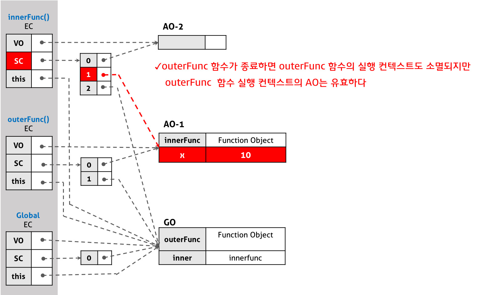
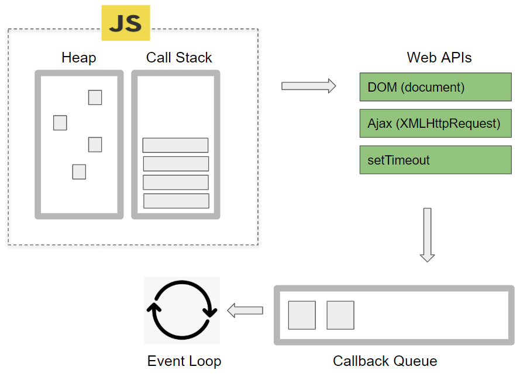

## 1.1 자바스크립트 동등 비교

---

🔖 리액트 가상DOM과 실제DOM의 비교, 컴포넌트 렌더링 여부, 변수나 함수의 메모이제이션은 모두 **동등 비교**를 기반으로 한다.

### 1.1.1 자바스크립트의 데이터 타입

---

🔖 원시타입 : 간단하게 객체가 아닌 모든 타입을 지칭한다고 해도 무방

- undefined : 선언 후 값을 할당하지 않을 시 자동으로 할당되는 값, undefined 하나만 할당 가능
- null : 값이 없거나 빈 값을 표현할 때 사용, null 하나만 할당 가능
- Boolean : true, false만 가질 수 있는 값, 주로 조건문에서 많이 사용(true나 false는 여러가지 값들로 암시적으로 표현 가능)
- Number : 숫자를 할당하는 값, 무조건 10진수로 해석되어 표현
- BigInt : ES2020에서 추가된 값, Number가 표현하지 못하는 큰 값들을 표현
- String : 텍스트 타입 데이터를 저장하기 위한 값, 작은(''), 큰 따옴표("") 혹은 백틱(``)으로 표현된 모든 값(문자열 각각의 값은 **변경 불가능**)
- Symbol : ES6 이후로 추가된 값, 중복되지 않는 고유한 값을 직접 작성하고 싶을 때 사용

🔖 객체타입 : 원시 타입을 제외한 모든 것, 배열, 함수, 정규식, 클래스 등(참조 타입이라고도 지칭)

### 1.1.2 값을 저장하는 방식의 차이

---

🔖 원시타입

- 불변 형태의 값으로 저장되며 메모리 영역 차지
- 값 자체를 복사하기 때문에, 비교하면 **true** 출력

```js
const hello = "hello";
const hi = hello;

console.log(hello === hi); // true
```

🔖 객체타입

- 변경 가능한 상태의 값으로 저장
- 얕은 복사를 이용한 참조 전달이므로, 비교하면 **false** 출력

```js
const hello = {
  a: "hello",
};
const hi = {
  a: "hello",
};

console.log(hello === hi); // false
```

### 1.1.3자바스크립트의 또 다른 비교 공식, Object.is

---

🔖 두개의 인수를 제공받아 동일한지 체크(타입까지 체크)
<br>
사용 이유 : ==, ===가 체크하지 못하는 경우도 전부 체크하기 위함
<br>
동등 비교가 가지는 한계를 극복하기 위해 제작, 하지만 객체 간 비교에선 ===와 차이X

### 1.1.4리액트에서의 동등 비교

---

- 리액트에서 사용하는 비교가 바로 **Object.is**
- 이를 기반으로 하는 shallowEquall이라는 함수를 만들어 사용
- 기존 JS와 다르게 객체와의 얕은 비교를 한번더 수행

```js
// 기존 Object.is
Object.is({ hello: "world" }, { hello: "world" }); // false

// shallowEquall : 객체의 비교를 한번 더 수행
shallowEqual({ hello: "world" }, { hello: "world" }); // true

// 객체의 깊이가 1 초과인 경우: 비교 불가
shallowEqual({ hello: { hi: "world" } }, { hello: { hi: "world" } }); // false
```

🔖 왜 얕은 비교를 한번만 수행하는가?
<br>

- 리액트가 사용하는 JSX Props는 객체고, 이 Prop은 한번만 수행되기 때문에 상관X

🔖 props의 비교 예시 : React.memo (어렵다...)
<br>

- 리액트의 memo는 props의 변경 여부만 확인하여 동일할 시 재사용하는 로직
- 아래 로직에서 count나 text 둘 중 하나만 변경될 시, 그에 맞는 컴포넌트만 리렌더링

```js
import { useEffect, useState } from "react";

const CounterB = React.memo(({ object }) => {
  useEffect(() => {
    console.log(`CounterB Update = count: ${object.count}`);
  });

  return <div>{object.count}</div>;
});

const OptimizeTest = () => {
  const [object, setObject] = useState({ count: 1 });

  return (
    <div>
      <h2>Counter B</h2>
      <CounterB object={object} />
      <button onClick={() => setObject({ count: object.count })}>B Button</button>
    </div>
  );
};
```

❗여기서 문제! memo는 props를 얕은 비교를 이용하여 비교하므로, props로 object가 들어오는 경우 리렌더링 시 새로운 주소를 가지게 된다.
<br>
😢 따라서 memo가 의미가 없어져 props 값이 바뀌지 않아도 리렌더링이 발생한다.
<br>
✅ 이를 위해 깊은 비교를 해주는 함수를 지정하여 따로 두번째 인수로 넣어주면 해결~

### 1.1.5 정리 + 주관적인 정리

---

🔖 책 정리

- 객체 비교의 불완전성은 JS의 고유 개념이므로, JS 개발자는 이를 충분히 인지하여야 한다. 또 이 원리를 이용한 **의존성 배열 비교**나 **useMemo, Callback**의 필요성, 렌더링 최적화를 위한 **React.memo** 등을 위해 이 개념을 잘 숙지해야한다.
  <br>
  <br>

🏷️ 주관적 정리
<br>

- 자바스크립트에 존재하는 데이터타입과 그 비교의 원리를 되짚어보고, 리액트에서 이를 어떻게 활용하는지 알 수 있었다.
  <br>
- 기존에 관심을 가지고있던 최적화를 위해 꼭 필요한 중요한 개념임을 인지할 수 있었다.

## 1.2 함수

---

🔖 JS와 리액트의 중요한 개념 중 하나. 함수형 컴포넌트를 작성 시 **화살표 함수**와 **일반 함수**의 차이도 알아보자

### 1.2.1 함수란 무엇인가?

---

🔖 작업을 수행하거나 값을 계산하는 과정을 하나의 블록으로 감싸 표현

```js
function sum(a, b) {
  // 함수의 시작
  return a + b; // a와 b는 매개변수, return으로 결과 반환
} // 함수의 끝

sum(10, 24); // 34
```

🔖 리액트의 컴포넌트도 이와 같은 개념

```jsx
function Compo(props) {
  // 함수의 시작
  return <div>{props.hello}</div>; // props는 매개변수, return으로 결과 반환
} // 함수의 끝
```

### 1.2.2 함수를 정의하는 4가지 방법

---

🔖 함수 선언문
<br>

- 가장 일반적인 방식(표현식이 아닌 '문')

```jsx
function add(a, b) {
  return a + b;
}

sum(10, 24);
```

- ❗그러나 함수 선언문임에도 불구하고 변수에 할당 가능하며, 이는 JS엔진이 함수 선언문을 유도리있게 해석하기 때문에 가능한 일
  <br>

<br>🔖 함수 표현식
<br>

- 자바스크립트에서 함수는 **일급 객체**(일반적으로 적용 가능한 연산을 모두 지원)이므로, 변수에 할당 하는 등의 표현식으로 작성하는 것이 가능

```jsx
const sum = function (a, b) {
  return a + b;
};

sum(10, 24);
```

- ❗일반적으로 익명 함수로 작성(혼란 방지)
  <br>

🏷️ 표현식과 선언식의 차이
<br>

- 가장 큰 차이는 **호이스팅** (함수를 끌어올려 실행하는 것처럼 작동)
  - 선언식은 함수 그 자체이기 때문에, 호이스팅에 의해 가장 먼저 실행되는 것과 동일한 효과(선언 위치의 자유로움)
  - 표현식은 변수에 할당하기 때문에, var에 경우 런타임 이전에 초기화(명확한 선언)
    <br>

🔖 Function 생성자
<br>

- 별로 사용하지도 않고 이쁘지도 않음

```jsx
const add = new Function("a", "b", "return a+b");

add(10, 24);
```

<br>
🔖 화살표 함수
<br>
- ES6에서 새롭게 추가된 방식(간편)

❗기존 함수 생성 방식과의 차이

1. constructor(생성자)를 사용불가
2. argument 존재X
3. this 바인딩 객체가 상위 스코프의 this 객체를 가리킴

```jsx
// 전역 스코프
const arrowFunc = () => {
  console.log(this); // window
};
```

### 1.2.3 다양한 함수 살펴보기

---

🔖 즉시 실행 함수
<br>

- 함수의 정의와 실행이 동시에 이뤄지는 함수(일회용)

```jsx
(function (a, b) {
  return a + b;
});
```

🔖 고차 함수
<br>

- 일급 객체라는 특성을 활용해 함수를 인수로 받거나 이를 이용해 새 결과를 도출하는 함수

```jsx
// 대표적 고차 함수 map
const doubleArr = [1, 2, 3].map((item) => item * 2);

console.log(doubleArr); // [2, 4, 6]
```

- ❗이를 이용해 다른 컴포넌트를 인수로 받는 고차 컴포넌트 제작 가능

### 1.2.4 함수를 만들 때 주의사항

---

🔖 함수의 부수효과를 억제하라~

- 함수 내 작동으로 인해 외부에 영향을 끼치는 효과를 지칭
- 항상 기본에 충실한 함수 만들기
  <br>

🔖 가능한 함수를 작게 만들어라~

- 함수는 길어질 수록 에러 발생 확률이 증가하고 가독성이 감소
- ESLint는 함수가 50줄이 넘어가면 과도한 함수로 판단
  <br>

🔖 누구나 이해할 수 있는 이름을 붙여라~

- 코드가 길어지고 많아질 수록 함수 이름이 명확하지 않으면 한눈에 파악하기 힘듦
- 항상 간결하고 명확한 함수 네이밍을 할 수 있도록 주의
  <br>

### 1.2.5 정리 + 주관적인 정리

---

🔖 책 정리

- 함수를 위해 알아두어야 할 것과 예외적인 것들에 대한 것들을 항상 숙지해야 하며, 자신의 함수 설계를 되돌아보는 습관을 가지는 것이 좋다.
  <br>
  <br>

🏷️ 주관적 정리
<br>

- 기존에 모르던 함수 생성자에 대해 알 수 있었고, 표현식과 선언식의 명확한 차이를 확실히 알 수 있었다.
  <br>
- 내가 지금까지 작성했던 함수 로직에 대해 조금 생각해보는 시간이 되었다.
  <br>

## 1.3 클래스

**16.8 버전 전까지 모든 리액트의 컴포넌트는 클래스였다.**
<br>
<br>
🔖 함수형 컴포넌트로 변경된지 얼마 되지 않은 리액트를 더 깊이 있게 알아보자.

### 1.3.1 클래스란 무엇인가?

---

🔖 특정 객체를 만들기 위한 일종의 템플릿과 같은 개념

- 객체를 만들 때 필요한 데이터나 조작 코드를 추상화하여 더 편리하게 생성할 수 있도록 한다.
- JS에서 클래스로 하는 모든 것을 함수로 동일하게 할 수 있다.
  <br>
  <br>

🏷️ 클래스 작성법

```js
class Car {
  // constructor (생성자) 작성
  // 최초 생성 시 어떤 인수를 받을지 결정 및 객체 초기화
  constructor(name) {
    this.name = name;
  }

  // 메서드
  honk() {
    console.log(`${this.name}이(가) 경적을 갈긴다.`);
  }

  // 정적 메서드
  static hello() {
    console.log("안녕? 난 차야");
  }

  // setter
  set age(value) {
    this.carAge = value;
  }

  // getter
  get age() {
    return this.carAge;
  }
}
```

<br>

🏷️ 클래스 사용법

```js
// 미리 정의한 Car 클래스를 이용해 객체 생성
const myCar = new Car("포르쉐");

// 메서드 호출
myCar.honk(); // 포르쉐이(가) 경적을 갈긴다.

// 정적 메서드는 클래스에서 직접 호출한다.
Car.hello(); // 안녕? 난 차야

// 정적 메서드는 클래스로 만든 객체에선 호출이 불가하다.
myCar.hello(); // UncaughtError

// setter를 사용해 값을 할당할 수 있다.
myCar.age = 32; // myCar.carAge = 32;

// getter를 사용해 값을 가져올 수 있다.
console.log(myCar.age, myCar.name); // 32 포르쉐
```

<br>

🔖 클래스 내부 특징

- constructor

> - 생성자로, 객체를 생성하는데 사용
>   <br>
> - 단 하나만 존재 가능(여러개 사용 시 에러)
>   <br>
> - 수행할 작업이 없을 시 생략 가능

<br>

- 프로퍼티

> - 인스턴스 생성 시 내부에 정의할 수 있는 속성값
>   <br>
> - 타입스크립트 활용 시 `private`, `public`, `prottected` 활용 가능

<br>

- getter & setter

> - 클래스에서 값을 가져오거나, 값을 할당할 때 사용
>   <br>
> - 각각 `get`과 `set` 키워드를 사용한다.

<br>

- 인스턴스 메서드

> - 클래스 내부에서 선언한 메서드 (`prototype`에 선언)
>   <br>
> - prototype에 선언했으므로, 클래스를 기반으로 만드는 객체들은 메서드 또한 사용 가능
>   <br>
> - 비교를 위해 `Object.getPrototypeOf` 메서드를 사용 가능하다.

<br>

❗여기서 `prototype` 이란?

- 객체 상속 시 사용하는 객체를 `prototype` 이라 정의한다.
  > - 모든 객체는 **proto**(비표준)이라는 속성을 가지며, 이는 프로토타입을 가리킨다.
  > - 객체의 속성이나 메서드를 검색하고, 없을 시 프로토타입을 참조한다. (프로토타입 체인)

<br>

🏷️ [ProtoType 관련 포스팅](https://www.nextree.co.kr/p7323/)

- 정적 메서드

> - 클래스의 인스턴스가 아닌, 이름으로 호출 가능한 메서드
>   <br>
>   클래스 자신을 가리키므로, this 사용이 불가하고 인스턴스에서도 호출 불가하다.
>   <br>
>   객체를 생성하지 않아도 여러 곳에서 사용 가능하여, 전역적 유틸 함수로 활용한다.

<br>

- 상속

> - 부모-자식 관계와 같이 다른 클래스에 속성들을 상속시켜 확장하는 개념
>   <br>
> - extends 키워드를 활용하여 다양하게 파생된 클래스 생성이 가능하다.

<br>

### 1.3.2 클래스와 함수의 관계

---

🔖 클래스가 작동하는 방식은 JS의 `prototype`을 활용하는 것

```js
// 프로토타입를 활용한 JS의 클래스 구현
const Car = (function () {
  function Car(name){
    this.name = name;
  }

  Car.prototpye.honk = function () {
    console.log(`${this.name}이(가) 경적을 갈긴다.`);
  }

  Car.hello = function () {
    console.log(`안녕? 난 차야`);
  }

  Car.defineProperty(Car, 'age'){
    get: function () {
      return this.carAge
    },
    set: function () {
      this.carAge = value
    }
  }
  return Car;
  })()
```

<br>

### 1.3.3 책 정리 + 주관적인 정리

---

🔖 책 정리

- 다른 객체지향언어와 비슷한 수준으로 JS의 클래스도 여러가지 기능을 제공한다.

- 클래스 이해를 통해 클래스 컴포넌트에 생명주기 구현 및 상속, 함수 표현 방식에 따른 차이를 이해할 수 있다.

🏷️ 주관적인 정리

- 클래스 컴포넌트는 예전에 리액트 라이프 사이클을 공부할 때 잠깐 스쳐지나간 기억이 있는데, 이런 식으로 리액트 전반에 관련된 중요한 개념인 줄 몰랐다.

- 현재 우리가 사용하는 함수형 컴포넌트는 결국 클래스 컴포넌트와 동일한 메커니즘이므로, 클래스를 확실하게 이해한다면 함수형 컴포넌트 작성에도 매우 용이할 듯 하다.

- 더불어 JS 딥다이브에서 공부했던 프로토타입에 관해 다시 정리할 수 있어 좋았다.

## 1.4 클로저



**클로저는 함수와 그 함수가 선언된 렉시컬 환경의 조합이다.**

🔖 함수형 컴포넌트 작동 방식, 구조, 훅, 의존성 배열 등이 모두 클로저에 의존한다.

### 1.4.1 클로저의 정의

---

🔖 클로저는 `this`와 달리 코드가 작성된 순ㄴ간에 정적으로 결정되는 변수나 함수의 스코프를 사용하는 기법이다.

```jsx
function add() {
  const a = 10;
  function innerAdd() {
    const b = 20;
    console.log(a + b); // 상위 스코프인 add()에 a 변수가 있기 때문에 가능
  }
  innerAdd();
}

add();
```

### 1.4.2 변수의 유효 범위, 스코프

---

🔖 JS의 다양한 스코프를 알아보자!

- 전역 스코프
  > - 전역 레벨에 선언하는 스코프
  >   <br>
  > - 해당 스코프 선언 시 어디서든 호출 가능하다.
  >   <br>

<br>

- 함수 스코프

  > - {}블록이 아닌 함수 레벨로 범위를 결정
  >   <br>
  > - JS는 변수 호출 시 상위 스코프로 변수 탐색 범위를 점점 넓힌다.
  >   <br>

  <br>

### 1.4.3 클로저의 활용

---

🔖 환경을 기억하고 이를 사용하는 특징을 이용해 상태 유지나 정보 은닉에 사용

```js
const increase = (function () {
  let num = 0;
  return function () {
    return ++num;
  };
})();

console.log(increase()); // 1
console.log(increase()); // 2
console.log(increase()); // 3
```

- 위 함수의 `num`이 전역 변수였다면 어디서든 활용되었을 것이다.
- 하지만 함수 안에 넣고, 클로저를 활용해 `num`의 상태를 유지하면서 함수 안에서만 사용 가능하도록 변경하였다.
  <br>

🔖 리액트에서의 사용

- 대표적으로 활용되는 것이 리액트의 `useState` 훅이다.

```js
function Component () {
  const [num, setNum] = useState();

  function handleClick () {
    ...
    setState((prevNum) => prevNum + 1); // 클로저를 이용해 사용 시의 환경을 기억
  }
}
```

### 1.4.4 주의할 점

---

🔖 기본 개념인 **함수와 함수가 선언된 렉시컬 환경의 조합**을 항상 인지하고 사용

❗ 꼭 필요한 작업만 남겨두지 않으면 메모리를 불필요하게 소모
<br>
❗ 적절한 스코프로 제한하지 않으면 성능에 악영향을 끼침

```jsx
// 좋지 않은 예시인 긴 작업을 클로저로 처리하는 경우
function heavyJobWithClosure() {
  const longArr = Array.from({ length: 10000000 }, (_, i) => i + 1);
  return function () {
    console.log(longArr.length);
  };
}
const innerFunc = heavyJobWithClosure();
bBtn.addEventListener("click", function () {
  innerFunc();
});
```

- 위의 경우 내부 함수가 선언 환경을 기억해야 하므로 이러한 긴 작업 또한 메모리에 올리게 된다.

### 1.4.5 책 정리 + 주관적인 정리

---

🔖 책 정리

- 클로저는 함수형 프로그래밍의 주요 개념인 **부수 효과를 줄이고 순수해야 한다**라는 목적 달성을 위해 적극 사용되는 개념이다.

- 하지만 공짜는 아니므로 항상 사용에 주의할 필요가 있다.

🏷️ 주관적인 정리

- 클로저 자체는 JS 딥다이브 스터디 때 했던 발표로 어느정도 익숙한 개념이었지만 리액트에서 어떻게 이를 사용하는지도 알 수 있어 유익했다.

- 클로저의 자체적인 활용과 더불어 사용하는 비용에 대한 문제도 고민해볼 수 있었다. (아껴야 잘 산다!)

## 1.5 이벤트 루프와 비동기 통신의 이해

**자바스크립트는 싱글 스레드 언어이고, 비동기 작업은 자바스크립트를 멀티 스레드 언어처럼 동작하게 해주는 것이다.**
<br>
<br>


🔖 비동기를 이용해 여러가지 작업을 한번에 처리한다.

### 1.5.1 싱글 스레드 자바스크립트

---

🔖 스레드에 대한 이해

- 프로그램의 상태가 메모리상에서 실행되는 작업 단위인 **프로세스**보다 작은 실행 단위
  > - 하나의 프로세스는 여러개의 스레드를 만들 수 있다
  >   <br>
  > - 스레드끼리 메모리를 공유하여 여러 작업을 동시에 수행 가능하다.
  >   <br>

<br>
🔖 자바스크립트는 단순히 웹 조작을 보조하기 위한 용도로 만들어져 효율적인 싱글 스레드 언어로 구현되었다.

<br>

- 자바스크립트 코드는 하나의 스레드에서 순차적으로 실행
  > - 코드를 한 줄씩 실행한다.
  >   <br>
  > - 하나의 작업이 끝나기 전까지 뒤의 작업이 시작되지 않는다.
  >   <br>
  > - `Run-to-completion`, 동기식으로 순차 처리된다.

<br>

### 1.5.2 이벤트 루프란?

---

🔖 자바스크립트 런타임 외부에서 비동기 실행을 돕기 위한 장치

```js
function bar() {
  console.log("bar");
}

function baz() {
  console.log("baz");
}

function foo() {
  console.log("foo");
  bar();
  baz();
}

foo();
```

- 콜 스택 작업 예시

  > - 각각의 함수들은 순서대로 콜스택에 들어가고, 실행 후 콜스택에서 제거된다.
  >   <br>
  > - 기본적인 스택의 LIFO 방식에 따라, `baz()` -> `bar()` -> `foo()` 순으로 제거된다.

<br>
✅ 콜 스택이 비어있는지 검사하는 것이 바로 이벤트 루프이다.

```js
function bar() {
  console.log("bar");
}

function baz() {
  console.log("baz");
}

function foo() {
  console.log("foo");
  setTimeout(bar(), 0);
  baz();
}

foo();
```

- 콜스택과 이벤트 루프의 비동기 처리

  > - 마찬가지로 차례대로 콜 스택에 들어간다.
  >   <br>
  > - 하지만 `setTimeout` 때문에, `bar()`는 태스크 큐로 들어가고 콜 스택에서 제거된다.
  >   <br>
  > - 다른 함수들이 실행되고 콜 스택이 비워진게 확인되면 이벤트 루프가 `bar()`를 콜 스택에 집어넣는다.
  >   <br>
  > - 함수들이 실행되고 콜 스택이 전부 비워진다.

<br>
🔖 이러한 비동기 처리 작업은 자바스크립트의 메인 스레드가 아닌, 태스크 큐가 할당되는 별도의 스레드에서 수행된다.
<br>
🔖 자바스크립트 자체 코드 처리를 제외한 외부 Web API는 브라우저나 Node.js가 비동기 처리한다.

### 1.5.3 태스크 큐와 마이크로 태스크 큐

---

🔖 이벤트 루프는 하나의 마이크로 태스크 큐를 가지며, 이는 기존의 태스크 큐보다 실행이 우선된다.

- 태스크 큐 : setTimeout, setInterval, setImmediate
- 마이크로 태스크 큐 : Promise, MutationObserver, etc..

✅ 각 마이크로 태스크 큐 작업이 종료될 때마다 한번 렌더링할 기회를 얻는다.

- `requestAnimationFrame()`을 사용한 예시

```js
console.log("a");

setTimeout(() => {
  console.log("b");
});

Promise.resolve().then(() => {
  console.log("c");
});

window.requestAnimationFrame(() => {
  console.log("d");
});
```

- 위 코드의 실행 순서는 `a - c - d - b` 이다.
- 따라서 브라우저에 렌더링하는 작업은 마이크로 태스크 큐와 태스크 큐 사이에서 일어난다.

### 1.5.4 책 정리 + 주관적인 정리

---

🔖 책 정리

- 자바스크립트의 싱글 스레드만으로는 불가능한 비동기 처리를 브라우저와 Node.js, 이벤트 루프와 마이크로 태스크 및 태스크 큐들을 통해 가능케 한다.

🏷️ 주관적인 정리

- 이벤트 루프 자체의 개념은 어렴풋이 알고 있었지만 조금 더 자세하게 이를 들여다보고 각각의 비동기 작업들을 비교하며 알아볼 수 있어 도움이 됐다.

- 더불어 이벤트 루프와 비동기 처리를 더욱 자세히 알아볼 수 있는 계기가 됐다. 👍
  <br>

[link - 자바스크립트 이벤트 루프 구조와 동작 원리](https://inpa.tistory.com/entry/%F0%9F%94%84-%EC%9E%90%EB%B0%94%EC%8A%A4%ED%81%AC%EB%A6%BD%ED%8A%B8-%EC%9D%B4%EB%B2%A4%ED%8A%B8-%EB%A3%A8%ED%94%84-%EA%B5%AC%EC%A1%B0-%EB%8F%99%EC%9E%91-%EC%9B%90%EB%A6%AC)

## 1.6 리액트에서 자주 사용하는 자바스크립트 문법

**자바스크립트 문법을 이해한다면 리액트의 작동 방식 또한 이해할 수 있다.**

🔖 항상 새로운 버전이 나오는 JS의 문법을 숙지하고, 사용자의 입장도 고려하여 개발해야한다.

👍 이를 위해 사용하는 것이 바로 트랜스파일러인 "바벨"이다.

### 1.6.1 구조 분해 할당

---

🔖 배열이나 객체의 값을 분해해 개별 변수에 바로 할당하는 것을 의미

🏷️ 배열 구조 분해 할당

- 배열의 구조를 분해하여 개별 변수에 할당하는 것
- ","을 이용하여 값을 결정

```jsx
// 스프레드 연산자 활용 예시
const arr = [1, 2, 3, 4, 5];
const [first, second, third, ...arrayRest] = arr;
//       1       2      3        [4, 5]

// 중간 인덱스 할당 생략
const [first, , , , , fifth] = arr;
//       1         5

// undefined만 가능한 기본값 사용 (사용하는 배열이 더 짧은 경우)
const arr = [1, 2];
const [a = 10, b = 10, c = 10] = arr;
//        1       2      10
const arr = [undefined, null, 0, ""];
const [a = 1, b = 1, c = 1, d = 1] = arr;
//       1     null     0     ''
```

🏷️ 바벨을 이용한 트랜스파일링 코드 (ES5)

```js
// 전
const arr = [1, 2, 3, 4, 5];
const [first, second, third, ...arrayRest] = arr;

// 후
var arr = [1, 2, 3, 4, 5];
var first = arr[0],
  second = arr[1],
  third = arr[2],
  arrayRest = array.slice(3);
```

👍 구조 분해 할당을 통해 이런 여러 줄의 작업을 한줄로 간소화할 수 있다! (GOAT)

---

🏷️ 객체 구조 분해 할당

- 객체에서 값을 꺼내와 할당
- 객체 내부 이름으로 꺼내옴

```jsx
// 스프레드 연산자 활용 예시
const obj = {
  a: 1,
  b: 2,
  c: 3,
};

const { a, ...objRest } = obj;
//      1   {b: 2, c: 3}

// 새로운 이름으로 재할당 또한 가능
const { a: first, b: second } = obj;
//      first 1   second 2

// 기본값 또한 지정 가능
const { a = 10, b = 10, c = 10, d = 10 } = obj;
//        1       2       3       10

// 추가로 계산된 속성 이름 방식 사용 가능
const key = "a";
const { [key]: a } = obj;
//        a = 1
```

❗추가로 위와 같은 계산된 속성 사용 시 이름을 선언하는 :a와 같은 네이밍 필요

🏷️ 바벨을 이용한 트랜스파일링 코드 (ES5)

```jsx
// 전
const obj = {
  a: 1,
  b: 2,
  c: 3,
};
const { a, ...rest } = obj;

// 후 .. 너무 길다
```

❗ES5 버전의 로직 자체보다 트랜스파일링 시 번들링 크기가 커진다는 것에 주목하고, ES5를 고려하는 경우 이를 남용하면 안된다는 것을 기억해야한다.

### 1.6.2 전개 구문

---

🔖 배열이나 객체, 문자열과 같은 순회할 수 있는 값을 전개해 간결하게 사용하는 구문

🏷️ 배열의 전개 구문

- `push()`, `concat()`, `splice()` 등을 대체 가능

```js
const arr1 = ["a", "b"];
const arr2 = [...arr1, "c", "d", "e"];
//           ['a', 'b', 'c', 'd', 'e']

// 내부 배열에서 활용 가능 (기존 배열에 영향 없이 배열 복사)
const arr1 = ["a", "b"];
const arr2 = [...arr1];

arr1 === arr2; // false
```

🏷️ 객체의 전개 구문

- 객체 전개 구문은 순서가 중요! (순서를 다르게 할 시 아예 다른 객체가 되어버림)

```js
const obj1 = {
  a: 1,
  b: 2,
};
const obj2 = {
  c: 1,
  d: 2,
};

const newObj = { ...obj1, ...obj2 };
//             {'a': 1, 'b': 2, 'c': 1, 'd': 2}

const aObj = {
  ...obj1,
  c: 3,
};
const bObj = {
  c: 3,
  ...obj1,
};

shallowEqual(aObj === bObj); // false
```

✅ 결론적으로 배열은 크게 상관이 없으나, "객체"의 경우 트랜스파일 시 번들링 파일의 크기가 기존과 비교해 매우 커지므로, 사용 시 주의할 필요가 있다.

### 1.6.3 객체 초기자

---

🔖 객체 선언 시, 객체에 넣을 키와 값을 가지고 있는 변수가 이미 존재한다면 해당 값을 변수를 통해 바로 넣어줄 수 있는 야무진 기술이다.

```js
const a = 1;
const b = 2;

const obj = {
  a,
  b,
};

// obj = { a: 1, b: 2}
```

👍 객체를 좀 더 간편하게 설계할 수 있고, 트랜스파일 시에도 부담없다..!

### 1.6.4 Array 프로토타입의 메서드: map, filter, reduce, forEach

---

🔖 흔히 말하는 고차 함수, 기존 배열 값을 건드리지 않고 새로운 배열을 리턴한다. (forEach 제외) 또한 ES5부터 사용해서 트랜스파일 시에도 변함이 없다.

🏷️ Array.prototype.map

- 인수로 전달받은 배열과 똑같은 길이의 새 배열을 리턴한다.
- 리액트에서는 특정 데이터 배열을 받아 결과를 렌더링하는 용도로 사용한다.

```jsx
const arr = [1, 2, 3, 4, 5];
const doubleArr = arr.map((item) => item * 2);
// [2, 4, 6, 8, 10]
```

🏷️ Array.prototype.filter

- 콜백 함수를 받아 이 함수가 truthy 조건을 만족해야 원소를 리턴한다.

```jsx
const arr = [1, 2, 3, 4, 5];
const filteredArr = arr.filter((item) => item % 2 === 0);
// [2, 4]
```

🏷️ Array.prototype.reduce

- 콜백과 함께 받는 초기값을 통해, 배열이나 객체 혹은 다른 무언가를 반환한다.
- 콜백 함수 실행 후, 초기값에 이를 누적해 결과를 반환한다.

```jsx
const arr = [1, 2, 3, 4, 5];
const sum = arr.reduce((result, item) => {
  return result + item;
}, 0);
// sum = 15
```

🏷️ Array.prototype.forEach

- 콜백 함수를 받아 순회하며 콜백을 실행한다.
- 반환값이 없으므로 사용 시 유의해야한다.
- 배열을 순회하는 동안은 무슨 수를 쓰더라도 멈출 수 없다. (8톤 트럭~)

```jsx
const arr = [1, 2, 3, 4, 5];
const newArr = arr.forEach((item) => item + 1);
// undefined
```

### 1.6.5 삼항 조건 연산자

---

🔖 JS에서 유일하게 3개의 피연산자를 취할 수 있다.

- `조건문 ? 참일_때_값 : 거짓일_때_값` 의 형태

```js
const value = 10;
const result = value % 2 === 0 ? "짝수" : "홀수";
// 짝수
```

❗가급적이면 중첩해서 쓰는 것은 자제!

### 1.6.6 책 정리 + 주관적인 정리

---

🔖 책 정리

- 리액트를 작성할 때 주로 사용되는 문법들의 정리이다.
- 최신 코드를 확인하고 싶다면 ESMASCript를 찾아보는 것이 좋다.
- 항상 코드 사용의 준비를 생각하고 다양한 상황에 대비해야 한다.

🏷️ 주관적인 정리

- 평소에 자주 사용해오면서 이를 바벨을 통한 트랜스파일링 시의 코드로도 볼 생각은 못했었는데 이번에 새로이 접하게 되었다.
- forEach의 순회는 강제적이라는 사실도 처음 접하게 되어서 다음에 사용할 때 좀 더 다양한 상황을 고민해볼 듯 하다.

## 1.7 선택이 아닌 필수, 타입스크립트

**익숙해지면 편해~ (any를 남발하며)**

🔖 동적 언어인 JS를 컴파일 시 전부 타입을 체크할 수 있도록 하여 안전한 코드의 작성과 더불어 버그도 크게 줄일 수 있다.

### 1.7.1 타입스크립트란?

---

🔖 자바스크립트에 타입을 가미한 것이 바로 타입스크립트이다.

```js
// 타입스크립트를 사용하지 않는 타입 체크 예시
function test(a, b) {
  if (typeof a !== "number" || typeof b !== "number") {
    throw new Error("a와 b 모두 숫자로!");
  }
  return a / b;
}

test("안녕", "하이"); // error 발생
```

- 위의 경우 typeof 키워드를 이용해 타입 체크를 하고 있긴 하나, 일일히 작성하기 너무 번거롭다.

```ts
// 킹갓 타입스크립트를 사용한다면?
function test(a: number, b: number) {
  return a / b;
}

test("안녕", "하이");
```

- 위의 경우 컴파일 시 타입을 체크해주어 tsc 키워드로 트랜스파일링 시 에러가 발새한다.

🔖 하지만 어디까지나 JS의 슈퍼셋이므로, 만능은 아니다. (결국 트랜스파일링을 통해 JS코드로 변환되어 최종 실행되기 때문)

✅ 타입스크립트 이전에 정적 타입 체크 라이브러리인 Flow가 있었으나, 타입스크립트의 대중화 및 VSCode와의 연계를 통해 현재는 거의 볼 수 없다.

👍 왠만하면 타입스크립트를 사용하는 버릇을 들이길 권장한다.

### 1.7.2 리액트 코드를 효과적으로 작성하기 위한 타입스크립트 문법

---

🔖 타입스크립트의 타입 시스템을 적극 활용하여 버그를 타도하자.

🏷️ `any` 대신 `unknown` 을 사용하자.

- any를 사용하는 것은 사실상 타입스크립트를 사용하지 않는 것이나 다름없다.

```ts
// any 사용
function do(callback: any){
  callback()
}

do() // 타입스크립트에서는 에러 발생X, 실행 시 에러 발생

// unknown 사용
function do(callback: unknown){
  if(typeof callback === 'function'){
    callback();
    return
  }

  throw new Error('callback은 함수여야 한다.');
}

do() // unknown은 모든 타입의 상위이지만, 사용 시 조건문이나 as를 이용해 타입을 정의해야한다.
```

🏷️ 반대로 `never` 타입도 존재한다.

- string과 number를 모두 포함하는 타입의 경우 존재하지 않아 never가 선언된다.
- 클래스 컴포넌트 선언 시 props를 받아들이지 않는다는 의미로 사용 가능하다.

<br>
🏷️ 타입 가드를 적극 활용하자

- 타입 사용 시 타입을 최대한 좁히는데에 도움을 준다.
- instanceof, typeof, in

```ts
// instanceof
try{
  const res = await fetch('...');
  return await res.json();
} catch(e) {
  // e는 unknown이므로, 타입 체크
  if(e instanceof UnAuthorizedError){
    ...
  }

  if(e instanceof UnExpectedError){
    ...
  }
}

// typeof
if(typeof callback === 'function'){
    callback();
    return
  }

// in
if('type' in somthingType){
  ...
}
```

🏷️ 제네릭

- 함수나 클래스 내부에서 단일이 아닌 다양한 타입에 대응할 수 있도록 도와준다.
- 타입만 다르고 작업은 비슷한 컴포넌트를 단일 제네릭 컴포넌트로 선언 가능하다.

```ts
function getFirstAndLast<T>(list: T[]): [T, T] {
  return [list[0], list[list.length - 1]];
}

const [first, last] = getFirstAndLast([1, 2, 3, 4, 5]);
const [first, last] = getFirstAndLast(["a", "b", "c", "d", "e"]);
// 제네릭을 선언하여 number와 string 둘다 가능하도록 했다.
```

👍 대표적으로 useState의 타입을 지정할 때 사용한다.

✅ 제네릭을 하나 이상 사용도 가능하지만 적절한 네이밍이 요구된다.

```ts
function multiGen<First, Last>(a1: First, a2: Last): [First, Last] {
  return [a1, a2];
}

const [a, b] = multiGen<String, Boolean>("true", true);
// 제네릭 선언으로 에러없이 동작
```

🏷️ 인덱스 시그니처

- 객체의 키를 정의하는 방식

```ts
type Hello = {
  [key: string]: string; // 인덱스 시그니처
};

const hello: Hello = {
  hello: "hello",
  hi: "hi",
};

hello["hi"]; // hi
hello["안녕"]; // undefined
```

❗유용하긴 하나 존재하지 않는 키로 접근 시 undefined 반환 가능성이 커진다. 따라서 객체의 키 타입의 범위를 좁혀야 한다.

```ts
// record
type Hello = Record<"hello" | "hi", string>;

// 타입을 이용한 인덱스 시그니처
type Hello = { [key in "hello" | "hi"]: string };
```

❗또한 인덱스 시그니처 사용 시 이슈를 마주할 수도 있다.

```ts
const hello: Hello = {
  hello: "hello",
  hi: "hi",
};

Object.keys(hello).map((key) => {
  const value = hello[key];
  return value;
});
```

- 위 코드의 `Object.keys`는 `string의` 배열을 반환한다. 따라서 hello의 인덱스 키로 접근이 불가능하다.

✅ 요런 식으로 해결 가능하다.

```ts
(Object.keys(hello) as Array<keyof Hello>).map((key) => {
  const value = hello[key];
  return value;
});
```

- 위 코드는 as 키워드를 이용해 사용자가 단언한 타입으로 설정하여 접근이 가능하도록 만들었다.

```ts
function keyOf<T extends Object>(obj: T): Array<keyof T> {
  return Array.from(Object.keys(obj)) as Array<keyof T>;
}

keyOf(hello).map((key) => {
  const value = hello[key];
  return value;
});
```

- 위 코드는 keyOf라는 함수를 만들고 Object.keys를 대체하는 로직을 구현했다.

```ts
keyOf(hello).map((key) => {
  const value = hello[key as keyof Hello];
  return value;
});
```

- 또는 위 코드처럼 key 자체에 직접 as 키워드를 통해 타입 단언을 설정할 수도 있다.

🫨 왜 `Object.keys`의 타입은 `string[]` 으로 강제되어 있을까..

- JS는 객체가 열려있는 구조로 만들어져 객체가 필요한 변수나 메서드만 지니고 있다면 이것이 해당 타입에 속하도록 인정해준다.

```ts
type Car = { name: string };
type Truck = Car & { power: number };

function horn(car: Car) {
  console.log(`${car.name}: 운전 똑바로 안해??`);
}

const truck: Truck = {
  name: "비싼차",
  power: 100,
};
```

- 위 코드의 `truck은` `Car`에 필요한 속성을 다 가지므로, `horn(truck)`을 실행해도 정상적으로 작동한다.

### 1.7.3 타입스크립트 전환 가이드

🔖 점진적으로 타입스크립트로 변환해 나간다면 훨씬 쉽게 마이그레이션 할 수 있다!

🏷️ ts.config.json 작성하기

- outDir : 트랜스파일 된 JS 코드를 담을 폴더를 결정한다.
- allowJS : .js 파일을 허용할 것인지 결정한다. (자바스크립트가 존재하므로 true)
- target : 생성되는 타입스크립트의 버전을 결정한다.
- include : 트랜스파일 할 자바 및 타입스크립트 코드를 지정한다.

<br>
🏷️ JSDoc과 @ts-check를 활용해 점진적으로 전환하기

- 타입스크립트로 전활할 필요 없이 타입 체크가 가능하다.

<br>
🏷️ 타입 기반 라이브러리 사용을 위해 @types 모듈 설치하기

- 리액트에서 타입스크립트를 사용하기 위해서도 이를 설치해야한다.

<br>
🏷️ 파일 단위로 조금씩 전환하기

- unknown과 같은 타입을 적극 활용하여 점진적으로 전환시켜 나간다.
- 화딱지가 나더라도 참으면서 하나씩 해보자

### 1.7.4 책 정리 + 주관적인 정리

---

🔖 책 정리

- 타입스크립트는 자바스크립트 생태계에서 점점 비중을 넓혀가고 있다.
- 적응만 된다면 자바스크립트는 기억도 안날 것이다.
- 하지만 자바스크립트의 기본적인 이해도가 결국 타입스크립트의 밑바탕이 되므로, 항상 이를 인지하며 꾸준히 공부해야 한다.

🏷️ 주관적인 정리

- 타입스크립트를 사용하는 이유가 단순히 타입 정의 때문만은 아니라는 것을 알 수 있었다.
- 새로운 객체 키를 정의하는 방식은 인덱스 시그니처에 대해 알 수 있었고, 관련하여 조금 더 찾아보고 고민하는 시간을 가질 수 있었다.
