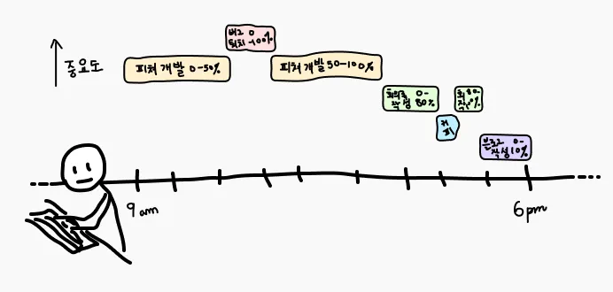
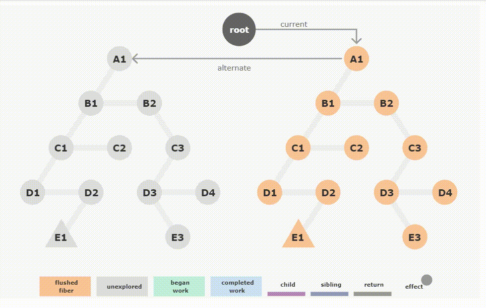
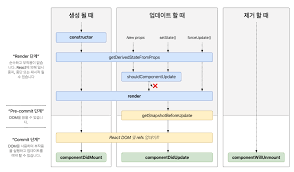

# 02장: 리액트 핵심 요소 깊게 살펴보기

## 2.1 JSX란?

JSX는 리액트가 등장하면서 페이스북에서 소개한 새로운 구문이지만 반드시 리액트에서만 사용하라는 법은 없다. (리액트에 종속적이지 않은 독자적인 문법)

JSX는 JS 표준 코드가 아닌 페이스북이 임의로 만든 새로운 문법이기 때문에 반드시 트랜스파일러를 거쳐야 비로소 JS 런타임이 이해할 수 있는 의미 있는 JS 코드로 변환된다.

JSX는 HTML을 JS 내부에 표현하는 것이 유일한 목적은 아니다. JSX의 설계 목적은 다양한 트랜스파일러에서 다양한 속성을 가진 트리 구조를 토큰화해 ECMAScript로 변환하는데 초점을 두고 있다.

### JSX의 정의

JSX는 4가지 컴포넌트를 기반으로 구성돼 있다.

- JSXElement
- JSXAttributes
- JSXChildren
- JSXString

#### JSXElement

HTML의 요소와 비슷한 역할을 한다.

- JSXOpeningElement: JSXOpeningElement로 시작했다면 JSXClosingElement가 동일한 요소로 같은 단계에서 선언돼 있어야 올바른 JSX 문법으로 간주된다.
  `<JSXElement JSXAttributes(optional)>`
- JSXClosingElement: 반드시 JSXOpeningElement와 쌍으로 존재해야 한다.
  `</JSXElement>`
- JSXSelfClosingElement: 요소가 시작되고 스스로 종료되는 형태, 내부적으로 자식을 포함할 수 없는 형태
  `<JSXElement JSXAttributes(optional) />`
- JSXFragment: 아무런 요소가 없는 형태
  `<></>`

📖 요소명은 대문자로 시작

리액트에서 HTML 구문 이외에 사용자가 컴포넌트를 만들어 사용할 때에는 반드시 대문자로 시작하는 컴포넌트를 만들어야만 사용 가능하다.
그 이유는 리액트에서 HTML 태그명과 사용자가 만든 컴포넌트 태그명을 구분 짓기 위해서다.

#### JSXAttributes

JSXElement에 부여할 수 있는 속성을 의미한다. 단순히 속성을 의미하기 때문에 존재하지 않아도 에러가 나지 않는다.
JSXElement에서의 HTML Attribute

- JSXSpreadAttributes: JS의 전개 연산자와 동일한 역할
  `{...AssignmentExpression}`
- JSXAttribute: 속성을 나타내는 키와 값으로 짝을 이루어서 표현

#### JSXChildren

JSXElement의 자식 값

- JSXText: `{, <, >, }`을 제외한 문자열
- `{ JSXChildExpression (optional) }`: JS 표현식
  `<div>{(()=>"foo")()}</div>`

#### JSXString

JSX 내에서 텍스트 컨텐츠

🛑 JS에서 이스케이프 문자 사용

```jsx
<button>\</button> // 문제 없음

let escape = "\";
// JS에서 이스케이프 문자는 문자열 내에 특수 문자를 사용하기 위해 사용됨
// 이스케이프 문자를 사용하고 뒤에 아무런 문자를 넣어 주지 않아 오류 발생
```

### JSX는 어떻게 자바스크립트에서 변환될까?

리액트 엘리먼트: JSX 문법으로 작성된 **객체**
리액트 엘리먼트를 `render` 메서드로 전달하게 되면 리액트가 이 객체를 해석하여 HTML로 렌더링한다.

```jsx
const element = <h1>hello world</h1>;

console.log(element); // 자바스크립트 객체 출력

const root = ReactDOM.createRoot(document.getElementById("root"));
root.render(element);
```

```jsx
// JSX 문법에서 리액트 엘리먼트 만들기

const ComponentA = <A required={true}>Hello World</A>;

const ComponentB = (
  <div>
    <span>hello world</span>
  </div>
);
```

```js
// JS로 변환된 결과

"use strict";

var ComponentA = React.createElement(
  A,
  {
    required: true,
  },
  "Hello World"
);

var ComponentB = React.createElement(
  "div",
  null,
  React.createElement("span", null, "hello world")
);
```

JSX가 변환되는 특성을 활용한다면 삼항 연산자로 처리해야할 때 아래와 같이 간결하게 처리할 수 있다.

```jsx
// ...
return createElement(
  isHeading ? "h1" : "span",
  { className: "text" },
  children
);
```

## 2.2 가상 DOM과 리액트 파이버

### DOM과 브라우저 렌더링 과정

DOM: HTML 문서 전체를 가리키는 트리 구조의 객체

브라우저는 다음과 같은 과정을 거쳐 렌더링을 수행한다.


1. 브라우저는 HTML, CSS, JS, 이미지, 폰트 파일 등 렌더링에 필요한 리소스를 요청하고 서버로부터 응답을 받는다.
2. 브라우저의 렌더링 엔진은 서버로부터 응답된 HTML과 CSS를 파싱하여 DOM과 CSSOM을 생성하고 이들을 결합하여 렌더 트리를 생성한다.
3. 렌더 트리를 기반으로 HTML 요소의 레이아웃을 계산하고 브라우저 화면에 HTML 요소를 페인팅한다.

### 가상 DOM의 탄생 배경

렌더링은 비용이 많이 드는 작업
하나의 페이지에서 모든 작업이 일어나는 SPA에서는 이 렌더링 이후 추가 렌더링 작업이 더욱 많아진다.
SPA 덕분에 사용자는 페이지의 깜빡임 없이 자연스러운 웹페이지 탐색을 할 수 있지만, DOM 관리하는 과정에서 부담해야 할 비용이 커진다.

**모든 DOM의 변경보다 결과적으로 만들어지는 DOM 결과물 하나만 알고 싶다.**

가상 DOM: 실제 DOM과 같은 내용을 담고 있는 복사본(JS 객체 형태)
리액트에서는 2개의 가상 DOM을 가진다.

가상 DOM1: 렌더링 이전
가상 DOM2: 렌더링 이후

**리렌더링 과정**

1. 리렌더링이 발생하는 상황에서 새롭게 업데이트 될 가상 DOM2를 생성한다.
2. 렌더링 이전의 가상 DOM1과 비교하여 어떤 Element들이 바뀌었는지 찾아낸다. (Diffing 알고리즘)
3. 바뀐 부분들만 실제 DOM에 적용하여 가상 DOM2와 실제 DOM을 일치시킨다.
   이 과정을 **Reconciliation(재조정)** 이라 한다.

페이스북과 같이 사용자 인터랙션이 많은 웹 앱에서는 가상 DOM을 사용하는 위와 같은 방식이 실제 DOM을 조작하는 것보다 효율적이다.
그 이유는 변경된 모든 Element들을 한 번에 DOM에 적용하기 때문이다. (**Batch Update**)
다양한 업데이트가 발생하면 동시에 발생한 업데이트를 모으고 한번에 수정하여 리플로우와 리페인트 횟수를 최소한으로 한다.

❓: 가상 DOM을 사용하는 리액트의 방식이 일반적인 DOM을 관리하는 브라우저보다 빠르다?

직접 DOM 조작: 매번 변경
가상 DOM: 가상 DOM 비교 + 한 번에 변경

가상 DOM을 생성하고 비교하는데에도 연산이 소요되기 때문에 변경 사항이 적은 경우에는 직접 DOM 조작이 가상 DOM을 사용하는 방식보다 빠를 수 있다.
가상 DOM 방식은 복잡합 UI나, 사용자 상호작용으로 빈번한 업데이트가 발생할 때 효율적이다.

### 가상 DOM을 위한 아키텍처, 리액트 파이버

가상 DOM은 개념이고, 이를 구현하기 위해서 리액트에서는 파이버를 도입하였다.

<br>

_후술할 내용은 [React Deep Dive — Fiber](https://blog.mathpresso.com/react-deep-dive-fiber-88860f6edbd0) 를 참고하여 작성하였습니다._

_명칭에 대한 혼란을 방지하기 위해 reconciler 알고리즘으로서의 파이버를 "Fiber", 개별 작업 단위의 파이버 노드를 "fiber"로 칭하도록 하겠습니다._

#### Concurrency 동시성

Concurrency(동시성)이란 두 개 이상의 태스크를 동시에 지원함을 뜻한다.
동시성을 지원하려면 물리적으로 여러 개의 스레드를 사용할 수 있어야 하는데 JS와 같은 싱글 스레드 환경에서는 어떻게 동시성을 지원할까?



그러나 댜양한 업무를 동시다발로 처리하지 않고도 여러 가지 일을 처리함
여러 작업에 대해 일시 정지와 재가동을 반복하면서 하나의 타임라인 위에서 여러 업무를 처리하며 동시성을 구현함

**Fiber는 다음과 같은 일을 할 수 있다.**

1. 작업을 작은 단위로 분할하고 쪼갠 다음, 우선순위를 매긴다.
2. 작업을 일시 중지하고 나중에 다시 시작할 수 있다.
3. 이전에 했던 작업을 다시 재사용하거나 필요하지 않은 경우에는 폐기할 수 있다.

> 리액트는 Fiber를 통해 동시성을 지원한다.

#### Incremental Rendering 증분 렌더링

렌더링에서 동시성이 가능하다 함은 화면 렌더링 태스크에 우선순위를 매길 수 있음을 의미한다.
이를 증분 렌더링이라고 부른다.

**우선 순위가 필요한 이유?**

1. 방금 돌아온 API 호출의 응답 처리
2. 현재 진행 중인 스크롤 애니메이션 업데이트
3. 사용자의 버튼 클릭 처리

1번 태스크가 몇백 ms 지체된다고 해도 사용자는 큰 차이를 느낄 수 없을 것
2번 태스크의 애니메이션이 16ms 이상 지체된다면 삐걱거림을 사용자는 눈치챌 수 있을 것
3번 태스크의 버튼 클릭 핸들링이 100ms 이상 지체된다면 애플리케이션이 직관적으로 반응하지 못한다고 판단할 것

렌더링 태스크를 2-3-1 번 순으로 우선 순위를 매겨야 한다.

리액트를 사용하면서 ‘지금 이걸 렌더하고 다음에 이걸 렌더 해’ 같이 DOM 업데이트에 대한 명령을 직접 주입하지 않는다.
화면을 업데이트하는 과정과 작업의 순서를 리액트에게 위임한다.
이를 가능하게 하기 위해 Fiber를 사용한다.
(우선 순위는 사전에 작성한 카테고리에 따라 부여된다.)

#### Stack Reconciler

Stack reconciler는 가상 DOM 트리를 비교하고 화면에 변경 사항을 푸시하는 이 모든 작업을 동기적으로, 하나의 큰 테스크로 실행한다.
콜 스택이 전부 처리되기 전까지 메인 스레드는 다른 작업을 할 수 없고, 앱은 일시적으로 무반응 상태가 된다.


_▲왼쪽 Stack Reconciler / 오른쪽 Fiber Reconciler_

#### Fiber Reconciler

렌더링 작업을 잘게 쪼개어 여러 프레임에 걸쳐 실행할 수 있고, 특정 작업에 우선 순위를 매겨 작업의 작은 조각들을 일시 정지, 재가동 할 수 있게 해준다.
각 fiber는 이 과정에서 각자의 변경 사항에 대한 정보를 들고 있고, 모든 fiber 탐색이 끝난 후 마지막 commit 단계에서 한번에 반영한다.



#### fiber node

fiber는 작업 단위이며, 리액트 엘리먼트의 확장자이며, JS 객체다.
리렌더링마다 재생성되는 리액트 엘리먼트와 다르게 fiber는 최초 마운트되는 시점에 생성되어 가급적이면 재사용된다.
또한 하나의 element에 하나의 fiber가 생성되는 1:1 관계를 가지고 있다.

**fiber의 주요 속성**

- tag: 매칭된 element 정보
- type: React 컴포넌트 타입
- key: 고유한 식별자를 통해 리스트 업데이트에서 사용
- stateNode: fiber가 표현하는 실제 노드
- child, sibiling, return: fiber 간의 관계
- alternate: 반대편 트리 fiber

리액트 개발팀은 리액트가 가상 DOM이 아닌 Value UI를 관리하는 라이브러리라는 내용을 피력한 바 있다.
fiber의 객체 값에서도 알 수 있든 리액트의 핵심 원칙은 UI를 문자열, 숫자열, 배열과 같은 값으로 관리한다는 것이다.
변수에 UI 관련 값을 보관하고, 리액트의 JS 코드 흐름에 따라 이를 관리하고, 표현하는 것이 리액트다.

#### 리액트 파이버 트리

리액트 내부에서 파이버 트리는 current, workInProgress로 두 개 존재한다.
리액트 파이버의 작업이 끝나면 단순히 포인터만 변경해 workInProgress 트리를 current 트리로 바꿔버린다.
이러한 기술을 더블 버퍼링이라고 한다.

### 정리

리액트 컴포넌트에 대한 정보를 1:1로 가지고 있는 것이 fiber이며, 이 파이버(작업 단위로서의 의미)는 리액트 아키텍처 내부에서 동시성으로 이루어진다.
다만 실제 브라우저 구조인 DOM에 반영하는 것은 동기적으로 일어나고, 메모리 상에서 먼저 수행해서 최종적인 결과물만 실제 브라우저 DOM에 적용된다. (Batch Update)

- 리액트는 레이아웃과 리플로우 과정을 줄이기 위해 가상 DOM 개념 적용
- Fiber로 구현
- 기존 Stack Reconciler와 달리 Fiber Reconciler는 동시성을 지원하며 렌더링 작업이 비동기적으로 수행된다.

---

### 새로 알게된 개념

- 가상 DOM 방식이 무조건 빠른 방법이 아닌 이유
- 동시성 개념

### 읽으면서 어려웠거나 이해가 잘 안됐던 부분

- Fiber와 fiber

---

## 2.3 클래스 컴포넌트와 함수 컴포넌트

함수 컴포넌트는 리액트 0.14 버전부터 만들어진 꽤 역사가 깊은 컴포넌트 선언 방식
그러나 별도의 상태 없이 단순히 어떠한 요소를 정적으로 렌더링하는 것이 목적 (무상태 함수 컴포넌트)

즉, 생명주기 메서드나 상태가 필요없이 render만 하는 경우에만 제한적으로 사용
함수 컴포넌트가 각광받기 시작한 것은 훅이 소개된 이후였다.

### 클래스 컴포넌트

기본적으로 클래스 컴포넌트를 만들려면 클래스를 선언하고 extends로 만들고 싶은 컴포넌트를 extends 해야한다.

**extends 구문에 넣을 수 있는 클래스**

- React.Component
- React.PureComponent

```ts
import React from "react";

interface SampleProps {
  required?: boolean;
  text: string;
}

interface SampleState {
  count: number;
  isLimited?: boolean;
}

// Component에 제네릭으로 props, state를 순서대로 넣어준다.
class SampleComponent extends React.Component<SampleProps, SampleState> {
  // constructor에서 props를 넘겨주고, state의 기본값을 설정한다.
  private constructor(props: SampleProps) {
    super(props);
    this.state = {
      count: 0,
      isLimited: false,
    };
  }

  // 렌더 내부에서 쓰일 함수를 선언한다.
  private handleClick = () => {
    const newValue = this.state.count + 1;
    this.setState({ count: newValue, isLimited: newValue >= 10 });
  };

  // render에서 이 컴포넌트가 렌더링할 내용을 정의한다.
  public render() {
    // props와 state 값을 this, 즉 해당 클래스에서 꺼낸다.
    const {
      props: { required, text },
      state: { count, isLimited },
    } = this;

    return (
      <h2>
        Sample Component
        <div>{required ? "필수" : "필수아님"}</div>
        <div>문자: {text}</div>
        <div>count: {count}</div>
        <button onClick={this.handleClick} disabled={isLimited}>
          증가
        </button>
      </h2>
    );
  }
}

export default SampleComponent;
```

- constructor: 컴포넌트가 마운트되는 시점에 호출.
  `super()`에 props를 넘겨주고, state를 초기화한다.
  - props: 객체이며 컴포넌트에 특정 속성을 전달하는 용도로 쓰인다.
  - state: 클래스 컴포넌트 내부에서 관리하는 값, 이 값은 항상 객체여야만 한다.
    이 값에 변화가 있을 때마다 리렌더링이 발생한다.
- 메서드: 렌더링 함수 내부에서 사용하는 함수. 보통 DOM에서 발생하는 이벤트와 함께 사용된다.
  일반 함수로 선언되어 있으면 메서드 내부의 this가 undefined 값을 가지므로 화살표 함수로 선언하는 것을 권장한다.

#### 클래스 컴포넌트의 생명주기 메서드

생명주기 메서드가 실행되는 시점은 크게 3가지로 나눌 수 있다.

- 마운트: 컴포넌트가 마운트(생성)되는 시점
- 업데이트: 이미 생성된 컴포넌트의 내용이 변경되는 시점
- 언마운트: 컴포넌트가 더 이상 존재하지 않는 시점

##### render

> 리액트 클래스 컴포넌트의 유일한 필수 값

render() 함수는 항상 순수해야 한다.
이 말은 같은 입력값(props 또는 state)이 들어가면 항상 같은 결과물을 반환해야 한다.

따라서 render() 내부에서 state를 직접 업데이트하는 this.setState를 호출해서는 안 된다.
state를 변경하는 일은 클래스 컴포넌트의 메서드나 다른 생명주기 메서드 내부에서 발생해야 한다.

render 함수는 항상 최대한 간결하고 깔끔하게 작성하는 것이 좋다.
이는 함수 컴포넌트에서 jsx에서도 마찬가지이다.

<br>

📖 비순수 함수 예시

```js
let guest = 0;

function Cup() {
  guest = guest + 1;
  return <h2>Tea cup for guest {guest}</h2>;
}

export default function TeaSet() {
  return (
    <>
      <Cup />
      <Cup />
      <Cup />
    </>
  );
}
// Cup 컴포넌트가 호출될 때마다 다른 jsx가 리턴된다.
```

##### componentDidMount

> 클래스 컴포넌트가 마운트되면 그 다음으로 즉시 호출되는 생명주기 메서드

일반적으로 state를 다루는 것은 생성자에서 하는 것이 좋다.
componentDidMount에서 this.setState를 허용하는 것은 API 호출 후 업데이트와 같이 생성자 함수에서는 할 수 없을 때이다.

<br>

🔍 함수 컴포넌트에서는?

```js
useEffect(() => {
  // do something...
}, []);
```

##### componentDidUpdate

> 일반적으로 state나 props의 변화에 따라 DOM을 업데이트할 때 쓰인다.

적절한 조건문이 없다면 this.setState가 계속해서 호출될 수 있다.

```ts
componentDidUpdate(prevProps: Props, prevState: State) {
  if (this.props.userName !== prevProps.userName) {
    this.fetchData(this.props.userName);
  }
}
```

<br>

🔍 함수 컴포넌트에서는?

```js
export default function Component() {
  const mountRef = useRef(false);
  const [state, setState] = useState();

  useEffect(() => {
    if (mountRef.current) {
      // do something...
    } else {
      mountRef.current = true;
    }
  }, [state]);

  // ...
}
```

##### componentWillUnmount

> 컴포넌트가 언마운트될 때 호출

이 메서드 내에서는 this.setState를 호출할 수 없다.
이벤트를 지우거나, API 호출을 취소하거나, 타이머를 지우는 등의 작업을 할 때 사용한다.

<br>

🔍 함수 컴포넌트에서는?

```js
useEffect(() => {
  console.log("Component mounted");

  return () => {
    console.log("Component unmounted");
  };
}, []);
```

##### shouldComponentUpdate

> state나 props의 변경으로 리액트 컴포넌트가 다시 리렌더링되는 것을 막고 싶을 때 사용

```ts
shouldComponentUpdate(nextProps: Props, nextState: State) {
  // nextProps: 변경된 props
  // nextState: 변경된 state
  // 현재 상태와 변경된 상태를 비교하여 true일 때만 업데이트
  if (this.state.count !== nextState.count) return true;
  return false;
}
```

PureComponent는 내부적으로 shouldComponentUpdate 메서드가 구현되어 있는 반면,
Component에서 얕은 비교를 통해 렌더링 수행 여부를 판단하려면 shouldComponent 메서드를 직접 구현해야 한다.

##### static getDerivedStateFromProps

> render를 호출하기 직전에 호출되며, props의 변화에 따라 state를 업데이트할 때 사용

반환하는 객체의 내용이 모두 state로 들어가게 된다.
(null 반환 시 아무 일 x)

```ts
static getDerivedStateFromProps(nextProps: Props, prevState: State) {
  if (nextProps.name !== prevState.name) {
    return {
      name: nextProps.name;
    };
  }
  return null;
}
```



##### getSnapShotBeforeUpdate

> DOM이 업데이트되기 직전 Pre-commite 단계에서 호출

##### getDerivedStateFromError

> 자식 컴포넌트에서 에러가 발생했을 때 실행되는 메서드

render 단계에서 실행되므로 부수 효과를 발생시켜서는 안된다.

##### componentDidCatch

> 자식 컴포넌트에서 에러가 발생했을 때 실행되는 메서드

커밋 단계에서 실행되므로 부수 효과를 수행할 수 있다.

#### 클래스 컴포넌트의 한계

- 데이터 흐름을 추적하기 어렵다.
- 애플리케이션 내부 로직의 재사용이 어렵다.
- 컴포넌트의 크기가 커진다.
- 클래스는 함수에 비해 상대적으로 어렵다.
- 번들 크기를 줄이는 데 어려움이 있다.
- 핫 리로딩을 하는 데 상대적으로 불리하다.

이러한 한계를 극복하기 위해 기존의 무상태 함수 컴포넌트에 상태를 더할 수 있는 훅을 출시하여 많은 사람들이 사용하게끔 유도하였다.

### 함수 컴포넌트 vs 클래스 컴포넌트

#### 생명주기 메서드의 부재

생명주기 메서드는 React.Component에서부터 상속받아 구현하는 것이기 때문에 함수 컴포넌트에서는 사용할 수 없다.

반면 useEffect 훅을 사용해 앞서 언급했던 생명주기 메서드를 비슷하게 구현할 수 있다.
🛑 그러나 useEffect는 생명주기를 위한 훅이 아니다. useEffect는 state를 활용해 동기적으로 부수 효과를 만드는 메커니즘이다.

#### props와 렌더링

함수 컴포넌트에서는 props를 인수로 받기 때문에 변경할 수 없는 반면, 클래스 컴포넌트는 this에 바인딩된 props를 사용한다. 이는 컴포넌트 내부에서 변경될 수 있다.

함수 컴포넌트는 렌더링이 일어날 때마다 그 순간의 값인 props와 state를 기준으로 렌더링된다.
props와 state가 변경된다면, 그 값을 기준으로 함수가 재호출된다.
반면 클래스 컴포넌트는 시간의 흐름에 따라 변화하는 컴포넌트 인스턴스를 기준으로 렌더링이 일어난다.

## 2.4 렌더링은 어떻게 일어나는가?

### 리액트의 렌더링이란?

브라우저의 렌더링과 리액트의 렌더링은 다르다.

리액트에서의 렌더링이란 리액트 애플리케이션 트리 안에 있는 모든 컴포넌트들이 현재 자신들이 가지고 있는 props와 state의 값을 기반으로 어떻게 UI를 구성하고 이를 바탕으로 **어떤 DOM 결과를 브라우저에 제공할 것인지 계산하는 일련의 과정**을 의미한다.

### 리액트의 렌더링이 일어나는 이유

1. 최초 렌더링
2. 리렌더링

- useState의 두 번째 배열 요소인 setter가 실행되는 경우
- useReducer의 두 번째 배열 요소인 dispatch가 실행되는 경우
- props가 변경되는 경우
- key props가 변경되는 경우
- 부모 컴포넌트가 렌더링되는 경우: 자식 컴포넌트도 무조건 리렌더링이 일어난다.

### 리액트의 렌더링 프로세스

렌더링 프로세스가 시작되면 리액트는 컴포넌트의 루트에서부터 아래쪽으로 내려가면서 업데이트가 필요하다고 지정돼 있는 컴포넌트를 발견하면 FunctionComponent 그 자체를 호출한 뒤에 결과물을 저장한다.

각 컴포넌트의 렌더링 결과물을 수집한 다음, 리액트의 새로운 트리인 가상 DOM과 비교해 실제 DOM에 반영하기 위한 모든 변경 사항을 수집한다. 이 재조정 과정이 모두 끝나면 모든 변경 사항을 하나의 동기 시퀀스로 DOM에 적용한다.


### 렌더와 커밋

렌더 단계는 가상 DOM 트리를 구성하고, 변경 사항을 계산한다.
컴포넌트를 실행해 이전 가상 DOM을 비교하는 과정을 거쳐 변경이 필요한 컴포넌트를 체크한다.
동시성 렌더링에서는 렌더 단계가 비동기로 작동해 렌더링 태스크에 우선 순위를 줄 수 있다.

커밋 단계는 렌더 단계의 변경 사항을 실제 DOM에 적용하는 과정이다.
동기적으로 실행되고, 이 단계가 끝나야 비로소 브라우저의 렌더링이 발생한다.

🛑 리액트의 렌더링이 일어난다고 해서 무조건 DOM 업데이트가 일어나는 것은 아니다.
변경 사항을 계산했는데 아무런 변경 사항이 감지되지 않는다면 커밋 단계는 생략될 수 있다.

## 2.5 컴포넌트와 함수의 무거운 연산을 기억해 두는 메모이제이션

> 메모이제이션(memoization)은 컴퓨터 프로그램이 동일한 계산을 반복해야 할 때, 이전에 계산한 값을 메모리에 저장함으로써 동일한 계산의 반복 수행을 제거하여 프로그램 실행 속도를 빠르게 하는 기술이다.

### memo

memo로 감싼 컴포넌트는 얕은 비교에 의해 props가 변경되지 않으면 이전에 렌더링된 결과를 재사용한다.

```js
const MyComponent = memo((props) => {
  // ...
});

export default MyComponent;
```

```js
const MyComponent = () => {
  // ..
};

export default React.memo(MyComponent);
```

### useMemo

계산 비용이 많이 드는 함수의 반환값을 메모이제이션한다.
의존성 배열에 지정된 값이 변경될 때만 함수를 다시 계산한다.

```js
const [count, setCount] = useState(0);

const expensiveCalculation = (num) => {
  for (let i = 0; i < 1000000000; i++) {
    num += 1;
  }
  return num;
};

const result = useMemo(() => expensiveCalculation(count), [count]);
```

### useCallback

컴포넌트가 리렌더링되어 재호출될 때 컴포넌트 내부의 함수는 계속해서 재선언된다.
동일한 함수가 계속 생성되는 것을 방지할 때 사용한다.
의존성 배열에 지정된 값이 변경되지 않으면 이전에 생성된 콜백 함수를 재사용한다.

```js
// 함수를 리턴한다.
const fixedFucntion = useCallback(() => {
  // ...
}, [state]);
```

### 주장 1: 섣부른 최적화는 독이다. 꼭 필요한 곳에만 메모이제이션을 추가하자

가벼운 작업 자체는 결과를 메모리에 기억해두었다가 다시 꺼내오는 것보다
매번 작업을 수행해 결과를 반환하는 것이 더 빠를 수 있다.

**메모이제이션의 비용: 얕은 비교 + 저장해두고 꺼내오기**

리렌더링 비용 > ? < 메모이제이션 비용
부등호 놀이를 잘해서 적절한 곳에 메모이제이션을 사용해야 한다.

### 주장 2: 렌더링 과정의 비용은 비싸다. 모조리 메모이제이션해 버리자

리액트의 재조정 알고리즘 때문에 이전 결과물을 저장해두고 있다.
따라서 잘못된 memo로 지불해야 하는 비용은 props에 대한 얕은 비교뿐이다.

반면 memo를 하지 않았을 때 발생할 수 있는 문제는 다음과 같다.

- 리렌더링 비용
- 컴포넌트 내부 로직의 재실행
- 자식 컴포넌트 리렌더링
- 가상 DOM 트리 비교

잘못된 메모이제이션으로 인해 손해를 보는 비용보다 메모이제이션을 하지 않았을 때 발생할 비용이 더 클 확률이 높다.

---

### 새로 알게된 개념

- Component vs Pure Component
- 렌더링이 일어나는 이유 정리
- 메모이제이션

### 읽으면서 어려웠거나 이해가 잘 안됐던 부분

- 렌더와 커밋 단계
