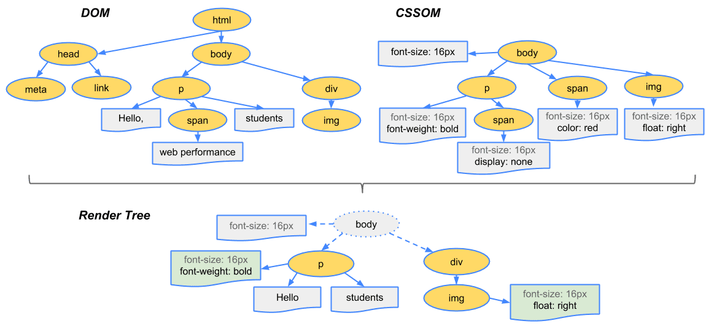
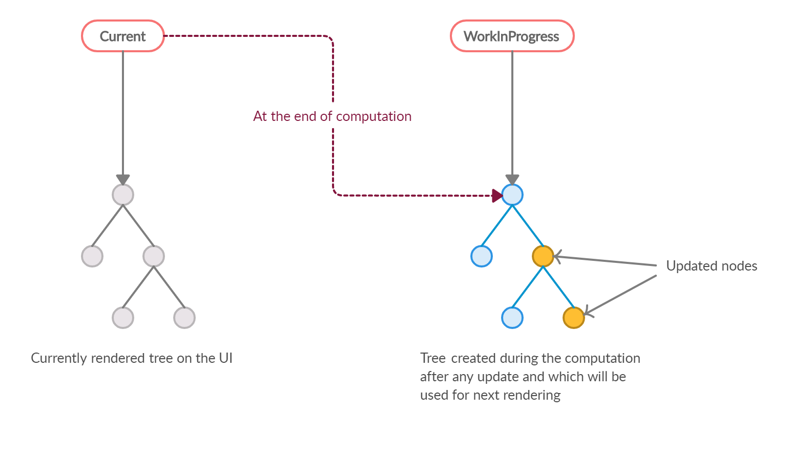

# 2장 리액트 핵심 요소 깊게 살펴보기

# 4회차(2.1~2.2)

## JSX란?

- 리액트에 종속적이지 않은 문법
- JS 표준의 일부가 아님.
  => 트랜스파일러를 거쳐야 JS 런타임이 이해할 수 있는 JS코드로 변환됨
- 트리 구조를 토큰화해 ECMAScript로 변환하는 데 초점을 두고있음.

### JSX의 정의

**JSXElement, JSXAttributes, JSXChildren, JSXString** 등 4가지로 구성.

#### JSXElement

JSX를 이루는 가장 기본적인 요소.

- JSXOpeningElement: JSXClosingElement와 동일한 요소로 같은 단계에서 선언돼 있어야함.
- JSXClosingElement: JSXOpeningElement가 종료됐음을 알림.
- JSXSelfClosingElement: 요소가 시작되고, 스스로 종료되는 형태. 자식을 못가짐.
- JSXFragment: 아무런 요소가 없음 `<></>` <= 같이써야함.

요소명은 대문자로만 시작해야되지 않냐??

- 리액트에서는 컴포넌트 이름은 무조건 대문자로 시작해야됨.
- **HTML 태그명**과 **컴포넌트 태그명**을 구분 짓기 위함임.  
  => 확실하게 구분해서 미래에 추가되는 HTML에 대한 가능성을 열어둠.

#### JSXElementName

JSXElement의 요소 이름으로 쓸 수 있는 것.

- JSXIdentifier(실전성 없음)  
  JSX 내부에서 사용가능한 식별자. JS와 동일  
  => `<$></$>`, `<_></_>` 얘네들로만 가능.

  ```JSX
  function Valid() {
    return <$></$>
  }
  ```

- JSXNamespacedName: JSX
  JSXIdentifier:JSXIdentifier의 조합. 서로 다른 식별자를 이어주는 식별자
  => 한개만 묶을수 있음. 두 개 이상 X

  ```JSX
  function Valid() {
    return <foo:bar></foo:bar>
  }
  ```

- JSXMeMberExpression: JSXIdentifier.JSXIdentifier의 조합.  
  => 하나의 식별자로 취급되고, 두 개 이상 O, ":" 랑같이 쓰는거 X
  ```JSX
  function valid() {
    return <foo.bar></foo.bar>
  }
  ```

#### JSXAttributes

JSXElement에 부여할 수 있는 속성.  
=> 필수아님.

#### JSXChildren

JSXElement의 자식.

#### JSXStrings

큰따옴표(""), 작은따옴표(''), JSXText({})를 의미

- JS 에서는 \로 시작하는 이스케이프 문자 형태소를 쓸 때 제약사항이 많음.  
  => jSX는 제약 없이 사용 가능.

  ```JSX
  // 가능
  <p>\</p>

  // Uncaught SyntaxError: Invalid or unexpected token
  let escape1 = "\"
  ```

### JSX 예제

```JSX
// 하나의 요소로 구성
const Component = <A>Oh, Hi!</A>

// 자식이 없음
const Component = <A />

// 옵션을 {}와 전개 연산자로 넣을 수 있다.
const Component = <A {...{ required: true}} />

// 속성만 넣어도 가능.
const Component = <A required />

// 속성과 속성값을 넣을 수 있다.
const Component = <A required = {false} />

// 문자열은 ",' 등으로 감싸주면됨
const const Component = <A alt="이미지" />

// 옵션 값으로 JSXElement도 가능
const Component = <A optionalChildren={<>hi</>} />

// 자식 여러개도 넣을 수 있음.
const const Component =
  <A>
    hi
    <B/>
  </A>
```

리액트에서는 안되는 얘들도 JSX에서 문법 자체로는 유효함.

```JSX
function ComponentA() {
  return <A.B></A.b>
}

function ComponentB() {
  return <A.B.C></A.B.C>
}

function ComponentC() {
  return <A:B.C></A:B.C> //얘는 안되는데? 뭐죠??
}

function ComponentD() {
  return <$></$>
}

function ComponentE() {
  return <_></_>
}
```

### JSX는 어떻게 자바스크립트에서 변환될까?

- 다른 JSXElement를 렌더링해야 할 때 요소 전체를 안 감싸도 가능  
  => 반환값이 결국 React.createElement로 귀결되는 것을 파악해야함.

### 정리

- JSX 내부에 JS 문법이 많아질수록 가독성이 떨어지므로 주의.
- JSX가 어떻게 변환되고 결과를 만들어내는지 알아두면 도움됨.
- 상황에 맞춰 직접 createElement를 사용해 컴포넌트를 구성하는 편이 좋을수도?

## 가상 DOM과 리액트 파이버

리액트의 가상 DOM과 실제 DOM을 비교하면서, 가상 DOM을 알아보자.

### DOM과 브라우저 렌더링 과정

웹페이지의 인터페이스. 브라우저가 웹페이지의 콘텐츠와 구조를 어떻게 보여줄지에 대한 정보를 담음.


1. HTML 마크업을 처리하고 DOM 트리를 빌드합니다.
2. CSS 마크업을 처리하고 CSSOM 트리를 빌드합니다.
3. DOM 및 CSSOM을 렌더링 트리로 결합합니다.
4. 렌더링 트리에서 레이아웃을 실행하여 각 노드의 도형을 계산합니다.
5. 개별 노드를 화면에 페인팅합니다.

$코드 예시$

```html
#text { 1. html을 다운로드, 분석 background-color: red; 2. link태그 발견후
style.css 다운 } 3. body 태그 하단의 div의 width로 뷰포트 설정
<!DOCTYPE html> 4. 3번 하단의 div의 width로 뷰포트 설정
<html>
  5. 2번에서 다운로드한 CSS에 id="text" 적용
  <head>
    6. 준비완료! 렌더링ㄱㄱ
    <link rel="stylesheet" type="text/css" href="./style.css" />
    <title>Hello React</title>
  </head>
  <body>
    <div style="width: 100%;">
      <div id="text" style="width: 50%;">Hello World!</div>
    </div>
  </body>
</html>
```

### 가상 DOM의 탄생 배경

1. 렌더링이 완료된 이후에도 사용자의 인터랙션으로 웹페이지가 변경되는 것을 고려해야함.
2. 요소의 위치와 크기를 재계산 해야함. **리페인팅**, **레이아웃** 발생  
   **레이아웃**: 요소의 위치와 크기를 계산하여 페이지 배치를 결정하는 과정.  
   **리페인팅**: 시각적 속성이 변경되어 화면에 다시 그리는 과정.
3. 개발자가 DOM의 모든 변경 사항을 추적해야함.
4. 인터랙션에 모든 DOM의 변경보다 결과만 아는게 편함.  
   => 가상 DOM 탄생

#### 가상 DOM이란?

리액트가 관리하는 가상의 DOM.  
=> 웹페이지가 표시해야 할 DOM을 메모리에 저장하고 리액트가 준비되면, 실제 브라우저의 DOM에 반영함.

### 가상 DOM을 위한 아키텍처, 리액트 파이버

가상 DOM과 렌더링 과정 최적화를 가능하게 해줌.

#### 리액트 파이버란?

과거 리액트의 조정 알고리즘은 스택 알고리즘. 동기적으로 작업 수행  
=> 다른 작업을 수행하고 싶어도 불가능함, 비효율적.

$파이버$란

- 단순한 자바스크립트 객체로 관리되고 있음.
- 파이버는 파이버 재조정자가 관리함.  
  => 가상 DOM과 실제DOM을 비교해서 변경 사항을 수집.
- 차이가 있으면 파이버를 기준으로 화면에 렌더링을 요청함.
- **재조정**: 리액트에서 어디를 새로 렌더링 해야하는지 DOM과 가상 DOM 비교하는 작업임.

$파이버의$ 구성

- 파이버는 하나의 작업 단위로 구성돼 있음.
- 리액트는 이러한 작업 단위를 하나씩 처리하고 finishedWork()로 마무리.
- 모든 비동기 작업을 수행. 파이버의 작업, 우선순위를 지정, 중지, 버리는 작업이 일어남
- DOM에 실제 변경 사항을 반영. commitWork()가 실행되고, 동기식이므로 중단 불가능

리액트 요소는 렌더링시 새롭게 생성되지만 파이버는 재사용됨.  
=> 파이버는 컴포넌트가 최초로 마운트되는 시점에 생성됨.

state.가 변경되거나 생명주기 메서드 실행, DOM의 변경이 필요한 시점등에 실행됨  
이러한 작업을 바로 처리하기도하고 스케줄링하기도함.  
즉, 작은 단위로 나눠서 처리할 수도, 우선순위가 높은 작업은 빠르게하거나, 낮은 작업을 연기시키는 등 유연해.

#### 리액트 파이버 트리

리액트 내부에 현재 모습을 담은 current 트리, 작업 중인 상태를 나타내는 workInProgress 트리로 존재  
  
더블 버퍼링 기술을 이용해서 작업을 수행.  
=> 보이지 않는 곳에서 작업을 수행해서 결과를 반영해주기 위함.

**리액트에서 더블 버퍼링이란?**

1. 업데이트가 발생함.
2. 새로 받은 데이터로 새로운 workInProgress 트리를 빌드함.
3. current 트리를 workInProgress로 변경함.

#### 파이버의 작업 순서

파이버 노드의 생성 흐름

1. beginWork() 함수를 실행해 자식없는 파이버를 만날 때까지 트리 형식으로 시작.
2. 1번 작업이 끝나면 completeWork() 함수를 실행해 작업을 완료.
3. 형제가 있다면 형제로 넘어가고 아니면 return으로 돌아와 작업 완료를 알림.

$코드 예시$

```html
<A1>
  1. A1의 beginWork() 수행 <B1>hi</B1> 2. A1의 자식인 B1로 이동해 beginWork()를
  수행
  <B2>
    3. B1은 자식이 없으니 completeWork()수행, 형제인 B2로감.
    <C1> 4. B2의 beginWork() 수행 자식이 있으니 C1로 이동. </C1> 5. ...
  </B2>
</A1>
```

루트 노드가 끝나면, 최종적으로 commitWork()가 수행되고 업데이트가 필요한 변경 사항이 DOM에 반영.

$트리가$ $생성된$ $상태로$ $업데이트가$ $발생하면$ $어케됨?$

1. 최초 렌더링 시에는 모든 파이버를 새롭게 만들어야 했음.
2. 기존 파이버에서 업데이트된 props를 받아서 내부에서 처리.  
   => 객체 내부 속성값만 초기화하거나 바꾸는 형태로 업데이트해서 효율적임.

- 우선순위가 높은 다른 업데이트가 오면 유동적으로 대처 할 수있음.

#### 파이버와 가상 DOM

파이버와 가상 DOM은 동일한 개념이 아니다.

- 가상 DOM은 오직 웹 애플리케이션에서만 통용되는 개념.
- 리액트 파이버는 브라우저가 아닌 환경에서도 사용 가능함.
- 리액트와 리액트 네이티브의 렌더러가 서로 달라도 파이버를 통해서 조정되는 과정은 동일해서 동일한 재조정자를 사용할 수 있음.

#### 정리

- 가상 DOM과 파이버는 빠르다는 이유만으로 만들어진게 아님.  
  => 개발자가 직접 DOM을 수동으로 변경했으면 요소와 값을 파악하기 매우 어려움.
- 가상 DOM과 리액트의 핵심은 값으로 UI를 표현하는 것.

#### 어려운거

- 파이버의 동작, 원리

#### 새로안거

- 가상DOM의 역할과 원리
- JSX와 리액트는 별개임.
