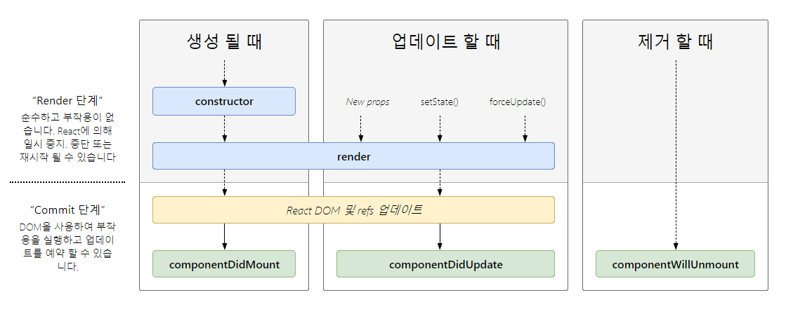

# 2장 리액트 핵심 요소 깊게 살펴보기

# 4회차(2.1~2.2)

## JSX란?

- 리액트에 종속적이지 않은 문법
- JS 표준의 일부가 아님.
  => 트랜스파일러를 거쳐야 JS 런타임이 이해할 수 있는 JS코드로 변환됨
- 트리 구조를 토큰화해 ECMAScript로 변환하는 데 초점을 두고있음.

### JSX의 정의

**JSXElement, JSXAttributes, JSXChildren, JSXString** 등 4가지로 구성.

#### JSXElement

JSX를 이루는 가장 기본적인 요소.

- JSXOpeningElement: JSXClosingElement와 동일한 요소로 같은 단계에서 선언돼 있어야함.
- JSXClosingElement: JSXOpeningElement가 종료됐음을 알림.
- JSXSelfClosingElement: 요소가 시작되고, 스스로 종료되는 형태. 자식을 못가짐.
- JSXFragment: 아무런 요소가 없음 `<></>` <= 같이써야함.

요소명은 대문자로만 시작해야되지 않냐??

- 리액트에서는 컴포넌트 이름은 무조건 대문자로 시작해야됨.
- **HTML 태그명**과 **컴포넌트 태그명**을 구분 짓기 위함임.  
  => 확실하게 구분해서 미래에 추가되는 HTML에 대한 가능성을 열어둠.

#### JSXElementName

JSXElement의 요소 이름으로 쓸 수 있는 것.

- JSXIdentifier(실전성 없음)  
  JSX 내부에서 사용가능한 식별자. JS와 동일  
  => `<$></$>`, `<_></_>` 얘네들로만 가능.

  ```JSX
  function Valid() {
    return <$></$>
  }
  ```

- JSXNamespacedName: JSX
  JSXIdentifier:JSXIdentifier의 조합. 서로 다른 식별자를 이어주는 식별자
  => 한개만 묶을수 있음. 두 개 이상 X

  ```JSX
  function Valid() {
    return <foo:bar></foo:bar>
  }
  ```

- JSXMeMberExpression: JSXIdentifier.JSXIdentifier의 조합.  
  => 하나의 식별자로 취급되고, 두 개 이상 O, ":" 랑같이 쓰는거 X
  ```JSX
  function valid() {
    return <foo.bar></foo.bar>
  }
  ```

#### JSXAttributes

JSXElement에 부여할 수 있는 속성.  
=> 필수아님.

#### JSXChildren

JSXElement의 자식.

#### JSXStrings

큰따옴표(""), 작은따옴표(''), JSXText({})를 의미

- JS 에서는 \로 시작하는 이스케이프 문자 형태소를 쓸 때 제약사항이 많음.  
  => jSX는 제약 없이 사용 가능.

  ```JSX
  // 가능
  <p>\</p>

  // Uncaught SyntaxError: Invalid or unexpected token
  let escape1 = "\"
  ```

### JSX 예제

```JSX
// 하나의 요소로 구성
const Component = <A>Oh, Hi!</A>

// 자식이 없음
const Component = <A />

// 옵션을 {}와 전개 연산자로 넣을 수 있다.
const Component = <A {...{ required: true}} />

// 속성만 넣어도 가능.
const Component = <A required />

// 속성과 속성값을 넣을 수 있다.
const Component = <A required = {false} />

// 문자열은 ",' 등으로 감싸주면됨
const const Component = <A alt="이미지" />

// 옵션 값으로 JSXElement도 가능
const Component = <A optionalChildren={<>hi</>} />

// 자식 여러개도 넣을 수 있음.
const const Component =
  <A>
    hi
    <B/>
  </A>
```

리액트에서는 안되는 얘들도 JSX에서 문법 자체로는 유효함.

```JSX
function ComponentA() {
  return <A.B></A.b>
}

function ComponentB() {
  return <A.B.C></A.B.C>
}

function ComponentC() {
  return <A:B.C></A:B.C> //얘는 안되는데? 뭐죠??
}

function ComponentD() {
  return <$></$>
}

function ComponentE() {
  return <_></_>
}
```

### JSX는 어떻게 자바스크립트에서 변환될까?

- 다른 JSXElement를 렌더링해야 할 때 요소 전체를 안 감싸도 가능  
  => 반환값이 결국 React.createElement로 귀결되는 것을 파악해야함.

### 정리

- JSX 내부에 JS 문법이 많아질수록 가독성이 떨어지므로 주의.
- JSX가 어떻게 변환되고 결과를 만들어내는지 알아두면 도움됨.
- 상황에 맞춰 직접 createElement를 사용해 컴포넌트를 구성하는 편이 좋을수도?

## 가상 DOM과 리액트 파이버

리액트의 가상 DOM과 실제 DOM을 비교하면서, 가상 DOM을 알아보자.

### DOM과 브라우저 렌더링 과정

웹페이지의 인터페이스. 브라우저가 웹페이지의 콘텐츠와 구조를 어떻게 보여줄지에 대한 정보를 담음.


1. HTML 마크업을 처리하고 DOM 트리를 빌드합니다.
2. CSS 마크업을 처리하고 CSSOM 트리를 빌드합니다.
3. DOM 및 CSSOM을 렌더링 트리로 결합합니다.
4. 렌더링 트리에서 레이아웃을 실행하여 각 노드의 도형을 계산합니다.
5. 개별 노드를 화면에 페인팅합니다.

$코드 예시$

```html
#text { background-color: red; }
<!DOCTYPE html>
<html>
  <head>
    <link rel="stylesheet" type="text/css" href="./style.css" />
    <title>Hello React</title>
  </head>
  <body>
    <div style="width: 100%;">
      <div id="text" style="width: 50%;">Hello World!</div>
    </div>
  </body>
</html>
```

1. html을 다운로드, 분석
2. link태그 발견 후 style.css 다운
3. body 태그 하단의 div의 width로 뷰포트 설정
4. 3번 하단의 div의 width로 뷰포트 설정
5. 2번에서 다운로드한 CSS에 id="text" 적용
6. 준비완료! 렌더링ㄱㄱ

### 가상 DOM의 탄생 배경

1. 렌더링이 완료된 이후에도 사용자의 인터랙션으로 웹페이지가 변경되는 것을 고려해야함.
2. 요소의 위치와 크기를 재계산 해야함. **리페인팅**, **레이아웃** 발생  
   **레이아웃**: 요소의 위치와 크기를 계산하여 페이지 배치를 결정하는 과정.  
   **리페인팅**: 시각적 속성이 변경되어 화면에 다시 그리는 과정.
3. 개발자가 DOM의 모든 변경 사항을 추적해야함.
4. 인터랙션에 모든 DOM의 변경보다 결과만 아는게 편함.  
   => 가상 DOM 탄생

#### 가상 DOM이란?

리액트가 관리하는 가상의 DOM.  
=> 웹페이지가 표시해야 할 DOM을 메모리에 저장하고 리액트가 준비되면, 실제 브라우저의 DOM에 반영함.

### 가상 DOM을 위한 아키텍처, 리액트 파이버

가상 DOM과 렌더링 과정 최적화를 가능하게 해줌.

#### 리액트 파이버란?

과거 리액트의 조정 알고리즘은 스택 알고리즘. 동기적으로 작업 수행  
=> 다른 작업을 수행하고 싶어도 불가능함, 비효율적.

$파이버$란

- 단순한 자바스크립트 객체로 관리되고 있음.
- 파이버는 파이버 재조정자가 관리함.  
  => 가상 DOM과 실제DOM을 비교해서 변경 사항을 수집.
- 차이가 있으면 파이버를 기준으로 화면에 렌더링을 요청함.
- **재조정**: 리액트에서 어디를 새로 렌더링 해야하는지 DOM과 가상 DOM 비교하는 작업임.

$파이버의$ 구성

- 파이버는 하나의 작업 단위로 구성돼 있음.
- 리액트는 이러한 작업 단위를 하나씩 처리하고 finishedWork()로 마무리.
- 모든 비동기 작업을 수행. 파이버의 작업, 우선순위를 지정, 중지, 버리는 작업이 일어남
- DOM에 실제 변경 사항을 반영. commitWork()가 실행되고, 동기식이므로 중단 불가능

리액트 요소는 렌더링시 새롭게 생성되지만 파이버는 재사용됨.  
=> 파이버는 컴포넌트가 최초로 마운트되는 시점에 생성됨.

state.가 변경되거나 생명주기 메서드 실행, DOM의 변경이 필요한 시점등에 실행됨  
이러한 작업을 바로 처리하기도하고 스케줄링하기도함.  
즉, 작은 단위로 나눠서 처리할 수도, 우선순위가 높은 작업은 빠르게하거나, 낮은 작업을 연기시키는 등 유연해.

#### 리액트 파이버 트리

리액트 내부에 현재 모습을 담은 current 트리, 작업 중인 상태를 나타내는 workInProgress 트리로 존재  
  
더블 버퍼링 기술을 이용해서 작업을 수행.  
=> 보이지 않는 곳에서 작업을 수행해서 결과를 반영해주기 위함.

**리액트에서 더블 버퍼링이란?**

1. 업데이트가 발생함.
2. 새로 받은 데이터로 새로운 workInProgress 트리를 빌드함.
3. current 트리를 workInProgress로 변경함.

#### 파이버의 작업 순서

파이버 노드의 생성 흐름

1. beginWork() 함수를 실행해 자식없는 파이버를 만날 때까지 트리 형식으로 시작.
2. 1번 작업이 끝나면 completeWork() 함수를 실행해 작업을 완료.
3. 형제가 있다면 형제로 넘어가고 아니면 return으로 돌아와 작업 완료를 알림.

$코드 예시$

```html
<A1>
  <B2>
    <C1></C1>
  </B2>
</A1>
```

1. A1의 beginWork() 수행
2. A1의 자식인 B1로 이동해 beginWork()를 수행
3. B1은 자식이 없으니 completeWork()수행, 형제인 B2로감.
4. B2의 beginWork() 수행 자식이 있으니 C1로 이동.
5. ...
   루트 노드가 끝나면, 최종적으로 commitWork()가 수행되고 업데이트가 필요한 변경 사항이 DOM에 반영.

$트리가$ $생성된$ $상태로$ $업데이트가$ $발생하면$ $어케됨?$

1. 최초 렌더링 시에는 모든 파이버를 새롭게 만들어야 했음.
2. 기존 파이버에서 업데이트된 props를 받아서 내부에서 처리.  
   => 객체 내부 속성값만 초기화하거나 바꾸는 형태로 업데이트해서 효율적임.

- 우선순위가 높은 다른 업데이트가 오면 유동적으로 대처 할 수있음.

#### 파이버와 가상 DOM

파이버와 가상 DOM은 동일한 개념이 아니다.

- 가상 DOM은 오직 웹 애플리케이션에서만 통용되는 개념.
- 리액트 파이버는 브라우저가 아닌 환경에서도 사용 가능함.
- 리액트와 리액트 네이티브의 렌더러가 서로 달라도 파이버를 통해서 조정되는 과정은 동일해서 동일한 재조정자를 사용할 수 있음.

#### 정리

- 가상 DOM과 파이버는 빠르다는 이유만으로 만들어진게 아님.  
  => 개발자가 직접 DOM을 수동으로 변경했으면 요소와 값을 파악하기 매우 어려움.
- 가상 DOM과 리액트의 핵심은 값으로 UI를 표현하는 것.

#### 어려운거

- 파이버의 동작, 원리

#### 새로안거

- 가상DOM의 역할과 원리
- JSX와 리액트는 별개임.

# 5회차(2.3~)

## 클래스 컴포넌트와 함수 컴포넌트

과거에는 생명주기 메서드나 상태가 필요 없는경우에만 함수 컴포넌트를 썼었음, 하지만 16.8에서 훅이 등장한 이후에는 함수 컴포넌트가 대세가됨. 함수와 클래스 컴포넌트 차이가 무엇이길래??

### 클래스 컴포넌트

오래된 코드 유지보수, 라이브러리 등을 쓸 때 도움이 되므로 배우면 좋음.

- 클래스를 선언한다.
- extends 뒤에 React.Component나 React.PureComponent 넣으면됨.

React.Component, React.PureComponent 차이는?
둘다 똑같이 state의 변화에 따라 업데이트 하지만,  
PureComponent는 얕은 비교로 값이 다를 때만 렌더링을 수행함.
=> 복잡한 구조는 감지 못하고, 남발하면 최적화에 악영향.

```JS
import React from 'react'

// props 타입을 선언
interface Props {
  required?: boolean;
  text: string;
}

// state 타입을 선언
interface SampleState {
  count: number;
  isLimited?:boolean;
}

// Component에 제네릭으로 props, state를 순서대로 넣는다.
class SampleComponent extends React.Component<Props, State> {
  // constructor에서 props를 주고, state의 기본값 설정
  private constructor(props: Props) {
    super(props)
    this.state = {
      count: 0,
      isLimited: false,
    }
  }

  // render 내부에서 쓰일 함수를 선언한다.
  private handle = () => {
    const newValue = this.state.count + 1
    this.setState({ count: newValue, isLimited: newValue >= 10})
  }

  // render에서 이 컴포넌트가 렌더링할 내용을 정의.
  public render() {
    //props와 state 값을 this, 해당 클래스에서 꺼냄.
    const {
      props: { required, text },
      state: { count, isLimited },
    } = this

    return (
      <h2>
        Sample Component
        <div>{required ? '필수' : '흠?'}</div>
        <div>문자: {text}</div>
        <div>count: {count}</div>
        <button onClick={this.handleClick} disabled={isLimited}>
          증가
        </button>
      </h2>
    )
  }
}
```

- constructor(): 컴포넌트 초기화되는 시점에 호출. state를 초기화하고 super()를 통해 상위 컴포넌트로 접근 가능

  - constructor 없어도 state 초기화 되지 않냐?

  ```JS
  class SampleComponent extends Component {
    state = {
      count: 1,
    }

    render() {
      const {
        state: {count},
      } = this
      return <div>{count}</div>
    }
  }
  ```

  클래스 필드에 count를 선언해서 인스턴스의 변수로 만든 후 호출하면됨. 바벨을 쓰거나, ES2022환경의 브라우저에서 써야된다.

- props: 컴포넌트에 특정 속성을 전달해줌. ex) `<Component text="hi" />`

- state: 항상 객체여야함. 변화가 있을 때마다 리렌더링됨

- 메서드: 렌더링 함수 내부에서 사용되는 함수. DOM에서 발생하는 이벤트화 같이씀. 3가지 방법을 알아보자.

  - 일반 함수에서 bind를 강제로 사용 <= this가 전역개체를 가르킴

  ```JS
  // 현재 클래스로 바인딩
  this.handleClick = this.handleClick.bind(this)

  private handleClick() {
    this.setState((prev) => ({ count: prev.count + 1}))
  }
  ```

  - 화살표 함수 사용 <= 작성 시점에 this가 상위 스코프로 결정됨

  ```JS
  private handleClick() => {
    this.setState((prev) => ({ count: prev.count + 1}))
  }
  ```

  - 메서드 내부에서 함수를 전달. => 리렌더링 마다 함수를 생성해서 최적화가 구림.

  ```html
  <button onClick={() => this.handleClick()}>증가</button>
  ```

#### 클래스 컴포넌트의 생명주기 메서드

클래스 컴포넌트는 생명주기 메서드에 의존성이 매우 강함  
한번 알아보자

생명주기 메서드가 실행되는 시점은 크게 3가지

- 마운트: 컴포넌트가 생성되는 시점
- 업데이트: 이미 생성된 컴포넌트의 내용이 변경되는 시점
- 언마운트: 컴포넌트가 존재X

**render**()

- 업데이트와 마운트 과정에서 UI를 렌더링 하기 위해 쓰임.
- 입력 값이 들어가면 항상 같은 결과물을 반환해야함  
  => render()내부에서 state를 업데이트하지 말자 this.setState금지

**componentDidMount**()

- 컴포넌트가 마운트되고 준비되면 실행.
- state값을 변경하는게 가능. 변경 시 즉시 다시 렌더링.
- 실제로 UI를 업데이트하기 전에 렌더링이 실행되서 사용자가 눈치못챔.  
  => API 호출 업데이트, DOM에 의존적인 작업이아니면 얘로는 state바꾸지말자.

**componentDidUpdate**()

- 컴포넌트가 업데이트된 후 실행됨.
- state, props의 변화에 따라 DOM을 업데이트하는데 씀.  
  => setState를 쓸 수 있지만, 조건문 안쓰면 계속 호출될 수 있음.

**componentWillUnmount**()

- 컴포넌트가 언마운트되거나 사용되지 않기 직전에 호출됨.
- 클린업 함수를 호출 하기 좋음(ClearInterval()), setState X  
  => setInterval, setTimeout으로 생성된 타이머 지울수 있음.

**shouldComponentUpdate**()

- state, props를 변경으로 리렌더링 되는 것을 막을 때 씀
- 영향을 받지 않는 변화에 대해 정의 가능.  
  => 성능 최적화 할 때만 쓰자.
  ```JS
  shouldComponentUpdate(nextProps: Props, nextState: State) {
    // true일 시, title이나 input이 다른 경우 업데이트함.
    return this.props.title !== nextProps.title || this.state.input !== nextState.input
  }
  ```

**static getDerivedStateFromProps**() => componentWillReceiveProps() 대체

- 모든 render()가 호출하기 직전에 호출됨
- this에 접근 할 수 없고, 반환되는 객체는 모두 state로 들어감. null반환 시 아무일도 없음.

**getSnapShotBeforeUpdate**() => componentWillUpdate() 대체할 수 도 있음.

- DOM이 업데이트되기 직전에 호출. => 반환 값 componentDidUpdate로 전달
- DOM에 렌더링되기 전에 윈도우 크기 조절, 스크롤 위치 조정 등에 쓰임.

**getDerivedStateFromError**()

- 하위 컴포넌트에서 에러 발생 시 실행됨. 자식 컴포넌트를 어떻게 렌더링할지 결정함.
- 미리 정의해 둔 state 값을 반환해야함.
- 렌더링 과정에서 호출하는 얘라 state반환 외 모든 작업을 하면안됨.  
  => 부수 효과 있어도 상관없는데, 최적화에 방해됨.

**componentDidCatch**()

- getDerivedStateFromError()가 에러를 잡고 state반환 시 실행.
- 에러와 정보를 인수로 받음.
- 커밋 단계에서 실행. 부수효과를 수행할 수 있음.

앞에 두 메서드는 ErrorBoundary라함. 전역에서 처리 못한 에러를 처리하는 용도.  
모든 에러를 처리하지는 못하고 throw 될 수 있다.  
=> 여러개 선언해서 컴포넌트별로 에러 처리를 다르게 적용할 수 도 있음.

- 개발 모드에서는 모든 에러에 대해 실행되고, 프로덕션에는 안잡힌 에러에만 실행됨.  
  => 개발 모드에서 발생한 에러를 확실히 알려주기 위함.

#### 클래스 컴포넌트의 한계

- 데이터 흐름을 추적하기 힘듬.
  - 여러 메서드에서 state를 업데이트 할 수 있는 점.
  - 메서드의 순서가 안정해져 있어서 읽기 힘듬.
- 앱 내부 로직의 재사용이 힘듬.
- 기능이 많아지면 컴포넌트도 커짐.
- 함수 컴포넌트보다 어려움.
- 코드 크기를 최적화하기 힘듬.
  - 쓰이지 않는 함수도 빌드 시, 번들에 포함되어버림.
- 핫 리로딩에 불리함. <= 변경된 코드만 업데이트해서 적용하는 거

  ```JS
  function FunctionalComponent() {
    const [count, setCount] = useState(0)

    function handleClick() {
      setCount((prev) => prev + 1)
    }

    return (
      <>
        <button onClick={handleClick}>{count} + </button>
      </>
    )
  }

  class ClassComponent extends PureComponent<{}, { count: number}> {
    constructor(props: {}) {
      super(props)
      this.state = {
        count: 0,
      }
    }

    handleClick = () => {
      this.setState((prev) => ({ count: prev.count + 1}))
    }

    render() {
      return
        <button onClick={this.handleClick}>{this.state.count}
         +
        </button>
    }
  }

  export default function App() {
    return(
      <>
        <FunctionalComponent />
        <ClassComponent />
      </>
    )
  }
  ```

  클래스 컴포넌트

  - 처음 렌더링 시, instance를 생성하고 state를 관리함.
  - render를 수정하게 되면 instance를 새로 만들어야함.  
    => 새instance의 state값은 초기화 되어야함. 핫 로딩 X

  함수 컴포넌트

  - 클로저에 state를 저장.  
    => 다시 실행돼도 state를 초기화하지 않고 값 줄수 있음. 핫 로딩 O

### 함수 컴포넌트

무상태 컴포넌트 원툴이였지만, 훅이 등장하면서 떡상함.

```JS
export function Component({ required, text}) {
  const [count, setCount] = useState<number>(0)
  const [isLimited, setIsLimited] = useState<boolean>(false)

  function handleClick() {
    const newValue = count + 1
    setCount(newValue)
    setIsLimited(newValue >= 10)
  }

  return (
      <h2>
        Sample Component
        <div>{required ? '필수' : '흠?'}</div>
        <div>문자: {text}</div>
        <div>count: {count}</div>
        <button onClick={this.handleClick} disabled={isLimited}>
          증가
        </button>
      </h2>
  )
}
```

**앞에 클래스 컴포넌트랑 비교 시**

- render 내부에서 함수 선언시 this바인딩 신경안써도됨.
- state가 객체말고 원시 값으로 관리되서 쓰기 편함.
- return안에서도 this안써도 props, state에 접근 가능

### 함수 컴포넌트 vs 클래스 컴포넌트

둘의 차이가 무엇일까?

#### 생명주기 메서드의 부재

클래스 컴포넌트

- render(생명주기) 메서드가 있는 React.Component를 상속받아 구현함

함수 컴포넌트

- props를 받아 요소만 반환함.  
  => useEffect훅으로 생명주기와 비슷하게 구현가능.

#### 함수 컴포넌트와 렌더링된 값

함수 컴포넌트는 렌더링 값을 고정, 클래스 컴포넌트는 안됨.

```JS
export function FunctionalComponent(props) {
  const showMessage = () => {
    alert('Hello' + props.user)
  }

  const handleClick = () => {
    setTimeout(showMessage, 3000)
  }

  return <button onClick={handleClick}>Me!</button>
}

export class ClassComponent extends React.Component<Props, {}> {
  private showMessage = () => {
    alert('Hello' + this.props.user)
  }

  private handleClick = () => {
    setTimeout(this.showMessage, 3000)
  }

  public render() {
    return <button onClick={this.handleClick}>Me!</button>
  }
}
```

버튼을 클릭하면 3초 후에 user를 alert로 띄워주는 작업.

**클래스 컴포넌트는 버튼 클릭 시 props의 값을 변경하면 변경된 게 뜸.**

- 메서드가 인스턴스에 바인딩됨. 즉, 메서드가 호출될 때마다 this는 그 메서드가 속한 클래스 인스턴스를 가리킴. this.props는 항상 현재의 props를 가리키므로, 메서드가 호출될 때마다 최신의 this.props 값을 참조한다.  
  => 클래스의 props는 불변 값이지만 인스턴스 멤버는 변경 가능하기 때문.
  1. showMessage 메서드는 this.props.user 값을 참조.
  2. handleClick 메서드가 호출되면, showMessage 메서드를 setTimeout의 콜백으로 전달. 이때 showMessage는 인스턴스의 this에 바인딩된 상태.
  3. 3초 후에 setTimeout이 콜백을 실행할 때, 이 콜백은 최신의 this.props.user 값을 사용한다.

여러 해결방법이 있지만 부작용이 큼.

**함수 컴포넌트는 변경 전의 값이 뜸.**

- 함수가 렌더링될 때마다 클로저됨. 값이 변해도 setTimeout은 이전에 클로저가 생성된 시점의 값을 사용함.

요약하자면, this에 바인딩된 props를 사용하냐, props를 인수로 받느냐의 차이.

#### 클래스 컴포넌트를 공부해야 할까?

- 굳이 사용할 필요도 없고, 기존 클래스 컴포넌트를 함수 컴포넌트로 바꿀 필요도없음
- 리액트 역사의 흐름을 아는데에 도움됨.
- **자식 컴포넌트에서 발생한 에러에 대한 처리는 클래스 컴포넌트만 가능**

## 렌더링은 어떻게 일어나는가?

리액트에서는 브라우저가 렌더링에 필요한 DOM트리를 만드는 과정.  
유저의 사용자 경험을 위해 렌더링을 이해하고, 시간을 줄여보자.

### 리액트의 렌더링이란?

props, state 값을 기반으로 UI를 구성하고, DOM결과를 브라우저에 제공하는 방식을 계산하는 과정  
=> props, state가 없으면 오직 JSX 값을 기반으로 렌더링이 일어남.

### 리액트의 렌더링이 일어나는 이유

언제 발생함?

1. 최초 렌더링: 렌더링 결과물을 브라우저가 만들게 정보를 제공하기 위해 최초 렌더링 수행.
2. 리렌더링: 최초 렌더링을 제외한 모든 렌더링  
   리렌더링 발생하는 경우
   - useState의 setter가 실행될 때
   - useReducer의 dispatch가 실행될 때
   - props 변경
   - 부모 컴포넌트가 렌더링될 때
   - 컴포넌트의 key props가 변경될 때. props없어도 쓸 수 있음.  
     왜 써야하지?
     - 리렌더링 발생 시, current 트리와 workInProgress 사이에서 값이 변경된 형제 컴포넌트를 찾아야 하는경우, key를 이용해 같은 컴포넌트인지를 구별할 수 있음.  
       => key가 없다면 파이버 내부의 sibling 인덱스로 구분해야함.  
        key에 임의의 값 넣어서 리렌더링 발생시키기도 가능.

### 리액트의 렌더링 프로세스

리액트가 렌더링 되는 과정

1. 루트에서부터 아래쪽으로 내려가면서 업데이트가 필요한 모든 컴포넌트를 찾음.
2. 발견 시, 클래스 컴포넌트는 render()를 실행하고, 함수 컴포넌트는 자신을 호출하고 저장.
3. JSX문법이 JS로 컴파일되면서 React.createElement()를 호출하는 구문으로 변함.
4. createElement가 브라우저의 UI구조를 설명하는 일반 JS객체를 반환함.
5. 수집한 결과물들로 가상 DOM과 비교해 실제 DOM에 반영할 준비를 함.

렌더 단계와 커밋 단계로 나눠서 실행됨.

### 렌더와 커밋


**렌더 단계**: 변경이 필요한 컴포넌트를 체크하는 단계.  
=> type, props, key 셋 중 하나라도 변경되면 체크함.

**커밋 단계**: 렌더 단계의 변경 사항을 실제 DOM에 적용함.

**렌더 단계에서 변경 사항이 없으면 렌더링 되더라도 DOM업데이트가 안될 수 있음.**

렌더링은 기본적으로 동기적으로 작동을 함.  
=> 렌더링 과정이 길어질수록 성능 저하 및 브라우저의 다른 작업을 지연시킴.  
이걸 보완하기 위해 리액트 18부터는 렌더 단계에서 비동기적으로 작동함.  
=> 렌더링에 우선순위를 부여해 줄 수 있어서 사용자 경험 향상.

### 일반적인 렌더링 시나리오 살펴보기

```JS
export default function A() {
  return (
    <div className="App">
      <B />
    </div>
  );
}

function B() {
  const [counter, setCounter] = useState(0);

  function handleButtonClick() {
    setCounter((previous) => previous + 1);
  }

  return (
    <>
      <label>
        <C number={counter} />
      </label>
      <button onClick={handleButtonClick}>+</button>
    </>
  );
}

function C({ number }) {
  return (
    <div>
      {number} <D/>
    </div>;
  )
}

function D() {
  return <>hI!</>
}
```

순서에 따라 부모자식 관계임 B컴포넌트에서 버튼을 누를 시, 다음 순서로 렌더링됨

1. B 컴포넌트의 setState가 호출.
2. B 컴포넌트의 리렌더링 작업이 렌더링 큐에 들어감.
3. 리액트는 트리 최상단에서부터 렌더링 경로를 검사.
4. A 컴포넌트는 리렌더링 표시가 안됐으니 작업안함.
5. B 컴포넌트는 체크됐으니 B를 리렌더링함.
6. B는 C를 반환.
7. C는 number가 변함. 업데이트 필요.
8. C는 D를 반환
9. D는 체크되지는 않았지만 부모인 C가 렌더링됐으니 연좌로 끌려감.

이 처럼 자식 컴포넌트는 부모가 리렌더링되면 무조건 리렌더링됨.  
근데 **memo**컴포넌트로 바꿔주면??

```JS
function D = memo(() => {
  return <>hI!</>
})
```

W쨘! 부모따라서 리렌더링 안되도됨!

**memo**()는 얕은비교로 props의 변화 여부를 체크해서 컴포넌트의 리렌더링을 제어. props가 변경되지 않는한, 리렌더링되지 않음.

## 컴포넌트와 함수의 무거운 연산을 기억해 두는 메모이제이션

useMemo, useCallback 훅과 memo컴포넌트는 최적화하기 위해서 사용됨.  
이 것들을 언제, 어떻게 사용할지에 대해 크게 2개의 파벌이 대립중인데, 각자의 주장을 들어보자.

### 꼭 필요한 곳에만 메모이제이션하자!

- 메모제이션에도 비용이 필요함, props에 얕은 비교를 하면서 발생.
- 렌더링 비용 < 메모제이션 비용일 경우, 않쓰느니만 못함

### 전부 메모이제이션하자!

- 메모제이션을 하지 않을 경우의 잠재적인 비용이 더 큼.
- 메모제이션을 해주는데에는 개발자의 노력이라는 비용도 듬.
- 잼재적인 위험 비용이 너무 크므로 일단 쓰는게 나음.

### 정리

리액트에 진심이면 필요한 곳에만 메모이제이션을 써보자.

여유가 없으면 의심스러운 곳에는 다 적용해보자.

#### 어려운거

- 클래스 컴포넌트의 생명주기 메서드 하나하나 이해하는데 비용이 많으들었음..
- 클래스 컴포넌트에서 인스턴스에 this바인딩 된다는 개념이 혼란스러웠음.

#### 새로안거

- 렌더와 커밋을 통한 렌더링 체크, 업데이트를 얕게 알 수 있었음.
- memo컴포넌트는 자신의 부모가 리렌더링되도 props가 변하지 않는한 버틴다는게 인상깊었음.
