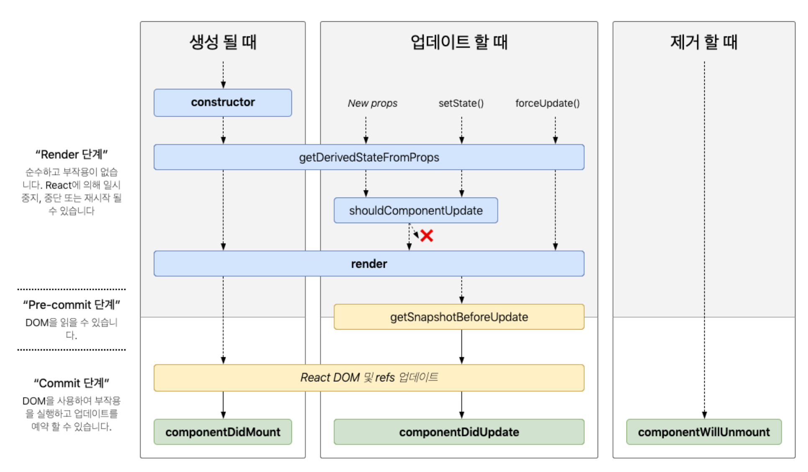
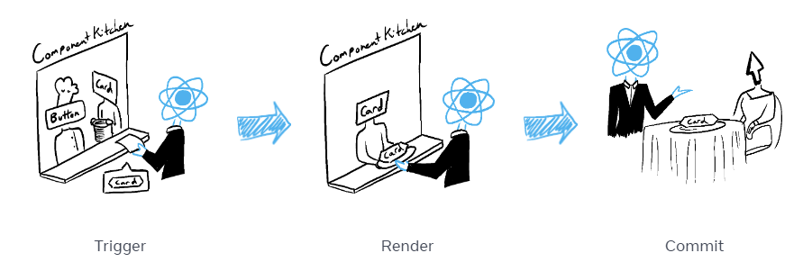
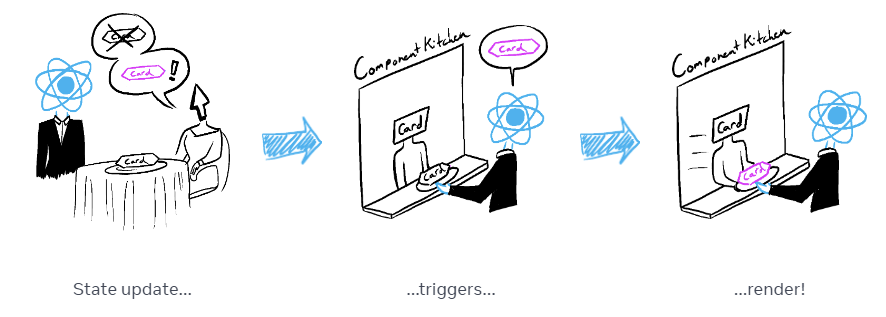

# [2장] 리액트 핵심 요소 깊게 살펴보기

## 2.1 JSX란?

- XML과 유사한 내장형 구문이며, 리액트에 종속적이지 않은 독자적인 문법
- 자바스크립트 코드 내부에 HTML과 같은 트리 구조를 가진 컴포넌트를 표현할 수 있다.

```jsx
render() {
  return (
    <div>
      <h1>Hello, world!</h1>
    </div>
  );
}
```

JSX가 포함된 코들르 아무런 처리 없이 그대로 실행하면 구문 에러가 발생한다. JSX는 자바스크립트 펴준 코드가 아닌 페이스북이 임의로 만든 새로운 문법이라 반드시 **트랜스파일러를 거쳐야 자바스크립트 런타임이 이해할 수 있는 의미 있는 자바스크립트 코드로 변환된다.**

> ❓**트랜스파일러** <br>
> 한 프로그래밍 언어로 작성된 코드를 다른 프로그래밍 언어로 변환하는 도구
> JSX를 포함한 코드를 실행하기 위해서는 일반적으로 JSX를 JavaScript로 변환하는 과정이 필요한데 Babel과 같은 트랜스파일러를 사용한다.

### ✨JSX의 정의

**📍JSXElement**

- HTML 요소같은 것
- `<JSXOpeningElement>, </JSXClosingElement>, <JSXSelfClosingElement />, <></>`

```jsx
const element = <div>Hello, World!</div>
```

> 🤔요소명은 대문자로?<br>
> 사용자가 컴포넌트를 만들어 사용할 때에는 대문자로 시작하는 컴포넌트를 만들어야 한다.
> 리액트에서 HTML 태그명과 사용자가 만든 컴포넌트 태그명을 구분 짓기 위해.

**📍JSXAttributes**

- JSXElement에 부여할 수 있는 속성

```jsx
const element = 
```

```jsx
function valid() {
	return <foo.var foo:bar="baz"></foo.bar>
}
// :를 이용해 키를 나타낼 수 있다.
```

**📍JSXChildren**

- JSXElement의 자식 값

```jsx
const element = (
  <div>
    <h1>Title</h1>
    <p>Paragraph content</p>
  </div>
)
```

**📍JSXStrings**

- JS 문자열처럼 처리됨.

```jsx
const element = <div>{'Hello, World!'}</div>
```

- \로 시작하는 escape 문자 형태소
  현재의 JSX는 HTML처럼 \을 이스케이프 문자열로 처리하고 있지 않다.

```jsx
  <button>\</button>

  let escape1 = "\" // 안 됨

  let escape2 = "\\"
```

## 2.2 가상 DOM과 리액트 파이버

> ❓**DOM (Document Object Model)**<br>
> 웹페이지에 대한 인터페이스로 브라우저가 웹페이지의 콘텐츠와 구조를 어떻게 보여줄지에 대한 정보를 담고 있다.

### ✨DOM과 브라우저 렌더링 과정


1. 브라우저가 사용자가 요청한 주소를 방문해 HTML 파일을 다운로드 → DOM 트리 만듦
2. CSS파일 다운로드 → CSSOM 트리 만듦
3. 브라우저는 사용자 눈에 보이는 DOM노드 순회 (트리를 분석하는 과정을 빨리 하기 위해)
4. 눈에 보이는 노드를 대상으로 해당 노드에 대한 CSSOM 정보를 찾고 CSS 스타일을 이 노드에 적용
   - **레이아웃(layout, reflow):** 각 노드가 브라우저 화면의 어느 좌표에 정확히 나타나야 하는지 계산하는 과정.
   - **페인팅(painting):** 레이아웃 단계를 거친 노드에 색과 같은 실제 유효한 모습을 그리는 과정

### ✨가상DOM의 탄생 배경

- 웹페이지를 렌더링하는 과정은 매우 복잡하고 많은 비용이 든다.
- 대다수의 앱은 렌더링된 이후 정보를 보여주는데 그치지 않고 사용자의 인터랙션을 통해 다양한 정보를 노출한다.
- DOM 변경이 일어나는 element가 많은 자식 element를 가진 경우, 하위 자식 element도 덩달아 변경되어 더 많은 비용을 브라우저와 사용자가 지불하게 된다.

> SPA(Single Page Application)의 경우 <br>
> 하나의 페이지에서 모든 작업이 일어나 렌더링 이후 추가 렌더링 작업이 더욱 많아진다. (하나의 페이지에서 계속해서 요소의 위치를 재계산하기 때문)<br>
> 이러한 특징 덕분에 사용자는 페이지의 깜빡임 없이 웹페이지 탐색이 가능하지만, DOM 관리의 과정에서 부담할 비용이 커진다.

📍**가상돔**

- 실제 브라우저의 DOM이 아니라 리액트가 관리하는 가상의 DOM
- **가상 DOM은 웹페이지가 표시할 DOM을 메모리에 저장하고, react-dom이 실제 변경에 대한 준비가 완료 되었을 때 실제 브라우저의 DOM에 반영한다.**
- 가상 DOM은 일반적인 DOM을 관리하는 브라우저보다 무조건 빠른 것은 아니다. 이는 대부분의 상황에서 웬만한 어플리케이션을 만들 수 있을 정도로 합리적으로 빠르다고 이해하는 것이 좋다.

### **✨가상 DOM을 위한 아키텍처, 리액트 파이버**

**📍리액트 파이버(React Fiber)**

- React 컴포넌트 트리의 각 노드에 대한 정보를 포함하는 객체(컴포넌트의 상태, props, 업데이트, 효과 등을 관리)
- 가상 DOM과 렌더링 과정 최적화를 가능하게 해주는 것
- 리액트에서 관리하는 평범한 자바스크립트 객체
- 리액트 컴포넌트에 대한 정보를 1:1로 가지고 있는 것

> 파이버는 비동기!!
>
> - 새 업데이트가 나오면 구성 요소에 대한 렌더링 작업을 일시 중지, 재개 및 다시 시작한다.
> - 이전에 완료된 작업을 재사용하고 필요하지 않은 경우 중단할 수도 있다.
> - 작업을 여러 단위로 나누고 중요도에 따라 작업 우선 순위를 지정한다.

- **파이버는 하나의 작업 단위로 구성돼 있다.** 리액트는 이러한 작업 단위를 하나씩 처리하고 finishedWork()라는 작업으로 마무리한다. 이 작업을 커밋하여 실제 브라우저 DOM에 가시적인 변경 사항을 만들어 낸다.

> 1. 랜더 단계에서 리액트는 사용자에게 노출되지 않는 모든 ‘비동기 작업’을 수행한다. 이 단계에 앞서 언급한 파이버의 작업, 우선순위를 지정, 중지, 버리는 등의 작업이 일어난다.
>
> 2. 커밋 단계에서는 앞서 언급한 것처럼 DOM에 실제 변경 사항을 반영하기 위한 작업(commitWork())가 실행되는데, 이 과정은 앞서와 다르게 ‘동기식’으로 일어나고 중단될 수도 없다.

- **파이버는 react element와 유사하다고 느낄 수 있지만, react element는 렌더링이 발생할 때마다 새로 생성되지만, 파이버는 가급적이면 재사용된다.**

```jsx
const exampleFiber = {
  // 타입 및 키
  type: 'div', // 또는 컴포넌트 함수나 클래스
  key: 'unique-key',

  // 인스턴스 관련 정보
  stateNode: {}, // 컴포넌트 인스턴스 또는 DOM 노드

  // 부모, 자식, 형제 관계
  return: parentFiber, // 부모 fiber
  child: childFiber, // 첫 번째 자식 fiber
  sibling: siblingFiber, // 다음 형제 fiber

  // 상태 및 업데이트 관련
  pendingProps: {
    /* 새로운 props */
  },
  memoizedProps: {
    /* 이전 props */
  },
  memoizedState: {
    /* 이전 state */
  },
  updateQueue: {}, // 상태 업데이트 큐

  // 이펙트 및 렌더링 관련
  effectTag: 'Placement', // 현재 작업 (예: 추가, 업데이트, 삭제)
  nextEffect: null, // 다음 이펙트

  // 우선순위 및 작업 시간
  expirationTime: 1073741823, // 작업 만료 시간
  childExpirationTime: 1073741823, // 자식 작업 만료 시간
  alternate: alternateFiber, // 현재 fiber의 이전 또는 대체 fiber
}
```

```jsx
function MyComponent(props) {
  return (
    <div>
      <span>Hello, {props.name}!</span>
    </div>
  )
}
```

```jsx
const rootFiber = {
  type: MyComponent,
  key: null,
  stateNode: null,
  return: null,
  child: {
    type: 'div',
    key: null,
    stateNode: document.createElement('div'),
    return: rootFiber,
    child: {
      type: 'span',
      key: null,
      stateNode: document.createElement('span'),
      return: childFiber,
      child: null,
      sibling: null,
      pendingProps: null,
      memoizedProps: { children: 'Hello, world!' },
      memoizedState: null,
      updateQueue: null,
      effectTag: 'Placement',
      nextEffect: null,
      expirationTime: 1073741823,
      childExpirationTime: 1073741823,
      alternate: null,
    },
    sibling: null,
    pendingProps: null,
    memoizedProps: null,
    memoizedState: null,
    updateQueue: null,
    effectTag: 'Placement',
    nextEffect: null,
    expirationTime: 1073741823,
    childExpirationTime: 1073741823,
    alternate: null,
  },
  sibling: null,
  pendingProps: null,
  memoizedProps: null,
  memoizedState: null,
  updateQueue: null,
  effectTag: 'Placement',
  nextEffect: null,
  expirationTime: 1073741823,
  childExpirationTime: 1073741823,
  alternate: null,
}
```

Fiber 객체를 재사용함으로써 React는 새로운 객체를 계속 생성하는 비용을 줄인다..

**📍리액트 파이버 트리**

- 파이버 트리는 현재 모습을 담은 파이버 트리와, 작업 중인 상태를 나타내는 workInProgress 트리의 두 개가 존재한다.
- 더블 버퍼링: 리액트 파이버의 작업이 끝나면 리액트는 단순히 포인터만 변경해 workInProgress 트리를 현재 트리로 바꾼다.

> **❓더블 버퍼링**<br>
> 보이지 않는 곳에서 그 다음으로 그려야 할 그림을 미리 그린 다음, 이것이 완성되면 현재 상태를 새로운 그림으로 바꾸는 기법


- 현재 UI 렌더랑을 위해 존재하는 트리인 current를 기준으로 모든 작업이 시작된다.
- 업데이트가 발생하면 파이버는 리액트에서 새로 받은 데이터로 새로운 workInProgress 트리를 빌드한다.
- workInProgress 트리를 빌드 후, 다음 렌더링에 이 트리를 사용한다.
- workInProgress 트리가 UI에 최종적으로 렌더링되어 반영이 되면 current가 이 workInProgress 로 변경된다.

**📍파이버의 작업 순서**

```
<A1>
  <B1>Hello World</B1>
  <B2>
    <C1>
      <D1 />
      <D2 />
    </C1>
  </B2>
  <B3 />
</A1>
```

> 1. A1의 beginWork()가 수행된다. <br> 2. A1은 자식이 있으므로 B1로 이동하여 beginWork()를 수행한다.<br> 3. B1은 자식이 없으므로 completeWork()가 수행됐다. 자식은 없으므로 형제인 B2로 넘어간다.<br> 4. B2의 beginWork()가 수행된다. 자식이 있으므로 C1로 이동한다.<br> 5. C1의 beginWork()가 수행된다. 자식이 있으므로 D1로 이동한다.<br> 6. D1의 beginWork()가 수행된다.<br> 7. D1은 자식이 없으므로 completeWork()가 수행됐다. 자식은 없으므로 형제인 D2로 넘어간다.<br> 8. D2는 자식이 없으므로 completeWork()가 수행됐다.<br> 9. D2는 자식도 더 이상의 형제도 없으므로 위로 이동하여 D1, C1, B2 순으로 completeWork()를 호출한다.<br> 10. B2는 형제인 B3으로 이동하여 beginWork()를 수행한다.<br> 11. B3의 completeWork()가 수행되면 반환해 상위로 타고 올라간다.<br>
> 12. A1의 completeWork()가 수행된다.<br> > **13. 루트 노드가 완성되는 순간, 최종적으로 commitWork()가 수행되고 이 중 변경사항을 비교하여 업데이트가 필요한 변경사항이 DOM에 반영된다.**

setState 등으로 업데이트가 발생 시, 파이버가 이미 존재하므로 새로 생성하지 않고 기존 파이버에서 업데이트된 props를 받아 파이버 내부에서 처리한다.

가상 DOM과 리액트의 핵심은 브라우저의 DOM을 더욱 빠르게 반영하는 것이 아니라 바로 **값으로 UI를 표현하는 것**이다.

> ❓**값으로 UI를 표현하는 것**
>
> ```jsx
> import React, { useState } from 'react'
>
> function App() {
>   const [isLoggedIn, setIsLoggedIn] = useState(false)
>
>   return (
>     <div>
>       {isLoggedIn ? <h1>Welcome back!</h1> : <h1>Please sign up.</h1>}
>       <button onClick={() => setIsLoggedIn(!isLoggedIn)}>
>         {isLoggedIn ? 'Logout' : 'Login'}
>       </button>
>     </div>
>   )
> }
> ```
>
> React의 핵심은 상태(state)가 직접적으로 UI를 표현한다는 것이다.
>
> 상태의 값에 따라 UI가 자동으로 업데이트되며, 이는 선언적으로 정의된 UI가 상태에 기반해 어떻게 변화할지를 명확히 드러낸다. 그래서 개발자는 UI 상태 관리를 더 쉽게 할 수 있으며, React는 효율적으로 상태 변경을 실제 DOM 업데이트로 반영하여 성능을 최적화한다.

## 2.3 클래스 컴포넌트와 함수 컴포넌트

👁️0.14 버전의 함수 컴포넌트(무상태 함수 컴포넌트) <br>
별도의 상태 없이 단순히 어떠한 요소를 정적으로 렌더링하는 것

- render만 하는 경우 제한적으로 사용
- 함수 컴포넌트에 훅이 등장한 이후 상태나 생명주기 메서드 비슷한 작업을 함으로써 상대적으로 보일러플레이트가 복잡한 클래스 컴포넌트보다 함수 컴포넌트를 더 많이 쓰기 시작함

> ❓보일러 플레이트<br>
> 웹 개발 프로젝트에서 반복적으로 사용되는 기본 코드 구조

### ✨클래스 컴포넌트

- 클래스를 선언하고 extends로 만들고 싶은 컴포넌트 쓰기
  - React.Component
  - React.PureComponent

**📍클래스 컴포넌트의 생명주기 메서드**

생명주기: 컴포넌트가 생성, 업데이트, 소멸되는 일련의 단계

[React.Component – React](https://ko.legacy.reactjs.org/docs/react-component.html#the-component-lifecycle)

- 마운트: 컴포넌트가 마운팅(생성)되는 시전
- 업데이트: 이미 생성된 컴포넌트의 내용이 변경되는 시점
- 언마운트: 컴포넌트가 더 이상 존재하지 않는 시점



**✏️render()**

- 클래스 컴포넌트의 유일한 필수 값
- UI를 렌더링하기 위해 쓰임
- 항상 순수해야 하며 부수효과가 없어야 한다. (같은 입력값 props나 state가 들어가면 항상 같은 결과물을 반환해야 한다.)
- render() 내부에서 state를 직접 업데이트하는 this.setState를 호출하면 안 됨.

**✏️componentDidMount**

- 컴포넌트가 마운트되고 준비되는 즉시 실행된다.
- this.setState()로 state값을 변경하는 것이 가능함
- 변경되면 다시 한번 렌더링을 하는데, 이 작업은 브라우저가 실제로 UI를 업데이트하기 전에 실행되어 사용자가 변경되는 것을 눈치챌 수 없게 함.

**✏️componentDidUpdate()**

- 컴포넌트 업데이트가 일어난 이후 바로 실행된다.
- state나 props 변화에 따라 DOM을 업데이트 함.

**✏️componentWillUnmount()**

- 컴포넌트가 언마운트되거나 더 이상 사용되지 않기 직전에 호출된다.
- 메모리 누수나 불필요한 작동을 막기 위한 클린업 함수를 호출하기 위한 최적의 위치
- this.setState 호출 X
- 이벤트를 지우기, API 호출 취소, setInterval, setTimeout으로 생성된 타이머 지우기

**✏️shouldComponentUpdate()**

- state나 props의 변경으로 리액트 컴포넌트가 다시 리렌더링되는 것을 막고 싶을 때

> **🤔React.Component와 React.PureComponent의 차이**
>
> ```jsx
> import React, { Component, PureComponent } from 'react'
>
> class RegularComponent extends Component {
>   render() {
>     console.log('RegularComponent render')
>     return <div>{this.props.text}</div>
>   }
> }
>
> class PureComp extends PureComponent {
>   render() {
>     console.log('PureComponent render')
>     return <div>{this.props.text}</div>
>   }
> }
>
> class App extends Component {
>   state = {
>     text: 'Hello',
>   }
>
>   componentDidMount() {
>     setInterval(() => {
>       this.setState({ text: 'Hello' })
>     }, 1000)
>   }
>
>   render() {
>     return (
>       <div>
>         <RegularComponent text={this.state.text} />
>         <PureComp text={this.state.text} />
>       </div>
>     )
>   }
> }
>
> export default App
> ```
>
> - `RegularComponent`는 `Component`를 상속받아 상태가 변할 때마다 `render` 메서드가 호출된다.
>   `PureComp`는 `PureComponent`를 상속받아 상태의 얕은 비교를 통해 상태가 실제로 변경되지 않았음을 감지하고, `render` 메서드를 호출하지 않는다.
>
> - **`PureComponent` 는 기본적으로 얕은 비교를 수행하는 `shouldComponentUpdate` 메서드를 제공하여, 상태나 속성이 동일하면 다시 렌더링하지 않는다.**

**✏️statuc getDerivedStateFromProps()**

- render()를 호출하기 직전에 호출된다.
- static으로 선언되어 있어 this에 접근할 수 없다.
- 여기서 반환하는 객체는 해당 객체의 내용이 모두 state로 들어가게 된다. 반면 null을 반환하면 아무런 일도 일어나지 않는다.
- 모든 render() 실행 시에 호출된다.

**✏️getSnapshotBeforeUpdate()**

- DOM이 업데이트 되기 직전에 호출된다.
- DOM에 렌더링되기 전에 윈도우 크기를 조절하거나 스크롤 위치를 조정함.

**✏️getDerivedStateFromError()**

- 에러가 발생했을 때 호출되는 에러 메서드

> 반드시 state를 반환해야 한다. <br>
> ❓왜<br>
> getDerivedStateFromError는 **하위 컴포넌트에서 에러가 발생했을 경우에 어떻게 자식 리액트 컴포넌트를 렌더링할지 결정하는 용도로 제공되는 메서드**이기 때문에 반드시 미리 정의해둔 state값을 반환해야 한다.

**✏️componentDidCatch**

- 에러상황에서 실행되는 메서드
- getDerivedStateFromError에서 에러를 잡고 state를 결정한 이후에 실행된다.
- 두 개의 인수(error, 정확히 어떤 컴포넌트가 에러를 발생시켰는지 정보를 가지고 있는 Info)
  > getDerivedStateFromError에서 하지 못했던 부수효과를 수행할 수 있다.<br><br>
  > getDerivedStateFromError는 render단계<br>
  > componentDidCatch는 커밋단계에서 실행된다.<br><br> > **componentDidCatch는 리액트에서 에러 발생 시 이 메서드에서 제공되는 에러 정보를 바탕으로 로깅하는 등의 용도로 사용할 수 있다.**

```jsx
// 실행했을 때의 순서: -1-, -2- ...
// 버튼 클릭 후의 순서: (1), (2) ...
import React, { Component } from 'react'

class LifeCycleExample extends Component {
  constructor(props) {
    super(props)
    this.state = {
      count: 0,
    }
    // 컴포넌트가 생성될 때 호출되는 생성자 메서드 -1-
    console.log('Constructor called')
  }

  static getDerivedStateFromProps(props, state) {
    // props로부터 state를 도출할 때 호출되는 메서드 -2- (1)
    console.log('getDerivedStateFromProps called')
    return null
  }

  componentDidMount() {
    // 컴포넌트가 마운트된 직후 호출되는 메서드 -4-
    console.log('componentDidMount called')
  }

  shouldComponentUpdate(nextProps, nextState) {
    // 컴포넌트 업데이트 여부를 결정할 때 호출되는 메서드  (2)
    console.log('shouldComponentUpdate called')
    return true
  }

  getSnapshotBeforeUpdate(prevProps, prevState) {
    // 실제 DOM에 변화가 반영되기 직전 호출되는 메서드  (4)
    console.log('getSnapshotBeforeUpdate called')
    return null
  }

  componentDidUpdate(prevProps, prevState, snapshot) {
    // 컴포넌트 업데이트 직후 호출되는 메서드 -6-  (5)
    console.log('componentDidUpdate called')
  }

  componentWillUnmount() {
    // 컴포넌트가 언마운트되기 직전 호출되는 메서드 -5-
    console.log('componentWillUnmount called')
  }

  handleClick = () => {
    this.setState((prevState) => ({
      count: prevState.count + 1,
    }))
  }

  render() {
    // 컴포넌트가 렌더링될 때 호출되는 메서드 -3-  (3)
    console.log('Render called')
    return (
      <div>
        <h1>React Lifecycle Example</h1>
        <p>Count: {this.state.count}</p>
        <button onClick={this.handleClick}>Increment</button>
      </div>
    )
  }
}

export default LifeCycleExample
```

**📍클래스 컴포넌트의 한계**

- 데이터 흐름을 추적하기 어렵다.
- 애플리케이션 내부 로직의 재사용이 어렵다.
- 기능이 많아질수록 컴포넌트 크기가 커진다.
- 클래스는 함수에 비해 상대적으로 어렵다.
- 코드 크기를 최적화하기 어렵다.
- 핫 리로딩을 하는 데 상대적으로 불리하다.<br>
  **❓핫 리로딩**<br>
  코드에 변경사항이 발생했을 때 앱을 다시 시작하지 않고도 해당 변경된 코드만 업데이트해 변경 사항을 빠르게 적용하는 기법

  ```jsx
  class MyComponent extends React.Component {
    constructor(props) {
      super(props)
      this.state = {
        count: 0,
      }
    }

    handleClick = () => {
      this.setState({ count: this.state.count + 1 })
    }

    render() {
      return (
        <div>
          <p>{this.state.count}</p>
          <button onClick={this.handleClick}>Increment</button>
        </div>
      )
    }
  }
  // 코드가 변경되고 핫 리로딩이 발생할 때
  // 클래스 컴포넌트의 constructor가 다시 호출되면서 상태가 초기화됨.
  ```

### ✨함수 컴포넌트

16.8에서 함수 컴포넌트에서 사용 가능한 훅이 등장함.

- render 내부에서 필요한 함수를 선언할 때 this바인딩을 조심할 필요가 없음
- state는 객체가 아닌 각각의 원시값으로 관리되어 훨신 사용하기 편함
- 렌더링하는 코드인 return에서도 굳이 this를 사용하지 않더라도 props와 state에 접근할 수 있다.

> **💡클래스 컴포넌트에서 this 바인딩**
>
> ```jsx
> import React, { Component } from 'react'
>
> class Counter extends Component {
>   constructor(props) {
>     super(props)
>     this.state = { count: 0 }
>     // this 바인딩
>     this.handleClick = this.handleClick.bind(this)
>   }
>
>   handleClick() {
>     this.setState({ count: this.state.count + 1 })
>   }
>
>   render() {
>     return (
>       <div>
>         <p>You clicked {this.state.count} times</p>
>         <button onClick={this.handleClick}>Click me</button>
>       </div>
>     )
>   }
> }
>
> export default Counter
> ```
>
> - 클래스 컴포넌트에서 `this`는 컴포넌트의 인스턴스를 가리킨다.
> - `handleClick` 메서드가 `this`를 사용하기 때문에, 생성자에서 `this.handleClick`을 `this`에 바인딩해 주어야 한다. 안 쓰면, 버튼 클릭 시 `handleClick` 메서드 내에서 `this`가 `undefined`가 되어 오류가 발생한다.
>
> **💡함수 컴포넌트**
>
> ```jsx
> import React, { useState } from 'react'
>
> const Counter = () => {
>   const [count, setCount] = useState(0)
>
>   const handleClick = () => {
>     setCount(count + 1)
>   }
>
>   return (
>     <div>
>       <p>You clicked {count} times</p>
>       <button onClick={handleClick}>Click me</button>
>     </div>
>   )
> }
>
> export default Counter
> ```
>
> - 함수 컴포넌트에서는 this 키워드를 사용할 필요가 없다.
> - 함수 컴포넌트는 단순히 함수로 정의되며, 상태와 메서드는 훅을 통해 관리한다.

### ✨함수 컴포넌트 vs. 클래스 컴포넌트

**📍생명주기 메서드의 부재**

- **클래스 컴포넌트**: `componentDidMount`, `componentDidUpdate`, `componentWillUnmount` 등의 생명주기 메서드를 사용한다.
- **함수 컴포넌트**: `useEffect` 훅을 사용하여 생명주기 메서드를 대체한다. `useEffect`는 컴포넌트가 마운트, 업데이트, 언마운트될 때 동작한다.

  > useEffect는 생명주기를 위한 훅이 아니다. useEffect 컴포넌트의 state를 활용해 동기적으로 부수 효과를 만드는 매커니즘

  > ```jsx
  > import React, { useState, useEffect } from 'react'
  >
  > function LifeCycleHooksExample() {
  >   const [count, setCount] = useState(0)
  >
  >   useEffect(() => {
  >     // 컴포넌트가 마운트되거나 업데이트될 때 호출되는 useEffect
  >     console.log('Component mounted or updated')
  >
  >     return () => {
  >       // 컴포넌트가 언마운트될 때 호출되는 cleanup 함수
  >       console.log('Component will unmount')
  >     }
  >   }, [])
  >
  >   useEffect(() => {
  >     // count state가 변경될 때 호출되는 useEffect
  >     console.log('Count state changed')
  >   }, [count])
  >
  >   const handleClick = () => {
  >     setCount(count + 1)
  >   }
  >
  >   return (
  >     <div>
  >       <h1>React Lifecycle Hooks Example</h1>
  >       <p>Count: {count}</p>
  >       <button onClick={handleClick}>Increment</button>
  >     </div>
  >   )
  > }
  >
  > export default LifeCycleHooksExample
  > ```

**📍함수 컴포넌트와 렌더링된 값**

- **클래스 컴포넌트**: 렌더링된 값을 고정X
- **함수 컴포넌트**: 렌더링된 값을 고정

> 🤔handleClick을 클릭하면 3초 뒤에 props에 있는 user를 alert에 띄운다. 만약 3초 사이에 props를 변경하면 어떻게 될까?<br><br>
> 클래스: 3초 뒤에 변경된 props를 기준으로 메시지가 뜬다.<br>
> 함수: 클릭했던 시점의 props의 값을 기준으로 메시지가 뜬다.<br><br>
> ❓이러한 차이는 왜 발생할까<br>
> 클래스 컴포넌트는 props의 값을 항상 this로부터 가져온다. 클래스의 props는 외부에서 변경되지 않는 이상 불변 값이지만 this가 가리키는 객체(컴포넌트의 인스턴스의 멤버)는 변경 가능한 값이다. 부모 컴포넌트가 props를 변경해 컴포넌트가 다시 렌더링됐다는 것은 this.props의 값이 변경된 것이다.

>

|                             | 클래스 컴포넌트    | 함수 컴포넌트      |
| --------------------------- | ------------------ | ------------------ |
| 생명주기의 부재             | 사용 O             | 사용 X             |
| 함수 컴포넌트와 렌더링된 값 | 렌더링된 값 고정 X | 렌더링된 값 고정 O |

## 2.4 렌더링은 어떻게 일어나는가?

> **브라우저 렌더링**: HTML과 CSS 리소스를 기반으로 웹페이지에 필요한 UI를 그리는 과정<br> > **리액트 렌더링**: 렌더링에 필요한 DOM 트리를 만드는 과정

**📍리액트에서의 렌더링이란**

리액트 애플리케이션 트리 안에 있는 모든 컴포넌트들이 현재 자신들이 가지고 있는 props와 state의 값을 기반으로 어떻게 UI를 구성하고 이를 바탕으로 어떤 DOM 결과를 브라우저에 제공할 것인지 계산하는 일련의 과정을 의미한다.

**📍리액트의 렌더링이 일어나는 이유**

1. 최조 렌더링: 애플리케이션에 진입하면 당연히 렌더링해야 할 결과물이 필요함 → 브라우저에 이 정보를 제공하기 위해 최초 렌더링 수행
2. 리렌더링: 최초 렌더링이 발생한 이후로 발생하는 모든 렌더링을 의미함
   - 클래스 컴포넌트의 setState가 실행되는 경우
   - 클래스 컴포넌트의 forceUpdate가 실행되는 경우
   - 함수 컴포넌트의 useState()의 두 번째 배열 요소인 setter가 실행되는 경우
   - 함수 컴포넌트의 useReducer()의 두 번째 배열 요소인 dispatch가 실행되는 경우
   - 컴포넌트의 key props가 변경되는 경우
     > **❓배열에 key를 쓰는 이유**<br><br>
     > 리액트에서 key는 리렌더링이 발생하는 동안 형제 요소들 사이에서 동일한 요소를 식별하는 값이다. 리렌더링이 발생하면 current 트리와 workingProcess 트리 사이에서 어떠한 컴포넌트가 변경이 있었는지 구별해야 하는데, 이 두 트리 사이에서 같은 컴포넌트인지를 구별하는 값이 바로 key다.<br><br>
     > → **key를 사용하면 리액트가 렌더링된 리스트에서 변경된 부분만을 식별하여 업데이트한다.**
   - props가 변경되는 경우
   - 부모 컴포넌트가 렌더링될 걍우

### ✨리액트의 렌더링 프로세스

렌더링 프로세스가 시작되면 리액트는 컴포넌트의 루트에서부터 차근차근 아래쪽으로 내려가면서 업데이트가 필요하다고 지정돼 있는 모든 컴포넌트를 찾는다.

### ✨렌더와 커밋

**📍렌더 단계**

- 컴포넌트를 렌더링하고 변경 사항을 계산하는 모든 작업
- 렌더링 프로세스에서 컴포넌트를 실행해 이 결과와 이전 가상 DOM을 비교하는 과정을 거쳐 변경이 필요한 컴포넌트를 체크하는 단계 (type, props, key 비교)

**📍커밋 단계**

- 렌더 단계의 변경 사항을 실제 DOM에 적용해 사용자에게 보여주는 과정

> 리액트의 렌더링이 일어난다고 해서 무조건 DOM 업데이트가 일어나는 것은 아니다.

렌더링을 수행했으나 커밋 단계까지 갈 필요가 없다면 (변경 사항을 계산했는데 아무런 변경 사항이 감지 되지 않는다면) 커밋 단계를 생략될 수 있다.

> - 컴포넌트가 렌더링되었지만 상태나 프롭스가 변경되지 않은 경우, 가상 DOM과 실제 DOM의 차이가 없으므로 커밋 생략
> - 컴포넌트의 렌더 메서드가 순수 함수로 동작하는 경우
> - `React.memo`, `shouldComponentUpdate` 를 써서 렌더링을 방지했을 때

**👁️렌더 & 커밋**


1. 렌더링 트리거 (손님의 주문을 주방으로 전달)
2. 컴포넌트 렌더링 (주방에서 주문 준비)
3. DOM에 커밋 (테이블 위에 주문 배치)

**👁️상태 업데이트 시 다시 렌더링**


- 구성 요소가 처음 렌더링되면 해당 set기능으로 상태를 업데이트해 추가 렌더링을 트리거할 수 있다.
- 구성 요소의 상태를 업데이트하면 렌더링이 자동으로 대기열에 추가된다. (식당 손님이 갈증이나 배고픈 상태에 따라 차, 디저트 등을 먼저 주문한 후 주문하는 모습을 상상해 보세요.)

**👁️브라우저 페인트**


- 렌더링이 완료되고 React가 DOM을 업데이트한 후 브라우저는 화면을 다시 칠한다. (브라우저 렌더링, 페인팅)

## 2.5 컴포넌트와 함수의 무거운 연산을 기억해 두는 메모이제이션

리액트에서 제공하는 API 중 useMemo, useCallback 훅과 고차 컴포넌트인 memo는 리액트에서 발생하는 렌더링을 최소한으로 줄이기 위해 제공된다.

**👊🏻메모이제이션에 관한 논쟁 주제**

1. **섣부른 최적화는 독이다. 꼭 필요한 곳에만 메모이제이션을 추가하자.**

   ```jsx
   import React, { useState, useMemo } from 'react'

   const HeavyComponent = () => {
     // 무거운 연산
     const calculateValue = () => {
       let result = 0
       for (let i = 0; i < 1000000; i++) {
         result += i
       }
       return result
     }

     // useMemo를 사용하여 결과값 메모이제이션
     const memoizedValue = useMemo(() => calculateValue(), [])

     return <div>{memoizedValue}</div>
   }

   const App = () => {
     const [count, setCount] = useState(0)

     const incrementCount = () => {
       setCount(count + 1)
     }

     return (
       <div>
         <button onClick={incrementCount}>Increment</button>
         <HeavyComponent />
       </div>
     )
   }

   export default App
   ```

   `HeavyComponent`는 렌더링할 때마다 계산량이 많은 작업을 수행한다. 하지만 `useMemo`를 사용하여 이 계산 결과를 메모이제이션하여 필요할 때만 다시 계산하도록 최적화되었다. 메모를 통해 성능을 향상시키고, 섣부른 최적화를 방지할 수 있다.

   - 메모이제이션은 메모리를 사용하여 비용을 잡아 먹기 때문에 신중하게 사용해야 한다
   - 오랫동안 캐시 결과를 저장하려고 했지만, 어떤 경우에는 캐시가 무효화 되는 경우도 있어서 괜히 메모리만 잡아먹고 기능은 이용하지 못할 수도 있다.
   - 그러니까 useEffect로 확인해보고 필요한 곳에만 사용하자.

2. **렌더링 과정의 비용은 비싸다. 모조리 메모이제이션해 버리자.**

   ```jsx
   import React, { useState, useMemo } from 'react'

   const HeavyComponent = () => {
     // 무거운 연산
     const calculateValue = () => {
       let result = 0
       for (let i = 0; i < 1000000; i++) {
         result += i
       }
       return result
     }

     // useMemo를 사용하여 결과값 메모이제이션
     const memoizedValue = useMemo(() => calculateValue(), [])

     return <div>{memoizedValue}</div>
   }

   const App = () => {
     const [count, setCount] = useState(0)

     const incrementCount = () => {
       setCount(count + 1)
     }

     // 모든 렌더링 시점에 HeavyComponent를 렌더링할 때마다 메모이제이션
     const memoizedComponent = useMemo(() => <HeavyComponent />, [count])

     return (
       <div>
         <button onClick={incrementCount}>Increment</button>
         {memoizedComponent}
       </div>
     )
   }

   export default App
   ```

   `HeavyComponent`를 렌더링할 때마다 `useMemo`를 사용하여 메모이제이션하고 있다.

   - 기본적으로 리액트는 이전 렌더링 결과를 다음 렌더링과 구별하기 위해 저장해 둔다.
   - 따라서 추가적으로 드는 것은 prop에 대한 얕은 비교 정도다.
   - memo를 하지 않았을 때 발생할 수 있는 문제는…
     1. 렌더링을 함으로써 발생하는 비용
     2. 컴포넌트 내부와 복잡한 로직의 재실행
     3. 위 두가지 모두가 자식 컴포넌트에서 반복해서 일어남
     4. 리액트가 구 트리와 신 트리를 비교

→ 최적화에 대한 확신이 없다면 가능한 한 모든 곳에 메모이제이션을 활용한 최적화를 하는 것이 좋다.

→ 실력이 향상되면 적재적소에 쓰자…

### 참고)

- [클래스, 함수 컴포넌트의 차이](https://overreacted.io/how-are-function-components-different-from-classes/)
- [렌더+커밋](https://react.dev/learn/render-and-commit)
