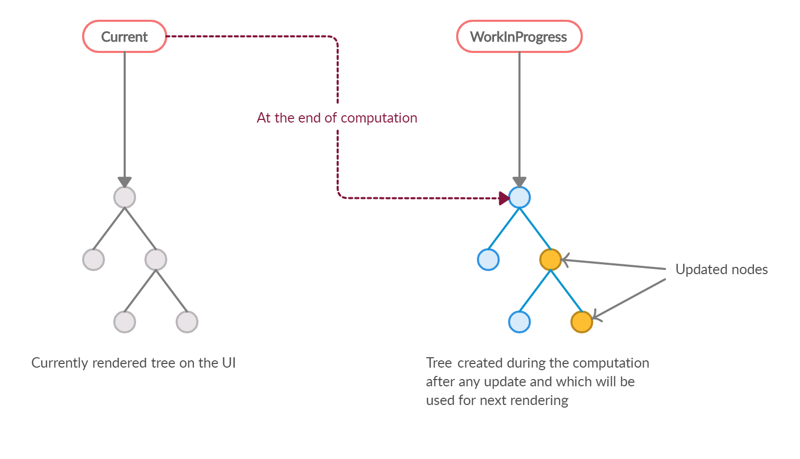

# [2장] 리액트 핵심 요소 깊게 살펴보기

## 2.1 JSX란?

- XML과 유사한 내장형 구문이며, 리액트에 종속적이지 않은 독자적인 문법
- 자바스크립트 코드 내부에 HTML과 같은 트리 구조를 가진 컴포넌트를 표현할 수 있다.

```jsx
render() {
  return (
    <div>
      <h1>Hello, world!</h1>
    </div>
  );
}
```

JSX가 포함된 코들르 아무런 처리 없이 그대로 실행하면 구문 에러가 발생한다. JSX는 자바스크립트 펴준 코드가 아닌 페이스북이 임의로 만든 새로운 문법이라 반드시 **트랜스파일러를 거쳐야 자바스크립트 런타임이 이해할 수 있는 의미 있는 자바스크립트 코드로 변환된다.**

> ❓**트랜스파일러** <br>
> 한 프로그래밍 언어로 작성된 코드를 다른 프로그래밍 언어로 변환하는 도구
> JSX를 포함한 코드를 실행하기 위해서는 일반적으로 JSX를 JavaScript로 변환하는 과정이 필요한데 Babel과 같은 트랜스파일러를 사용한다.

### ✨JSX의 정의

**📍JSXElement**

- HTML 요소같은 것
- <JSXOpeningElement>, </JSXClosingElement>, <JSXSelfClosingElement />, <></>

```jsx
const element = <div>Hello, World!</div>
```

> 🤔요소명은 대문자로?<br>
> 사용자가 컴포넌트를 만들어 사용할 때에는 대문자로 시작하는 컴포넌트를 만들어야 한다.
> 리액트에서 HTML 태그명과 사용자가 만든 컴포넌트 태그명을 구분 짓기 위해.

**📍JSXAttributes**

- JSXElement에 부여할 수 있는 속성

```jsx
const element = 
```

```jsx
function valid() {
	return <foo.var foo:bar="baz"></foo.bar>
}
// :를 이용해 키를 나타낼 수 있다.
```

**📍JSXChildren**

- JSXElement의 자식 값

```jsx
const element = (
  <div>
    <h1>Title</h1>
    <p>Paragraph content</p>
  </div>
)
```

**📍JSXStrings**

- JS 문자열처럼 처리됨.

```jsx
const element = <div>{'Hello, World!'}</div>
```

- \로 시작하는 escape 문자 형태소
  현재의 JSX는 HTML처럼 \을 이스케이프 문자열로 처리하고 있지 않다.

```jsx
  <button>\</button>

  let escape1 = "\" // 안 됨

  let escape2 = "\\"
```

## 2.2 가상 DOM과 리액트 파이버

> ❓**DOM (Document Object Model)**<br>
> 웹페이지에 대한 인터페이스로 브라우저가 웹페이지의 콘텐츠와 구조를 어떻게 보여줄지에 대한 정보를 담고 있다.

### ✨DOM과 브라우저 렌더링 과정


1. 브라우저가 사용자가 요청한 주소를 방문해 HTML 파일을 다운로드 → DOM 트리 만듦
2. CSS파일 다운로드 → CSSOM 트리 만듦
3. 브라우저는 사용자 눈에 보이는 DOM노드 순회 (트리를 분석하는 과정을 빨리 하기 위해)
4. 눈에 보이는 노드를 대상으로 해당 노드에 대한 CSSOM 정보를 찾고 CSS 스타일을 이 노드에 적용
   - **레이아웃(layout, reflow):** 각 노드가 브라우저 화면의 어느 좌표에 정확히 나타나야 하는지 계산하는 과정.
   - **페인팅(painting):** 레이아웃 단계를 거친 노드에 색과 같은 실제 유효한 모습을 그리는 과정

### ✨가상DOM의 탄생 배경

- 웹페이지를 렌더링하는 과정은 매우 복잡하고 많은 비용이 든다.
- 대다수의 앱은 렌더링된 이후 정보를 보여주는데 그치지 않고 사용자의 인터랙션을 통해 다양한 정보를 노출한다.
- DOM 변경이 일어나는 element가 많은 자식 element를 가진 경우, 하위 자식 element도 덩달아 변경되어 더 많은 비용을 브라우저와 사용자가 지불하게 된다.

> SPA(Single Page Application)의 경우 <br>
> 하나의 페이지에서 모든 작업이 일어나 렌더링 이후 추가 렌더링 작업이 더욱 많아진다. (하나의 페이지에서 계속해서 요소의 위치를 재계산하기 때문)<br>
> 이러한 특징 덕분에 사용자는 페이지의 깜빡임 없이 웹페이지 탐색이 가능하지만, DOM 관리의 과정에서 부담할 비용이 커진다.

📍**가상돔**

- 실제 브라우저의 DOM이 아니라 리액트가 관리하는 가상의 DOM
- **가상 DOM은 웹페이지가 표시할 DOM을 메모리에 저장하고, react-dom이 실제 변경에 대한 준비가 완료 되었을 때 실제 브라우저의 DOM에 반영한다.**
- 가상 DOM은 일반적인 DOM을 관리하는 브라우저보다 무조건 빠른 것은 아니다. 이는 대부분의 상황에서 웬만한 어플리케이션을 만들 수 있을 정도로 합리적으로 빠르다고 이해하는 것이 좋다.

### **✨가상 DOM을 위한 아키텍처, 리액트 파이버**

**📍리액트 파이버(React Fiber)**

- React 컴포넌트 트리의 각 노드에 대한 정보를 포함하는 객체(컴포넌트의 상태, props, 업데이트, 효과 등을 관리)
- 가상 DOM과 렌더링 과정 최적화를 가능하게 해주는 것
- 리액트에서 관리하는 평범한 자바스크립트 객체
- 리액트 컴포넌트에 대한 정보를 1:1로 가지고 있는 것

> 파이버는 비동기!!
>
> - 새 업데이트가 나오면 구성 요소에 대한 렌더링 작업을 일시 중지, 재개 및 다시 시작한다.
> - 이전에 완료된 작업을 재사용하고 필요하지 않은 경우 중단할 수도 있다.
> - 작업을 여러 단위로 나누고 중요도에 따라 작업 우선 순위를 지정한다.

- **파이버는 하나의 작업 단위로 구성돼 있다.** 리액트는 이러한 작업 단위를 하나씩 처리하고 finishedWork()라는 작업으로 마무리한다. 이 작업을 커밋하여 실제 브라우저 DOM에 가시적인 변경 사항을 만들어 낸다.

> 1. 랜더 단계에서 리액트는 사용자에게 노출되지 않는 모든 ‘비동기 작업’을 수행한다. 이 단계에 앞서 언급한 파이버의 작업, 우선순위를 지정, 중지, 버리는 등의 작업이 일어난다.
>
> 2. 커밋 단계에서는 앞서 언급한 것처럼 DOM에 실제 변경 사항을 반영하기 위한 작업(commitWork())가 실행되는데, 이 과정은 앞서와 다르게 ‘동기식’으로 일어나고 중단될 수도 없다.

- **파이버는 react element와 유사하다고 느낄 수 있지만, react element는 렌더링이 발생할 때마다 새로 생성되지만, 파이버는 가급적이면 재사용된다.**

```jsx
const exampleFiber = {
  // 타입 및 키
  type: 'div', // 또는 컴포넌트 함수나 클래스
  key: 'unique-key',

  // 인스턴스 관련 정보
  stateNode: {}, // 컴포넌트 인스턴스 또는 DOM 노드

  // 부모, 자식, 형제 관계
  return: parentFiber, // 부모 fiber
  child: childFiber, // 첫 번째 자식 fiber
  sibling: siblingFiber, // 다음 형제 fiber

  // 상태 및 업데이트 관련
  pendingProps: {
    /* 새로운 props */
  },
  memoizedProps: {
    /* 이전 props */
  },
  memoizedState: {
    /* 이전 state */
  },
  updateQueue: {}, // 상태 업데이트 큐

  // 이펙트 및 렌더링 관련
  effectTag: 'Placement', // 현재 작업 (예: 추가, 업데이트, 삭제)
  nextEffect: null, // 다음 이펙트

  // 우선순위 및 작업 시간
  expirationTime: 1073741823, // 작업 만료 시간
  childExpirationTime: 1073741823, // 자식 작업 만료 시간
  alternate: alternateFiber, // 현재 fiber의 이전 또는 대체 fiber
}
```

```jsx
function MyComponent(props) {
  return (
    <div>
      <span>Hello, {props.name}!</span>
    </div>
  )
}
```

```jsx
const rootFiber = {
  type: MyComponent,
  key: null,
  stateNode: null,
  return: null,
  child: {
    type: 'div',
    key: null,
    stateNode: document.createElement('div'),
    return: rootFiber,
    child: {
      type: 'span',
      key: null,
      stateNode: document.createElement('span'),
      return: childFiber,
      child: null,
      sibling: null,
      pendingProps: null,
      memoizedProps: { children: 'Hello, world!' },
      memoizedState: null,
      updateQueue: null,
      effectTag: 'Placement',
      nextEffect: null,
      expirationTime: 1073741823,
      childExpirationTime: 1073741823,
      alternate: null,
    },
    sibling: null,
    pendingProps: null,
    memoizedProps: null,
    memoizedState: null,
    updateQueue: null,
    effectTag: 'Placement',
    nextEffect: null,
    expirationTime: 1073741823,
    childExpirationTime: 1073741823,
    alternate: null,
  },
  sibling: null,
  pendingProps: null,
  memoizedProps: null,
  memoizedState: null,
  updateQueue: null,
  effectTag: 'Placement',
  nextEffect: null,
  expirationTime: 1073741823,
  childExpirationTime: 1073741823,
  alternate: null,
}
```

Fiber 객체를 재사용함으로써 React는 새로운 객체를 계속 생성하는 비용을 줄인다..

**📍리액트 파이버 트리**

- 파이버 트리는 현재 모습을 담은 파이버 트리와, 작업 중인 상태를 나타내는 workInProgress 트리의 두 개가 존재한다.
- 더블 버퍼링: 리액트 파이버의 작업이 끝나면 리액트는 단순히 포인터만 변경해 workInProgress 트리를 현재 트리로 바꾼다.

> **❓더블 버퍼링**<br>
> 보이지 않는 곳에서 그 다음으로 그려야 할 그림을 미리 그린 다음, 이것이 완성되면 현재 상태를 새로운 그림으로 바꾸는 기법



- 현재 UI 렌더랑을 위해 존재하는 트리인 current를 기준으로 모든 작업이 시작된다.
- 업데이트가 발생하면 파이버는 리액트에서 새로 받은 데이터로 새로운 workInProgress 트리를 빌드한다.
- workInProgress 트리를 빌드 후, 다음 렌더링에 이 트리를 사용한다.
- workInProgress 트리가 UI에 최종적으로 렌더링되어 반영이 되면 current가 이 workInProgress 로 변경된다.

**📍파이버의 작업 순서**

```
<A1>
  <B1>Hello World</B1>
  <B2>
    <C1>
      <D1 />
      <D2 />
    </C1>
  </B2>
  <B3 />
</A1>
```

> 1. A1의 beginWork()가 수행된다. <br> 2. A1은 자식이 있으므로 B1로 이동하여 beginWork()를 수행한다.<br> 3. B1은 자식이 없으므로 completeWork()가 수행됐다. 자식은 없으므로 형제인 B2로 넘어간다.<br> 4. B2의 beginWork()가 수행된다. 자식이 있으므로 C1로 이동한다.<br> 5. C1의 beginWork()가 수행된다. 자식이 있으므로 D1로 이동한다.<br> 6. D1의 beginWork()가 수행된다.<br> 7. D1은 자식이 없으므로 completeWork()가 수행됐다. 자식은 없으므로 형제인 D2로 넘어간다.<br> 8. D2는 자식이 없으므로 completeWork()가 수행됐다.<br> 9. D2는 자식도 더 이상의 형제도 없으므로 위로 이동하여 D1, C1, B2 순으로 completeWork()를 호출한다.<br> 10. B2는 형제인 B3으로 이동하여 beginWork()를 수행한다.<br> 11. B3의 completeWork()가 수행되면 반환해 상위로 타고 올라간다.<br>
> 12. A1의 completeWork()가 수행된다.<br> > **13. 루트 노드가 완성되는 순간, 최종적으로 commitWork()가 수행되고 이 중 변경사항을 비교하여 업데이트가 필요한 변경사항이 DOM에 반영된다.**

setState 등으로 업데이트가 발생 시, 파이버가 이미 존재하므로 새로 생성하지 않고 기존 파이버에서 업데이트된 props를 받아 파이버 내부에서 처리한다.

가상 DOM과 리액트의 핵심은 브라우저의 DOM을 더욱 빠르게 반영하는 것이 아니라 바로 **값으로 UI를 표현하는 것**이다.

> ❓**값으로 UI를 표현하는 것**
>
> ```jsx
> import React, { useState } from 'react'
>
> function App() {
>   const [isLoggedIn, setIsLoggedIn] = useState(false)
>
>   return (
>     <div>
>       {isLoggedIn ? <h1>Welcome back!</h1> : <h1>Please sign up.</h1>}
>       <button onClick={() => setIsLoggedIn(!isLoggedIn)}>
>         {isLoggedIn ? 'Logout' : 'Login'}
>       </button>
>     </div>
>   )
> }
> ```
>
> React의 핵심은 상태(state)가 직접적으로 UI를 표현한다는 것이다.
>
> 상태의 값에 따라 UI가 자동으로 업데이트되며, 이는 선언적으로 정의된 UI가 상태에 기반해 어떻게 변화할지를 명확히 드러낸다. 그래서 개발자는 UI 상태 관리를 더 쉽게 할 수 있으며, React는 효율적으로 상태 변경을 실제 DOM 업데이트로 반영하여 성능을 최적화한다.
