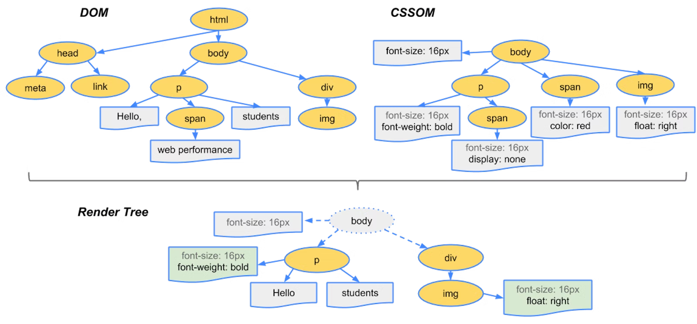
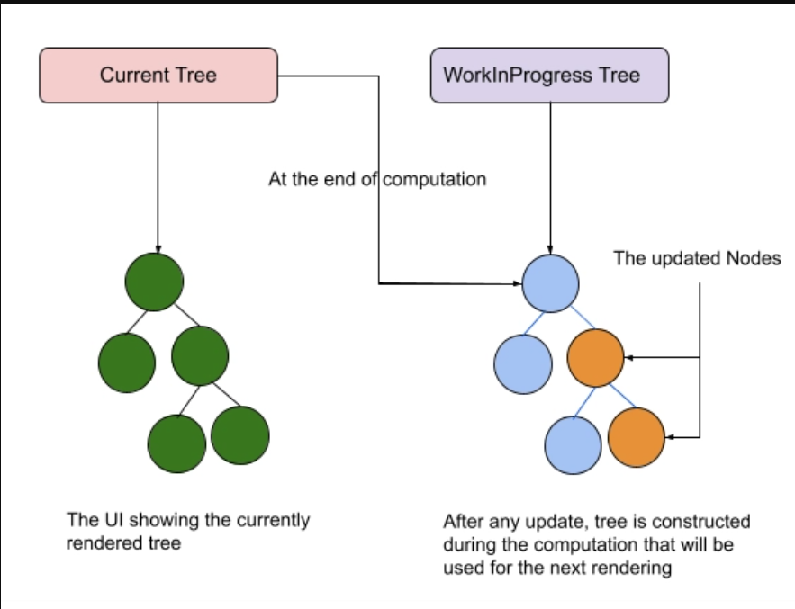
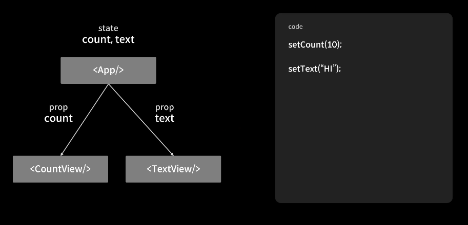

# 2장 리액트 핵심 요소 깊게 살펴보기

## 2.1 JSX란 ?

- 페이스북(메타)에서 독자적으로 개발한 자바스크립트 코드 내에 HTML 마크업 코드를 삽입할 수 있도록 돕는 문법
- But, 리액트에서 종속적이지 않은 독자적인 문법임
  - CDN을 이용해서 자바스크립트에서도 JSX를 사용할 수 있음
- 공식적인 자바스크립트 문법이 아니기 때문에 JSX 코드를 브라우저에서 그대로 실행되면 에러 발생
- 자바스크립트 런타임이 이해할 수 있도록 트랜스파일러를 통해 코드를 변환한 후 실행된다.

🔍 JSX의 설계 목적

- XML 스타일의 트리 구조로 표현하기 위함
- JSX 주 사용 : 리액트 내부에서 반환하는 HTML과 JS 코드
- HTML, XML 외에도 다른 구문으로 확장될 수 있도록 설계돼 있음

### 2.1.1 JSX의 정의

JSX는 `JSXElement`, `JSXAttributes`, `JSXChildren`, `JSXString` 4가지 요소로 구성

📍 JSXElement

- JSX를 구성하는 가장 기본 요소
- HTML 요소와 비슷한 역할
- 형태
  - JSXOpeningElement : 일반적인 요소로, JSXOpeningElement로 시작하면 JSXClosingElement 가 동일한 요소로 선언돼어 있어야 올바른 JSX 문법
  - JSXClosingElement : JSXOpeningElement가 종료됐음을 표시하는 요소, 반드시 쌍으로 사용되어야 함
  - JSXSelfClosingElement : 요소가 시작되고 스스로 종료되는 형태 `< />`
  - JSXFragment : 아무런 요소가 없는 형태 `<></>`
    - 별도의 노드를 생성하지 않고, 여러 자식을 그룹화할 수 있음

✨ 프래그먼트에서 key를 사용해야 하는 경우

- 배열 매핑하는 경우 key를 명시해줘야 오류가 나지 않음
- 프래그먼트에 key가 있는 경우에는 `<React.Fragment>` 을 명시적으로 선언하여 사용해야 함

```jsx
function Glossary(props) {
  return (
    <dl>
      {props.items.map((item) => (
        // React는 `key`가 없으면 key warning을 발생
        <React.Fragment key={item.id}>
          <dt>{item.term}</dt>
          <dd>{item.description}</dd>
        </React.Fragment>
      ))}
    </dl>
  );
}
```

🤔 컴포넌트가 대문자로 시작해야 하는 이유

- 대문자로 작성하지 않으면 HTML 태그로 인식되어 정상적으로 실행되지 않음

```jsx
function hello(text) {
  return <div>hello {text}</div>;
}
export function App() {
  // Property 'hello' does not exist on type 'JSX.IntrinsicElements'
  return <hello text="안녕하세요" />;
}
```

- h1, input 등 기존의 HTML과 사용자가 만든 컴포넌트의 태그명을 구분하기 위함
- HTML 태그가 추후 추가될 가능성을 열어둔 것.

JSXElementName

- JSXElement의 요소 이름으로 쓸 수 있는 것
- `JSXIndentifier`
  - JSX 내부에서 사용할 수 있는 식별자
  - 자바스크립트와 마찬가지로 숫자로 시작하거나 $ , \_ 외 다른 특수문자로 시작 불가
- `JSXNamespacedName`
  - `JSXIndentifier:JSXIndentifier` 의 조합으로 ( : ) 을 통해 서로 다른 식별자 이어주는 것
  - 두 개 이상은 불가능
- `JSXMemberExpression`
  - `JSXIndentifier.JSXIndentifier` 의 조합으로 ( . ) 을 통해 서로 다른 식별자를 이어주는 것도 하나의 식별자로 취급
  - 두 개 이상도 가능

📍 JSXAttributes (JSX 속성)

- JSXElement에 부여 가능한 속성을 의미
- 단순 속성을 의미하기에 필수값은 아니며 JSXElement 내부에서 존재하지 않아도 문법적인 오류는 아님
- JSXSpreadAttributes : 전개 연산자를 사용하여 표현식을 한 번에 넣을 수 있는 방식

  ```jsx
  const component = <Component foo={x} bar={y} />;
  var component = <Component />;
  component.props.foo = x; // bad
  component.props.bar = y; // also bad
  // ----
  let props = {};
  props.foo = x;
  props.bar = y;

  const component = <Component {...props} />;
  ```

  - 객체의 모든 속성을 JSX 속성으로 전달하는 구문

- 속성을 나타내는 키인 JSXAttributeName와 값인 JSXAttributeValue로 짝을 이루어서 표현
  - JSX로 작성된 속성은 JS 객체의 키가 됨
- JSXAttributeValue 의 조건
  - JSXAttributeValue에는 JS에서 쓰이는 AssignmentExpression, 즉 중괄호를 사용하여 값을 할당할 때 쓰는 표현식을 삽입할 수 있음
  - JSXElement : 값으로 다른 JSX 요소가 들어갈 수 있음
  ```jsx
  function Child({ attribute }) {
    return <div>{attribute}</div>;
  }
  function App() {
    retrun(
      <div>
        <Children attribute=<div>hello</div> />
      </div>
    );
  }
  ```

📍 JSXChildren

- JSX는 속성을 가진 트리구조를 표현하기에 부모 자식 관계를 나타낼 수 있음
- JSXElement의 자식 값
- JSXChild으로 구성되며, 여러 개 존재할 수도, 존재하지 않을 수도 있음(필수 X)
  - JSXText
  - JSXElement
  - JSXFragment
  - { JSXChildExpression (optional) } : JS 의 AssignmentExpression 을 의미
  ```jsx
  // JSXText가 JSXChild로 구성된 예시
  <>JSXText 예시</>
  // JSXChildExpression 로 구성된 예시
  <>{() => 'foo'}</> // 문자열 출력
  ```

📍 JSXStrings

- HTML에서 사용 가능한 문자열을 JSX에서도 사용할 수 있도록 설계
- 자바스크립트와 달리 `\` 로 시작하는 이스케이프 문자 형태소를 제약 없이 사용할 수 있음

### 2.1.3 JSX는 어떻게 자바스크립트에서 변환될까 ?

- 기본적으로 JS는 ECMAScript 문법이 아니기 때문에 이를 표준 문법에 맞게 변환해주는 과정 필요
- JSX는 @babel/plugin-transform-react-jsx 플러그인을 통해 JS로 변환됨

```jsx
// JSX 코드
import React from "react";

function Greet() {
  return <h1>Hello, world!</h1>;
}

// 트랜스파일 결과

import React from "react";

function Greet() {
  return React.createElement("h1", null, "Hello, world!");
}
```

- 리액트 17 이전에는 JSX 를 사용하는 모듈 최상단에 무조건 `import React from ‘react’` 를 사용했어야 했음
- JSX가 `React.createElement` 함수로 변환되기 때문에 반드시 리액트 모듈을 참조해야 했기 때문
- 리액트 17 이후부터는 `React.createElement` 로 변환하지 않고 리액트 패키지 자체의 함수를 불러 작동

  ```jsx
  import { jsx as _jsx } from "react/jsx-runtime";

  function App() {
    return _jsx("h1", { children: "Hello world" });
  }
  ```

[참고 링크 (JSX Transform 의 변화)](https://so-so.dev/react/import-react-from-react/)

---

## 2.2 가상 DOM과 리액트 파이버

### 2.2.1 DOM과 브라우저 렌더링 과정



✏️ 브라우저 렌더링 과정

1. 브라우저가 사용자가 요청한 주소를 방문해 HTML 파일을 다운로드
2. HTML 파싱해 DOM 노드로 구성된 트리(DOM) 생성
3. 2번 과정에서 CSS 파일을 만나면 CSS 파일 다운로드
4. CSS 파싱해 CSS 노드로 구성된 트리(CSSOM) 생성
5. 2번에서 만든 DOM 노드를 순회하는데, 이때 모든 노드가 아닌 사용자에게 보이는 노드만 방문(display:none처럼 보이지 않는 요소는 방문 X)하는데 이는 트리를 분석하는 과정을 빠르게 하기 위함
6. 눈에 보이는 노드와 CSSOM 을 결합해 렌더링 트리를 생성
   - DOM 노드에 CSS를 적용하는 단계
     - 레이아웃(layout, reflow) : 렌더 트리를 기반으로 각 요소의 정확한 위치와 크기를 계산하는 과정 (레이아웃이 발생하면 페이팅 과정도 필수로 발생)
     - 페인팅(painting) : 레이아웃 단계를 거친 노드에 색과 같은 실제 유효한 모습을 그림

✏️ DOM(Document Object Model)

- 직역하면 문서 객체 모델
- 브라우저가 HTML 문서를 조작할 수 있도록 트리 구조화한 객체 모델

### 2.2.2 가상 DOM의 탄생 배경

- 렌더링 이후 사용자 인터렉션에 따라 동적으로 웹페이지가 변경됨
- MPA (Multi Page Application)
  - 페이지가 변경되는 경우 아예 새로운 HTML을 받아 다시 렌더링
  - 과거에 많이 사용됨
  - 화면 깜빡임
- SPA(Single Page Application)
  - 변경되어야 하는 요소만 다시 렌더링하는 작업 필요
  - 깜빡거림 없이 부드러운 페이지 전환
  - 업데이트된 요소와 그에 해당하는 자식 요소들에 의해 DOM 트리를 재구축 이 과정에서 Reflow와 Repaint 발생
  - 변화가 필요 없는 부분도 변경되면서 비효율적인 업데이트 발생
- 모든 DOM의 변경이 아닌 결과적으로 만들어지는 하나의 DOM 결과물만 제공하는 가상 DOM
- 가상 DOM으로 렌더링 과정을 최소화할 수 있음

### 2.2.3 가상 DOM을 위한 아키텍처, 리액트 파이버

✏️ 리액트 파이버란 ?

- 가상 DOM과 렌더링 과정 최적하를 가능하게 해주는 것
- 리액트에서 관리하는 자바스크립트 객체
- 파이버는 파이버 재조종자(fiber reconciler)가 관리
  - 가상 DOM이랑 실제 DOM을 비교해 변경 사항을 수집하고, 차이가 있으면 실제 DOM 트리에 적용하는 과정 거침
  - 이 두 트리를 비교하는 과정을 재조정(reconciliation)이라 함
- 모든 과정은 비동기로 일어남

✨ 리액트 파이버의 탄생 배경

- 기존 재조정 알고리즘 구조는 Stack 기반
  - 동기적으로 처리
  - virtual DOM 트리를 비교하고 변경 사항을 적용하는 과정에서 모든 작업을 동기적으로, 하나의 큰 테스크로 진행한다는 점
  - 큰 태스트크는 콜 스택을 만들게 되고 콜 스택이 모두 처리될 때까지 아무 작업도 할 수 없음
  - 중간 작업을 취소하거나 작업 간 우선 순위 변경할 수 없음, 중간 작업이 지연되면 브라우저 렌더링도 같이 지연되는 문제
- 이러한 비효율성을 없애기 위해 도입
- 작업을 작은 단위로 분할하고 우선순위를 매겨 비동기적으로 처리함으로써 성능 향상
  - 우선 순위 기반 스케줄링
  - 사용자 입력이나 애니메이션 등의 작업은 높은 우선 순위
  - 데이터를 불러오거나 대량의 상태 업데이트 등의 작업은 낮은 우선 순위

✨ 파이버 알고리즘

- 렌더 단계
  - 가상 DOM을 생성하는 단계,
  - 재조정으로 가상 DOM 요소의 변화를 감지하고 필요한 업데이트를 결정하는 단계
  - 비동기식으로 동작하며 생성된 파이버 노드의 재사용, 우선순위 결정할 수 있음
- 커밋 단계
  - 렌더 단계에서 결정된 변경 사항들을 실제 DOM에 반영하는 단계
  - 동기식으로 일어나며 중단할 수 없음

예시

```
input을 이용한 검색 기능

1. input 값 입력 -> 바로 UI에 반영함. 높은 우선순위
2. 입력된 값에 따라 데이터를 불러오는 작업 -> 낮은 우선순위
3. 입력 후 스피너 애니메이션 보여줌 -> 높은 우선 순위
```

🤔 예시 코드 (리액트 파이브와 기존 조정 알고리즘 비교)

```tsx
import React, { useState } from "react";

function App() {
  const [clicked, setClicked] = useState(false);

  const handleClick = () => {
    setClicked(true);
  };

  const items = Array(1000)
    .fill()
    .map((_, i) => <li key={i}>Item {i}</li>);

  return (
    <div>
      <button onClick={handleClick}>Click me</button>
      <ul>{items}</ul>
    </div>
  );
}
```

✅ 기존 조정 알고리즘

- 동기적으로 작업 처리
- 1,000개의 항목이 모두 렌더링이 완료될 때까지 Click me 버튼이 작동하지 않음
- 렌더링 작업을 한 번에 처리하고 그 작업이 완료될 때까지 다른 작업을 중단하기 때문에

✅ 리액트 파이버

- 작업을 더 작은 단위로 나누어, 렌더링 중에 클릭 이벤트(우선 순위 높음)가 발생하면 1,000개의 항목을 렌더링하는 작업을 잠시 멈추고 나중에 처리함

✨ 파이버 구조

```tsx
function FiberNode(
  tag: WorkTag,
  pendingProps: mixed,
  key: null | string,
  mode: TypeOfMode
) {
  // Instance
  this.tag = tag; // Fiber 의 종류를 의미 (FunctionalComponent, SuspenseComponent 등)
  this.key = key; // React 내 key 속성
  this.elementType = null;
  this.type = null;
  this.stateNode = null; // Fiber Node 와 연관된 실제 DOM 노드 및 컴포넌트 인스턴스 (클래스 컴포넌트일 경우) 를 의미

  // Fiber
  this.return = null; // 부모 Fiber Node
  this.child = null; // 부모 Fiber Node 에서 첫 번째로 가진 자식 노드
  this.sibling = null; // 자신의 바로 다음 형제 노드
  this.index = 0; // 자신의 형제들 중에서 몇 번째 순서인지를 나타냄

  this.ref = null; // DOM Node 혹은 컴포넌트 인스턴스의 상태 및 업데이트를 관리

  this.pendingProps = pendingProps; // Fiber Node 생성 당시에는 렌더링 작업이 종료되지 않았으므로 인계 받은 props 를 pendingProps 으로 관리.
  this.memoizedProps = null; // Render Phase 종료 이후 사용되었던 pendingProps 를 보관
  this.updateQueue = null; // 상태 업데이트
  this.memoizedState = null; // 함수형 컴포넌트 내에서 생성된 Hook list
  this.dependencies = null; // 컴포넌트 내부의 여러 의존성을 관리하는 field

  this.mode = mode; // 컴포넌트의 렌더링 모드를 설정

  // Effects
  this.flags = NoFlags; // Fiber Node 의 현재 Flag (Update, Mount, etc)
  this.subtreeFlags = NoFlags; // 하위 Fiber Node Tree 의 상태 Flag
  this.deletions = null; // 삭제 예정인 자식 노드를 담은 field

  this.lanes = NoLanes;
  this.childLanes = NoLanes;

  this.alternate = null;
}
```

✏️ 리액트 파이버 트리



- 리액트 내부에서 두 개로 나뉘어 관리
- 현재 모습을 담은 트리와 작업 중인 상태를 나타내는 트리
  - `current` : 현재 렌더링 중인 화면을 구성하는 VDOM 트리
  - `workInProgress` : 렌더 단계에서 작업 중인 변경 사항을 적용하는 VDOM 트리
- 리액트 파이버의 작업이 끝나면 리액트는 단순 포인터만 변경하여 `workInProgress` 트리를 현재 트리로 바꾸는 것
- **파이퍼 트리를 이용한 더블 버퍼링**
  - 기술 버퍼링 : 사용자에게 미처 다 그리지 못한 모습을 화면에 보이는것을 방지하기 위해 보이지 않는 곳에서 그 다음으로 그려야 할 그림을 미리 그린 다음, 이것이 완성됐을 때 현재 상태를 새로운 그림으로 바꾸는 기법
  - 커밋 단계에서 수행
- 과정
  1. 현재 UI 렌더링을 위해 존재하는 트리인 `current` 를 기준으로 작업 시작
  2. 업데이트 발생
  3. 새로 받은 데이터로 `workInProgress` 트리를 만들고 완성하면 UI에 최종적으로 반영되고
  4. 반영이 완료되면 workinProgress트리를 current Tree로 변경, 기존에 있는 current Tree는 workinProgress 트리로 변경

✏️ 파이버의 작업 순서

1. useState처럼 컴포넌트의 상태를 업데이트하는 함수가 실행되면 `beginWork()` 함수를 실행해 파이버 작업을 수행
2. 작업이 완료되고,자식 노드가 있다면 자식 노드 우선적으로 방문하고, 그 이후 형제 노드가 있으면 형제 노드를 방문하여 작업 수행
3. 노드 방문후 작업을 수행을 완료한다면 `completeWork()` 함수를 실행해 파이버 작업을 완료
4. 모든 작업이 완료되어 루트 노드가 완성되면 커밋 단계에 진입해서 실제 DOM에 변경 사항 반영

### 2.2.4 파이버와 가상 DOM

- 파이버는 리액트 컴포넌트에 대한 정보를 1:1로 가지고 있는 리액트의 가상 DOM
- 리액트 아키택처 내부에서 비동기로 이루어짐
- 실제 DOM에 반영하는 과정은 동기적으로 일어남
- 리액트는 최적의 성능을 위해 메모리상에서 작업을 비동기적으로 수행하고 최종 결과물만 실제 브라우저 DOM에 적용하는 것

### 2.2.5 정리

- 가상 DOM과 리액트의 핵심은 브라우저 DOM을 빠르게 그리는 것이 아니라 값으로 UI를 표현하고 관리하는 것
- DOM을 추상화한 자바스크립트 객체

## 2.3 클래스 컴포넌트와 함수 컴포넌트

- 함수 컴포넌트는 리액트 0.14 버전부터 출시했으며, 정적으로 렌더링할 때만 쓰임
- 16.8 버전에서 hook이 등장한 이후 함수 컴포넌트가 주목을 받기 시작
- 클래스 컴포넌트와 함수 컴포넌트의 차이를 살펴보자

### 2.3.1 클래스 컴포넌트

- 클래스 컴포넌트는 `React.Component` 혹은 `React.PureComponent` 를 extends 하여 생성

📍**클래스 컴포넌트의 구조**

```jsx
class Welcome extends React.Component {
  constructor(props) {
    super(props);
    this.state = {
      count: 0,
    };
    this.handleClick = this.handleClick.bind(this);
  }

  render() {
    const {
      props: { name },
    } = this;

    return <h1>Hello, {name}</h1>;
  }
}
```

- constructor()
  - 생성자 함수
  - 컴포넌트가 초기화되는 시점에 호출
  - state를 초기화할 수 있음
  - super()는 상위 컴포넌트 , 즉 extends한 상위 클래스인 React.Component의 생성자 함수를 호출
  - ES2022 기준 별도 초기화 과정 없이 클래스 내부에 state를 바로 정의할 수 있음
- props : 컴포넌트에 특정 속성 전달
- state
  - 컴포넌트 내부에서 관리하는 값 (객체)
  - state 값이 변경 시 리렌더링
- 메서드 : DOM에서 발생하는 이벤트와 함께 사용
  - constructor에서 this 바인딩
  - 화살표 함수
  - 렌더링 함수 내부에서 함수 선언 (렌더링 일어날 때마다 새로운 함수 생성하기에 지양)

📍 **클래스 컴포넌트의 생명주기 메서드**

- 클래스 컴포넌트 내부에서는 컴포넌트가 mount,update,unmount 되면서 실행되는 여러 생명주기 메서드를 실행할 수 있음
- 생명주기 메서드가 실행되는 시점
  - 마운트(mount) : 컴포넌트가 생성되는 시점
  - 업데이트(update) : 컴포넌트의 내용이 업데이트되는 시점
  - 언마운트(unmouont) : 컴포넌트가 더 이상 존재하지 않는 시점

✏️ LifeCycle Method 종류

1. render()

   - 클래스 컴포넌트의 유일한 필수 값
   - UI를 렌더링하기 위해 쓰임
   - mount, update
   - 항상 순수 함수로 구성되어야 함 (입력값이 항상 같은 결과물을 반환)
   - 이 함수 내부에서 값을 변경하는 작업이 없어야 함 (사이드 이펙트X)

1. componentDidMount

   - 컴포넌트가 mount된 직후 실행
   - state 값을 변경할 수는 있으나 일반적인 state를 다루는 것은 생성자에서 실행
   - API 호출 후 업데이트, DOM에 의존적인 작업
   - 내부 의존성 배열을 공백으로 둔 useEffect()

1. componentDidUpdate

   - 컴포넌트가 update된 이후 실행
   - state,props의 변화에 따라 DOM을 업데이트하는 경우
   - 조건문을 사용하여 계속 호출되는 문제 방지

1. componentWillUnmount
   - 컴포넌트가 unmount 되거나 더이상 사용되지 않기 직전 실행
   - 메모리 누수, 불필요한 작동 막기 위한 cleanup 함수 실행할 때 사용

[hook을 이용한 생명주기 메서드 구현](https://velog.io/@qusehdgns/React-React-Hooks%EB%A5%BC-%EC%82%AC%EC%9A%A9%ED%95%9C-componentDidMount-componentDidUpdate-componentWillUnmount-%EA%B5%AC%ED%98%84)

1. shouldComponentUpdate

   - state,props의 변경으로 리렌더링이될 때 컴포넌트의 업데이트를 제한하는 메소드
   - 성능 최적화 상황에서 사용
   - 사용되는 예시 : 부모 컴포넌트에서 상태를 변경헀지만, 그 영향을 받지 않는 자식 컴포넌트 또한 불필요한 렌더링을 수행하는 경우 (불필요한 렌더링 발생)

1. static getDerivedStateFromProps

   - render()를 호출하기 직전에 호출
   - 이름처럼 props를 이용해 state 값을 얻음
   - 정적 메서드이기 때문에 this 호출 불가

1. getSnapShotBeforeUpdate

   - DOM 이 실제로 업데이트 되기 전에 실행되는 메서드
   - 여기서 반환된 값은 componentDidUpdate 로 전달

1. getDerivedStateFromError

   - 자식 컴포넌트에서 에러가 발생할 경우 호출되는 에러 메서드
   - 에러 처리 로직 구현 시 사용
   - 반드시 state 값을 반환해야 함
   - 에러 정보를 state에 저장해 화면에 나타내는 용도

1. componentDidCatch
   - 자식 컴포넌트에서 에러가 발생할 경우 getDerivedStateFromError 에서 에러를 잡고 state 를 반환한 후 실행
   - 에러 정보를 서버로 전송하는 용도
   - ErrorBoundary 컴포넌트 : 하위 컴포넌트 트리에서 발생한 에러를 잡아 처리할 수 있는 컴포넌트
     - 두 가지 메서드를 정의하고 있는데 하나만 정의해도 컴포넌트 자체에 에러 경계가 됨
     - `static getDerivedStateFromError()` : 오류에 대한 응답으로 상태 업데이트, 사용자에게 오류 메세지를 표시할 수 있는 기능
     - `componentDidCatch()` : 서비스에 대한 오류 기록
     - 이벤트 핸들러, 비동기적 코드, SSR 등의 에러는 핸들링하지 않음

[Error Boundary 컴포넌트](https://velog.io/@shyunju7/ERROR-BOUNDARY-%EB%8B%A4%EB%A3%A8%EA%B8%B0ErrorBoundary-react-error-boundary)

📍 클래스 컴포넌트의 한계

1. 데이터의 흐름을 추적하기 어렵다

- 코드 순서와 상관 없이 생명주기 메서드는 순서대로 작동하기 하지만, 코드 순서가 강제되어 있는 것이 아니기 떄문에 코드를 읽는 데 어려움이 있음
- state의 흐름 파악이 어렵다 ?

1. 애플리케이션 내부 로직의 재사용이 어렵다

- 컴포넌트 간 중복되는 로직을 재사용하는 경우, 래퍼 지옥에 빠질 수 있음
- 컴포넌트를 상속한다고 해도 복잡하며 코드의 흐름을 좇기 쉽지 않음

1. 기능이 많아질수록 컴포넌트의 크기가 커진다.

- 생명주기 메서드 사용이 잦아지는 경우

1. 함수형 컴포넌트에 비해 상대적으로 어렵다

- 자바스크립트 개발자에게 클래스가 익숙하지 않아 러닝커브가 높음

1. 코드 크기를 최적화가 어렵다.

- 번들링 최적화하기 어려움

1. Hot Reloading 에 불리함이 있다.

- 핫 리로딩 : 코드에 변경 사항이 발생했을 때 앱을 다시 시작하지 않고 변경 사항을 적용하는 기법
- 클래스 컴포넌트는 최초 렌더링 시에 인스턴스를 생성하고 그 내부에서 state 값을 관리하기 때문에 핫 리로딩 시 state가 초기화되기 때문
  - 다시 마운트되지 않는한 인스턴스가 재사용되지 않음 !
- 함수 컴포넌트는 클로저에 저장하기 때문에 초기화되지 않음

[함수,클래스 컴포넌트 비교](https://teawon.github.io/react/fuction-vs-class/#4-%EC%B0%A8%EC%9D%B4%EC%A0%90)

### 2.3.3 함수 컴포넌트 vs 클래스 컴포넌트

📍 생명주기 메서드의 부재

- 생명주기 메서드는 `React.Component` 클래스 내부의 메서드이고 이를 상속해서 쓰는 클래스 컴포넌트에서만 접근할 수 있음
- 함수형 컴포넌트는 `useEffect` Hook을 통해 생명주기 메서드와 같은 기능 구현

📍 함수 컴포넌트와 렌더링된 값

- 함수 컴포넌트는 props를 인자로 받고, state는 컴포넌트 외부에서 클로저로 관리
  - state is a snapshot
  - 리액트는 컴포넌트 함수가 호출된 순간의 state값을 제공하며 이는 다음 렌더링 이전까지 변하지 않음
- 클래스 컴포넌트는 this에 바인딩되기 때문에 변경된 state와 props에 바로 접근할 수 있음
- 함수형은 렌더링이 일어날 때마다 그 순간의 값인 props, state를 기준으로 렌더링되고 클래스형은 변화하는 this를 기준으로 렌더링이 일어남

## 2.4 렌더링은 어떻게 일어나는가 ?

- 리액트의 렌더링 : 브라우저가 렌더링에 필요한 DOM 트리를 만드는 과정

### 2.4.1 리액트의 렌더링이란 ?

- 모든 컴포넌트들이 자신들의 props와 state의 값을 기반으로 어떻게 UI를 구성하고 어떤 DOM 결과를 브라우저에 제공할 것인지 계산하는 과정

### 2.4.2 리액트의 렌더링이 일어나는 이유

📍 리액트에서 렌더링이 발생하는 경우

- 최초 렌더링
  - 처음 홈페이지에 접속
- 리렌더링
  - 최초 렌더링 이후 발생하는 모든 렌더링
  - 클래스 컴포넌트 : setState 실행되는 경우, forceUpdate(강제 렌더링)
  - 함수 컴포넌트 : uesState()의 state를 업데이트하는 setter 함수 실행되는 경우 , useReducer의 dispatch가 실행되는 경우, 컴포넌트에 전달된 props가 변경되는 경우 , key props가 변경되는 경우 , 부모 컴포넌트가 렌더링될 경우

✏️ 리액트에서 key를 사용하는 이유

- key는 리렌더링이 발생하는 동안 형제 요소들 사이에서 각 요소들을 구별해주는 식별자의 역할
- 리렌더링이 발생할 때 current 트리와 workInProgress 트리 간 어떤 변경사항이 있는지 구별 , key 값을 캐치해서 두 요소의 차이점이 있을 때 DOM을 변화
- index 사용을 지양해야 하는 이유
  - 재배열되지 않는다면 문제 없지만, 요소들이 추가되거나 삭제되는 경우 전체적인 key 값이 변경되기 때문에 요소의 식별자로서 역할을 못함
  - 만약 아이템이 추가되면 key값이 모두 변경되고 모든 sibling들을 리렌더링함 (불필요한 리렌더링 발생)
  - 같은 이유로 Math.random()을 key로 지정하면 안 됨

### 2.4.3 리액트의 렌더링 프로세스

- 리액트의 렌더링 과정은 크게 렌더 단계와 커밋 단계로 나뉨

### 2.4.4 렌더와 커밋

📍 **Render Phase (파악)**

- 컴포넌트를 렌더링하고 변경 사항을 계산하는 모든 작업
- 가상 DOM 을 비교하는 과정을 거쳐 업데이트할 컴포넌트를 계산하는 과정
  - JSX 는 트랜스파일러에 의해 `React.createElement` 코드로 변환되고, 해당 함수는 `ReactElement` 객체를 반환
  - 각 컴포넌트가 호출되어 반환된 ReactElement 가 Fiber 로 확장되어 Virtual DOM 에 반영되는 과정

📍 **Commit Phase (적용)**

- 렌더 단계에서 재조정된 가상 DOM을 실제 DOM에 적용하는 단계
- 일관된 화면 업데이트를 위해 동기적으로 실행 ( call stack에 적재 )

❗리액트의 렌더링이 일어난다고 무조건 DOM 업데이트가 일어나는 것이 아니다.

- 렌더 단계에서 변경 사항을 감지하지 않으면 커밋 단계가 생략됨

[리액트의 렌더링 단계(3단계로 설명)](https://velog.io/@jinyoung234/Render-and-commit)

### 2.4.5 일반적인 렌더링 시나리오 살펴보기

- 상위 컴포넌트에서 자식 컴포넌트로 순차적으로 일어나기 때문에 자식 컴포넌트에 변경사항이 없어도 부모 컴포넌트가 리렌더링 되면 자식 컴포넌트도 리렌더링 됨

## 2.5 컴포넌트 함수의 무거운 연산을 기억해 두는 메모이제이션

## .5 컴포넌트 함수의 무거운 연산을 기억해 두는 메모이제이션

메모이제이션 (Memoization)

- 계산 결과를 메모리에 저장해 두고 동일한 계산이 요청될 때 다시 계산하지 않고 저장된 값을 반환하는 최적화 기법

- useMemo, useCallback 훅과 memo는 리액트의 렌더링을 최소화하기 위해 사용됨
- 그러나 언제 사용해야 하는지 정확하게 알지 못하고 있음
- 무분별하게 사용할 경우 메모리 사용량이 증가

React.memo 필요한 경우의 예시



App 컴포넌트

- count, text 2개의 state를 가짐
- count state는 자식 컴포넌트인 CountView, text state는 TextVeiw 컴포넌트로 prop으로 각각 전달
- 이때 setCount를 통해 App 컴포넌트의 state를 업데이트 해주면 해당 state를 가진 App 컴포넌트는 리렌더링 발생하며 CountView로 전달되는 prop 의 값도 바뀜
- 부모 컴포넌트가 리렌더링되면 자식 컴포넌트인 CountView,TextVeiw도 리렌더링됨
- 이 과정에서 prop의 변화가 없는 TextView도 리렌더링
- 이처럼 prop의 변화가 없어도 리렌더링되는 성능의 낭비를 방지하기 위해 **업데이트 조건**을 부여할 수 있음
- 자식 컴포넌트에 React.memo를 사용하여 해당 문제 방지

React.memo

- 고차 컴포넌트로, 함수형 컴포넌트의 렌더 결과를 메모이징
- props의 얕은 비교를 통해 이전과 현재의 props과 같은지 확인함, props가 변경되지 않았다면 이전에 렌더링된 결과를 재사용
- 주의점
  - 얕은 비교만 수행하기에 객체나 배열 같은 참조 타입의 props가 변경될 때 문제 발생할 수 있음

useMemo

- 계산된 값을 메모이징, 값의 재계산을 방지
- 메모이제이션을 통해 연산의 결과값 저장, 의존성 배열이 변경되지 않으면 이전에 계산한 값을 재사용
- 주의점
  - 의존성 배열이 너무 자주 변경되는 경우에는 지양
  - 컴포넌트가 리렌더링될 때마다 실행되는 로직이나 사이드 이펙트에 사용되어선 안 됨. 외부 상태에 의존하지 않는 순수한 계산, 순수 함수에만 사용해야 함
  - 비용이 많이 드는 계산 : 리액트 공식문서에서 수천개의 객체를 만들거나 반복해야 하는 일을 **비용이 많이 드는 계산**이라고 하고 있다.

useCallback

- 함수 자체를 메모이징, 특정 함수를 재생성하지 않고 재사용
- 함수와 의존성 배열을 인자로 받으며 의존성 배열의 값이 변경되지 않으면 이전에 생성된 함수를 재사용 함
- 의존성 배열이 비어있으면 컴포넌트가 mount될 때 생성한 함수를 재사용
- 의존성 배열 값이 변경되면 새로운 함수를 생성
- 사용 예시
  ```jsx
  function App() {
    const [name, setName] = useState("");
    const onSave = () => {};

    return (
      <div className="App">
        <input
          type="text"
          value={name}
          onChange={(e) => setName(e.target.value)}
        />
        <Profile onSave={onSave} />
      </div>
    );
  }
  ```
  - name state가 변경되어 리렌더링이 일어나면 onSave 함수가 새로 만들어짐. onSave를 prop으로 받고 있는 Profile 자식 컴포넌트에서도 onSave가 매번 새로 생성되는 문제
  - onSave에 useCallback을 사용하여 성능 낭비 방지할 수 있음

[메모이제이션 사용 예시들](https://5kdk.github.io/blog/2023/07/04/necessary-with-usememo-and-usecallback)

### 2.5.3 결론 및 정리

책의 결론

- 성능에 대해 깊이 연구해 볼 여유가 안 된다면, 우선 메모이제이션을 다 적용해라
- 메모이제이션으로 인한 비용보다 리렌더링 작업이 더 무겁고 비용이 비싸다.
- 성능에 대해 지속적으로 모니터링, 관찰보다 메모이제이션의 이점이 더 크다 !

🤔 나의 생각

- 개발자가 성능 최적화가 필요한 부분이 어딘지 제대로 파악하지 못한 채로 무분별하게 메모이제이션을 해버린다면 그 결과로 의도하지 않은 결과가 나올 수도 있다. (반드시 실행되어야 하는 리렌더링이 발생하지 않는다던지 등의 버그 발생 .. ? )
- 성능 이슈가 있는 곳을 파악하고 적재적소에 맞게 메모이제이션을 적용하는 것이 개발자로서 해야 할 일 아닐까? 무작정 다 적용하는 것보다 성능을 파악하며 점진적으로 적용해나가는 것이 바른 방향같다.
