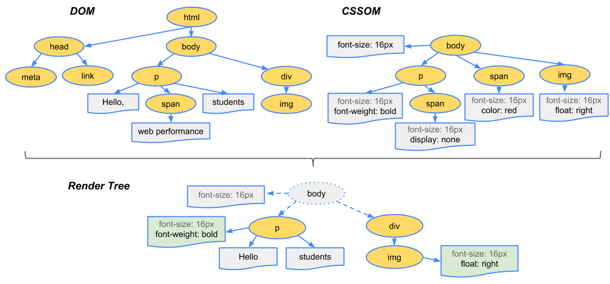
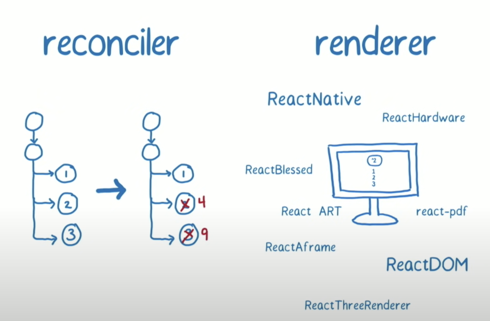
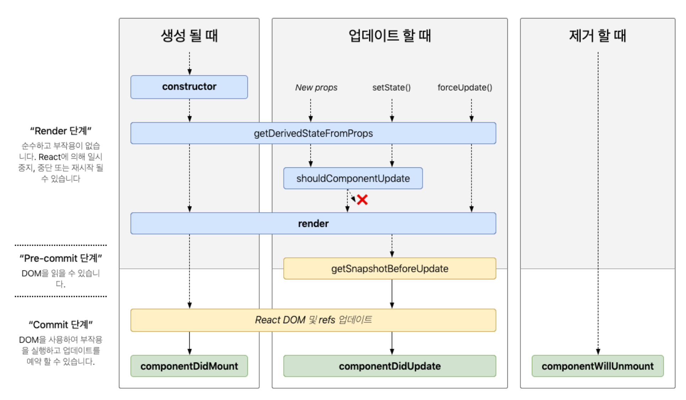

# 2. 리액트 핵심 요소 깊게 살펴보기

**리액트를 이루는 핵심 개념들이 자바스크립트를 토대로 어떻게 동작하는지 알아보자고~**

## 2.1 JSX란?

✨ JSX는 페이스북이 소개한 새로운 구문이지만, 리액트의 전유물만은 아니다.

- 종속적이지 않고, 독자적이며, JS의 일부 또한 아니므로 트랜스파일러를 거쳐야 JS가 이해 가능한 문법으로 완성되며, XML 스타일의 트리 구문 작성에 큰 도움을 준다.

<br>

### 2.1.1 JSX의 정의

---

<br>

🔖 `JSXElement`, `JSXAttributes`, `JSXChildren`, `JSXStrings` 라는 4가지 컴포넌트를 기반으로 한다.

🏷️ `JSXElement`

- 가장 기본적인 요소로, HTML의 요소와 비슷한 역할이다. 다음 조건들을 하나라도 충족해야 한다.

  1. JSXOpeningElement : 일반적으로 볼 수 있는 요소, 시작하는 요소이다.

  2. JSXClosingElement : 종료를 알리는 요소로, OpeningEle(간추려서)로 시작 시 이걸로 끝내야 한다. (한 쌍)

  3. JSXSelfClosingElement : 요소가 시작되고 스스로 종료되는 형태이다. `</script>`와 동일한 형태이다.

  4. JSXFragment : 아무 요소가 없는 형태로 `<> element.. </>` 형태로 사용한다.

<br>

👍 알고 가기 좋은 상식!

- 요소명은 '대문자'로 시작해야 하며, 그 이유는 HTML 구문과 합쳐진 형태의 JSX에서 태그와 컴포넌트를 구분하기 위함이다.

<br>

✅ `JSXElementName`

- `JSXElement`의 요소 이름으로 사용 가능한 것들을 의미한다.

  - `JSXIdentifier` : JSX 내부에서 사용 가능한 식별자를 의미 (JS 식별자 규칙과 동일)

  ```jsx
    // 가능
    function valid() {
      return <$></$>
    }
    // 불가능
    function invalid () {
      return <1></1>
    }
  ```

  - `JSXNamespacedName` : 서로 다른 식별자를 이어주는 것도 하나의 식별자로 판별 (두개 이상 X)

  ```jsx
  // 가능
  function valid() {
    return <foo:bar></foo:bar>;
  }
  ```

  - `JSXMemberExpression` : '.'를 통해 서로 다른 식별자를 이어주는 것을 의미 ('.' 여러개 사용O, NameSpacedName 과 섞어쓰기 X)

  ```jsx
  // 가능
  function valid() {
    return <foo.bar></foo.bar>;
  }
  ```

  <br>

✅ `JSXAttribute`

- `JSXElement`에 부여 가능한 속성을 의미한다. (필수값X, 존재하지 않을 시 에러X)

  - `JSXSpreadAttributes` : JS의 전개 연산자와 동일한 역할을 한다. (보통 객체 형태의 Prop의 키들을 한번에 내릴 때 많이 사용했다.)

  ```jsx
  // 단순히 값 뿐만 아니라 모든 표현식이 존재할 수 있다.
  function valid() {
    const attribute = {
      className: "Div",
      style: { display: "flex" },
    };
    return <div {...attribute}>hi~</div>;
  }
  ```

  - `JSXAttribute` : 속성을 나타내는 키와 값으로 표현한다. (키는 JSXAttributeName, 값은 JSXAttributeValue로 불림)

  ```jsx
  function Child1({ text }) {
    return <p>{text}</p>;
  }

  function Child2({ attribute }) {
    return <div>{attribute}</div>;
  }

  function valid() {
    // 문자열
    return <Child1 text="text" />;

    // AssignmentExpression : 값 할당에 사용하는 표현식
    return <Child1 text={text} />;

    // JSXElement : 다른 JSX요소도 할당 가능
    return <Child attribute={<div>hi</div>} />;
  }
  ```

  <br>

✅ `JSXChildren`

- `JSXElement`의 자식을 나타낸다. 기본적으로 속성을 가진 트리 구조를 나타내기 위해 만들었으므로 Children 또한 존재한다.

  - `JSXChild` : 기본 단위이며, 존재하지 않아도 상관없다. (필요 개수의 기본값 : 0)

  ```jsx
  function valid() {
    // 문자열
    return <div>{"hi"}</div>;

    // JSXElement & JSXFragment
    return <div>{<p>hi~</p>}</div>;

    // JSXChildExpression : JS의 표현식 또한 할당 가능
    return <div>{(() => "foo")()}</div>;
  }
  ```

  <br>

✅ `JSXStrings`

- `JSXAttributeValue`와 `JSText`는 HTML과 JSX 사이의 복붙을 쉽게 할 수 있도록 설계되어 있다. HTML에서 사용 가능한 문자열은 JSX에서도 모두 사용 가능하며, 이는 의도적인 설계이다. ("" or '')

  - 다만 JS에서는 이스케이프 문자( "\\" )가 특수문자 처리에 사용되므로 HTML과 다르게 따로 설정해야 하는 부분은 있다.

  ```jsx
    function valid () {
      // 가능
      return <div>\</div>

      // 불가능
      let escape = "\";
    }
  ```

<br>

### 2.1.2 JSX 예제

---

🔖 유효 JSX 구조를 사용한 예제 알아보기

```jsx
// 기본
const ComponentA = <A>반갑다잉</A>; // or <A />

// 전개 연산자를 통한 속성 넣기
const ComponentB = <A {...attribute} />;

// 속성 및 속성값 지정
const ComponentC = <A requied={false} />;

// JSX 요소 넣기
const ComponentD = (
  <A>
    <B text="어렵다" />
  </A>
);

// {}를 통한 요소나 표현식 넣기
const ComponentE = (
  <A>
    <B children={<>어려워</>} />
  </A>
);

// 여러개의 자식 넣기
const ComponentF = (
  <A>
    흑흑
    <B text="엉엉" />
  </A>
);
```

<br>

### 2.1.3 JSX는 어떻게 자바스크립트에서 변환될까?

---

🔖 JSX 문법을 변환해주는 바벨 플러그인과 함께 알아보자

- JSX 코드 예시

  ```jsx
  const ComponentA = <A required={true}>Hi!</A>;

  const ComponentB = (
    <A>
      <B text="Hi!" />
    </A>
  );
  ```

- JS로 트랜스파일링

  ```js
  var ComponentA = React.createElement(A, { required: true }, "Hi!");

  var CoponenetB = React.createElement(A, null, React.createElement(B, { text: "Hi" }));
  ```

🫨 추가적으로 찾아본 부분

- 확실히 바벨 등의 트랜스파일러를 통해 JSX가 JS로 변환된다는 것을 알 수 있었고, 뭔가 조금 더 우리가 사용하는 코드로 예시를 보고 싶어서 찾아봤다.

- 링크 : [JSX와 Babel](https://www.daleseo.com/react-jsx/#google_vignette)

<br>

### 2.1.4 책 정리 + 주관적인 정리

---

🔖 책 정리

- JSX문법에 있으나 실제로 리액트에서 사용하지 않는 문법도 있다. (하지만 리액트에서지 다른 곳에서는 아닐 수도 있다.)
  - JSXNamespacedName
  - JSXMemberExpression
- HTML과 같은 트리 구조를 JS 내에서 표현할 수 있어 매우 유능한 문법이다.
- 하지만 기존 문법과 뒤섞여 가독성을 해칠 수도 있다.
- 적어도 JSX가 어떻게 변환되는지, 어떤 결과를 만드는지 알아두어야 한다.

<br>

🏷️ 주관적인 정리

- 평소에 JSX를 당연하게 사용만 해왔지, 이게 어떤 식으로 변환 및 재구성되어 브라우저에서 동작하는지에 대한 생각은 해보지 못했던 것 같다.
- 구현에만 급급하지 말고, 항상 효율적으로 다양한 고민을 해야 할 듯하다.. (비용, 효율성, 구조, 간결한 코드 로직 등)

<br>

## 2.2 가상 DOM과 리액트 파이버

✨ 가상 DOM은 리액트의 대명사라고 해도 좋을 만큼 많이 알려져 있다. 가상 DOM의 이점과 주의할 점을 알아보자

### 2.2.1 DOM과 브라우저 렌더링 과정

---

🔖 DOM(Document Object Model)은 무엇인가?

- 기본 브라우저 렌더링 과정



1. 브라우저가 사용자 요청 주소의 HTML 파일을 다운로드 및 파싱하여 DOM노드 트리 작성

2. CSS 파일이 있다면 같이 다운로드 및 파싱하여 CSS노드 트리(CSSOM) 작성

3. 브라우저가 DOM 노드를 순회하며 사용자 눈에 보이는 것만 방문하여 분석

4. 눈에 보이는 노드를 대상으로 CSSOM 정보를 찾고 스타일을 노드에 적용(레이아웃과 페인팅)

- 링크 : [브라우저 로딩 과정](https://junilhwang.github.io/TIL/Javascript/Design/Vanilla-JS-Virtual-DOM/#_1-%E1%84%87%E1%85%B3%E1%84%85%E1%85%A1%E1%84%8B%E1%85%AE%E1%84%8C%E1%85%A5-%E1%84%85%E1%85%A9%E1%84%83%E1%85%B5%E1%86%BC-%E1%84%80%E1%85%AA%E1%84%8C%E1%85%A5%E1%86%BC)

<br>

### 2.2.2 가상 DOM의 탄생 배경

---

🔖 현대의 웹은 단순히 콘텐츠를 보여주기 위함이 아닌, 사용자가 맛보고 즐기는 형태이다.

- 하지만 이 때문에 단순히 콘텐츠를 보여줄 때보다 다양한 상황이 발생하며 (요소의 노출 여부 변경, 사이즈 변경 등), 이는 단순 페인팅 작업보다 훨씬 많은 비용을 지불해야한다. (레이아웃 변경 및 리페인팅)

- 이러한 추가적인 렌더링 작업의 발생은 하나의 페이지에서 모든 작업이 이루어지는 SPA에서 더욱 부각된다.

- 개발자의 관점에서 봤을 때, 하나의 상호작용으로 인해 페이지 내부가 변경되고, 이러한 변경 사항을 모두 추적하는 것은 쉽지 않다. 🤮

✅ 가상 DOM을 통해 이를 야무지게 해결해보자!

- 가상 DOM이 웹페이지가 표시할 DOM을 일단 메모리에 저장, 준비가 완료되면 실제 DOM에 반영한다.

- 따라서 조금의 변경으로도 레이아웃과 리페인팅 되었을 요소의 작업을 최소화하고, 브라우저와 우리의 부담을 덜어준다. (고마운 친구)

<br>

### 2.2.3 가상 DOM을 위한 아키텍쳐, 리액트 파이버

🔖 가상 DOM을 만드는 과정을 리액트가 어떻게 처리하는지 알아보자!

🏷️ 리액트 파이버란?

- 리액트가 관리하는 JS의 객체로, 파이버 재조정자에 의해 관리되며 가상과 실제 DOM을 비교해 변경 사항 수집 및 차이가 있을 시 재조장자가 파이버를 기준으로 브라우저에 렌더링을 요청한다.

  - 작업을 작은 단위로 쪼개고 우선순위를 매김

  - 작업을 일시중지 및 다시시작 가능

  - 이전의 작업 재사용 및 불필요 시 폐기

👍 모든 과정은 비동기로 일어난다. (동기적으로 작업할 경우 너무나도 비효율적)

<br>

🏷️ 재조정(Reconcilation)

- 리액트가 변경 부분 결정을 위해 한 트리를 다른 트리와 비교하는 알고리즘 (선언적 개발의 핵심 개념)

- 리액트가 전체 앱을 리렌더링 시 뛰어난 성능을 유지할 수 있도록 해준다.

  - 컴포넌트 `type`이 다르면 실질적으로 다른 트리를 생성한다고 가정한다. 리액트는 이를 구분하지 않고, 이전의 트리를 교체한다.

  - 목록은 `key`를 통해 구분되기 때문에, `key`는 유니크할 필요가 있다.

  - 리액트는 재조정과 렌더링이 별개의 단계이므로, 재조정의 과정을 거쳐 변화된 요소들의 계산을 때린 뒤, 렌더링하여 앱을 실제로 업데이트 한다.

<br>

🏷️ 파이버의 구현

- 파이버는 이러한 재조정의 단계를 재구현하여, 스케줄링형 프로그래밍의 이점을 잘 활용할 수 있도록 돕는다.

- 하나의 작업 단위로 구성, 작업 단위를 처리하고 `finishWork()` 라는 작업으로 마무리, 이를 커밋해 브라우저 DOM에 가시적 변경 사항을 구현

  1. 렌더 단계에서 노출되지 않는 비동기 작업 수행 (우선순위 지정, 재사용 및 폐기, 파이버 작업 등)

  2. DOM에 변경사항을 구현하기 위해 `commitWork()` 실행 (동기식, 중단 X)

<br>

🏷️ 파이버의 구조

- `tpye` & `key` : 재조징시 파이버가 재사용될 수 있는지 판단할 때 사용

- `child` & `sibling` : 파이버의 재귀적 트리 구조를 묘사하는 개념

```jsx
// Parent 컴포넌트의 child 파이버는 Child1, 2 컴포넌트이다.
// Child1, 2는 각자의 sibling 파이버이다.
function Parent() {
  return (<Child1 />), (<Child2 />);
}
```

- `return` : 현재의 파이버를 처리 후 반환해야 하는 파이버이다.

```jsx
// Child1, 2 컴포넌트의 return 파이버는 Parent 컴포넌트이다.
function Parent() {
  return (<Child1 />), (<Child2 />);
}
```

- `pendingProps` & `memoizedProps` : 함수의 `argument`인 `props`가 시작할 때와 끝날 때 설정된다. 이를 통해 파이버의 재사용 여부를 판별한다. (React.memo의 기능 구현 또한 이 개념으로 이루어짐)

- `pendingWorkPriority` : 파이버가 나타내는 작업들의 우선순위

- `alternate` : 파이버는 `Current Fiber`(현재의 렌더링된 상태)와 `Alternate Fiber`(이전의 파이버)를 가지며, 이를 서로 연결하는 것이 `alternate`이다.

- `output` : `alternate`를 통해 비교되어 업데이트된 렌더 트리와 그에 따른 효과 리스트, 이 과정을 통해 UI가 업데이트되고 변경 사항이 반영된다.

<br>

< 간략한 전체 과정 >

1. 업데이트 과정:

   - 리액트가 컴포넌트를 업데이트할 때, 새로운 work-in-progress fiber가 생성
   - 이 새로운 파이버는 기존 current fiber의 복사본으로 시작되며, alternate 속성을 통해 이전 파이버와 연결

2. 작업 진행:

   - 작업이 진행되면서 리액트는 pendingProps와 memoizedProps를 사용하여 변경 사항을 계산하고, 필요한 업데이트를 적용
   - 이 작업의 결과물은 work-in-progress fiber에 저장되며, 이는 곧 "output"으로 간주

3. 커밋 단계:

   - 모든 변경 사항이 완료되면, work-in-progress fiber가 새로운 current fiber로 채택
   - 이전 current fiber는 이제 alternate가 되며, 새로운 current fiber와 연결

<br>



<br>

### 2.2.4 파이버와 가상 DOM

---

🔖 파이버는 리액트 컴포넌트에 대한 정보를 1:1로 가지고 있고, 비동기적으로 실행

🏷️ 하지만 실제 브라우저 DOM 반영은 동기적이며, 메모리상에서 이를 수행하여 최종 결과물만 반영

✅ 따라서 가상 DOM과 파이버는 동일 개념이 아니며, 가상 DOM은 리액트가 렌더링하는 방식의 한 과정일 뿐이다.

- 링크 : [리액트 화이바~](https://velog.io/@jangws/React-Fiber#react-fiber)

<br>

### 2.2.5 책 정리 + 주관적인 정리

---

🔖 책 정리

- 가상 DOM과 파이버는 단순히 브라우저 DOM을 변경하는 작업보다 빨라서 만들어진 것이 아닌 개발자 대신 파이버와 재조정자가 효율적으로 알고리즘을 통해 관리해주는 것이다.

- 따라서 이는 대규모 웹 앱을 효율적으로 유지보수 및 관리하는 데에 큰 도움을 준다.

- UI를 문자열이나 배열 등과 마찬가지로 값으로 관리하여 효율성을 극대화 시키는 메커니즘이라고 볼 수 있다.

🏷️ 주관적인 정리

- 단순히 가상 DOM과 실제 DOM의 비교를 통해 화면을 렌더링 한다고만 생각했는데, 조금 더 딥하게 심화적인 개념을 공부할 수 있었다.

- 확실히 어려운 개념이고 지금은 조금 얕게 공부했다고 생각하지만 나중에 조금 더 공부해보고 싶다는 생각이 들었다.

<br>

## 2.3 클래스 컴포넌트와 함수 컴포넌트

✨ 함수 컴포넌트의 역사는 오래 되었지만.. 각광받기 시작한 것은 16.8 버전에 훅이 나온 시점 이후부터이다.

✨ 지금은 함수 컴포넌트가 클래스 컴포넌트를 거의 씹어먹었지만, 그렇다고 몰라도 되는 것은 아닌가보다..

### 2.3.1 클래스 컴포넌트

---

🔖오래된 코드의 유지보수나 라이브러리 사용을 효율적으로 하기 위해선 역사의 뒤안길로 사라진 클래스형 컴포넌트를 알 필요가 있다.

- 기본적으로 클래스 컴포넌트는 클래스 선언과 `extends` 키워드를 통한 컴포넌트 상속으로 이루어진다.

- 클래스 컴포넌트를 만들기 위해 `extends` 하는 컴포넌트이고, `shouldComponentUpdate` 컴포넌트를 다루는데서 둘의 차이가 생긴다.

  - React.Component

  - React.PureComponent

  ```jsx
  // 사용 예시
  import React from "react";

  class Sample extends React.Component {
    render() {
      return <h2>Hi~</h2>;
    }
  }
  ```

- 컴포넌트를 만들 때 사용하는 `props`, `state`, 메서드의 정의

  ```tsx
  import React from "react";

  interface SampleProps {
    required?: boolean;
    text: string;
  }

  interface SampleState {
    count: number;
    isLimited?: boolean;
  }

  class SampleComponent extends React.Component<SampleProps, SampleState> {
    private constructor(props: SampleProps) {
      super(props);
      this.state = {
        count: 0,
        isLimited: false,
      };
    }

    private handleClick = () => {
      const newValue = this.state.count + 1;
      this.setState({ count: newValue, isLimited: newValue >= 10 });
    };

    public render() {
      const {
        props: { required, text },
        state: { count, isLimited },
      } = this;

      return (
        <div>
          <p>You clicked {this.state.count} times</p>
          <button onClick={this.handleClick}>Click me</button>
        </div>
      );
    }
  }

  export default SampleComponent;
  ```

  - `constructor()` : 컴포넌트 내부에 존재할 시 컴포넌트 초기화 시점에 호출, `state`를 초기화하며, `super()` 를 통해 상속받은 상위 컴포넌트에 접근

  - `props` : 컴포넌트에 특정 속성을 전달하는 용도, 선언한 형태에 맞게 사용

  - `state` : 컴포넌트 내부에서 관리하는 값, 항상 객체여야 하고 값의 변화 감지 시 리렌더링

  - 메서드 : 렌더링 함수 내부에서 사용, DOM이벤트와 함께 사용하며 방식은 3가지로 분류

    1. `constructor` 에서 `this` 바인딩 하기

    ```tsx
    type Props = Record<string, never>;

    interface State {
      count: number;
    }

    class SampleComponent extends Component<Props, state> {
      // 생략
      // handleClick의 this를 현재 클래스로 바인딩
      private constructor(props: Props) {
        this.handleClick = this.handleClick(this);
      }

      // 사용
      public render() {
        // 생략
        return <button onClick={this.handleClick}>증가</button>;
      }
    }
    ```

    2. 화살표 함수 사용 : 작성 시점에 `this`가 상위 스코프로 결정되는 화살표 함수 사용(바인딩 X)

    3. 렌더링 함수 내부에서 함수를 바로 만들어 사용 : 렌더링이 일어날 때마다 함수가 새로 작성되므로 최적화가 어렵다 -> 비추🚫

    ```jsx
    render() {
        // 생략
        return <button onClick={() => this.handleClick()}>증가</button>
    }
    ```

<br>

🔖 클래스 컴포넌트의 생명주기 메서드

🏷️ 클래스 컴포넌트를 공부할 땐 항상 생명 주기와 생명 주기의 각 시점들을 염두에 두자!

- 마운드(mount) : 컴포넌트가 마운팅(생성)되는 시점

- 업데이트(update) : 생성된 컴포넌트의 내용이 변경되는 시점

- 언마운트(unmount) : 컴포넌트가 더 이상 존재하지 않는 시점



<br>

- `render()` : 클래스 컴포넌트의 유일 필수 값, UI 렌더링 목적

  - `render()` 는 항상 순수해야 하고 부수 효과(side effect)가 없어야한다.

  - 항상 간결하고 깔끔하게 작성해야 하고 state를 직접 호출해선 안된다.

- `componentDidMount()` : 마운트 시 처음으로 실행되는 메서드

  - `this.setState()`를 통해 `state` 값을 변경하는 것이 가능하다.

  - `State` 가 변경되면 브라우저가 UI를 업데이트하기 전에 실행하여 사용자가 렌더링 하는 것을 눈치챌 수 없게 한다.

  - 만능이 아니므로 굳이 이 메서드가 아니더라도 작업할 수 있는 경우엔 사용하지 않는 것이 좋다. (API 호출 후 업데이트, DOM 의존성 작업 등에만 사용)

- `compoenetDidUpdate()` : 컴포넌트 업데이트가 일어난 이후 실행하며 상태값이나 `props`의 변화에 따라 DOM을 업데이트 하는데 쓰인다.

  - `this.setState` 사용 시 조건을 명확히 걸지 않는다면 계속해서 호출될 수 있다. (성능 문제 야기)

- `componentWillUnmount()` : 컴포넌트가 언마운트 되거나 사용되지 않을 때 호출하며 클린업 함수 호출에 최적화 되어있다.

  - `this.setState()` 호출이 불가하다.

- `shouldComponentUpdate()` : `state`나 `props`의 변경에 의한 리렌더링을 방지하고 싶을 때 사용하며 기본적으로 특정한 최적화 상황에서만 사용해야 한다.

  ```jsx
  // props의 title이나 state의 input 값이 다를 경우에만 true (리렌더링)
  shouldComponentUpdate(nextProps: Props, nextState: State) {
    return this.props.title !== nextProps.title || this.state.input !== nextState.input
  }
  ```

🏷️ 위에서 언급한 `Component`와 `pureComponent`의 차이가 바로 `shouldComponentUpdate()`를 어떻게 다루느냐에 있다.

- 기본적으로 `shouldComponentUpdate()`의 리턴값은 `true`이고, 다시 말해 이는 `state`나 `props`의 변경 여부를 신경쓰지 않고 실행되기만 하면 리렌더링 한다는 의미이다.

- `pureComponent` 도 마찬가지로 `shouldComponentUpdate()`가 구현되어 있지만, `props`와 `state`를 얕은 비교를 통해 비교하여 변경된 것이 없다면 `false`를 반환하여 리렌더링을 방지한다.

❗`pureComponent()` 는 얕은 비교만 수행하므로 무분별하게 사용 시 제대로 동작하지 않을 수 있다.

- `static getDerivedStateFromProps()` : 다음에 올 `props`를 바탕으로 현재 `props`를 변경할 때 사용한다.

  - `static` 으로 선언되어 `this`에 접근할 수 없다.

  - 반환하는 객체의 내용은 모두 `state`로 들어간다.

  - `null` 반환 시 아무 일도 일어나지 않는다.

- `getSnapShotBeforeUpdate()` : 이름에서도 알 수 있듯이 새로 업데이트 될 클래스가 렌더링 되기 전 이전 클래스의 값을 기억해놨다가 새로운 클래스로 전송한다.

  - 업데이트 전에 윈도우 크기를 조절하거나 스크롤 위치 조절 등에 사용한다.

❗다음 메서드들은 기존과 다르게 Error 발생 상황에서 사용하는 메서드이다.

- `getDerivedStateFromError()` : 자식 컴포넌트에서 에러가 발생할 시 사용되는 메서드이다.

  - `static` 한 컴포넌트로 하위 컴포넌트에서 발생한 에러를 인수로 받는다.

  - 반드시 `state` 값을 반환해야 하고, 에러를 받아 적절하게 렌더링하는 용도로 사용한다.

  - 에러에 따른 상태 `state`를 반환하는 작업만을 진행해야 하며 `render` 에서 호출되는 메서드이기 때문에 불필요한 부수 효과를 추가할 필요는 없다. (console.error() 사용 등)

- `componentDidCatch()` : 자식 컴포넌트에서 에러가 발생했을 때 실행되며, `getDerivedStateFromError()` 가 에러를 잡고 state를 반환한 후에 실행된다.

  - 부수 효과 사용이 가능하다.

  - 커밋 단계에서 실행되어 에러 발생 시 에러를 바탕으로 정보를 로깅하는 용도로도 사용 가능하다.

  - 에러 경계 컴포넌트인 `ErrorBoundary` 를 여러 개 만들어서 사용 가능하여 컴포넌트 별로 에러 상황에 대처할 수 있다.

  - 에러 발생 영역만 따로 처리하여 에러가 앱 전체로 퍼지는 걸 막을 수 있다.

<br>

😅 클래스 컴포넌트의 한계

- 데이터의 흐름을 추적하기 어렵다.

  - 서로 다른 여러 메서드에서 `state`의 업데이트가 일어날 수 있어 이를 추적하여 렌더링이 일어나는 과정을 판단하기 어렵다.

- 앱 내부 로직의 재사용이 어렵다.

  - 재사용 시 컴포넌트를 또 다른 고차 컴포넌트에 넘겨야 하는데, 이런 식의 작업을 반복하면 래퍼 지옥에 빠질 수 있다.

- 기능이 많을 수록 컴포넌트의 크기가 커진다.

  - 내부의 로직과 컴포넌트가 처리하는 데이터가 커질 수록 컴포넌트 자체의 크기가 너무 커진다.

- 클래스가 어렵다..

  - 클래스보다 함수에 익숙한 개발자가 많고, JS 환경 자체에서 클래스를 사용하는 것이 쉽지 않다.

- 코드 크기를 최적화 하기 어렵다.

  - 사용하지 않는 메서드도 모두 정의해야 하기 때문에 최종적으로 번들링 시 쓸데 없는 비용이 추가된다.

- 핫 리로딩을 하는데 상대적으로 불리하다.

  - 코드에 변경사항이 발생했을 때 리렌더링 없이도 변경된 코드만 업데이트 하는 기법이다.

  - 클래스 컴포넌트 사용 시에는 `instance` 내부의 `render` 값이 수정되어 코드가 초기화 된다.

<br>

### 2.3.2 함수 컴포넌트

---

🔖 단순히 무상태 컴포넌트 구현을 위해 사용했으나, Hook의 출현 이후로 각광받고 있다.

- 클래스 컴포넌트와 다르게 훨씬 더 간결하게 `state`와 `props`를 다룰 수 있다.

<br>

### 2.3.3 함수 컴포넌트 vs 클래스 컴포넌트

---

🔖 클래스와 함수 컴포넌트 사이에는 어떤 차이가 있고, 왜 클래스 컴포넌트는 도태되어갈까?

- 생명주기 메서드의 부재

  - 함수 컴포넌트에는 생명주기 메서드가 존재하지 않는다. (React.Component 클래스를 상속받아 메서드를 사용하기 때문)

  - 비슷한 훅으로 `useEffect`가 있지만, 이는 생명주기를 흉내내어 동기적으로 `state` 를 활용해 부수 효과를 만들 뿐, 같은 개념이 아니다.

- 함수 컴포넌트의 렌더링 값 고정

  ```jsx
  // 함수형 컴포넌트
  function funcComponent(props) {
    const showMessage = () => {
      alert(`hello, ${props.user}`);
    };

    const handleClick = () => {
      setTimeout(showMessage, 3000);
    };

    return <button onClick={handleClick}>클릭</button>;
  }

  // 클래스형 컴포넌트
  class classComponent extends React.Component {
    private showMessage = () => {
      alert(`hello, ${this.props.user}`);
    }

    private handleClick = () => {
      setTimeout(this.showMessage, 3000);
    }

    return <button onClick={this.handleClick}>클릭</button>+
  }
  ```

  - 위 예제는 동일한 결과를 가질 것 같지만, 차이가 존재한다.

  - 클래스는 `props`의 값을 항상 `this`로부터 가져오기 때문에, `props`는 불변이나 `this`가 변경 가능하여 `setTimeout`에 의한 3초간 `props`가 변경된다면 변경된 값을 출력하게 된다.

  - 결국 함수 컴포넌트가 짱이다..👍

- 클래스 컴포넌트를 공부해야 할까?

  - 결론은 현재 널리 사용하는 함수 컴포넌트를 중점적으로 확실하게 공부하되, 클래스 컴포넌트가 아예 없어질 전망은 없으므로, 다양한 상황에 대비해서 조금씩은 공부하는 것이 좋을 듯 하다.

- 링크 : [리액트의 클래스형 컴포넌트](https://react.vlpt.us/basic/24-class-component.html)

<br>

### 2.3.4 책 정리 + 주관적인 정리

---

🔖 책 정리

- 숙련된 리액트 개발자가 되기 위해선 어떤 고민들을 통해 리액트가 발전해 왔는지를 알아야 할 필요가 있다.

- 함수 컴포넌트를 먼저 익혀 숙달되면 클래스를 익혀 리액트를 완전히 정복해보자

🏷️ 주관적인 정리

- 예전에 프론트를 하겠다고 맘먹기 전에 백을 위해 자바 공부를 했었는데, 그 때 자주 사용하던 클래스의 개념이 나와 반가웠다.

- 리액트의 전반적인 흐름과 확실한 숙달을 위해서 현재 사용하는 함수 컴포넌트의 윗 세대인 클래스 또한 어느정도 공부하고 관련 지식을 알고 있으면 좋을 것 같다.

- 반갑긴 하지만 리액트에선 별로 사용하고 싶지 않다..

<br>

## 2.4 렌더링은 왜 일어나는가?

✨ 리액트의 '렌더링'이란 브라우저의 렌더링에 필요한 DOM 트리를 만드는 작업을 의미하며, 개발자라면 렌더링의 과정을 공부하고 이를 효율적으로 운용해야 한다.

<br>

### 2.4.1 리액트의 렌더링이란?

---

🔖 리액트 앱 트리 안에 있는 모든 컴포넌트들이 자신들의 `props`와 `state`를 기반으로 UI를 구성하고 DOM 결과를 브라우저에 제공하는 일련의 과정을 의미한다.

<br>

### 2.4.2 리액트의 렌더링이 일어나는 이유

---

🔖 렌더링 발생 시나리오

- 최초 렌더링 : 사용자가 처음 접속했을 때를 위해 최초 렌더링 시행

- 리렌더링 : 최초 이후 발생하는 모든 렌더링

  - 클래스 컴포넌트의 `setState`, `forceUpdate` 가 실행되는 경우
  - 함수 컴포넌트의 `useState`의 요소인 `setter`, `useReducer`의 요소인 `dispatch` 가 실행되는 경우
  - 컴포넌트의 `key props` 가 변경되는 경우

❗`key props`는 하위 컴포넌트를 선언할 때 사용하며, 동일 요소를 식별하기 위해 사용한다.(ex. 배열을 통해 동일한 요소들을 렌더링하는 경우)

- 앞서 보았던 파이버가 요소를 판별하는 것을 생각하면 `key props`를 사용하는 이유를 유추할 수 있다.

✅ 결론적으로 리액트 상태관리와 관련된 라이브러리들이 리렌더링을 발생시키는 것이 아닌, 내부에서 `useState` 를 사용하여 리렌더링을 발생시키는 것이다.

<br>

### 2.4.3 리액트의 리렌더링 프로세스

---

🔖 리액트의 렌더링 과정을 알아보자

- 렌더링 시작 시 리액트는 루트부터 하위까지 업데이트가 필요한 부분을 찾는다.

- 업데이트 필요 부분을 찾으면 클래스의 경우 `render()` 실행, 함수의 경우 함수 자체를 호출한다.

- 이런 과정을 통해 가상 DOM과 비교한 렌더링 결과물을 실제 DOM에 반영한다.

- 이는 렌더와 커밋이라는 두 단계로 분리되어 실행된다.

<br>

### 2.4.4 렌더와 커밋

---

🏷️ 렌더

- 컴포넌트를 렌더링하고 변경사항을 계산하는 모든 작업

  - 컴포넌트를 실행해 가상 DOM과 비교하여 업데이트할 항목을 체크하는 모든 과정을 의미한다.

  - 비교하는 것은 크게 `type`, `props`, `key` 이다.

🏷️ 커밋

- 렌더 단계을 통해 도출한 모든 변경 사항을 실제 DOM에 적용해 사용자에게 보여주는 과정

  - 여기까지 완료해야 브라우저의 렌더링 발생

  - 업데이트된 항목에 리액트의 내부 참조를 업데이트하여 연결하고, 클래스의 경우 `componentDidMount()`, `commponentDidUpdate()` 를 실행하고, 함수의 경우 `useLayoutEffect()` 훅을 실행한다.

❗여기서 알 수 있는 사실은 꼭 렌더 단계가 실행된다고 해서 커밋 단계가 실행되진 않는다는 것이다.

- 변경 사항 계산 시 변경 사항이 없다면, 커밋 단계가 생략될 수 있다.

- 이는 브라우저의 DOM 업데이트가 발생되지 않는 것으로 이어진다.

✅ 위 두 과정으로 인해 리액트의 렌더링은 항상 동기식으로 이루어지며, 이는 불필요한 렌더링이 발생할 경우 성능 저하로 이어질 수 있음을 보여준다.

<br>

### 2.4.5 일반적인 렌더링 시나리오 살펴보기

🔖 예시를 통해 렌더링 시나리오 살펴보기

```jsx
import React, { useState } from "react";
import ReactDOM from "react-dom";

const B = memo(() => {
  return <div>안녕~</div>;
});

function App() {
  // useState를 사용하여 count 상태를 정의
  const [count, setCount] = useState(0);

  // 버튼 클릭 시 호출되는 함수
  const handleClick = () => {
    setCount(count + 1);
  };

  // 컴포넌트의 JSX 반환
  return (
    <div>
      <h1>Counter: {count}</h1>
      <button onClick={handleClick}>Increment</button>
      <B />
    </div>
  );
}
```

- 기본적으로 컴포넌트 렌더링은 별도의 조치가 없다면 해당 컴포넌트의 모든 하위에 영향을 미친다.

- `React.memo`를 사용해 변경되지 않는 컴포넌트의 리렌더링을 방지할 수 있다.

<br>

### 2.4.6 책 정리 + 주관적인 정리

---

🔖 책 정리

- 개발자는 항상 리액트의 눈에 보이지 않는 렌더링을 인지하고 다룰 수 있어야 한다.

- 리액트의 렌더링 시나리오를 정확히 이해하여 불필요한 리렌더링을 방지하고 성능 좋은 리액트 앱을 만들자!

🏷️ 주관적인 정리

- UI가 변경되는 것이 곧 리액트의 리렌더링이라고 생각해왔는데, 눈에 보이지 않는 렌더링도 존재한다니 가슴이 답답해진다.

- 하지만 이를 잘 인지하고 공부하여 이해하는 것이 리액트의 근본을 파는 것이고 곧 실력있는 개발자가 되는 길이므로 열심히 공부해야 할 듯 하다.

<br>

## 2.5 컴포넌트와 함수의 무거운 연산을 기억해 두는 메모이제이션

✨ `React.memo`, `useCallback`, `useMemo`를 통해 현명하고 효율적으로 메모이제이션 하는 방법을 알아보자

<br>

### 2.5.1 주장1 : 섣부른 최적화는 독이다. 꼭 필요한 곳에만 메모이제이션을 추가하자

---

🔖 메모이제이션 또한 비용이 드는 엄연한 작업이므로 항상 신중하게 사용해야 한다.

```jsx
function sum(a, b) {
  return a + b;
}
```

- 위 예제 같은 경우 메모이제이션과 매번 계산, JS에 맡기는 것들 중 뭐가 더 나을까?

- 극단적이긴 하나 엄연히 메모이제이션 또한 메모리를 사용해 기존 값을 가져오는 것과 이를 비교하는 판단에 드는 비용이 있으므로, 섣부르게 사용하는 것을 방지해야 한다.

### 개발자에게 메모이제이션 할 선택권을 쥐어준 것부터 알아서 유도리 있게 사용하라는 방증이다. 😠

<br>

### 2.5.2 주장 2 : 렌더링 과정의 비용은 비싸다. 모조리 메모이제이션 해버리자

---

🔖 일반적으로 컴포넌트들은 비싼 연산이 포함되고 자식 컴포넌트가 많이 딸려있을 확률이 높다.

- 이런 전제를 깔고 가는 경우 메모이제이션 하는 것이 확실히 도움이 될 것이다.

  - `memo` 를 컴포넌트의 사용에 따라 잘 살펴보고 적용

  - `memo` 를 그냥 다 박아버리기

❗잘못된 `memo`로 지불해야 하는 비용이 `props`에 대한 얕은 비교가 발생 시 지불하는 비용이다.

- 리액트는 이전 결과물을 다음 결과와 비교하기 위해 저장해야 하고, 이를 비교하면서 발생하는 비용이 `memo`로 지불하는 비용이다.

- 하지만 `memo`를 사용하지 않을 시 발생할 잠재적 비용이 훨씬 크다.

  - 렌더링 시 발생 비용

  - 컴포넌트 내부 복잡한 로직의 재실행

  - 자식에서 위 두 과정이 반복

  - 리액트의 재조정 과정

🔖 `useCallback`과 `useMemo`

- 의존성 배열 비교 및 필요에 따른 값 재계산 과정과 메모이제이션을 통한 과정에서 발생하는 비용을 항상 고민해야 한다.

  ```jsx
  // 함수 메모이제이션 예제
  function useMath(number) {
    const [double, setDouble] = useState(0);
    const [tripple, setTripple] = useState(0);

    useEffect(() => {
      setDouble(number * 2);
      setTripple(number * 3);
    }, [number]);

    return { double, tripple };
  }

  function App() {
    const [counter, setCounter] = useState(0);
    const value = useMath(10);

    useEffect(() => {
      console.log("hi");
    }, [value]);

    const handleClick = () => {
      setCounter((prev) => prev + 1);
    };

    return (
      <>
        <h1>{counter}</h1>
        <button onClick={handleClick}>클릭</button>
      </>
    );
  }
  ```

- 위 예제의 경우, 실제로 변하는 값이 없음에도 불구하고 `console.log('hi')` 구문이 실행된다.

- `App` 컴포넌트가 호출되며 계속해서 `useMath` 훅을 호출하고 참조가 변경되기 때문이다.

- 따라서 `useMath`의 리턴값을 `useMemo()`를 통해 감싸면, 비교를 수행하며 변하지 않은 값으로 인한 렌더링을 방지할 수 있다.

<br>

### 책 정리 및 주관적인 정리

---

🔖 책 정리

- 아직 리액트에 대한 이해가 부족하다면, 섣부른 메모이제이션을 지양하며 어느 지점에서 이를 사용하면 좋을지 고민하는 형식으로 메모이제이션을 차근차근 적용해야 한다.

- 하지만 현업에서 이미 종사하고 있거나 성능에 대해 깊게 연구할 여유가 없다면 일단 다 적용해보는 것이 좋다. 섣부른 메모이제이션의 비용이 다른 모든 비용보다 싼 경우가 많다.

🏷️ 주관적인 정리

- 세가지의 메모이제이션용 훅들에 대해 알고는 있었지만 사용해본 경험이 많지 않았다. 이번에 공부하면서 정확한 사용 용도와 사용법, 그리고 사용에 대한 고민까지 다양하게 접할 수 있어 좋았다.

- 현재 스프린트 미션이나 기초 프로젝트 결과물에도 적용해보면서 사용감을 익히는 것이 좋을 듯 하다. 책에서 막 갈기라고 했다고 진짜 아무데나 갈기지 말자.

- 링크 : [전부 메모이제이션 할까요?](https://velog.io/@superlipbalm/blogged-answers-a-mostly-complete-guide-to-react-rendering-behavior#%EC%A0%84%EB%B6%80-%EB%A9%94%EB%AA%A8%EC%9D%B4%EC%A0%9C%EC%9D%B4%EC%85%98%ED%95%A0%EA%B9%8C%EC%9A%94)
