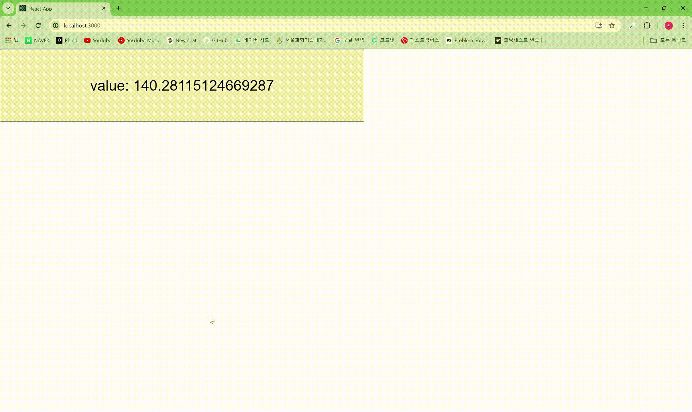
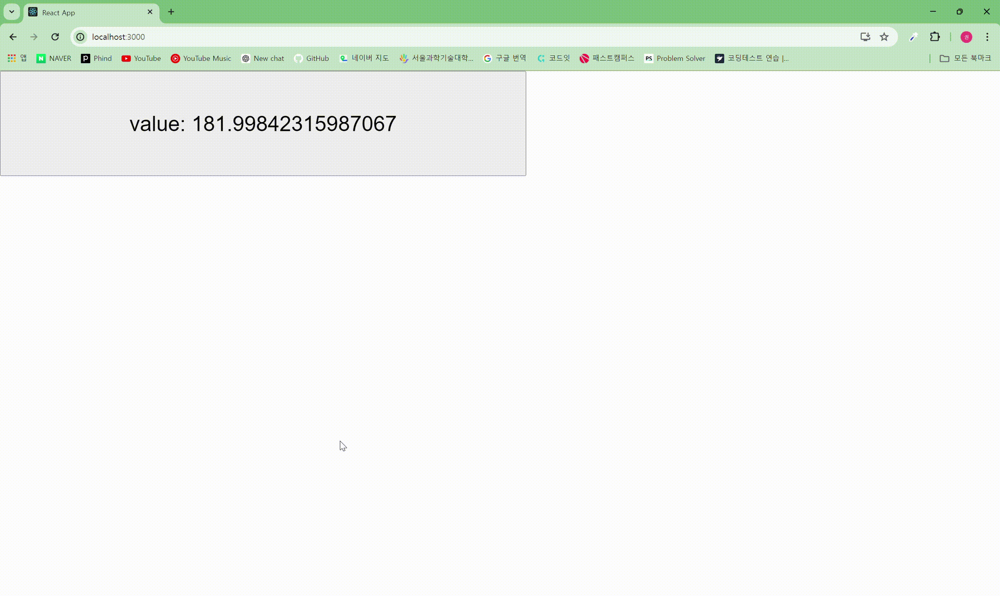

# 03장: 리액트 훅 깊게 살펴보기

## 3.1 리액트의 모든 훅 파헤치기

### useState

state가 아닌 보통의 변수를 사용하는 것은 리렌더링을 일으키지 않으며, 매번 실행될 때마다 초기화된다.

함수의 실행이 끝났음에도 함수가 선언된 환경을 기억하는 **클로저**를 통해 state의 값을 유지하고 사용할 수 있다.

```js
// useState 작동 방식을 흉내낸 코드

const MyReact = (function () {
  const global = {};
  let index = 0;

  function useState(initialState) {
    if (!global.states) global.states = [];

    const currentState = global.states[index] || initialState;
    global.states[index] = currentState;
  }

  const setState = (function () {
    let currentIndex = index;
    return function (value) {
      global.states[currentIndex] = value;
    };
  })();

  index = index + 1;

  return [currentState, setState];

  function Component() {
    const [value, setValue] = useState(0);
    // ...
  }
})();
```

MyReact가 호출되어 실행이 종료되어도 `global`을 계속 참조함으로써 useState의 이전의 값을 정확하게 꺼내 쓸 수 있다.

#### 게으른 초기화

useState의 인수로 특정한 값을 반환하는 함수를 넣어줄 수 있다.
이렇게 변수 대신 함수를 넘기는 것을 게으른 초기화라고 한다.

```js
function calculateInitialState() {
    console.log("Calculating initial state...");
    return 42;
}

function MyComponent() {
    // useState에 함수를 전달하여 게으른 초기화를 사용
    const [count, setCount] = useState(calculateInitialState);
```

게으른 초기화 함수는 state가 처음 만들어질 때만 사용된다.
이후 리렌더링이 발생된다면 함수의 실행은 무시되고, 기존의 값을 사용한다.

만약 useState의 인수로 비용이 드는 값이 들어간 경우 초기값이 있어 더 이상 필요 없는 리렌더링 시에도 동일하게 계속 해당 값에 접근해야 한다.

### useEffect

useEffect는 생명주기 메서드를 대체하기 위해 만들어진 훅이 아니다.
**useEffect는 컴포넌트가 렌더링된 후에 어떠한 부수 효과를 일으키고 싶을 때 사용하는 훅이다.**

_부수 효과: API에서 데이터를 검색하거나 페이지 제목을 수정하는 등의 렌더링과 관련 없는 작업_

#### 클린업 함수의 목적

```jsx
import { useEffect, useState } from "react";

export default function App() {
  const [counter, setCounter] = useState(0);

  function handleClick() {
    setCounter((prev) => prev + 1);
  }

  useEffect(() => {
    function addMouseEvent() {
      console.log(counter);
    }

    window.addEventListener("click", addMouseEvent);

    return () => {
      console.log("클린업 함수 실행", counter);
      window.removeEventListener("click", addMouseEvent);
    };
  }, [counter]);

  return (
    <>
      <h1>{counter}</h1>
      <button onClick={handleClick}>+</button>
    </>
  );
}
```

```
결과

클린업 함수 실행 0
1

클린업 함수 실행 1
2

...
```

`+`를 눌러 counter 상태가 변해서 useEffect의 콜백 함수가 실행이 될 때,
반환한 클린업 함수가 선행된다.
이때 클린업 함수는 새로운 값을 기반으로 렌더링 뒤에 실행되지만 이 변경된 값을 읽는 것이 아니라 **함수가 정의됐을 당시에 선언됐던 이전 값을 보고 실행된다.**

따라서 useEffect에 이벤트를 추가했을 때 왜 클린업 함수에서 지워야 하는지 알 수 있다.
useEffect의 콜백은 실행될 때마다 이전의 클린업 함수가 존재한다면 그 클린업 함수를 실행한 뒤 콜백을 실행한다.
이벤트를 추가하기 전에 이전에 등록했던 이벤트 핸들러를 삭제하는 코드를 클린업 함수에 포함함으로써 이벤트 핸들러가 무한히 추가되는 것을 방지할 수 있다.

🛑 이처럼 클린업 함수는 생명주기 메서드의 언마운트 개념과는 조금 차이가 있다.
언마운트가 특정 컴포넌트가 DOM에서 사라질 때 실행되었다면, 클린업 함수는 언마운트라기보다는 함수 컴포넌트가 리렌더링됐을 때 이전 상태를 청소해 주는 개념으로 보는 것이 옳다.

#### console.log vs useEffect

```js
// 1
function Component() {
  console.log("렌더링됨");
}

// 2
function Component() {
  useEffect(() => {
    console.log("렌더링됨");
  });
}
```

**두 코드의 차이점**

1. 서버 사이드 렌더링 관점에서 useEffect는 클라이언트 사이드에서 실행되는 것을 보장해 준다.
   useEffect 내부에서는 window 객체의 접근에 의존하는 코드를 사용해도 된다.
2. useEffect는 컴포넌트 렌더링의 부수 효과, 즉 컴포넌트의 렌더링이 완료된 이후에 실행된다.

#### useEffect를 사용할 때 주의할 점

##### `eslint-disable-line react-hooks/exhaustive-deps` 주석은 최대한 자제하라

useEffect는 반드시 의존성 배열로 전달한 값의 변경에 의해 실행돼야 하는 훅이다.
의존성 배열을 넘기지 않은 채 콜백 함수 내부에서 특정 값을 사용한다는 것은, 이 부수 효과가 관찰해서 실행 해야 하는 값과 별개로 작동한다는 것을 의미한다.

API 호출 후 업데이트와 같이 부득이한 경우가 아니면 useEffect에 빈 배열을 넘기는 것이 최선인지 한 번 더 검토해야 한다.

##### useEffect의 첫 번째 인수에 함수명을 부여하라

useEffect의 코드가 복잡하고 많아질수록 무슨 일을 하는 useEffect 코드인지 파악하기 어려워진다.
적절한 기명 함수는 useEffect의 목적을 파악하기 쉽게 해준다.

##### 거대한 useEffect를 만들지 마라

부수 효과의 크기가 커질수록 애플리케이션 성능에 악영향을 미친다.

만약 부득이하게 큰 useEffect를 만들어야 한다면 적은 의존성 배열을 사용하는 여러 개의 useEffect로 분리하는 것이 좋다.

##### 불필요한 외부 함수를 만들지 마라

useEffect 내에서 사용할 부수 효과라면 내부에서 만들어서 사용하는 편이 좋다.

🏷️ 콜백 함수에 함수명을 붙이는 것과 더불어 사용하면 좋을 것 같다.

<br>

📖 useEffect의 경쟁 상태: 왜 useEffect의 콜백 인수로 비동기 함수를 넣을 수 없을까?

```js
const MyReact = (function () {
  useEffectCallback1();
  useEffectCallback2();
  // 만약 두 콜백 함수가 비동기 함수라면 순서가 보장되지 않는다.
})();
```

useEffect의 경쟁 상태 때문에 비동기 함수를 인수로 넘겨줄 수 없다.

_경쟁상태: 프로그램이나 시스템 등의 실행/출력 결과가 일정하지 않고, 입력의 타이밍, 실행되는 순서나 시간 등에 영향을 받게 되는 상황. 결과가 매번 달라질 가능성이 있다._

useEffect 내부에서 비동기 작업은 가능하다.
다만 비동기 함수가 내부에 존재하게 되면 useEffect 내부에서 비동기 함수가 생성되고 실행되는 것을 반복함으로 클린업 함수로 이전 비동기 함수에 대한 처리를 추가하는 것이 좋다.
fetch의 경우 [abortControll](https://developer.mozilla.org/ko/docs/Web/API/AbortController)로 이전 요청을 취소할 수 있다.

```js
useEffect(() => {
  let shouldIgnore = false;

  async function fetchData() {
    const response = await fetch(`https://api.example.com/data?query=${query}`);
    const result = await response.json();
    if (!shouldIgnore) setData(result);
  }

  fetchData();

  return () => {
    shouldIgnore = true;
  };
}, [query]);
```

```
// 첫 번째 콜백 함수 실행
------------------------------------------------------>
                                            클린업 함수 실행
shouldIgnore = false                       shouldIgnore = true

// 두 번째 콜백 함수 실행
                        ------------>
        shouldIgnore = false   setData(result)
```

```js
// abortController 사용

useEffect(() => {
  const controller = new AbortController();
  const signal = controller.signal;

  async function fetchData() {
    try {
      const response = await fetch(
        `https://api.example.com/data?query=${query}`,
        { signal }
      );
      const result = await response.json();
      setData(result);
    } catch (error) {
      if (error.name !== "AbortError") {
        console.error("Fetch error:", error);
      }
    }
  }

  fetchData();

  return () => {
    controller.abort();
  };
}, [query]);
```

### useMemo

첫 번째 인수로는 값을 반환하는 생성 함수를, 두 번째 인수로는 의존성 배열을 전달한다.
의존성 배열의 값이 변경되지 않았으면 함수를 재실행하지 않고 이전에 기억해 둔 해당 값을 반환한다.

이러한 메모이제이션은 값뿐만 아니라 컴포넌트도 가능하다.
=> React.memo, useCallback은 useMemo에서 파생되었다.

### useCallback

useCallback은 인수로 넘겨받은 콜백 자체를 기억한다.

```js
export default function App() {
  const [state1, setState1] = useState(false);
  const [state2, setState2] = useState(false);

  const toggle1 = useCallback(() => {
    setState1(!state1);
  }, [state1]);

  const toggle2 = useCallback(() => {
    setState2(!state2);
  }, [state2]);

  return (
    <>
      <ChildComponent name="1" value={state1} onChange={toggle1} />
      <ChildComponent name="2" value={state2} onChange={toggle2} />
    </>
  );
}
```

리렌더링될 때마다 함수 컴포넌트가 재호출되면서 내부의 함수도 재선언된다.
useCallback이 없다면 props로 내려주는 함수가 변경이 되면서 memo로 감싸도 자식 컴포넌트가 리렌더링된다.

이처럼 useCallback은 함수를 자식 컴포넌트에 props로 내려줄 때 유용하다.

<br>

useCallback은 useMemo를 사용해서 구현할 수 있다.

```js
export function useCallback(cb, args) {
  return useMemo(() => cb, args);
}
```

JS에서는 함수 또한 값이므로 결국 useCallback은 useMemo와 다른 것이 아니며 작은 집합이라고 할 수 있다.

### useRef

useRef는 useState와 동일하게 렌더링이 일어나도 변경 가능한 상태값을 저장한다.
다만 useRef의 값이 변하더라도 렌더링을 발생시키지 않는다.

useRef는 컴포넌트가 렌더링될 때만 생성되며, 컴포넌트 인스턴스가 여러 개라도 각각 별개의 값을 바라본다.

useRef의 가장 일반적인 사용 예는 DOM에 접근할 때이다.

```js
function RefComponent() {
  const inputRef = useRef();

  console.log(inputRef.current); // undefined

  useEffect(() => {
    console.log(inputRef.current); // <input type="text"></input>
  }, [inputRef]);

  return <input ref={inputRef} type="text" />;
}
```

### useContext

#### Context

Context를 만들고 Context 객체의 Provider 컴포넌트로 데이터를 공유할 범위를 지정할 수 있다.


```js
// Context 세팅

// LocaleContext.js
import { createContext } from "react";

// createContext로 Context를 생성한다.
const LocaleContext = createContext();

export default LocaleContext;


// App.js
// 데이터를 공유하고자 하는 부분 상위에 Context.Provider를 사용한다.
// value prop으로 공유할 데이터를 지정한다.
export default function App() {
  return (
    <LocaleContext.Provider value={"ko"}>
      ...
    </LocaleContext.Provider>
  )
}
```

```js
// Context 사용하기

// Provider 하위 컴포넌트에서 useContext를 사용하면 값을 받을 수 있다.
export default function ChildComponent() {
  const locale = useContext(LocaleContext)

  ...
}
```

##### Context 한 곳에서 관리하기

setter 부분을 한 곳에서 관리하고, 커스텀 훅을 사용하여 좀 더 편하게 사용할 수 있다.

```js
import { createContext, useContext, useState } from "react";

const LocaleContext = createContext();

// Provider 컴포넌트를 새로 만들어 사용
// state와 setState를 공유한다.
export function LocaleProvider({ defaultValue = "ko", children }) {
  const [locale, setLocale] = useState(defaultValue);

  return (
    <LocaleContext.Provider
      value={{
        locale,
        setLocale,
      }}
    >
      {children}
    </LocaleContext.Provider>
  );
}

// 커스텀 훅을 통해 안전하고 쉽게 Context를 관리할 수 있다.
export function useLocale() {
  const context = useContext(LocaleContext);

  if (!context) throw new Error("Provider 안에서 사용해야 합니다");
  return context.locale;
}

export function useSetLocale() {
  const context = useContext(LocaleContext);

  if (!context) throw new Error("Provider 안에서 사용해야 합니다");
  return context.setLocale;
}
```

#### useContext를 사용할 때 주의할 점

useContext를 함수 컴포넌트 내부에서 사용할 때는 컴포넌트 재활용이 어려워진다.
해당 함수 컴포넌트가 Provider 하위에 있지 않은 상태로 useContext를 사용한다면 예기치 못한 작동 방식이 만들어진다.
즉, useContext가 있는 컴포넌트는 그 순간부터 Provider와의 의존성을 갖게 된다.
따라서 컨텍스트가 미치는 범위는 필요한 환경에서 최대한 좁게 만들어야 한다.

🛑 또한 useContext는 상태 관리를 위한 리액트의 API가 아닌 상태를 주입해 주는 API다.
단순히 props 값을 하위로 전달해주는 역할이다.

### useReducer

> useState의 심화 버전

- state가 가져야 할 값이 복잡하거나 수정하는 경우의 수가 많아질 때
- 성격이 비슷한 여러 개의 state가 있을 때

useReducer를 사용함으로써 state를 사용하는 로직과 관리하는 로직을 분리할 수 있는 장점이 있다.

```js
import React, { useReducer } from "react";

const initialState = {
  username: "",
  email: "",
  password: "",
};

function reducer(state, action) {
  switch (action.type) {
    case "setField":
      return {
        ...state,
        [action.field]: action.value,
      };
    case "reset":
      return initialState;
    default:
      throw new Error();
  }
}

function RegistrationForm() {
  const [state, dispatch] = useReducer(reducer, initialState);

  const handleChange = (e) => {
    dispatch({ type: "setField", field: e.target.name, value: e.target.value });
  };

  const handleSubmit = (e) => {
    e.preventDefault();
    // 폼 제출 로직
    console.log(state);
  };

  return (
    <form onSubmit={handleSubmit}>
      <input
        name="username"
        value={state.username}
        onChange={handleChange}
        placeholder="Username"
      />
      <input
        name="email"
        value={state.email}
        onChange={handleChange}
        placeholder="Email"
      />
      <input
        name="password"
        value={state.password}
        onChange={handleChange}
        type="password"
        placeholder="Password"
      />
      <button type="submit">Register</button>
      <button type="button" onClick={() => dispatch({ type: "reset" })}>
        Reset
      </button>
    </form>
  );
}

export default RegistrationForm;
```

### useImperativeHandle

#### forwardRef

- 상위 컴포넌트가 하위 컴포넌트의 DOM 노드에 접근할 때
- 상위 컴포넌트가 하위 컴포넌트로 ref를 넘겨줄 때

ref는 컴포넌트의 props로 사용할 수 있는 예약어다.
하지만 ref 속성은 하위 컴포넌트의 props로 내려주는 속성이 아닌 엘리먼트를 참조하기 위한 속성이다.

물론 `parentRef`와 같이 다른 이름으로 props로 ref를 내려주어도 되지만
일관성을 제공하기 위해 자식 컴포넌트를 forwardRef로 감싸주는 것으로 해결할 수 있다.

```jsx
const ChildComponent = forwardRef((props, ref) => {
  useEffect(() => {
    console.log(ref);
  }, [ref]);

  return <div>안녕!</div>;
});

function ParentComponent() {
  const inputRef = useRef();

  return (
    <>
      <input ref={inputRef} />
      <ChildComponent ref={inputRef} />
    </>
  );
}
```

#### useImperativeHandle이란?

부모에게서 넘겨받은 ref를 원하는 대로 수정할 수 있는 훅이다.

```jsx
import React, { useRef, useImperativeHandle, forwardRef } from "react";

const ChildComponent = forwardRef((props, ref) => {
  const inputRef = useRef();

  useImperativeHandle(ref, () => ({
    focus: () => {
      inputRef.current.focus();
    },
    value: () => {
      return inputRef.current.value;
    },
  }));

  return <input ref={inputRef} {...props} />;
});

function ParentComponent() {
  const inputRef = useRef();

  const focusInput = () => {
    inputRef.current.focus();
  };

  const getValue = () => {
    alert(inputRef.current.value());
  };

  return (
    <div>
      <ChildComponent ref={inputRef} />
      <button onClick={focusInput}>Focus the input</button>
      <button onClick={getValue}>Get Input Value</button>
    </div>
  );
}

export default ParentComponent;
```

위 예제에서 원래 ref.current는 HTMLInputElement 였으나
`{...HTMLInputElement, ...{focus: ..., value: ...}}` 사용자가 추가한 프로퍼티를 포함한 객체가 되었다.

### useLayoutEffect

리액트의 렌더링은 함수 컴포넌트의 return을 실행한 다음, 이 실행 결과를 이전의 리액트 트리와 비교해 리렌더링이 필요한 부분만 업데이트해 이뤄진다.

1. 리액트의 렌더링
2. useLayoutEffect 실행
3. 브라우저의 렌더링
4. useEffect 실행

useLayoutEffect는 브라우저에 변경사항이 반영되기 전에 실행된다.

또한 useLayoutEffect는 동기적으로 실행된다.
리액트는 useLayoutEffect의 실행이 종료될 때까지 기다린 다음에 화면을 그린다.
때문에 컴포넌트가 일시 중지 되는 것과 같은 일이 발생하게 된다.

DOM은 계산됐지만 이것이 화면에 반영되기 전에 하고 싶은 작업이 있을 때 사용한다.
DOM 요소를 기반으로 한 애니메이션, 스크롤 위치 제어 등 화면에 반영되기 전에 사용하면 더 자연스러운 사용자 경험을 제공할 수 있다.

```js
const Test = () => {
  const [value, setValue] = useState(0);

  useLayoutEffect(() => {
    if (value === 0) {
      setValue(10 + Math.random() * 200);
    }
  }, [value]);

  console.log("render", value);

  return (
    <button
      onClick={() => setValue(0)}
      style={{ width: "100vh", height: "20vh", fontSize: "36px" }}
    >
      value: {value}
    </button>
  );
};

export default Test;
```


▲ useLayoutEffect 사용


▲ useEffect 사용

### 훅의 규칙

1. 최상위에서만 훅을 호출해야 한다. 반복문이나 조건문, 중첩된 함수 내에서 훅을 실행할 수 없다. 이 규칙을 따라야만 **항상 동일한 순서로 훅이 호출되는 것을 보장할 수 있다.**
2. 훅을 호출할 수 있는 것은 리액트 함수 컴포넌트, 혹은 사용자 정의 훅 두 가지 경우뿐이다.

## 3.2 사용자 정의 훅과 고차 컴포넌트 중 무엇을 써야 할까?

리액트에서는 재사용할 수 있는 로직을 관리할 수 있는 두 가지 방법이 있다.

### 사용자 정의 훅

서로 다른 컴포넌트 내부에서 같은 로직을 공유하고자 할 때 개발자가 필요한 훅을 만드는 기법

반드시 `use`로 시작해야 한다.

### 고차 컴포넌트

고차 함수: 함수를 인수로 받거나 결과로 반환하는 함수
고차 컴포넌트: 컴포넌트 자체의 로직을 재사용하기 위한 방법
=> **컴포넌트를 인수로 받거나 결과로 반환하여 컴포넌트 자체의 로직을 재사용할 수 있다.**

```tsx
interface LoginProps {
  loginRequired?: boolean;
}

// 고차 컴포넌트는 관습적으로 with 접두사를 사용한다.
function withLoginComponent<T>(Component: ComponentType<T>) {
  return function (props: T & LoginProps) {
    const { loginRequired, ...restProps } = props;

    if (loginRequired) return <>로그인이 필요합니다.</>;

    return <Component {...(restProps as T)} />;
  };
}

const Component = withLoginComponent((props: { value: string }) => {
  return <h3>{props.value}</h3>;
});
```

위 예제에서는 로그인 관련 책임을 모두 고차 컴포넌트인 withLoginComponent에 맡길 수 있어 중복을 피할 수 있다.

이렇듯 고차 컴포넌트는 컴포넌트 전체를 감쌀 수 있다는 점에서 사용자 정의 훅보다 더 큰 영향력을 컴포넌트에 미칠 수 있다. 단순히 값을 반환하거나 부수 효과를 실행하는 사용자 정의 훅과는 다르게 고차 컴포넌트는 결과물에 영향을 미칠 수 있는 다른 공통된 작업을 처리할 수 있다.

### 사용자 정의 훅 vs 고차 컴포넌트

두 방법 모두 리액트 코드에서 어떠한 로직을 공통화해 별도로 관리할 수 있다.
어떠한 경우에 각각 사용자 정의 훅 또는 고차 컴포넌트를 사용해야 할까?

#### 사용자 정의 훅이 필요한 경우

컴포넌트 내부에 미치는 영향을 최소화해 원하는 방향으로 공통된 로직을 사용하고 싶을 때는 사용자 정의 훅이 더 적절하다.

```jsx
function HookComponent() {
  const { loggedIn } = useLogin();

  useEffect(() => {
    if (!loggedIn) {
      // do something
    }
  }, [loggedIn]);
}
```

위 예제에서 useLogin은 단순히 loggedIn에 대한 **값만 제공**할 뿐, 이에 대한 처리는 컴포넌트를 사용하는 쪽에서 원하는 대로 사용 가능하다.

의존성을 낮추고 자유도를 높이고 싶을 때 사용자 정의 훅을 사용하는 것이 좋아보인다.

#### 고차 컴포넌트를 사용해야 하는 경우

함수 컴포넌트의 반환값, 즉 **렌더링의 결과물**에도 영향을 미치는 공통 로직이라면 고차 컴포넌트를 사용하자.

```jsx
const HOCComponent = withLoginComponent(() => {
  return <>안녕하세요.</>;
});
```

---

### 새로 알게된 개념

- useEffect 클린업 함수
- useReducer
- forwardRef
- 고차 컴포넌트

### 읽으면서 어려웠거나 이해가 잘 안됐던 부분

- useEffect의 경쟁 상태
- useReducer
