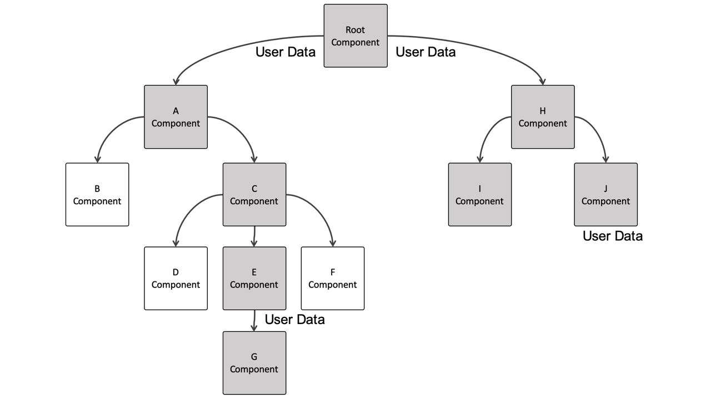
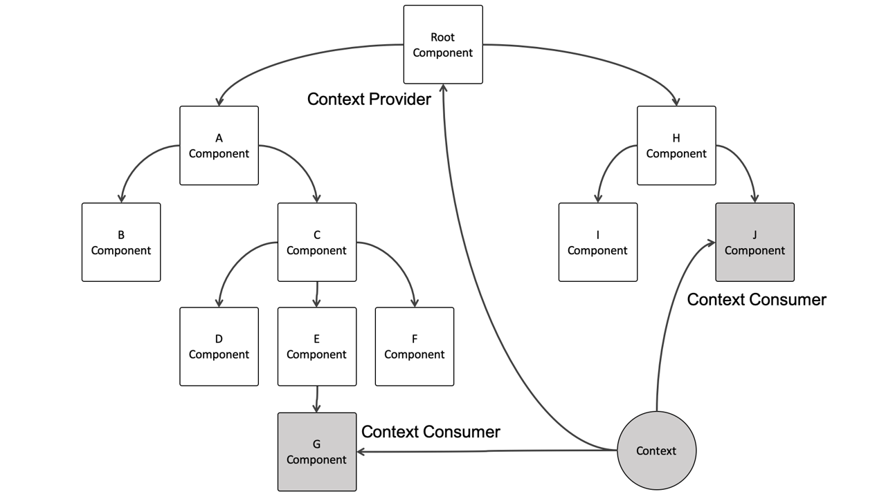

#

# 3장 리액트 훅 깊게 살펴보기

**Hook**

클래스 컴포넌트의 생명주기 메서드를 대체하거나, state를 사용할 수 있게 해주는 함수

## 3.1 리액트의 모든 훅 파헤치기

### 3.1.1 useState

- 함수 컴포넌트 내부에서 상태를 정의하고 관리하는 훅

**✏️useState 구현 살펴보기**

```jsx
import { useState } from "react";

const [state, setState] = useState(initialState);
```

- useState() 인수로 state의 초깃값 설정
- 아무런 값을 넘기지 않을 경우 초깃값은 undefined
- useState의 반환값은 두 개의 요소를 가진 배열을 반환
  - state
  - state를 변경하는 setState

```jsx
function Component() {
  const [state, setState] = useState();

  // state를 직접 변경하는 경우
  function handleButtonClick1() {
    state = "hi";
  }

  // state를 직접 변경하고 setState를 호출,
  function handleButtonClick2() {
    state = "hi";
    setState();
  }

  function handleButtonClick3() {
    setState("hi");
  }

  return (
    <>
      <h1>{state}</h1>
      <button onclick={handleButtonClick1}>hi</button>
      <button onclick={handleButtonClick2}>hi</button>
      <button onclick={handleButtonClick3}>hi</button>
    </>
  );
}
```

- 리렌더링이 일어나는 조건 (함수 컴포넌트)
  - uesState()의 state를 업데이트하는 setter 함수 실행되는 경우
  - useReducer의 dispatch가 실행되는 경우
  - 컴포넌트에 전달된 props가 변경되는 경우
  - key props가 변경되는 경우
  - 부모 컴포넌트가 렌더링될 경우
- 1,2번은 리렌더링 X
- 리액트 렌더링은 return 값과 비교해서 실행되는데, 매번 렌더링 시 함수 컴포넌트 내부 로직들도 다시 실행되기 때문에 1,2 번은 state가 hello로 초기화돼서 리액트가 값이 변경되었다고 판단 X

🤔그럼 useState 반환값(state)는 어떻게 그 값을 유지하는 걸까 ?

- 함수형 컴포넌트는 렌더링이 발생하면 함수 자체가 다시 호출 !
- 그래서 상태를 관리하기 위해선 함수가 다시 호출될 때 이전 상태를 기억하고 있어야 함
- 클로저(Closure : 내부 함수에서 상위 함수 스코프의 변수에 접근할 수 있는 것) 활용
- 클로저를 통해 선언되는 시점에 접근 가능했던 외부 상태값에 계속 접근할 수 있는 것. 리렌더링(함수 재호출)을 통해 새로운 값을 받아오게 됨
- useState와 비슷한 역할하는 함수 구현
  ```jsx
  let state = [];
  let setters = [];
  let cursor = 0;
  let firstrun = true;

  const createSetter = (cursor) => {
    return (newValue) => {
      state[cursor] = newValue;
    };
  };

  const useState = (initialValue) => {
    if (firstrun) {
      state.push(initialValue);
      setters.push(createSetter(cursor));
      firstrun = false;
    }

    const resState = state[cursor];
    const resSetter = setters[cursor];
    cursor++;

    return [resState, resSetter];
  };
  ```
- hook을 조건문 내에서 사용하면 안 되는 이유(최상위에서만 사용하는 이유)
  - 컴포넌트의 상태값들이 컴포넌트를 키로 하는 배열에 순서대로 저장돼서, 최상위에서 사용하지 않으면 맨 처음 함수가 실행되었을 때 저장됐던 순서랑 맞지 않게 돼서 잘못된 상태를 참조하게 될 수 있음
  - hook은 렌더링 될 때마다 같은 순서로 호출되어야 함

[useState 동작 원리와 클로저](https://seokzin.tistory.com/entry/React-useState%EC%9D%98-%EB%8F%99%EC%9E%91-%EC%9B%90%EB%A6%AC%EC%99%80-%ED%81%B4%EB%A1%9C%EC%A0%80)

**✏️**게으른 초기화(lazy initialization)

- useState 초깃값을 변수가 아닌 함수를 넘기는 것
- 함수 컴포넌트가 리렌더링 되면 해당 컴포넌트의 내부 코드들도 같이 렌더링 됨.
- 예시
  ```jsx
  // 1
  const initialState = Number(window.localStorage.getItem('count'))
  const [count, setCount] = useState(initialState)

  // 2 -> 바로 초기값 전달
  // 단순히 별도로 변수 만들지말고 바로 쓰라고 하는 건 줄 알았는데
  const [count, setCount] = useState(Number(window.localStorage.getItem('count'))

  // 3 -> 이걸 의미하는 거였어요
  const getInitialState = () => Number(window.localStorage.getItem('count'))
  const [count, setCount] = React.useState(getInitialState)
  ```
  - 초깃값이 필요한 경우는 최초 렌더링되는 순간 단 한 번임 !
  - 1번의 경우, 리렌더링 될 때마다 initialState 변수의 초기화 작업도 실행
  - 2번(초기값을 직접 계산) 렌더링될 때마다 실행
  - 3번 :함수를 최초로 호출할 때 한 번만 실행하는 콜백함수를 넣어주라는 것 !

### 3.1.2 useEffect

- 컴포넌트의 여러 값들을 활용해 동기적으로 부수 효과를 만드는 메커니즘
- 부수 효과가 어떤 상태값과 실행되는지가 중요

✏️ useEffect란 ?

```jsx
function Component() {
  // ...
  useEffect(() => {
    //
  }, [props, state]);
}
```

- 첫번째 인수 : 부수 효과가 포함된 함수
- 두번째 인수 : 의존성 배열
- 렌더링될 때마다 의존성 배열에 있는 값을 비교하여 이전과 다른 경우에만 첫번째 인수인 함수 실행

✏️ 클린업 함수의 목적

- 첫번째 인수에서 return문이 클린업 함수
- 클린업 함수에서는 이전 state를 참조
- 첫번째 인수인 콜백함수가 실행될 때마다 클린업 함수가 존재한다면 클린업 함수를 실행한 뒤 콜백을 실행함
- 이때 컴포넌트를 리렌더링하기 전에 클린업이 되는 것이 아니라, 리렌더링이 된 후에 클린업을 실행하고, 이후 side-effect를 실행하는 것 !
- 이벤트 핸들러 제거하는 경우 (ex : 드롭다운 메뉴 클릭 시) 많이 사용됨

✏️ 의존성 배열

- 빈 배열
  - 최초 렌더링 시에만 실행
- 아무것도 넘기지 않는 경우
  - 의존성 비교 필요 없다고 판단. 렌더링할 때마다 실행됨
- 🤔 그럼 useEffect 없이 사용하면 되는 거 아닌가 ?
  - useEffect는 컴포넌트가 완전히 렌더링 된 이후에 실행되기 때문에
  1. 클라이언트 사이드에서 실행해야 하는 코드를 사용하기 좋음
  2. useEffect 외부 코드 = 서버 사이드에서도 실행될 수 있는 코드. 그러나 무거운 작업을 SSR로 실행하면 렌더링을 지연시킬 수 있음.

✏️ useEffect의 구현

- 의존성 배열의 이전 값과 현재 값의 비교는 얕은 비교 (Object.is 기반)

✏️ useEffect를 사용할 때 주의할 점

✅ eslint-disable-line, react-hooks/exhaustive-deps 주석은 최대한 자제하라

- `react-hooks/exhaustive-deps` : 누락된 종속성이 있을 때 경고
- 이 경고를 비활성화하는 주석
- 컴포넌트가 마운트됐을 시점에만 실행할 의도로 사용됨
  - 생명주기 메서드인 componentDidMount에 기반한 접근법
- useEffect는 의존성 배열 요소의 변경에 의해 실행돼야 하는 훅
  - 의존성 배열에 값을 넘기지 않고 콜백 함수 내부에서 특정값을 사용하는 경우
  - 이 부수 효과가 실제로 관찰해서 실행돼야 하는 값과는 별개로 작동하는 것을 의미
  - ❓ 그럼 데이터 패칭하는 코드는 state나 props를 참조하지 않으니까 괜찮은 건가

✅ useEffect 첫번째 인수에 함수명을 부여하라

- 기명 함수를 통해 useEffect가 어떤 작업을 하는지 파악

✅ 거대한 useEffect를 만들지 마라

- 적은 의존성 배열을 사용하는 여러 개의 useEffect로 분리

✅ 불필요한 외부 함수를 만들지 마라

- useEffect 내부에서 실행되는 함수를 외부에 선언하는 경우 가독성이 떨어짐
- useEffect 내부에 선언하면 불필요한 의존성 배열을 줄이고, useCallback을 사용하지 않아도 됨

❗ useEffect의 콜백 인수로 비동기 함수를 넣으면 안 되는 이유

```jsx
useEffect(async () => {
  const res = await fetch("api");
}, [id]);
```

- 비동기 함수의 응답 속도에 따라 결과가 다르게 나올 구 있음
- 경쟁 상태
  - 일반적으로 여러 프로세스나 스레드가 공유된 자원에 동시에 접근하거나 수정하려고 할 때 발생하는 상태
  - 비동기 함수가 여러 번 호출되면 이전 요청이 완료되기 전에 새로운 요청이 시작할 수 있고, 요청의 순서와 응답의 순서가 상이할 수 있음
  - 오래된 요청이 나중에 완료돼서 최신 상태를 덮어쓰는 상황을 방지할 수 있다 ?

✨ AbortController

- 네트워크 요청을 취소할 수 있는 인터페이스
- `AbortController.signal` : 요청을 취소할 수 있는 AbortSignal 객체 인터페이스를 반환
- 웹 요청 API에 이 객체를 인자로 넘기면 요청을 취소할 수 있는 상태가 됨
- `AbortController.abort()` : signal이 할당된 웹 요청을 취소할 수 있음

### 3.1.3 useMemo (값)

- 연산에 대한 결과를 저장해 두고 저장된 값을 반환하는 hook

```jsx
useMemo(() => fn, [deps]);
```

- 첫 번째 인수 : 값을 반환하는 함수
- 두 번째 인수 : 의존성 배열
- 렌더링 발생 시 의존성 배열의 값이 변경되지 않으면 함수를 재실행하지 않고 이전에 저장해둔 값을 반환
- 비용이 많이 드는 연산에 유용
- 사용 이유
  ```jsx
  import React, { useState, useCallback, useMemo } from "react";

  export default function App() {
    const [ex, setEx] = useState(0);
    const [why, setWhy] = useState(0);

    console.log("렌더링 발생");

    return (
      <>
        <button onClick={() => setEx((curr) => curr + 1)}>X</button>
        <button onClick={() => setWhy((curr2) => curr2 + 1)}>Y</button>
      </>
    );
  }
  ```
  - 버튼 클릭할 경우 state가 변해서 리렌더링 발생하기 때문에
  - 버튼 클릭할 때마다 console.log도 실행
  - 만약 console.log가 아닌 복잡한 연산, 시간이 오래 걸리는 연산이었다면 ?

### 3.1.4 useCallback (함수)

- 인자로 받은 함수를 저장해 두고, 렌더링 시 재생성된 함수가 아닌 저장했던 함수를 반환하는 hook
- 사용하는 경우
  - 자식 컴포넌트에 props로 함수를 전달할 경우
  - 외부에서 값을 가져오는 api를 호출하는 경우

예시

```jsx
function App() {
  const [name, setName] = useState("");
  const onSave = () => {};

  return (
    <div className="App">
      <input
        type="text"
        value={name}
        onChange={(e) => setName(e.target.value)}
      />
      <Profile onSave={onSave} />
    </div>
  );
}
```

- onChange 함수 실행시 리렌더링 되어 onSave 함수가 새로 만들어짐
- 자식 컴포넌트에서 React.memo를 사용해도 리렌더링 발생
- 함수를 재사용함으로써 리렌더링 방지

### 3.1.5 useRef

- 컴포넌트의 렌더링을 발생시키 않는 값을 저장하는 hook

  - 렌더링에 필요하지 않는 값을 참조할 수 있는 hook

  ```jsx
  const ref = useRef(initialValue);
  ```

  - initialValue : ref 객체의 current 프로퍼티 초기값
  - useRef 반환값 : current 프로퍼티를 가진 객체 반환
  - 렌더링할 때마다 재할당되는 일반 변수와 달리 리렌더링 사이에 정보를 저장할 수 있음
  - 리렌더링이 발생하는 state와 달리 값을 변경해도 리렌더링 발생 X
  - 정보가 공유되는 외부 변수와 달리 각각의 컴포넌트에 지역변수로 저장

- 컴포넌트가 특정 정보를 기억하도록 하고 싶지만 리렌더링을 촉발하지 않도록 하는 경우 사용

- JS에서는 DOM 선택 시 `getElementById`, `querySelector`같은 DOM Selector 함수 사용

- 사용하는 상황
  - DOM 요소에 직접 접근해야 하는 경우
    ```jsx
    const nameInput = useRef();
    <input
      name="name"
      placeholder="이름"
      onChange={onChange}
      value={name}
      ref={nameInput}
    />;
    ```
    - ref 속성에 해당 ref 객체
  - 특정 상태 값을 저장하고 유지하는 경우, 이전 값과 새로운 값 비교하는 경우

### 3.1.6 useContext

- 일반적으로 리액트에서 상위 컴포넌트에서 가진 데이터를 자식 컴포넌트에서 사용하려면 props로 데이터를 전달함 (프롭 내려주기, props drilling)

```jsx
<A props={somethig}>
  <B props={somethig}>
    <C props={somethig}>
      <D props={somethig} />
    </C>
  </B>
</A>
```

- 그러나 이 경우 해당 데이터를 사용하지 않는 쪽에서도 props를 받아야 하는 경우 발생
- 이러한 번거로움을 context를 통해 해결할 수 있음

✏️ Context 란 ?





- props drilling 없이 리액트 컴포넌트 트리 내에서 전역적으로 데이터를 공유할 수 있는 방법

✨ Context 사용법

```jsx
import { createContext } from 'react;
const MyContext = createContext();

// App.js
function App() {
	<MyContext.Provider value='seo02'>
		<GrandParent />
	</MyContext.Provider>
}

// Message.js
function Message() {
	const value = useContext(MyContext);
	return <div>{value}</div>
}
```

- context 객체 생성
  - createContext() 함수 : context 객체를 반환
  - Context 객체 내에 Provider라는 컴포넌트가 있음
- Context.Provider 로 컴포넌트를 감싼다.
- 그 컴포넌트 간에 공유하고자 하는 값을 value라는 props으로 설정
- 자식 컴포넌트들에서 useContext를 통해 해당 값에 바로 접근 가능

✏️ Context를 함수 컴포넌트에서 사용할 수 있게 해주는 useContext

- 만약 해당 Context의 여러 개의 Provider가 있을 경우 가장 가까운 Provider의 값을 가져옴

✏️ useContext 사용 시 주의점

- useContext를 사용한 함수 컴포넌트는 Provider에 의존성을 가지고 있는 것으로 재사용이 어려운 컴포넌트가 됨
- context는 단순히 상태를 주입해 주는 API다. 그저 props 값을 하위로 전달해 줄 뿐, useContext가 렌더링 최적화하는 것이 아님
  - 상태를 포함하여 상위 컴포넌트에 있는 데이터를 하위 컴포넌트에서 접근할 수 있도록 해줄 뿐, context에서 상태 그 자체를 관리하는 것은 아님
- Context.Provider에 공급하는 value Props의 값이 변하면 Provider 하위의 컴포넌트들은 모두 리렌더링됨
- 메모이제이션을 통해 불필요한 리렌더링 방지 가능
- 🫠 : context .. 간편하지만 프롭 드릴링으로 구현했을 때보다 렌더링 최적화가 어려울 거 같다!!

### 3.1.7 useReducer

- useState() 와 같은 상태 관리, 상태 업데이트 hook
- 복잡한 상태 관리 로직을 다루거나 여러 컴포넌트 간에 상태를 공유할 때 사용

✨ 사용 방법

```jsx
const [state, dispatch] = useReducer(reducer, initialState);
```

반환값 : 요소 2개를 가진 배열

- state : 상태 이름
- dispatcher : 상태를 변경 시 필요한 정보를 전달하는 **함수**
  - setState는 단순히 값을 전달하는 반면, state를 변경할 수 있는 action 전달함

인수

- reducer
  - 기본 action을 정의하는 함수
  - dispatch를 확인해서 state를 변경해 주는 함수
  - 매개변수로 state와 action을 받음. action을 통해 상태가 어떻게 바뀌면 좋겠는지 정하고 state에는 현재의 상태가 담김
- initialState : 초깃값

useState와 useReducer 비교

```jsx
// useState
function App() {
  const [count, setCount] = useState(0);
  function down() {
    setCount(count - 1);
  }
  function reset() {
    setCount(0);
  }
  function up() {
    setCount(count + 1);
  }
  return (
    <>
      <input type="button" value="-" onclick={down} />
      <input type="button" value="0" onclick={reset} />
      <input type="button" value="+" onclick={up} />
    </>
  );
}

// useReducer
function App() {
  function countReducer(oldCount, action) {
    if (action === "UP") {
      return oldCount + 1;
    } else if (action === "DOWN") {
      return oldCount - 1;
    } else if (action === "RESET") {
      return 0;
    }
  }
  const [count, countDispatch] = useReducer(countReducer, 0);
  function down() {
    countDispatch("DOWN"); // action
  }
  function reset() {
    countDispatch("RESET");
  }
  function up() {
    countDispatch("UP");
  }
  return (
    <>
      <input type="button" value="-" onclick={down} />
      <input type="button" value="0" onclick={reset} />
      <input type="button" value="+" onclick={up} />
    </>
  );
}
```

[useReducer 개념 영상(생활코딩)](https://www.youtube.com/watch?v=E7bNzWrlKTE)

### 3.1.8 useImperativeHandle

✏️ forwardRef 살펴보기

- ref를 props로 전달받지 못함
- ref를 전달받는 자식 컴포넌트에서 `React.forwardRef`를 사용하면 받을 수 있음
- forwardRef는 props와 ref 두 개의 인자를 받음
  - 네이밍의 자유가 있는 props과 별개로 받음으로서 ref를 안정적으로 받음

✏️ useImperativeHandle이란 ?

- 부모에게서 받은 ref를 수정할 수 있는 hook
- ref에 할당된 값을 DOM객체가 아닌 컴포넌트 내부에서 커스터마이징한 객체로 변경할 수 있음
- 즉, 자식 컴포넌트에서 노출하고 싶은 ref 객체를 따로 정의할 수 있음

### 3.1.9 useLayoutEffect

- useState와 동일하나 브라우저에 변경 사항이 반영되기 전에 실행
  - useState는 브라우저에 변경 사항이 변영된 이후 실행 (비동기)
- 동기적으로 일어나기 때문에 useLayoutEffect가 완료될 때까지 기다림
- 사용 예시
  - DOM 요소의 크기나 위치 변경 시
  - 애니메이션 시작/중단 시
  - 브라우저의 캔버스에 그래픽 요소를 렌더링할 때

### 3.1.10 useDebugValue

- React 애플리케이션을 개발하는 과정에서 디버깅이 필요한 정보를 인자로 넣으면 개발자 도구에서 이를 확인할 수 있게 하는 hook
- 반드시 다른 hook 내부에서만 실행할 수 있음

### 3.1.11 훅의 규칙

✅ 최상위에서만 훅을 호출해야 한다.

- 반복문,조건문,중첩된 함수 내에서 훅을 실행할 수 없다
- 이 규칙을 따라야 컴포넌트가 렌더링될 때마다 항상 동일한 순서로 hook이 호출된다.
- 리액트는 훅들을 호출되는 순서대로 저장해둔다(LinkedList)

✅ 훅을 호출할 수 있는 것은 함수 컴포넌트, 커스텀 훅뿐이다. 일반 JS 함수 내에서 사용할 수 없다.

## 3.1 사용자 정의 훅과 고차 컴포넌트 중 무엇을 써야 할까 ?

- 리엑트에서 재사용할 수 있는 로직을 관리할 수 있는 두 가지 방법
- 사용자 졍의 훅(custom hook)과, 고차 컴포넌트(Higher Order Function)

### 3.2.1 사용자 정의 훅

- 서로 다른 컴포넌트 내부에서 같은 로직을 공유하고자 할 때 사용
- 개발자가 직접 필요한 훅을 만드는 기법
- 커스텀 훅은 반드시 `use`로 시작해야 함 (강제)
- 훅은 함수 컴포넌트 내부 혹은 커스텀 훅 내부에서만 사용할 수 있음

### 3.2.2 고차 컴포넌트

- HOC는 컴포넌트 자체의 로직을 재사용하기 위한 방법
- 커스텀 훅은 리액트 훅을 기반하기 때문에 리액트에서만 쓸 수 있는 기술
- 함수 컴포넌트도 결국 함수이기 때문에 함수를 기반으로 고차 함수를 만드는 것을 이해해야 함
- 리액트가 제공하는 고차 컴포넌트는 `React.memo`가 대표적

✏️ React.memo란 ?

- 부모 컴포넌트가 렌더링되면 props 변경 여부와 상관 없이 자식 컴포넌트도 렌더링 됨 (불필요한 렌더링)
- props의 변화가 없으면 렌더링이 발생하지 않도록 하는 HOC
- props를 비교하여 이전과 props과 같으면 렌더링을 생략하고 이전에 기억해 둔 컴포넌트 반환

✏️ 고차 함수

- 함수를 인수로 받거나 결과로 반환하는 함수
- JS의 대표적인 고차 함수 : map, forEach, reduce 등

✏️ 고차 컴포넌트

- 컴포넌트를 인자로 받아 새로운 컴포넌트를 반환하는 함수
- 인자로 컴포넌트를 받음 (컴포넌트 전체를 감쌀 수 있음)
- 컴포넌트의 결과물에 영향을 미칠 수 있는 다른 공통된 작업을 처리
- 커스텀 훅의 use처럼 고차 컴포넌트는 `with`로 시작해야 함 (관습)
- 부수 효과를 최소해야 함. 컴포넌트를 인수로 받는데 반드시 컴포넌트의 props를 임의로 추가,수정,삭제하지 않아야 함
- 여러 개의 고차 컴포넌트가 반복적으로 컴포넌트를 감쌀 경우 복잡해지기 때문에 최소한으로 사용할 것

❓ React.memo가 고차 컴포넌트인 이유

- 인수로 컴포넌트를 받고 새로운 컴포넌트를 반환함
- props가 변경되지 않으면 메모이징된 컴포넌트를 반환하고, 변경되면 새로운 컴포넌트를 반환함
- 최종적으로 memo가 렌더링 결과물에 영향을 미치기 때문 아닐까요 ??

### 3.2.3 사용자 정의 훅과 고차 컴포넌트 중 무엇을 써야 할까 ?

- 둘다 로직을 공통화해 관리할 수 있음

✏️ custom hook

- hook들을 사용해서 로직을 분리할 수 있다면 cutom hook으로 처리
- 커스텀 훅 자체가 렌더링에 영향을 미치지 않음

✏️ HOC

- 렌더링의 결과물에 영향을 미치는 공통 로직인 경우 사용
- 컴포넌트를 새로운 컴포넌트로 변환
- 고차 컴포넌트의 내부 로직, 반환하는 결과물을 해당 로직을 보거나 실행하기 전까지 알 수 없음
- 렌더링에 영향을 미치기 때문에 예측이 어려움
- 커스텀 훅으로는 렌더링 결과물까지 영향을 미치기는 어려움
