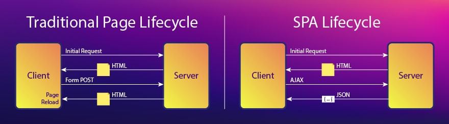

# 8회차

# 4장(~4.2)

## 서버 사이드 렌더링이란?

서버 사이드 렌더링(SSR)은 싱글 페이지 애플리케이션(SPA)보다 번거로움.  
근데 왜 써야 할까? 알아보자.

### 싱글 페이지 애플리케이션



**SPA(Single Page Application)**  
최초 렌더링 때, 서버로부터 최소한의 데이터를 불러온다.  
그 후 클라이언트가 JS 리소스와 브라우저API를 기반으로 작동함.

- 최초 로딩 느려터짐 , 페이지 전환은 매우 빠름
- 로직을 클라이언트에서 처리하므로 서버 부하가 작음.
- 페이지 하나라 SEO에 불리함.

**MPA(Multi Page Application)**
페이지 전환할 때마다 새로운 데이터를 받아서 렌더링함

- SPA보다 최초 로딩 쪼끔? 빠를듯.
- 각 페이지가 독립적이므로 클라이언트 측 관리가 쉬움.
- 서버에서 데이터 항상 불러와야되서 부하가 큼.
- 페이지 마다 개별적으로 URL을 가져서 SEO에 유리함.

#### 싱글 페이지 렌더링 방식의 유행과 JAM 스택의 등장

PHP, JSP를 기반으로 웹이 만들어졌을 때는 서버 사이드 렌더링이 이뤄짐.  
=> 페이지 방식은 MPA, 작업 처리 방식은 SSR  
초기 페이지와 페이지 전환 시 모두 서버에서 HTML을 내려받는 구조. (JS는 보조수단)

JS의 중요성이 커짐에 따라 JS 모듈화를 위해 **CommonJS**, **AMD** 등장.

- **CommonJS**: 서버, node.js에서 사용. 동기적으로 모듈을 불러옴.
- **AMD**: 클라이언트에서 사용. 비동기적으로 모듈을 불러옴.

Backbone.js와 AngularJS, Knockout.js 등이 등장. JS가 MVx 프레임워크를 구현.  
=> JS도 서버에서만 처리 가능한 작업을 할 수 있게됨.

SPA, 즉 CSR이 대세가 되고, JAM 스택이 탄생함. (그 전에는 LAMP 스택 사용)

❓: SPA랑 CSR은 다른개념 아닌감?  
SPA는 페이지 개수, CSR은 렌더링 처리 방식.

- **LAMP**

  - **Linux, Apache, MySQL, PHP/Perl/Python**으로 구성됨.
  - HTTP 요청을 처리하고 웹 페이지를 제공
  - MySQL 데이터베이스를 이용하여 데이터를 저장하고 관리
  - 서버 측 스크립팅 언어를 사용.  
    => 동적이고, 데이터와 상호작용하기 좋음.

- **JAM**

  - **JS, APIs, Markup**으로 구성됨.
  - JS와 HTML, CSS를 빌드하고, 정적으로 사용자에게 제공  
    => 사용자 클라이언트에서 실행. 서버 확장성 문제에서 자유로워짐.

#### 새로운 패러다임의 웹서비스를 향한 요구

모두의 안일함으로 JS코드의 규모가 매우엄청 빠르게 커지기 시작함.  
하지만 인터넷, 하드웨어 성능은 그냥 빠르게 발전함.  
=> 웹사이트 로딩 속도가 현저히 느려짐.

웹사이트 방문자들은 참을성이 없어서 개선해야함.  
=> CSR에서 SSR로 갈아타자.

### SSR이란?

기존에 쓰던 CSR은 클라이언트에서 작업을 처리하기 때문에 사용자 기기 성능이 중요했음.  
하지만 SSR은 서버에서 작업을 처리하기 때문에 안정적임.

#### SSR 장점

CSR과 비교해 뭐가더 나은지 알아보자.

- 최초 페이지 진입이 빠름.

  - 서버에서 HTTP 요청을 수행하는게 더 빠름.
  - HTML을 마크업 하는 작업속도도 더 빠름.
  - 서버가 구리거나, 리소스 확보가 어려우면 CSR보다 느려질 수 있다.

- SEO 좋음.

  - 검색엔진 로봇이 서버에서 가공된 HTML 정보(OG, meta tag)를 수집함.  
    => JS 실행안해도됨. CSR은 JS로 가공 해줘야함.

- 누적 레이아웃 이동이 적다.  
  **누적 레이아웃:** 렌더링 이후 HTML 정보가 추가, 삭제로 인해 페이지가 변경되서 유저 불쾌하게 만드는 것. (화면 덜컹)

  - SSR은 완성된 페이지를 서버에서 제공해줘서 괜찮음.
  - useEffect의 컴포넌트가 마운트된 이 후에 실행되거나  
    API 속도가 다를 경우 최초 페이지 렌더링이 느릴 수 있음.

- 사용자의 디바이스 성능에 자유롭다.

  - 서버에서 처리하므로 사용자 디바이스 성능에 의존안함.
  - 인터넷이 느리거나 사용자 방문이 폭증하면 SSR도 느려짐.

- 보안에 좀 더 안전함.
  - API호출, 인증 등 민감한 작업을 서버에서 수행하고 결과만 브라우저에 전달.

#### SSR 단점

SSR한다고 무조건 좋은게 아님.

- 소스코드를 작성할 때 항상 서버를 고려해야됨.

  - 전역 객체(window, sessionStorage)와 관련된 코드가 서버에서 실행되면 에러가 뜨게됨.  
    => 코드가 클라이언트에서만 실행되게 하면 SSR을쓰는 의미가 퇴색된다.

- 적절한 서버가 구축돼 있어야해.

  - 서버가 필요함. 가용량 확보, 복구 전략, 프로세스 매니저 등이 갖춰져야함.

- 서비스 지연에 따른 문제
  - 렌더링 되기 전까지 사용자에게 어떠한 정보도 제공 못함.

### SPA, SSR을 모두 알아야 하는 이유

SSR, SPA 모두 일장일단이 있음. 이것들을 이해해서 단점을 극복해보자.

#### SSR도 만능은 아님.

잘못쓰면 서버와 클라이언트 두 군데를 신경써야해서 안쓰느니만 못함.  
웹페이지의 설계, 목적, 우선순위에 따라 SPA가 더 효율적일 수도 있음.

#### SPA와 SSR

SPA와 SSR 방식의 상황에 따른 일장일단!

- 고점은 SPA가 더 높음. 뭘 어떻게 했길래?

  - 최초 페이지 진입 시 꼭 필요한 정보만 요청함.
  - 코드 분할 로 JS 리소스의 다운로드, 실행 방지.
  - 라우팅 발생 시 변경이 필요한 HTML영역만 교체.
  - 중요도가 떨어지는 리소스는 **게으른 로딩**으로 처리.

- 평균적인 성능은 SSR이 더 좋음. SPA가 뭐가 안좋아서?
  - 일단 SPA는 사용자의 기기에따라 성능이 들쑥날쑥함.
  - 성능 최적화가 안돼있을 가능성이 큼.
  - 페이지 전환 시 렌더링, 리소스 우선순위를 결정하기 어려움.
  - SSR은 다양한 API 기법을통해 라우팅 문제를 해결 가능.

#### 현대의 SSR

LAMP 스택 기반 SSR은 라우팅 발생 시 서버에 의존해야 해서 SPA보다 느림.  
하지만 현대의 SSR은 라우팅 발생 시 서버에서 받은 JS를 이용해서 SPA처럼 동작함.  
=> SPA와 SSR 각각의 장점을 잘 융합시켰음.

서버에서의 렌더링, 클라이언트에서의 렌더링 모두를 이해해서 SPA와 SSR의 장점을 극대화 해보자.

### 정리

SPA와 SSR 모두를 이해하고 필요에 따라 맞는 방법 쓰자.

## SSR을 위한 리액트 API 살펴보기

리액트는 기본적으로 CSR이지만 Node.js와 같은 서버 환경에서 실행할 수 있는 API를 쓸 수 있음.  
react-dom이 서버에서 렌더링하기 위해 주는 메서드들을 알아보자.

### renderToString

인수로 넘겨받은 컴포넌트를 렌더링해 HTML 문자열로 반환하는 함수.  
SSR에서 최초의 페이지를 HTML로 먼저 렌더링 하게해줌.

```JS
function Component() {
  useEffect(() => {
    console.log('hi')
  })

  function handleClick() {
    console.log('his')
  }

  return (
    <>
      <div>hello</div>
      <button onClick={handleClick}>+</button>
    </>
  )
}

const result = ReactDomServer.renderToString(
  React.createElement('div', { id: 'root'}, <Component />),
)
```

result =

```JS
<div id ="root" data-reactroot="">
  <div>hello</div>
  <button>+</button>
<div>
```

renderToString이 컴포넌트를 HTML로 변환한 모습.

- useEffect, 이벤트 핸들러는 결과물에 포함이 안됨.  
  => 빠르게 브라우저에 HTML을 제공하기 위함. 얘네는 CSR처럼 동작해야돼
- SSR의 이점인 서버에 완성된 HTML을 제공할 수 있음.
  => 초기 렌더링 속도 대폭 상향
- 검색엔진, 메타 정보도 미리 줄 수 있음.
- data-reactroot가 컴포넌트의 루트 엘리먼트를 식별함  
  => JS실행을 위한 hydrate 함수에서 루트를 식별하는 기준점이 됨.

### renderToStaticMarkup

renderToString과 똑같음 몇개 뺴고.

- data-reactroot를 사용하지않음  
  => HTML의 크기를 손톱만큼 줄여줌.  
  => hydrate가 HTML과 인터렉션을 식별못해서 에러뜸. 즉 useEffect, 이벤트 핸들러 못씀.

### renderToNodeStream

renderToString과 비슷함.

- 브라우저에서 만들순 있지만, 사용하는 것이 불가능. Node.js 환경에 의존.
- 결과물이 ReadableStream.(utf-8로 인코딩된 바이트 스트림) 서버 환경에서만 쓸 수 있음.  
  => string 얻을려면 추가 처리 필요.
- 데이터가 거대한 경우, **스트림**으로 처리. 데이터가 크면 서버에 부담이됨.  
  **스트림**: 데이터를 청크 단위로 분할해 조금씩 가져옴. ex) 동영상
- 리액트 SSR 프레임워크는 모두 이 친구 쓴다.

### renderToStaticNodeStream

renderToNodeStream과 똑같고 data-reactroot를 쓰지 않는다.  
=> HTML만 렌더링하고 싶은면 쓰면된다.

### Hydrate

renderToString 등으로 생성된 HTML 콘텐츠에 JS 핸들러나 이벤트를 붙이는 역할.

비슷한 친구 render를 알아보자.

```JS
const rootElement = document.getElementById('root')

ReactDOM.render(<App />, rootElement)
```

컴포넌트와 HTML의 요소를 인수로 받고, 이것들을 HTML에 렌더링한다.  
그리고 클라이언트에서만 실행되는 렌더링, 이벤트 핸들러 추가 등의 모든 작업을 수행함.

Hydrate

```JS
// containerID는 서버에서 렌더링된 HTML의 위치.
const element = document.getElementById(containerId)
// element 기준으로 이벤트 핸들러 추가
ReactDOM.hydrate(<App />, element)
```

차이는 렌더링된 HTML을 기준으로 이벤트를 추가함.  
너무 어려운데요??

### 정리

- 서버의 복잡함을 맛봤다면 프레임워크의 소중함을 알게된다.
- SSR은 매우 어렵다. 서버는 HTML, 번들링된 JS 소스 제공, 캐시 사용 등 고려할게 많다.
- 니가 잘 공부했다면 Next.js는 쉽게 이해할거다.

#### 어려운거

- Hydrate 너무 어려워요..

#### 알게된거

- Hydrate의 역할을 조금이나마 알게됐습니다.
- SSR과 SPA 각각의 원리를 자세히 배웠습니다.
- 게으른 로딩이라는 개념을 습득했고, 이미지와 컴포넌트 종류로 나뉘고  
  컴포넌트에서도 Next.js와 react방식의 장단점을 알게되었습니다.
