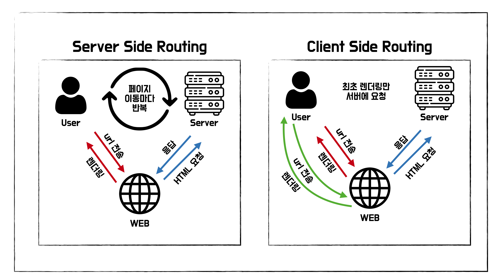

# 8회차(~4.2)

# 4장

## 서버 사이드 렌더링이란?

서버 사이드 렌더링(SSR)은 싱글 페이지 애플리케이션(SPA)보다 번거로움.  
근데 왜 써야 할까? 알아보자.

### 싱글 페이지 애플리케이션


**SPA(Single Page Application)**  
최초 렌더링 때, 서버로부터 최소한의 데이터를 불러온다.  
그 후 클라이언트가 JS 리소스와 브라우저API를 기반으로 작동함.

- 최초 로딩 느려터짐 , 페이지 전환은 매우 빠름
- 로직을 클라이언트에서 처리하므로 서버 부하가 작음.
- 페이지 하나라 SEO에 불리함.

**MPA(Multi Page Application)**
페이지 전환할 때마다 새로운 데이터를 받아서 렌더링함

- SPA보다 최초 로딩 쪼끔? 빠를듯.
- 각 페이지가 독립적이므로 클라이언트 측 관리가 쉬움.
- 서버에서 데이터 항상 불러와야되서 부하가 큼.
- 페이지 마다 개별적으로 URL을 가져서 SEO에 유리함.

#### 싱글 페이지 렌더링 방식의 유행과 JAM 스택의 등장

PHP, JSP를 기반으로 웹이 만들어졌을 때는 서버 사이드 렌더링이 이뤄짐.  
=> 페이지 방식은 MPA, 작업 처리 방식은 SSR  
초기 페이지와 페이지 전환 시 모두 서버에서 HTML을 내려받는 구조. (JS는 보조수단)

JS의 중요성이 커짐에 따라 JS 모듈화를 위해 **CommonJS**, **AMD** 등장.

- **CommonJS**: 서버, node.js에서 사용. 동기적으로 모듈을 불러옴.
- **AMD**: 클라이언트에서 사용. 비동기적으로 모듈을 불러옴.

Backbone.js와 AngularJS, Knockout.js 등이 등장. JS가 MVx 프레임워크를 구현.  
=> JS도 서버에서만 처리 가능한 작업을 할 수 있게됨.

SPA, 즉 CSR이 대세가 되고, JAM 스택이 탄생함. (그 전에는 LAMP 스택 사용)

❓: SPA랑 CSR은 다른개념 아닌감?  
SPA는 페이지 개수, CSR은 렌더링 처리 방식.

- **LAMP**

  - **Linux, Apache, MySQL, PHP/Perl/Python**으로 구성됨.
  - HTTP 요청을 처리하고 웹 페이지를 제공
  - MySQL 데이터베이스를 이용하여 데이터를 저장하고 관리
  - 서버 측 스크립팅 언어를 사용.  
    => 동적이고, 데이터와 상호작용하기 좋음.

- **JAM**

  - **JS, APIs, Markup**으로 구성됨.
  - JS와 HTML, CSS를 빌드하고, 정적으로 사용자에게 제공  
    => 사용자 클라이언트에서 실행. 서버 확장성 문제에서 자유로워짐.

#### 새로운 패러다임의 웹서비스를 향한 요구

모두의 안일함으로 JS코드의 규모가 매우엄청 빠르게 커지기 시작함.  
하지만 인터넷, 하드웨어 성능은 그냥 빠르게 발전함.  
=> 웹사이트 로딩 속도가 현저히 느려짐.

웹사이트 방문자들은 참을성이 없어서 개선해야함.  
=> CSR에서 SSR로 갈아타자.

### SSR이란?

기존에 쓰던 CSR은 클라이언트에서 작업을 처리하기 때문에 사용자 기기 성능이 중요했음.  
하지만 SSR은 서버에서 작업을 처리하기 때문에 안정적임.

#### SSR 장점

CSR과 비교해 뭐가더 나은지 알아보자.

- 최초 페이지 진입이 빠름.

  - 서버에서 HTTP 요청을 수행하는게 더 빠름.
  - HTML을 마크업 하는 작업속도도 더 빠름.
  - 서버가 구리거나, 리소스 확보가 어려우면 CSR보다 느려질 수 있다.

- SEO 좋음.

  - 검색엔진 로봇이 서버에서 가공된 HTML 정보(OG, meta tag)를 수집함.  
    => JS 실행안해도됨. CSR은 JS로 가공 해줘야함.

- 누적 레이아웃 이동이 적다.  
  **누적 레이아웃:** 렌더링 이후 HTML 정보가 추가, 삭제로 인해 페이지가 변경되서 유저 불쾌하게 만드는 것. (화면 덜컹)

  - SSR은 완성된 페이지를 서버에서 제공해줘서 괜찮음.
  - useEffect의 컴포넌트가 마운트된 이 후에 실행되거나  
    API 속도가 다를 경우 최초 페이지 렌더링이 느릴 수 있음.

- 사용자의 디바이스 성능에 자유롭다.

  - 서버에서 처리하므로 사용자 디바이스 성능에 의존안함.
  - 인터넷이 느리거나 사용자 방문이 폭증하면 SSR도 느려짐.

- 보안에 좀 더 안전함.
  - API호출, 인증 등 민감한 작업을 서버에서 수행하고 결과만 브라우저에 전달.

#### SSR 단점

SSR한다고 무조건 좋은게 아님.

- 소스코드를 작성할 때 항상 서버를 고려해야됨.

  - 전역 객체(window, sessionStorage)와 관련된 코드가 서버에서 실행되면 에러가 뜨게됨.  
    => 코드가 클라이언트에서만 실행되게 하면 SSR을쓰는 의미가 퇴색된다.

- 적절한 서버가 구축돼 있어야해.

  - 서버가 필요함. 가용량 확보, 복구 전략, 프로세스 매니저 등이 갖춰져야함.

- 서비스 지연에 따른 문제
  - 렌더링 되기 전까지 사용자에게 어떠한 정보도 제공 못함.

### SPA, SSR을 모두 알아야 하는 이유

SSR, SPA 모두 일장일단이 있음. 이것들을 이해해서 단점을 극복해보자.

#### SSR도 만능은 아님.

잘못쓰면 서버와 클라이언트 두 군데를 신경써야해서 안쓰느니만 못함.  
웹페이지의 설계, 목적, 우선순위에 따라 SPA가 더 효율적일 수도 있음.

#### SPA와 SSR

SPA와 SSR 방식의 상황에 따른 일장일단!

- 고점은 SPA가 더 높음. 뭘 어떻게 했길래?

  - 최초 페이지 진입 시 꼭 필요한 정보만 요청함.
  - 코드 분할 로 JS 리소스의 다운로드, 실행 방지.
  - 라우팅 발생 시 변경이 필요한 HTML영역만 교체.
  - 중요도가 떨어지는 리소스는 **게으른 로딩**으로 처리.

- 평균적인 성능은 SSR이 더 좋음. SPA가 뭐가 안좋아서?
  - 일단 SPA는 사용자의 기기에따라 성능이 들쑥날쑥함.
  - 성능 최적화가 안돼있을 가능성이 큼.
  - 페이지 전환 시 렌더링, 리소스 우선순위를 결정하기 어려움.
  - SSR은 다양한 API 기법을통해 라우팅 문제를 해결 가능.

#### 현대의 SSR

LAMP 스택 기반 SSR은 라우팅 발생 시 서버에 의존해야 해서 SPA보다 느림.  
하지만 현대의 SSR은 라우팅 발생 시 서버에서 받은 JS를 이용해서 SPA처럼 동작함.  
=> SPA와 SSR 각각의 장점을 잘 융합시켰음.

서버에서의 렌더링, 클라이언트에서의 렌더링 모두를 이해해서 SPA와 SSR의 장점을 극대화 해보자.

### 정리

SPA와 SSR 모두를 이해하고 필요에 따라 맞는 방법 쓰자.

## SSR을 위한 리액트 API 살펴보기

리액트는 기본적으로 CSR이지만 Node.js와 같은 서버 환경에서 실행할 수 있는 API를 쓸 수 있음.  
react-dom이 서버에서 렌더링하기 위해 주는 메서드들을 알아보자.

### renderToString

인수로 넘겨받은 컴포넌트를 렌더링해 HTML 문자열로 반환하는 함수.  
SSR에서 최초의 페이지를 HTML로 먼저 렌더링 하게해줌.

```JS
function Component() {
  useEffect(() => {
    console.log('hi')
  })

  function handleClick() {
    console.log('his')
  }

  return (
    <>
      <div>hello</div>
      <button onClick={handleClick}>+</button>
    </>
  )
}

const result = ReactDomServer.renderToString(
  React.createElement('div', { id: 'root'}, <Component />),
)
```

result =

```JS
<div id ="root" data-reactroot="">
  <div>hello</div>
  <button>+</button>
<div>
```

renderToString이 컴포넌트를 HTML로 변환한 모습.

- useEffect, 이벤트 핸들러는 결과물에 포함이 안됨.  
  => 빠르게 브라우저에 HTML을 제공하기 위함. 얘네는 CSR처럼 동작해야돼
- SSR의 이점인 서버에 완성된 HTML을 제공할 수 있음.
  => 초기 렌더링 속도 대폭 상향
- 검색엔진, 메타 정보도 미리 줄 수 있음.
- data-reactroot가 컴포넌트의 루트 엘리먼트를 식별함  
  => JS실행을 위한 hydrate 함수에서 루트를 식별하는 기준점이 됨.

### renderToStaticMarkup

renderToString과 똑같음 몇개 뺴고.

- data-reactroot를 사용하지않음  
  => HTML의 크기를 손톱만큼 줄여줌.  
  => hydrate가 HTML과 인터렉션을 식별못해서 에러뜸. 즉 useEffect, 이벤트 핸들러 못씀.

### renderToNodeStream

renderToString과 비슷함.

- 브라우저에서 만들순 있지만, 사용하는 것이 불가능. Node.js 환경에 의존.
- 결과물이 ReadableStream.(utf-8로 인코딩된 바이트 스트림) 서버 환경에서만 쓸 수 있음.  
  => string 얻을려면 추가 처리 필요.
- 데이터가 거대한 경우, **스트림**으로 처리. 데이터가 크면 서버에 부담이됨.  
  **스트림**: 데이터를 청크 단위로 분할해 조금씩 가져옴. ex) 동영상
- 리액트 SSR 프레임워크는 모두 이 친구 쓴다.

### renderToStaticNodeStream

renderToNodeStream과 똑같고 data-reactroot를 쓰지 않는다.  
=> HTML만 렌더링하고 싶은면 쓰면된다.

### Hydrate

renderToString 등으로 생성된 HTML 콘텐츠에 JS 핸들러나 이벤트를 붙이는 역할.

비슷한 친구 render를 알아보자.

```JS
const rootElement = document.getElementById('root')

ReactDOM.render(<App />, rootElement)
```

컴포넌트와 HTML의 요소를 인수로 받고, 이것들을 HTML에 렌더링한다.  
그리고 클라이언트에서만 실행되는 렌더링, 이벤트 핸들러 추가 등의 모든 작업을 수행함.

Hydrate

```JS
// containerID는 서버에서 렌더링된 HTML의 위치.
const element = document.getElementById(containerId)
// element 기준으로 이벤트 핸들러 추가
ReactDOM.hydrate(<App />, element)
```

차이는 렌더링된 HTML을 기준으로 이벤트를 추가함.  
너무 어려운데요??

### 정리

- 서버의 복잡함을 맛봤다면 프레임워크의 소중함을 알게된다.
- SSR은 매우 어렵다. 서버는 HTML, 번들링된 JS 소스 제공, 캐시 사용 등 고려할게 많다.
- 니가 잘 공부했다면 Next.js는 쉽게 이해할거다.

#### 어려운거

- Hydrate 너무 어려워요..

#### 알게된거

- Hydrate의 역할을 조금이나마 알게됐습니다.
- SSR과 SPA 각각의 원리를 자세히 배웠습니다.
- 게으른 로딩이라는 개념을 습득했고, 이미지와 컴포넌트 종류로 나뉘고  
  컴포넌트에서도 Next.js와 react방식의 장단점을 알게되었습니다.

# 9회차(4.3)

## Next.js 톺아보기

아무것도 없는 상태에서 ssr까지 지원하는 리액트는 만들기 힘듬  
=> 그래서 나온게 Next.js 프레임워크. 얘를 알아보자.

### Next.js란?

리액트 기반 SSR을 위해 react-page를 만듬.  
Next.js는 react-page의 구조인 실제 디렉터리 구조가 URL로 변환되는 것을 가져옴.

Next 써야되는 이유

- 리액트 팀이 만든 것을 기반으로 한거라 리액트 기반 프로젝트에서 쓰기 좋음.
- 사용자가 많고, Vercel의 전폭적인 지원을 받음
- 꾸준히 새로운 기능을 추가해서 릴리스함.

### Next.js 시작하기

create-next-app을 통해 빠르게 생성할 수 있음.

```
npx create-next-app@latest --ts
```

#### package.json

프로젝트를 살펴볼 때는 이거를 먼저 봐야함.  
명령어, 의존성을 보고 프로젝트 구조를 판단할 수 있음.

```json
{
  "name": "min-do-list",
  "version": "0.1.0",
  "scripts": {
    "dev": "next dev" // 명령어. "next dev"로 개발서버 실행.
  },
  "dependencies": {
    "next": "12.2.5" // 의존성 패키지.
  },
  "devDependencies": {
    "eslint" // 개발 중에 사용되는 의존성 패키지.
  }
}
```

#### next.config.js

환경설정을 담당함.

```js
/** @type {import('next').NextConfig} js 파일에 ts 타입 도움을 받기 위해 씀.*/

const nextConfig = {
  reactStrictMode: true, // 엄격 모드. 켜두는게 개발자에게 좋다.
  swcMinify: true, // 매우 빠른 언어인 러스트를 쓰고, 병렬로 작업처리를 하게해서 번들링, 컴파일이 빨라짐.

  redirects: async () => {
    // 특정 경로로 접근하면 다른 경로로 리디렉션함
    return [
      {
        source: "/old-path", // 전
        destination: "/new-path", // 흐
        permanent: true, // 영구 리디렉션 여부 (301 상태 코드)
      },
    ];
  },

  poweredByHeader: false, // "X-Powered-By: Next.js" 헤더를 제거하여 보안을 강화함

  basePath: "/base", // 애플리케이션의 기본 경로를 설정. 모든 경로 앞에 "/base"가 추가됨
};

module.exports = nextConfig;
```

#### pages/app.tsx

pages 폴더는 어디에 있든 잘 작동함.

app.tsx는 페이지의 시작점. 최초에는 SSR, 이후에는 CSR로 렌더링됨.

- 에러 바운더리로 전역에서 발생하는 에러 처리할 수 있음.
- 전역 CSS 선언
- 모든 페이지에 데이터 제공

#### pages/document.tsx

HTML 설정과 관련된 코드를 추가해주는 곳. SSR만됨.

- `<html>`, `<body>`에 돔속성을 추가할 수 있음.
- SSR만 되서 이벤트 핸들러 사용 못함. => hydrate가 작동하지 않음.
- next/document에서 import한 `<head>`에서 SEO 정보를 담을 수 있음.
- 서버에서 데이터 불러오게 해주는 함수는 못씀.
- CCS-in-JS 스타일을 서버에서 모아 HTML로 전달 가능.

#### pages/error.tsx

서버의 500에러, 클라이언트 에러를 처리해줌.
개발 모드에서는 불가능하고, 프로덕션으로 빌드해야 확인 가능.

```JS
function Error({ statusCode }) {
  return (
    <p?>{statusCode ? `서버에서 ${statusCode}` : '클라이언트에서'} 에러 발생 </p>
  )
}
// getInitialProps는 SSR에서 호출되어 초기 데이터를 가져옴
Error.getInitialProps = ({ res, err }) => {
  const statusCode = res? res.statusCode : err ? err.statusCode : ''
  return status { statusCode }
}

export default Error
```

자매품으로 **404.tsx**와 **500.tsx**가 있다.

#### pages/index.tsx

자유롭게 명칭을 지정할 수 있음. 즉, 페이지의 이름을 자유롭게 가능.

- /pages/hello/[id]

  - []에 모든 주소가 들어갈 수 있음. => id.tsx로 설정됨.
  - id라는 변수에 접속한 주소명에 오게됨  
    => 원래있던 id.tsx가 우선순위가 더 높음.

- /pages/hi/[...props]

  - 모든 하위 주소를 처리해줌.
  - 하위 주소들은 배열로 들어감.

    ````js
    import { useRouter } from "next/router";

        const Hi = () => {
          const router = useRouter();
          const { props = [] } = router.query; // props 배열을 가져옴

          return (
            <div>
              <h1>Hi</h1>
              <p>Props: {props.join(", ")}</p>
            </div>
          );
        };

        export default Hi;
        ```
    ````

#### 서버 라우팅과 클라이언트 라우팅의 차이


Next.js는 SSR, CSR 모두 수행함.
최초 페이지는 ssr로 렌더링됨. 증명해보자.

```js
export default function Hi() {
  console.log(typeof window === "undefined" ? "서버" : "클라이언트"); // 서버 뜸.

  return (
    <div>
      <a href="/a"> a로 이동! </a>
      <Link href="/link"> link로 이동~ </Link>
    </div>;
  )
}

export const getServerSideProps = () { // <= ssr 렌더링 유무를 결정하는 녀석. 있으면 CSR 없으면
  return {                             // 빌드 시점에 트리쉐이킹(무쓸모 코드 제거하는 방식)
    props: {},
  }
}
```

`<a>`: 모든 리소스를 처음부터 다시 받음.  
`<Link>`: hello 페이지 이동에 필요한 것만 받음.

즉, next.link로 이동하면 CSR로 동작한다.  
=> next.js는 SSR,CSR 각각의 장점인 빠른 최초 페이지, 빠른 라우팅을 제공함.

갈아타자  
`<a>` => `<Link>`  
`window.location.push` => `router.push`

#### /pages/api/hello.ts

hello.ts가 tsx인 것처럼 /api/hello로 호출됨.
대신, HTML요청이 아니라 서버 요청을 함.

- window, document 등 브라우저에서만 접근하는 코드는 문제 발생.
- 서버 데이터로 BFB 형태로 활용 가능.
- 풀스택 APP구축 가능.
- **CORS** 우회할 때 씀.
  - **CORS**: 웹과 서버 간의 보안. 출처가 서로 다른 웹과 리소스의 접근을 제어함  
     => API 호출, 다른 도메인의 리소르를 요청할 때 발생 가능.

```JS
export default function handler(req, res) {
  res.status(200).json({ name: 'John Doe' })
}
```

### Data Fetching

SSR로 페이지를 렌더링하는 전략이 몇 개 있다고함. 이를 Data Fetching이라 부름.

- pages/의 라우팅 되는 tsx파일만 사용 가능.
- import안하더라도 함수명 앞에 export를 붙여야함.
- 서버에서 미리 페이지를 만들어서 제공 가능.

Fetching 해주는 함수를 알아보자.

#### getStaticPaths, getStaticProps

이 둘은 반드시 같이 써야함.  
사용자와 상관없이 정적인 페이지를 보여줄 때 씀.

```JS
export const getStaticPaths = async () => {
  return {
    paths: [{ params: { id: '1' } }, { params: { id: '2'}}],
    fallback: false,
  }
}

export const getStaticProps = async ({ params }) => {
  const { id } = params

  const post = await fetchPost(id)

  return {
    props: { post },
  }
}

export default function Post({ post }: { post }) {} // getStaticProps가 던져준거 렌더링함.
```

**getStaticPaths**

- 접근 가능한 주소를 정의.  
  => params에 값을 배열로 주면 이 페이지가 접근 가능한 페이지를 정의함.

**getStaticProps**

- 정의한 페이지로 요청오면 props 반환해줌.  
  => post함수가 정적으로 HTML페이지 만듬.

**fallback:**

- true: 정의된 페이지가 빌드되지 않았으면, fallback컴포넌트 보여주고(정적으로) 완료되면 해당 페이지 보여줌.
- false: 정의된 페이지 아니면 404페이지 보여줌.
- 'block': 빌드 완료될 때까지 암것도 안보여줌. 완료되면 SSR로 렌더링함

#### getServerSideProps

얘가 존재하면 무조건 페이지 진입 전에 실행함.

- 응답값에 따라 props를 반환, 리다이렉트
- 서버에서 실행해야 하는 페이지로 분류해버림.  
  => Next.js가 빌드 시에도 서버용 JS 파일을 별도로 만듬.

```JS
export default function Post ({ post }) {
  return <p>post<p>
}

export const getServerSideProps = async (context) => {
  const {
    query: { id = ''}, // /Post/[id]의 id에 접근 가능.
  } = context
  const post = await fetchPost(id.toString())

  if (!post) { // post 없으면 404로 보내버림, 리다이렉트보다 훨씬 좋으니까 쓰자.
    redirect: {
      destination: '/404'
    }
  }
  return {
    props
  }
}
```

getServerSideProps는 서버에서만 실행되서 제약이 많음

- window, document 등 브라우저 전용 객체에는 못 접근함.
- API 호출 시 protocol, domain 없이 fetch 요청 불가능. 서버는 자신의 호스트를 유추 못함;
- SSR은 루트에서부터 시작하므로, 클라이언트에서만 실행 되는 변수, 라이브러리는 못씀.
- 사용자가 페이지를 호출할 때마다 실행됨. 실행이 끝나기 전까지는 렌더링안됨.  
  => 함수가 최대한 짧게 기능하도록 만들자

#### getInitialProps

getStaticProps, getServerSideProps가 등장 후 자리가 없어진 친구..  
과거에 작성된 Next.js 코드에서는 얘만 존재하고, 데이터를 불러와준다.  
그냥 보내주자.

```JS
export default class Todo extends React.Component {
  static async getInitialProps() {
    const {
      query: { id = '' },
    } = ctx
    const response = await fetch(
      `https://todos/${id}`
    )
    const result = await response.json()
    console.log('오쓰!')
    return { todo: result }
  }

   render() {
    const { todo } = this.props;

    return (
      <div>
        <h1>{todo.title}</h1>
        <p>{todo.description}</p>
      </div>
    );
  }
}
```

- 라우팅에따라 서버, 클라이언트 모두에서 실행 가능하다.
- app.tsx, error.tsx 같은 곳에서 쓰기좋음.

### 스타일 적용하기

Next.js에서 다양한 방식의 스타일을 지원한다는데 어떨까?

- 전역 스타일

  - app.tsx에서 import 해주면 앱전체에 영향을 줄 수 있음.

- 컴포넌트 레벨 CSS

  - [name].module.css로 클래스명 안겹치게 하고 쓸 수 있음.

- SCSS, SASS

  - npm install --save-dev sass 해주면 바로 쓸 수 있음.
  - `$primary: black` 변수처럼 쓸수 있음.

- CSS-in-JS
  - css를 js로 작성할 수 있음.
  - js를 css로 변환하는 과정에서 번들링 크기에따른 속도 이슈가 존재함.

### app.tsx 응용하기

```JS
MyApp.getInitialProps = async (context) => {
  const appProps = await App.getInitialProps(context)
  const isServer = Boolean(context.ctx.req)
  console.log(`[${isServer ? '서버' : '클라이언트'}에서 ${context.ctx?.req?.url}를 요청함]`)
  return appProps
}
```

`<Link/>`, router를 이용해서 getInitialProps를 쓴 a페이지와  
getServerSideProps를 쓴 b페이지를 왕복해보자.

1. 먼저 a페이지 방문 => SSR 작동해야되서 페이지 전체를 요청
2. b페이지를 `<Link/>`로 방문.  
   => 클라이언트 라우팅 수행해야해서 getServer...의 SSR 무시하고 결과를 json파일만을 요청해서 가져옴
3. a페이지를 `<Link/>`로 방문 => undefined를 요청
4. b페이지를 `<Link/>`로 방문 => json 파일만을 가져옴.

이거 이용해서 최초에 접근했을 때의 렌더링만 구현간능.

```JS
MyApp.getInitialProps = async (context) => {
  const appProps = await App.getInitialProps(context)
  const {
    ctx: { req },
    router: { pathname },
  } = context

  if (
    req && // req 객체가 존재하는지 확인 (SSR에서만 실행됨을 의미)
    !req.url?.startsWith('/_next') && // 요청 URL이 '/_next'로 시작하지 않는지 검사!
    !['/500', '/404', '/_error/'].includes(pathname) // 요청 경로 확인!
  ) {
    doIt()
  }

  return appProps
}
```

### next.config.js 살펴보기

앞에 예제에서 설명했어요.. 모르고..

### 정리

- next/image는 이미지 최적화해준다.
- next/script는 서도파티 스크립트를 최적화해서 불러준다.
- next.js는 우상향이니까 믿고 배워라

### 어려운거

- getInitialProps 이친구 잊혀졌는데, class컴포넌트로 설명해서 이해하기 힘들었다.

### 새로안거

- getServerSideProps에서 if문을 이용해서 리다이렉트보다  
  훨씬 간편하고 성능좋게 처리해줄 수 있는 부분이 인상깊었다.
