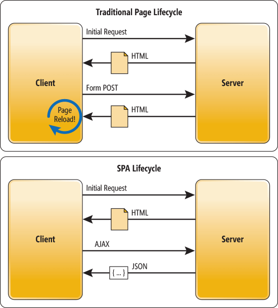
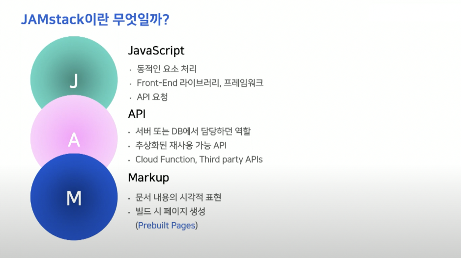

# 4장 서버 사이드 렌더링

## 4.1 서버 사이드 렌더링이란 ?

### 4.1.1 싱글 페이지 애플리케이션의 세상

서버 사이드 렌더링 애플리케이션의 반대 개념인 싱글 페이지 애플리케이션

✏️ 싱글 페이지 애플리케이션이란 ?

- SPA, Single Page Application의 약자
- 렌더링, 라우팅에 필요한 대부분의 기능을 브라우저의 자바스크립트에 의존하는 방식
- 최초 첫 페이지 이후 페이지 전환을 위한 작업이 브라우저, 자바스크립트를 통해 이뤄짐
- 첫 페이지 불러온 이후 서버에서 HTML을 받지 않고 하나의 페이지에서 모든 작업 처리
- SPA의 HTML 을 보면 `body` 내부에 내용 X
  - 렌더링에 필요한 `body` 내부의 내용을 자바스크립트 코드로 삽입한 이후 렌더링하기 때문
  - 페이지 전환도 새로운 HTML 페이지가 아니라 자바스크립트에서 렌더링에 필요한 정보를 가져와 `body` 내부 내용을 변경하는 식
- 최초에 서버에서 최소한의 데이터를 불러온 이후 **이미 가지고 있는 JS 리소스와 브라우저 API를 기반으로 작동**
- 최초 로딩해야 할 JS 리소스가 크지만, 최초 렌더링 이후 서버를 거쳐 필요한 리소스를 받는 것이 아닌 가지고 있는 자바스크립트를 통해 데이터를 가져오기 떄문에 최초 렌더링 이후 페이지 전환 속도가 빠름

✏️ 전통적인 방식의 애플리케이션과 싱글 페이지 애플리케이션의 작동 비교

전통적인 방식(MPA)

- 서버 사이드에서 작동
- 페이지 전환 시 새롭게 페이지를 요청하고 HTML 을 다운받아 파싱
- 모든 페이지들이 html로 구성되어 있는 것
- 페이지 전환 시 화면 깜빡임

SPA

- 최초 렌더링 시 필요한 모든 자바스크립트 리소스를 받음
- 자바스크립을 통해 페이지 전환
- 페이지 전체를 다시 그리는 것이 아닌 페이지 전환에 필요한 일부 영역만 변경
- 매끄러운 화면 전환

✏️ 싱글 페이지 렌더링 방식의 유행과 JAM 스택의 등장

- 이전에는 서버에서 완성된 HTML 을 주기 때문에, JS는 보조적인 역할만 함
- 점차 사용자의 인터렉션이 증가하는 웹 서비스들이 많아지며 프론트의 역할과 비중이 커짐
- LAMP(운영체제 + 서버 + DB + 웹 프레임워크)스택은 서버 의존적
  - 웹 애플리케이션 확장의 어려움
  - 사용자가 늘어나면 서버도 확장해야 하는데 그 당시 서버 확장이 번거로웠음
- JAM(JavaScript + API + Markup) 스택
  - JS, HTML, CSS를 미리 빌드해 두고 정적으로 사용자에게 제공하면 이후 작동은 클라이언트에서 실행되기 때문에 서버 확장 용이

✏️ 새로운 패러다임의 웹 서비스를 향한 요구

- 웹페이지를 불러오는 데 필요한 부담을 사용자에게 전가하더라도 그만큼 인터넷 환경이 발전했음 ( 사용자 기기, 인터넷 환경이 많이 개선됨)
- But 실제로 웹페이지 로딩 시간은 과거보다 더 늘어나거나 비슷함
- 자바스크립트 파싱을 위한 CPU 소비 시간 증가
- 과거 웹 서비스는 단순 정보 제공, 오늘날 웹 서비스는 사용자와의 다양한 인터렉션이 이루어짐
  - 그만큼 JS에서 처리해야 하는 코드의 절대적인 양도 증가

### 4.1.2 서버 사이드 렌더링이란?

- SPA : 하나의 페이지에서 렌더링
  - but 최초 렌더링 시간이 긺(이후 필요한 리소스들을 한 번에 다운 받아두기 때문)
- SSR : 최초에 보여줄 페이지를 서버에서 렌더링해서 빠르게 사용자에게 화면을 제공
  - 서버에서 받은 페이지를 렌더링했던 전통 방식
- 가장 큰 차이는 웹 페이지 렌더링의 책임을 어디에 둘 것인지 !
  - CSR : 자바스크립트 번들, 사용자 기기의 성능에 영향
  - SSR : 서버, 안정적인 렌더링

✏️ 서버 사이드 렌더링의 장점

✅ 최초 페이지 진입이 비교적 빠르다.

- FCP(First Contentful Paint)가 빠름
- 서버에서 HTML을 미리 그려서 보내줌
- 최초 화면 렌더링이 HTTP 요청에 의존하거나 HTML 파일이 크다면 SSR이 빠름

✅ 검색 엔진과 SNS 공유 등 메타데이터 제공이 쉽다.

- 검색 엔진 프로세스
  - 검색 엔진이 페이지에 진입
  - 페이지가 HTML을 제공해서 로봇이 이 HTML을 다운, JS 코드는 실행 X
  - 다운로드한 HTML 에서 오픈 그래프나 메타 태그를 기반으로 페이지 검색 정보 가져오고, 검색 엔진에 저장
- 검색 엔진은 페이지의 정적인 정보만 가져옴 SPA의 작동이 JS에 의존
- SSR은 최초 렌더링이 서버에서 일어나기 떄문에 검색 엔진에 제공할 정보를 서버에서 가공해 HTML을 보냄

✅ 누적 레이아웃 이동이 적다.

- 누적 레이아웃 이동
  - 사용자에게 페이지를 보여준 이후 정보가 추가,삭제되어 화면이 덜컥 거리는 현상
  - 부정적인 사용자 경험 초래
- SSR은 API 요청이 완료된 완성된 페이지를 제공하기 때문에 해당 문제가 적음

✅ 사용자의 디바이스 성능에 비교적 자유롭다.

- JS 리소스 실행은 사용자의 디바이스에서 실행, 디바이스 성능에 의존적
- SSR은 이러한 부담을 서버와 나눔

✅ 보안에 좀 더 안전하다.

- CSR은 애플리케이션의 모든 활동이 브라우저에 노출
- API 호출, 인증 등 민감한 정보
- SSR은 이런 민감한 작업을 서버에서 수행하고 결과만 브라우저에 제공

✏️ 서버 사이드 렌더링의 단점

✅ 소스코드를 작성할 때 항상 서버를 고려해야 한다.

- 브라우저의 전역 객체인 window, 웹 스토리지 등은 서버에서 실행 X
- 사용이 불가피하면 클라이언트에서 실행되도록 처리해야 함

✅ 적절한 서버가 구축돼 있어야 한다.

- CSR은 HTML, JS, CSS 다운받아 실행
- SSR은 서버에서 실행하기 때문에 렌더링을 수행할 서버 필요
- 서버를 구축하는 일이 복잡

✅ 서비스 지연에 따른 문제

- CSR은 로딩 상태를 안내해서 로딩 중임을 사용자에게 표시할 수 있음
- SSR 최초 렌더링이 지연되는 경우 렌더링이 끝나기 전까지 화면에 표시하는 것이 불가함

### 4.1.3 SPA와 SSR을 모두 알아야 하는 이유

✏️ 서버 사이드 렌더링 역시 만능이 아니다.

- 모든 작업이 서버에서 이뤄지는 것이 역효과를 불러일으킬 수도 있음
- 웹페이지의 설계와 목적, 우선순위에 따라 적절히 처리해야 함

✏️ 싱글 페이지 애플리케이션과 서버 사이드 렌더링 애플리케이션

- SPA : 렌더링과 라우팅에 최적화되어 있지 않으면 사용자 기기에 따라 성능이 다름 , 최적화도 어려운 편
- MPA : 서버가 잘 구축되어 있다면 사용자 기기 성능과 관련 없이 매 요청마다 비슷한 성능의 렌더링 수행
- MPA 라우팅 문제 해결하는 API
  - 페인트 홀딩 : 같은 출처에서 라우팅 일어날 경우 페이지 깜빡임 대신 이전 페이지 모습 잠깐 보여주는 기법
  - back forward : 앞/뒤로가기 실행시 캐시된 페이지 보여주는 기법
  - Shared Element Transitions : 페이지 라우팅이 일어났을 떄 두 페이지에 동일 요소가 있으면 해당 콘텍스트를 유지해 부드럽게 전환되게 하는 기법
- SPA, MPA 모두 각각의 장단점을 가짐. 상황에 따라 적절하게 선택하는 것이 좋을 듯하다.

✏️ 현대의 서버 사이드 렌더링

- 기존 LAMP 스택에서의 SSR
  - 모든 페이지 빌드를 서버에서 렌더링해서 초기 페이지 진입이 빨랐음
  - 라우팅 발생 시 서버에 의존해서 SPA 대비 느림
- 현대 SSR (Next.js)
  - 최초 렌더링은 서버에서 완성된 HTML을 받고
  - 이후 라우칭에서는 서버에서 받은 JS 바탕으로 SPA 처럼 작동
- 이 방식을 이해해야 두 가지 장점을 가진 웹서비스를 구축할 수 있음 !!

## 4.2 서버 사이드 렌더링을 위한 리액트 API 살펴보기

- 리액트 애플리케이션을 서버에서 렌더링할 수 있는 API 제공

### 4.2.1 renderToString

- 리액트 컴포넌트를 렌더링해 HTML 문자열로 반환
- 목적 : 리액트 컴포넌트를 빠르게 브라우저가 렌더링할 수 있는 HTML을 제공 (최초 렌더링)
- 클라이언트에서 실행되는 JS코드는 포함하지 않음. 이후 JS 코드를 다운,파싱, 실행하는 과정을 별도로 거쳐야 함
- 이 메서드를 사용해 완성된 HTML 을 서버에서 제공하여 SSR의 이점을 취할 수 있음
  - 빠른 최초 렌더링 , 검색 엔진 최적화
- #root div 태그에 data-reactroot 속성
  - hydreate 함수에서 루트를 식별하는 기준점

### 4.2.2 renderToStaticMarkup

- renderToString과 유사.
- 차이점 : data-reactroot 처럼 리액트에서만 사용하는 DOM 속셩 만들지 않음
- 속성을 사용하지 않으면 HTML 크기를 아주 약간 줄일 수 있다는 장점
- but 이후 hydrate 수행하지 못함. JS 코드 실행 X
- 리액트의 이벤트 리스너가 필요 없는 순수한 HTML 만들 때 사용

### 4.2.3 renderToNodeStream

- renderToString과 동일한 결과물
- 차이점
  - 브라우저에서 사용 불가
  - renderToString은 결과물이 string, renderToNodeStream은 Node.js의 ReadableStream
- ReadableStream
  - utf-8로 인코딩된 바이트 스트림으로 서버 환경에서만 사용 가능

❓ 이 메서드가 왜 필요할까 ?

- 스트림 : 큰 데이터를 다룰 때 데이터를 청크(chunk, 작은 단위)로 분할해 조금씩 가져오는 방식
- 거대한 HTML 파일을 작은 단위로 쪼개 순차적으로 처리할 수 있음
- 렌더링하는 Node.js 서버의 부담을 줄일 수 있음

### 4.2.4 renderToStaticNodeStream

- renderToNodeStream과 결과물은 동일하지만 리액트 자바스크립트에 필요한 리액트 속성 X
- hydreate가 필요없는 순수 HTML (정적인 페이지)에 활용

### 4.2.5 hydrate

- renderToString, renderToNodeStream 으로 생성된 정적인 HTML에 JS 핸들러나 이벤트를 덧붙이는 작업
- render()
  - 컴포넌트와 HTML 요소를 인수로 받음
  - 컴포넌트 생성과 JS 핸들러나 이벤트 추가 작업까지 한 번에 실행함
- hydrate()
  - 컴포넌트와 HTML 요소를 인수로 받음 (render와 유사)
  - 렌더링된 HTML 에 이벤트를 덧붙이는 것
  - hydrate로 넘겨준 두번째 인수에는 렌더링된 정적인 HTML 정보가 담겨있어야 함
  - render는 빈 HTML에 정보를 렌더링
  - hydrate 수행한 결과물과 인수로 넘겨받은 HTML 비교 작업 수행
  - 불일치하면 렌더링을 서버와 클라이언트에서 두 번 렌더링하는 것
