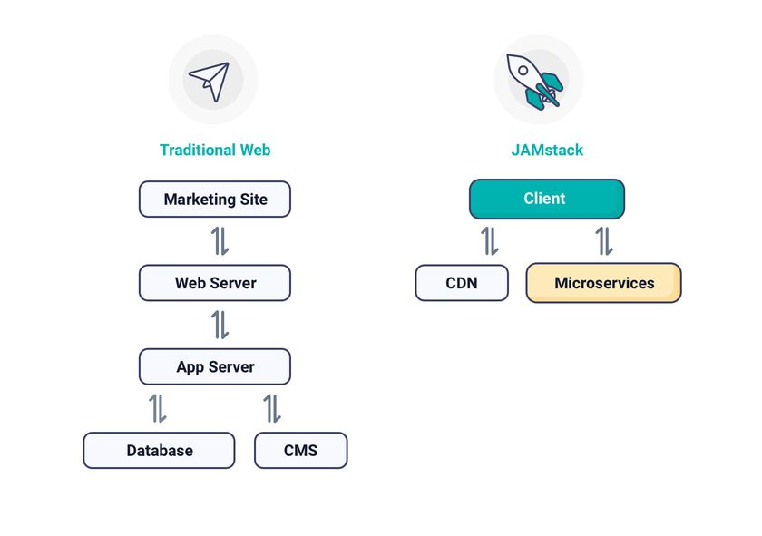

# 4. 서버 사이드 렌더링

### **리액트에서 SSR를 활용해보자**

<br>

## 4.1 서버 사이드 렌더링이란?

### ✨ 서버 사이드 렌더링이 SPA보다 더 복잡할 수 있음에도 불구하고 각광받는 이유는?

<br>

### 4.1.1 싱글 페이지 애플리케이션의 세상

---

### 🔖 싱글 페이지 애플리케이션은 무엇일까

- 렌더링 및 라우팅에 필요한 대부분의 기능을 브라우저의 JS에 의존하는 것

- 하나의 페이지에서 모든 작업을 처리하므로 SPA라고 지칭

  - 바디 태그 내부의 내용을 JS로 삽입 후 렌더링 하므로, 실제 코드상으론 빈 태그만 존재

  - 요청 및 결과를 바탕으로 내부 DOM을 추가, 수정, 삭제하므로 첫 로딩 시에는 느릴 수 있으나, 다음 렌더링부턴 매우 빠르게 동작 가능

<br>

### 🏷️ 전통 방식과 SPA의 비교

- 기존의 방식은 페이지가 전환될 때마다 페이지의 정보가 담긴 HTML 코드를 요청하므로, 페이지를 HTML 단계부터 다시 그려내게 된다.

- 따라서 로딩 표시가 출력되고, 화면이 깜박이는 등 사용자가 페이지가 변화하고 있다는 것을 인지할 수 있다.

- SPA의 경우 모든 리소스를 한번에 다운로드 후, 이를 JS를 통해 전환시켜 페이지의 일부 영역만 그려내므로, 훨씬 깔끔해진다.

<br>

### 🔖 싱글 페이지 렌더링 방식의 유행과 JAM 스택의 등장

- 과거 PHP나 JSP 등을 기반으로 한 웹 페이지에서의 JS는 어디까지나 보조적인 수단

- JS의 활용도가 늘어남에 따라 모듈화 방안이 논의되었으며, 이는 CJS와 AMD를 거쳐 오늘날의 리액트, 뷰, 앵글러 등의 탄생으로 이어짐

- 브라우저 내부 JS코드만 신경쓰면 되는 간편함과 간단한 웹 개발이 가능하여 프론트엔드 개발자들에게 없어서는 안될 중요한 존재가 됨

<br>

### ☝️ JAM 스택이란?

- `Javascript`, `API`, `Markup` 의 약자

- 과거의 'LAMP' 스택은 대부분의 처리를 서버에서 하기 때문에, 서버 확장에 걸림돌로 작용

- 대부분의 작업을 JS로 처리하고, 미리 빌드하여 사용자에게 정적으로 제공

- 클라이언트가 이를 실행하므로 서버 측면에서 확장성의 자유로움을 얻을 수 있음

- 링크 : [JAM 스택이란?](https://velog.io/@kysung95/%EA%B0%9C%EB%B0%9C%EC%83%81%EC%8B%9D-JAM-%EC%8A%A4%ED%83%9D%EC%9D%B4%EB%9E%80)



- 마크업 요소와 다양한 API 를 통해 만든 정적 웹 사이트를 Pre-Render 한 것을 CDN(Content Delivery Network) 을 통해 웹 사이트를 열람할 수 있는 구조

  - 기존 방식보다 더 빠르게 웹 사이트 제공

  - 안전한 웹 사이트 제공

  - 스케일링하기 쉬운 웹 사이트 제공

<br>

### CRA(SPA) 방식을 사용함으로서 얻은 부정적인 측면

---

☝️ Client의 모든 작업을 JS가 일임하다보니 CPU 소비량이나 TTI까지의 시간이 증가

- 실제 사용자가 느끼는 웹 페이지 로딩시간은 오히려 퇴보

- 항상 웹 서비스 환경에 대해 고민해야 함

<br>

### 4.1.2 서버 사이드 렌더링이란?

---

🔖 최초에 사용자에게 보여줄 화면을 빠르게 렌더링 및 제공

- SPA의 고질적인 문제인 속도의 개선을 위해 전통적인 MPA 방식이 다시금 떠오르는 추세


<br>

### 😁 서버 사이드 렌더링의 장점

- 최초 페이지 진입이 비교적 빠르다.

  - 일반적으로 서버에서 HTTP를 요청하거나 HTML을 그려서 내려주는 것이 CSR시에 클라이언트가 처리하는 것보다 빠르다.

  - 하지만 서버가 사용자를 감당하지 못하거나 리소스 확보가 어렵다면 오히려 더 느려질 수도 있다.

- 검색 엔진과 SNS 공유 등 메타 데이터 제공이 쉽다.

  - 검색 엔진 로봇은 페이지의 정적 정보를 가지고 알고리즘을 구축하므로, SPA의 방식은 맞지 않다.

  - 서버 사이드 렌더링은 서버에서 검색 엔진에 제공할 정보를 가공하여 HTML 응답으로 넘기기 때문에 SEO에 용이하다.

- 누적 레이아웃 이동이 적다.

  - 누적 레이아웃은 특정 요소가 뒤늦게 렌더링 되면 페이지가 덜컥거리는 현상을 의미한다.

  - 서버 사이드 렌더링의 경우 API 등 페이지 요소의 요청이 완료된 후에 페이지를 제공하므로 비교적 자유롭다.

- 사용자의 디바이스 성능에 비교적 자유롭다.

  - 서버 사이드 렌더링은 서버와 JS 리소스의 실행을 양분할 수 있어 상대적으로 디바이스에 부담이 덜하다.

- 보안이 조금 더 좋다.

  - 민감한 작업을 서버에서 수행한다면 브라우저에서 이를 알 수 없기 때문에 보안적인 측면에서 좋다.

<br>

### 😭 서버 사이드 렌더링의 단점

- 소스 코드 작성 시 서버를 항상 고려해야 한다.

  - 브라우저 전역 객체(window)나 sessionStorage 등의 사용이 불가하다.

  - 클라이언트에서만 사용되는 코드가 많아질수록 서버 사이드 렌더링은 의미가 없다.

- 적절한 서버가 구축되어야 한다.

  - 서버에서 클라이언트가 할 일을 나눠 해준다는 것은 결국 서버 자체의 성능도 고려해야 함을 의미한다.

- 서비스 지연에 따른 문제

  - 서비스 지연이 일어나는 경우 CSR과 달리 관련정보 제공이 불가하다.

<br>

### 4.1.3 SPA와 SSR을 모두 알아야 하는 이유

🔖 서버 사이드 렌더링은 만능이 아니다.

- 결국 관리할 것들이 늘어나는 상황이 될 수도 있다.

- 항상 웹페이지 설계와 목적, 우선순위를 잘 판단하여 무엇을 사용할지 결정해야 한다.

<br>

🔖 SPA와 MPA

- 같은 최고의 성능일 때 SPA가 MPA보다 낫다. (SPA의 매끄러운 라우팅에 비빌 수 없다.)

- 같은 평균의 성능일 때 SPA가 MPA보다 느리다. (오히려 평균적인 성능이라면 MPA는 다양한 API의 도움을 받을 수 있어 SPA보다 더 빠를 수 있다.)

### 👍 결국 상황에 따라 유효한 방법을 채택해야 한다.

🔖 현대의 서버 사이드 렌더링

- 기존과 달리 최초 진입 시 서버에서 완성된 HTML을 제공받고, 이후부턴 JS를 바탕으로 SPA와 같이 동작한다.

<br>

### 4.1.4 책 정리 + 주관적인 정리

### 🔖 책 정리

- 사용자 경험을 우선하는 개발자라면 CSR과 SSR 모두 숙지할 필요가 있다.

- SSR을 뜯어보고 이해할 수 있도록 노력하자

<br>

### 🏷️ 주관적인 정리

- 항상 CSR의 반대격인 느낌으로만 생각해왔었는데, 생각보다 비슷하면서도 서로다른 방식을 보며 흥미를 느낄 수 있었다.

- 특히 현대의 SSR과 전통적인 방식의 차이를 보면서 좀 더 쉽게 이해할 수 있었다는 생각이 든다.

<br>

## 4.2 서버 사이드 렌더링을 위한 리액트 API 살펴보기

✨ 리액트는 기본적으로 CSR이나 서버에서 렌더링 가능한 API들도 제공한다.

<br>

### 4.2.1 renderToString

---

🔖 인수로 받은 리액트 컴포넌트를 렌더링해 HTML 문자열로 반환

```jsx
function ChildComponent () {
  ...

  return (
    <ul>
      {arr.map((ele, idx) => {
        <li key={idx}>
          {ele}
        </li>
      }) }
    </ul>
  )
}

function SampleComponent () {
  return (
    <>
      <ChildComponent props={props}/>
    </>
  )
}

const result = ReactDomServer.renderToString(
  React.createELement('div', {id:'root'}, <SampleComponent />)
)

// 반환 문자열
<div id="root" data-reactroot>
  <div>hello</div>
  <ul>
    <li>apple</li>
    <li>banana</li>
    <li>melon</li>
  </ul>
</div>
```

- `renderToString` 을 통해 컴포넌트를 완성된 HTML로 그려냈다.

- 중요한 점은 JS 로직은 포함하지 않았다는 것이다. (HTML로 이루어진 페이지를 빠르게 제공하는 목적과 부합한다.)

- 따라서 SSR의 이점을 CSR 측면에서 제공 가능하다. (하지만 단순히 최초 HTML 페이지를 빠르게 그려내는 데만 초점을 맞췄기 때문에 JS를 이용한 상호작용은 결국 기존의 과정을 거쳐야 한다.)

- 추가적으로 div#root에 존재하는 속성인 data-reactroot는 루트 엘리먼트가 무엇인지 식별하는 역할을 한다.

<br>

### 4.2.2 renderToStaticMarkup

---

### 🔖 `renderToString` 과 유사하지만 루트 요소의 data-reactroot에서 사용하는 추가적인 DOM 속성을 만들지 않는다. (크기가 약간이라도 줄어드는 효과)

```jsx
// 생략
const result = ReactDomServer.renderToString(
  React.createELement('div', {id:'root'}, <SampleComponent />)
)

// 반환 문자열
<div id="root">
  <div>hello</div>
  <ul>
    <li>apple</li>
    <li>banana</li>
    <li>melon</li>
  </ul>
</div>
```

❗순수한 HTML만 반환하기 때문에, JS을 활용하는 메서드들은 실행할 수 없다.

<br>

### 4.2.3 renderToNodeStream

---

### 🔖 renderToString과 결과물은 완전히 동일하나 차이가 존재한다.

- `renderToNodeStream` 의 경우 브라우저에서 실행하는 것이 불가능하다. (Node.js에 완전의존)

- `renderToNodeStream` 의 결과물 타입은 Node.js의 `ReadableStrem` 이다.

  - `ReadableStrem` 자체는 브라우저에서 사용 가능한 객체지만, 만드는 과정은 브라우저에서 구현 불가능하다.

  - Stream(동영상같은 큰 데이터의 단위를 청크로 쪼개 조금씩 가져오는 방식)을 사용한 이유는 Node.js에 부담감을 줄이기 위해서이다.

<br>

### 4.2.3 renderToStaticNodeStream

---

### 🔖 `renderToNodeStream`과 결과물은 동일하나 리액트 속성이 제공되지 않는 정적인 페이지 제작에 효과적인 메서드이다.

<br>

### 4.2.5 hydrate

---

### 🔖 `renderToString` 로 생성한 HTML 콘텐츠에 핸들러나 이벤트를 붙이는 역할을 한다.

```jsx
const rootElement = document.getElementById("root");

ReactDOM.render(<App />, rootElement);
```

- 위 코드의 `render` 메서드는 CSR 기준 HTML 요소를 인수로 받아 렌더링 및 하이드레이션까지 수행한다. (고마운 친구)

### 🏷️ 그럼 `hydrate` 는 달라?

- `render` 와 거의 유사하나, 이미 만들어진 HTML이 있다는 가정 하에 작업을 진행한다.

### ❗만약 `renderToStaticMarkup` 등의 메서드로 만든 순수 HTML을 넘겨준다면?

- 서버에서 제공한 HTML이 클라이언트와 동일할 것이라고 생각하기 때문에, 순수 HTML만 존재한다면 에러가 발생한다.

- `hydrate` 로 넘긴 두번째 인수에 `renderToString` 등을 사용한 정적 HTML 정보가 반드시 담겨 있어야 한다.

- 렌더링을 수행하며 기존의 HTML과 인수로 넘긴 HTML을 비교하는 작업 또한 수행한다.

### ☝️ 결국 불일치나 서버&클라이언트에서 두번 렌더링 하게 되는 등 문제가 발생할 수 있다.
