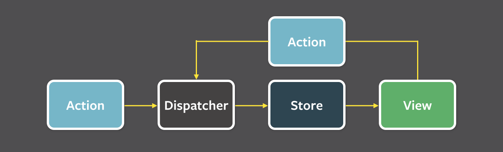

# 05장: 리액트와 상태 관리 라이브러리

## 5.1 상태 관리는 왜 필요한가?

상태: 어떠한 의미를 지난 값이며 애플리케이션의 시나리오에 따라 **지속적으로 변경될 수 있는 값**

### 리액트 상태 관리의 역사

#### Flux 패턴의 등장

웹 애플리케이션이 비대히지고 상태가 많이지면서 어디서 어떤 일이 일어나서 상태가 변했는지 추적하고 이해하기 매우 어려운 상황

원인은 양방향 데이터 바인딩에 있었고, 페이스북 팀은 단방향으로 데이터 흐름을 변경하는 것을 제안한다.



- 액션: 어떠한 작업을 처리할 액션과 그 액션 발생 시 함께 포함시킬 데이터를 의미한다. 액션 타입과 데이터를 각각 정의해 이를 디스패처로 보낸다.
- 디스패처: 액션을 스토어에 보내는 역할을 한다. 콜백 함수 형태로 앞서 액션이 정의한 타입과 데이터를 모두 스토어에 보낸다.
- 스토어: 실제 상태에 따른 값과 상태를 변경할 수 있는 메서드를 가지고 있다.
  액션의 타입에 따라 어떻게 상태를 변경할지가 정의돼 있다.
- 뷰: 스토어에서 만들어진 데이터를 가져와 화면을 렌더링하는 역할을 한다.
  뷰에서도 사용자의 입력이나 행위에 따라 상태를 업데이트를 할 수 있다.
  이 경우에는 뷰에서 액션을 호출하는 구조로 구성된다.

```tsx
type StoreState = {
  count: number;
};

type Action = { type: "add"; payload: number };

// 스토어에는 실제 상태에 따른 값과 이를 변경할 수 있는 메서드를 가지고 있다.
function reducer(prevState: StoreState, action: Action) {
  const { type: ActionType } = action;

  if (ActionType === "add") {
    return {
      count: prevState.count + action.payload,
    };
  }

  throw new Error(`Unexpected Action [${ActionType}]`);
}

export default function App() {
  const [state, dispatcher] = useReducer(reducer, { count: 0 });

  function handleClick() {
    // 액션을 디스패처를 통해 스토어(reducer)로 넘겨준다.
    dispatcher({ type: "add", payload: 1 });
  }

  // 뷰인 App에서 상태를 보여준다.
  return (
    <div>
      <h1>{state.count}</h1>
      <button onClick={handleClick}>+</button>
    </div>
  );
}
```

### 리덕스의 등장

위의 예시는 useReducer 훅을 이용해 하나의 컴포넌트 안에서 단방향 데이터 흐름을 보여주었다.
그렇다면 전역으로 관리되는 단방향 데이터 흐름의 예시를 리덕스와 함께 살펴보자

```js
// src/redux/actions.js

export const INCREMENT = "INCREMENT";

export const increment = () => ({
  type: INCREMENT,
});


// src/redux/reducers.js

import { INCREMENT } from "./actions";

const initialState = {
  count: 0,
};

const counterReducer = (state = initialState, action) => {
  switch (action.type) {
    case INCREMENT:
      return {
        ...state,
        count: state.count + 1,
      };
      return state;
  }
};

export default counterReducer;


// src/redux/store.js

import { createStore } from 'redux';
import counterReducer from './reducers';

const store = createStore(counterReducer);

export default store;


// src/index.js

import React from 'react';
import ReactDOM from 'react-dom';
import { Provider } from 'react-redux';
import App from './App';
import store from './redux/store';

ReactDOM.render(
  <Provider store={store}>
    <App />
  </Provider>,
  document.getElementById('root')
);

// src/App.js


import React from 'react';
import { useSelector, useDispatch } from 'react-redux';
import { increment, decrement } from './redux/actions';

function App() {
  const count = useSelector((state) => state.count);
  const dispatch = useDispatch();

  return (
    <div className="App">
      <h1>Counter: {count}</h1>
      <button onClick={() => dispatch(increment())}>Increment</button>
      <button onClick={() => dispatch(decrement())}>Decrement</button>
    </div>
  );
}

export default App;
```

📖 전역 상태 관리 라이브러리에서 구독의 의미

전역으로 관리되는 상태가 변경될 때 특정 콜백 함수나 컴포넌트가 해당 변경 사항을 감지하고 반응할 수 있도록 하는 것

상태가 변경되면 등록된 모든 구독자에게 알리고, 구독자들의 콜백 함수가 호출된다.
리덕스에서는 useSelector 훅을 사용하여 상태를 구독한다.

## 5.2 리액트 훅으로 시작하는 상태 관리

### 지역 상태의 한계를 벗어나보자: useState의 상태를 바깥으로 분리하기

useState와 useReducer는 모두 지역 상태 관리를 위해 만들어졌다.
전역 상태 관리를 시도해보자.

```tsx
// get과 set으로 useState의 동작을 흉내냄

export type State = { counter: number };

let state: State = {
  counter: 0,
};

export function get(): State {
  return state;
}

type Initializer<T> = T | ((prev: T) => T);

export function set<T>(nextState: Initializer<T>) {
  state = typeof nextState === "function" ? nextState(state) : nextState;
}

function Counter() {
  const state = get();

  function handleClick() {
    set((prev: State) => ({ counter: prev.counter + 1 }));
  }

  return (
    <>
      <h3>{state.counter}</h3>
      <button onClick={handleClick}>+</button>
    </>
  );
}
```

❌ 위의 컴포넌트는 리렌더링되지 않는다.
리렌더링 조건을 충족하지 않는다.

useState, useReducer의 반환값 중 두 번째 인수가 어떻게든 호출된다면 리렌더링이 일어난다.

```tsx
function Counter1() {
  const [counter, setCounter] = useState(state);

  function handleClick() {
    set((prev: State) => {
      const newState = { counter: prev.counter + 1 };
      setCount(newState);
      return newState;
    });
  }

  return (
    <>
      <h3>{state.counter}</h3>
      <button onClick={handleClick}>+</button>
    </>
  );
}

function Counter2() {
  // ...
}
```

위의 경우 외부의 상태를 수정하는 것 뿐만 아니라 리액트 컴포넌트도 리렌더링된다.

그러나 같은 상태를 중복해서 관리하는 문제와 **컴포넌트 두 개가 같은 상태를 공유하지만 동시에 렌더링되지 않는 문제가 있다.**

따라서 함수 외부에서 상태를 참조하고 해당 상태를 구독하는 컴포넌트까지 렌더링까지 자연스럽게 일어나라면 다음과 같은 조건을 만족해야 한다.

1. 컴포넌트 외부 어딘가에 상태를 두고 여러 컴포넌트가 같이 쓸 수 있어야 한다.
2. 외부에 있는 상태를 사용하는 컴포넌트는 상태의 변화를 알아챌 수 있어야 하고 상태가 변화될 때마다 리렌더링이 일어나야 한다.
3. 상태가 객체인 경우에 그 객체에 내가 감지하지 않는 값이 변한다 하더라도 리렌더링이 발생해서는 안 된다.

상태를 전역에서 관리하는 store를 만들어보자.

```ts
type Initializer<T> = T extends any ? R | ((prev: T) => T) : never;

type Store<State> = {
  get: () => State;
  set: (action: Initializer<State>) => State;
  // 콜백 함수를 인수로 받고, 함수를 반환
  subscribe: (callback: () => void) => () => void;
};

export const createStore = <State extends unknown>(
  initialState: Initializer<State>
): Store<State> => {
  let state =
    typeof initialState !== "function" ? initialState : initialState();

  // 콜백 함수 저장소
  const callbacks = new Set<() => void>();

  const get = () => state;
  const set = (nextState: State | ((prev: State) => State)) => {
    state =
      typeof nextState === "function"
        ? (nextState as (prev: State) => State)(state)
        : nextState;

    // set 함수가 호출되면 콜백 목록을 순회하면서 모든 콜백을 실행한다.
    callbacks.forEach((cb) => cb());

    return state;
  };

  const subscribe = (callback: () => void) => {
    callbacks.add(callback);

    // 클린업 실행 시 이를 삭제해서 반복적으로 추가되는 것을 막는다.
    return () => {
      callbacks.delete(callback);
    };
  };

  return { get, set, subscribe };
};
```

get 함수로 해당 변수의 최신값을 제공하고, set 함수로 내부 변수를 최신화하며, 이 과정에서 등록된 콜백을 모조리 실행하는 구조를 띠고 있다.

createStore로 만들어진 store의 값을 참조하고, 이 값의 변화에 따라 컴포넌트 렌더링을 유도할 사용자 정의 훅이 필요하다.

```ts
export const useStore = <State extends unknown>(store: Store<State>) => {
  // state에 store의 상태를 등록
  const [state, setState] = useState<State>(() => store.get());

  useEffect(() => {
    // setState를 콜백 모음에 등록 => 구독한 컴포넌트는 상태가 변하면 리렌더링 발생
    const unsubscribe = store.subscribe(() => {
      setState(store.get());
    });

    // 클린업 함수 실행 시 setState 콜백 모음에서 삭제
    return unsubscribe;
  }, [store]);

  return [state, store.set] as const;
};
```

그러나 이 useStore도 완벽한 것은 아니다.
store의 상태가 객체인 경우 일부값만 변경되어도 리렌더링이 발생한다.
useStoreSelector를 구현하여 컴포넌트에서 필요한 값만 select해서 사용해 보자

```ts
export const useStoreSelector = <State extends unknown, Value extends unknown>(
  store: Store<State>,
  selector: (state: State) => Value
) => {
  const [state, setState] = useState(() => selector(store.get()));

  useEffect(() => {
    const unsubscribe = store.subscribe(() => {
      const value = selector(store.get());
      setState(value);
    });

    return unsubscribe;
  }, [store, selector]);

  return state;
};
```

useState는 값이 변경되지 않으면 리렌더링을 수행하지 않으므로 store의 값이 변경됐다 하더라도 selector(store.get())이 변경되지 않는다면 리렌더링이 일어나지 않는다.

```ts
const store = createStore({ count: 0, text: "hi" });

function Counter() {
  const counter = useStoreSelector(
    store,
    useCallback(() => state.count, [])
  );

  function handleClick() {
    store.set((prev) => ({ ...prev, count: prev.count + 1 }));
  }

  // ...
}
```

### 상태 관리 라이브러리 살펴보기

Recoil과 Jotai는 Context와 훅을 기반으로 atom 단위의 작은 상태를 효율적으로 관리하는데 초점을 맞추고 있는 반면,
Zustand는 리덕스와 비슷하게 하나의 큰 스토어를 기반으로 상태를 관리하는 라이브러리다. Context가 아닌 스토어가 가지는 클로저를 기반으로 생성되며, 상태가 변경되면 이 상태를 구독하고 있는 컴포넌트에 전파해 리렌더링을 알리는 방식이다.

#### Jotai

> Recoil의 상위 호환 느낌

작은 단위의 상태를 위로 전파하는 구조의 상향식 접근법을 취한다.
또한 Context의 문제점인 불필요한 리렌더링이 일어난다는 문제를 해결하였다.

#### Zustand

##### store 생성하기

```ts
import create from "zustand";

// set 함수를 통해서만 상태를 변경할 수 있다
const useStore = create((set) => ({
  bears: 0,
  increasePopulation: () => set((state) => ({ bears: state.bears + 1 })),
  removeAllBears: () => set({ bears: 0 }),
}));
```

##### useStore 사용하기

```ts
function BearCounter() {
  const bears = useStore((state) => state.bears);
  return <h1>{bears} around here ...</h1>;
}

function Controls() {
  const increasePopulation = useStore((state) => state.increasePopulation);
  return <button onClick={increasePopulation}>one up</button>;
}
```

컴포넌트에서 useStore 훅을 사용할 때는 스토어에서 상태를 어떤 형태로 꺼내올지 결정하는 셀렉터 함수를 전달해 주어야 한다. 만약 셀렉터 함수를 전달하지 않는다면 스토어 전체가 리턴된다.

---

### 새로 알게된 개념

- store 개념
- Flux 패턴

### 읽으면서 어려웠거나 이해가 잘 안됐던 부분

- 커스텀으로 상태 관리 라이브러리 만드는 부분
- zustand 코드 이해하기
