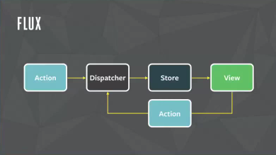

# 10회차

# 5장

상태 관리가 왜 필요하고, 어떻게 작동하는지 알아보자.

## 상태 관리는 왜 필요한가?

상태란 무엇이냐? 어떠한 의미를 지닌 값. app의 동작에 따라 계속 변경될 수 있음.

**대표적인 상태 4개**

- Ui: 상호 작용이 가능한 모든 요소의 현재 값.
- URL: 브라우저에서 관리되는 상태 값.
- 폼: 로딩, 제출, 접근 가불, 값의 유효성 등이 상태로 관리됨.
- 서버에서 가져온 값: response값도 상태임.

웹 서비스에서 기능이 늘어남에 따라 웹 내부에서 관리해야 할 상태도 늘어남.  
그러므로 상태를 효과적으로 관리하는 방법을 고민해봐야됨.

### 리액트 상태 관리의 역사

리액트는 상태 관리를 어떻게 했을까?  
단순 라이브러리인 리액트에서 개발자가 어떻게 상태 관리를 했는지 알아보자.

#### Flux 패턴의 등장

리덕스가 나타나기 전까지는 리액트에서 쓸만한 라이브러리가 없었음.  
그러나.. 2014년경에 Flux 패턴을 쓰는 Flux 라이브러리가 등장하게됨.


기존에는 복잡한 양방향 데이터 바인딩을 했음. 뷰, 모델이 서로가 상호작용으로 변경할 수 있었음.  
=> 코드를 작성하는 입장에서는 간편하지만, 규모가 커질수록 관리하기 복잡해짐.  
단방향이 필요하겠지?

  
**Flux패턴의 용어**

- 액션: 액션 발생 시 포함시킬 데이터. 디스패처로 보냄
- 디스패처: 콜백 함수 형태. 액션이 정희한 타입과 데이터를 모두 스토어로 보냄
- 스토어: 상태를 변경할 수 있음. 액션의 타입에 따라 어떻게 변경할지 정의됨.
- 뷰: 스토어에서 만들어진 데이터로 화면을 렌더링해줌. 사용자와 상호작용으로 상태를 업데이트함.

데이터 갱신에 따라 어떻게 업데이트해야 하는지에 대해 코드를 작성해야하므로 양이 많아짐.
그러나 데이터가 한 방향이라 흐름을 추적하기 쉽고 이해하기도 좋음.

리액트는 단방향 데이터 바인딩이 기반이라 FLux패턴과 궁합이 좋음.
이 둘을 합친게 리액트 기반 Flux.

#### 시장 지배자 리덕스의 등장

단방향 데이터가 유행하자 리덕스(Redux)라는 얘도 떠오름.
리덕스는 Flux구조에 Elm 아키텍처를 도입한 녀석임.      
**Elm**: 웹페이지를 선언적으로 작성하기 위한 언어

**Elm 데이터 흐름**

- model: 애플리케이션의 상태.
- view: 모델을 표현하는 HTML.
- update: 모델을 수정하는 방식.  
  

**리덕스의 상태 관리 흐름**

1. 상태 객체를 **스토어**에 저장
2. 객체를 **디스패치**해 업데이트를 수행 <= reducer 함수로 실행
3. wep app 상태에 따라 새로운 복사본을 반환
4. app에 반환받은 것을 전파함.

글로벌 상태 객체(스토어)를 통해 상태를 하위 컴포넌트에 전파 가능  
=> props 내려주기 문제를 해결, 컴포넌트로 connect를 써서 스토어에 접근 가능.

**리덕스의 어두운면**

- 액션 타입과 액션을 수행할 타입을 만들어줘야함.
- dispatcher, selector 필요.
- 새로운 상태가 어떻게 쓰일지도 정의해야됨.  
  => 보일러플레이트가 많음..  
   **보일러플레이트**: 반복 코드가 많으나 기능적으로는 크게 기여하지 않는 것.

#### Context API와 useContext

리듀서를 이용해서 props 내려주기를 막을 순 있지만, 비용이큼.  
=> 보일러플레이트 때문.

이를 대처하고자 리액트 16.3부터는 Context API가 등장.  
=> props로 넘겨주지 않아도 원하는곳에서 상태를 사용 가능하게됨.

사실 리액트 16.3 이전에도 context가 존재했지만, 문제가 많은데 알아보자.

```JS
class MyComponent extends React.Component {
  static childContextTypes = {
    name: PropTypes.string,
    age: PropTypes.number,
  }

  getChildContext() {
    return {
      name: 'foo',
      age: 30,
    }
  }

  render() {
    return <childComponent />
  }
}
function ChildComponent(props, context) {
  return(
    <div>
      <p>{context.name}</p>
      <p>{context.age}</p>
    </div>
  )
}

ChildComponent.contextTypes = {
  name: PropTypes.string,
  age: PropTypes.number,
}
```

- 상위 컴포넌트 렌더링 시, shouldComponentUpdate가 항상 true를 반환  
  => 불필요한 렌더링 발생.
- getChildContext를 사용하기 위해 context를 인수로 받아야함.  
  => 컴포넌트와 결합도가 높아짐.

반면 Context API는?

```Js
const CounterContext = createContext(undefined)

class CounterComponent extends Component {
  render() {
    return (
      <CounterContext.Consumer> // <= 상태를 주입받음.
        {(state) => <p>{state?.count}</p>}
      </CounterContext.Consumer>
    )
  }
}

class DummyParent extends Component {
  render() {
    return (
      <>
        <CounterComponent />
      </>
    )
  }
}

export default class MyApp extends Component {
  state = { count: 0 }

  componentDidMount() {
    this.setState({ count: 1 })
  }

  handleClick = () => {
    this.setState((state) => ({ count: state.count + 1}))
  }

  render() {
    return (
      <CounterContext.Provider value={this.state}> // <= 상태를 주입해주는 역할
        <button onClick={this.handleClick}>+</button>
        <DummyParent />
      </CounterContext.Provider>
    )
  }
}
```

얘는 Context의 단점이 모두 상쇄되었지만, 렌더링을 막아주는 기능은 없으니 주의하자.

#### 훅의 탄생, 그리고 React Query와 SWR

훅의 탄생으로 인해 새로운 상태 관리인 React Query, SWR이 등장함.  
이 둘은 HTTP 요청에 특화된 상태 관리 라이브러리임.

```JS
const fetcher = (url) => fetch(url).then((res) => res.json())

export default function App() {
  const {data, error} = useSWR(
    'https://www.naver.com',
    fetcher,
  )

  if(error) return 'An error has occurred.'
  if(!data) return 'Loading...'

  return (
    <div>
      <p>{JSON.stringify(data)}</p>
    </div>
  )
}
```

- 첫 인수인 API 주소는 키로도 사용됨.  
  => 다른 곳에서 동일한 키로 호출하면 캐시의 값을 활용함.

제한적이지만, 많은 부분에서 상태 관리를 도와줄 수 있음.

#### Recoil, Zustand, Jotai, Valtio에 이르기까지

요즘 떠오르는 친구들. 알아보자.

```JS
// Recoil React 기반의 상태 관리 라이브러리
const counter = atom({ key: 'count', default: 0})
const todoList = useRecoilValue(counter)

// Jotai 상태를 아톰(atom) 단위로 관리함.
const countAtom =atom(0)
const [count, setCount] = useAtom(countAtom)

// Zustand API로 전역 상태를 관리함.
const useCounterStore = create((set) => ({
  count: 0,
  increase: () => set((state) => state.count)
}))

// Valtio 상태의 변화를 자동으로 추적하고 반영함.
const state = proxy({ count: 0 })
const snap = useSnapshot(state)
state.count++
```

- 리액트 16.8 버전 이상에서만 작동
- 전역 상태 관리에서 벗어나 지역적으로 관리할 수 있게됬음.
- 훅 지원으로 함수 컴포넌트에서 쉽게 사용 가능.

### 정리

- 바쁘면 익숙한 상태 관리 라이브러리나 바닐라 쓰자.
- 여유있으면 다양한 옵션 비교해보면 도움된다.

## 리액트 훅으로 시작하는 상태 관리

리액트 16.8 버전 이상에서는 상태 관리를 어떻게 하고,  
채택한 상태 관리 라이브러리를 알아보자.

### 가장 기본적인 방법: useState, useReducer

**useState를 이용한 훅**

```JS
function useCounter(initCount: number = 0) {
  const [counter, setCounter] = useState(initCount)

  function inc() {
    setCounter((prev) => prev + 1)
  }

  return { counter, inc }
}

function Counter1() {
  const { counter, inc } = useCounter()

  return (
    <>
      <h3>{counter}</h3>
      <button onClick={inc}>+</button>
    </>
  )
}

function Counter2() {
  const { counter, inc } = useCounter()

  return (
    <>
      <h3>{counter}</h3>
      <button onClick={inc}>+</button>
    </>
  )
}
```

- useCounter라는 훅을 통해 중복되는 로직을 방지했음.
- 상태가 복잡해질수록 훅의 중요성은 높아짐.

함수 컴포넌트라면 어디든 재사용 가능해서 좋음

하지만 문제는 지역 상태, 즉 컴포넌트 내에서만 유효함.
위 코드의 두 컴포넌트의 counter 값이 동일하게, counter를 전역 상태로 만들어보자.

```JS
function Counter1({ counter, inc }: { counter: number; inc: () => void }) {
  return (
    <>
      <h3>{ counter }</h3>
      <button onClick={inc}>+</button>
    </>
  )
}

function Counter2({ counter, inc }: { counter: number; inc: () => void }) {
  return (
    <>
      <h3>{ counter }</h3>
      <button onClick={inc}>+</button>
    </>
  )
}

function Parent() {
  const { counter, inc } = useCounter()

  return (
    <>
      <Counter1 counter={counter} inc={inc} />
      <Counter2 counter={counter} inc={inc} />
    </>
  )
}
```

- 부모 컴포넌트에서 훅을 관리하므로 전역적으로 쓸 수 있게됨
- props 형태로 컴포넌트에 제공하는게 불안해 보임.

무결점으로 만들어보자.

### 지역 상태의 한계를 벗어나보자: useState의 상태를 바깥으로 분리하기

useState는 클로저 내부에서 관리되기 때문에 해당 컴포넌트에서만 쓸 수 있음  
클로저말고 다른 곳에서 초기화하고 관리하면 어떨까??  
=> 어딘가에서 해당 값을 업데이트하면 값을 참조하는 컴포넌트, 훅에서도 쓸 수 있다.

```JS
// counter.ts
export type State = { counter: number }

// 컴포넌트 밖에서 선언.
let state: State = {
  counter: 0,
}

// getter
export function get(): State {
  return state
}

//useState처럼 게으른 초기화 함수나 값을 받을 수 있게함.
type Initializer<T> = T extends any ? T | ((prev: T) => T) : never

// setter
export function set<T>(nextState: Initializer<T>) {
  state = typeof nextState === 'function' ? nextState(state) : nextState
}

// Counter
function Counter() {
  const state = get()

  function handleClick() {
    set((prev: State) => ({ counter: prev.counter + 1 }))
  }

  return (
    <>
      <h3>{state.counter}</h3>
      <button onClick={handleClick}>+</button>
    </>
  )
}
```

state, get() 모두 잘 작동하고 있음. 그러나 컴포넌트가 리렌더링이 안됨...  
리액트에서는 상태에 따라 변한 ui를 보여줄려면 리렌더링이 되야함.  
위 코드에서는 리렌더링을 시켜주는 장치가 없음.  
=> useState, useReducer의 setter가 호출되거나 부모함수가 리렌더링 되야함.

이번엔 useState의 인수로 컴포넌트 밖의 state에 넘겨줘보자.

```JS
let set // 외부에 state를 어케 만든단 소리임?? 도대체?? ㄹㅇ

function Counter() {
  const [count, setCount] = useState(state)

  function handleClick() {
    set((prev: State) => {
      const newState = { counter: prev.counter + 1 }
      setCount(newState) // 얘가 호출되면 컴포넌트 리렌더링됨.
      return newState
    })
  }

  return (
    <>
      <h3>{count.counter}</h3>
      <button onClick={handleClick}>+</button>
    </>
  )
}

function Counter2() {
  const [count, setCount] = useState(state)

  function handleClick() {
    set((prev: State) => {
      const newState = { counter: prev.counter + 1 }
      setCount(newState)
      return newState
    })
  }

  return (
    <>
      <h3>{count.counter}</h3>
      <button onClick={handleClick}>+</button>
    </>
  )
}
```

1. handleClick으로 외부의 상태 set을 실행
2. set의 콜백으로 useState의 두 번째 인수도 실행
3. 리액트 컴포넌트가 렌더링됨.
4. 외부의 값을 참조할 수 있게됨.

- 상태를 중복 관리해서 비효율적
- 둘 중 하나의 컴포넌트가 렌더링되지 않음(반대쪽도 눌러줘야함)  
  => 반대쪽 컴포넌트는 상태 변화에 따른 리렌더링을 일으킬 조건 충족이 안됨. - 컴포넌트 외부 어딘가에 상태를 두고 여러 컴포넌트가 같이 쓸 수 있어야함. - 외부 상태 쓰는 컴포넌트는 상태 변화를 감지할 수 있어야함.
  => 상태를 참조하는 모든 컴포넌트 또한 동일하게 작동해야됨
  - 객체에 감지하지 않은 값이 변할 때는 리렌더링 돼서는 안됨.

이걸 해결하기 위해 객체나 원시값인 상태 store를 만들어 보자.

```JS
type Initializer<T> = T extends any ? T | ((prev: T) => T) : never

type Store<State> = {
  get: () => State    // 항상 최신값을 가져오게 해줌.
  set: (action: Initializer<State>) => State // useState의 setter역할
  subscribe: (callback: () => void) => () => void // 변경을 감지하고 싶은 컴포넌트들이 callback을 등록해 두는 곳
}

export const createStore = <State extends unknown>(
  initialState: Initializer<State>,
): Store<State> => {
  let state = type of initialState !== 'function' ? initialState : initialState()

  // 콜백 함수를 저장하기 위해 Set으로 선언
  const callbacks = new Set<() => void>()
  const get = () => state /
  const set = (nextState: State | ((prev: State) => State)) => {
    state =
      typeof nextState === 'function'
      ? (nextState as (prev: State) => State)(state)
      : nextState

    callbacks.forEach((callback) => callback())

    return state
  }

  const subscribe = (callback: () => void) => {
    callbacks.add(callback)
    return () => {
      callbacks.delete(callback)
    }
  }
  return { get, set, subscribe }
}
```

- CreateStore: 자신이 관리해야할 상태를 내부 변수로 가짐.
- get: 변수의 최신값을 제공.
- set: 내부 변수를 최신화.
- subscribe: callbacks 셔틀.

이번엔 useStore훅을 만들어 보자.

```js
export const useStore = <State extends unknown>(store: Store<State>) => {
  const [state, setState] = useState<State>(() => store.get()) // 얘가 렌더링을 유도함

  useEffect(() => {
    const unsubscribe = store.subscribe(() => {
      setState(store.get()) // Store의 값이 변경되면 state의 값이 변경되게함.
    })
    return unsubscribe // callback이 계속 쌓이는 것을 방지해줌.
  }, [store])

  return [state, store.set] as const
}
```

이제 상태 관리를 해보자.....

```js
const store = createStore({ count: 0 });

function Counter1() {
  const [state, setState] = useStore(store);

  function handleClick() {
    setState((prev) => ({ count: prev.count + 1 }));
  }

  return (
    <>
      <h3>{state.count}</h3>
      <button onClick={handleClick}>+</button>
    </>
  );
}

function Counter2() {
  const [state, setState] = useStore(store);

  function handleClick() {
    setState((prev) => ({ count: prev.count + 1 }));
  }

  return (
    <>
      <h3>{state.count}</h3>
      <button onClick={handleClick}>+</button>
    </>
  );
}

export default function App() {
  return (
    <div className="App">
      <Counter1 />
      <Counter2 />
    </div>
  );
}
```

드디어 정상 작동함. 버튼을 클릭할 시, 두 컴포넌트 모두 리렌더링 잘됨.  
하지만 스토어의 구조가 객체인 경우 객체 일부값만 바꿔도 리렌더링됨.  
=> 원하는 값이 변했을 때만 리렌더링 되도록 해보자.
다음에 해보자.

### useState, Context를 동시에 사용해 보기

앞의 스토어는 하나의 스토어를 가지면 전역 변수처럼 작동해서 여러 개의 스토어를 가질 수 없음.  
createStore를 여러개 만드는 방법도 있지만 비효율적이니 다른 방법을 알아보자.  
=> Context를 사용해 구현해보자.

```js
// store를 초기값으로 넣음. => context 생성시 스토어 자동 생성
export const CounterStoreContext = createContext<Store<CounterStore>>(
  createStore<CounterStore>({ count: 0, text: 'hello'}),
)

export const CounterStoreProvider = ({
  initialState,
  children,
}: PropsWithChildren<{
  initialState: CounterStore
}>) => {
  const storeRef = useRef<Store<CounterStore>>()

  // 최초에 한 번 스토어 생성
  if(!storeRef.current) {
    storeRef.current = createStore(initialState)
  }

  return (
    <CounterStoreContext.Provider value={storeRef.current}>
      {children}
    </CounterStoreContext.Provider>
  )
}
```

useContext를 사용해 스토어에 접근할 훅을 구현해보자..

```js
export const useCounterContextSelector = <State extends unknown>(
  selector: (state: CounterStore) => State,
) => {
  const store = useContext(CounterStoreContext)
  const subscription = useSubscription(
    useMemo(
      () => ({
        getCurrentValue: () => selector(store.get()),
        subscribe: store.subscribe,
      })
      [store, selector],
    )
  )

  return [subscription, store.set] as const
}
```

- 스토어에 접근하는 방식으로 useContext를 사용
  => Context.Provider에서 제공된 스토어를 찾게됨.

후.. 이 훅과 Context를 써보자..

```js
const ContextCounter = () => {
  const id = useId();
  const [counter, setStore] = useCounterContextSelector(
    useCallback((state: CounterStore) => state.count, [])
  );

  function handleClick() {
    setStore((prev) => ({ ...prev, count: prev.count + 1 }));
  }

  useEffect(() => {
    console.log(`${id} Counter Rendered`);
  });

  return (
    <div>
      {counter} <button onClick={handleClick}>+</button>
    </div>
  );
};

const ContextInput = () => {
  const id = useId();
  const [text, setStore] = useCounterContextSelector(
    useCallback((state: CounterStore) => state.text, [])
  );

  function handleChange(e: ChangeEvent<HTMLInputElement>) {
    setStore((prev) => ({ ...prev, text: e.target.value }));
  }

  useEffect(() => {
    console.log(`${id} 렌더링됨`);
  });

  return (
    <div>
      <input value={text} onChange={handleChange} />
    </div>
  );
};

export default function App() {
  return (
    <>
      {/* 0 */}
      <ContextCounter /> // 초기값 잘가져옴. CounterStoreContext에서 초기값을 인수로
      넘겨줬기 때문.
      {/* hi */}
      <ContextInput /> // 얘도
      <CounterStoreProvider initialState={{ count: 10, text: "hello" }}>
        {/* 10 */}
        <ContextCounter /> // 초기화된 Provider 내부에 있어서 10, hello 가져옴
        {/* hello */}
        <ContextInput />
        <CounterStoreProvider initialState={{ count: 20, text: "welcome" }}>
          {/* 20 */}
          <ContextCounter />
          {/* welcome */}
          <ContextInput />
        </CounterStoreProvider>
      </CounterStoreProvider>
    </>
  );
}
```

부모 컴포넌트로 자식 컴포넌트에따라 보여줄 데이터를 Context로 정할 수 있음.  
하아... 이렇게 힘들게 하지말고 걍 상태 관리 라이브러리 쓰자...

### 상태 관리 라이브러리

**Recoil**

- 핵심 API 4대장으로 구성됨
  - RecoilRoot: Recoil에서 생성되는 상태값을 저장해주는 스토어 생성
  - atom: 상태를 나타내는 최소 단위.
  - useRecoilValue: atom의 값을 읽어오는 훅.
  - useRecoilState: useState처럼 값을 가져오고, 변경할 수 있음.

**Jotai**

- Recoil의 atom에 영감을 받음.
  - atom: Recoil atom과 같지만, 파생된 상태까지 만들 수 있음.
  - useAtomValue: atom의 값을 읽어옴.
  - useAtom: useState와 동일한 형태의 배열을 반환. atom 수정 가능.

**zustand**

- 하나의 스토어를 중앙 집중해서 내부에서 상태 관리.
  - 스토어를 만들고 파생된 값을 만드는 형식.
  - 미들웨어를 지원.

### 정리

- 상태 관리 라이브러리들의 특징을 파악해서 app상황에 맞춰서 쓰자.
- 팁을 주자면 메인테이너 많고, 다운로드 활발한거 써라

### 어려운 거

- 상태 관리 라이브러리 설명을 위한 useState, useContext 빌드업이 말이 안돼는데 걍;

### 알게된 거

- Flux패턴의 동작원리
- 리덕스의 구조
- 상태 관리 라이브러리의 약간의 원리
