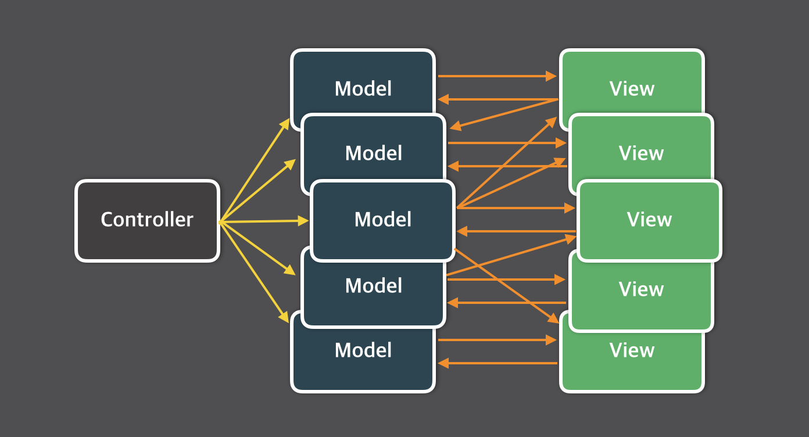

# [5장] 리액트와 상태 관리 라이브러리

## 5.1 상태관리는 왜 필요한가?

**📍웹 애플리케이션에서 상태로 분류될 수 있는 것들**

- UI: ex) 다크/라이트 모드, input요소, 알림창 노출 여부
- URL: 사용자 라우팅에 따른 동적 주소
- 폼: 로딩 중인지, 현재 제출됐는지, 접근이 불가능한지, 값이 유효한지
- 서버에서 가져온 값: ex)API 요청

**✨리액트 상태관리의 역사**

**📍Flux 패턴의 등장**

양방향 데이터 바인딩) 뷰(HTML)가 모델(JS)을 변경할 수 있고, 모델도 뷰를 변경할 수 있다.



**페북이 양방향이 아닌 단방향으로 데이터 흐름을 변경하는 것을 제안함 → Flux 패턴 시작**


- 액션(action): **어떠한 작업을 처리할 액션**. 액션 타입과 데이터를 각각 정의해 dispatcher로 보냄.
- 디스패처(dispatcher): **액션을 스토어에 보내**는 역할. 콜백 함수 형태로 앞서 액션이 정의한 타입과 데이터를 모두 스토어에 보냄
- 스토어(store): **상태에 따른 값과 상태를 변경할 수 있는 메서드를 가지고 있다**. 액션의 타입에 따라 어떻게 이를 변경할지가 정의돼 있다.
- 뷰(view): 리액트의 컴포넌트에 해당함. 스토어에서 만들어진 데이터를 가져와 화면을 **렌더링**하는 역할을 한다. **뷰에서도 사용자의 입력이나 행위에 따라 상태를 업데이트할 수 있다.**


→ 사용자의 입력에 따라 데이터를 갱신하고 화면을 어떻게 업데이트해야 하는지도 코드를 작성해야 해서 코드의 양이 많아지고 개발자도 수고로워진다. 하지만 **데이터 흐름은 모두 액션이라는 단방향으로 줄어들어 데이터 흐름을 추적하기 쉽고 코드를 이해하기 한결 수월해진다.**

**📍시장 지배자 리덕스의 등장**

리덕스 - Flux 구조를 구현하기 위해 만들어진 라이브러리 + Elm 아키텍처 도입

> ❓Elm <br>
> 웹페이지를 선언적으로 작성하기 위한 언어
>
> ```jsx
> module Main exposing (..)
>
> import Browser
> import Html exposing (Html, button, div, text)
> import Html.Events exposing (onClick)
>
> // Model: 상태
> -- Model
> type alias Model =
>     { count : Int }
>
> initialModel : Model
> initialModel =
>     { count = 0 }
>
> -- Msg
> type Msg
>     = Increment
>     | Decrement
>
> // Update: 모델을 수정하는 방식
> -- Update
> update : Msg -> Model -> Model
> update msg model =
>     case msg of
>         Increment ->
>             { model | count = model.count + 1 }
>
>         Decrement ->
>             { model | count = model.count - 1 }
>
> // View: 모델을 표현하는 HTML
> -- View
> view : Model -> Html Msg
> view model =
>     div []
>         [ button [ onClick Decrement ] [ text "-" ]
>         , div [] [ text (String.fromInt model.count) ]
>         , button [ onClick Increment ] [ text "+" ]
>         ]
>
> -- Main
> main =
>     Browser.sandbox { init = initialModel, update = update, view = view }
>
> ```
>
> → Elm은 Flux와 마찬가지로 데이터 흐름을 세 가지로 분류하고 단방향으로 강제해 웹 애플리케이션의 상태를 안정적으로 관리하고자 했다.

리덕스는…

- **하나의 상태 객체를 스토어에 저장**해두고, **이 객체를 업데이트하는 작업을 디스패치해 업데이트를 수행**한다. → reducer 함수로 발생 가능
- reducer는 웹 애플리케이션 상태에 대한 완전히 **새로운 복사본을 반환**하고, 애플리케이션에 **이 새롭게 만들어진 상태를 전파하게 된다.**
  → props drilling 해결.
  스토어가 필요한 컴포넌트라면 단지 connect만 쓰면 스토어에 바로 접근할 수 있다.

리덕스의 문제)<br>
단순히 하나의 상태를 바꾸려면…<br>
어떠한 액션인지 타입 선언 + 이 액션을 수행할 creator 함수를 만들어야 한다.<br>
dispatcher와 selector도 필요하고,<br>
새로운 상태가 어떻게 기존의 리듀서 내부에서 어떤 식으로 변경돼야 할지, 혹은 새로 만들어야 할지도 새로 정의해야 했다.<br>
→ 하고자 하는 일에 비해 보일러플레이트가 너무 많다…

**📍Context API와 useContext**

props로 상태를 넘겨주지 않더라도 context API를 쓰면 원하는 곳에서 Context Provider가 주입하는 상태를 사용할 수 있다.

> **❓context는 상태 관리가 아니라 상태 주입을 도와주는 역할이다**
>
> Context API의 주된 목적은 컴포넌트 트리의 여러 레벨에 걸쳐 데이터를 전달하는 것이다.(prop drilling 방지)
>
> 상태 관리 측면에서는 Context API가 전역 상태 관리 라이브러리를 대체할 수는 없다. Context API는 상태를 관리하는 기능보다는 상태를 주입하는 기능에 더 초점을 맞추고 있다.
>
> → Context API는 상태 자체를 관리하는 것이 아니라, 상태를 필요로 하는 컴포넌트에 상태를 주입하는 역할을 한다. 이를 통해 컴포넌트 간 데이터 공유를 더 쉽게 구현할 수 있다.
>
> [React) Context API는 상태관리 도구가 아니다.](https://velog.io/@2ast/Context-API)

**📍훅의 탄생, 그리고 React Query와 SWR**

리액트 훅 API는 기존에 무상태 컴포넌트를 선언하기 위해서만 제한적으로 사용했던 함수 컴포넌트가 클래스 컴포넌트 이상의 인기를 구가할 수 있도록 많은 기능을 제공했다. **👍🏻state를 쉽게 재사용하게**

React Query & SWR

- 외부에서 데이터를 불러오는 fetch를 관리하는 데 특화된 라이브러리
- API 호출에 대한 상태를 관리하고 있기 때문에 HTTP 요청에 특화된 상태 관리 라이브러리다.

```jsx
// SWR(Suspense with fetch)를 사용한 간단한 코드 예제
import React from 'react'
import useSWR from 'swr'

const fetcher = (url) => fetch(url).then((res) => res.json())

const MyComponent = () => {
  // 같은 API 주소를 사용하여 useSWR을 호출
  const { data, error } = useSWR('https://api.example.com/data', fetcher)

  if (error) return <div>Failed to load data</div>
  if (!data) return <div>Loading...</div>

  return (
    <div>
      <h1>Data from API:</h1>
      <ul>
        {data.map((item) => (
          <li key={item.id}>{item.name}</li>
        ))}
      </ul>
    </div>
  )
}

export default MyComponent
```

- 첫 번째 인수: 조회할 API 주소 (키로도 사용되며 이후에 다른 곳에서 동일한 키로 호출하면 재조회하는 것이 아니라 useSWR이 관리하고 있는 캐시의 값을 활용한다.)
- 두 번째 인수: 조회에 사용되는 fetch

> SWR은 API 주소를 키로 사용하여 내부적으로 데이터를 캐싱한다. 한 번 데이터를 가져오면, 이 데이터는 메모리에 캐시되어 재사용된다. 이후 같은 API 주소로 다시 `useSWR` 훅을 호출하면, 새로운 데이터를 가져오는 것이 아니라 메모리에 있는 캐시된 데이터를 사용한다.

## 5.2 리액트 훅으로 시작하는 상태 관리

**✨가장 기본적인 방법: useState와 useReducer**

useState의 등장으로 리액트에서는 여러 컴포넌트에 걸쳐 손쉽게 동일한 인터페이스의 상태를 생성하고 관리할 수 있게 됐다.

```jsx
import React, { useState } from 'react'

const CounterComponent = () => {
  const [count, setCount] = useState(0)

  const increment = () => {
    setCount(count + 1)
  }

  return (
    <div>
      <h2>Counter Component</h2>
      <p>Count: {count}</p>
      <button onClick={increment}>Increment</button>
    </div>
  )
}

export default CounterComponent
```

⚠️useState와 useReducer를 기반으로 하는 사용자 지정 훅의 한계는 명확하다.

- **지역상태의 한계**<br>
  useState나 useReducer를 사용한 상태는 각 컴포넌트 내에서만 유효하다. (지역 상태) 따라서 동일한 컴포넌트를 여러 번 사용할 경우 각각의 인스턴스는 서로 독립적인 상태를 유지하게 된다.
- **상태의 파편화**<br>
  컴포넌트가 많이 사용될수록 같은 상태를 다루는 로직을 중복해서 구현해야 할 수 있다.
  예) 여러 개의 카운터 컴포넌트가 있을 때 각각의 컴포넌트마다 상태를 별도로 초기화하고 관리해야 한다.

해결법)

상태를 컴포넌트 밖으로 한 단계 끌어올리는 방법(props를 통해 값 전달하기)

```jsx
import React, { useState } from 'react'
import ChildComponent from './ChildComponent'

const ParentComponent = () => {
  const [count, setCount] = useState(0)

  const increment = () => {
    setCount(count + 1)
  }

  const decrement = () => {
    setCount(count - 1)
  }

  return (
    <div>
      <h2>Parent Component</h2>
      <p>Count: {count}</p>
      {/* ChildComponent에 count 상태와 상태 업데이트 함수를 props로 전달 */}
      <ChildComponent
        count={count}
        increment={increment}
        decrement={decrement}
      />
    </div>
  )
}

export default ParentComponent
```

**✨지역 상태의 한계를 벗어나보자: useState의 상태를 바깥으로 분리하기**

리액트의 useState는 리액트가 만든 클로저 내부에서 관리되어 지역 상태로 생성되기 때문에 해당 컴포넌트에서만 사용할 수 있다는 단점이 있다.

- getter, setter 적용하기
  - 컴포넌트가 리렌더링 되지 않는다.
    > 리렌더링 하려면…
    >
    > 1. useState, useReducer 반환값 중 두 번째 인수가 어떻게든 호출돼야 한다.
    > 2. 부모 컴포넌트가 리렌더링 되거나 해당 함수 컴포넌트가 다시 실행돼야 한다.
- 하위 컴포넌트 이벤트로 상위 컴포넌트 업데이트 하기

  - 상위 컴포넌트의 state를 전달하고 이벤트 발생 시 setState 호출
  - 이벤트가 발생한 컴포넌트는 리렌더링되지만 같은 값을 공유하고 있는 다른 하위 컴포넌트는 렌더링되지 않는다. (다른 컴포넌트에서는 리렌더링을 일으킬 이벤트가 없기 때문)

    > 함수 외부에서 상태를 참조하고 렌더링까지 발생시키는 조건…
    >
    > 1. 컴포넌트 외부 어딘가에 상태를 두고 여러 컴포넌트가 같이 쓸 수 있어야 한다.
    > 2. 외부 상태의 변경을 사용하는 컴포넌트에서 알아챌 수 있어야한다.
    > 3. 상태가 객체인 경우 감지하지 않는 내부 값이 변했을 때 리렌더링이 발생하면 안 된다.<br>
    >    → 이 3가지를 만족하는 것이 **store** & **useSubscription**

```tsx
// store
type Initializer<State> = State | (() => State)

interface Store<State> {
  get: () => State
  set: (newState: State | ((prev: State) => State)) => State
  subscribe: (callback: () => void) => () => void
}

// createStore 함수는 초기 상태를 받아 store 객체를 반환함
export const createStore = <State extends unknown>(
  initialState: Initializer<State>
): Store<State> => {
  // 1. state는 초기 상태로 설정됨
  let state = typeof initialState !== 'function' ? initialState : initialState()
  // 2. 콜백 함수를 저장하는 Set을 초기화함
  const callbacks = new Set<() => void>()

  // 3. 현재 상태를 반환하는 get 함수를 정의함
  const get = () => state

  // 4. 새로운 상태를 설정하고 모든 구독자에게 알리는 set 함수를 정의함
  const set = (newState: State | ((prev: State) => State)) => {
    // 4.1. 새로운 상태가 함수인지 확인하고, 함수면 이전 상태를 기반으로 새로운 상태를 생성함
    state =
      typeof newState === 'function'
        ? (newState as (prev: State) => State)(state)
        : newState
    // 4.2. 모든 구독자 콜백을 호출하여 상태 변경을 알림
    callbacks.forEach((callback) => callback())
    return state
  }

  // 5. 콜백 함수를 구독하고, 구독 해지 함수를 반환하는 subscribe 함수를 정의함
  const subscribe = (callback: () => void) => {
    // 5.1. 콜백을 구독 목록에 추가함
    callbacks.add(callback)
    // 5.2. 구독 해지 함수를 반환함
    return () => {
      callbacks.delete(callback)
    }
  }

  // 6. store 객체를 반환함
  return {
    get,
    set,
    subscribe,
  }
}
```

→ createStore는 자신이 관리해야 하는 상태를 내부 변수로 가진 다음 get 함수로 해당 변수의 최신값을 제공하며, set함수로 내부 변수를 최신화하며, 이 과정에서 등록된 콜백을 모조리 실행하는 구조를 띤다.

```tsx
// useSubscription.js
import { useState, useEffect } from 'react'
import { Store } from './store'

// useSubscription 훅은 store를 받아 상태를 구독함
export const useSubscription = <State,>(store: Store<State>): State => {
  // 1. 상태를 관리하기 위한 로컬 state 정의
  const [state, setState] = useState(store.get())

  // 2. 컴포넌트가 마운트될 때 구독하고, 언마운트될 때 구독 해지
  useEffect(() => {
    const handleChange = () => setState(store.get())
    const unsubscribe = store.subscribe(handleChange)
    // 구독 해지 함수 반환
    return unsubscribe
  }, [store])

  // 3. 현재 상태 반환
  return state
}
```

**✨useState와 Context를 동시에 사용해보기**

훅과 스토어를 사용하는 구조는 반드시 하나의 스토어만 가지게 된다. 하나의 스토어를 가지면 이 스토어는 마치 전역 변수처럼 작동하게 되어 동일한 형태의 여러 개의 스토어를 가질 수 없게 된다.

❓훅을 사용하는 서로 다른 스코프에서 스토어의 구조는 동일하되, 여러 개의 서로 다른 데이터를 공유해 사용하고 싶다면

```tsx
// store.js
import React, { createContext, useContext, useState } from 'react'

// Context 생성
// StoreContext는 상태를 저장하고 컴포넌트 트리 전체에 상태를 제공하는 컨텍스트 객체임
const StoreContext = createContext(null)

// Provider 컴포넌트
// StoreProvider는 상태를 생성하고, 이를 하위 컴포넌트에 제공하는 역할을 함
export const StoreProvider = ({ children, initialState }) => {
  // useState 훅을 사용하여 상태를 생성함. 초기 상태는 initialState임
  const [state, setState] = useState(initialState)

  // Provider를 사용하여 하위 컴포넌트에 상태와 setState 함수를 제공함
  return (
    <StoreContext.Provider value={{ state, setState }}>
      {children}
    </StoreContext.Provider>
  )
}

// Custom Hook
// useStore 훅은 StoreContext의 값을 반환함
export const useStore = () => {
  const context = useContext(StoreContext)
  // useStore가 StoreProvider 내에서 호출되지 않으면 에러를 던짐
  if (!context) {
    throw new Error('useStore must be used within a StoreProvider')
  }
  return context
}
```

- useState, useReducer가 가지고 있는 한계, 컴포넌트 내부에서만 사용할 수 있는 지역상태라는 점을 극복하기 위해 외부 어딘가에 상태를 둔다.
- 이 외부의 상태 변경을 각자의 방식으로 감지해 컴포넌트의 렌더링을 일으킨다.

**✨상태 관리 라이브러리 Recoil, Jotai, Zustand 살펴보기**

**📍Recoil, Zustand, Jotai, Valtio에 이르기까지**

훅이라는 새로운 패러다임의 등장에 따라 훅을 활용해 상태를 가져오거나 관리할 수 있는 다양한 라이브러리가 등장했다.

**기존의 리덕스 같은 라이브러리와 다르게 훅을 활용해 작은 크기의 상태를 효율적으로 관리한다.**

**📍페이스북이 만든 상태 관리 라이브러리 Recoil**

- Facebook에서 개발한 상태 관리 라이브러리
- 리액트에서 훅의 개념으로 상태 관리를 시작한 최초의 라이브러리

**✏️RecoilRoot**

- Recoil 애플리케이션을 감싸는 최상위 컴포넌트
- Recoil 에서 생성되는 상태값을 저장하기 위한 스토어를 생성함.

```tsx
import { RecoilRoot } from 'recoil'

function App() {
  return <RecoilRoot>{/* 하위 컴포넌트들 */}</RecoilRoot>
}
```

- Recoil의 상태값은 RecoilRoot로 생성된 Context의 스토어에 저장된다.
- 스토어의 상태값에 접근할 수 있는 함수들이 있고, 이 함수를 활용해 상태값에 접근하거나 상태값을 변경할 수 있다.
- 값의 변경이 발생하면 이를 참조하고 있는 하위 컴포넌트에 모두 알린다.

**✏️atom**

- 상태를 나타내는 Recoil의 최소 상태 단위
- atom은 key값을 필수로 가지며, 이 키는 다른 atom과 구별하는 식별자가 되는 필수 값이다. (유일한 값)

```tsx
import { atom } from 'recoil'

const countState = atom({
  key: 'countState', // 고유 식별자
  default: 0, // 초기값
})
```

**✏️useRecoilValue**

- atom의 값을 읽어오는 훅
- 값이 변경될 때마다 리렌더링 한다.

```tsx
import { useRecoilValue } from 'recoil'

function Counter() {
  const count = useRecoilValue(countState)

  return <div>Count: {count}</div>
}
```

**✏️useRecoilState**

- useState와 유사하게 값을 가져오고, 이 값을 변경할 수 있는 훅

```tsx
import { useRecoilState } from 'recoil'

function Counter() {
  const [count, setCount] = useRecoilState(countState)

  const increment = () => setCount(count + 1)
  const decrement = () => setCount(count - 1)

  return (
    <div>
      <p>Count: {count}</p>
      <button onClick={increment}>Increment</button>
      <button onClick={decrement}>Decrement</button>
    </div>
  )
}
```

→ `<RecoilRoot/>` 를 선언해 하나의 스토어를 만들고, atom이라는 상태 단위를 `<RecoilRoot/>` 에서 만든 스토어에 등록한다. atom은 Recoil에서 관리하는 작은 상태 관리이며, 각 값은 고유한 key를 바탕으로 구별된다. 그리고 컴포넌트는 Recoil에서 제공하는 훅을 통해 atom의 상태 변화를 구독하고, 값이 변경되면 forceUpdate같은 기법을 통해 리렌더링을 실행해 최신 atom값을 가져오게 된다.

> ❓forceUpdate<br>
> 컴포넌트 강제로 리렌더링하기

**📍Recoil에서 영감을 받은, 그러나 조금 더 유연한 Jotai**

- 상향식 접근법 (작은 단위의 상태를 위로 전파할 수 있는 구조)
- context의 문제점인 불필요한 리렌더링이 일어난다는 문제를 해결하고자 설계돼 있고, 추가적으로 개발자들이 메모이제이션이나 최적화를 거치지 않아도 리렌더링이 발생되지 않도록 설계돼 있다.

**✏️atom**

- 최소 단위의 상태
- atom 하나만으로도 상태를 만들 수도, 아예 파생된 상태를 만들 수 있다.

```tsx
import { atom } from 'jotai'

// atom 정의
export const countAtom = atom(0) // 초기값 0을 가진 countAtom
```

**✏️useAtomValue**

- 특정 atom값을 읽어오는 훅
- 이 훅으로 atom의 현재 값에 접근할 수 있다.

```tsx
import { useAtomValue } from 'jotai'
import { countAtom } from './atoms'

function CounterComponent() {
  const count = useAtomValue(countAtom)

  return (
    <div>
      <p>Count: {count}</p>
    </div>
  )
}
```

**✏️useAtom**

- useState와 동일한 형태의 배열을 반환한다.
  - 첫 번째: atom의 현재 값을 나타내는 useAtomValue 훅의 결과
  - 두 번째: useSetAtom훅 반환 (atom을 수정할 수 있음)

```tsx
import { useAtom } from 'jotai'
import { countAtom } from './atoms'

function CounterComponent() {
  const [count, setCount] = useAtom(countAtom)

  const increment = () => setCount((prevCount) => prevCount + 1)
  const decrement = () => setCount((prevCount) => prevCount - 1)

  return (
    <div>
      <p>Count: {count}</p>
      <button onClick={increment}>Increment</button>
      <button onClick={decrement}>Decrement</button>
    </div>
  )
}
```

**📍작고 빠르며 확장에도 유연한 Zustand**

- 리덕스에 영감을 받음
- atom이 아닌 Zustand에서는 **하나의 스토어를 중앙 집중형으로 활용해 이 스토어 내부에서 상태를 관리하고 있다.**

```tsx
import create from 'zustand'

// Zustand 스토어 생성
const useStore = create((set) => ({
  // 초기 상태
  count: 0,

  // setState 함수 정의
  // partial: 상태의 일부분만 업데이트
  // replace: 상태를 완전히 새로운 값으로 교체
  setState: {
    partial: (newState) => set((state) => ({ ...state, ...newState })),
    replace: (newState) => set(newState),
  },

  // 구독 및 리스너 관리
  subscribe: (listener) => {
    const listeners = new Set()
    listeners.add(listener)

    // 상태 변경 시 리스너 호출
    const unsubscribe = () => {
      listeners.delete(listener)
    }

    return unsubscribe
  },

  // 리스너 초기화 함수
  destroy: () => {
    // 구독 취소 및 리스너 초기화
  },
}))

const store = useStore()

// getState, setState, subscribe, destroy를 반환하는 createStore 함수
const createStore = () => ({
  getState: () => store.getState(),
  setState: store.setState,
  subscribe: store.subscribe,
  destroy: store.destroy,
})

export default createStore
```

**useStore 함수**: Zustand의 `create` 함수를 사용하여 스토어를 생성한다. `create` 함수는 콜백 함수를 인자로 받으며, 이 콜백 함수 내에서 상태와 상태 변경 함수를 정의한다.

- `count`: 초기 상태로 사용할 값
- `setState`: 상태 업데이트를 위한 여러 메서드를 포함한 객체
  - `partial`: 상태의 일부분만 업데이트
  - `replace`: 상태를 완전히 새로운 값으로 교체
- `subscribe`: 상태 변경을 구독하고, 변경 시에 호출할 리스너를 관리하는 함수
- `destroy`: 리스너 초기화 및 상태 정리를 위한 함수

**createStore 함수**: Zustand에서 반환된 `useStore`를 기반으로 createStore 함수를 정의한다. 이 함수는 getState, setState, subscribe, destroy를 반환하여 외부에서 상태 관리를 할 수 있게 한다.

- `getState`: 현재 상태 값을 가져오는 함수
- `setState`: 상태를 업데이트하는 함수
- `subscribe`: 상태 변화를 구독하고, 리스너를 추가 및 제거할 수 있는 함수
- `destroy`: 리스너를 초기화하고 상태를 정리하는 함수

|                   | Recoil                                                       | Jotai                                                | Zustand                                     |
| ----------------- | ------------------------------------------------------------ | ---------------------------------------------------- | ------------------------------------------- |
| 기본 개념         | React의 Context API를 기반으로 한 상태 관리 라이브러리       | 최소한의 API와 React Hooks 기반 상태 관리 라이브러리 | 전역 상태 관리를 위한 경량 React 라이브러리 |
| 상태 관리 방식    | Atom 기반 상태 관리                                          | Atom 기반 상태 관리                                  | 전역 상태 객체 기반 관리                    |
| 상태 접근         | useRecoilState, useRecoilValue, useSetRecoilState Hooks 사용 | useAtom Hook 사용                                    | useStore Hook 사용                          |
| 상태 변경         | set 함수를 통해 상태 변경                                    | set 함수를 통해 상태 변경                            | setState 함수를 통해 상태 변경              |
| 비동기 처리       | 비동기 상태 관리 지원                                        | 비동기 상태 관리 지원                                | 비동기 상태 관리 지원                       |
| 성능              | 최소한의 리렌더링 수행                                       | 최소한의 리렌더링 수행                               | 빠른 성능                                   |
| API 복잡도        | 비교적 복잡한 API                                            | 간단한 API                                           | 간단한 API                                  |
| React Native 지원 | 지원                                                         | 지원                                                 | 지원                                        |
| TypeScript 지원   | 지원                                                         | 지원                                                 | 지원                                        |

https://npmtrends.com/jotai-vs-react-redux-vs-recoil-vs-zustand

리덕스 빼면 zustand가 높긴허네요~
https://www.reddit.com/r/reactjs/comments/mye2uf/zustand_vs_jotai_vs_recoil_vs_reactquery/
