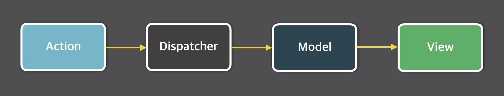

# 5장 리액트와 상태 관리 라이브러리

## 5.1 상태 관리는 왜 필요한가 ?

💡상태

- 어떤한 의미를 지닌 값
- 지속적으로 변경될 수 있는 값
- URL, UI, form, 서버에서 가져온 데이터

💡리액트에서의 Tearing 현상

- UI상에서 tearing이란 동일한 상태값에서 다른 값들이 표현되는 것
- react적으론, 애플리케이션의 상태가 비동기적으로 업데이트될 때 UI의 다른 부분이 일관성 없는 상태를 보이는 현상
- 상태가 변경되고 있지만 이 변화가 모든 UI 컴포넌트에 반영되지 않는 문제

### 5.1.1 리액트 상태 관리의 역사

**✅ Flux 패턴의 등장**


- 기존 리액트에서의 MVC 패턴
- 뷰(HTML)가 모델(JS)를 변경, 모델(JS)이 뷰(HTML)를 변경
- 양방향 데이터 바인딩으로 인한 사이드 이펙트가 발생, 예측 불가능 등의 문제



- 단방향으로 데이터 흐름을 변경하는 Flux 패턴
- `action` : 작업을 처리한 액션과 액션 발생 시 포함시킬 데이터를 정의해 디스패처로 보냄
- `dispatcher` : 콜백 함수 형태로 액션을 스토어로 보냄
- `store` : 실제 상태에 따른 값과 상태를 변경할 수 있는 메서드를 가짐. 액션 타입에 따라 어떻게 변경할지 정의되어 있음
- `view` : 컴포넌트에 해당. 스토어에서 만들어진 데이터를 가져와 화면에 렌더링.


- view에서 사용자의 입력이나 행위에 따라 상태를 업데이트할 수 있음
- store의 값을 변경하기 위해서는 dispatcher를 통해 변경되어야 되기 때문에 단방향 데이터 흐름인 것

**✅ 시장 지배자 리덕스의 등장**

- Elm 아키텍처의 영향을 받은 리덕스

💡Elm 아키텍처

- Elm : 웹페이지를 선언적으로 작성하기 위한 언어
- `model` : 애플리케이션의 상태
- `view` : 모델을 표현하는 HTML
- `update` : 모델을 수정하는 방식으로 Increment, Decrement를 선언해 모델을 수정

**✅ Context API와 useContext**

- 불필요한 prop 내려주기 없이 데이터에 접근할 수 있게 하는 Context API
- 16.3 이전 버전에서는 getChildContext() 사용
  - 상위 컴포넌트 렌더링 시 shouldComponentUpdate가 항상 ture를 반환하여 불필요한 렌더링 발생
- 16.3 버전 Context API 사용
- context를 통해서 전역에서 필요한 데이터에 접근 가능하게 함
- 상태 관리가 아닌 주입 !

**✅ 훅의 탄생, 그리고 React Query와 SWR**

- hook의 등장으로 다양한 상태 관리 등장
- React Query, SWR
  - 외부에서 데이터를 불러오는 fetch 관리하는 데 특화
  - API에 대한 상태관리 (HTTP 요청)
- useSWR
  - 첫 번째 인수 : API
  - 두 번쨰 인수 : fetcher
  - 동일한 키로 호출하면 다시 API 요청을 하는 것이 아닌 useSWR이 관리하고 있는 캐시의 값 활용하는 것

## 5.2 리액트 훅으로 시작하는 상태 관리

- useState, useReducer, ContextAPI의 등장으로 컴포넌트에 걸쳐서 혹은 컴포넌트 내부에 걸쳐서 상태 관리하는 방법 등장
- 리액트와 세트로 많이 활용되던 리덕스말고도 훅을 활용한 다양한 라이브러리가 등장

### 5.2.1 가장 기본적인 방법: useState와 useReducer

- useState를 통해 컴포넌트 내부에서 상태를 관리할 수 있음
- 커스텀 hook을 이용하여 중복되는 로직을 줄여줄 수 있음
- 한계
  - useState, useReducer 를 사용한 컴폰너트 안에서만 유요한 지역 상태
  - 훅을 사용할 때마다 컴포넌트별로 초기화되므로 컴포넌트마다 다른 상태

```jsx
function Counter1({ counter, inc }) {
  return (
    <>
      <h3>Counter1 : {counter}</h3>
      <button onClick={inc}>+</button>
    </>
  );
}
function Counter2({ counter, inc }) {
  return (
    <>
      <h3>Counter2 : {counter}</h3>
      <button onClick={inc}>+</button>
    </>
  );
}
function Parent() {
  const { counter, inc } = useCounter();
  return (
    <>
      <Counter1 counter={counter} inc={inc} />
      <Counter2 counter={counter} inc={inc} />
    </>
  );
}
```

- counter1,2에서 부모 컴포넌트에서의 동일한 상태의 counter를 참조하기 위해서
- 자식 컴포넌트를 부모 컴포넌트로 포함시킴
- 동일한 상태를 사용할 수는 있지만 prop으로 필요한 형태를 전달 받는 부분을 어떻게 개선해야 할까

### 5.2.2 useState의 상태를 바깥으로 분리하기

- useState는 클로저 내부에서 관리되어 지역 상태로 생성되기 때문에 해당 컴포넌트에서만 유효함

[ 354 예시 코드 ]

- 다른 컴포넌트에서도 상태에 접근하기 위해 해당 상태를 사용하는 컴포넌트들의 공통된 외부에 선언
- getter, setter, useState와 비슷하게 작동하는 함수를 구현
- 이 함수를 활용해서 상태의 값이 변동은 하지만 리렌더링이 발생하지 않기 때문에 UI에서는 상태가 변하지 않음
- 리렌더링 발생 조건
  - useState, useReducer 반환값 중 두 번째 인수 호출
  - 부모 컴포넌트가 리렌더링 되거나 해당 컴포넌트가 다시 실행되어야 함
- 두 개의 방법으로는 해결이 안 되기에 외부에서 상태를 업데이트하고 setter를 통해 리렌더링 강제
- 그러나 이 방법은 두 개의 컴포넌트에서 각각 리렌더링이 되기 때문에 같은 상태를 공유하더라도 UI 에서 동일하게 상태 업데이트가 안 됨

컴포넌트 외부에서 상태를 참조하고 렌더링 하는 조건

- 컴포넌트 외부에 상태가 선언되어 여러 컴포넌트에서 참조할 수 있게 해야 함
- 컴포넌트에서 외부 상태 변화를 감지할 수 있어야 하며, 이 상태를 참조하는 모든 컴포넌트들이 리렌더링돼야 함
- 원시값이 아닌 객체인 경우 감지하지 않는 값이 변해도 렌더링되면 안 됨

[ 357 예시 코드 ]

```tsx
export type Initializer<T> = T extends any ? T | ((prev: T) => T) : never;

export type Store<State> = {
  // 항상 최신 값을 구하기 위해 get 함수를 사용
  get: () => State;

  // 상태를 변경하기 위해 set 함수를 사용 (setState와 동일)
  set: (action: Initializer<State>) => State;

  // store의 상태가 변경될 때마다 호출할 함수를 등록
  // 자신에게 등록된 모든 callback 실행
  // 이 스토어를 참조하는 컴포넌트는 이 callback에 자기 자신을 렌더링하는 함수를 등록하여 리렌더링
  subscribe: (callback: () => void) => () => void;
};
```

```tsx
import { useEffect, useState } from "react";
import { Initializer, Store } from "../types/store";

export const createStore = <State extends unknown>(
  initialState: Initializer<State>
): Store<State> => {
  // initialState가 함수인 경우 함수를 실행하여 state에 할당 (게으른 초기화)
  // state 값은 스토어 내부에서만 사용되므로 변수로 선언
  let state =
    typeof initialState === "function" ? initialState() : initialState;

  // 상태가 변경될 때마다 호출할 함수를 저장하는 Set 객체 (유일한 값을 저장)
  const callbacks = new Set<() => void>();

  // 스토어의 상태를 반환하는 get 함수
  const get = () => state;

  // 상태를 변경하는 set 함수
  const set = (nextState: State | ((prev: State) => State)) => {
    // 일반적인 setter와 동일
    state =
      typeof nextState === "function"
        ? (nextState as (prev: State) => State)(state)
        : nextState;

    // 상태가 변경되면 등록된 모든 콜백을 호출
    callbacks.forEach((callback) => callback());

    return state;
  };

  // 콜백을 등록하는 subscribe 함수
  const subscribe = (callback: () => void) => {
    callbacks.add(callback);

    // 클린업 실행 시 이를 삭제
    return () => {
      callbacks.delete(callback);
    };
  };

  return { get, set, subscribe };
};

export const useStore = <State extends unknown>(store: Store<State>) => {
  // store의 현재 상태를 가져와서 useState의 초기값으로 설정
  const [state, setState] = useState<State>(() => store.get());

  useEffect(() => {
    // store의 상태가 변경될 때마다 setState를 호출하여 렌더링을 발생시킴
    // createStore 내부에서 값이 변경될 때마다 등록된 콜백이 호출되므로 렌더링 발생
    const unsubscribe = store.subscribe(() => {
      setState(store.get());
    });

    // unsubscribe 함수를 반환하여 컴포넌트가 언마운트될 때 호출
    return unsubscribe;
  }, [store]);

  return [state, store.set] as const;
};

export const countStore = createStore(() => ({ count: 0 }));
```

- store의 기본값 초기화 (함수 실행 or 초깃값 할당)
- 원시값이나 객체에 관계없이 콜백함수를 저장하기 위해 callbacks를 Set으로 선언 (중복 X)
- get으로 최신값 가져옴
- set으로 새로운 값 생성, 이후 등록된 모든 콜백을 실행하여 이 store를 사용하는 모든 컴포넌트에서 리렌더링이 일어나게 함
- subscrbe은 콜백을 등록할 수 있는 함수 useEffect처럼 클린업 함수
- 외부에서 사용할 수 있도록 get, set, subscribe를 하나의 객체로 반환
- → get 상태의 최신값 제공, set 내부 변수 최신화, subscribe 모든 콜백 실행
- 원시값이 아닌 객체라면 ? 객체에서 일부 값만 변경되도 리렌더링 발생

[ 원하는 값이 변했을 때만 렌더링 ]

```tsx
export const useStoreSelector = <State extends unknown, Value extends unknown>(
  store: Store<State>,
  selector: (state: State) => Value
) => {
  const [state, setState] = useState<Value>(() => selector(store.get()));

  useEffect(() => {
    const unsubscribe = store.subscribe(() => {
      setState(selector(store.get()));
    });

    return unsubscribe;
  }, [store, selector]);
  return state;
};
```

- uesEffect의 의존성 배열을 활용
- store값이 변경되어도 selector 함수의 반환값이 동일하면 리렌더링 X
- selector를 컴포넌틑 외부에 선언하거나 useCallback을 사용해서 참조를 고정 시켜야 함. 그렇지 않으면 useStoreSelector 내부에 있는 stroe.subscribe가 계속 실행됨
- 이와 비슷한 훅이 페이스북에서 만든 useSubscription은 예외 처리 로직이 되어있음

### 5.2.3 useState와 Context를 동시에 사용해 보기

- 상태 관리 라이브러리처럼 만든 코드의 단점
  - 훅과 스토어를 사용하는 구조는 반드시 하나의 스토어만 가짐
  - 해당 스토어가 전역 변수처럼 작동해서 여러 개의 스토어를 가지지 못함
  - 서로 다른 데이터를 공유해서 사용하고 싶다면 스토어를 여러 개 사용해야 함
- createStore를 여러 개 만드는 것 → 번거로움
  - 훅과 스토어가 1:1 의존적인 관계를 맺고 있어서 스토어 만들 때마다 동일한 개수로 생성해줘야 함
  - 또한 의존된 훅과 스토어를 훅이나 스토어의 이름을 보고 파악할 수 있음
- → 자신이 주입된 스토어에 접근하도록 리액트 Context 활용

[368 코드 ]

- 여러 스토어를 활용하기 위함
- 직접 스토어에 접근하는 방식이 아닌 Context가 제공하는 스토어에 접근하는 것
- context와 provider를 기반으로 각각 분리된(격리된?) 스토어에 접근
- 장점
  - 어떤 스토어를 사용하고 있는지 ? 어떤 스토어에서 온 상태인지 파악해야 하는 번거로움 없음
  - 부모 컴포넌트에서는 컴포넌트에 따라 보여줄 데이터들을 Context로 잘 격리하면 됨

[정리]

- 직접 useState와 useReducer를 이용해 상태 관리 라이브러리를 비슷하게 구현
- 지역 상태라는 한계를 극복
  - 컴포넌트 외부에 상태를 둠
  - 외부의 상태 변경을 각 컴포넌트에서 파악(너무 복잡함!!)

### 5.2.4 상태 관리 라이브러리 Recoil, Jotai, Zustand 살펴보기

- Recoil, Jotai → Context, Provider, hook 기반으로 작은 상태를 효율적으로 관리
- Zustand → 리덕스와 비슷, 큰 스토어를 기반으로 상태 관리
  - 스토어가 Context가 아니라 스토어가 가지는 클로저를 기반으로 생성
  - 스토어의 상태가 변경되면 상태를 구독(?) 하고 있는 컴포넌트에 전파해 리렌더링 유발

**✅ 페이스북이 만든 상태 관리 라이브러리 Recoil**

- 핵심 API RecoilRoot, atom, useRecoilValue, useRecoilState
- 상태값은 어디에 어떻게 저장, 리렌더링 발생 원리

📍RecoilRoot

- 애플리케이션 최상단에 위치
- Recoil에서 생성되는 상태값을 저장하기 위한 스토어 생성
- `useStoreRef` : AppContext가 가지는 스토어
- `ancestoreStoreRef` : atom 상태값을 저장하는 스토어
- `defaultStore` : 스토어의 기본값
  - `getNextStoreID()` : 스토어의 아이디 값을 가져오는 함수
  - `getState`: 스토어의 값을 가져오는 함수
  - `replaceState`: 값을 수정하는 함수
- RecoilRoot 로 감싸지 않은 컴포넌트에서는 스토어에 접근할 수 없음
  - 이걸 최상단에 위치시키는 이유 !
- `replaceState`
  - 상태가 변할 때 변경된 상태를 하위 컴포넌트로 전파하여 리렌더링 유발함 (notifyComponents)
  - 스토어, 상태를 전파할 storeState를 인수로 받아
  - 스토어를 사용하는 의존성을를 모두 확인한 후 콜백 실행
  - 값이 변경되면 모든 콜백을 실행시켜 상태 변화를 시키는 vanila store랑 비슷
- RecoilRoot 구조
  - 상태값은 RecoilRoot로 생성된 Context의 스토어에 저장
  - 스토어의 상태값에 접근할 수 있는 함수와 이를 활용해 상태값에 접근 및 변경
  - 값 변경 시 모든 콜백을 실행하여 하위 컴포넌트에 알림

📍atom

- Recoil의 최소 상태 단위
- key 값 필수, 다른 atom과 구별하는 식별자임
- 애플리케이션 내부에서 유일한 값(unique)
- defalut : 초깃값

  ```tsx
  type State = {
    name: string;
    amount: number;
  };

  const initalState: Array<State> = [
    { name: "KIM", amount: 1 },
    { name: "SEO", amount: 100 },
    { name: "YOUNG", amount: 10000 },
  ];

  //atom의 선언
  const stateAtom = atom<Array<State>>({
    key: "statement",
    default: initalState,
  });
  ```

📍useRecoilValue

- atom 값을 읽어오는 훅
- useEffect를 통해 recoilValue가 변경되었을 때 forceUpdate를 호출해 렌더링 강제로 일으킴
- 외부의 값을 구독해 렌더링을 강제로 일으킴

📍useRecoilState

- useState와 유사하게 값을 가져오고 변경할 수도 있는 훅
- 현재 값을 가져오기 위해 useRecoilValue사용
- useSetRecoilValue 훅으로 상태를 설정

  - 내부에서 먼저 스토어를 가져오고 setRecoilValue를 호출해 값 업데이트

- 정리
- <RecoilRoot/> 를 선언해 하나의 스토어 생성
- atom이라는 상태 단위를 만든 스토어에 등록
  - key를 바탕으로 구별(중복되면 안 됨)
- Recoil 훅을통해 atom의 상태 변화를 구독하고 값이 변경되면 forUpdate 통해 리렌더링하면 atom의 최신값 가져옴

📍간단한 사용법

- 고유한 key를 가진 atom이라는 상태를 만듦
- 컴포넌트에서 useRecoilState 파라미터로 해당 아톰을 줌
  - atom 값을 가져오고, 변경하는 훅
- useRecoilValue를 통해 atom의 값을 읽어옴 !
  - useRecoilState로 변경되는 atom 값을 읽어오는 것일까 ?
- selector는 한 개 이상의 atom 값을 바탕으로 새로운 값 조립하는 API
- 이 외에 다양한 비동기 작업을 위한 API도 있음

📍특징

- 아직 정식으로 출시되지 않아서 사용 시 주의
- 미들웨어를 사용하지 않고도 비동기 작업을 할 수 있음

**✅ 조금 더 유연한 Jotai**

- Recoli의 atom 모델에 영감을 받아 만들어진 상태 관리 라이브러리
- 상향식 접근법
  - 작은 단위의 상태를 위로 전파할 수 있는 구조
- 리액트의 Context 의 문제점인 불필요한 렌더링 보완하고자 함
- 추가적인 메모이제이션, 최적화를 거치지 않아도 리렌더링이 발생하지 않도록 설계됨

📍 atom

- Recoil 처럼 최소 단위의 상태 의미
- 차이점
  - atom 하나만으로도 상태를 만들고 파생된 상태를 만들 수 있음
- Recoil과 다르게 고유한 key를 넘겨주지 않아도 됨
  - atom 내부에 key라는 변수가 있긴 하지만 외부에서 받는 값이 아닌
  - 단순 toString()을 위한 용도
- config 객체의 프로퍼티
  - 초기값 init
  - 값을 읽는 read
  - 값을 쓰는 write
- atom에 따로 상태를 저장 X 그럼 어디에 저장되는 걸까 ?

📍 useAtomValue

- useReducer에서 반환하는 상태값
  - version
    - store의 버전
  - valueFromReducer
    - atom에서 get을 수행했을 때 반환값
  - atomFromReducer
    - atom 그 자체
- Recoil과 다르게 Context 가 없음 (Jotai에서 제공하는 Provider를 활용할 수 있긴 함)
- WeakMap 을 활용해서 store에 atom 객체 그 자체를 키로 활용해 값을 저장함
- WeakMap
  - JS의 내장 객체로, 객체를 키로 사용할 수 있는 Map
  - 일반적으로 JS에서 객체의 참조는 강하게 유지됨 (GC의 대상이 되지 않음 ,삭제되지 않음)
  - WeakMap은 객체를 약한 참조로 만들 수 있음
  - WeakMap이 키를 강하게 참조하지 않아서 키로 사용되는 객체가 메모리에서 제거돼야 할 때 해당 객체는 메모리에서 제거될 수 있음
  - 키로 사용되는 객체(atom)가 존재하는 동안에만 값을 유지하고, 키로 사용되는 객체가 메모리에서 제거되는 키와 관련된 값도 자동으로 제거되어 메모리 누수 방지

[WeakMap 참고 링크](https://jgjgill-blog.netlify.app/post/learn-about-weakmap/)

💡가비지 컬렉션

- JS에서 메모리는 GC를 통해 자동으로 관리됨
- 객체가 생성되었을 떄 자동으로 메모리를 할당하고 더이상 사용되지 않을 때 자동으로 해제
  - 필요할 때 할당
  - 할당된 메모리 사용
  - 필요하지 않으면 해제
- 문제
  - 필요하지 않으면 해제

---

- 객체 그 자체를 키로 가지기 때문에 Recoil처럼 별도의 key를 받지 않고도 스토어에 값을 저장할 수 있는 것

📍 useAtom

- atom값을 읽기 위한 Hook
- useState와 동일한 형태의 배열 반환
- 첫 번째 인수 : atom의 현재 값 (useAtomValue 훅의 결과)
- 두 번째 인수 : atom을 수정할 수 있는 useSetAtom 훅
- 처음에는 값을 가지고 있지 않다가 useAtom에 의해 초기값이 상태에 저장됨
  - 파생된 atom일 경우 값을 읽는 함수인 read가 초기값을 계산하기 위해 호출됨
- write 함수
  - 스토어에서 해당 atom을 찾아 값을 업데이트
  - 새로운 값을 쓴 이후 해당 값의 변화를 알아야 하는 listener 함수를 실행해 값의 변화를 전파하여 리렌더링을 발생하게 함

📍 간단한 사용법

- 상태 선언 : atom이라는 API
  - 컴포넌트 외부에서도 선언 가능
  - 값뿐만 아니라 함수를 인수로도 받을 수 있음
  - 이를 통해 파생된 atom을 만들 수 있음

📍 특징

- Recoil의 한계 극복
  - Recoil의 atom 개념을 도입하면서 API 간결
  - 키를 별도로 관리하지 않아도 됨 (atom 자체가 키라서)
  - Recoil은 파생된 값을 만들기 위해 selector 가 필요했지만 Jotai 에서는 atom 만으로도 파생된 상태 만들 수 있음

**✅ 작고 빠르며 확장에도 유연한 Zustand**

- 리덕스에 영감을 받아 만들어짐
- 하나의 스토어를 중앙 집중형으로 활용하여 이 스토어 내부에서 상태 관리

📍 Zustand의 바닐라 코드

- state의 값을 useState 외부에서 관리
- state가 스토어의 상태값을 담아두고
- partial : state의 일부만 변경
- replace : state를 완전히 새로운 값으로 변경
  - 객체일 때 필요에 따라 사용
- 최종적으로 export 하는 함수는 createStore
  - state값을 변경하는 함수, 리렌더링 발생시키는 함수, 최신값을 가져오는 함수 등을 가짐
- 바닐라 JS 환경에서도 사용 가능함
- createStore로 스토어를 만드는 경우 set인수를 활용해 생성
  - setState, getState, api 인수로 받기 때문

📍 Zustand의 리액트 코드

- 리액트에서 사용하기 위해서는 어디선가 store를 읽고 리렌더링 해야 함
- Zustand 스토어 함수는 ./src/react.ts 에서 관리
- useStore와 create
- useStore
  - 스토어의 값이 변경될 때 콜백 함수를 실행하는 subscribe
  - getState 를 통해 최신값 가져옴
  - 스토어에서 선택을 원하는 state를 고르는 함수인 selector
- create
  - useStore를 통해 해당 스토어가 컴포넌트에서 사용 가능

📍 간단한 사용법

- create를 통해 스토어 생성
  - 스토어를 컴포넌트 내부에서 사용할 수 있는 훅을 반환
  - 이 훅을 사용하여 스토어 내부의 getter, setter 에 접근할 수 있음

📍 특징

- 스토어를 만드는 것이 간단 , 사용이 비교적 쉬움
- 라이브러리의 크기가 작아서 가볍게 쓸 수 있음
- 타입스크립트 기반으로 작성되어 있어 별도로 @types를 설치하지 않아도 됨
- 미들웨어 지원
  - 상태를 세션 스토리지에 저장하는 등 추가적인 작업 정의 가능

### 5.2.2 정리

- 리액트에서 리렌더링을 일으키기 위한 방식이 제한적이라 상태 관리 라이브러리의 구현 방식, 동작 원리는 큰 틀에서 비슷한 듯 함
- 구현할 애플리케이션의 상황에 적절한 라이브러리를 선택하는 것이 좋을 듯 하다
