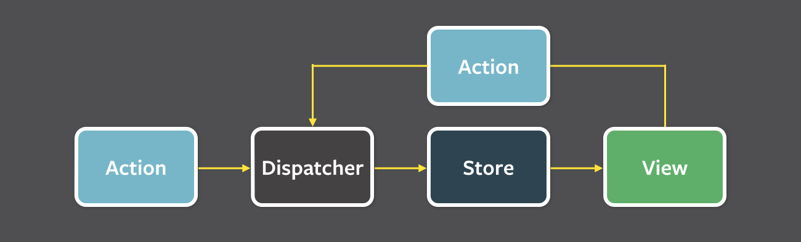

# 5. 리액트와 상태 관리 라이브러리

**상태 관리는 왜 필요하고 어떻게 작동하는가**

<br>

## 5.1 상태 관리는 왜 필요한가?

### ✨ 웹 내부에서 상태란 어떠한 의미를 지니고 지속적으로 변경되는 값을 의미

- 상태는 웹의 발전에 따라 다양해지고 있으며 이를 효율적으로 관리하는 방법을 고민해야 한다.

<br>

### 5.1.1 리액트 상태 관리의 역사

---

### 🔖 Flux 패턴의 등장

- `Context API` 가 나오기 전까지는 이렇다할 상태관리에 관련된 기능이 없었다.

- 웹 앱이 발전함에 따라 복잡성이 증가했고, 이러한 문제의 원인이 '양방향 바인딩' 으로 귀결되었다.

  ❗뷰(HTML)과 모델(JS) 서로가 서로를 변경 가능하여 데이터의 복잡성과 관리 난이도가 증가

<br>

- 때문에 이를 완화하고자 단방향 데이터의 흐름을 제안하였다. (Flux 패턴)



- 액션(action) : 작업 처리 액션 및 액션에 포함할 데이터, 각각 정의하여 디스패치로 보냄

- 디스패처(dispatcher) : 액션을 스토어로 보내는 역할, 콜백 함수 형태로 액션 관련 요소를 스토어로 보냄

- 스토어(store) : 실제 상태에 따른 값과 상태 변경 메서드 보유, 액션 타입에 따라 변경 여부 정의

- 뷰(view) : 컴포넌트에 해당하는 부분, 스토어의 데이터를 통해 화면 렌더링 및 자체적인 액션 호출을 통해 상태 업데이트 또한 가능

<br>

☝️ 물론 사용자 입력에 따른 상태 갱신과 코드의 양 증가로 수고로운 점은 존재

### ✋ BUT!!

👍 데이터가 한방향으로 흐르므로 추적이 쉽고 코드 이해가 용이

<br>

### 🔖 시장 지배자 리덕스의 등장

- Flux가 리액트를 씹어먹을 무렵 얍삽하게 Flux 구조 표현 및 Elm 아키텍쳐 도입으로 시장 선점

```jsx
// 액션은 상태 변경을 위한 정보를 담고 있는 객체
export const increment = () => {
  return {
    type: "INCREMENT",
  };
};

export const decrement = () => {
  return {
    type: "DECREMENT",
  };
};

const initialState = {
  count: 0,
};

// 리듀서는 액션을 기반으로 새로운 상태를 반환하는 함수
const counterReducer = (state = initialState, action) => {
  switch (action.type) {
    case "INCREMENT":
      return {
        ...state,
        count: state.count + 1,
      };
    case "DECREMENT":
      return {
        ...state,
        count: state.count - 1,
      };
    default:
      return state;
  }
};

// 스토어는 리덕스 상태 트리를 담고 있는 객체
import { createStore } from "redux";
import counterReducer from "./reducer";

const store = createStore(counterReducer);

export default store;
```

- 모델(상태)와 뷰(HTML), 업데이트(모델 수정)의 콜라보

- `Elm` 은 데이터 흐름을 세가지로 분류 및 단방향으로 강제해 상태를 안정적으로 관리 유도

- 글로벌 상태 객체를 통해 `props drilling` 를 해결하고 간단한 상태 접근이 가능해 많은 사랑을 받았다. (현재진행형)

❗하지만 하나의 상태 관리만으로도 수행해야 할 작업이 너무 많았다.

<br>

### 🔖 Context API, useContext

- 너무 복잡했던 리덕스를 대체하기 위해 리액트에서 자체적으로 개발한 상태 주입용 API

```jsx
import React, { createContext, useState } from "react";

// Context 생성
export const ThemeContext = createContext();

// Context Provider 정의
export const ThemeProvider = ({ children }) => {
  const [theme, setTheme] = useState("light");

  const toggleTheme = () => {
    setTheme((prevTheme) => (prevTheme === "light" ? "dark" : "light"));
  };

  return <ThemeContext.Provider value={{ theme, toggleTheme }}>{children}</ThemeContext.Provider>;
};

// Provider 사용
const App = () => {
  return (
    <ThemeProvider>
      <div>
        <ThemeToggler />
        <ThemeDisplay />
      </div>
    </ThemeProvider>
  );
};

// Context 사용
const ThemeToggler = () => {
  const { theme, toggleTheme } = useContext(ThemeContext);

  return <button onClick={toggleTheme}>Toggle to {theme === "light" ? "dark" : "light"} theme</button>;
};
```

- `props drilling` 을 효과적으로 방지하지만 결국 상태 관리에 목적을 두지 않기 때문에 사용 시 유의해야한다.

<br>

### 🔖 훅의 탄생과 React Query, SWR

- 훅과 함수형 컴포넌트의 간단한 상태값 관리에 따라 상태 관리 라이브러리 또한 변화했다.

- 이 중 가장 각광받은 것이 바로 `React Query` 와 `SWR` 이다.

```jsx
const { data, isLoading, isError } = useQuery({
  queryKey: ["test"],
  queryFn: getTestData,
});

// 로딩중
if (isLoading) {
  return <div>Loading...</div>;
}

// 에러
if (isError) {
  return <div>Error fetching data</div>;
}

const postWriteData = async () => {
  // 생략
};

const mutation = useMutation({
  mutationFn: postWriteData,
  onMutate() {
    console.log("mutation 실행 전");
  },
  onSuccess(data) {
    console.log(data);
  },
  onError(err) {
    console.error(err);
  },
  onSettled() {
    console.log("finally 처럼 마지막에 실행");
  },
});
```

- `React Query` 의 경우, `useQuery` 와 `useMutation` 을 통해 데이터 페칭과 더불어 해당 상태값을 간결하고 효율적으로 관리

<br>

### 🔖 Recoil, Zustand, Jotai, Valtio 에 이르기까지

- 훅을 활용해 상태를 가져오고 관리하는 다양한 라이브러리

<br>

### 최근 각광받는 `Zustand`에 대해 알아보자

- 표면적으로 인기있는 이유는 API가 간단하며, 효율적으로 리렌더링하고 미들웨어를 지원한다.

```jsx
// src/store.js
import create from "zustand";

const useStore = create((set) => ({
  count: 0,
  increase: () => set((state) => ({ count: state.count + 1 })),
  decrease: () => set((state) => ({ count: state.count - 1 })),
}));

export default useStore;

// src/App.js
import React from 'react';
import useStore from './store';

const Counter = () => {
  const { count, increase, decrease } = useStore();

  return (
    <div>
      <h1>{count}</h1>
      <button onClick={increase}>Increase</button>
      <button onClick={decrease}>Decrease</button>
    </div>
  );
};

const App = () => {
  return (
    <div>
      <h1>Zustand Counter Example</h1>
      <Counter />
    </div>
  );
};

export default App;
```

<br>

### 5.1.2 책 정리 + 주관적인 정리

---

### 🔖 책 정리

- 상태 관리 라이브러리를 잘 뜯어본다면 더욱 성장할 수 있는 계기가 될 것이다.

### 🏷️ 주관적인 정리

- 단순히 상태 관리 라이브러리에 대해 막연히 알고만 있었는데, 이번 계기로 조금 더 자세하게 알 수 있어서 좋았다.

- 함수형 컴포넌트와 훅에 등장에 따라 변화한 상태 관리 라이브러리의 동작 원리와 로직에 대한 흥미가 생겼다.

<br>

## 5.2 리액트 훅으로 시작하는 상태 관리

### ✨ 함수 컴포넌트의 패러다임과 더불어 내부 상태 관리에 용이한 라이브러리를 알아보자

<br>

### 5.2.1 가장 기본적인 방법 : useState와 useReducer

---

- `useState` 를 활용한 갖가지 커스텀 훅을 통해 내부(지역) 상태 관리를 쉽고 안정적으로 할 수 있게 되었다.

```jsx
import { useState } from "react";

const useCounter = (initialValue = 0) => {
  const [count, setCount] = useState(initialValue);

  const increment = () => setCount((prevCount) => prevCount + 1);
  const decrement = () => setCount((prevCount) => prevCount - 1);
  const reset = () => setCount(initialValue);

  return { count, increment, decrement, reset };
};

export default useCounter;
```

- 각각의 컴포넌트에서 이를 사용하면 컴포넌트마다 각각 다른 상태를 사용할 수 밖에 없다.

- 부모 컴포넌트에서 한번 사용하고 이를 각각의 `props` 로 내려주는 방식을 채택하면 야매적으로 전역 상태 관리 느낌을 낼 수 있다.

<br>

### 5.2.2 지역 상태의 한계를 벗어나보자 : useState의 상태를 바깥으로 분리하기

### 🔖 useState가 리액트 클로저가 아닌 완전히 다른 곳에서 초기화 및 관리된다면?

- 단순히 외부에 정의해놓고 사용한다면, 리액트의 가장 기본적인 리렌더링 원칙을 지키지 않아 리렌더링이 실행되지 않는다.

- 외부에 정의한 것을 내부에서 또 상태값으로 정의하는 방법도 있겠지만, 애초에 의미가 없을 듯 하다.

### ✨ 위 조건을 다 충족시키는 새로운 상태 관리 코드

- `store` 로 정의한 상태값과 변경을 알리는 `callback`, 이를 등록할 `subscribe` 함수가 필요

```jsx
// 외부 상태 관리 시스템

// createStore: 초기 상태를 매개변수로 받아 상태 관리 시스템을 생성
const createStore = (initialState) => {
  // state: 현재 상태를 저장
  let state = initialState;
  // listeners: 상태 변경 시 호출할 콜백 함수들을 저장하는 Set
  const listeners = new Set();

  // getState: 현재 상태를 반환
  const getState = () => state;

  // setState: 상태를 새로운 값으로 업데이트하고, 모든 구독된 콜백 함수를 호출
  const setState = (newState) => {
    state = newState;
    listeners.forEach((listener) => listener(state));
  };

  // subscribe: 상태 변경 시 호출할 콜백 함수를 추가, 이 함수는 구독을 해제하는 함수를 반환
  const subscribe = (listener) => {
    listeners.add(listener);
    return () => listeners.delete(listener);
  };

  return {
    getState,
    setState,
    subscribe,
  };
};

// 사용 예시

// 초기 상태
const initialState = { count: 0 };

// store 생성
const store = createStore(initialState);

// 상태 변경 시 호출할 콜백 함수
const handleStateChange = (newState) => {
  console.log("상태가 변경되었습니다:", newState);
};

// 상태 변경 구독
const unsubscribe = store.subscribe(handleStateChange);

// 상태 변경
store.setState({ count: store.getState().count + 1 });

// 구독 해제
unsubscribe();

// 상태 변경 (구독 해제 후에는 콜백이 호출되지 않음)
store.setState({ count: store.getState().count + 1 });
```

### 🏷️ 사용 예시

- initialState: 초기 상태를 정의

- store: 상태 관리 시스템을 생성

- handleStateChange: 상태 변경 시 호출할 콜백 함수를 정의

- store.subscribe: 상태 변경을 구독

- store.setState: 상태를 변경

- unsubscribe: 상태 변경 구독을 해제

### 🔖 Store를 사용해 컴포넌트 렌더링을 유도할 커스텀 훅

```jsx
const useStore = (store) => {
  const [state, setState] = useState(store.getState());

  useEffect(() => {
    const unsubscribe = store.subscribe((newState) => {
      setState(newState);
    });

    return () => {
      unsubscribe();
    };
  }, [store]);

  return state;
};
```

### 🏷️ 사용 예시

- 인수로 사용할 `store` 받기

- `useState` 를 통해 스토어 값을 초기값으로 상태값 생성

- `useEffect` 를 통해 `subscribe` 등록 -> `store` 값이 변경될 때마다 구독된 함수를 실행하여 `state`의 값 변경 보장

- 클린업 함수로 `unsubscribe` 를 등록하여 `callback` 이 계속 쌓이는 현상 방지

### ❗스토어의 구조가 객체값이라면?!

- 객체의 일부만 변경되더라도 객체 주소가 변경되므로 리렌더링이 계속 일어난다.

- `selector` 를 정의하여 가져오고 싶은 값을 선택하도록 유도할 수 있다.

<br>

### 5.2.3 useState와 Context를 동시에 사용해보기

- 앞에서 만든 훅과 스토어는 반드시 하나의 스토어당 한가지 값만 가지게 된다.

- 여러개 만들 수도 있겠지만 좀 귀찮다..😂

### 👍 스토어와 context를 함께 사용하여 상태관리 로직을 만들어보자

```jsx
import React, { createContext, useContext, useState } from "react";

// 스토어 생성 함수
const createStore = (initialState) => {
  const StoreContext = createContext();

  const StoreProvider = ({ children }) => {
    const [state, setState] = useState(initialState);

    const updateState = (newState) => {
      setState((prevState) => ({ ...prevState, ...newState }));
    };

    return <StoreContext.Provider value={{ state, updateState }}>{children}</StoreContext.Provider>;
  };

  const useStore = () => {
    const context = useContext(StoreContext);
    if (!context) {
      throw new Error("useStore must be used within a StoreProvider");
    }
    return context;
  };

  return { StoreProvider, useStore };
};

// 초기 상태 정의
const initialState = {
  count: 0,
};

// 스토어 생성
const { StoreProvider, useStore } = createStore(initialState);

export { StoreProvider, useStore };
```

- `createStore` 함수를 통해 스토어를 생성하고 `createStore` 함수는 초기 상태를 받고, 해당 상태를 관리하는 `StoreProvider` 와 `useStore` 훅을 반환

- `useStore` 훅은 컨텍스트에서 상태와 상태 업데이트 함수를 가져와, 컴포넌트에서 이를 쉽게 사용

- `StoreProvider`: 애플리케이션의 상위 컴포넌트에서 상태를 제공하는 컨텍스트 공급자이며 모든 하위 컴포넌트는 이 공급자 안에서 상태에 접근 가능

- `useStore`: 스토어 컨텍스트에서 상태와 상태 업데이트 함수를 반환하는 커스텀 훅이며 컴포넌트에서 이 훅을 사용하여 상태를 가져오고 업데이트 가능

```jsx
import React from "react";
import { StoreProvider, useStore } from "./store";

const Counter = () => {
  const { state, updateState } = useStore();

  const increment = () => updateState({ count: state.count + 1 });
  const decrement = () => updateState({ count: state.count - 1 });

  return (
    <div>
      <p>Count: {state.count}</p>
      <button onClick={increment}>Increment</button>
      <button onClick={decrement}>Decrement</button>
    </div>
  );
};

const App = () => (
  <StoreProvider>
    <Counter />
  </StoreProvider>
);

export default App;
```

- `StoreProvider` 는 상태와 상태를 업데이트하는 `updateState` 함수를 제공하고 애플리케이션의 상위 컴포넌트에서 이를 감싸는 형태로 사용

<br>

### 5.2.4 상태 관리 라이브러리 Recoil, Jotai, Justand 살펴보기

🔖 최근 들어 각광받고 있는 세가지 라이브러리에 대해 알아보자

### 🏷️ 페이스북이 만든 상태 관리 라이브러리 Recoil

- 훅의 개념으로 상태 관리를 시작한 최초의 라이브러리 중 하나

- 상태 개념인 `Atom` 을 선보임

- Recoil의 핵심 구조인 `RecoilRoot`, `atom`, `useRecoilValue`, `useRecoilState` 에 대해 알아보자

```jsx
// RecoilRoot
function App() {
  return (
    // RecoilRoot로 최상위 컴포넌트를 감싸야 한다.
    <RecoilRoot>
      <MyComponent />
    </RecoilRoot>
  );
}
```

- `Recoil` 에서 생성되는 상태값을 저장하기 위한 스토어를 생성한다.

- `useStoreRef` 를 통해 상태값을 저장하는 조상 스토어의 존재를 확인한다.

- 스토어는 크게 스토어 아이디를 가져오는 `getNextStoreID()`, 값을 가져오는 `getState`, 값을 수정하는 `replaceState` 로 이루어진다.

- 앞서 구현한 스토어와 비슷하게 로직이 짜여져있다. (상태 전파값에 의존하여 콜백 실행 등)

<br>

```jsx
// atom
import { atom } from "recoil";

const countState = atom({
  key: "countState", // 각 atom의 고유한 식별자
  default: 0, // 초기 상태 값
});
```

- `atom` 은 `Recoil` 의 기본 단위이며, 상태의 일부를 나타내고 이를 읽고 쓸 수 있는 단일 조각이다.

- `key`와 `default` 값을 설정하여 생성한다.

<br>

```jsx
// useRecoilValue
import { useRecoilValue } from "recoil";
import { countState } from "./state"; // countState atom을 정의한 파일을 임포트

function CounterDisplay() {
  const count = useRecoilValue(countState); // countState의 현재 값을 읽음
  return <div>Count: {count}</div>;
}
```

- 주어진 `atom` 이나 `selector` 의 값을 읽기 위해 사용한다.

<br>

```jsx
// useRecoilState
import { useRecoilState } from "recoil";
import { countState } from "./state";

function Counter() {
  const [count, setCount] = useRecoilState(countState); // countState의 현재 값을 읽고, 업데이트 함수를 제공
  const increment = () => setCount(count + 1);

  return (
    <div>
      <p>Count: {count}</p>
      <button onClick={increment}>Increment</button>
    </div>
  );
}
```

- 조금더 `useState` 와 비슷한 훅이며, 상태 값과 상태를 업데이트하는 함수를 반환한다.

### 👍 간단한 사용법

- `<RecoiRoot />` 를 선언해 스토어를 만든다.

- `atom` 단위값을 등록한다.

- `atom` 의 `key` 를 바탕으로 상태 변화를 구독하고 상태를 읽거나 변경하여 최신 `atom` 값을 가져와 컴포넌트를 리렌더링한다.

<br>

### 🏷️ 조타이~

- 기본적으로 `atom` 에 영감을 받아 만들어진 라이브러리

- 기본적으로 상향식 접근법을 취하며, 이는 `Context` 의 불필요 리렌더링을 방지하고자 의도한 것

- 메모이제이션과 같은 최적화를 거치지 않아도 리렌더링이 발생하지 않도록 설계

```jsx
// atom
import { atom } from "jotai";

// 아톰 정의
export const countAtom = atom(0);
```

- 조금 더 간단하게, `Jotai` 의 `atom`은 `key` 를 넘겨주지 않아도 되며, `config` 라는 객체를 반환하여 `init`, `read`, `write`를 통해 사용한다.

```jsx
// CounterDisplay.js
import React from "react";
import { useAtomValue } from "jotai";
import { countAtom } from "./state";

const CounterDisplay = () => {
  const count = useAtomValue(countAtom);

  return <p>Count: {count}</p>;
};

export default CounterDisplay;
```

- `useAtomValue` 를 통해 `Provider` 없이 기본 스토어를 루트에 생성해 값을 읽어들이거나, `atom` 자체의 값을 키로서 저장해 매핑하고 사용하기도 한다.

- 또한 리렌더링을 위해 사용하는 `rerenderIfChanged` 를 통해 `atom` 의 값이 변경되는 경우 `useAtomValue` 를 사용하는 쪽에선 언제든 최신 렌더링이 가능하다.

```jsx
import React from "react";
import { useAtom } from "jotai";
import { countAtom } from "./state";

const Counter = () => {
  const [count, setCount] = useAtom(countAtom);

  return (
    <div>
      <p>Count: {count}</p>
      <button onClick={() => setCount(count + 1)}>Increment</button>
      <button onClick={() => setCount(count - 1)}>Decrement</button>
    </div>
  );
};

export default Counter;
```

- `useState` 와 동일한 형태의 배열을 반환하고 동작도 비슷하다.

### 👍 간단한 사용법

- `atom` 이라는 API를 사용하는데, 컴포넌트 외부에서도 선언할 수 있다.

- 또한 함수를 인수를 받을 수 있어 다른 `atom` 으로부터 `atom` 을 만들 수 있다.

- `useAtom`, `useAtomValue` 를 사용해 용도에 맞는 다양한 작업을 할 수 있다.

<br>

### 🏷️ 작고 빠르며 확장에도 유연한 Zustand

- 리덕스에 영감을 받아 만들어졌으며, 하나의 스토어를 중앙 집중형으로 활용해 내부에서 상태를 관리한다.

```jsx
import create from "zustand";

// Zustand 스토어 생성
const useStore = create((set) => ({
  count: 0,

  // 상태 변경 함수 : partial과 replace로 나누어짐
  setState: {
    partial: (newState) => set((state) => ({ ...state, ...newState })),
    replace: (newState) => set(() => newState),
  },

  // 구독 및 리스너 관리
  subscribe: (listener) => {
    const listeners = new Set();
    listeners.add(listener);

    // 상태 변경 시 리스너 호출
    const unsubscribe = () => {
      listeners.delete(listener);
    };

    return unsubscribe;
  },

  // 리스너 초기화 함수
  destroy: () => {
    // ...
  },
}));

const store = useStore;

const createStore = () => ({
  getState: () => store.getState(),
  setState: store.setState,
  subscribe: store.subscribe,
  destroy: store.destroy,
});

export default createStore;
```

- 기본적으로 방식은 비슷하나, `partial` 과 replace` 로 나누어져 값의 일부분이나 값 자체 변경을 원하는 대로 할 수 있도록 구현했다.

- `getState` 나 `listener` 등을 보면 상태값 변경 후 리렌더링 필요 컴포넌트에 값을 전파하기 위해 만들어졌음을 알 수 있다.

- 리액트 프레임워크와 독립적으로 구성되어 바닐라 자바스크립트에서도 사용 가능하다.

### 👍 간단한 사용법

```jsx
import React from "react";
import createStore from "./store";

const store = createStore();

const Counter = () => {
  const { count } = store.getState();
  const increase = () => store.setState.partial({ count: count + 1 });
  const decrease = () => store.setState.partial({ count: count - 1 });

  // 상태 변경 구독
  React.useEffect(() => {
    const unsubscribe = store.subscribe(() => {
      // 상태가 변경되면 다시 렌더링
      console.log("State changed:", store.getState());
    });
    return () => unsubscribe();
  }, []);

  return (
    <div>
      <p>Count: {count}</p>
      <button onClick={increase}>Increase</button>
      <button onClick={decrease}>Decrease</button>
    </div>
  );
};
```

- `createStore` 를 통해 스토어를 만들고, 컴포넌트 내부에서 사용 가능한 훅을 받는다.

- 이를 통해 `getter`, `setter` 모두에 접근해 사용 가능하다.

- 리액트 컴포넌트 외부에 store를 만드는 것도 가능하다. (리액트 코드와 연관없기 때문)

- `d.ts` 이슈 없이 자연스럽게 타입스크립트 사용도 가능하며 미들웨어도 지원한다.

- 개인적으로 `Zustand` 는 익숙하기도 하고 마음에 들어 따로 공부하고 싶다.

- [Zustand로 리액트 상태 관리하기](https://velog.io/@mjieun/React-Zustand-%EB%9D%BC%EC%9D%B4%EB%B8%8C%EB%9F%AC%EB%A6%AC%EB%A5%BC-%EC%82%AC%EC%9A%A9%ED%95%98%EC%97%AC-%EC%83%81%ED%83%9C-%EA%B4%80%EB%A6%AC%ED%95%98%EA%B8%B0-JavaScriptTypeScript)

<br>

### 5.2.5 책 정리 + 주관적인 정리

---

### 🔖 책 정리

- 리액트에서 리렌더링을 일으키는 방식은 한정되어 있기 때문에 결국 라이브러리의 개발 로직이 조금씩 다르더라도 궁극적인 목적은 같다.

- 빠르게 변화하는 리액트 생태계에 발빠르게 대처하는 라이브러리를 선택하는 것이 좋다.

### 🏷️ 주관적인 정리

- 상태 관리 라이브러리 자체에 익숙하지 않다보니 겁나 생소하기도 하고 이해하기 힘들었다. (사실 지금도 이해는 잘 안된다.)

- 최근 프로젝트 진행하면서 상태 관리 라이브러리에 대한 것도 팀원들과 많이 얘기했었는데, 이번 기회에 사용해보면 좋을 듯 하다.
