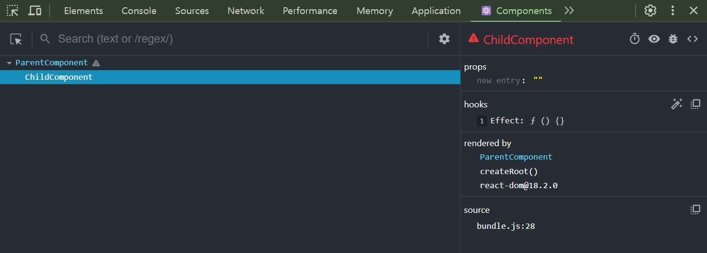
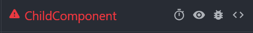
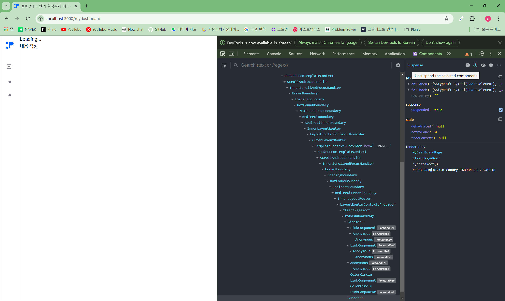
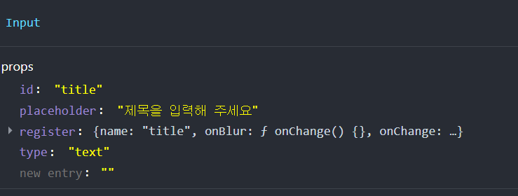
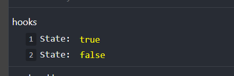
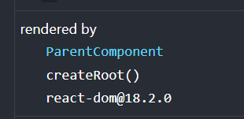
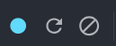
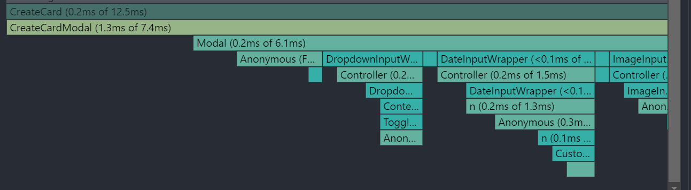

# 06장: 리액트 개발 도구로 디버깅하기

모든 프로그래밍에서 중요한 것이 바로 디버깅이다.
이번 장에서는 리액트로 개발된 애플리케이션의 디버깅을 돕기 위한 리액트 개발 도구인 react-dev-tools에 대해 살펴본다.

## 6.3 리액트 개발 도구 활용하기

리액트 개발 도구가 설치되면 개발자 도구에서 Components와 Profiler가 추가된 것을 확인할 수 있다.

### Components

Components 탭에서는 현재 리액트 애플리케이션의 컴포넌트 트리를 확인할 수 있다.
단순히 컴포넌트의 구조뿐만 아니라 props와 내부 hooks 등 다양한 정보를 확인할 수 있다.



#### 컴포넌트 트리

해당 리액트 페이지의 컴포넌트 트리를 나타낸다.
만약 컴포넌트가 익명 함수로 선언되었다면 리액트 개발 도구에서 함수의 명칭을 추론할 수 없다.

```tsx
const MemoizedComponent = memo(() => <>MemoziedComponent</>);

const withSampleHOC(Component: ComponentType) => {
  return function() {
    return <Component />
  }
}
```

이를 해결하고 싶다면 함수를 기명 함수로 바꾸거나 함수에 displayName 속성을 추가하자.

#### 컴포넌트 도구



##### 스탑워치 아이콘

Suspense로 감싸진 컴포넌트에 대해 잠시 렌더링을 일시 중단한다.

Suspense 내부의 작업이 너무 빨리 처리가 되어 fallback을 확인하지 못할 때 활용하면 좋을 것 같다.

```tsx
<Suspense fallback={<div>Loading...</div>}>
  <DashBoardHeader isDashboard />
</Suspense>
```



##### 눈 아이콘

해당 컴포넌트가 HTML의 어디에서 렌더링됐는지 확인할 수 있다.

##### 버그 아이콘

콘솔 탭에서 해당 컴포넌트에 대한 정보를 확인할 수 있다.

##### 소스코드 아이콘

해당 컴포넌트의 소스코드를 확인할 수 있다.

#### 컴포넌트 props



#### 컴포넌트 hooks

리액트 개발자 도구에서 볼 수 있는 훅 목록이다.

- State: useState
- Reducer: useReducer
- Context: useContext
- Memo: useMemo
- Callback: useCallback
- Ref: useRef
- id: useId
- LayoutEffect: useLayoutEffect
- Effect: useEffect
- 커스텀 훅



리액트는 각각의 hook을 식별자로 구분하지 않는다.
hook이 실행될 때의 순서를 통해 기억한다.
따라서 리액트 hook은 항상 모든 렌더링마다 같은 순서대로 실행되어야 하고,
순서가 바뀔 수 있는 반복문이나 조건문 안에서 사용할 수 없다.

#### rendered by

해당 컴포넌트를 렌더링한 주체가 누구인지 확인할 수 있다.
프로덕션 모드에서는 react-dom의 버전만 확인할 수 있지만 개발 모드에서는 해당 컴포넌트를 렌더링한 부모 컴포넌트까지 확인할 수 있다.



### 프로파일러

프로파일러는 리액트가 **렌더링하는 과정에서 발생하는 상황을 확인하기 위한 도구다.**

_프로덕션 빌드로 실행되는 리액트 애플리케이션에서는 사용할 수 없다._

#### 설정

- Highlight updates when components render: 컴포넌트가 렌더링될 때마다 해당 컴포넌트에 하이라이트를 표시한다.
- Hide logs during second render in Strict Mode: 리액트 애플리케이션이 엄격 모드에서 실행되는 경우, 원활한 디버깅을 위해 useEffect 등이 두 번씩 작동하는 의도적인 작동이 숨겨져 있다. 이로 인해 useEffect 안의 console.log가 두 번씩 찍히기도 하는데, 이를 막을 수 있다.

#### 프로파일링

##### 프로파일링 메뉴



첫 번째 버튼은 프로파일링 시작 버튼으로 누르면 적색 동그라미로 바뀌며,
다시 누르면 프로파일링이 중단되고 결과가 나타난다.

두 번째 버튼은 웹페이지가 새로고침되면서 이와 동시에 프로파일링이 시작된다.
새로고침이 끝난다고 해서 프로파일링이 중단되지는 않는다.

세 번째 버튼은 프로파일링 종료 버튼으로 현재 내용을 모두 지우는 버튼이다.

##### Flamegraph

Flamegraph 탭에서는 렌더 커밋별로 어떠한 작업이 일어났는지 나타낸다.
너비가 넓을수록 해당 컴포넌트를 렌더링하는 데 오래 걸렸다는 것을 의미한다.
렌더링이 가장 오래 걸리는 컴포넌트는 모든 컴포넌트를 렌더링해야 하는 루트 컴포넌트다.



##### Ranked

해당 커밋에서 렌더링하는데 오랜 시간이 걸린 컴포넌트를 순서대로 나열한 그래프다.
앞선 Flamegraph와의 차이점은 모든 컴포넌트를 보여주는 것이 아니라 단순히 렌더링이 발생한 컴포넌트만 보여준다는 데 있다.

##### 타임라인

Timeline에서는 시간이 지남에 따라 컴포넌트에서 어떤 일이 일어났는지를 확인할 수 있다.

## 정리

리액트 개발 도구를 활용하면 정적으로 생성된 컴포넌트 트리를 보는 것에서부터 프로파일링을 통해 리액트 애플리케이션이 어떤 식으로 작동하는지, 불필요한 리렌더링이 일어나고 있는지 등을 확인할 수 있다.

따라서 애플리케이션을 개발하면서 틈틈이 리액트 개발 도구로 원하는 대로 렌더링되고 있는지, 최적화는 잘 되고 있는지 확인해보자.

---

### 새로 알게된 개념

- Components와 Profiler 탭 사용 방법
