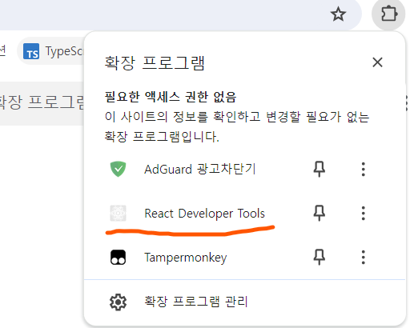
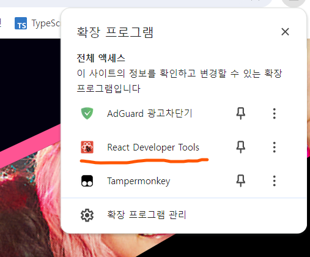
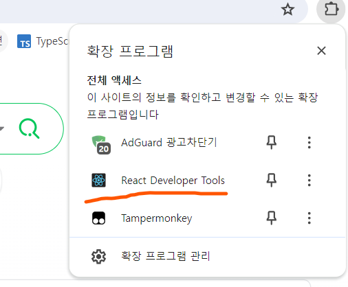
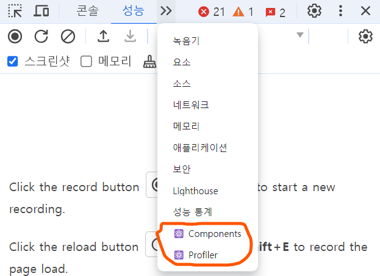
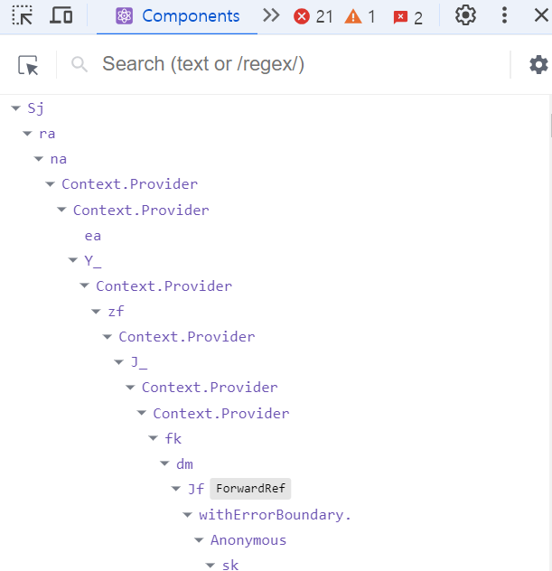
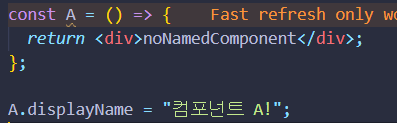
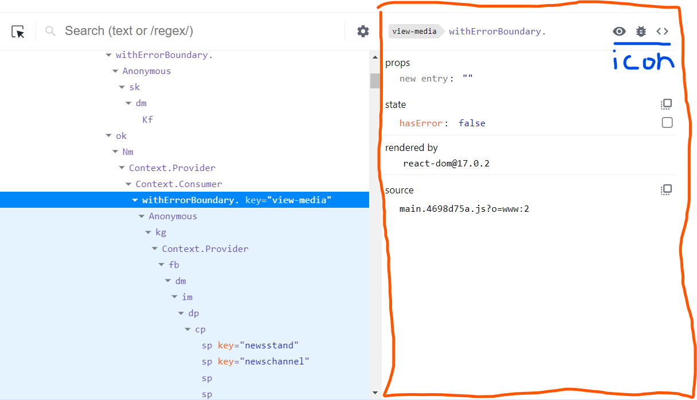
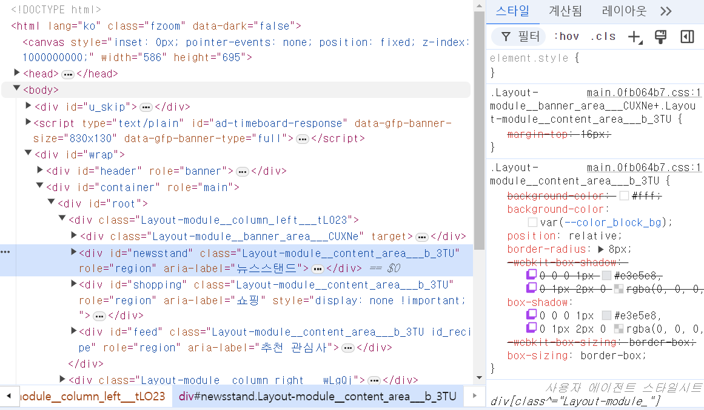
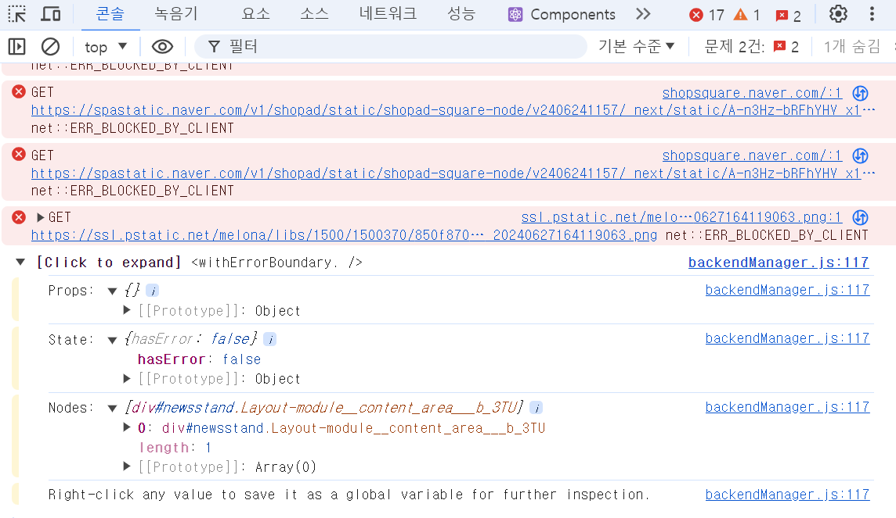
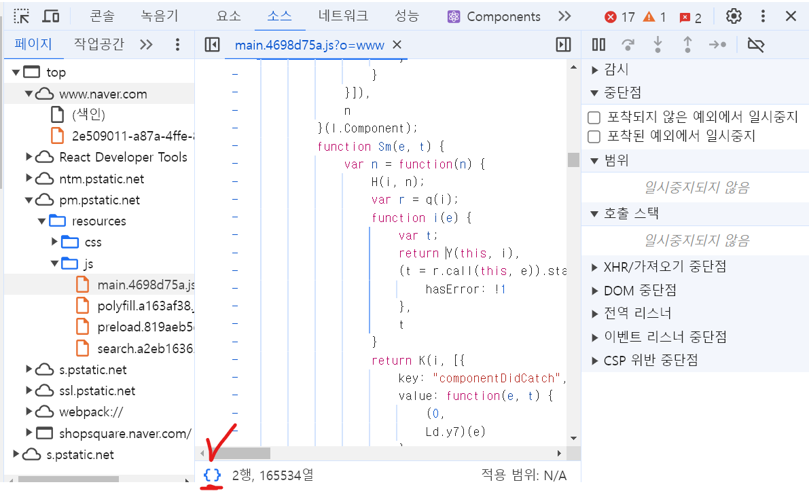

# 11회차

# 6장

잘못된 코드들을 react-dev-tools를 사용해서 디버깅해보자.

## 리액트 개발 도구란?

리액트 팀에서 제공하는 개발 도구인 react-dev-tools를 사용해보자.

## 리액트 개발 도구 설치

크롬, 파이어폭스, 마이크로스프트 엣지에서 react-dev-tools를 확장 도구로 지원함.  
크롬 기준으로 알아보자.

**회색으로 표시될 경우**

- 접근할 수 없는 페이지
- 리액트로 개발되지 않은 페이지

**붉게 빛나는 경우**

- 리액트로 만든 앱을 개발 모드로 실행 시킴.  
  => 정상적으로 접근 가능.

**파랗게 빛나는 경우**

- 리액트로 만들고, 잘 배포된 앱을 방문.

## 리액트 개발 도구 활용하기

개발자 모드를 들어가서 추가된 메뉴들을 살펴보자.  
  
Components와 Profiler 메뉴가 새로 생겼다.  
얘네만 있으면 리액트 작동은 식은죽 먹기임.

### 컴포넌트

Components 탭에서는 컴포넌트 트리로 현재 앱의 컴포넌트 구조, props, hooks 등을 확인 가능.  

#### 컴포넌트 트리

- 익명 함수를 default로 export해서 사용할 경우, \_default로 표시됨.(이렇게 쓰면 렌더링에 안뜨던데요?? 해보신분?)
- memo를 사용해 익명 함수를 감싸면 \_c3
- 고차 컴포넌트로 익명 함수를 감싸면 \_c5

  
개발자 도구에서 표기될 이름을 displayName을 통해 정해줄 수 있음.

원활한 디버깅을 위해서 기명 함수를 쓰자.  
=> 빌드시에는 **terser**로 인해 난수화가 되므로 개발 모드에서만 참고하자.

- **terser**: 번들 파일을 압축해서 용량을 줄여주는 좋은 친구.

#### 컴포넌트명과 props

왼쪽에서 컴포넌트 선택 시, 오른쪽에서 해당 컴포넌트에 대한 정보를 자세히 표시해줌.  
파란 밑줄이 그어진 3개의 아이콘들에 대해 알아보자.

- 첫 번째 눈 아이콘

  - 컴포넌트가 HTML 어디에서 렌더링돼는지 볼 수 있음.
  - 누르면 요소 탭으로 즉시 이동 => HTML 요소가 선택됨.  
    

- 두 번째 벌레 아이콘

  - 컴포넌트의 정보가 콘솔 탭에 뜸.
  - 받는 props, 내부에서 쓰는 props, 컴포넌트의 HTML요소 node 순으로 기록됨.
  - 복사하는 용도로 좋음.  
    

- 세 번째 소스코드 아이콘
  - 컴포넌트의 소스코드 확인 가능.
  - {}를 눌러서 읽기 쉬운 형태로 살펴보자.  
    

**컴포넌트 props**  
해당 컴포넌트가 받는 props 확인 가능.  
<video controls src="화면 녹화 중 2024-07-01 064224.mp4" title="Title"></video>

- Copy value to Clipboard
  => props 정보를 클립보드로 복사

- Store as Global variable  
  => window.$r에 복사, 콘솔로 이동해서 정보 열람 가능.

- Go to definition(함수인 props만 뜸)  
  => 해당 함수가 선언된 코드로 이동, 더블클릭으로 수정도 가능.
