# [6장] 리액트 개발 도구로 디버깅하기

## 6.1 리액트 개발 도구란?

**React Dev Tools**

- 리액트로 만들어진 다양한 애플리케이션을 디버깅하기 위해 만들어졌으며, 리액트 웹 뿐만 아니라 리액트 네이티브 등 다양한 플랫폼에서 사용할 수 있다.

## 6.2 리액트 개발 도구 설치

[React Developer Tools – React](https://ko.react.dev/learn/react-developer-tools)

## 6.3 리액트 개발 도구 활용하기

**✨컴포넌트**

- 리액트 애플리케이션의 컴포넌트 트리를 확인할 수 있다.
- 단순히 컴포넌트 구조뿐만 아니라 props와 hooks 등 다양한 정보를 확인할 수 있다.

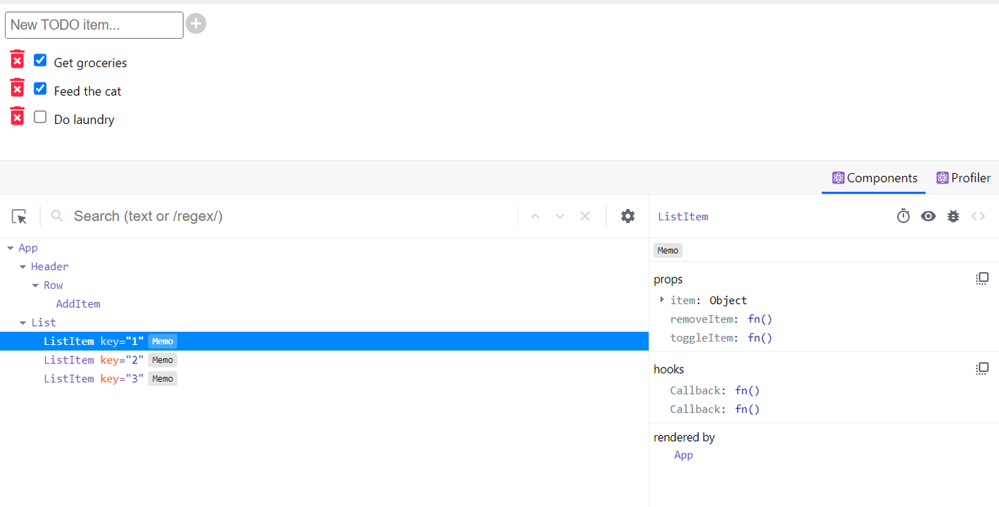

**📍컴포넌트 트리**

- 함수 선언식과 함수 표현식 → 정상적으로 함수명이 표시됨

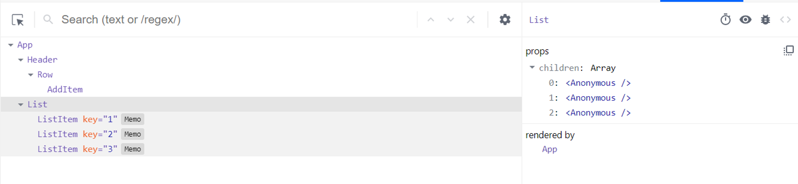

[함수 명칭을 추론할 수 없는 것들]

- 익명 함수를 default로 export → `_default`
- memo를 사용한 익명함수 → `Anonymous`
- 고차 컴포넌트 → `Anonymous`

→ 16.9버전 이후에는 이런 문제들이 일부 해결됐지만(Anonymouse → \_c3, \_c5) 임의로 선언된 명칭으로는 개발 도구에서 컴포넌트를 특정하기 어렵다. <br>
→ **컴포넌트를 기명 함수로 쓰자!!**

> 기명함수로 바꾸기 어렵다면 displayName을 써보자~<br>
> `MomoizedComponent.displayName = “메모 컴포넌트입니다.”`

**✨컴포넌트명과 props**

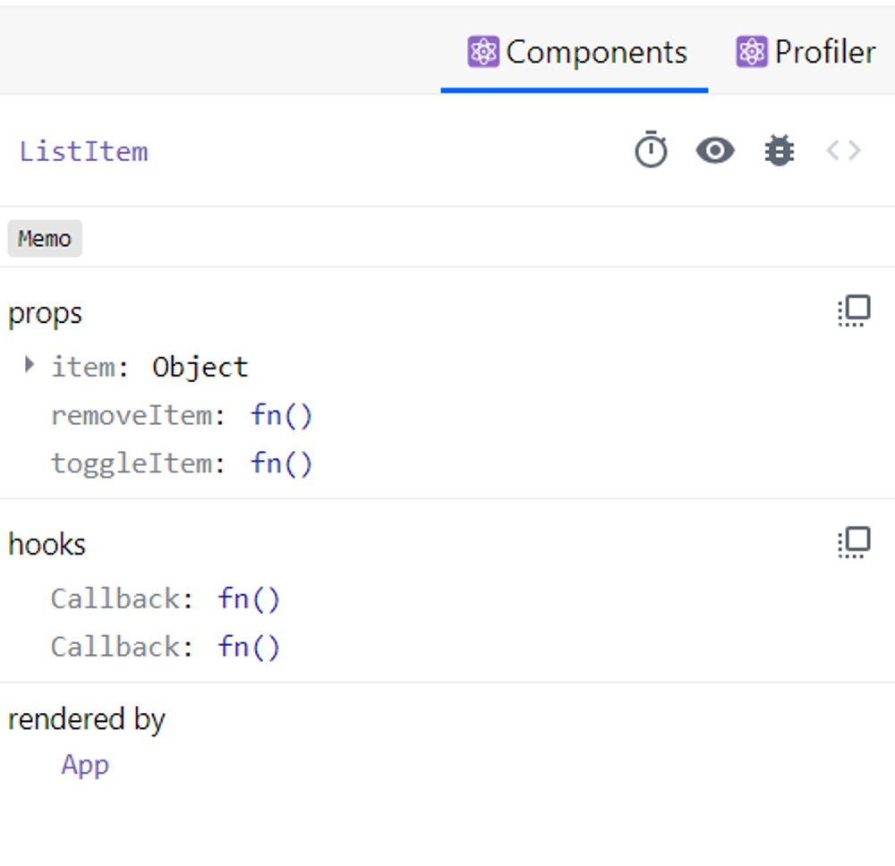

**📍컴포넌트 도구**

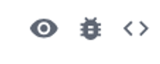

- 눈: 해당 컴포넌트가 HTML의 어디에서 렌더링 됐는지 확인할 수 있다.
- 벌레: 콘솔 탭에 해당 컴포넌트 정보가 clg를 실행해 기록된 것을 확인할 수 있다.

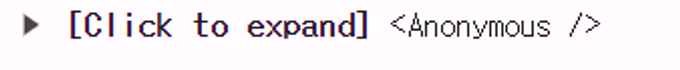

- 소스코드: 해당 컴포넌트의 소스코드를 확인할 수 있다.

**📍컴포넌트 props**

- 해당 컴포넌트가 받은 props 확인 가능
- props 우클릭시) Store as global variable → window.$r에 해당 정보가 담긴다. → 콘솔로 이동하면 해당 변수에 대한 정보가 담겨있다.
- props 클릭시) Go to definition → 해당 함수가 선언됨 코드로 이동한다. + 값을 더블클릭하면 내용 수정 가능하다.

**📍컴포넌트 hooks**

- 컴포넌트에서 사용 중인 훅 정보를 확인할 수 있다.
- use가 생략된 이름으로 나타난다.

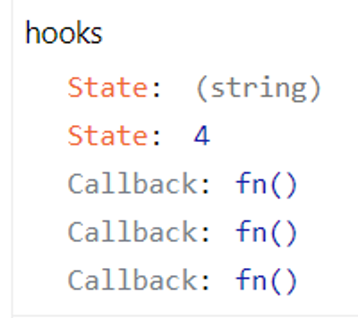

- 훅도 마찬가지로 훅에 넘겨주는 함수를 익명함수 대신 기명함수로 넘겨주면 해당 훅을 실행할 때 실행되는 함수의 이름을 확인할 수 있다.

```tsx
useEffect(function effectOnlyMount() {
  console.log('useEffect')
}, [])
```

**📍컴포넌트를 렌더링한 주체, rendered by**

- 해당 컴포넌트를 렌더링한 주체가 누구인지 확인할 수 있다.

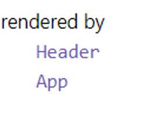

**✨프로파일러**

- 리액트가 렌더링하는 과정에서 발생하는 상황을 확인하기 위한 도구
- 리액트 애플리케이션이 렌더링되는 과정에서 어떤 컴포넌트가 렌더링됐는지, 또 몇 차례나 렌더링이 일어났으며 어떤 작업에서 오래 걸렸는지 등 컴포넌트 렌더링 과정에서 발생하는 일을 확인할 수 있다.

**📍설정 변경하기**

- General)
  컴포넌트가 렌더링될때마다 해당 컴포넌트에 하이라이트를 표시한다.

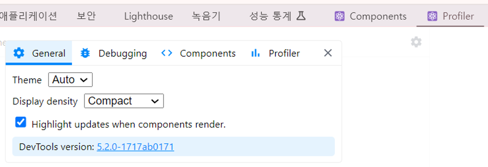

- Debugging - Hide logs during second render in Strict Mode)
  리액트 애플리케이션이 엄격 모드에서 실행되는 경우, 원활한 디버깅을 위해 useEffect 등이 두 번씩 작동한다. → clg가 2번 찍히기도 하는데 이를 막고 싶다면 체크하자.
- Profilter - Record why each component rendered while profiling)
  프로파일링 도중 무엇 때문에 컴포넌트가 렌더링됐는지 기록한다.

**📍프로파일링**

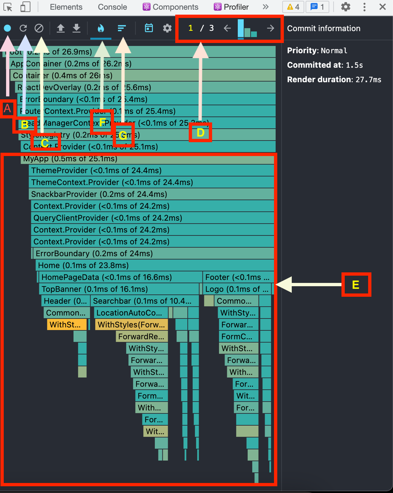

**A**

프로파일링 세션을 녹화하는 데 도움이 되는 녹화 버튼

**B**

새로 고침 버튼으로, 세션 동안 페이지를 새로 고칠 수 있다.

**C**

프로파일링 세션 결과를 지우는 데 도움이 되는 지우기 버튼

**D**

세션 중 커밋 목록을 보여주는 커밋 차트

**E**

세션 중에 렌더링된 구성 요소를 보여주는 구성 요소 목록

**F**

E 와 같은 구성요소 목록을 표시하는 플레임 차트 버튼

**G**

순위가 매겨진 차트 버튼으로, 구성 요소 목록을 순위에 따라 표시한다.

**✏️Flamegraph**

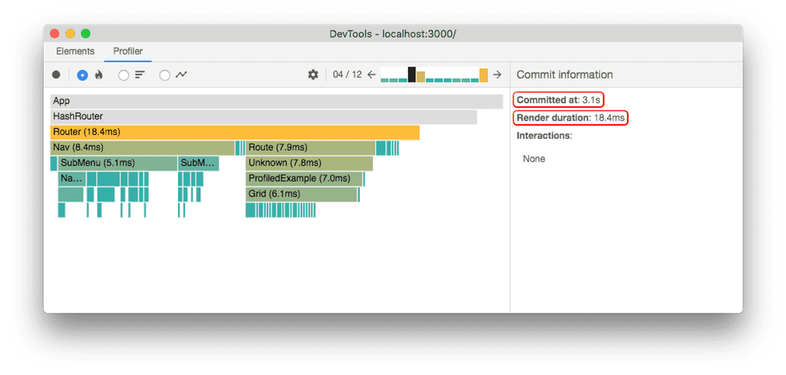

- 렌더 커밋별로 어떠한 작업이 일어났는지 나타낸다.
- 바가 넓을수록 해당 컴포넌트를 렌더링하는데 오래 걸렸다는 것을 의미한다.

**✏️Ranked**

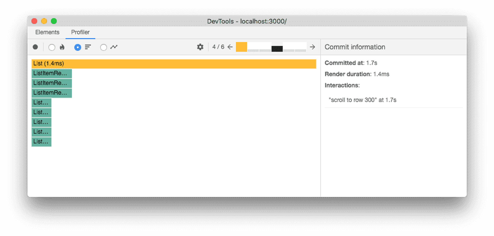

- 해당 커밋에서 렌더링하는 데 오랜 시간이 걸린 컴포넌트를 순서대로 나열한 그래프
- 모든 컴포넌트를 보여주는 것이 아닌 단순히 렌더링이 발생한 컴포넌트만 보여준다.

**✏️타임라인**

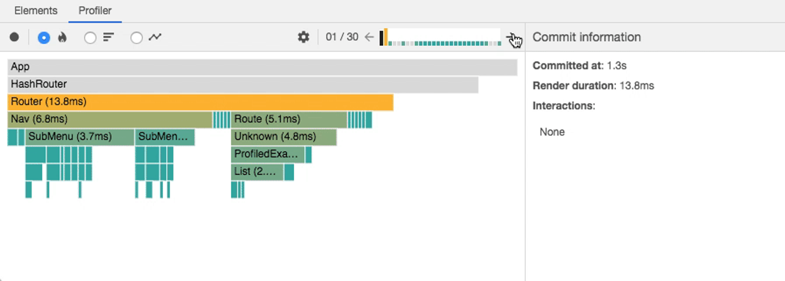

- 시간이 지난에 따라 컴포넌트에서 어떤 일이 일어났는지 확인할 수 있다.

**✏️프로파일러로 렌더링 원인 파악해서 수정해 보기**

> 리액트의 렌더링 단계
>
> **렌더 단계**
>
> 이 단계에서 React는 변경이 필요한 부분을 파악한다. React는 컴포넌트를 렌더링하고 이전 렌더링 결과와 비교한다.
>
> **커밋 단계**
>
> 이 단계에서 React는 실제 변경 사항을 적용한다. React DOM의 경우, 이 단계에서 DOM 노드를 삽입, 업데이트, 삭제한다. 또한, `componentDidMount`와 `componentDidUpdate` 같은 생명 주기 메서드도 이 단계에서 호출된다.

DevTools 프로파일러는 성능 정보를 커밋 단위로 그룹화한다.

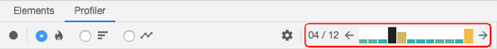

**커밋을 표시하는 막대 그래프**

- 그래프의 각 막대는 하나의 커밋을 나타내며, 현재 선택된 커밋은 검정색으로 표시된다. 막대를 클릭하거나 왼쪽/오른쪽 화살표 버튼을 클릭하여 다른 커밋을 선택할 수 있다.
- 각 막대의 색상과 높이는 해당 커밋이 렌더링하는 데 걸린 시간을 나타낸다.

**커밋 필터링**

- 프로파일링을 오래 할수록 애플리케이션이 더 많이 렌더링되기 때문에 너무 많은 커밋이 생길 수 있다. 프로파일러는 이를 도와주기 위해 필터링 기능을 제공한다.


> 필터링 옵션을 사용하여 특정 임계값을 설정할 수 있다.<br>
> 슬라이더를 조정하여 특정 시간 이하로 걸린 커밋을 숨길 수 있다.<br><br>
> ex) 슬라이더를 5ms로 설정하면 5ms보다 빠르게 완료된 커밋은 그래프에서 사라진다.

## 참고)

- https://react-devtools-tutorial.vercel.app/
- https://www.freecodecamp.org/news/how-to-use-react-dev-tools/
- https://legacy.reactjs.org/blog/2018/09/10/introducing-the-react-profiler.html#profiling-an-application
