# 6장 리액트 개발 도구로 디버깅하기

- 리액트 개발 도구 react-dev-tools

## 6.1 리액트 개발 도구란 ?

- 리액트로 만들어진 애플리케이션 디버깅

## 6.2 리액트 개발 도구 설치

- 브라우저 확장 프로그램 사용
- 개발 모드에서 리액트 로고가 빨간색인 경우 리액트 개발 도구가 접근할 수 있다는 의미
- 배포 환경에서는 파란색

## 6.3 리액트 개발 도구 활용하기

- components, profiler
  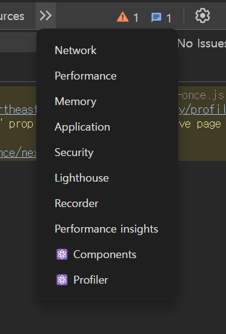

### 6.3.1 컴포넌트

- components 탭
- 현재 리액트 애플리케이션의 컴포넌트 트리 확인
- props와 내부 hooks

📍**컴포넌트 트리**

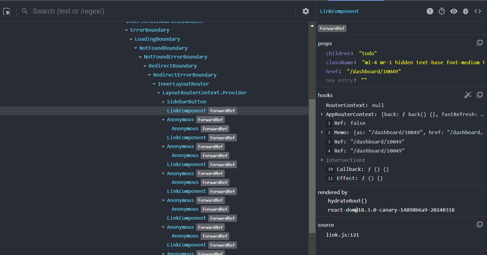

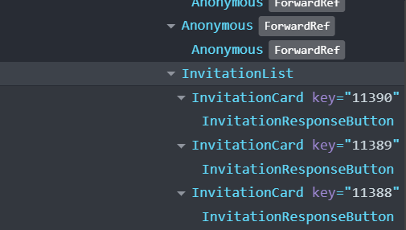

- 전체 트리 구조
- 기명 함수로 선언돼 있으면 해당 컴포넌트명, 익명 함수로 선언돼 있다면 Anonymous
  - 기명 함수 : 함수 선언식, 함수 표현식
  - memo를 통해 익명 함수 컴포넌트를 감싼 경우 함수명을 명확히 추론하지 못해 Anonymous
  - memo 라벨 붙음
- 16.9 버전 이후 명칭을 추론할 수 없는 Anonymous가 임의로 선언된 명칭으로 보여짐
- 기명 함수를 사용하여 명확한 컴포넌트 명칭을 볼 수 있는 것이 디버깅에 도움
- displayName 속성 (Component.displayName)
  - 익명 함수로 선언하기 곤란한 경우
  - 함수명과 별도로 명칭 부여해서 명시적으로 확인이 필요한 경우
  - 고차컴포넌트는 고차 + 일반 컴포넌트 조합으로 구성되기에 유용
  - 리액트를 빌드한 트리를 확인할 떄 기명 함수를 사용했다 하더라도 압축 도구가 컴포넌트 명을 단순하게 난수화하기 때문에 확인이 어려움
  - displayName도 삭제하는 경우가 있기 때문에 개발 모드에서만 사용할 것

📍**컴포넌트명과 props**

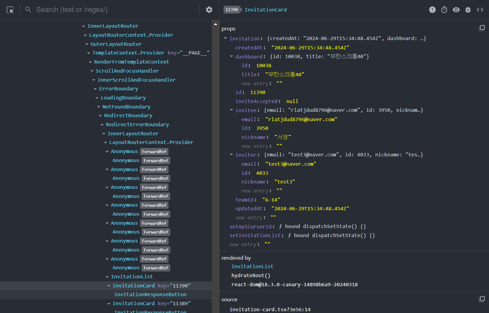

- 선택한 컴포넌트의 자세한 정보를 보여주는 영역

**✅ 컴포넌트명과 Key**

- 빨간색 경고 이모티콘 : strict mode로 렌더링되지 않았음을 의미

**✅ 컴포넌트 도구**

- 눈 아이콘
  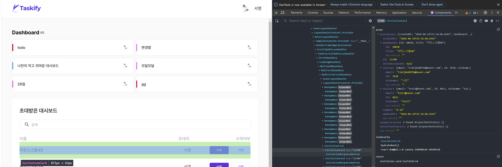
  - HTML에서 해당 컴포넌트의 위치
  - 누르는 즉시 element 탭으로 이동함
- 벌레 아이콘
  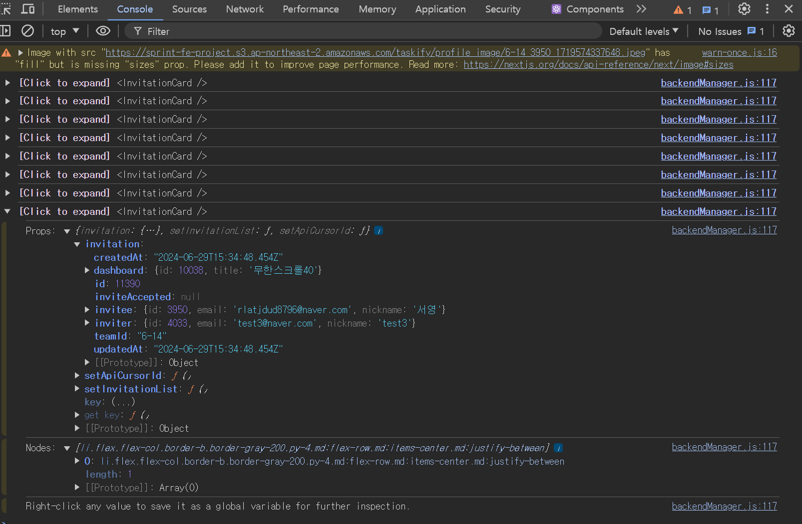
  - console에 해당 컴포넌트 정보 찍힘
  - 복잡한 정보 확인하고 싶은 경우 활용
  - 컴포넌트가 받는 props, 내부에서 사용하는 hooks, HTML 요소인 nodes
- 소스코드 아이콘
  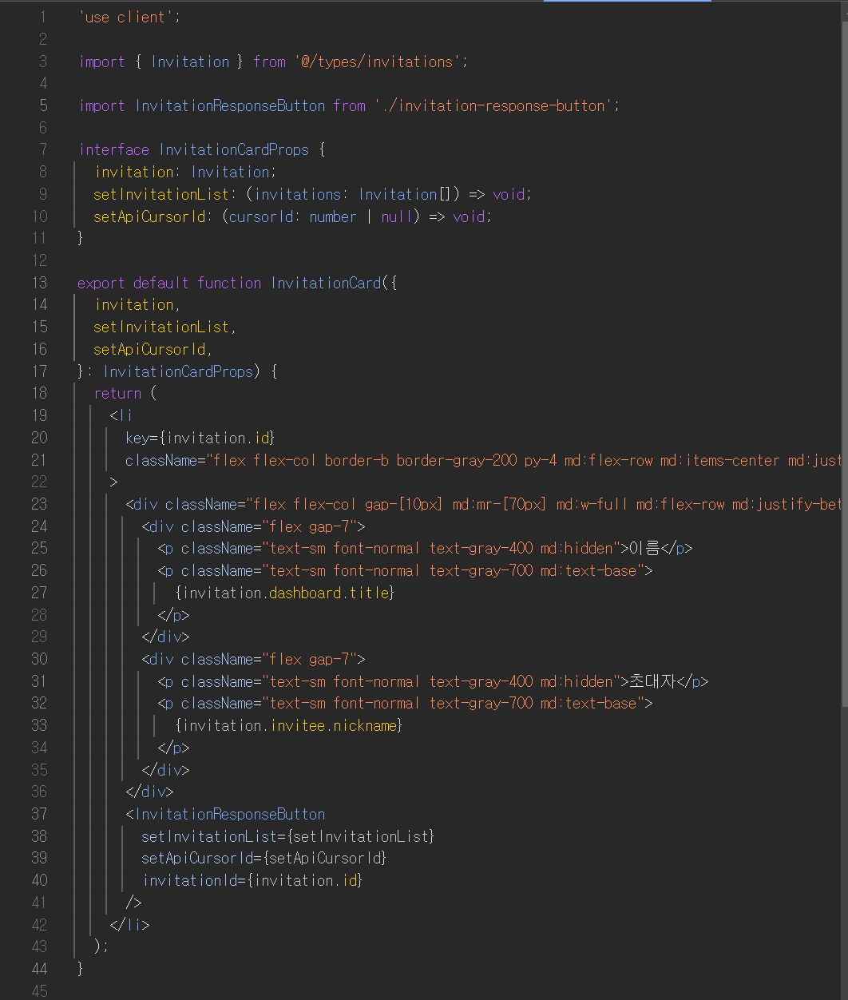
  - 컴포넌트의 소스코드 (..!!)

**✅ 컴포넌트 props**

- 원시값뿐만 아니라 함수도 포함
- store as global
  - 콘솔에 해당 정보 찍힘
- go to definition
  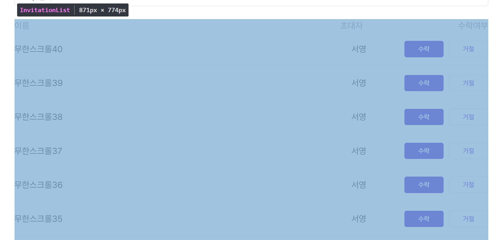
  - 함수인 props
  - 해당 함수가 선언된 코드로 이동

**✅ 컴포넌트 hooks**

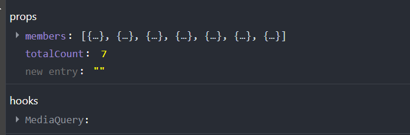

- 컴포넌트에서 사용 중인 훅 정보
- 커스텀 훅 : useCounter → Counter
- 훅도 컴포넌트처럼 익명 함수가 아닌 기명 함수를 활용하면 함수 이름 확인 가능
- 익명 함수는 f () {} 정도

**✅ 컴포넌트를 렌더링한 주체, rendered by**

- 해당 컴포넌트를 렌더링한 주체
  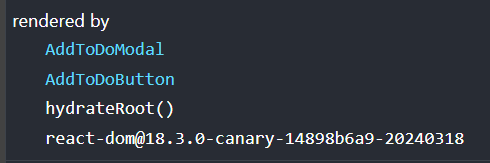

### 6.3.2 프로파일러

- 리액트가 렌더링하는 과정에서 발생하는 상황을 확인하기 위한 도구
- 렌더링 과정에서 어떤 컴포넌트가 렌더링되었는지, 몇 번이나 렌더링 일어났는지, 어떤 작업에서 오래 렌더링이 걸렸는지 등
- 렌더링 과정에 개입하기 때문에 개발 모드에서만 사용 가능

**📍 설정 변경하기**

- 톱니 버튼
- Highlight updates when components render : 컴포넌트가 렌더링될 때마다 해당 컴포넌트에 하이라이트 표시됨 (체크 표시해두기)
- Hide logs during second render in Strict Mode
  - strict mode 에서 실행되는 경우 원활한 디버깅 위해 useEffect가 두 번씩 작동됨
  - 이를 막고 싶은 경우 사용
- Record why each component rendered while profiling.
  - 무엇 때문에 컴포넌트가 렌더링됐는지 기록

**📍 프로파일링**

✅ 프로파일링 메뉴

- 렌더링할 때 어떤 일이 벌어지는지 확인하는 도구
- 첫 번째 버튼 : 프로파일링 시작
- 두 번째 버튼 : 새로고침 훟 프로파일링 시작
  - 웹페이지가 새로고침되면서 프로파일링 시작
  - 새로고침 끝남과 동시에 프로파일링 중단되는 것 아님
- 세 번째 버튼 : 프로파일링 종료
  - 프로파일된 기록 삭제
- 네 번쨰 버튼 : 프로파일 불러오기
- 다섯 번째 버튼 : 프로파일 저장하기
  - 사용자의 브라우저에 프로파일링 정보가 담긴 JSON 파일

✅ Flamegraph

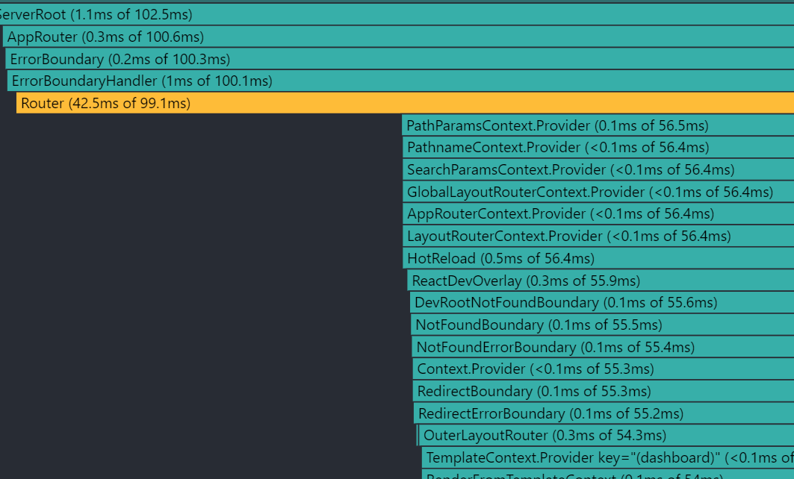

- 불꽃 모양 아이콘
- 렌더 커밋별로 어떠한 작업이 일어났는지 나타냄
- 너비가 넓을수록 렌더링이 오래 걸린 것
- 해당 컴포넌트의 렌더링과 관련된 정보 확인 가능
- 노란색 : 렌더링이 오래 걸린 컴포넌트
- 녹색 : 빠르게 렌더링된 컴포넌트
- 회색 : 렌더링되지 않은 컴포넌트
  - 메모이제이션 작동하고 있는지 확인
  - useEffect에 활용

✅ Ranked

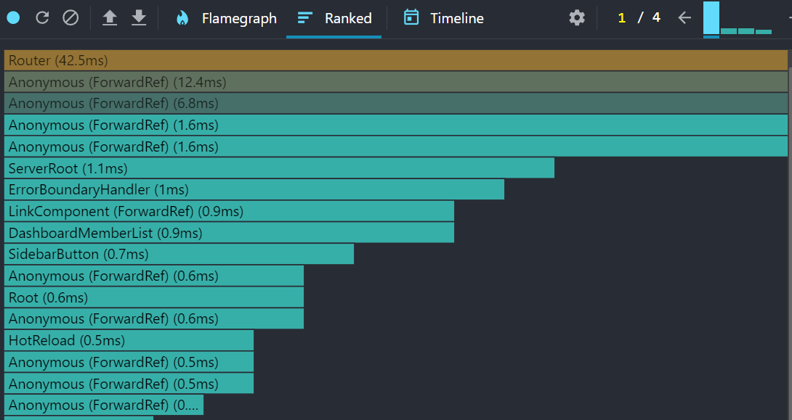

- 해당 커밋에서 렌더링하는 데 오랜 시간이 걸린 컴포넌트를 순서대로 나열한 그래프
- 렌더링이 오래 걸린 컴포넌트부터 보여줌
- 모든 컴포넌트가 아닌 렌더링이 발생한 컴포넌트만 보여줌

✅ 타임라인

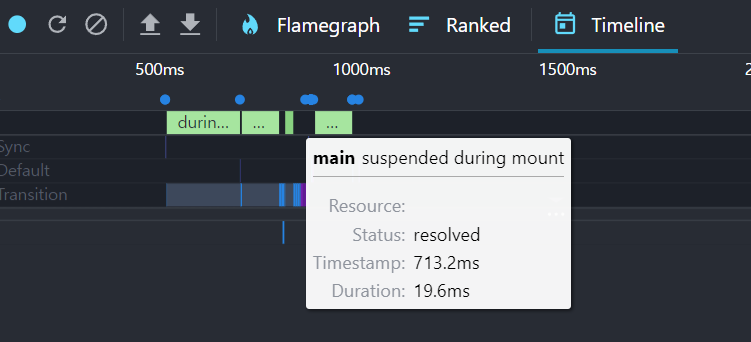

- 시간이 지남에 따라 컴포넌트에서 어떤 일이 일어났는지 확인
- 시간의 흐름에 따라 리액트가 작동하는 내용 추적
- 무엇이 렌더링, 어느 시점에 렌더링 등

**📍 프로파일러로 렌더링 원인 파악해서 수정해 보기**

- 렌더링이 두 번 발생한 이유
- useEffect 내부 setTimeout 에서 상태 업데이트 → useEffect문 삭제 시 렌더링 한 번만 발생
- input에 값을 입력할 때마다 App 컴포넌트 전체가 리렌더링
- input 컴포넌트를 분리하면 input 컴포넌트만 렌더링 발생
- state의 변경을 최소 컴포넌트 단위로 분리
- props가 변경되지 않아도 리렌더링 되는 이유
  - 부모 컴포넌트가 리렌더링 → 이럴 때 memo 사용 !

## 6.4 정리

- 리액트 개발 도구를 통해 개발 과정에서 원하는 대로 렌더링디고 있는지 불필요한 리렌더링이 발생하지는 않는지 파악하는 것이 도움이 될 듯함
