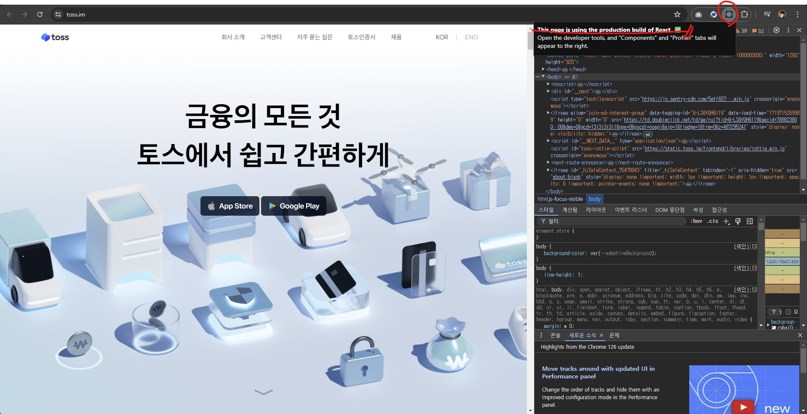

# 6. 리액트 개발 도구로 디버깅하기

**리액트 개발 도구를 이용해 디버깅 및 리액트 앱의 정보를 파악하자**

 

## 6.1 리액트 개발 도구란?

### ✨ 브라우저 확장 프로그램을 사용해 'react-dev-tools' 를 사용해보자

 

## 6.2 리액트 개발 도구 설치

### ✨ 크롬 확장 프로그램 기준 react-dev-tools

- 설치 후 리액트 로고가 회색이 아닌 푸른색으로 표시된다면 '프로덕션', 붉은색으로 표시된다면 '디벨롭' 모드로 실행되고 있다는 뜻이다.

- 예시로 든 토스 홈페이지는 현재 프로덕션 모드로 진입했으므로 푸른색이고, `Next.js` 로 개발되었으므로 리액트 개발 도구 또한 사용 가능하다.

 

## 6.3 리액트 개발 도구 활용하기

### ✨ Component, Profiler 두가지 도구를 이용해 리액트 앱의 작동을 알아보자

 

### 6.3.1 컴포넌트

---

### 🔖 이 탭에서는 컴포넌트 트리 및 `props`, 내부의 `hooks` 등 다양한 정보를 확인 가능하다.

- 컴포넌트 트리는 해당 페이지의 컴포넌트 트리를 나타내며, 기명 함수냐 익명 함수냐에 따라 컴포넌트명이나 `anonymous` 라는 이름을 보여준다.

  - 선언식이나 표현식으로 선언하지 않는다면 (`export default`로 내보낸 익명 함수, 고차 컴포넌트, 리액트 훅으로 감싼 컴포넌트 등) 함수명 추론이 불가하다.

  - 현재는 어느정도 완화되었으나 아직은 특정하기 어렵다.

### 👍 컴포넌트를 기명 함수로 변경하거나 displayName 속성을 활용하자!

 

1. 컴포넌트 명칭과 해당 컴포넌트의 `key`를 나타내며, 위 사진 기준으로는 익명 함수이며 `key` 는 `true` 로 시작하는 특정 문자열이다.

2. 붉은색 아이콘의 경우 `react-strictmode` 로 렌더링되지 않았음을 의미한다.

3. 컴포넌트 도구는 세개의 아이콘으로 이루어져 있다.

 

- 첫번째는 해당 컴포넌트가 HTML의 어느 부분에서 렌더링 된 것인지 확인할 수 있다.

- 두번째는 콘솔창에 해당 컴포넌트의 정보가 출력되며, 여기엔 해당 컴포넌트가 받는 `props`, `hooks`, `nodes` 가 기록되어있다.

- 세번째는 해당 컴포넌트의 소스코드를 볼 수 있다. 하지만 프로덕션 모드로 빌드되어 압축된 형태이므로, `{}` 버튼을 눌러 정리해서 보도록 하자.

- 네번째는 해당 컴포넌트가 받은 `props` 를 확인하는 탭이며, 원시값이나 함수들을 모두 포함한다. 원시값에 마우스 오른쪽 버튼을 누르면 클립보드나 콘솔로 정보를 복사할 수도 있고, 함수의 경우 해당 함수가 선언된 코드로 이동하거나 수정 가능하다.

- 다섯번째는 해당 컴포넌트가 사용하는 `hooks` 를 확인 가능하며, 여기서 훅에 사용되는 접두사 `use` 는 생략된다. (리액트에서 정의되지 않은 명칭이면 커스텀 훅이다.)

- 여섯번째는 컴포넌트를 렌더링한 주체를 확인 가능하며, 개발 모드에서 조금 더 확실하게 확인이 가능하다.

 

### 6.3.2 프로파일러

---

### 🔖 리액트가 렌더링하는 과정의 상황을 확인하기 위한 도구, 개발 모드에서만 실행 가능하다.

🖐️ 부가적인 기능으로, 설정 버튼의 각종 탭을 통해 유용한 기능을 on/off 할 수 있다.

 

### 1번. 기본 버튼

- 첫번째 녹화 버튼은 `Start Profiling` 으로, 프로파일링을 시작하는 버튼이다.

- 두번째 버튼은 웹페이지를 새로고침함과 동시에 프로파일링을 시작한다.

- 세번째 버튼은 종료 버튼으로, 프로파일링 기록을 초기화 한다.

- 네번째, 다섯번째 버튼은 프로파일링 결과를 불러오거나 저장하는 버튼으로 `JSON` 형식으로 저장되며, 이를 다시 불러와 정보를 확인할 수도 있다.

### 2번. 차트

- 첫번째 불꽃 모양의 차트는 `Flamegraph`로, 렌더 커밋별로 작업을 확인할 수 있다.

- 너비가 넓을 수록 해당 컴포넌트의 렌더링이 오래 걸렸다는 것을 의미한다.

- 커서를 대면 렌더링 관련 정보 및 커밋 정보에 대해서도 알 수 있다.

- 렌더링되지 않은 컴포넌트는 회색으로 표시되며 이를 활용해 최적화를 체크할 수 있다.

- 두번째 그래프 모양 차트는 렌더링 시간이 오래걸린 순서로 나열한 차트이다.

- 렌더링이 발생한 컴포넌트에 대한 정보만 확인하고 싶다면 해당 기능을 이용하자.

 

### 3번. 타임라인

- 시간의 흐름에 따라 컴포넌트에서 어떤 일이 발생했는지 추적 가능하다.

- 리액트 18버전 이상에서만 지원한다.

 

### 4번. 프로파일러로 렌더링 원인 파악해서 수정하기

- 각각의 차트를 눌러 `What caused this update?` 탭에서 해당 컴포넌트가 왜 렌더링 된건지 알 수 있다.

- 위의 경우 아무것도 하지 않고 프로파일링만 했음에도 훅이 변경되어 렌더링이 일어났다.

- 책의 예제 코드대로 작성한 `useEffect` 훅의 `setTimeout` 이 원인이며, `setTimeout` 을 지우면 렌더링이 되지 않는 것을 볼 수 있다.

- 또 다른 문제는 `input` 컴포넌트가 변경될 때마다 `App` 컴포넌트 전체가 렌더링 된다는 것이다. (최적화 고려)

- 때문에 외부 컴포넌트로 이를 분리하고 다시 프로파일링 해보면 렌더링이 필요한 컴포넌트만 렌더링 된 것을 볼 수 있다.

- 또한 자식의 불필요 리렌더링을 방지하기 위해 `memo` 등의 훅을 사용하는 방법도 있을 것이다.

 

## 6.4 책 정리 + 주관적인 정리

### 🔖 책 정리

- 리액트 개발 도구를 잘 활용하면 리액트 앱의 작동과 효율성 등 다양한 정보를 체킹할 수 있다.

- 이미 완성된 앱을 개발 도구로 보기 보다는 개발 중인 앱에 실시간으로 사용한다면 더욱 효율적인 웹 개발이 가능할 것이다.

### 🏷️ 주관적인 정리

- 리액트 개발 도구는 컴포넌트 트리를 살펴보는 것과 렌더링 되는 요소 확인에만 사용해왔는데, 이번 공부를 계기로 각각의 사용법과 다양한 활용에 대해 알 수 있게 되었다.

- 현재 진행하는 프로젝트에서도 이번에 배운 지식을 바탕으로 적용해간다면 더 나은 개발을 할 수 있을 듯 하다.

[링크](https://velog.io/@seesaw/React-%EA%B0%9C%EB%B0%9C%EC%9E%90-%EB%8F%84%EA%B5%AC-%ED%99%9C%EC%9A%A9%ED%95%98%EA%B8%B0-Dev-Tools)
