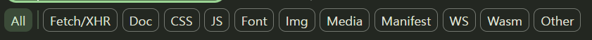
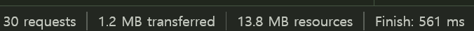
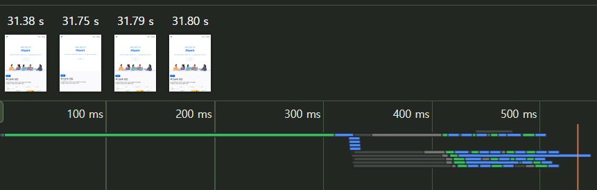
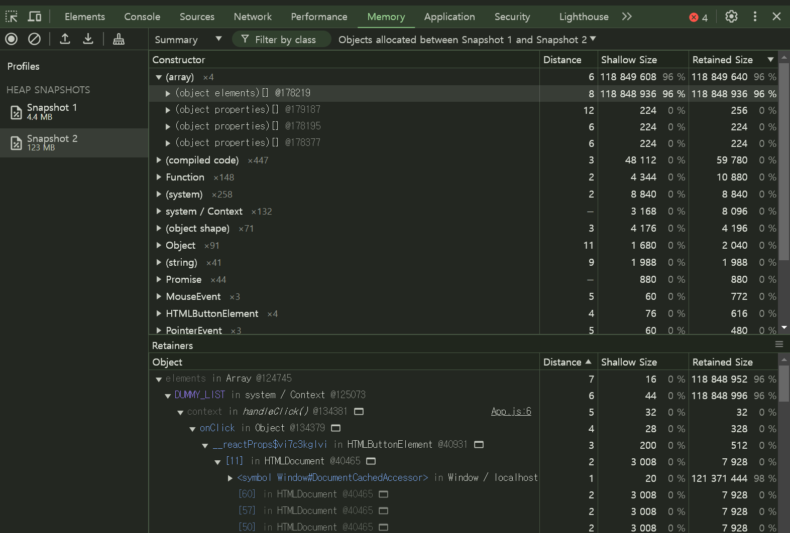
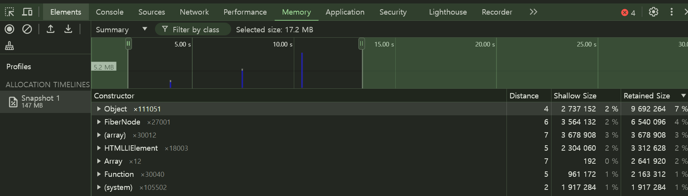
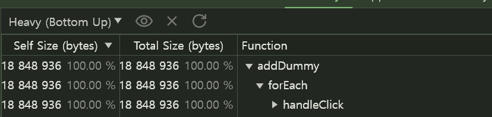

# 07장: 크롬 개발자 도구를 활용한 애플리케이션 분석

## 7.1 크롬 개발자 도구란?

> 크롬에서 제공하는 개발자용 도구로, 웹페이지에서 일어나는 거의 모든 일을 확인할 수 있는 개발 도구다.

웹사이트를 제대로 디버깅하고 싶다면 시크릿 모두에서 개발자 도구를 여는 것을 권장한다.
그 이유는 브라우저에 설치돼 있는 각종 확장 프로그램 때문이다.

## 7.2 요소 탭

HTML, CSS 등의 정보를 확인할 수 있다.
왼쪽에서는 현재 웹페이지의 HTML 트리가 표시되고, 오른쪽에는 왼쪽에서 선택한 요소와 관련된 각종 정보가 나타난다.

### 디버깅

만약 코드에의해 동적으로 제어되는 DOM이 있다면 요소의 중단점을 사용해 디버깅할 수 있다.
중단과 관련된 작업이 일어날 때마다 브라우저가 렌더링을 중단하고 해당 요소 변경을 일으킨 소스코드를 보여준다.

### 요소 정보

요소 탭 오른쪽에서는 해당 요소와 관련된 정보를 얻을 수 있다.
DOM과 관련된 정보가 필요하다면 이 요소 탭을 활용하자.

- Styles: 요소와 관련된 스타일 정보를 나타낸다.
- Computed: 해당 요소의 CSS 적용 결과값을 알 수 있다.
- Layout: CSS 그리드나 레이아웃과 관련된 정보를 확인할 수 있다.
- Event Listeners: 현재 요소에 부착된 각종 이벤트 리스너를 확인할 수 있다.
  상위 버튼을 체크 해제하면 해당 요소에 부착된 이벤트만 볼 수 있다.
- DOM Breakpoints: 중단점이 있는지 알려주는 탭이다.
- Properties: 해당 요소가 가지고 있는 모든 속성값을 나타낸다.
- Accessibility: 접근성 정보를 확인할 수 있다.

## 7.3 소스 탭

소스 탭에서는 웹 앱을 불러오기 위해 실행하거나 참조된 모든 파일을 확인할 수 있다.
JS 파일부터, CSS, HTML, 폰트까지 다양한 파일 정보를 확인할 수 있다.

소스 탭에서 유용한 것을 살펴보려면 **디버깅하고 싶은 파일을 직접 열어야 한다.**
프로덕션 모드의 경우 파일이 모두 압축돼 있기 때문에 디버깅하기가 매우 불편하지만 개발 모드에서는 유용하게 사용할 수 있다.

여기서도 소스 중단점을 생성해 JS 실행을 중단시키고 디버깅을 수행할 수 있다.

소스 탭 오른쪽에 제공하는 정보와 기능은 무엇인지 자세히 알아보자.

- Watch: 감시하고 싶은 변수를 선언하고, 해당 변수의 정보를 확인할 수 있는 메뉴
- Breakpoints: 웹페이지 전체에 걸쳐 소스 탭에서 추가한 모든 중단점을 확인할 수 있다.
- Scope: 중단점에서 스코프를 의미한다. 로컬은 현재 로컬 스코프를 의미하며, 이 밖에도 클로저, 전역 스코프 등을 확인할 수 있다.
- Call Stack: 현재 중단점의 콜스택을 확인할 수 있다. 실행 컨텍스트가 어떻게 저장되어 현재 어떤 모습을 하고 있는지 직접 볼 수 있다.

## 7.4 네트워크 탭

네트워크 탭에는 웹페이지를 접속하는 순간부터 발생하는 모든 네트워크 관련 작동이 기록된다.
웹사이트에서 자주 사용하는 HTTP 요청부터 웹 소켓에 이르기까지, 웹페이지가 외부 데이터와 통신하는 정보를 확인하고 싶다면 네트워크 탭을 참조하면 된다.


▲ 보고 싶은 네트워크 요청 종류를 필터링할 수 있다.


▲ 하단에서는 페이지를 불러오는 동안 발생한 총 요청 건수와 다운로드한 리소스의 크기를 확인할 수 있다.

마지막으로 스크린숏 캡처 기능을 활용하면 네트워크 요청 흐름에 따라 웹페이지가 어떻게 로딩되고 있는지 확인할 수 있다.



사용자에게 먼저 노출되거나, 노출되는 영역이 큰 중요한 콘텐츠가 우선적으로 다운로드 되는지, 우선순위가 낮은 이미지가 나중에 다운로드되는지 등을 확인할 수 있다.

## 7.5 메모리 탭

메모리 탭에서는 현재 웹페이지가 차지하고 있는 메모리 관련 정보를 확인할 수 있다.
메모리 누수, 속도 저하, 웹페이지 프리징 현상을 확인할 수 있는 유용한 도구다.

메모리 탭에서는 프로파일링 작업을 거쳐야 원하는 정보를 볼 수 있다.
프로파일 유형은 크게 세 가지가 있는데 다음과 같다.

- 힙 스냅샷: 현재 메모리 상황을 사진 찍듯이 촬영할 수 있다.
- 타임라인의 할당 계측: 시간의 흐름에 따라 메모리의 변화를 살펴보고 싶을 때 사용한다.
- 할당 샘플링: 메모리 공간을 차지하고 있는 JS 함수를 볼 수 있다.

### 힙 스냅샷

> 촬영하는 시점을 기준으로 메모리 현황을 보여준다.

```jsx
const DUMMY_LIST = [];

export default function App() {
  function handleClick() {
    Array.from({ length: 10_000_000 }).forEach((_, idx) =>
      DUMMY_LIST.push(Math.random() * idx)
    );
    alert("complete");
  }

  return <button onClick={handleClick}>BUG</button>;
}
```



스냅샷 간의 비교로 어떠한 변수가 메모리를 크게 잡아먹고 있는지 확인할 수 있다.
또한 어떤 원인으로 메모리 사용량 차이가 발생했는지를 확인할 수 있다.

<br>

📖 얕은 크기와 유지된 크기의 차이점?

얕은 크기: 객체 자체가 보유하는 메모리 바이트의 크기
유지된 크기: 해당 객체 뿐만 아니라 모든 자식 개체들의 크기까지 더한 값

메모리 누수를 찾을 때는 얕은 크기는 작으나 유지된 크기가 큰 객체를 찾아야 한다.
두 크기의 차이가 큰 객체는 다수의 다른 객체를 참조하고 있다는 뜻이며,
이는 해당 객체가 복잡한 참조 관계를 가지고 있다는 뜻이다.

### 타임라인 할당 계측

> 시간의 흐름에 따른 메모리 점유율을 자세히 알고 싶다면 타임라인 할당 계측을 활용하자.

```jsx
export default function App() {
  const [number, setNumber] = useState(0);
  const [list, setList] = useState([]);

  const handleClick = () => {
    const newNumber = number + 1;
    setNumber(newNumber);

    setList((prev) => [
      ...prev,
      ...Array.from({ length: newNumber * 3000 }).map(
        (_, idx) => `${idx + number * 3000}`
      ),
    ]);
  };

  return (
    <>
      <button onClick={handleClick}>+</button>
      <ul>
        {list.map((item, idx) => (
          <li key={idx}>{item}</li>
        ))}
      </ul>
    </>
  );
}
```



### 할당 샘플링

> 시간의 흐름에 따라 함수 단위로 분석한다.



가장 많은 바이트를 차지한 함수의 작업을 확인할 수 있다.

## 7.6 Next.js 환경 디버깅하기

만약 SSR을 수행하는 JS 환경에서 메모리 누수가 발생한다면 어떻게 될까?
서버 자체에 부담이 발생할 것이고, 모든 사용자에게 심각한 상황을 초래하게 될 것이다.

서버 환경도 동일하게 크롬 개발자 도구로 디버깅이 가능하다.

```
"dev": "NODE_OPTIONS='--inspect' next dev",
```

## 정리

대부분의 경우에는 메모리 누수의 원인이 불명확하기에 의심되는 지점을 찾고, 코드를 수정하고, 다시 프로파일링하는 일련의 과정은 지루하고 길다. 이렇게 찾은 원인이 본인의 코드일 수도 혹은 라이브러리일 수도 있기 때문에 많은 가능성을 열어두고 봐야 한다.

이 과정은 숙달하기 어려운 문제이지만 반복해서 문제를 파고들다 보면 결국 원인을 파악하고 수정해서 더욱 안정적인 서비스를 제공할 수 있을 것이다.

---

### 새로 알게된 개념

- 메모리 탭 사용 방법
- Next.js 디버깅 방법

### 읽으면서 어려웠거나 이해가 잘 안됐던 부분

- 메모리 탭 사용 방법
