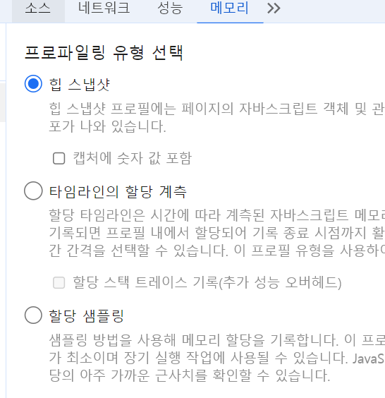

# 12회차

# 7장

리액트 밖에서 일어나는 앱 버그와 디버깅 이슈를 해결하기 위해선 개발자 도구 써야함  
=> 모든 웹사이트에서 사용할 수 있어서 범용성 goat

크롬 개발자 도구를 알아보자

## 크롬 개발자 도구란?

개발자 도구로 디버깅을 제대로 할려면 시크릿 모드에서 해야함

- 브라우저 확장 프로그램이 불필요한 정보를 추가할 수 있기 때문.
- 시크릿 모드에서는 확장 프로그램이 실행 안됨.


사진과 같은 불필요한 정보가 떠버림.

## 요소 탭

현재 웹페이지를 구성하고 있는 HTML, CSS 등의 정보를 확인 가능.  
  
좌는 HTML 트리, 우는 선택한 요소의 정보.

### 요소 화면

원하는 태그를 클릭하면 브라우저 페이지의 해당 요소가 강조되고, 관련 정보를 열람 가능.  


- 직접 코드를 수정해서 어떻게 보이는지 확인 가능
  => 왼쪽 화면에서 태그, 클래스명 등을 수정 가능, 오른쪽 화면에서 스타일 수정.
- 리액트 코드를 수정하고 핫 리로딩을 거치지 않아도 확인 가능.
- 사진과같은 동작으로 클래스나 속성값이 동적으로 제어되는 DOM을 디버깅 가능.  
  => 해당 요소를 변경한 소스코드를 보여줌.  
  

### 요소 정보

요소 탭 오른쪽에서 확인 가능. DOM에 추가돼 있는 이벤트 리스너, 접근성 등 DOM에 관한 모든 것들도 알 수 있음.

- 스타일: 어떤 클래스, 태그명, 아이디 등으로 매핑된 스타일인지 알 수 있고, 스타일 선언 파일도 확인 가능.
- 계산됨: CSS 적용 결과값을 알려줌.
- 레이아웃: CSS그리드, 레이아웃 정보를 알려줌.
- 이벤트 리스너: 현재 요소에 부착된 이벤트 리스너 확인 가능.  
  => 상위 버튼 체크 해제로 딱 해당 요소에 부착된 이벤트만 볼 수 있음. 이벤트 버블링같은 경우는 확인 불가능.
- DOM중단점: 중단점이 있는지 알려줌.
- 속성: 요소가 가진 모든 속성값. .attributes와 달리 모든 값이 나옴.
- 접근성: 장애인을 위한 스크린리더기 등이 활용하는 값.

### 소스 탭.

앱을 불러오기 위해 실행, 참조된 모든 파일을 확인 가능.(JS, CSS, HTML, 폰트 등)  
파일을 열기 전까지는 아무것도 볼게 없지만 열면 코드내용까지 확인 가능하다.  

해당 페이지의 CSS코드.

중단점을 생성해 JS실행을 중단시키고 디버깅을 할 수 있음.

소스탭의 오른쪽에 있는 기능을 알아보자.

- 감시: 감시하고 싶은 변수의 정보를 확인 가능, 디버깅 시점에서 특정 변수의 값을 알 수 있음.  
  => 확인 가능하면 변수의 값, 없으면 <not available>로 표시됨  
  
- 중단점: 현재 웹사이트에서 추가한 중단점을 확인 가능.
- 범위: 중단점에서의 스코프, 스코프에서 접근할 수 있는 값을 볼 수 있고 클로저, 전역 스코프도 확인 가능.  
  
- 호출 스택: 현재 중단점의 콜스택 확인 가능. 실행 콘텍스트가 어떻게 저장되고 어떤 모습인지 볼 수 있음.
- 전역 리스너: 현재 전역 스코프에 추가된 리스너 목록 확인 가능.
- XHR/가져오기, DOM, 이벤트 리스너, CSP 위반 중단점: 소스의 중단점 이외에 다양한 중단점 확인 가능.

## 네트워크 탭

모든 네트워크 관련 작동 기록.  
  
왼쪽에서 페이지를 불러오는 과정에서 발생한 네트워크 요청을 볼 수 있음.  
=> 페이지 로딩 과정 확인 가능

1. HTML 다운
2. HTML 파싱 중 만난 JS 다운
3. 개발자 모드면 핫 리로딩도됨.
4. lazy에서 https://www.naver.com/nvhaproxy/v2/pc/lazy을 불러옴  
   .

스크린샷을 체크 하면 로딩 과정을 사진으로 볼 수 있다.  


**주의 깊게 볼것들**

- 불필요한 요청, 중복 요청  
  => ex) 같은 주소의 요청이 두 번 실행될 때는 useEffect문제임 잘 사용하자
- 리소스 크기
- 리소스 로드 속도
- 리소스의 우선순위

## 메모리 탭

프로파일링 작업을 거쳐야 원하는 정보를 볼 수 있음.  
  
세가지의 프로파일링을 알아보자.

- 힙 스냅샷: 현재 메모리 상황을 사진 찍듯이 보여줌.
- 타임라인의 할당 계측: 시간의 흐름에 따라 메모리의 변화를 보여줌.  
  => 로딩 과정 중 메모리 변화 또는 상호작용 시 메모리 변화를 알 수 있음.
- 할당 샘플링: 메모리 공간 쓰는 JS 함수 보여줌.

### 자바스크립트 인스턴스 VM 선택

현재 실행중인 JS VM 인스턴스들의 힙 점유율을 보여줌.
디버깅 하고 싶은거 선택하고 실행하면 된다.

### 힙 스냅샷


**얕은 크기, 유지된 크기**

```JS
var counter = 0;
var instances = [];

function Y() {
  this.j = 5;
}

function X() {
  this.i = counter++;
  this.y = new Y();
}
function App() {
  function handleClick() {
    instances.push(new X());
  }
  return (
    <>
      <Counter />
      <button onClick={handleClick}>a+</button>
    </>
  );
}

export default App;
```

새로고침 스냅샷과 버튼 클릭 스냅샷을 객체간 비교한 모습.  


- 얕은 크기는 해당 객체 크기.
- 유지된 크기는 해당 객체가 참조하고 있는 모든 객체의 크기.

객체가 얕은 크기와 유지된 크기의 차이가 클수록 복잡한 참조 관계를 가짐.  
=> 메모리 누수의 용의자.

### 타임라인 할당 계측

부담이 크다.  
  
전역 변수 저장을 이용해 콘솔에서 확인 할 수 있다.  
시간의 흐름을 기준으로 메모리 점유율을 알고 싶으면 힙 스냅샷 대신 써보자.

### 할당 샘플링

타임라인 할당 계측과의 차이는 JS 실행 스택별로 분석을 함수 단위로 해줌.
=> 브라우저에 주는 부담이 적음
  
타임라인 할당 계측보다 보기 쉬움.

## Next.js 환경 디버깅하기

SSR을 수행하는 JS환경에서 메모리 누수가 발생하면 서버 자체에 부담이 생김  
=> 모든 사용자가 서비스를 못씀. 매우 중요한 서버 환경을 디버깅해보자.

### Next.js 프로젝트를 디버그 모드로 실행하기

`"dev": NODE_OPTIONS='--inspect' next dev`  
입력.  
이거 되나요??

### Next.js 서버에 트래픽 유입시키기

브라우저에서는 메모리 누수를 사용자의 행동을 흉내내서 확인하지만,  
ssr은 직접 트래픽을 발생시켜서 확인하는게 좋음.  
오픈 소스 도구 ab를 이용해보자. https://ubunlog.com/ko/apachebench%EB%8A%94-%EC%9B%B9-%ED%8E%98%EC%9D%B4%EC%A7%80%EB%A5%BC%EB%A1%9C%EB%93%9C%ED%95%A9%EB%8B%88%EB%8B%A4./

### 정리

- 책에서 배운대로만 해도 디버깅하는 데 문제 없다.
- 벽에 부딪치거나 뭔가의 작동 방식을 알고 싶으면 개발자 도구를 적극 활용하자.

### 어려운거

- 책에서는 있는데 제가 직접해보면 없는 기능이 있어서 곤란했습니다.

### 새로안거

- 할당 샘플링 정도만 써볼 거 같습니다.
