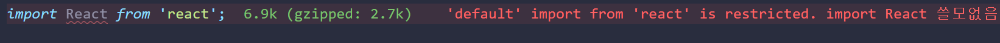

# 13회차

# 8장

ESLint, 리액트 테스트 라이브러리를 알아보죠

## ESLint를 활용한 정적 코드 분석

정적 코드 분석, 즉 코드가 실행되기전에 버그코드를 찾아내주는 ESLint를 알아보자

### EsLint 살펴보기

ESLint는 한 번 써보면 못벗어남.

#### ESLint는 어떻게 코드를 분석할까?

ESLint가 JS 코드를 분석하는 과정

1. JS 문자열로 읽기
2. JS를 파서중 하나인 espree로 구조화함. => AST
3. AST를 규칙들과 대조함.
4. 위반 코드를 알림, 수정함.

`function hello`을 espree로 분석보자

```JSON
{
  "type": "Program",
  "start": 0,
  "end": 22,
  "range": [0, 22],
  "body: [
    {
      "type": "FunctionDeclaration",
      "start": 0,
      "end": 22,
      "range": [0, 22],
      "id": {
        "type": "indentifier",
        "start": 9,
        "end": 14,
        "range": [9, 14],
        "name": "hello"
      }
    }
  ]
}
```

코드의 정확한 위치까지 파악해버림.  
=> 줄바꿈, 들여쓰기 등을 파악 가능.

잘못된 코드를 정의하는 친구를 ESLint의 규칙이라함.  
규칙을 알아보자

```JS
// no-debugger 규칙 활성화
module.exports = {
  meta: {   // 메타 정보
    type: 'problem',   // 문제 있고,
    docs: {     // 문서화에 필요한 정보
      description: 'Disallow the use of `debugger`',  // 문제 설명
      recommended: true,
      url: 'https://eslint.org/docs/rules/no-debugger'
    },
    fixable: null,    // 수정 가능 여부
    schema: [],
    messages: {   // 경고 문구
      unexpected: "Unexpected 'debugger' statement.",
    }
  }
  create(context) {   // 실제 코드에서 문제점 확인하는 곳
    return {
      DebuggerStatement(node) {   // 얘 발견하면 바로 노드를 리포트해 `debugger`사용을 알려버림.
        context.report({
          node,
          messageId: 'unexpected',
        })
      }
    }
  }
}
```

`create()`에서 문제점을 확인함

1. espree로 만든 AST트리를 순회함.
2. 규칙에 만족하는 코드를 찾고, 반복함.
3. 찾으면 알려줌.

### eslint-plugin과 eslint-config

규칙들의 모음을 plugin이라 하고 이는 두종류로 나뉨.

- plugin: 규칙들 모아놓은 패키지. eslint-plugin-import 같은 경우 import관련 규칙 제공
- config: eslint-plugin을 묶어서 제공하는 패키지. 얘도 종류 여러가지임.

### 나만의 ESLint 규칙 만들기

규칙 만들면 일일이 수정하는 것보다 훨씬 더 빠르고 쉽게 수정 가능.
반복되는 실수 까지 방지해버림. 해보자.

```JS
module.exports = {
    "no-restricted-imports": [
      "error",
      {
        paths: [
          {
            name: "react",
            importNames: ["default"],   // `default`로 안해주면 react이름 들어간 모든 얘들 컷해버림.
            message: "import React 쓸모없음",
          },
        ],
      },
    ],
  },

```


다음과같이 쓸모없는 코드를 제거해  
번들링 크기를 줄이거나, 줄이지는 못해도 **트리쉐이킹** 시간을 단축시켜보자

**트리쉐이킹**: 사용 안하는 코드를 제거하는 것.

### 주의할 점

ESLint를 잘못 설정해두면 이상한 결과가 발생함. 주의할 점 몇가지 봐보자.

#### Prettier와의 충돌

Prettier는 코드의 포매팅을 도와줌. <= HTML, CSS, 마크다운, JSON 등 범용성 탑임  
근데 ESlint에서도 포매팅을 할줄암.  
=> 둘이 충돌이나서 에러가 발생하고, 둘의 규칙을 모두 만족못하는 코드가 될 수 있음.

1. ESLint에서 Prettier와 충돌나는 규칙을 끄자.  
   => 코드에 ESLint를 적용하는 작업, 포매팅 작업이 서로 다른 패키지에서 발생함.
2. 포매팅은 모두 Prettier에 맡기고 필요한 포매팅 규칙은 eslint-plugin-prettier를 사용.  
   => Prettier가 제공하는 규칙을 모두 사용 가능.

#### 규칙에 대한 예외 처리, 그리고 react-hooks/no-exhaustive-deps

eslint-disable- 주석을 사용하자.

```JS
// 특정 줄만 제외
var a = 1; // eslint-disable-line no-console

// 다음 줄 제외
// eslint-disable-next-line no-console
var b = 1;

// 특정 여러 줄 제외
/* eslint-disable no-console */
var c = 1;
var d = 1;
/* eslint-enable no-console */

// 파일 전체에서 제외
/* eslint-disable no-console */
```

no-exhaustive-deps는 의존성 배열 규칙을 무시함.

**써볼만한 상황인데 함정인 것들**

- 써도 괜찮다고 판단해도 이게 반복되면 버그를 야기할 수 있음  
  => 면밀히 검토해서 쓰자
- 의존성 배열이 너무 긴 경우 useEffect가 너무 큼.  
  => useEffect를 쪼개서 쓰자.
- 마운트 시점만 딱 한 번만 실행할 경우  
  => 상태와 관계없이 한 번만 실행되야 하면 존재 이유가 없음. 수정하자.

규칙 무시가 옳은지 아니면 제거 하지는게 옳은지 잘 판단해서 해보자.

#### ESLint 버전 충돌

ESLint 버전이 다른게 두 개이상 설치되어있다면 지우자.  
에러나 오류 메세지를 겪게 된다.

### 정리

요즘은 ESLint는 모든 프로젝튼에서 기본중의 기본이다 무조건 싸라.  
프로젝트에 설치되있는 eslint-config는 무엇인지 알아보고, 본인껄로 커스텀해보자.

## 리액트 팀이 권장하는 리액트 테스트 라이브러리

테스트는 매우 중요함.
프론트엔드 개발은 브라우저에서 발생할 수 있는 다양한 시나리오를 고려해야 하기 때문에
일반적으로 테스팅하기가 매우 번거로움.
=> React Testing Library로 해결해보자.

### React Testing Library란?

리액트를 기반으로 한 테스트를 수행하기 위해 존재.

**리액트 테스팅 라이브러리**  
 &#8595; 기반  
**DOM Testing Library**  
 &#x2193; 기반  
**Jsdom**

**Jsdom**

- 순수 JS로 작성된 라이브러리
- Node.js 에서 HTML, DOM을 사용 가능하게 해줌.  
  => HTML이 있는 것처럼 DOM을 불러오고 조작 가능.

```JS
const jsdom = require('jsdom')
const { JSDOM } = jsdom
const dom = new JSDOM(`<!DOCTYPE html><p>Hello world</P>`)

console.log(dom.window.document.querySelector('p').textContent) // "Hello World"
```

### 자바스크립트 테스트의 기초

```JS
function sum(a, b) {
  return a + b
}
// 그냥 테스트
let actual = sum(1, 2)
let expected = 3

if( expected !== actual) console.log(test failed)

// assert로 테스트
const assert = require('assert')

assert.equal(sum(1, 2), 3)
assert.equal(sum(2, 2), 4)
assert.equal(sum(1, 2), 4) // AssertionError [ERR_ASSERTION] [ERR_ASSERTION]: 3 == 4

// Jest로 테스트
const { sum } = require('./math')

test('합쳐야 한다', () => {
  expect(sum(1, 2)).toBe(3)
})

test('합쳐야 한다', () => {
  expect(sum(1, 2)).toBe(3)
})
```

테스트 결과를 알려주는 라이브러리를 어설션 라이브러리라고 부름.  
Jest는 유지보수가 되지 않았으나 최근에 다시 떠오름.  
=> 무엇을 테스트했는지, 얼마나 걸린지, 뭐가 성공 실패인지, 전체 결과등 다양한 정보 확인 가능.

- 메서드를 require, import 같은 구문 없이 사용함  
  => Jest는 CLI, 즉 실행 시 미리 전역 스코프에 메서드들 넣어버림.
- node가 아닌 jest(npm run test)로 실행해야함  
  => test와 expect는 전역 스코프에 없음  
  => `import { expect, jest, test} from '@jest/globals'`이거 넣으면 node로도 실행됨

### 리액트 컴포넌트 테스트 코드 작성하기

1. 컴포넌트 렌더링
2. 컴포넌트에서 특정 액션 수행
3. 1번, 2번 액션 기대 값과 실제 값 비교.

#### 프로젝트 생성

리액트에서 App.tsx는 App.test.tsx에게 테스트 받음

1. <APP />을 렌더링
2. 렌더링하는 컴포넌트 내부에서'learn react'라는 문자열을 가진 DOM 요소를 찾는다.
3. expect(linkElement).toBeInTheDocument()어설션 써서 2번 요소가 document 내부에 있는지 확인

#### 정적 컴포넌트

상태가 없어서 항상 같은 결과를 반환함. 테스트가 쉽다  
=> 테스트를 할 컴포넌트 렌더링 하고, 원하는 요소를 찾아 원하는 테스트 수행하면됨.

이 때 쓰이는 jest의 메서드를 알아보자.

- beforeEach: 각 테스트 수행 전 실행하는 함수.
- describe: 비슷한 테스트를 하나의 그룹으로 묶어줌.
- it: test의 축약어임. 사람이 읽기 쉬움.
- testId: 리액트 테스팅 라이브러리의 예약어. get등의 선택자로 선택하기 어려운 요소를 선택할 때 씀.  
  => DOM요소에 testId 데이터셋을 선언해두면 테스트 시, getByTestId, findByTestId 등으로 선택 가능.

**데이터 셋**

- HTML의 특정 요소와 관련된 임의 정보를 추가 가능.
- HTML의 특정 요소에 data-로 시작.

```JS
<button data-id={index + 1}>{index + 1}</button>
```

버튼이 매우 많아져도 어떤 버튼이 어떤 정보를 가져오는지 알 수 있음.

#### 동적 컴포넌트

상태값이 있어서 결과값이 변하는 동적 컴포넌트를 테스트해보자. 어렵다.  
=> jest에서 사용자 작동을 흉내내는 메서드들을 활용해서 사용자 동작을 재현하여 극복함.

#### 비동기 이벤트가 발생하는 컴포넌트

fetch 이녀석을 어떻게 테스트해야할지 매우난감함.  
모킹을 해야함(모조품을 만들어서 일단 api 돌아가게 해야함).  
=> 서버 응답에서 오류가 발생한 경우까지 따지면 테스트가 복잡해짐.  
=> **MSW**(Mock Service Worker)를 활용해서 테스트하면됨.

**MSW**

- Node.js, 브라우저에서 모두쓰는 모킹라이브러리  
  => 브라우저에서는 서비스 워커로 실제 네트워크 요청을 훔쳐서 모킹 구현.

  1. fetch 요청을 하는 것처럼 네트워크 요청을 수행
  2. 요청을 MSW가 감지하고 모킹 데이터를 제공.

  ```JS
  // 기본적인 MSW 테스트 환경 설정.
  import { server } from './mocks/server';

  // 모든 테스트 전에 서버를 시작
  beforeAll(() => server.listen());

  // 각 테스트 후에 서버 초기화
  afterEach(() => server.resetHandlers());

  // 모든 테스트 후에 서버 종료
  afterAll(() => server.close());
  ```

MSW를 사용한 fetch 응답 모킹, findByText를 이용해 렌더링이 끝난 뒤에 결과를 확인해서 비교하면됨

### 사용자 정의 훅 테스트하기

훅을 테스트하려면 두 가지 방법이 있음.

1. 훅이 들어간 컴포넌트 만들기  
   => 테스트 코드 작섵 외에 작업이 더 추가됨
2. 훅이 들어있는 컴포넌트에 대해 별도로 훅에 대한 테스트 만들기.  
   => 훅이 모든 테스트 케이스를 커버 못하면 망함.

이것을 해결해주는 친구가 react-hooks-testing-library임.

### 테스트를 작성하기에 앞서 고려해야 할 점

**테스트 커버리지**: 테스트한 횟수를 나타내는 지표

- 테스트 커버리지가 높다고 테스트가 잘되고있는게 아님.  
  => 맹신하지 말자.
- 테스트 커버리지를 100%까지 끌어올릴 수 있는 상황은 드뭄.  
  => 사용자의 입력이 자유러워 예측이 힘들고, 실무에서는 재정적인 압박이 심함.

앱의 약점과 중요한 점을 파악하자.  
테스트 코드는 그린 사인을 보기위해 작성하는게 아님.  
개발자가 소프트웨어 품질에 대한 확신. 안심하고 싶어서 만드는 것.

### 해볼 만한 여러 가지 테스트

프런트엔드에서 쓸만한 테스트

- 유닛 테스트: 코드, 컴포넌트가 독립적으로 분리된 상태에서 잘 작동하는지 검증
- 통합 테스트: 유닛 테스트 통과한 얘들을 묶어서 하나의 기능으로 정상 작동하나 확인하는 테스트
- 엔드 투 엔드: 실제 사용자처럼 작동하는 로봇을 활용해 앱 전체 기능을 확인하는 테스트

### 정리

테스트의 존재 의의는 앱이 비즈니스 요구사항을 충족하는지임.  
핵심적인 부분부터 테스트 코드를 작성해서 품질에 확신을 얻어보자.

### 어려운거

- MSW, jest

### 새로안 거

- eslint 커스텀해서 내맘대로 문구 띄우기.
