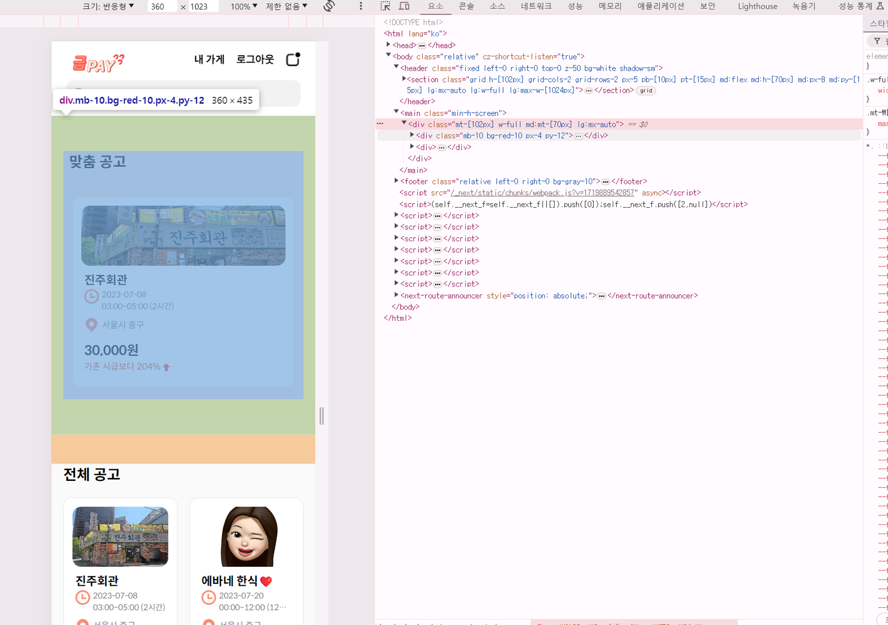
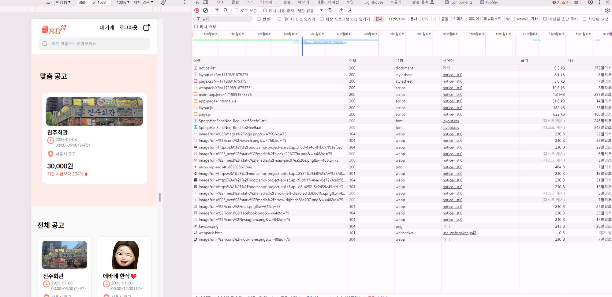
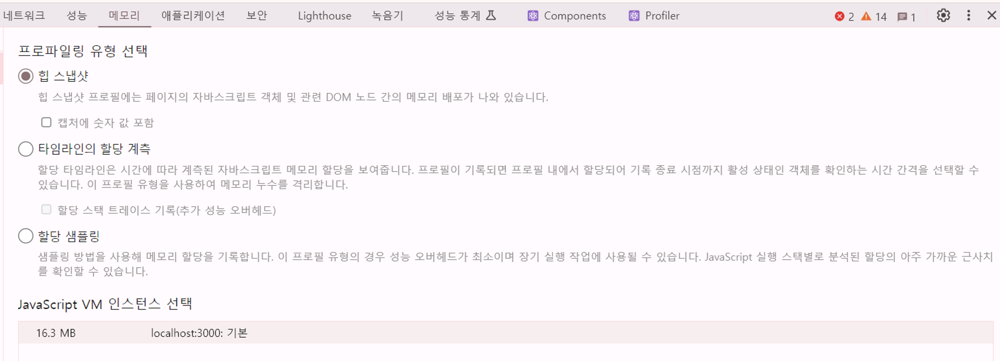
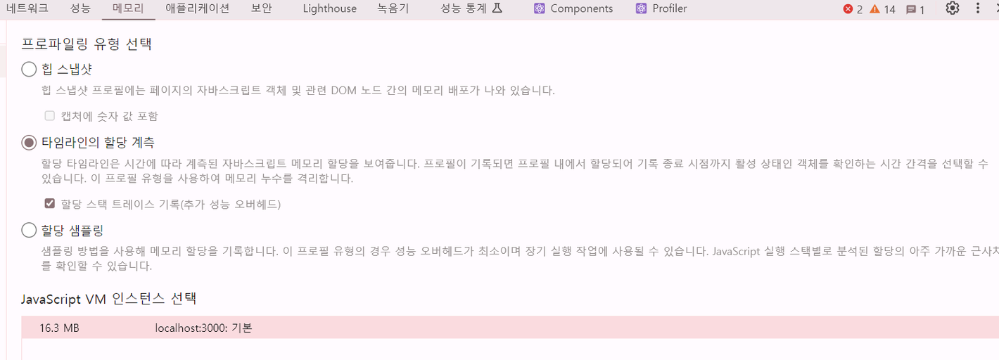
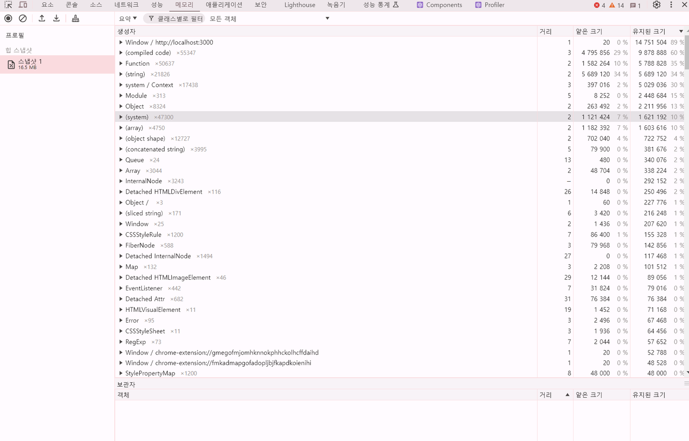
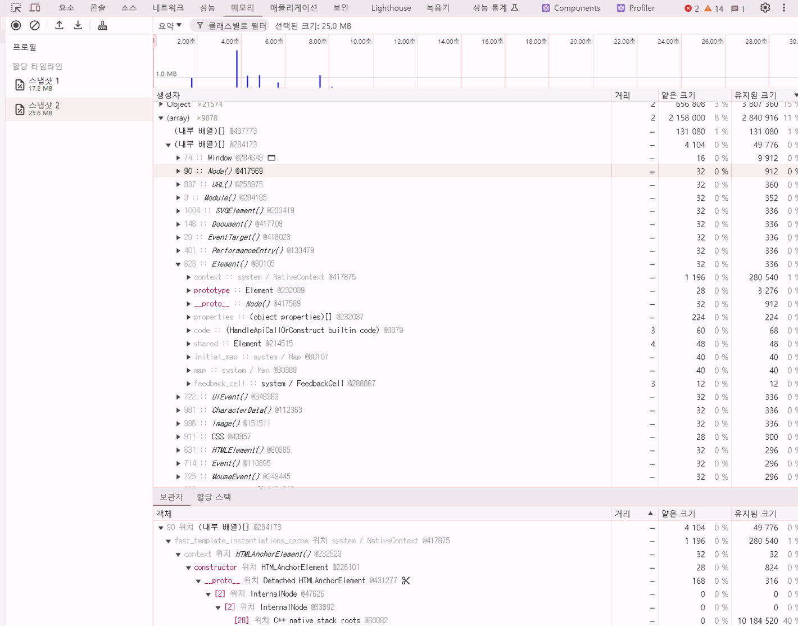
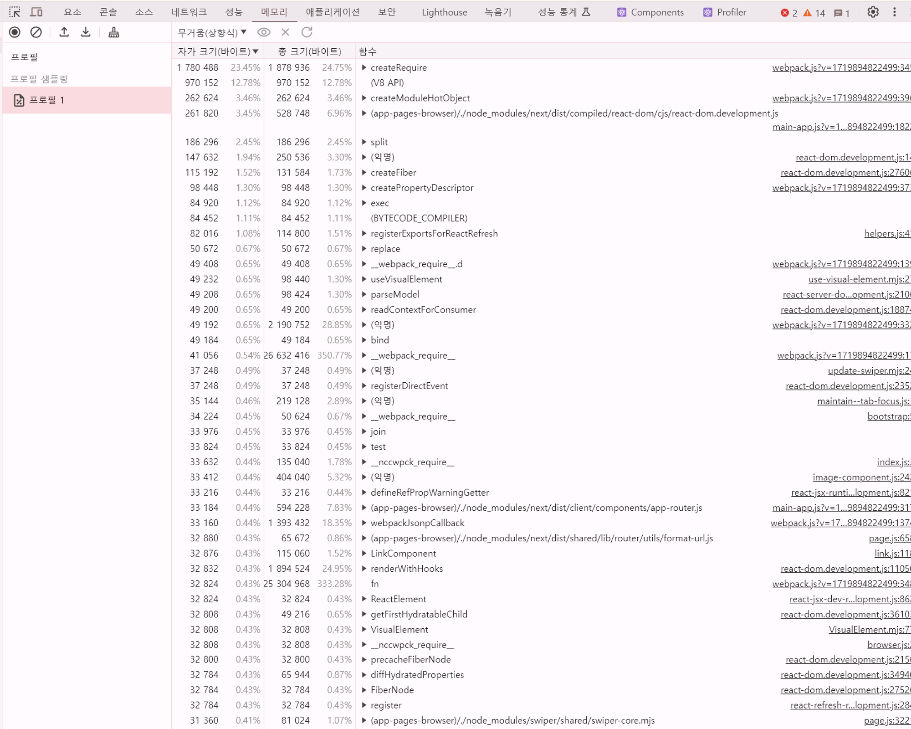
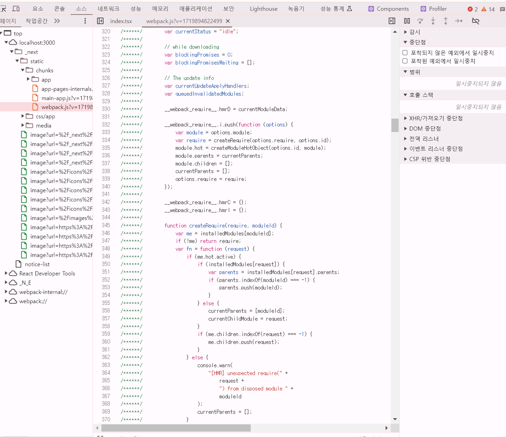

# [7장] 크롬 개발자 도구를 활용한 애플리케이션 분석

## 7.1 크롬 개발자 도구란?

- 크롬에서 제공하는 개발자용 도구로, 웹페이지에서 일어나는 거의 모든 일을 확인할 수 있는 개발도구 (도구 → 개발자 도구 / F12)
- 크롬 개발자 도구에서 웹사이트를 제대로 디버깅하고 싶다면 시크릿 모드(개인정보 보호 모드)에서 페이지와 개발자 도구를 여는 것을 권장한다.
  - 브라우저에 설치돼 있는 각종 확장 프로그램 때문 (웹페이지 방문 시 확장 프로그램의 실행을 위해 전역 변수나 HTML 요소에 실제 웹 애플리케이션이 제공하지 않은 다른 정보를 추가할 수 있다;;)

## 7.2 요소 탭

- 현재 웹페이지를 구성하고 있는 HTML, CSS 등의 정보를 확인할 수 있다.



**✨요소 화면**

- 단순히 현재 HTML을 보는 것뿐만 아니라 직접 코드를 수정해서 웹페이지에서 어떻게 보이는지 빠르게 확인할 수 있다.
- 웹페이지의 DOM을 직접적으로 수정하면 프로덕션으로 개발된 페이지에서 수정된 내용이 어떻게 보이는지 미리 확인할 수 있어 편리하고, 개발 모드에서도 리액트 코드를 수정해 핫 리로딩을 거치지 않아도 확인할 수 있어 빠른 작업이 가능하다.
- 코드에 의해 클래스나 속성값이 동적으로 제어되는 DOM이 있다면 요소의 중단점을 사용해 디버깅할 수 있다.

**✨요소 정보**

- **스타일 (Styles)**
  - 선택한 요소에 적용된 모든 CSS 스타일 규칙(인라인 스타일, 내부 스타일 시트, 외부 스타일 시트, 브라우저 기본 스타일 등)
  - 각 스타일 규칙의 출처(파일과 라인 번호)를 확인할 수 있으며, 스타일을 실시간으로 수정할 수 있다.
  - 스타일을 추가하거나 수정할 때, 변경된 내용이 즉시 페이지에 반영된다.
  - 스타일 규칙의 우선순위(CSS 특이성)에 따라 어떤 규칙이 적용되는지도 확인할 수 있다.
- **계산됨 (Computed)**
  - 선택한 요소에 적용된 모든 CSS 속성의 최종 값을 보여준다. (요소의 크기, 패딩(padding), 테두리(border), 마진(margin))
  - 상속된 스타일과 브라우저가 계산한 최종 값을 포함하여 각 속성의 값을 확인할 수 있다.
  - 스타일 규칙의 출처와 우선순위를 확인할 수 있다.
- **레이아웃 (Layout)**
  - 선택한 요소의 박스 모델(Box Model)을 시각적으로 나타낸다.
  - flex, grid 등을 확인할 수 있다.
  - 요소의 위치와 크기를 변경할 수 있으며, 이를 통해 레이아웃 문제를 디버깅할 수 있다.
- **이벤트 리스너 (Event Listeners)**
  - 선택한 요소에 추가된 모든 이벤트 리스너를 보여준다.
  - 각 이벤트 리스너가 어떤 이벤트에 반응하는지, 어떤 함수가 실행되는지 확인할 수 있다.
- **DOM 중단점 (DOM Breakpoints)**
  - 특정 요소의 DOM 변경을 추적할 수 있는 중단점을 설정할 수 있다.
  - 요소의 속성이 변경되거나, 요소가 추가되거나 제거될 때 중단점을 설정할 수 있다.
    → 특정 요소의 상태 변화를 추적하고 디버깅할 수 있다.
- **속성 (Properties)**
  - 선택한 요소의 모든 속성을 나열한다.
  - HTML 속성뿐만 아니라 JavaScript에 의해 동적으로 추가된 속성도 포함된다.
  - 속성 값을 확인하고, 필요에 따라 속성을 수정할 수 있다.
- **접근성 (Accessibility)**
  - 접근성은 웹 이용에 어려움을 겪는 장애인, 노약자를 위한 스크린리더기 등이 활용하는 값을 말한다.

## 7.3 소스 탭

- 웹 애플리케이션을 불러오기 위해 실행하거나 참조된 모든 파일을 확인할 수 있다. JS파일, CSS, HTML, 폰트까지 다양한 파일정보를 확인할 수 있다.


- 소스 중단점을 생성해 자바스크립트 실행을 중단시키고 디버깅을 수행할 수 있다. (=debugger)
- 사용 중인 라이브러리에서 버그가 의심되는 지점을 디버깅하거나 실제로 소스코드상에서 어떤 식으로 작동하는지 확인하고 싶을 때 유용하다.

- **감시(Watch)**
  - 특정 표현식이나 변수를 감시할 수 있다.
  - 감시 목록에 변수를 추가하면, 코드 실행 중 해당 변수의 현재 값을 실시간으로 확인할 수 있다.
- **중단점(Breakpoints)**
  - 코드 실행을 특정 위치에서 중단할 수 있는 지점을 설정한다.
    - 라인 중단점(Line Breakpoints): 코드의 특정 라인에
    - 조건부 중단점(Conditional Breakpoints): 특정 조건이 참일 때
    - XHR/가져오기 중단점(XHR/Fetch Breakpoints): 특정 URL이나 모든 네트워크 요청에 대해
    - DOM 중단점(DOM Breakpoints): 특정 DOM 요소가 변경될 때
    - 이벤트 리스너 중단점(Event Listener Breakpoints): 특정 이벤트가 발생할 때
    - CSP 위반 중단점(CSP Violation Breakpoints): 콘텐츠 보안 정책 위반이 발생할 때
- **범위(Scope)**
  - 현재 중단점에서 접근 가능한 모든 변수
    - 로컬(Local) 범위: 현재 함수 내에서 정의된 변수
    - 클로저(Closure) 범위: 현재 함수의 상위 함수들에서 정의된 변수
    - 전역(Global) 범위: 전역 객체(window 등)에서 접근 가능한 변수
- **호출 스택(Call Stack)**
  - 현재 중단점에서의 호출 스택을 보여준다.
  - 함수 호출의 순서를 추적하여, 어떤 함수가 현재 함수 호출을 트리거했는지 알 수 있다.
- **전역 리스너(Global Listeners)**
  - 전역적으로 등록된 이벤트 리스너를 보여준다.

## 7.4 네트워크 탭

- 해당 웹페이지를 접속하는 순간부터 발생하는 모든 네트워크 관련 작동이 기록된다.
  
- 만약 생각 이상으로 리소스 크가 크다면 gzip이나 brotli를 적절히 활용해 리소스를 압축하거나 이미지가 있다면 이미지를 최적화할 필요도 있다.

> **Next/Image를 적극 쓰자!!**
>
> [NEXT.JS의 이미지 최적화는 어떻게 동작하는가? | 올리브영 테크블로그](https://oliveyoung.tech/blog/2023-06-09/nextjs-image-optimization/)

📍네트워크 탭에서 집중적으로 확인해야 하는 것들

- 불필요한 요청 또는 중복되는 요청이 없는지
- 웹페이지 구성에 필요한 리소스 크기가 너무 크지 않은지
- 리소스를 불러오는 속도는 적절한지 또는 너무 속도가 오래 걸리는 리소스는 없는지
- 리소스가 올바른 우선순위로 다운로드되어 페이지를 자연스럽게 만들어가는지

## 7.5 메모리 탭

- 현재 웹페이지가 차지하고 있는 메모리 관련 정보를 확인할 수 있다.
- 애플리케이션에서 발생하는 메모리 누수, 속도 저하, 웹페이지 프리징 현상을 확인할 수 있는 유용한 도구다.



- **힙 스냅샷 (Heap Snapshot)**
  - 현재 메모리 힙의 상태를 캡처하여 분석할 수 있는 기능
    → 메모리 누수나 불필요한 메모리 사용을 식별할 수 있다.
- **타임라인의 할당 계측 (Allocation Instrumentation on Timeline)**
  - 타임라인 뷰에서 메모리 할당과 해제를 추적하여, 특정 시점에서 메모리 사용량이 어떻게 변화하는지 분석하는 기능
- **할당 샘플링 (Allocation Sampling)**
  - 메모리 할당을 샘플링하여, 어느 함수에서 메모리 할당이 이루어지는지 분석할 수 있는 기능
    → 메모리 사용량이 많은 부분을 식별하는 데 유용하다.

**👇🏻메모리 현황 디버깅하는 방법👇🏻**

**✨자바스크립트 인스턴스 VM 선택**



- 환경별 힙 크기를 볼 수 있는데, 실제 해당 페이지가 자바스크립트 힙을 얼마나 점유하고 있는지 나타낸다. (자바스크립트 실행에 따라 실시간으로 바뀐다.)

**✨힙 스냅샷**

- 현재 페이지의 메모리 상태를 확인해 볼 수 있는 메모리 프로파일 도구
- 힙 스냅샷을 촬영하는 시점을 기준으로 마치 사진으로 촬영하듯 메모리 현황을 보여준다.
- 각 스냅샷 별로 메모리 크기에 대한 비교를 할 수 있다. 어느 함수를 통해 메모리를 크게 차지 했는지, 해당 객체가 어떠한 값을 가지고 있는 지 등을 확인할 수 있다.



**📍얕은 크기와 유지된 크기의 차이점**

- 얕은 크기: 객체 자체가 보유하는 메모리 바이트의 크기
- 유지된 크기: 해당 객체뿐만 아니라 다른 부모가 존재하지 않는 모든 자식 객체들의 크기까지 더한 값

```tsx
var counter = 0;
var instances = [];

function Y(){
	this.j = 5;
}

function X() {
	this.i = counter++;
	this.y = new Y();
}

export default functin App(){
	function handleClick() {
		instances.push(new X());
	}

	return <button onClick={handleClick}>+</button>
}
```

[p.451 그림 참고]

- 버튼 클릭 시 `X`라는 새로운 객체를 생성하는데 생성자 내부에서 `Y`라는 새로운 생성자를 생성해 할당한다.
  - X는 유지된 크기가 100, 얕은 크기가 52로 선언돼 있다.
  - Y는 유지된 크기가 48, 얕은 크기가 48로 선언돼 있다.
  - 100-48=52 (X의 유지된 크기는 100이지만 Y를 제외하고 X라는 객체 자체가 가지고 있는 크기 자체는 52이다.)
  - **메모리 누수를 찾을 때는 얕은 크기는 작으나 유지된 크기가 큰 객체를 찾아야 한다.**
  - 두 크기의 차이가 큰 객체는 다수의 다른 객체를 참조하고 있다는 의미며, 해당 객체가 복잡한 참조 관계를 가지고 있다는 것이다. 이런 객체가 오랜시간 동안 메모리에 남아있으면 많은 메모리를 점유하고 있을 수 있다..

**✨타임라인 할당 계측**



- 시간의 흐름에 따라 메모리 변화를 확인할 수 있는 기능
- 기간을 좁혀서 확인할 수 있다는 장점
- 특정 변수를 클릭해 전역 변수로 저장을 누르면 해당변수가 무슨 값을 가지고 있는 객체인지 확인할 수 있다.

**✨할당 샘플링**



- 자바스크립트 실행 스택별로 분석할 수 있고, 이 분석을 함수 단위로 한다.
- 무거운 순으로 정렬하면 가장 많은 바이트를 차지한 함수의 작업이 맨 위로 올라온다.
- 소스패널에 표시를 선택하면 해당 함수가 어느 파일에서 어떻게 정의됐는지도 확인할 수 있다.


→ 타임라인 할당 계측과 유사하지만 프로파일링할 때 브라우저에 주는 부담을 최소화할 수 있어 장시간에 걸쳐 디버깅을 수행해야 할 때 유리하다. 만약 메모리 누수가 짐작되지만 정확히 어디에서 발생하는지 확인하기 어려워 힙 스냅샷을 촬영해 비교하기 어려운 경우, 오랜 기간 메모리 누수가 의심되어 프로파일링을 장기간 수행해야 하는 경우에는 할당 샘플링을 활용하는 것이 좋다.

> 예시: 메모리 누수 디버깅)
>
> 1. **힙 스냅샷**
>    - 스냅샷을 찍고 객체를 비교하여 메모리 누수가 있는지 확인한다.
>    - 예를 들어, 특정 객체가 페이지 전환 후에도 해제되지 않고 계속 남아 있는 경우, 해당 객체가 메모리 누수를 유발할 수 있다.
> 2. **타임라인의 할당 계측**
>    - 타임라인을 기록하여 메모리 사용량 변화를 확인한다.
>    - 특정 이벤트(예: 버튼 클릭, 페이지 이동 등) 후 메모리 사용량이 지속적으로 증가하는지 확인한다.
> 3. **할당 샘플링**
>    - 샘플링 결과에서 메모리 할당이 많이 발생하는 함수나 코드 부분을 식별한다.
>    - 할당이 많이 발생하는 부분을 최적화하거나, 필요에 따라 메모리 사용을 줄인다.

| 도구                | 장점                                                                                  | 단점                                                                                                      |
| ------------------- | ------------------------------------------------------------------------------------- | --------------------------------------------------------------------------------------------------------- |
| 힙 스냅샷           | - 메모리 사용량을 시각적으로 보여줌 <br>- 객체의 생성, 참조, 삭제 등을 확인할 수 있음 | - 실시간 데이터가 아니라 특정 시점의 데이터만 제공함<br>- 대규모 애플리케이션에서는 분석이 어려울 수 있음 |
| 타임라인의 할당계측 | - 시간에 따른 메모리 할당량을 보여줌<br>- 메모리 할당 패턴을 확인할 수 있음           | - 실시간 데이터만 제공하므로 특정 시점의 데이터를 확인하기 어려움                                         |
| 할당 샘플링         | - 코드 레벨에서 메모리 할당을 확인할 수 있음<br>- 메모리 누수를 찾는데 유용           | - 샘플링된 데이터만 제공하므로 전체 메모리 사용량을 파악하기 어려움                                       |

## 7.6 Next.js 환경 디버깅하기

**✨Next.js 프로젝트를 디버그 모드로 실행하기**

```tsx
"dev": NODE_OPTIONS='--inspect' next dev
```

**✨Next.js 서버에 트래픽 유입시키기**

- 서버에서 제공되는 서비스는 서버를 실행한 뒤 사용자가 유입되면서 메모리 누수가 발생하는 경우가 많다.
- ab
  - 아파치 재단에서 제공하는 웹서버 성능 검사 도구로, HTTP 서버의 성능을 벤치마킹할 수 있는 도구
  - 단순히 요청을 수행하는 것뿐만 아니라 요청으로부터 응답받는데 걸린 시간, 바이트 크기 등 다양한 정보를 확인할 수 있다.
  ```
  ab -k -c -n 10000 "http://127.0.0.1:3000/"
  ```

**✨Next.js의 메모리 누수 지점 확인하기**

- 해당 페이지에 사용자가 방문할 때마다 메모리 사용이 점차 늘어나는 지점 확인하기

## 참고)

- https://oliveyoung.tech/blog/2023-06-09/nextjs-image-optimization/
- https://nextjs.org/docs/pages/building-your-application/configuring/debugging
