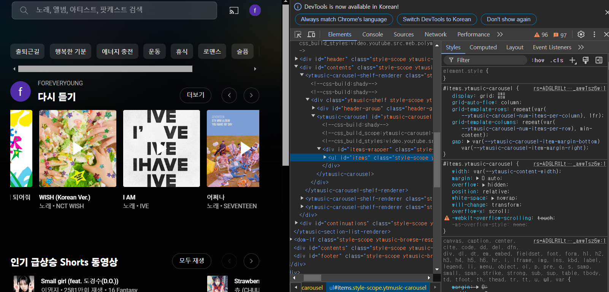
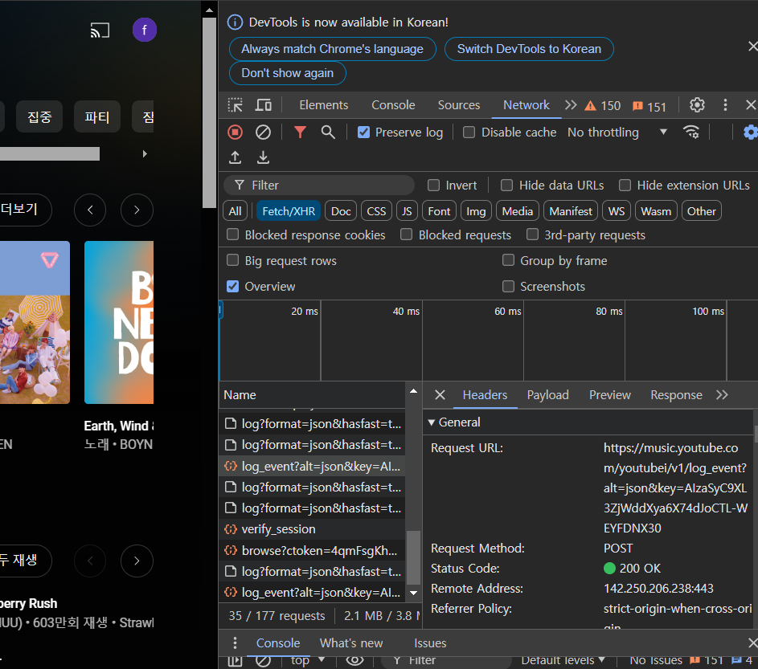
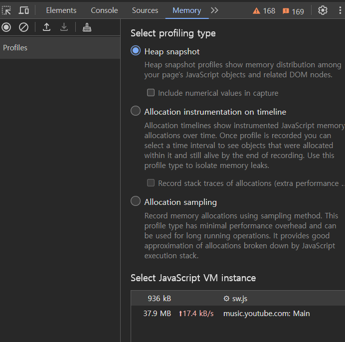

# 7장

- 브라우저 개발자 도구 : 브라우저 환경에서 발생할 수 있는 문제 디버깅할 수 있는 도구

## 7.1 크롬 개발자 도구란 ?

- 보기 → 개발자 도구
- 각종 확장 프로그램으로 인해 시크릿, 프라이빗 모드인 개인정보 보호 모드에서 실행 권장
  - 순수 웹피이지 관련 정보만 확인 가능

## 7.2 요소 탭(Element)



- HTML, CSS 정보

### 7.2.1 요소 화면

- 직접 코드 수정도 가능하여 바로바로 스타일을 수정해 볼 수 있음
- 중단 위치 : 중단 관련 작업 일어날 때마다 해당 요소 변경 일으킨 소스코드 조회 가능

### 7.2.2 요소 정보

- 스타일 : 클래스, 아이디 , 스타일 파일
- 계산됨: 요소 크기, 패딩, 보더, 마진 등
- 레이아웃 : CSS 그리드나 레이아웃
- DOM 중단점 : 중단점 여부

📍 중단점

- 자바스크립트의 실행이 중단되는 코드 내 지점
- 실행이 중지된 시점에 변수가 어떤 값을 담고 있는지, 중지된 시점을 기준으로 명령어를 실행할 수도 있음 → 디버깅 용이 !

📍 debugger 명령어 -

- 중단점을 설정한 것과 같은 효과
- 별도로 브라우저의 개발자 도구를 키는 수고를 하지 않아도 됨

```jsx
function hello(name) {
  let phrase = `Hello, ${name}!`;

  debugger; // <-- 여기서 실행이 멈춥니다.

  say(phrase);
}
```

- 속성 : 해당 요소가 가진 모든 속성값, DOM !
- 이벤트 리스너 : 요소에 부여된 이벤트 리스너
- 접근성 : 웹 이용에 어려움을 겪는 분들을 위해 스크린리더기가 사용하는 값
- 페인팅 관련 단서

### 7.3 소스 탭

- 웹 애플리케이션을 실행하기 위해 실행,참조된 파일
- 소스를 직접적으로 고치지 않고 소스탭에서 고쳐 디버깅이 가능해 소스오염 없이 개발 가능
- 디버깅이나 작동 방식 확인
- 감시 : 해당 변수의 정보, 디버깅 시점에서의 특정 변수 값
- 범위 : 현재 로컬 스코프 의미
- 콜 스택, 전역 스코프에 있는 리스너

## 7.4 네트워크 탭



- 웹페이지 접속 후 발생하는 네트워크 관련 작동
- HTTP 요청, 웹 소켓 등 외부 데이터와 통신하는 정보
- 네트워크 탭에서 확인해 볼 사항
  - 불필요, 중복되는 요청
  - 리소스의 크기와 불러오는 속도
  - 리소스 다운의 우선수위 , 자연스럽게 페이지 생성이 되는지 파악
- 사용자와 다양한 상호작용이 있는만큼 쾌적한 웹 페이지 개발할 때 큰 도움

## 7.5 메모리 탭

- 웹 페이지가 차지하고 있는 메모리 관련 정보
- 메모리 누수, 속도 저하, 프리징 현상
- 힙 스탭샷 : 촬영 시점의 메모리 상황
- 타임라인의 할당 계측 : 시간의 흐름에 따른 메모리 상황
- 할당 샘플링: 메모리 공간 차지하는 JS 함수

### 7.5.1 자바스크립트 인스턴스 VM 선택

- 개발자가 디버깅하고 싶은 환경 선택
- 환경별 힙 크기는 실제 페이지가 JS의 힙을 얼마나 점유하고 있는지 나타냄

### 7.5.2 힙 스냅샷



- 얕은 크기
  - 객체 자체가 보유하는 메모리 바이트 크기
- 유지된 크기
  - 객체 자체 뿐만 아니라 다른 부모가 존재하지 않는 모든 자식들의 크기까지 더한 값
- 쉽게 얕은 크기는 객체 자체가 보유한 크기, 유지된 크기는 힙에서의 크기 ?
- 메모리 누수 : 얕은 크기는 작고 유지된 크기가 큰 객체
- 두 크기의 차이가 크다 : 다수의 다른 객체를 참조(복잡한 참조 관계) → 메모리 누수
- 리액트 메모이제이션 기능 확인
- 기명 함수를 통해 디버깅 용이

### 7.5.3 타임라인 할당 계측

- 시간의 흐름에 따른 메모리 변화
- 메모리 변화를 모두 기록하기 때문에 상대적으로 비용 부담
- 메모리 변화 일으킨 변수, 변수의 크기, 메모리 점유율 등 파악

### 7.5.4 할당 샘플릿

- JS 실행 스택별로 분석, 함수로 분석
- 시간의 흐름에 따라 발생하는 메모리 점유를 확인한다는 점에서 타임라인 할당 계측과 비슷하지만, 프로파일링 시 브라우저에게 주는 부담 최소화
- 오랜 기간 메모리 누수가 일어나는 거 같지만 정확한 이유는 모를 때, 프로파일링을 장기간 수행해야 하는 경우

### 7.6 Next.js 환경 디버깅하기

- 서버 사이드 렌더링을 수행하는 JS 환경에서의 메모리 누수
- 메모리 누수는 서버에 부담 , 서버의 부담은 즉 사용자와의 가까운 상황
- Next.js의 서버 환경 Node.js

### 7.6.2 Next.js 서버에 트래픽 유입시키기

- 사용자 유입의 증가로 인한 메모리 누수
- ab : 웹 서버 성능 검사 도구, HTTP 성능을 벤치마킹한 도구

### 7.6.3 Next.js의 메모리 누수 지점 확인하기

- getServerSide 가 실행될 떄마다 전역변수가 accuess_user push 진행
- 페이지에 방문할 떄마다 요청이 있기에 최대한 사이드 이펙트가 없는 함수로 생성
