# 7. 크롬 개발자 도구를 활용한 애플리케이션 분석

**일반적인 웹 애플리케이션의 디버깅 수행을 위해 범용적인 도구인 개발자 도구를 사용해보자**

## 7.1 크롬 개발자 도구란?

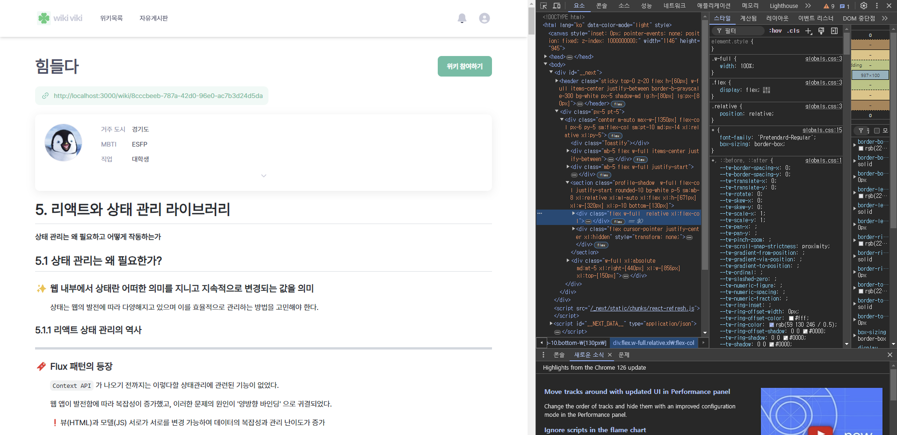

### ✨ 크롬에서 제공하는 개발자 도구로, 크롬 브라우저에서 웹 페이지의 거의 모든 상황을 볼 수 있는 강력한 도구

- 마우스 우클릭 후 검사, 혹은 F12 버튼을 통해 들어갈 수 있다.

- 만약 확장 프로그램 등 다른 외부 요소에 영향을 받고 싶지 않다면 시크릿 모드로 들어가는 것을 권장한다.

<br>

## 7.2 요소 탭

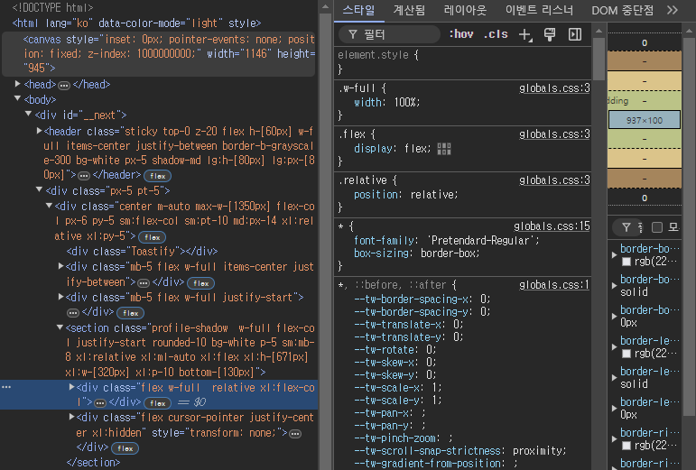

### ✨ 현재 웹페이지를 구성하는 HTML, CSS 등의 정보를 확인 가능

<br>

### 7.2.1 요소 화면

---

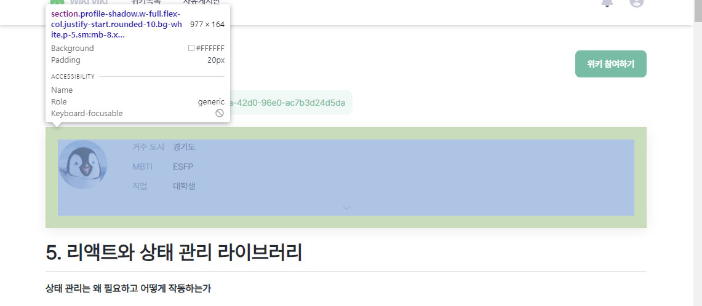

### 🔖 원하는 태그를 클릭하거나 맨 왼쪽 화살표창 버튼을 클릭 후 화면 상의 요소를 직접 클릭해 찾는 것도 가능하다.

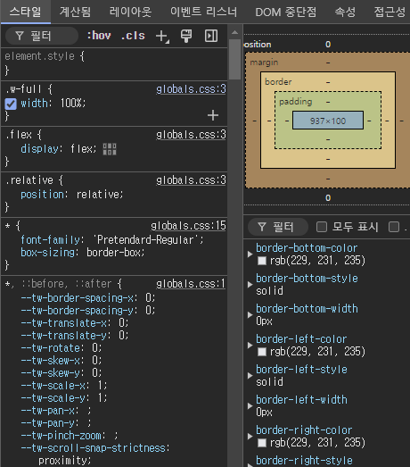

- 직접 코드를 수정해서 웹 페이지 상에 적용된 요소들의 체크가 가능하다.

- 디버깅 하고싶은 요소를 클릭 후 중단 위치를 설정하면 중단 관련 작업이 일어날 때마다 요소 변경을 일으킨 소스 코드를 보여준다.

<br>

### 7.2.2 요소 정보

---

### 🔖 요소 탭 오른쪽에서 해당 요소와 관련된 정보 GET

- 스타일 : 요소와 관련된 스타일 정보 출력 (클래스, 태그, 아이디 등)

- 계산됨 : 요소의 크기, 패딩, 보더, 마진 등의 CSS 적용 결과값 출력

- 레이아웃 : CSS 플렉스나 그리드의 레이아웃 정보 확인

- 이벤트 리스너 : 요소에 적용된 이벤트 리스너 확인 가능

- DOM 중단점 : 중단점 유무 확인 탭

- 속성 : 해당 요소가 가진 모든 속성값 출력

- 접근성 : 장애인, 노약자 등을 위한 스크린 리더기 등이 활용하는 값들 출력

### 👍 DOM과 관련된 정보 확인을 위해 해당 탭을 적극 활용해보자

<br>

## 7.3 소스 탭

### ✨ 웹 앱을 불러오기 위해 실행하거나 참조된 모든 파일 확인 가능

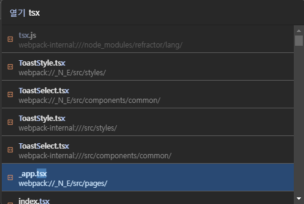

- 파일 열기 명령어를 통해 웹페이지를 구성하는 파일들에 접근 가능하고 코드 내용도 확인 가능

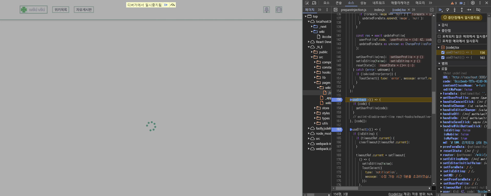

- 또한 `debugger` 선언과 비슷하게 소스 탭에서 자체 중단점을 선언하여 코드의 로직을 살펴보는 것도 가능하다.

- 소스 탭 오른쪽의 다양한 기능을 통해 코드를 세분화하여 추적할 수 있어 코드의 다양한 정보를 확인하고 싶을 때 매우 유용하다.

<br>

## 7.4 네트워크 탭

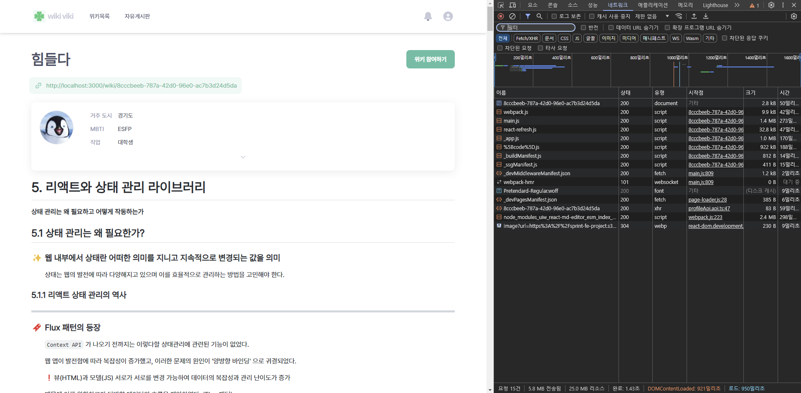

### ✨ 네크워크와 관련된 모든 작동을 기록하는 탭이며 확인 또한 가능

- 추가적으로 `useEffect` 등의 잘못된 사용도 해당 탭의 네트워크 요청이 두번 실행되는 등의 정보 확인을 통해 체크 가능

- '스크린샷' 기능을 활용해 네트워크 요청 흐름에 따라 페이지의 로딩도 실시간으로 확인 가능

<br>

## 7.5 메모리 탭

### ✨ 현재 웹이 차지하는 메모리 정보를 확인 가능 (난이도 상)

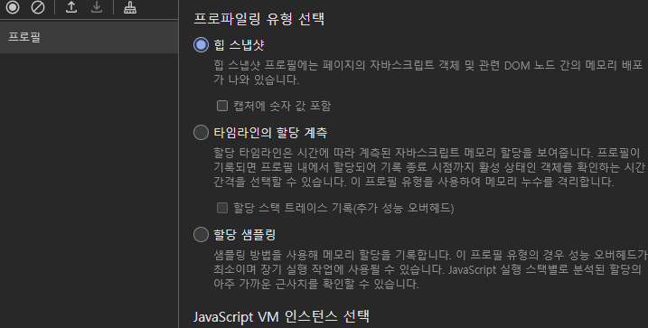

- 프로파일링을 통해 원하는 정보 출력 (리액트 개발도구의 프로파일러와 흡사)

- 메모리 탭 자체만으로는 아무것도 할 수 없음

<br>

### 7.5.1 자바스크립트 인스턴스 VM 선택

---

### 🔖 현재 실행 중인 자바스크립트 VM 인스턴스 확인 가능

- 디버깅을 원하는 VM 환경을 선택하면 해당 페이지가 JS 힙을 얼마나 점유하는지 확인이 가능하다.

- 크기에 비례해 브라우저에 부담이 가기 때문에 항상 주시해야 한다.

<br>

### 7.5.2 힙 스냅샷

---

### 🔖 현재 페이지의 메모리 상태를 확인 가능한 메모리 프로파일 도구

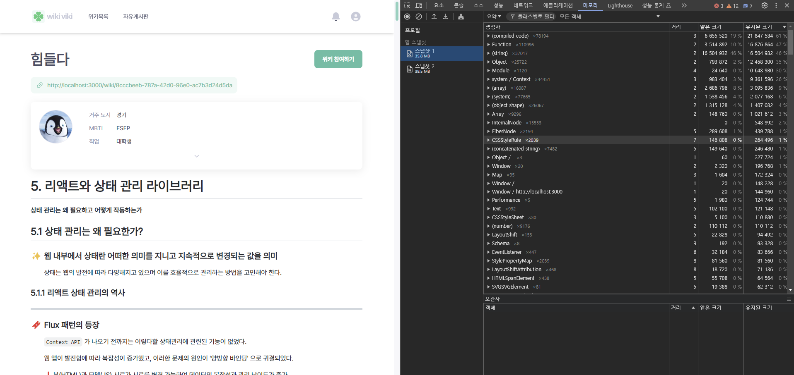

- 첫번째 페이지를 실행하고 스냅샷을 촬영하면 페이지의 다양한 구성요소들이 메모리를 맛있게 먹고 있는 모습을 볼 수 있다.

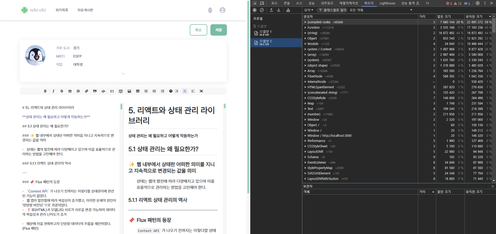

- 페이지의 상태값을 변경하여 페이지의 렌더링을 변하게 만들면 메모리의 사용량이 조금 증가하고 메모리를 사용하는 요소들도 일부 변경되는 모습이다.

### ❗빈 껍데기의 HTML이라도 메모리 탭에는 다양한 내용이 담긴다.

- 따라서 스냅샷을 두개 이상 찍어 비교하는 것이 좋다.

- 또한 `useMemo` 나 `useCallback` 과 같은 최적화 관련 훅들이 의도대로 동작하는지 확인 또한 가능하다. (스냅샷 비교)

<br>

### 7.5.3 타임라인 할당 계측

---

### 🔖 시간의 흐름에 따라 메모리 변화를 확인 가능

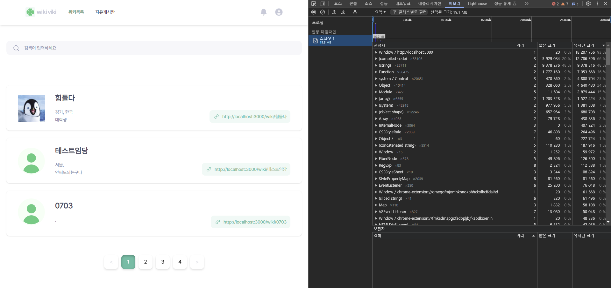

- 시간에 따라 메모리 변화를 모두 기록하며, 기간을 좁혀서도 확인 가능하다.

- 그만큼 부담이 발생하긴 한다.

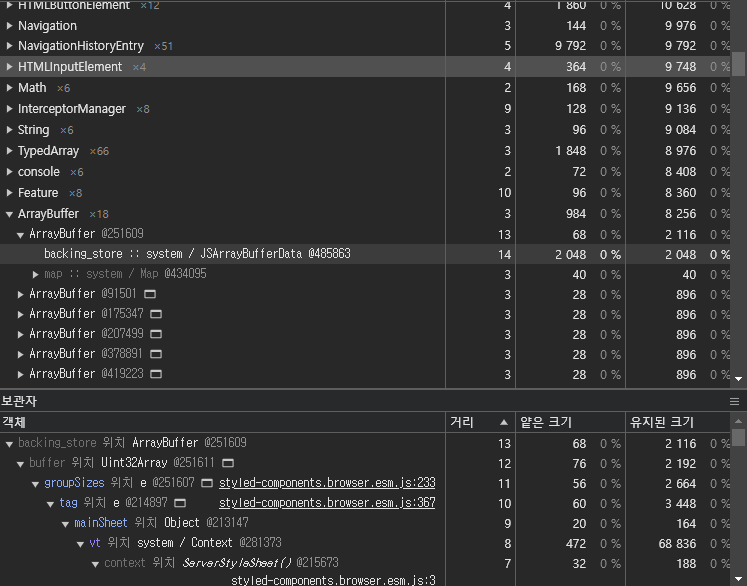

- 전역 변수 저장 기능을 통해 지정한 변수의 정보를 확인 가능하다.

<br>

### 7.5.4 할당 샘플링

---

### 🔖 할당 계측과 비슷하나 JS 실행 스택별로 분석 및 이를 함수 단위로 실행

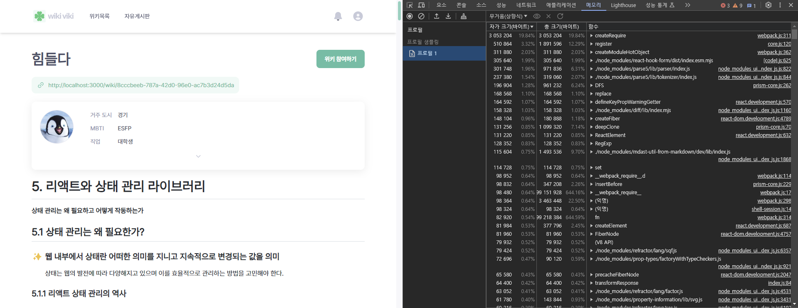

- 프로파일링 시 브라우저에 주는 부담을 최소화한다.

- 메모리 누수가 정확히 어디서 발생하는지 모르거나 프로파일링을 장기간 수행해야 하는 경우 이를 사용하길 권장한다.

<br>

## 7.6 Next.js 환경 디버깅하기

### ✨ 서버 사이드 렌더링을 수행하는 Next.js 환경에서 디버깅을 수행해보자

<br>

### 7.6.1 Next.js 프로젝트를 디버그 모드로 실행하기

---

```bash
"dev": NODE_OPTIONS='--inspect' next dev
```

- 위 코드를 통해 `Next.js` 프로젝트를 디버깅 모드로 실행 가능하다.

- 보통 서버 사이드 렌더링의 경우 사용자의 유입으로 인해 메모리 누수가 발생하는 경우가 많다.

<br>

## 7.7 책 정리 + 주관적인 정리

### 🔖 책 정리

- 실제 디버깅 작업은 매우 어렵고 귀찮으며, 메모리 누수의 원인을 찾는 길고 지루한 여정을 끊임없이 반복해야 한다. (우욱..)

- 게다가 이런 과정을 거쳐 얻는게 본인의 코드일지, 사용한 라이브러리 때문일지도 불명확하다.

- 하지만 이런 과정을 거쳐 원인을 파악하고 문제를 수정하여 더 나은 서비스를 제공하는 것이 개발자의 중요한 과제 중 하나이다.

### 🏷️ 주관적인 정리

- 요번 단원 뿐 아니라 전체적으로 통틀어서 리액트 뿐만 아니라 조금 더 근본적인 과제에 대해 공부하는 것 같아서 상당히 흥미롭다.

- 전 단원도 그렇고 디버깅 툴에 대해 정말 몰랐다고 생각이 들었고, 앞으로 개발을 쭉 이어가면서 적극적으로 활용한다면 더욱 효율적인 개발이 가능할 것이라는 생각이 들었다.
