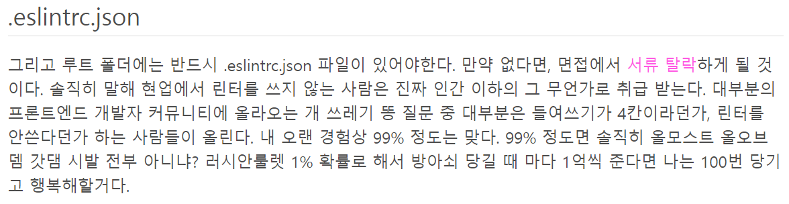
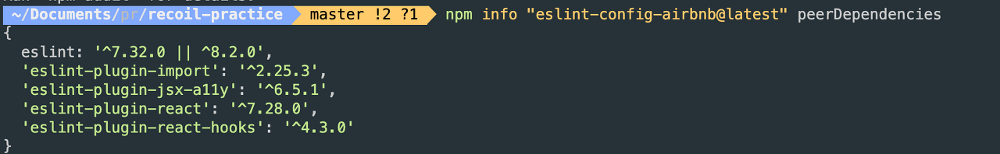

# 08장: 좋은 리액트 코드 작성을 위한 환경 구축하기

## 8.1 ESLint를 활용한 정적 코드 분석

정적 코드 분석: 코드의 실행과는 별개로 코드 그 자체만으로 코드 스멜을 찾아내어 문제의 소지가 있는 코드를 사전에 수정하는 것

### ESLint 살펴보기


▲ ㄷㄷㄷ

#### ESLint는 어떻게 코드를 분석할까?

1. JS 코드를 문자열로 읽는다.
2. JS 코드를 분석할 수 있는 파서로 코드를 구조화한다. (AST)
3. 이 구조화된 트리를 기준으로 각종 규칙과 대조한다.
4. 대조 후 이를 위반한 코드를 알리거나 수정한다.

JS를 분석하는 파서에는 여러 가지가 있는데 ESLint는 기본값으로 espree를 사용한다.

```js
function hello(str) {}
```

```json
{
  "type": "Program",
  "start": 0,
  "end": 22,
  "body": [
    {
      "type": "FunctionDeclaration",
      "start": 0,
      "end": 22,
      "id": {
        "type": "Identifier",
        "start": 9,
        "end": 14,
        "name": "hello"
      },
      "expression": false,
      "generator": false,
      "async": false,
      "params": [
        {
          "type": "Identifier",
          "start": 15,
          "end": 18,
          "name": "str"
        }
      ],
      "body": {
        "type": "BlockStatement",
        "start": 20,
        "end": 22,
        "body": []
      }
    }
  ],
  "sourceType": "module"
}
```

espree 같은 코드 분석 도구는 단순히 변수인지, 함수인지 등만 파악하는 것이 아니라 코드의 정확한 위치와 같은 아주 세세한 정보도 분석해 알려준다.

<br>

ESLint가 espree로 코드를 분석한 결과를 바탕으로, 어떤 코드가 잘못된 코드이며 어떻게 수정해야 할지도 정해야 한다.

### eslint-plugin과 eslint-config

#### eslint-plugin

특정한 규칙의 모음을 모아놓은 패키지다.

#### eslint-config

eslint-plugin이 특정 프레임워크나 도메인과 관련된 규칙을 묶어서 제공하는 패키지라면 eslint-config는 이러한 eslint-plugin을 한데 묶어서 완벽하게 한 세트로 제공하는 패키지라 할 수 있다.

_airbnb의 경우 해당 config를 사용하기 위해 필요한 peerDependencies가 있는데,
이처럼 여러 의존성을 세트로 제공하는 것이 config의 역할인 것 같다._



#### eslint 설정 파일 들여다보기

##### .env

코드가 실행되는 환경 설정
각 환경마다 전역 변수를 통해 접근이 가능한 고유한 객체들이 있는데,
ESLint는 미리 선언하지 않고 접근하는 변수에 대해 오류를 낸다.
따라서 설정을 통해 알려줘야 한다.

```json
{
  "env": {
    "browser": true,
    "node": true,
    "es6": true
  }
}
```

##### parser

ESLint가 사용할 파서를 지정한다.
기본값은 espree며 TS의 경우 `@typescript-eslint/parser`를 사용한다.

##### plugins

기본으로 제공되는 규칙 외에도 추가적인 규칙을 사용할 수 있도록 만들어주는 플러그인
플러그인은 새로운 규칙을 단순히 설정이 가능한 상태로 만들어주기만 한다.
extends 옵션이나 rules 옵션을 통해 추가 설정을 해줘야 한다.

```json
{
  "plugins": ["import", "react"]
}
```

##### extends

- config를 사용하는 경우

```json
{
  "extends": ["airbnb"]
}
```

- plugins을 사용하는 경우
  _대부분의 ESLint 플러그인은 추천 설정을 제공하는데 아래와 같이 적용할 수 있다._

```json
{
  "plugins": ["import", "react"],
  "extends": ["plugin:import/recommended", "plugin:react/recommended"]
}
```

extends 배열에서는 나중에 정의된 설정이 앞서 정의된 설정을 상속하고 덮어쓴다.
따라서 일반적인 설정 뒤에 구체적인 설정이 오도록 구성한다.

```json
{
  "extends": [
    "airbnb",
    "airbnb-typescript",
    "airbnb/hooks",
    "next/core-web-vitals",
    "plugin:@typescript-eslint/recommended",
    "prettier"
  ]
}
```

##### rules

규칙 하나 하나를 세세하게 제어하고 싶을 때
**일반적으로 extends 옵션을 통해서 설정된 규칙을 덮어쓰고 싶을 때 사용된다.**

```json
{
  "extends": ["airbnb"],
  "rules": {
    "no-console": "error",
    "import/prefer-default-export": "off"
  }
}
```

##### ignorePatterns

ESLint는 기본적으로 node_modules 폴더나 .로 시작하는 설정 파일은 무시한다.
그 밖에 다른 파일을 무시하고 싶다면 설정 파일의 ignorePatterns 옵션을 사용할 수 있다.

```json
{
  "ignorePatterns": ["next.config.mjs", "postcss.config.mjs"]
}
```

##### overrides

프로젝트 내에서 일부 파일에 대해서만 다른 설정을 적용해줘야 할 때 사용한다.

```json
  "overrides": [
    {
      "files": ["*.tsx", "*.jsx"],
      "rules": {
        "@typescript-eslint/no-use-before-define": "off"
      }
    }
  ],
```

### 주의할 점

#### Prettier와의 충돌

ESLint가 코드의 품질을 올리고 잠재적인 문제가 될 수 있는 부분을 분석해준다면,
Prettier는 코드의 포매팅(줄바꿈, 들여쓰기, 작은따옴표와 큰따옴표 등)과 관련된 작업을 담당한다.

ESLint에서도 들여쓰기, 줄바꿈 등을 처리할 수 있기 때문에 두 가지 모두를 JS 코드에서 실행한다면 서로 충돌하는 규칙으로 인해 에러가 발생할 수 있다.

**해결 방법**

1. **eslint-config-prettier : eslint에서 prettier와 충돌할 수 있는 rule을 꺼버림 ✅
   코드 오류를 잡는데는 eslint, 코드 포맷팅에는 prettier를 사용하는 방법이다.**
2. eslint-plugin-prettier : prettier를 eslint의 rules로 동작하게 함
   포맷팅 문제도 오류로 출력되어서 오류 메시지가 지나치게 많아지며 느리다.
3. prettier-eslint : prettier를 실행하고 나서 eslint —fix를 실행함
   prettier를 단독으로 실행하는 것 보다 훨씬 느리다.

참고자료: https://yrnana.dev/post/2021-03-21-prettier-eslint/

#### 규칙에 대한 예외 처리

리액트 개발자라면 규칙에서 `react-hooks/no-exhaustive-deps`를 가장 많이 제외할 것이다.
이 규칙은 useEffect나 useMemo와 같이 의존 배열이 필요한 훅에 의존성 배열을 제대로 선언했는지 확인하는 역할을 한다.

규칙을 제외하는 각각의 상황을 살펴보자.

- 괜찮다고 임의로 판단한 경우: 해당 변수는 컴포넌트의 상태와 별개로 동작한다는 것을 의미한다.
  이 경우에는 해당 변수를 어디에 선언할지 다시 고민해 봐야 한다.
- 의존성 배열이 너무 긴 경우: useEffect를 쪼개서 의존성 배열의 가독성과 안정성을 확보해야 한다.
- 마운트 시점에 한 번만 실행하고 싶은 경우: 의도적으로 []로 모든 의존성을 제거해 컴포넌트가 마운트되는 시점에만 실행하고 시은 경우다. 이러한 접근 방법은 함수 컴포넌트의 패러다임과는 맞지 않을 가능성이 있다. 상태와 관계없이 한 번만 실행돼야 하는 것이 있다면 해당 컴포넌트에 존재할 이유가 없다. 이 경우 적절한 위치로 옮기는 것이 옳다.

#### ESLint 버전 충돌

사용하는 패키지의 ESLint 버전이 다르다면 lint를 실행할 때마다 오류 메시지를 마주하게 된다.
ESLint의 의존성이 peerDependencies로 명시되지 않은 패키지를 설치할 때는 주의해야 한다.

## 8.2 리액트 팀이 권장하는 리액트 테스트 라이브러리

프런트엔드와 백엔드 모두 테스팅이 중요하지만 테스트하는 방법과 방법론은 사뭇 다르다.

백엔드는 화이트박스 테스트로 내부 소스 코드를 테스트한다.
반면 프런트엔드는 사용자와 동일하거나 유사한 환경에서 수행되며 이 과정에서 굳이 프런트엔드 코드를 알 필요는 없다.

프런트엔드 개발은 디자인 요소뿐만 아니라 사용자의 인터랙션, 의도치 않은 작동 등 브라우저에서 발생할 수 있는 다양한 시나리오를 고려해야 하기 때문에 일반적으로 테스팅하기가 매우 번거롭다.
React Testing Library를 통해 어떤 도움을 얻을 수 있는지 알아보자.

### React Testing Library란?

DOM Testing Library에 대해 먼저 알아보자.
DOM TEsting Library는 jsdom을 기반으로 하고 있다.
jsdom은 HTML이 없는 JS만 존재하는 환경(Node.js)에서 HTML과 DOM을 사용할 수 있도록 해주는 라이브러리다.

```js
const jsdom = require("jsdom");
const { JSDOM } = jsdom;

const dom = new JSDOM(`<!DOCTYPE html><p>Hello world</p>`);

console.log(dom.window.document.querySelector("p").textContent); // Hello world
```

이처럼 HTML이 있는 것처럼 DOM을 불러오고 조작할 수 있다.
DOM Testing Library를 기반으로 리액트 기반 환경에서 리액트 컴포넌트를 테스팅할 수 있는 라이브러리가 리액트 테스팅 라이브러리다.

### 자바스크립트 테스트의 기초

테스트 코드란 내가 작성한 코드가 내가 코드를 작성했던 당시의 의도와 목적에 맞는지 확인하는 코드를 의미한다.

```js
let actual = sum(1, 2);

let expected = 3;

if (expected !== actual) {
  throw new Error(`${expected} is not equal to ${actual}`);
}
```

기본적인 테스트 코드를 작성하는 방식은 다음과 같은 과정을 거친다.

1. 테스트할 함수나 모듈을 선정한다.
2. 함수나 모듈이 반환하길 기대하는 값을 적는다.
3. 함수나 모듈의 실제 반환 값을 적는다.
4. 기댓값과 실제값이 일치하는지 확인한다.
5. 기대하는 결과를 반환하면 성공, 다르면 에러를 던진다.

Node.js는 assert라는 모듈을 기본적으로 제공하며 다음과 같이 사용할 수 있다.

```js
const assert = require("assert");

function sum(a, b) {
  return a + b;
}

assert.equal(sum(1, 2), 3);
```

<br>

좋은 테스트 코드는 어떤 테스트가 뭇엇을 테스트하는지 일목요연하게 보여주는 것도 중요하다.

```js
test("두 인수가 덧셈이 되어야 한다.", () => {
  expect(sum(1, 2)).toBe(3);
});
```

앞서 Node.js의 assert를 사용했던 것과 다르게 콘솔에서 볼 수 있는 테스트 관련 정보가 한층 다양해졌다.

또 jest 테스트 코드에서 볼 수 있는 특별한 점은 test, expect 등의 메서드를 import나 require 같은 모듈을 불러오기 위해 사용하는 구문 없이 바로 사용했다는 것, 그리고 node가 아닌 `npm run test`로 실행다는 것이다.

jest는 실행 시 전역 스코프에 기본적으로 넣어주는 넣어주는 값들이 있다.
이를 통해 테스트에 관련한 정보를 일일이 import하지 않아도 사용할 수 있는 것이다.

### Jest 문법

Test FileName : `{fn}.test.ts` or`__test__` 폴더 내의 파일

```js
test('테스트 이름',() => {
	expect(검증할 값).toBe(기대값);
})
```

#### 1. Matcher

검증할 값과 기대하는 값을 비교하게 해주는 Matcher에 대해 알아보자

##### 원시값

- toBe: 같은지 확인

##### 객체

- toEqual: 같은지 확인
- toStrictEqual: 엄격하게 테스트 (권고)

##### null, undefined

- toBeNull
- toBeUndefined
- toBeDefined

##### truthy, falsy

- toBeTrurhy
- toBeFalsy

##### 숫자 비교

- toBeGreaterThan
- toBeGreaterThanOrEqual
- toBeLessThan
- toBeLessThanOrEqual

_프로그래밍 언어에서 소수점을 정확하게 계산하지 못하는 경우가 있다.
JS가 이에 해당하는 경우_

- toBeCloseTo : 값이 근사치인지 판별

##### 정규 표현식

- toMatch

##### 배열

- toContain : 배열안에 기대값을 포함하고 있는지 테스트

##### 예외 처리

- toThrow : 기대값에 인수를 넣어 특정 에러를 발생시키는지 확인할 수 있다.

#### 2. 테스트 전후 작업

##### 순서 작업

- beforeEach, afterEach: 각 테스트 전후에 실행
- beforeAll, afterAll: 모든 테스트 최초에 한 번, 최후에 한 번 실행

##### 분류

- describe: 관련 있는 테스트를 묶는다.

##### only, skip

- test.only : 해당 테스트만 단독 실행
- test.skip : 해당 테스트 제외하고 실행

#### 3. mockFn

목함수 : 테스트하기 위해 흉내만 낸 함수

##### 목함수 생성

```js
const mockFn = jest.fn();
```

##### 특정 인자와 함께 호출되었는지 확인

```js
mockFn.mock.calls;
```

##### 가짜 반환값

```js
mockFn.mockReturnValueOnce(10).mockReturnValue(20);
```

##### 비동기 목함수

```js
mockFn.mockResolvedValue({ name: "Mike" });
```

### 리액트 컴포넌트 테스트 코드 작성하기

리액트에서 컴포넌트 테스트는 다음과 같은 순서로 진행된다.

1. 컴포넌트를 렌더링한다.
2. 필요하다면 컴포넌트에서 특정 액션을 수행한다.
3. 기대하는 결과와 실제 결과를 비교한다.

#### 정적 컴포넌트

별도의 상태가 존재하지 않아 항상 같은 결과를 반환하는 컴포넌트를 테스트하는 방법

##### Matcher

https://github.com/testing-library/jest-dom

##### Query

리액트 컴포넌트를 테스트하기 위해서는 HTML 요소를 가져와야 한다.
이 방법은 크게 3가지가 있다.

1. getBy...: 해당 요소가 없거나 두 개 이상이면 에러를 발생시킨다. 복수 개를 찾고 싶다면 getAllBy...를 사용하면 된다.
2. findBy...: getBy...와 유사하나 Promise를 반환하는 차이점이 있다. 비동기로 찾는다는 것을 의미하면 기본값으로 1000ms의 타임아웃을 가지고 있다. 비동기 액션 이후에 요소를 찾을 때 사용한다.
3. queryBy...: 해당 요소를 찾지 못한다면 null을 반환한다.

_testId_

위의 모든 방법으로 Element를 찾을 수 없을 때 데이터셋을 이용한다.

```jsx
<div data-testid="my-div" />
```

```js
const myDivEl = screen.getByTestId("my-div");
```

그러나 이 방법은 테스트를 위해 기존 코드와 상관없는 속성이 HTML에 추가된다.
따라서 **최후의 방법**으로 사용하자.

#### 동적 컴포넌트

```jsx
import { useState } from "react";

export default function Login() {
  const [isLogin, setIsLogin] = useState(false);

  const handleClick = () => {
    setIsLogin((prev) => !prev);
  };

  return <button onClick={handleClick}>{isLogin ? "Logout" : "Login"}</button>;
}
```

```js
import { render, screen } from "@testing-library/react";
import Login from "./Login";
import userEvent from "@testing-library/user-event";

describe("Login Test", () => {
  it("처음에는 Login 버튼이 있다.", () => {
    render(<Login />);
    const btnEl = screen.getByRole("button");

    expect(btnEl).toHaveTextContent("Login");
  });

  const user = userEvent.setup();

  test("한번 클릭하면 Logout 버튼이 된다.", async () => {
    render(<Login />);
    const btnEl = screen.getByRole("button");
    await user.click(btnEl);

    expect(btnEl).toHaveTextContent("Logout");
  });
});
```

#### 비동기 이벤트가 발생하는 컴포넌트

MSW는 Node.js나 브라우저에서 모두 사용할 수 있는 모킹 라이브러리로
fetch 요청을 하는 것과 동일하게 네트워크 요청을 수행하고, 이 요청을 중간에 MSW가 감지해
미리 준비한 모킹 데이터를 제공한다.

fetch의 모든 기능을 그대로 사용하면서도 응답에 대해서만 모킹할 수 있으므로 fetch를 모킹하는 것이 훨씬 수월해진다.

```jsx
// TodoList.jsx

import { useEffect, useState } from "react";

export default function TodoList() {
  const [todoList, setTodoList] = useState([]);
  const [errorMsg, setErrorMsg] = useState("");

  useEffect(() => {
    fetch("https://jsonplaceholder.typicode.com/todos")
      .then((res) => res.json())
      .then((json) => setTodoList(json))
      .catch(() => setErrorMsg("에러 발생"));
  }, []);

  return (
    <>
      <h1>Todo</h1>
      {errorMsg ? (
        <p>{errorMsg}</p>
      ) : (
        <ul>
          {todoList.map((todo) => (
            <li
              key={todo.id}
              style={{
                textDecoration: todo.completed ? "line-through" : undefined,
              }}
            >
              {todo.title}
            </li>
          ))}
        </ul>
      )}
    </>
  );
}
```

```js
// mock/server.js

import { setupServer } from "msw/node";
import { handlers } from "./handlers";

export const server = setupServer(...handlers);
```

```js
// mock/handler.js

import { rest } from "msw";

export const handlers = [
  rest.get("https://jsonplaceholder.typicode.com/todos", (req, res, ctx) => {
    return res(
      ctx.status(200),
      ctx.json([
        { id: 1, title: "청소", completed: true },
        { id: 2, title: "설거지", completed: true },
        { id: 3, title: "숙제", completed: false },
      ])
    );
  }),
];
```

```js
// TodoList.test.js

import { render, screen } from "@testing-library/react";
import TodoList from "./TodoList";
import { server } from "../mocks/server";
import { rest } from "msw";

describe("Todo List", () => {
  it("리스트가 잘 나온다.", async () => {
    render(<TodoList />);
    const list = await screen.findAllByRole("listitem");

    expect(list).toHaveLength(3);
  });

  it("에러가 났을 때 에러 메시지를 보여준다.", async () => {
    server.use(
      rest.get(
        "https://jsonplaceholder.typicode.com/todos",
        (req, res, ctx) => {
          return res(ctx.status(500));
        }
      )
    );

    render(<TodoList />);
    const error = await screen.findByText("에러 발생");

    expect(error).toBeInTheDocument();
  });
});
```

비동기 이벤트가 있는 컴포넌트를 테스트할 때 중요한 것은 MSW를 사용한 fetch 응답 모킹과 findBy를 활용해 비동기 요청이 끝난 뒤에 제대로 된 렌더링이 일어났는지 기다린 후에 확인하는 것이다.

#### 사용자 정의 훅 테스트하기

커스텀 훅은 JSX를 반환하지 않으며(render를 사용할 수 없다.),
함수형 컴포넌트 이외에서 호출할 수 없다.

커스텀 훅을 테스트하기 위해서는 renderHook을 사용해야 한다.

```jsx
// useCounter.js

import { useState } from "react";

export default function useCounter({ initialCount = 0 } = {}) {
  const [count, setCount] = useState(initialCount);
  const increment = () => setCount(count + 1);
  const decrement = () => setCount(count - 1);

  return { count, increment, decrement };
}
```

```js
import { act, renderHook } from "@testing-library/react";
import useCounter from "./useCounter";

describe("useCounter", () => {
  it("인수를 넘겨주지 않은 경우", () => {
    const { result } = renderHook(useCounter);

    expect(result.current.count).toBe(0);
  });

  it("인수를 넘겨준 경우", () => {
    const { result } = renderHook(useCounter, {
      initialProps: {
        initialCount: 10,
      },
    });

    expect(result.current.count).toBe(10);
  });

  it("increment", () => {
    const { result } = renderHook(useCounter, {
      initialProps: {
        initialCount: 10,
      },
    });

    act(() => {
      result.current.increment();
    });

    expect(result.current.count).toBe(11);
  });

  it("decrement", () => {
    const { result } = renderHook(useCounter, {
      initialProps: {
        initialCount: 10,
      },
    });

    act(() => {
      result.current.decrement();
    });

    expect(result.current.count).toBe(9);
  });
});
```

### 테스트를 작성하기에 앞서 고려해야 할 점

테스트 커버리지는 단순히 얼마나 많은 코드가 테스트되고 있는지를 나타내는 지표일 뿐,
테스트가 잘 되고 있는지를 나타내는 것은 아니다.

테스트 코드를 작성하기 전에 생각해 봐야 할 최우선 과제는 애플리케이션에서 가장 취약하거나 중요한 부분을 파악하는 것이다.

테스트 코드는 개발자가 단순 코드 작성만으로는 쉽게 이룰 수 없는 목표인 소프트웨어 품질에 대한 확신을 얻기 위해 작성하는 것이다.

### 그 밖에 해볼 만한 여러 가지 테스트

- 유닛 테스트: 각각의 코드나 컴포넌트가 독립적으로 분리된 환경에서 의도된 대로 정확히 작동하는지 검증하는 테스트
- 통합 테스트: 유닛 테스트를 통과한 여러 컴포넌트가 묶여서 하나의 기능으로 정상적으로 작동하는지 확인하는 테스트
- 엔드 투 엔드: E2E 테스트라고 하며, 실제 사용자처럼 작동하는 로봇을 활용해 애플리케이션의 전체적인 기능을 확인하는 테스트

---

### 새로 알게된 개념

- eslint 설정에 대해 배웠습니다.
- 리액트에서 테스트하는 방법

### 읽으면서 어려웠거나 이해가 잘 안됐던 부분

- TDD 해보고 싶은데 너무 어렵네요..

---

참고

**eslint**

- https://yrnana.dev/post/2021-09-02-eslint/
- https://www.daleseo.com/eslint-config/
- https://velog.io/@kyusung/eslint-config-2
- https://yrnana.dev/post/2021-03-21-prettier-eslint/

**test**

- https://www.youtube.com/watch?v=g4MdUjxA-S4&list=PLZKTXPmaJk8L1xCg_1cRjL5huINlP2JKt
- https://www.youtube.com/watch?v=K1w6WN7q6k8&list=PLZKTXPmaJk8JNJKFt7CK0jQvFIytGdf9n&index=1
- https://www.youtube.com/watch?v=Ru4V8yCR6jQ
- https://www.youtube.com/watch?v=L1dtkLeIz-M&list=PLcRfh4Tir_AgCBqF3L0_dre9AcMe0LBHT&index=55
