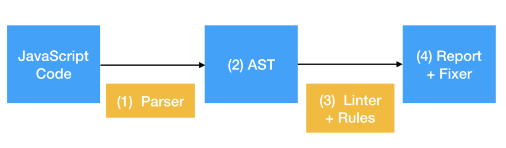
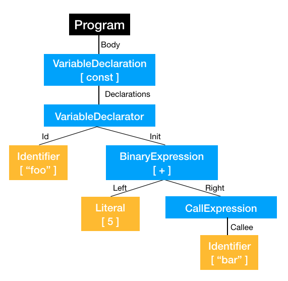
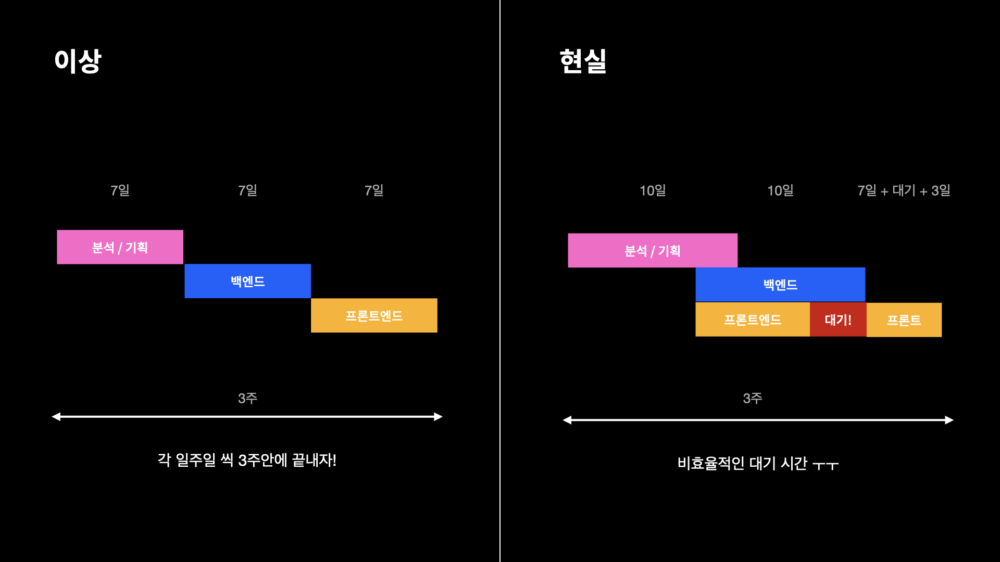
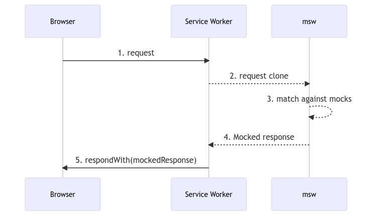

# 8장 좋은 리액트 코드 작성을 위한 환경 구축하기

좋은 코드를 작성할 수 있는 환경을 구축해 보자

## 8.1 ESLint를 활용한 정적 코드 분석

- 정적 코드 분석
  - 코드의 실행과는 별개로 버그를 야기할 수 있는 코드를 찾아내서 사전에 수정하는 것
- JS에서 가장 많이 사용되는 것이 ESLint

### 8.1.1 ESLint 살펴보기

📍ESLint는 어떻게 코드를 분석할까 ??



- JS 코드를 문자열로 읽는다.
- JS 코드를 분석할 수 있는 parser로 코드를 구조화한다. ✨
- 구조화한 트리를 AST(Abstract Syntax Tree)라 하며, 이 AST를 기준으로 각종 규칙과 대조한다.
- 규칙과 대조했을 때 위한반 코드를 알리거나(report) 수정한다(fix)

- espree
  - JS 분석하는 파서
  - JS 코드를 JSON으로 생성된 트리로 변환
  - 소스코드의 구조를 트리 형태로 표현한 것
    
- ESLint가 espree로 분석된 결과를 바탕으로 어떤 게 잘못된 코드인지 파악
- ESLint 규칙(rules) , 특정한 규칙의 모음 plugins
- ESLint 규칙
  - Ex) debugger
  - meta : 해당 규칙과 관련된 메타 정보
  - message : 경고 문구
  - docs : 문소화에 필요한 정보
  - fixable : eslint --fix로 수정했을 때 수정 가능 여부
- creat가 실제로 코드에서 문제점을 확인
  - espress 로 만들어진 AST 트리 순회하면서 선언한 조건에 만족하는 코드를 찾음

### 8.1.2 eslint-plugin과 eslint-config

**📍 eslint-plugin**

- rule을 정의한 패키지
- eslint-plugin-react
  - 리액트와 관련된 룰을 정의한 패키지

**📍 eslint-config**

- plugin 를 통해 매번 모든 룰에 대해 일일이 작성하기 어려우며 번거로움
- **plugin 패키지나 rule을 모아 설정으로 만든 것**
- **eslint-config-airbnb**
  - eslint, eslint-plugin-import, eslint-plugin-react, eslint-plugin-react-hooks, eslint-plug-jsx-a11y의 rule을 조합한 설정 패키지
- 여러 프로젝트에 걸쳐 동일하게 패키지를 사용할 수 있음
- ESLint 설정을 하나하나 하기엔 번거로움이 있어 이미 존재하는 eslint-config 파일 많이 사용함

**✅ eslint-config-airbnb**

- 에어비앤비에서 만든 eslint-config
- 가장 유명하고 많은 개발자들이 유지보수에 참여

세팅 방법

- eslint, typescript를 위한 플러그인과 파서 다운

```
npm install -D eslint @typescript-eslint/eslint-plugin @typescript-eslint/parser
```

- .eslintrc

```tsx
{
  "parser": "@typescript-eslint/parser",
  "plugins": ["@typescript-eslint"],
  "extends": ["plugin:@typescript-eslint/recommended"]
}
```

- package.json

```tsx
 "lint": "eslint './src/**/*.{ts,tsx,js,jsx}'",
 "lint:fix": "eslint --fix './src/**/*.{ts,tsx,js,jsx}'"
```

- eslint-config-airbnb 설치 , TS 적용

```
npm install -D eslint-config-airbnb
npm install -D eslint-config-airbnb-typescript
```

**✅ titicaca/triple-config-kit**

- 한국 커뮤니티에서 운영하는 config 중 유지보수 활발
- 트리플에서 개발
- 특징
  - airbnb 를 기반으로 약간씩 수정되고 있는 다른 config와 달리 자체적으로 정의한 규칙을 기반으로 함
  - 외부로 제공하는 규칙에 대한 테스트 코드 존재 → 자체적인 eslint-config 구축에 관심이 있다면 도움될 듯

**✅ eslint-config-next**

- 단순한 JS코드 뿐만 아니라 JSX , \_app, \_document 에 작성된 HTML 코드도 정적 분석 대상
- 웹 서비스 성능에 영향 미치는 핵심 웹 지표(core web vitals) 요소 분석해 제공하는 기능 포함

### 8.1.3 나만의 ESLint 규칙 만들기

- 정의되어 있지 않는 rule을 만들 경우
- 개발자가 하나하나 수정하는 거보다 간편하고 빠르게 수정할 수 있음

📍 이미 존재하는 규칙을 커스터마이징해서 적용하기 : import react를 제거하기 위한 ESLint 규칙 만들기

- 17버전 이후 import React 필요 X

트리쉐이킹 : 번들러가 코드 어디에서 사용하지 않는 코드를 삭제해서 최종 번들 크기를 줄이는 과정

- import React문은 트리쉐이킹에 의해 제거됨
- 그러나 동일한 코드더라도, importt React가 없는 코드가 웹팩이 트리쉐이킹하는 시간을 그만큼 줄일 수 있음
- no-restricted-import : import React 문을 금지시키는 규칙 (실습)

```jsx
// .eslintrc.js
module.exports = {
  rules: {
    "no-restricted-imports": [
      "error",
      {
        // 금지시킬 모듈
        paths: [
          {
            name: "react",
            importNames: ["defalut"],
            message: "~~~ 보여줄 에러 메세지 ~~~",
          },
        ],
      },
    ],
  },
};
```

📍 완전히 새로운 규칙 만들기 : new Date를 금지시키는 규칙

- new Date( ) : 현재 시간 반환(기기에 종속된 시간)
- 기기에 따라 시간이 변하지 않도록 설정
- new Date() 를 espree 로 분석한 AST
  - `ExpressionStatement`: 해당 코드의 표현식 전체
  - ExpressionStatement.expression : ExpressionStatement에 어떤 표현이 들어가 있는지 확인. ESLint에서 확인하는 하나의 노드 단위
  - ExpressionStatement.expression.type : 타입을 나타냄, new 생성자를 사용
  - ExpressionStatement.expression.callee : 생성자를 사용한 표현식에서 생성자의 이름을 나타냄
  - ExpressionStatement.expression.argument : 생성자를 사용한 표현식에서 생성자에 전달하는 인수
  - AST를 활용해 ESLint 규칙을 만들 수 있음
- `meta` : 해당 규칙과 관련된 정보를 나타내는 필드
- `create` : AST의 타입을 키를 선언해서 해당 코드 스멜을 찾음, 해당 코드에선 if문을 통해 그 범위를 좁힌 듯 ??
  - `fix` : 해당 코드를 수정할 코드
- 규칙을 하나씩 배포하는 것은 불가, 반드시 eslint-plugin 형태로 규칙을 묶음으로 배포할 것

### 8.1.4 주의할 점

📍 Prettier와의 충돌

- Prettier
  - 코드의 포매팅을 도와주는 도구
  - ESLint처럼 정적 분석하여 문제 해결 but ESLint는 코드의 잠재적인 문제가 될 수 있는 부분을
  - Prettier는 포매팅과 관련된 줄바꿈, 띄어쓰기 등 과 같은 작업들을 담당
  - 또한 JS 뿐만 아니라 HTML, CSS, JSON 등 다양한 언어에도 적용 가능
- Prettier와 ESLint 가 서로 충돌을 일으킬 수 있음
  - ESLint에서 Prettier에서 처리하는 작업을 할 수 있기 때문에 모두 JS 코드에서 실행하면 충돌
- 문제 해결 방법
  - 서로 규칙이 충돌하지 않게 규칙을 잘 선언
  - JS, TS 코드는 ESLint에 그 외 JSON, 마크다운은 prettier
    - 대신 JS 에 필요한 Prettier 규칙은 eslint-plugin-prettier 사용
    - eslint-plugin-prettier : Prettier에서 제공하는 모든 규칙을 ESLint에서 사용할 수 있는 규칙으로 만들어둔 플러그인

📍 규칙에 대한 예외 처리, 그리고 react-hooks/no-exhaustive-deps

- 일부 코드에서 특정 규칙을 임시로 제외시키고 싶은 경우 eslint-disable- 주석 사용

```
// eslint-disable-line no-console  -> 특정 줄
// eslint-disable-next-line no-console -> 다음 줄

/* eslint-disable no-console */
 이 주석들 사이에 있는 코드들 제외
/* eslint-disable no-console */

/* eslint-disable no-console */ -> 파일 전체 제외
```

- useEffect, useMemo 처럼 의존성 배열이 필요한 경우 많이 사용
  - but 의존성 배열이 너무 길어지거나, 마운트되는 시점에 한 번만 실행시키고 싶은 경우, 없어도 될 거 같은 경우 등에 사용
- But 잠재적인 버그 야기할 수 있는 가능성 존재
  - 괜찮다고 임의로 판단한 경우 : useEffect 안에서 쓰이는 변수가 컴포넌트의 상태와 별개로 동작함을 의미
  - 의존성 배열이 너무 긴 경우 : 내부 함수가 매우 길다는 것과 동일함 useEffect를 분리하여 의존성 배열의 가독성과 안정성을 확보해야 함
  - 마운트되는 시점에 한 번만 실행시키고 싶은 경우 : 과거 생명주기 형태의 접근 방법으로 함수 컴포넌트의 패러다임과 맞지 않을 수 있음. 또한 컴포넌트의 상태값과 별개의 부수 효과가 되어 컴포넌트의 상태와 불일치가 일어날 수 있음 . 상태와 관계없이 한 번만 실행돼야 한다면 존재할 이유가 없다 (내부 함수가 상태에 의존하고 있는 경우를 전제)
- 타입스크립트의 any 를 강제로 사용하기 위한 규칙도 있으나 모든 규칙은 존재하는 이유가 있음
- eslint-disabled 주석을 많이 사용하고 있다면 해당 규칙을 무시하는 게 옳은지, 규칙을 제거하는 것이 옳은지 점검해 봐야 함

📍ESLint 버전 충돌

- 설치하고자 하는 eslint-config, eslint-plugin이 지원하는 ESLint 버전을 확인하고 설치하고자 하는 프로젝트가 어떤 ESLint 버전을 지원하는지 살펴봐야 함
- 만약 각 지원하는 ESLint 버전이 다르다면 에러 발생

### 8.1.5 정리

- Prettier와 ESLint의 차이점을 명확하게 알 수 있었음
- ESLint의 에러 메세지를 무시하지 말자.

## 8.2 리액트 팀이 권장하는 리액트 테스트 라이브러리

- 테스트 : 프로그램이 의도대로 작동하는지 확인하는 일련의 작업
  - 버그를 사전에 방지
  - 이후 잘못된 작동으로 인한 비용 줄임
  - 사용자에게 안정적인 서비스를 제공
- 백엔드와 프론트엔드의 테스트 방법은 다름
  - 백엔드는 데이터와 관련한 로직 때문에 GUI가 아닌 AUI(Application User Interface : 응용 프로그램 사용자 인터페이스)
  - 프론트엔드는 일반적인 사용자와 동일하거나 유사한 환경에서 테스트 진행
  - 사용자가 프로그램에서 수행할 로직과 경우의 수를 고려해야 함
  - 사용자에게 완전히 노출된 영역이기에 사용자 행동을 예측해야 함
  - 디자인 요소와 사용자의 인터랙션, 의도치 않은 작동 등 브라우저에서 발생할 수 있는 다양한 경우 고려
  - 이러한 특징 때문에 테스팅 라이브러리 다양함

### 8.2.1 React Testing Library란 ?

- 리액트를 기반으로 한 테스트를 수행하기 위해 만들어짐
- DOM Testing Library : 리액트 테스팅 라이브러리가 기반으로 함. jsdom을 사용
- jsdom : 순수하게 JS로 작성된 라이브러리로 HTML이 없는 JS만 존재하는 환경에서 HTML 과 DOM을 사용할 수 있도록 하는 라이브러리
- 리액트 테스팅 라이브러리는 DOM Testing Library 에서 확장됨
  - 리액트 기반 환경에서 리액트 컴포넌트를 테스팅할 수 있는 라이브러리
  - 실제로 컴포넌트를 렌더링하지 않고도 원하는 대로 렌더링되고 있는지 확인할 수 있음
  - 컴포넌트뿐만 아니라 Provider,hook 등 리액트를 구성하는 다양한 요소들을 테스트 가능

### 8.2.2 자바스크립트 테스트의 기초

📍 JS 에서 테스트 코드는 어떻게 작성할까 ?

- 테스트 코드 : 내가 작성한 코드가 코드를 작성한 의도와 목적에 맞는지 확인하는 코드
- 테스트 코드 작성 방식
  - 테스트할 함수나 모듈 선정
  - 함수나 모듈이 반환하길 기대하는 값을 적음
  - 함수나 모듈의 실제 반환 값을 적음
  - 3번과 2번의 결과가 일치하는지 확인
  - 기대하는 결과와 다른 결과를 반환하는 경우 에러

✅ Node.js 테스트 모듈 : assert

```jsx
const assert = require("assert");

function sum(a, b) {
  return a + b;
}

assert.equal(sum(1, 2), 3);
assert.equal(sum(1, 2), 4); // Error
```

- 코드가 동작하기 전에 데이터나 수식에 대한 검사를 할 수 있는 모듈
- Assert 모듈에서 제공하는 메소드를 통해 위배가 되는 경우 오류가 발생함
- ()안의 조건이나 값이 유효한지 검사하는 모듈
- 이처럼 테스트 결과를 확인할 수 있도록 도와주는 라이브러리를 어셜션(assertion) 라이브러리라고 함

- 테스트 코드는 가능한 읽기 쉽게, 테스트의 목적이 분명하게 작성되는 것이 중요
- 어떤 테스트가 무엇을 테스트하는지도 분명해야 함
- 리액트 진영에서는 메타가 만든 Jest 테스팅 라이브러리가 널리 쓰임

```jsx
// math.js
function sum(a, b) {
  return a + b;
}

module.exports = {
  sum,
};

// math.test.js
const { sum } = require("./main");

test("두 인자가 덧셈이 되어야 한다", () => {
  expect(sum(1, 2)).toBe(3);
});
test("두 인자가 덧셈이 되어야 한다", () => {
  expect(sum(2, 2)).toBe(4); // error
});
```

- 콘솔에서 볼 수 있는 테스트 관련 정보 다양
  - 무엇을 테스트했는지
  - 소요된 시간
  - 무엇이 성공하고 실패했는지
  - 전체 결과
- Jest를 비롯한 테스팅 프레임워크들은 테스트 파일에서 관련한 메서드와 객체를 전역 스코프 (global) 로 관리되기 떄문에 별도의 import 구문 없이 사용할 수 있음

### 8.2.3 리액트 컴포넌트 테스트 코드 작성하기

순서

- 컴포넌트를 렌더링
- 필요하다면 컴포넌트에서 특정 액션 수행
- 컴포넌트 렌더링과 2번의 액션을 통해 기대하는 결과와 실제 결과를 비교

**✅ 프로젝트 생성**

```
npx create-react-app react-test --template typescript
```

- 리액트 컴포넌트에서 테스트하는 일반적인 시나리오는 특정한 무언가를 지닌 HTML 요소가 있는지 여부임. 이를 확인하는 방법 3가지
  - `getBy…` : 인수의 조건에 맞는 요소 반환, 해당 요소가 없거나 두 개 이상일 경우 에러, 복수를 찾고 싶은 경우 `getAllBy…` 사용
  - `findBy…` : 비동기로 찾으며 Promise를 반환함. 기본값으로 1000ms의 타임아웃을 가짐, 비동기 액션 이후 요소를 찾을 때 사용
  - `queryBy…` : 인수의 조건에 맞는 요소를 반환하는 대신, 찾지 못하면 null 반환, getBy와 findBy는 찾지 못하면 에러 발생시키기 때문에 에러를 발생시키지 않고 싶은 경우 사용
- 컴포넌트를 테스트하는 파일은 같은 디렉터리 상에 위치 ( 파일명.test.tsx )

📍 **정적 컴포넌트**

- 별도의 상태가 존재하지 않아 항상 같은 결과를 반환하는 컴포넌트 테스트 방법
- 해당 컴포넌트를 렌더링한 다음, 테스트를 원하는 요소를 찾아 원하는 테스트를 수행
- Jest 메소드
  - `beforeEach` : 각 테스트를 수행하기 전에 실행하는 함수
  - `describe` : 비슷한 속성을 가진 테스트를 하나의 그룹으로 묶는 역할, 필수 X, 테스트 코드가 많아지고 관리가 어려워지는 경우 편리함
  - `it` : test와 동일하며 test의 축약어(alias)임. 테스트 코드를 읽기 쉽게 하기 위함.
  - `testId` : 리액트 테스팅 라이브러리의 예약어로, get 등의 선택자로 선택하기 어렵거나 곤란한 요소를 선택하기 위해 사용 . HTML DOM 요소에 testId 데이터셋을 선언해 두면 테스트에 `getByTestId` 등으로 선택 가능
- ✨ 데이터셋
  - HTML의 특정 요소와 관련된 임의 정보를 추가할 수 있는 HTML 속성 (HTML의 변수 역할)
  - data-로 시작하는 속성
- 각 테스트를 수행하기 전에 StaticComponent를 렌더링하고 describe로 연관된 테스트를 묶어서 it으로 it 함수 내부에 정의된 테스트를 수행하는 테스트 파일

**📍 동적 컴포넌트**

**✅ 사용자가 useState를 통해 입력을 변경하는 컴포넌트**

- `userEvent.type` : 이벤트를 테스트할 때 사용
  - keyDown, hover 등 fireEvent가 제공하는 이벤트 메서드보다 다양한 메소드 제공 (내부적으로 fireEvent로 구현됨)
- **fireEvent**

  - 리액트 테스팅 라이브러리에서 제공하는 유틸리티 함수 중 하나로 이벤트를 발생하는 테스트에 사용됨
  - 특정 이벤트를 발생시켜 컴포넌트의 상태 변화 및 렌더링 확인하는 데 유용
  - `click()`, `mouseover()`, `focus()`, `change()`등의 유저 이벤트 메서드 제공

- ✨`userEvent` vs `fireEvent`
  - fireEvent는 프로그램적으로 이벤트를 밟생 click()을 호출하면 onClick이라는 Dom Event 발생시킴
  - useEvent는 전체적인 상호작용 테스트
  - click()을 호출하면 클릭하기까지 발생할 수 있는 다양한 이벤트들을 거침 (내부적으로 fireEvent를 실행)
  - mouseOver - mouseMove - mouseDown - mouseUp - click
  - 브라우저에서 사용자가 상호작용할 때 지정된 이벤트 하나만 호출하진 않음. 관련된 이벤트들을 fireEvent를 통해 더 자세하게 **흉내내는** 모듈이라고 볼 수 있음.

→ 대부분의 이벤트를 테스트할 때는 fireEvent로 충분하고 빠름. 특별히 사용자의 이벤트를 **흉내내는** 경우에 useEvent 사용

- `jest.spyOn`

  - mocking에서의 스파이(spy) : 해당 함수의 호출 여부와 어떻게 호출되었는지만을 알아냄

  ```jsx
  const calculator = {
    add: (a, b) => a + b,
  };

  const spyFn = jest.spyOn(calculator, "add");

  const result = calculator.add(2, 3);

  expect(spyFn).toHaveBeenCalledTimes(1);
  expect(spyFn).toHaveBeenCalledWith(2, 3);
  expect(result).toBe(5);
  ```

  - calculator 객체에 add라는 함수에 스파이를 붙여서 add 함수를 호출 후에 호출 횟수와 어떤 인자가 넘어갔는지 검증할 수 있음
  - 하지만 가짜 함수로 대체한 것은 아니기 때문에 결과값을 확인할 수 있다 ?

- ✨mocking 이란?

  - 단위 테스트를 작성할 때 **해당 코드가 의존하는 부분을 가짜(mock)로 대체하는 기법**
  - 일반적으로 테스트하려는 코드가 의존하는 부분을 직접 생성하기 부담스러운 경우 사용
  - 실제 객체인 척하는 가짜 객체를 생성하는 매커니즘 제공
  - 테스트가 실행되는 동안 가짜 객체에 어떤 일들이 발생했는지를 기억하기 때문에 가짜 객체가 내부적으로 어떻게 사용되는지 검증
  - mocking을 이용하면 실제 객체를 사용하는 것보다 훨씬 가볍고 빠르게 실행 가능
  - 즉, 테스트하고자 하는 코드가 의존하는 function이나 class에 대해 모조품을 만들어 일단 돌아가게 하는 것
  - 왜 가짜로 대체하는가 ?
    - 테스트하고 싶은 기능이 다른 기능들과 엮여있는 경우(의존) 정확한 테스트를 하기 힘들기 때문임

- `mockImplementation`
  - 해당 메서드에 대한 모킹(mocking)구현을 도와줌
  - 모의 함수를 직접 구현할 때 사용

**📍 비동기 이벤트가 발생하는 컴포넌트**

- 백엔드랑 프론트엔드 개발이 동시에 진행되는 경우 백엔드에서 API가 아직 만들어지지 않았을 때 더미 데이터를 만들 거나 개발이 멈춰졌을 때 사용하기 좋을 듯 ?



- fetch에서 실행되는 모든 시나리오를 해결하기에는 테스트 코드가 복잡해지고 길어짐
- MSW
  - 서비스 워커를 이용해 서버로 요청하는 request를 가로채 모의 응답을 보내주는 API Mocking 라이브러리
  - 브라우저에서 이루어지는 실제 네트워크 요청들(fetch로 보낸 네트워크 요청)을 서비스 워커가 가로챔
  - 가로챈 요청을 복사해서 실제 서버가 아닌 클라이언트 사이드에 있는 MSW 라이브러리로 보낸 후 등록된 핸들러를 통해 모의 응답을 제공 받음
  - 제공받은 모의 응답을 브라우저에게 그대로 전달
  - → 실제 서버와 직접적인 연결 없이 보내는 요청에 대한 응답을 mocking 하는 것



[MSW 예시 코드](https://velog.io/@navyjeongs/MSW-%EB%B0%B1%EC%97%94%EB%93%9C%EA%B0%80-api%EB%A5%BC-%EB%A7%8C%EB%93%A4%EC%96%B4%EC%A3%BC%EC%A7%80-%EC%95%8A%EC%95%84%EC%9A%94...-%EA%B7%B8%EB%9F%B0-%EB%8B%B9%EC%8B%A0%EC%9D%84-%EC%9C%84%ED%95%9C-MSW)

[MSW 예시 코드2](https://velog.io/@khy226/msw%EB%A1%9C-%EB%AA%A8%EC%9D%98-%EC%84%9C%EB%B2%84-%EB%A7%8C%EB%93%A4%EA%B8%B0)

### 8.2.4 사용자 정의 훅 테스트하기

- 커스텀 훅을 테스팅하려면 해당 훅을 사용하는 임의의 컴포넌트를 선언하고. 그 컴포넌트를 렌더링하는 별도의 과정을 통해 테스팅을 진행해야 함
- react-hooks-testing-library를 통해 편리하게 훅 테스트를 진행할 수 있음
- `renderHook` 함수를 이용해 테스트하고자 하는 커스텀 훅을 실행
  - renderHook 내부에서 TestComponent 컴포넌트를 생성하고 이 컴포넌트 내부에서 전달받은 훅을 실행 함

### 8.2.5 테스트를 작성하기에 앞서 고려해야 할 점

- 백엔드와 달리 프론트엔드 코드는 사용자의 입력이 매우 자유롭기 때문에 모든 상황을 커버해 테스트해 보기가 쉽지 않음. 불가능한..
- 실무에서도 테스트를 QA에 의존해 개발을 빠르게 진행해야 하는 경우도 있음
- 따라서 테스트 코드를 작성하기 전에 애플리케이션에서 가장 취약하거나 중요한 부분을 파악하는 것이 중요 (가장 핵심이 되는 부분 먼저)
- 테스트 코드는 개발자가 단순히 코드 작성만으로는 얻기 어려운 소프트웨어 품질에 대한 확신을 얻기 위해 하는 것

### 8.2.6 그 밖에 해볼 만한 여러 가지 테스트

- 유닛 테스트 : 각각의 코드나 컴포넌트가 독립적으로 분리된 환경에서 의도된 대로 정확히 작동하는지 검증하는 테스트
- 통합 테스트 : 유닛 테스트를 통과한 여러 컴포넌트가 묶여서 하나의 기능으로 정상적으로 작동하는지 확인하는 테스트
- 엔드 투 엔드 : 흔히 E2E 테스트라 하며, 실제 사용자처럼 작동하는 로봇을 활용해 애플리케이션의 전체적인 기능을 확인하는 테스트
