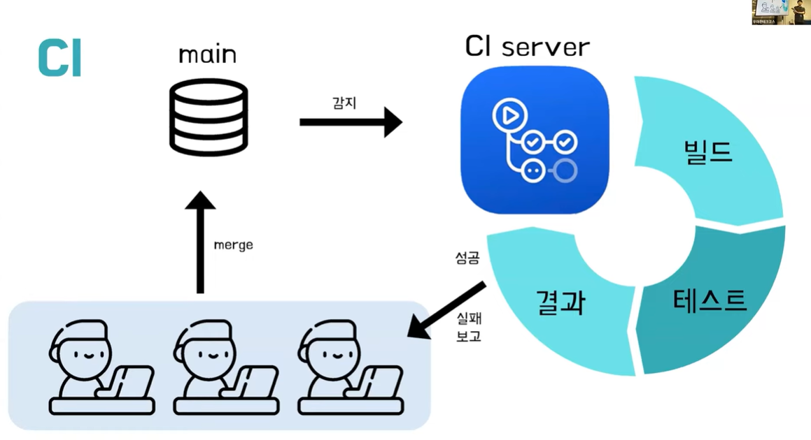
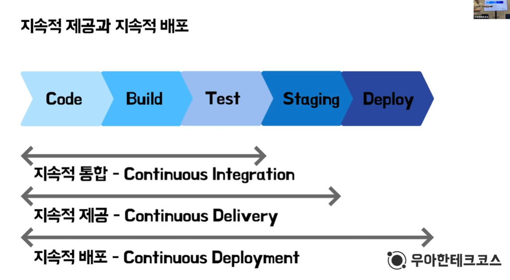
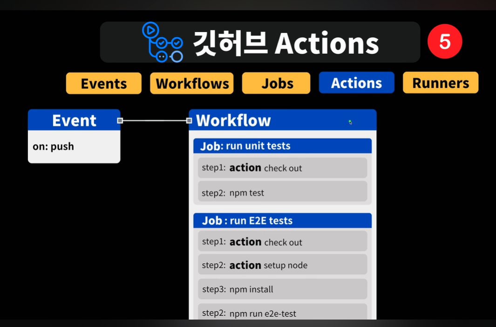
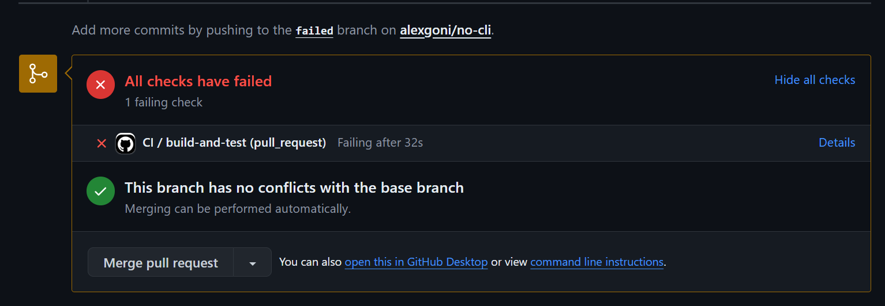
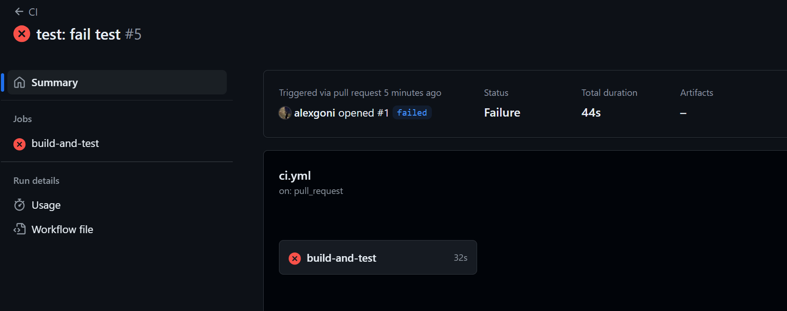
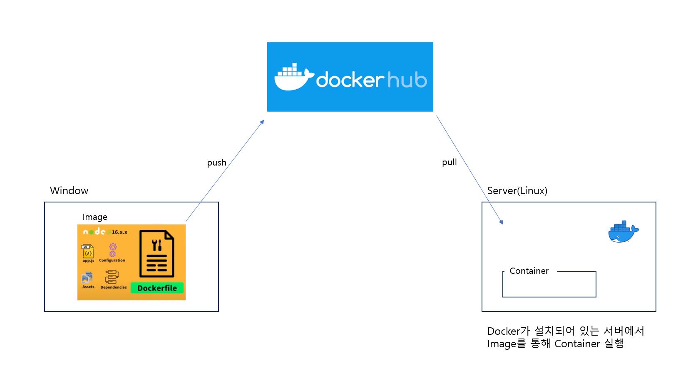
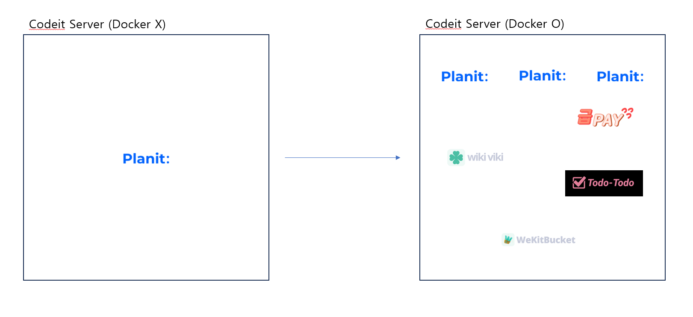
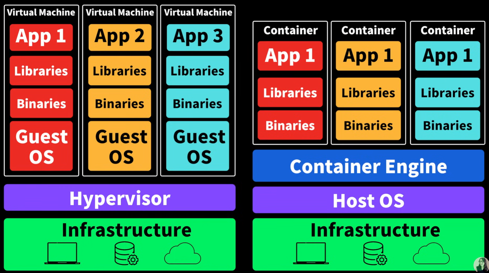

# 09장: 모던 리액트 개발 도구로 개발 및 배포 환경 구축하기

## 9.1 Next.js로 리액트 개발 환경 구축하기

### create-next-app 없이 하나씩 구축하기

1. `npm init`

모든 Node.js 프로젝트와 마찬가지로 가장 먼저 할 일은 package.json을 만드는 것이다.

2. `npm i react react-dom next`

이후 필요한 핵심 라이브러리인 react, react-dom, next를 설치하자.

react

- 웹 또는 브라우저를 위한 라이브러리가 아니라, UI를 component 형태로 구성하는 라이브러리
- UI의 변경 사항을 파악하고, 변경된 스냅샷을 react-dom에 전달

react-dom

- react에게 받은 변경된 스냅샷과 실제 브라우저 DOM을 비교하며 실질적으로 브라우저 DOM 조작

3. `npm i -D @types/node @types/react @types/react-dom eslint eslint-config-next typescript`

이후 devDependencies에 필요한 패키지를 설치하자.

### tsconfig.json 작성하기

npm 설정을 package.json에서 했다면 타입스크립트 설정은 tsconfig.json에 기록한다.

```json
{
  "compilerOptions": {
    "target": "ES5",
    "lib": ["dom", "dom.iterable", "esnext"],
    "allowJs": true,
    "skipLibCheck": true,
    "strict": true,
    "forceConsistentCasingInFileNames": true,
    "noEmit": true,
    "esModuleInterop": true,
    "module": "esnext",
    "moduleResolution": "bundler",
    "resolveJsonModule": true,
    "isolatedModules": true,
    "jsx": "preserve",
    "incremental": true,
    "baseUrl": "src",
    "paths": {
      "@/*": ["./src/*"]
    }
  },
  "include": ["next-env.d.ts", "**/*.ts", "**/*.tsx"],
  "exclude": ["node_modules"]
}
```

- compilerOptions: TS를 JS로 컴파일할 때 사용하는 옵션
  - target: 변환을 목표로 하는 언어의 버전
  - lib: 기본 타입 정의 라이브러리(d.ts)를 어떤 것을 사용할 것인지 정한다.
  - allowJs: TS가 JS 또한 컴파일할지를 결정
  - skipLibCheck: 라이브러리에서 제공하는 d.ts에 대한 검사 여부
  - strict: 기본 옵션
  - forceConsistentCasingInFileNames: 파일 이름의 대소문자를 구분하도록 강제
  - noEmit: 컴파일을 하지 않고 타입 체크만 한다. Next.js는 swc가 TS 파일을 컴파일하므로 굳이 TS가 JS를 컴파일할 필요가 없다.
  - esModuleInterop: CommonJS 방식으로 보낸 모듈을 ES 모듈 방식의 import로 가져올 수 있게 해준다.
  - module: 모듈 시스템을 설정한다.
  - moduleResolution: 모듈을 해석하는 방식을 설정한다.
  - resolveJsonModule: JSON 파일을 import 할 수 있게 해준다.
  - isolateModules: 다른 모듈 시스템과 연계되지 않고 단독으로 있는 파일의 생성을 막기 위한 옵션
  - jsx: jsx를 어떻게 컴파일할지 설정한다.
  - incremental: 마지막 컴파일 정보를 디스크에 저장한다.
  - baseUrl: 모듈을 찾을 때 기준이 되는 디렉토리를 지정한다.
  - paths: 절대 경로에 대한 별칭을 지정할 수 있다.
  - include: TS 컴파일 대상에서 포함시킬 파일 목록을 의미한다.
  - exclude: TS 컴파일 대상에서 제외시킬 파일 목록을 의미한다.

### next.config.js 작성하기

Next.js 설정을 위한 next.config.js를 만들 차례다.

```js
/** @type {import('next').NextConfig} */
const nextConfig = {
  reactStrictMode: true,
  poweredByHeader: false,
  eslint: {
    ignoreDuringBuilds: true,
  },
};

module.exports = nextConfig;
```

### ESLint와 Prettier 설정하기

#### ESLint

```json
{
  "root": true,
  "parser": "@typescript-eslint/parser",
  "plugins": ["@typescript-eslint"],
  "parserOptions": {
    "project": "./tsconfig.json",
    "createDefaultProgram": true
  },
  "env": {
    "browser": true,
    "node": true,
    "es6": true
  },
  "extends": [
    "airbnb",
    "airbnb-typescript",
    "airbnb/hooks",
    "next/core-web-vitals",
    "plugin:@typescript-eslint/recommended",
    "prettier"
  ],
  "rules": {
    "react/react-in-jsx-scope": "off",
    "react/jsx-props-no-spreading": "off",
    "@typescript-eslint/semi": "off",
    "react/jsx-filename-extension": ["warn", { "extensions": [".ts", ".tsx"] }],
    "no-useless-catch": "off",
    "@typescript-eslint/no-unused-vars": "warn",
    "react/require-default-props": "off",
    "react/jsx-no-useless-fragment": "warn",
    "react-hooks/exhaustive-deps": "off",
    "import/prefer-default-export": "off",
    "jsx-a11y/label-has-associated-control": [
      "error",
      {
        "labelAttributes": ["htmlFor"]
      }
    ]
  },
  "overrides": [
    {
      "files": ["*.tsx", "*.jsx"],
      "rules": {
        "@typescript-eslint/no-use-before-define": "off"
      }
    }
  ],
  "ignorePatterns": ["next.config.js"]
}
```

#### Prettier

```json
{
  "printWidth": 80,
  "singleQuote": false,
  "jsxSingleQuote": false,
  "tabWidth": 2,
  "semi": true,
  "trailingComma": "all",
  "bracketSpacing": true,
  "arrowParens": "always",
  "endOfLine": "lf",
  "importOrder": ["^@core/(.*)$", "^@server/(.*)$", "^@ui/(.*)$", "^[./]"],
  "importOrderSeparation": true,
  "importOrderSortSpecifiers": true,
  "plugins": ["@trivago/prettier-plugin-sort-imports"]
}
```

## 9.2 깃허브 100% 활용하기

### CI/CD

#### CI

> 지속적 통합

1. 코드 변경사항을 주기적으로 빈번하게 머지해야 한다.
2. 통합을 위한 단계(빌드, 테스트)의 자동화



CI Server에서 빌드, 테스트를 거친다. Jenkins와 같이 외부에 CI Server를 두는 방법도 있지만,
Github Action을 통해 더 쉽게 자동화 단계를 구축할 수 있다.

#### CD

> 지속적인 제공 / 지속적인 배포

1. 지속적인 제공

배포할 준비 과정을 자동으로 거치고, 후에 검증한 후(QA) 수동으로 배포

2. 지속적인 배포

배포까지 모든 과정을 자동화



### 깃허브 액션으로 CI 환경 구축하기

**목표: main으로 PR 올라올 때마다 빌드, 테스트 자동화 해보기**

- Event: Github에서 일어날 수 있는 이벤트를 지정
- Workflows: 특정 이벤트가 발생했을 때 어떤 일을 수행하고 싶은지 명시하는 곳
- Jobs: Workflows 안에 다수의 Job이 존재하며 병렬로 실행이 됨
- Actions: Runner에서 실행되는 하나의 작업 단위
- Runners: Jobs을 실행하는 VM 머신



```yml
// .github/workflows/ci.yml

name: CI

on:
  push:
    branches: [main]
  pull_request:
    branches: [main]

jobs:
  build-and-test:
    runs-on: ubuntu-latest

    steps:
      - name: Checkout code
        uses: actions/checkout@v3

      - name: Set up Node.js
        uses: actions/setup-node@v3
        with:
          node-version: "20"

      - name: Install dependencies
        run: npm install

      - name: Build the project
        run: npm run build

      - name: Run tests
        run: npm test
```

#### test 코드 통과가 실패된 경우




## 9.4 리액트 애플리케이션 도커라이즈하기

### Docker

> 리눅스 컨테이너 기반 오픈소스 가상화 플랫폼

#### Docker 사용 이유

1. 애플리케이션 패키징 툴 / 실행 환경 불일치의 해결

ex) 윈도우에서 모든 개발을 완료한 상황에서 코드를 서버로 올렸을 때,
서버가 리눅스라서 코드가 동작하지 않는 경우



2. 서버 자원 관리

ex) 64GB 메모리를 가지고 있는 서버, 보통 소프트웨어가 필요한 메모리는 2GB

=> 하나의 서버에서 다른 개발 환경의 많은 소프트웨어를 실행해야 함!



#### Virtual Machine vs Container



VM 기술은 이미지에 운영 체제가 포함되어 있어 무겁고 느린 반면, Container 기술은 가볍고 빠르다.

컨테이너가 구동되기 위해서는 Container Engine이라는 것이 필요하고,
Container Engine 중에 가장 대표적인 것이 Docker Engine이다.

컨테이너 기술은 Docker 만의 기술? => ❌

#### Dockerfile, Image, Container

- Dockerfile: 컨테이너를 어떻게 만들어야 하는지 설명서
- Image: 애플리케이션 코드 + Dockerfile (클래스)
- Container: 이미지를 이용해서 고립된 환경에서 실행할 수 있는 것, 컨테이너 안에서 애플리케이션이 동작함 (인스턴스)

**이미지만 있다면 Docker를 실행할 수 있는 모든 환경에서 동일한 애플리케이션을 실행할 수 있다.**

### Docker로 배포해보기

그렇다면 지금까지 개발하면서 Docker를 접하지 못했던 이유는 뭘까?
이전 Docker의 사용 이유에서 봤듯이 Docker는 서버 자원 관리에 사용되거나, 서버에 코드를 올릴 때 사용한다.
서버 자원 관리는 들어본적도 없고, 배포는 웹 호스팅을 주로 이용했으므로 Docker를 사용할 일이 없었다.

Docker로 배포 실습을 해보자.

**목표: Docker로 홈 서버 / 클라우드 배포해보기**

next.config.js에 다음과 같은 옵션을 추가한다.

```js
/** @type {import('next').NextConfig} */
const nextConfig = {
  // ...
  output: "standalone",
};

module.exports = nextConfig;
```

```Dockerfile
FROM node:18-alpine AS base

# Install dependencies only when needed
FROM base AS deps
RUN apk add --no-cache libc6-compat
WORKDIR /usr/src/app

# Install dependencies based on the preferred package manager
COPY package*.json ./
RUN npm install
RUN rm -rf ./.next/cache

# Rebuild the source code only when needed
FROM base AS builder
WORKDIR /usr/src/app
COPY --from=deps /usr/src/app/node_modules ./node_modules
COPY . .
RUN npm run build

# Production image, copy all the files and run next
FROM base AS runner
WORKDIR /usr/src/app

ENV NODE_ENV=production

RUN addgroup --system --gid 1001 nodejs
RUN adduser --system --uid 1001 nextjs

COPY --from=builder --chown=nextjs:nodejs /usr/src/app/.next/standalone ./
COPY --from=builder --chown=nextjs:nodejs /usr/src/app/.next/static ./.next/static

USER nextjs
EXPOSE 3000
ENV PORT 3000

CMD ["node", "server.js"]
```

```
# docker image build
docker build . -t no-cli:latest

# docker image run
docker run -p 3000:3000 no-cli:latest

# docker hub push
docker push alexgoni/no-cli:latest
```

컨테이너를 실행했을 때 localhost:3000으로 실행이 되는 것을 확인할 수 있었다.

Docker hub에 image를 push하고, GCP 클라우드를 통해 배포를 해보려 했으나
Artifact Registry API가 유료여서 여기까지만 진행했다. ㅎ

---

### 새로 알게된 개념

- tsconfig.json 설정 옵션
- CI/CD 개념 & 깃허브 액션
- Docker 개념

### 읽으면서 어려웠거나 이해가 잘 안됐던 부분

- Docker 실습

---

### 참고자료

- CI/CD 5분 개념 정리: https://www.youtube.com/watch?v=0Emq5FypiMM
- [10분 테코톡] 루카의 CI/CD: https://www.youtube.com/watch?v=6awJbcWXsts
- 제발 깃허브 액션🔥 모르는 개발자 없게해 주세요 🙏: https://www.youtube.com/watch?v=iLqGzEkusIw&t=297s
- Docker 가 왜 좋은지 5분안에 설명해줌: https://www.youtube.com/watch?v=chnCcGCTyBg
- 도커 한방에 정리 🐳 (모든 개발자들이 배워보고 싶어 하는 툴!) + 실습: https://www.youtube.com/watch?v=LXJhA3VWXFA&t=1097s
- 개발자를 위한 쉬운 도커 (2024 NEW) | 컨테이너, 도커, 쿠버네티스의 개념을 엄청 쉽게 알려드려요.: https://www.youtube.com/watch?v=eRfHp16qJq8
- 생활코딩 Docker 입구 수업: https://www.youtube.com/watch?v=Ps8HDIAyPD0&list=PLuHgQVnccGMDeMJsGq2O-55Ymtx0IdKWf
