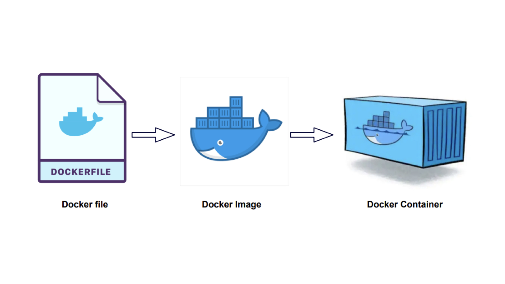

# 13회차

# 9장

가장 유행하는 Next.js로 프로젝트의 기반을 다져보자.

## Next.js로 리액트 개발 환경 구축하기

앱을 온전히 이해하기위해 package.json부터 시작해서 하나씩 필요한 파일을 만들어보자.  
=> create.react.app 유지보수 안될수도 있어서 해놓면 좋음.

### create-next-app 없이 하나씩 구축하기

1. npm init
2. react, react-dom, next
3. devDependencies 패키지. 즉, ts, @types/react, eslint 등

### tsconfig.json 작성하기

최상단에 `{"$schema": "https://json.schemastore.org/tsconfig.json"}`쓰고 시작  
=> 해당 파일이 무엇인지, 뭐가 들어갈 수 있는지 알려줌. **자동 완성 제공**

```json
{
  "compilerOptions": {
    /* 기본 옵션 */
    "target": "es5", // 'ECMAScript' 타겟 버전
    "module": "commonjs", // 모듈 시스템 지정
    "lib": [], // 컴파일에 포함할 라이브러리 파일들 지정
    "allowJs": false, // JavaScript 파일 컴파일 허용
    "checkJs": false, // JavaScript 파일의 타입 검사
    "jsx": "preserve", // JSX 코드 변환 방식 ('preserve', 'react', 'react-native', 'react-jsx', 'react-jsxdev')
    "declaration": false, // '.d.ts' 타입 선언 파일 생성
    "declarationMap": false, // '.d.ts' 파일의 소스 맵 생성
    "sourceMap": false, // '.js' 파일의 소스 맵 생성
    "outFile": "./", // 하나의 파일로 번들링 (AMD와 System 모듈에서만 작동)
    "outDir": "./", // 컴파일된 파일을 배치할 디렉토리
    "rootDir": "./", // 입력 파일들의 루트 디렉토리
    "composite": false, // 프로젝트를 컴포지트 프로젝트로 설정 (다중 프로젝트 참조에서 사용)
    "incremental": false, // 증분 컴파일을 위해 .tsbuildinfo 파일 생성
    "tsBuildInfoFile": "./", // 증분 컴파일 정보를 저장할 경로 지정
    "removeComments": true, // 컴파일된 파일에서 주석 제거
    "noEmit": false, // 출력을 하지 않음
    "importHelpers": false, // 'tslib'을 사용하여 헬퍼 함수들을 가져옴
    "downlevelIteration": false, // 낮은 버전의 타겟에서도 'for..of', 'spread'와 같은 반복문을 지원

    /* 엄격한 타입 검사 옵션 */
    "strict": true, // 모든 엄격한 타입 검사 옵션을 활성화
    "noImplicitAny": true, // 암시적 'any' 타입을 허용하지 않음
    "strictNullChecks": true, // null과 undefined에 대한 엄격한 검사
    "strictFunctionTypes": true, // 함수 타입에 대한 엄격한 검사
    "strictBindCallApply": true, // 'bind', 'call', 'apply' 메소드에 대한 엄격한 검사
    "strictPropertyInitialization": true, // 클래스 프로퍼티 초기화에 대한 엄격한 검사
    "noImplicitThis": true, // 암시적 'this' 타입을 허용하지 않음
    "alwaysStrict": true, // strict mode를 항상 활성화

    /* 추가적인 타입 검사 옵션 */
    "noUnusedLocals": true, // 사용하지 않는 지역 변수를 검사
    "noUnusedParameters": true, // 사용하지 않는 매개 변수를 검사
    "noImplicitReturns": true, // 함수에서 모든 코드 경로가 값을 반환하지 않으면 에러
    "noFallthroughCasesInSwitch": true, // switch 문에서 의도하지 않은 fallthrough를 허용하지 않음

    /* 모듈 해석 옵션 */
    "moduleResolution": "node", // 모듈 해석 방식 ('node', 'classic')
    "baseUrl": "./", // 비-상대적 모듈 이름들의 기본 디렉토리
    "paths": {}, // 모듈 이름에 대한 경로 매핑
    "rootDirs": [], // 여러 루트 디렉토리를 하나의 가상 디렉토리로 병합
    "typeRoots": [], // 타입 정의가 포함된 디렉토리 목록
    "types": [], // 컴파일에 포함할 타입 정의 파일 목록
    "allowSyntheticDefaultImports": true, // default imports를 'ES6' 스타일로 허용
    "esModuleInterop": true, // CommonJS와 ES 모듈 간의 호환성을 위해 'import'와 'require' 간의 상호 운용성 추가

    /* 소스 맵 옵션 */
    "inlineSourceMap": false, // 소스 맵을 .js 파일에 인라인
    "inlineSources": false, // 소스 코드를 .js 파일에 인라인 (소스 맵과 함께 사용)

    /* 실험적 옵션 */
    "experimentalDecorators": true, // 실험적 데코레이터 기능 활성화
    "emitDecoratorMetadata": true, // 데코레이터를 사용하여 타입 메타데이터를 생성

    /* 언어 및 환경 옵션 */
    "newLine": "lf", // 출력 파일의 줄 바꿈 형식 ('crlf', 'lf')
    "charset": "utf8", // 출력 파일의 문자셋
    "keyofStringsOnly": false, // keyof 연산자를 문자열 타입에만 사용
    "useDefineForClassFields": true // 클래스 필드를 'define' 방식으로 컴파일
  }
}
```

### 정리

- 깃허브에서는 보일러플레이트 프로젝트 만들어서 템플릿으로 쓸 수 있음.  
  <= Template repository 옵션만 체크하면 됨 레포 만들 때

## 깃허브 100% 활용하기

깃허브를 십분 활용해보자!

### 깃허브 액션으로 CI환경 구축하기

**CI**: 개발자들이 계속 코드를 변화시키고 기여하는 것들을 모아서 빌드 및 정합성 등을 확인하는 과정  
CI 환경을 구축하는 친구들로는 젠킨스, 깃허브 액션 등이 있다.

#### 깃허브 액션의 기본 개념

루트 폴더에 .github/workflows 폴더를 만들고 .yaml 파일을 만들어서 작성하면 됨.

```yaml
name: c7 build
# 워크플로우의 이름을 'c7 build'로 설정

run-name: ${{ github.actor }} has been added new commit.
# 실행 이름을 설정. 커밋을 추가한 사용자의 이름이 표시됨

on:
  push:
    branches-ignore:
      - "main"
# 'main' 브랜치에 푸시가 있을 때는 이 워크플로우를 실행하지 않음

jobs:
  build:
    runs-on: ubuntu-latest
    # 'build' job을 정의하고, 이 job은 최신 Ubuntu 환경에서 실행됨

    steps:
      - uses: actions/checkout@v3
        with:
          node-version: 16
      # 첫 번째 단계: actions/checkout@v3를 사용하여 리포지토리의 코드를 체크아웃함 <= github 기본액션중 하나 이렇게 쓰면된다.
      # node-version은 여기서 사용되지 않는 속성이나, 사용된다면 Node.js의 버전을 16으로 설정

      - name: "install dependencies"
      # 두 번째 단계: 'install dependencies'라는 이름을 가진 단계

      - working-directory: ./chapter7/my-app
      # 작업 디렉토리를 './chapter7/my-app'로 설정

      - run: npm ci
      # 'npm ci' 명령어를 실행하여 의존성을 설치함
```

#### 액션 작성

액셕은 작성하는 것은 좋지만, 주의해야함.

- npm이 아닌 yarn, pnpm을 쓴다면 pnpm/action-setup, borales/actions-yarn을 사용해 설치하자.
- **브랜치 보호 규칙** 을 이용해 머지되기 전에 꼭 선행되야할 액션을 지정해보자.

#### Dependabot으로 취약점 해결하기

의존성에 숨어있는 잠재적인 위협을 깃허브로 방지해보자.

## 리액트 애플리케이션 배포하기

3대장들의 각각의 특징을 살펴보자!

- **Netlify**: 역사가 있음. netlify.toml 파일에서 plugins 배열을 선언해서 추가 옵션을 줄 수 있음.
- **Vercel**: next.js와의 호환성이 매우 뛰어남.
- **DigitalOcean**: 문서화가 잘 되어있고, 금전적인 여유가 부족한 경우 좋음.

## 리액트 애플리케이션 도커라이즈하기

왜 도커라이즈 함?  
작은 트래픽을 지닌 앱은 무료 클라우드 서비스로 충분히 배포할 수 있었음.  
하지만, 앱의 규모가 커질수록 불편해지고, 커스터 마이징을 하는데에 제약이 있음.

과거에는 앱을 배포하기 위해 귀찮은 작업들을 해야 했으나 요즘은 컨테이너로 만들어서 쉽게 배포함.  
=> 도커를 이용해서 컨테이너로 만듬.

### 리액트 앱을 도커라이즈하는 방법

앱을 도커 이미지로 만드는 것을 도커라이즈라고 함.  
=> 앱을 신속하게 구축해 배포할 수 있는 상태로 준비하는 것.

#### 도커란?

지루한 설정 과정을 하나로 퉁쳐버림. 앱을 컨테이너 단위로 패키징하고, 컨테이너 내부에서 앱이 실행되도록 도와줌.  
=> **도커는 컨테이너를 기반으로 앱이 독립된 환경에서 실행되도록 보장해줌.**



**도커 용어**

- **이미지**: 컨테이너를 만들 때 사용되는 템플릿. Dockerfile을 빌드하여 이미지를 만들 수 있음.
- **컨테이너**: 도커의 이미지를 실행한 상태. 독립적인 공간에 이미지가 목표로하는 환경을 구성함.
- **Dockerfile**: 어떤 이미지 파일을 만들지 정의. 빌드하면 이미지 만들 수 있음.
- **태그**: 이미지를 식별해줌. ex) ubuntu: latest(ubuntu의 latest인 이미지).
- **리포지터리**: 이미지를 모아둠.
- **레지스트리**: 리포지터리로 접근할 수 있게 해주는 녀석. 원하는 이미지를 내려받을 수 있게 해준다.

#### 도커라이징하기

1. 프로젝트 루트 파일에 도커파일 만들고 설정하기
2. 터미널에 `docker  build . -t cra:test`
3. 도커 데스크탑으로 실행시킴.

알아서하자.

### 정리

- 회사에서 도커 이미지 많이씀. 잘 배워야함.
