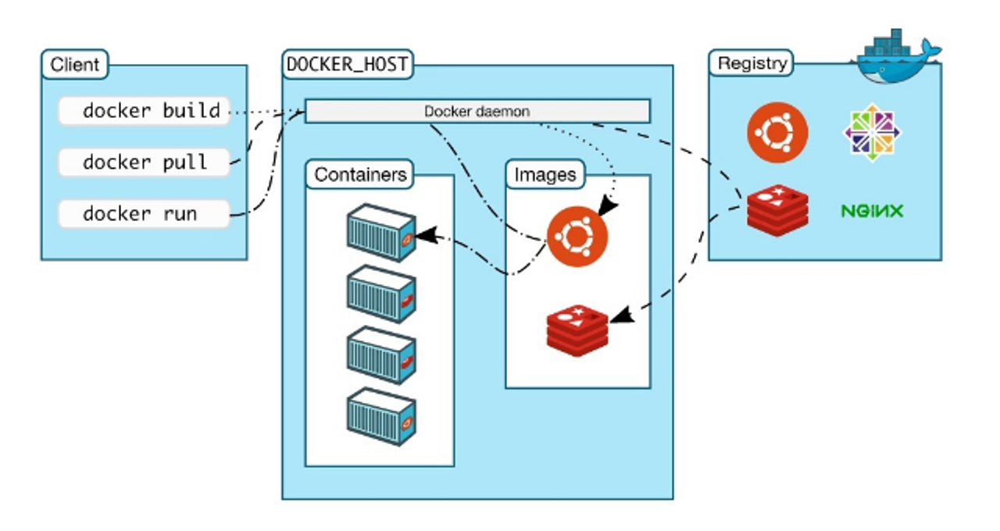

# [9장] 모던 리액트 개발 도구로 개발 및 배포 환경 구축하기

## 9.1 Next.js로 리액트 개발 환경 구축하기

프론트엔드 개발자가 직접 만든 애플리케이션을 온전히 이해하려면 package.json부터 시작해서 하나씩 필요한 파일을 직접 설정해봐야 한다.

**✨create-next-app 없이 하나씩 구축하기**

`npm init` → package.json을 만드는 CLI를 실행할 수 있다.

`npm i react react-dom next` → react, react-dom, next 설치

`npm i @types/react @types/react-dom eslint eslint-config-next typescript --save-dev`

**✨tsconfig.json작성하기**

- `compilerOptions`: 컴파일러 옵션을 설정하는 객체
- `include`: 컴파일에 포함할 파일 또는 디렉토리를 지정
- `exclude`: 컴파일에서 제외할 파일 또는 디렉토리를 지정
- `files`: 컴파일할 개별 파일 목록을 지정

```jsx
{
  "compilerOptions": {
    "target": "es5",
    "module": "commonjs",
    "strict": true,  // strict 모드 활성화
    "strictNullChecks": true,  // null 체크 강화
    "noImplicitAny": true,  // 암시적 any 금지
    "strictFunctionTypes": true,  // 함수 타입 체크 강화
    "strictBindCallApply": true,  // bind, call, apply 체크 강화
    "strictPropertyInitialization": true,  // 속성 초기화 체크 강화
    "noImplicitThis": true,  // this 암시적 any 금지
    "alwaysStrict": true,  // 항상 엄격 모드
    "skipLibCheck": true,  // 라이브러리 체크 건너뛰기
    "forceConsistentCasingInFileNames": true  // 파일명 대소문자 일관성
  },
  "include": ["src"],  // 컴파일에 포함할 디렉토리
  "exclude": ["node_modules", "**/*.spec.ts"]  // 컴파일에서 제외할 파일/디렉토리
}

```

[컴파일러 옵션들]

[TypeScript 한글 문서](https://typescript-kr.github.io/pages/compiler-options.html)

[tsconfig.json에 관하여]

[TypeScript 한글 문서](https://typescript-kr.github.io/pages/tsconfig.json.html)

**✨next.config.js 작성하기**

```jsx
module.exports = {
  reactStrictMode: true, // React의 엄격 모드가 활성화
  images: {
    domains: ['example.com'], // 외부 도메인의 이미지를 로드할 수 있도록 설정
  },
  env: {
    CUSTOM_KEY: 'my-custom-key', // 환경 변수를 설정
  },
  webpack: (config, { buildId, dev, isServer, defaultLoaders, webpack }) => {
    // 추가적인 웹팩 설정
    return config
  },
}
```

[API Reference: next.config.js Options](https://nextjs.org/docs/app/api-reference/next-config-js)

**✨ESLint와 Prettier 설정하기**

`npm i @titicaca/eslint-config-triple --save-dev`

eslint-config-next와 eslint-config-triple이 함께 작동하게 하려면 설정이 필요하다.

👇🏻`eslint-config-next`와 `@titicaca/eslint-config-triple`을 함께 사용할 때,
`.eslintignore`와 `.prettierignore` 파일에 `.next`와 `node_modules`를 추가하여 정적 분석 대상에서 제외하는 방법👇🏻

```jsx
module.exports = {
  extends: ['next/core-web-vitals', '@titicaca/eslint-config-triple'],
  rules: {
    semi: ['error', 'always'],
    quotes: ['error', 'single'],
    'prettier/prettier': ['error', { singleQuote: true, semi: false }],
  },
  plugins: ['prettier'],
  overrides: [
    {
      files: ['*.ts', '*.tsx'],
      rules: {
        // TypeScript에 특화된 규칙
      },
    },
  ],
}
```

프로젝트를 새로 만들 때마다 똑같은 설정을 매번 반복하는 것은 비효율적이다.

1. 보일러플레이트 프로젝트를 만든 다음 깃허브에서 Template repository 옵션 체크하기
2. 새로운 레포를 만들 때 어떤 템플릿 쓸건지 선택

## 9.2 깃허브 100% 활용하기

**✨깃허브 액션으로 CI 환경 구축하기**

> ❓CI <br>
> 코드의 변화를 모으고 관리하는 코드 중앙 저장소에서, 여러 기여자가 기여한 코드를 지속적으로 빌드하고 테스트해 코드의 정합성을 확인하는 과정<br>
> → 과거에는 젠킨스를 많이 썼음.<br>
> (별도 서버 구축, 서버 내 젠킨스 설치, 젠킨스를 사용 중인 저장소와 연결해야 하는 단점..)<br>
> → 깃허브 액션 등장

>

- 깃허브의 어떤 브랜치에 푸시가 발생하면 빌드 수행
- 깃허브의 특정 브랜치가 메인 브랜치를 대상으로 PR이 열리면 빌드, 테스트, 정적 분석 수행

[GitHub Actions 설명서 - GitHub Docs](https://docs.github.com/ko/actions)

- **워크플로우(Workflow)**: 특정 이벤트에 반응하여 자동으로 실행되는 프로세스. YAML 형식으로 정의
- **이벤트(Events)**: 워크플로우를 트리거하는 GitHub의 이벤트
  예) `push`, `pull_request`, `schedule` 등
- **잡(Job)**: 워크플로우 내에서 실행되는 작업의 단위로, 여러 잡이 순차적 또는 병렬로 실행될 수 있다.
- **스텝(Step)**: 잡 내에서 실행되는 개별 작업으로, 명령어 또는 액션
- **액션(Action)**: 재사용 가능한 작업으로, 다른 워크플로우에서 쉽게 사용할 수 있다.

**`.github/workflows` 폴더에 yaml 파일을 생성하여 워크플로우 정의하기**

```jsx
name: CI // 워크플로우 이름

on: [push, pull_request] // 워크플로우를 트리거할 이벤트

jobs: // 실행할 작업
  build:
    runs-on: ubuntu-latest // 작업을 실행할 환경

    steps: // 각 작업 내에서 실행할 개별 단계
    - name: 체크아웃 코드
      uses: actions/checkout@v2

    - name: Node.js 버전 설정
      uses: actions/setup-node@v2 // 깃허브 액션을 사용해 작업 수행
      with:
        node-version: '14'

    - name: 의존성 설치
      run: npm install

    - name: 테스트 실행
      run: npm test
```

[사용할 수 있는 다양한 액션]
https://github.com/marketplace?type=actions

**✨깃허브 Dependabot으로 보안 취약점 해결하기**

의존성에 문제가 있다면 이에 대해 문제를 알려주고 해결할 수 있는 PR까지 열어준다.

> **주.부.수**
>
> 1.  기본 버전과 호환되지 않게 API가 바뀌면 **주**버전 **Major**
> 2.  기본 버전과 호환되면서 새로운 기능을 추가할 때는 **부**버전 **Minor**
> 3.  기존 버전과 호환되면서 버그를 수정하면 **수**버전을 올린다. **Patch**

**✨Dependabot 설정하기**

1.  `dependabot.yml` 파일 생성

```jsx
version: 2
updates:
  - package-ecosystem: "npm" # 사용할 패키지 관리자
    versioning-strategy: "auto" # 버전 관리 전략
    directory: "/" # 패키지.json의 경로
    schedule:
      interval: "weekly" # 업데이트 주기
```

1. Pull Request 자동 생성<br>
   Dependabot은 설정에 따라 자동으로 Pull Request를 생성하여 종속성을 업데이트한다. 이 PR에는 변경 사항과 해당하는 보안 이슈에 대한 설명이 포함된다.
2. 보안 취약점 확인하기<br>
   GitHub의 보안 탭에서 종속성의 보안 취약점을 확인
3. 취약점 해결하기<br>
   Dependabot이 생성한 PR을 검토하고, 필요한 경우 추가적인 테스트를 수행한 후 머지한다.<br> - PR 페이지에서 변경 내용 검토<br> - CI/CD 파이프라인이 성공적으로 실행되었는지 확인<br> - PR을 머지해 종속성 업데이트

## 9.3 리액트 애플리케이션 배포하기

[Scale & Ship Faster with a Composable Web Architecture | Netlify](https://www.netlify.com/)

[Vercel: Build and deploy the best web experiences with the Frontend Cloud](https://vercel.com/)

## 9.4 리액트 애플리케이션 도커라이즈하기

**✨리액트 앱을 도커라이즈하는 방법**

> ❓도커<br>
> 개발자가 모던 애플리케이션을 구축, 공유, 실행하는 것을 도와줄 수 있도록 설계된 플랫폼이다. (코드부터, 실행에 필요한 라이브러리, 설정 파일까지 모든 것이 포함)도커는 지루한 설정 과정을 대신해 주므로 코드를 작성하는 일에만 집중할 수 있다.

✅ **이식성**: 도커 컨테이너는 어떤 환경에서도 동일하게 실행될 수 있다.

✅ **빠른 배포와 확장성**: 이미지를 기반으로 빠르게 컨테이너를 생성하고, 필요에 따라 쉽게 확장할 수 있다.

✅ **분리된 환경**: 각 컨테이너는 독립적으로 실행되므로, 다양한 어플리케이션과 서비스를 하나의 시스템에서 격리된 상태로 실행할 수 있다.

✅ **버전 관리와 공유**: 도커 이미지는 버전을 관리할 수 있으며, 도커 허브(Docker Hub) 같은 플랫폼을 통해 쉽게 공유할 수 있다.



- 이미지(Image): 어플리케이션을 실행하기 위한 모든 파일과 설정을 담고 있는 템플릿
- 컨테이너(Container): 이미지를 기반으로 생성되어 실제로 어플리케이션을 실행하는 인스턴스
- 도커 허브(Docker Hub): 도커 이미지를 저장하고 공유할 수 있는 중앙 레포지토리

1. 도커 설치

   ```bash
   docker --version
   ```

2. 도커 이미지 만들기: `Dockerfile`을 작성하여 이미지 생성

   ```
   dockerfileCopy code
   # Dockerfile
   FROM node:14

   WORKDIR /app

   COPY package*.json ./
   RUN npm install

   COPY . .

   CMD ["npm", "start"]
   ```

3. 이미지 빌드

   ```bash
   docker build -t my-app .
   ```

4. 컨테이너 실행

   ```bash
   docker run -p 3000:3000 my-app
   ```

5. 도커 허브에 푸시

   ```bash
   docker tag my-app myusername/my-app
   docker push myusername/my-app
   ```

## 참고

- https://www.redhat.com/ko/topics/devops/what-is-ci-cd
- https://zero-base.co.kr/event/media_insight_contents_BE_backend_docker
