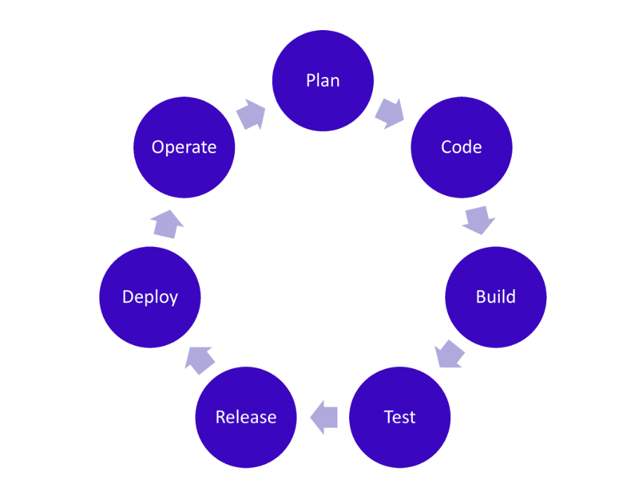
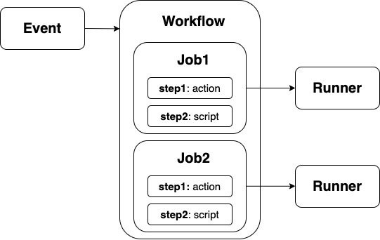
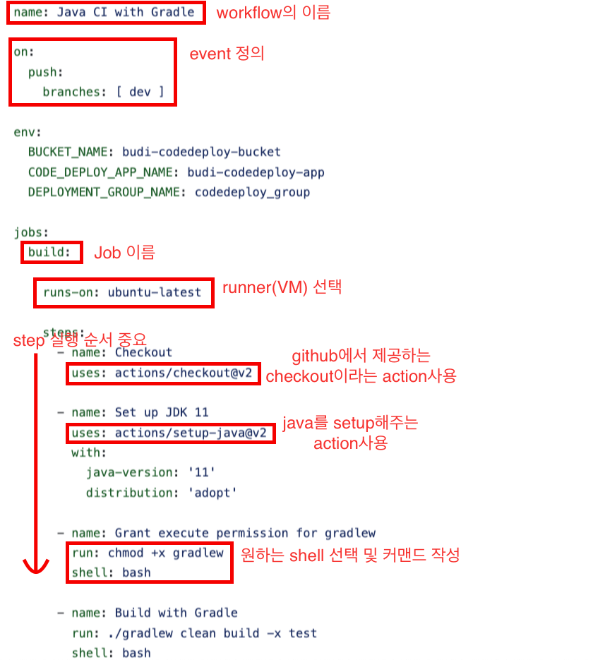
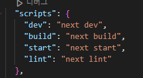
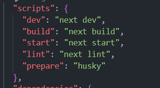

# 9장 리액트 개발 도구로 개발 및 배포 환경 구축하기

## 9.1 Next.js로 리액트 개발 환경 구축하기

- create-react-app과 create-next-app은 각각 리액트, 넥스트 애플리케이션을 손쉽게 만들기 위한 CLI(Command Line Interface) 도구
- 애플리케이션 구축에 필요한 대부분의 작업을 대신해 주기 때문에 프로젝트 구조를 공부하기는 어려움

### 9.1.1 create-next-app 없이 하나씩 구축하기

1️⃣ package.json 생성

2️⃣ Next.js 실행에 필요한 라이브러리 설치

3️⃣ devDependencies에 필요한 패키지 설치

```
npm init
npm i react react-dom next
npm i @types/node @types/react @types/react-dom eslint eslint-config-next typescript --save-dev

```

### 9.1.2 tsconfig.json 작성하기

- 타입스크립트 설정 파일
  - `$schema` 를 선언해두면 자동 완성 도움 받을 수 있음
- `compileOptions` : TS를 JS로 컴파일할 때 사용하는 옵션

```jsx
{
    // 컴파일할 때 사용하는 것들
    "compilerOptions": {
        // 모듈 시스템, export, import 부분
        "module": "esnext",
        "moduleResolution": "bundler",
        // ESNext: 최신 문법, (에전 문법을 사용해야만 돌아가는 환경에 유용)
        "target": "es5",
        // target은 es5라도 신규 기능에 대한 API정보를 확인해서 오류발생x
        "lib": ["dom", "dom.iterable", "esnext"],
        // ts가 js 파일도 컴파일할지, 주로 .ts, .js가 혼재됐을 때 사용
        "allowJs": true,
        // 타입 정의 파일(.d.ts 확장자 같는 파일)의 타입 검사를 생략 , 보통 라이브러리에서 사용됨
        "skipLibCheck": true,
        // 엄격하게 타입관리 ex) 매개변수에 타입지정 필수
        "strict": true,
        // 컴파일x, just 타입 체크만 (next는 swc로 바로 ts파일을 컴파일0)
        "noEmit": true,
        // module.exports의 CommonJS 방식으로 내보낸 모듈도 ES방식(export function~)
        "esModuleInterop": true,
        // JSON 파일을 import 하게 해줌, 자동으로 allowJs도 켜짐
        "resolveJsonModule": true,
        // import나 export가 없다면 단순 스크립트 파일로 인식하고 해당 파일이 생성되지 않도록 막음
        "isolatedModules": true,
        // .tsx 내부에 있는 JSX를 어떻게 컴파일할지 설정, swc가 JSX도 알아서 변환해주기 때문에 그대로 유지 선택
        "jsx": "preserve",
        // 마지막 컴파일 정보 저장 -> 다시 컴파일러가 호출됐을 때 해당 정보를 활용해 비용 최소화
        "incremental": true,
        // 모듈 찾을 때 기준이 되는 디렉터리
        "baseUrl": "./src",
        //
        "paths": {
            "#components/*": ["components/*"],
            "#pages/*": ["pages/*"],
            "#statics/*": ["statics/*"],
            "#utils/*": ["utils/*"],
            "#hooks/*": ["hooks/*"],
            "#types/*": ["types/*"]
        }
    },
    // 컴파일 대상에 포함시킬 파일 목록
    "include": [
        "next-env.d.ts",
        "**/*.ts",
        "**/*.tsx",
        "next-sitemap.config.js"
    ],
    // 컴파일 대상에서 제외시킬 파일 목록
    "exclude": ["node_modules"]
}
```

### 9.1.3 next.config.json 작성하기

- Next.js 설정을 위한 파일

```jsx
/** @type {import('next').NextConfig} */
const nextConfig = {
  // 리액트 엄격 모드
  reactStrictMode: true,
  // 보안 취약점으로 취급되는 X-Powered-By 헤더 제거
  poweredByHeader: false,
  // 빌드 시, eslint 무시 (이후 CI 과정에서 별도로 작동하게 만들어 빌드를 더 빠르게 할 예정)
  eslint: {
    ignoreDuringBuilds: true,
  },
};

module.exports = nextConfig;
```

### 9.1.4 ESLint와 Prettier 설정하기

- eslint-config-next가 해주지 않는 ESLint 작업 수행
- titicaca 설치

```jsx
 npm i @titicaca/eslint-config-triple --save-dev
```

- eslint-config-next와 eslint-config-triple 함께 사용하기 위한 추가 설정

```jsx
const path = require("path");
const createConfig = require("@titicaca/eslint-config-triple");

const { extends: extendConfigs, overrides } = createConfig({
  type: "frontend",
  project: path.resolve(__dirname, "./tsconfig.json"),
});

module.exports = {
  extends: [...extendConfigs, "next/core-web-vitals"],
  overrides,
};
```

### 9.1.7 정리

- 보일러플레이트 프로젝트 만드는 법
- 깃허브에서 template repository 생성 옵션을 체크한 뒤 다른 레포 만들 때 템플렛으로 지정해서 사용할 수 있음

## 9.2 깃허브 100% 활용하기

### 9.2.1 깃허브 액션으로 CI 환경 구축하기



✨CI (Continuous Integration)

- 지속적인 통합
- 빌드,테스트 자동화 과정
- 코드의 변화를 모으고 관리하는 코드 중앙 저장소에서 여러 기여자가 기여한 코드를 지속적으로 빌드하고 테스트해 코드의 정합성을 확인하는 과정
- 저장소에서 코드의 변화가 있을 때마다 전체 소프트웨어의 정합성을 확인하기 위한 작업을 자동으로 실행해야 함
  - 개발자를 위한 자동화 프로세스
  - code : 개발자가 코드를 원격 저장소에 push 하는 단계
  - build : 원격 저장소로부터 코드를 가져와 유닛 테스트 후 빌드하는 단계
  - test : 코드 빌드의 결과물이 다른 컴포넌트와 잘 통합되는지 확인하는 과정
- CI를 성공적으로 구현할 경우 애플리케이션에 대한 새로운 코드 변경 사항이 정기적으로 빌드 및 테스트되어 공유 리포지토리에 통합되므로 여러 명의 개발자가 동시에 애플리케이션 개발과 관련된 코드 작업을 할 경우 **서로 충돌할 수 있는 문제를 해결**

- CI 환경 구축을 위해 젠킨스(Jenkins)가 많이 쓰이나 설치 및 유지보수가 번거롭다는 단점
- 젠킨스의 대안으로 깃허브 액션이 각광받음
  - 깃허브 브랜치에 푸시가 발생하면 빌드 수행
  - 깃허브의 특정 브랜치가 메인 브랜치를 대상으로 PR이 열리면 빌드,테스트,정적 분석을 수행함

📍 **깃허브 액션의 기본 개념**



- `workflow`: 특정 event에 대한 프로세스
- `runner` : 파일로 작성된 깃허브 액션이 실행되는 서버
- `action` : 러너에서 실행되는 하나의 작업 단위
- `event` : 깃허브 실행을 일으키는 이벤트 (PR, issues, push, schedule)
- `jobs` : 하나의 러너에서 실행되는 여러 스텝의 모음
- `steps` : 잡 내부에서 일어나는 하나하나의 작업
- 스텝들을 엮어 잡으로 만들고 여러 개의 잡은 병렬로 실행되며, 이런 잡을 하나 이상 모아둔 것을 액션이라 함. 이 액션을 실행하는 것이 러너

**📍 깃허브 액션 작성하기**

- 프로젝트 최상위 루트에 /gitbub/workflows 폴더 생성하고 yml 파일을 만듦



✅ 브랜치 보호 규칙

- 머지하기 전에 꼭 성공해야 하는 액션
- 해당 액션이 성공해야만 머지할 수 있게 함

### 9.2.2 직접 작성하지 않고 유용한 액션과 깃허브 앱 가져다 쓰기

- marketplaces 서비스를 제공해 여러 사용자가 만들어 놓은 액션을 손쉽게 가져다 쓸 수 있도록 함

**📍 깃허브에서 제공하는 기본 액션**

- `actions/checkout` : 깃허브 저장소를 제크아웃하는 액션, ref를 지정해 특정 브랜치나 커밋 체크아웃 가능
- `actions/setup-node` : Node.js를 설치하는 액션, Node.js사용 시 필요
- `actions/github-script` : GitHub API가 제공하는 기능을 사용할 수 있도록 도와주는 액션
- `actions/stale` : 오래된 이슈나 PR을 자동으로 닫거나 더 이상 커뮤니케이션하지 못하도록 닫는 액션
- `actions/dependency-review-action` : package.json, package-lock.json, pnpm-lock.yaml 등의 내용이 변경되었을 때 실행되는 액션
- `actions/codeql-action` : 코드 분석 솔루션을 활용해 코드 취약점 분석

📍 **calibreapp/image-actions**

- 저장소에 포함돼 있는 이미지를 최적화하는 액션
- sharp 패키지를 이용해 이미지 파일을 압축해서 다시 커밋
- 저장소 자체의 이미지 크기를 줄이면 pull할 때 부담을 덜 수 있음

📍 **lirantal/is-website-vulnerable**

- 웹사이트에 라이브러리 취약점이 존재하는지 확인하는 깃허브 액션

**📍 Lighthouse CI**

- 웹 성능 지표를 CI 기반으로 실행할 수 있도록 돕는 액션
- PR에 성능 지표를 매번 노출시키면 개발자들에게 성능에 대한 지속적인 경각심을 심어줄 수 있다.

### **9.2.3 깃허브 Dependabot으로 보안 취약점 해결하기**

📍 **package.json의 dependencies 이해하기**

✅ 버전

- 유의적 버전 **주,부,수**
  - ex) 16.0.0 버전
  - 기존 버전과 호환되지 않게 API가 바뀜 : 주 버전 17.0.0
  - 기존 버전과 호환되면서 새로운 기능 추가 : 부 버전 16.1.0
  - 기존 버전과 호환되면서 버그 수정 : 수 버전 16.0.1
- npm 버전
  - react@16.0.0 - 버전 앞에 아무런 특수 기호 없으면 정확히 해당 버전에만 의존
  - react@^16.0.0 - 호환되는 버전
  - react@~16.0.0 - 패치 버전에 대해 호환되는 버전

✅ 의존성

- `dependencies` : 해당 프로젝트를 실행하는데 꼭 필요한 패키지, react,reac-dom 등
- `devDependencies` : 해당 프로젝트를 실행하는 데는 필요하지 않지만 개발 단계에서 필요한 패키지, eslint, typescript 등
- `peerDependencies` : 호환성으로 인해 필요한 경우

✅ 정리

- 의존성 관련 이슈 방지 : 의존성 최소한으로 유지
- 가능한 널리 알려지고 많이 사용되는, 활발하게 유지보수되는 패키지를 사용하자

## 9.3 리액트 애플리케이션 배포하기

### 9.3.1 Netlify

📍 create-next-app으로 생성한 앱 배포하기

- 플러그인 설치

```
npm install --save @netlify/plugin-nextjs
```



- 루트 폴더에 netlify.toml 파일 생성

```
[[plugins]]
package = "@netlify/plugin-nextjs"
```

### 9.3.2 Vercel

- package.json 스크립트 추가
  
- 깃허브 레포지토리 import
- Build Command에 build 명령어 입력

## 9.4 리액트 애플리케이션 도커라이즈하기

- 도커라이즈 : 애플리케이션을 신속하게 구축해 배포할 수 있는 상태로 준비하는 것
- 도커 : 개발자가 모던 애플리케이션을 구축,공유,실행하는 것을 도와줄 수 있도록 설계된 플랫폼
  - 빠르게 배포할 수 있도록 애플리케이션을 컨테이너라는 단위로 패키징하고, 이 컨테이너 내부에서 실행될 수 있도록 도움
  - Container란 표준화되고 실행 가능한 구성요소이며, 플리케이션의 소스 코드 및 Application이 동작하는 운영 체제(OS) 및 라이브러리, 종속 항목(Dependancy) 등을 조합한 것
  - 독립된 환경에서 일관되게 실행할 수 있도록 보장

✅ 도커 용어

- 이미지 : 컨테이너를 만드는데 사용되는 템플릿
- 컨테이너 : 이미지를 실행한 상태. 이미지가 목표하는 운영체제, 파일 시스템, 각종 자원 및 네트워크가 할당되어 실행될 수 있는 독립된 공간
- Dockerfile : 어떤 이미지를 만들지 정의하는 파일
- 태그 : 이미지를 식별할 수 있는 레이블 값
- 리포지터리 : 이미지를 모아두는 저장소
- 레지스트리 : 리포지터리에 접근할 수 있게 해주는 서비스

- Dockerfile - Next.js

```docker
FROM mitchpash/pnpm AS deps
RUN apk add --no-cache libc6-compat
WORKDIR /home/node/app
COPY pnpm-lock.yaml .npmr[c] ./

RUN pnpm fetch

FROM mitchpash/pnpm AS builder
WORKDIR /home/node/app
COPY --from=deps /home/node/app/node_modules ./node_modules
COPY . .

RUN pnpm install -r --offline

RUN pnpm build

FROM mitchpash/pnpm AS runner
WORKDIR /home/node/app

ENV NODE_ENV production

COPY --from=builder /home/node/app/next.config.js ./
COPY --from=builder /home/node/app/public ./public
COPY --from=builder /home/node/app/package.json ./package.json

# Automatically leverage output traces to reduce image size
# https://nextjs.org/docs/advanced-features/output-file-tracing
# Some things are not allowed (see https://github.com/vercel/next.js/issues/38119#issuecomment-1172099259)
COPY --from=builder --chown=node:node /home/node/app/.next/standalone ./
COPY --from=builder --chown=node:node /home/node/app/.next/static ./.next/static

EXPOSE 3000

ENV PORT 3000

CMD ["node", "server.js"]
```
