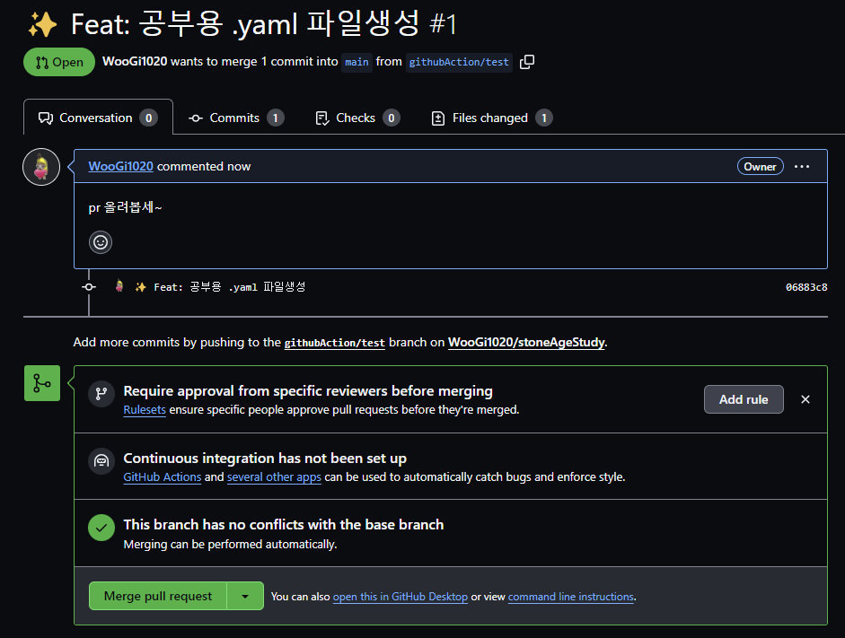
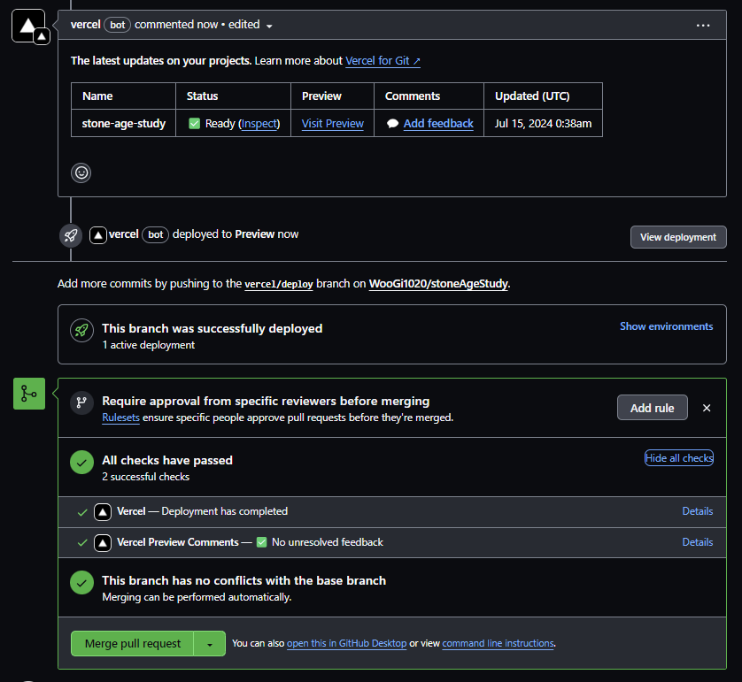
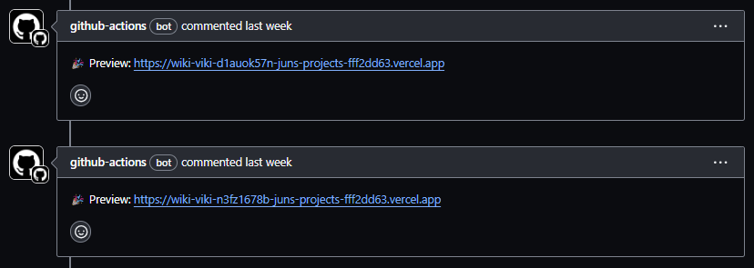
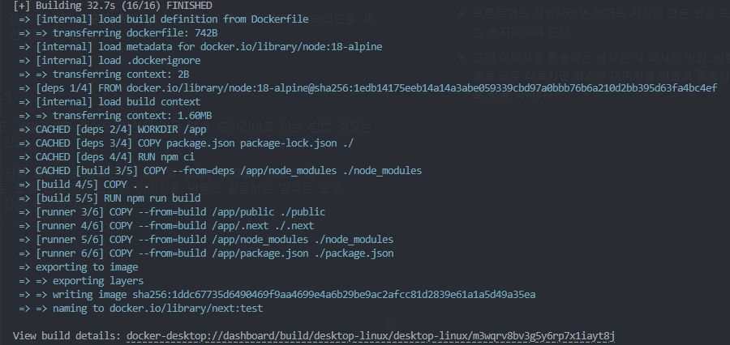

# 9. 모던 리액트 개발 도구로 개발 및 배포 환경 구축하기

**무에서 유를 창조하는 것은 겁나 어렵다.**

<br>

## 9.1 Next.js로 리액트 개발 환경 구축하기

### ✨ CLI는 빠르고 쉽게 프로젝트를 시작할 수 있지만 프로젝트 자체를 이해하는데에 도움을 주지 않는다.

- 많은 개발자가 사용해온 `create-react-app` 과 같은 더이상 유지보수 되지 않고 단순히 리액트 기반 프레임워크의 사용을 제안하는 런처 형태로 변경될 가능성이 크다.

<br>

### create-react-app 없이 직접 구축하기

---

<br>

```bash
npm init

npm i react react-dom next

npm i @types/node @types/react @types/react-dom eslint eslint-config-next typescript --save-dev
```

- 번외적으로 `--save-dev` 는 해당 패키지를 `devDependencies` 에 추가한다는 의미이다. (개발 모드에서만 사용)

<br>

### tsconfig.json 작성

```bash
{
  "$schema": "https://json.schemastore.org/tsconfig",
  "compilerOptions": {
    "target": "ES5",
    "lib": ["DOM", "DOM.Iterable", "ESNext"],
    "allowJs": true,
    "skipLibCheck": true,
    "strict": true,
    "forceConsistentCasingInFileNames": true,
    "noEmit": true,
    "esModuleInterop": true,
    "module": "ESNext",
    "moduleResolution": "node",
    "resolveJsonModule": true,
    "isolatedModules": true,
    "jsx": "preserve",
    "incremental": true,
    "baseUrl": "src",
    "paths": {
      "#pages/*": ["/pages/*"],
      "#hooks/*": ["/pages/*"],
      "#types/*": ["/types/*"],
      "#components": ["/components/*"],
      "#utils/*": ["/utils/*"]
    }
  },
  "include": ["next-env.d.ts", "**/*.ts", "**/*.tsx"],
  "exclude": ["node_modules"]
}

```

- [참고](https://www.typescriptlang.org/tsconfig/)

<br>

### next.config.js 작성하기

---

<br>

```js
/** type {import('next').NextConfig} */
const nextConfig = {
  reactStrictMode: true,
  poweredByHeader: false,
  eslint: {
    ignoreDuringBuilds: true,
  },
};

module.export = nextConfig;
```

- 깃허브 Next.js 레포지토리에서 더 많은 옵션 확인 가능

<br>

### 9.1.4 ESLint, Prettier 설정하기

<br>

```js
const path = require("path");

const createConfig = require("@titicaca/eslint-config-triple/create-config");

const { extends: extendConfigs, overrides } = createConfig({
  type: "frontend",
  project: path.resolve(__dirnamem, "./tsconfig.json"),
});

module.exports = {
  extends: [...extendConfigs, "next/core-web-vitals"],
  overrides,
};
```

- 지난 단원에서 확인했던 남이 만들어주는 요리 중 하나인 `eslint-config-tripple` 을 활용한다.

- `eslint-config-next` 와 충돌할 수 있어 따로 설정해주어야한다.

<br>

### 🔖 정리

- 직접적으로 위와 같이 여러 파일을 세팅해보는 경험을 쌓는다면 `Next.js`나 `typescript` 에 대한 많은 내용을 배울 수 있을 것이다.

- 깃허브를 활용하여 프로젝트를 만들 때, `Templete repository` 옵션을 설정해두면 추후에 다른 프로젝트 생성 시 옵션을 체크했던 프로젝트의 내용응 모두 복사하여 생성이 가능하다.

- `create-next-app` 과 같은 나만의 `create-***-app` 을 만들어 보는 것도 도움이 된다.

<br>

## 9.2 깃허브 100% 활용하기

### ✨ 깃허브에서 제공하는 다양한 서비스를 활용하여 프론트엔드 개발을 더욱 풍부하게 해보자

<br>

### 깃허브 액션으로 CI 환경 구축하기

---

### 🔖 CI란 무엇인가?

- CI(Continuous Integration)은 여러 기여자가 기여한 코드를 지속적으로 빌드 및 테스트해 코드의 정합성을 확인하는 것.

- 과거엔 이러한 CI 환경 구축을 위해 **Jenkins**가 사용되었지만, 최근에 **깃허브 액션**이 떠오르는 추세이다.

### 🏷️ 깃허브 액션의 기본 개념

- 깃허브 액션은 기본적으로 **러너**, **액션**, **이벤트**, **잡**, **스텝**의 개념을 가지고 있으며 각각의 개념들이 맞물려 이를 구성한다.



```yaml
name: CI # 액션의 이름

on: # 필수 값, 액션 실행 시점 정의
  push:
    branches-ignore: # 해당 예제의 경우 pr을 올린다는 것 자체가 main으로 push됨을 의미하므로 이렇게 설정
      - main

jobs: # 필수 값, 수행할 잡 설정
  build: # 임의 지정 네이밍, name과 같은 역할
    runs-on: ubuntu-latest # 어느 환경에서 해당 작업이 실행될지 결정

    steps: # 순차적으로 수행할 작업 정의
      - uses: actions/checkout@v3 # 해당 스텝에서 사용할 작업
      - uses: actions/setup-node@v3
        with:
          node-version: 20

      - name: "install dependencies"
        working-directory: ./CI/src
        run: npm ci

      - name: "build"
        working-directory: ./CI/src
        run: npm run build
```

### 👍 github/action을 활용해 다양한 기능들을 설정한 트리거마다 알맞게 사용해보자!

### 🏷️ 또한 깃허브 Dependabot으로 보안 취약점 또한 해결 가능하다.

<br>

### 🔖 정리

- 깃허브는 액션을 비롯하여 **Dependabot**, **Copilot**, **Github Pages** 등의 다양한 기능을 제공하므로, 개발자로서 이를 잘 써먹어야한다.

<br>

## 9.3 리액트 애플리케이션 배포하기

### ✨ 리액트 앱을 손쉽게 배포 가능한 SaaS 서비스를 알아보자

### 다양한 배포 사이트를 활용하여 배포를 진행해볼 수 있다.

- 최근 Next.js를 많이 사용했기 때문에 친숙한 vercel 배포를 진행해보았다.



### ✨ 번외적으로 .yaml 파일을 통해 직접 CI/CD를 구성하여 preview 확인도 가능



- 큰 차이는 잘 모르겠다.. (중급 프로젝트 때 이렇게 했었음)

<br>

## 9.4 리액트 애플리케이션 도커라이즈 하기

### ✨ 지금까지의 과정은 앱을 쉽고 빠르게 배포할 수 있는 과정이며, 이는 항상 장점만 가진 것은 아니다.

- 앱을 자유롭게 커스터마이징하는 것에 분명 한계가 있고, 비용 체계또한 유연하지 않다.

### 👍 도커를 활용하여 앱을 항상 배포 가능한 '컨테이너' 상태로 만들어두어 종속되지 않은 유연한 상태로 관리 가능하다.

> 운영체제를 가상화하지 않는 컨테이너 기술이니만큼 가상머신에 비해서 가벼우며, VM을 포함하여 한 대의 서버에 여러 개의 서비스를 구동하기 좋다.

> 보안상, 서비스가 털리더라도 원래의 서버에 영향을 미치기가 쉽지 않은 격리된 구조이니만큼, 가상화의 장점을 상당 부분 활용할 수 있다.

> 가상머신(VM)들과 달리, 기존 리눅스 자원(디스크, 네트워크 등)을 그대로 활용할 수 있어서 여러 서비스들을 한 서버에 때려 박아 돌리기가 좋은 편이다.
> 리눅스 커널 2.6.32-431 이상에서 지원한다. CentOS 기준으로는 CentOS 6.5 이상을 요구한다.

> 다른 컨테이너의 환경을 쉽게 그대로 재현할 수 있는 이미지를 제공한다.
> 레이어로 구성되어 있으며 이를 유니온 마운트해서 관리되고 있다.

> 다양한 이미지가 레이어를 공유할 수 있기 때문에 효율적으로 저장공간
> 을 활용할 수 있다.

> 이미지를 제공하는 원격 저장소가 있어서 누구나 쉽게 이미지를 가져올 수 있다.

<br>

### 9.4.1 리액트 앱을 도커라이즈 하는 방법

---

### 🔖 앱을 도커 이미지로 만드는 것을 도커라이즈라고 한다.

- 도커는 앱을 빠르게 배포 가능하도록 '컨테이너'라는 단위로 패키징한다.

- 컨테이너 내부에서 앱이 실행되도록 도우며, 이를 바탕으로 독립된 환경에서 앱이 항상 일관되게 실행되도록 한다.

### 📖 도커 용어

- 이미지 : 컨테이너용 템플릿, `Dockerfile`을 빌드해 이미지를 만든다.

- 컨테이너 : 도커의 이미지를 실행한 상태, 독립된 공간으로 이미지가 목표하는 다양한 기능이 할당된다.

- Dockerfile : 이미지 파일을 정의하며, 이를 빌드하여 이미지를 제작한다.

- 태그 : 이미지를 식별하는 레이블값, `이름 : 태그명` 형태로 구성된다.

- 레포지토리 : 이미지를 모아두는 저장소

- 레지스트리 : 레포지토리에 접근할 수 있게 해주는 서비스

### ⌨️ 도커 CLI 명령어

> [자주 쓰는 도커 CLI 명령어 모음](https://citronbanana.tistory.com/200)

<br>

### 🐋 Docker 실행해보기

---

### 🔖 초기 파일 세팅

```Dockerfile
# Node.js 최신 LTS 버전 사용
FROM node:18-slim

# 앱 디렉터리 생성
WORKDIR /app

# 의존성 파일들을 복사
COPY package.json package-lock.json ./

# 의존성 설치
RUN npm ci

# 애플리케이션 코드 복사
COPY . .

# 빌드 실행
RUN npm run build

# 앱 실행
CMD ["npm", "start"]
```

- 세팅 후 빌드를 하면 이미지의 크기가 나의 경우 1GB가 넘어갔다..

- 이는 `Node.js` 가 실행된 것 때문이므로 다시 설정한다.

```Dockerfile
FROM nginx:1.23.2-apline as start

COPY ./nginx/nginx.conf /etc/nginx/nginx.conf
COPY --from=build /app/build /usr/share/nginx/html

EXPOSE 3000

ENTRYPOINT ["nginx", "-g", "daemon off;"]
```

### ⏭️ Next.js로 만든 프로젝트 도커라이즈

- Next.js 같은 경우 `output: "standalone"` 코드를 추가하여 프로덕션 실행에 필요한 파일들만 실행 준비를 한다.

```dockerfile
# Step 1: Dependencies
FROM node:18-alpine as deps

WORKDIR /app

COPY package.json package-lock.json ./
RUN npm ci

# Step 2: Build
FROM node:18-alpine as build

WORKDIR /app

COPY --from=deps /app/node_modules ./node_modules
COPY . .

RUN npm run build

# Step 3: Runner
FROM node:18-alpine as runner

WORKDIR /app

ENV NODE_ENV production

# Copy necessary files from the build stage
COPY --from=build /app/public ./public
COPY --from=build /app/.next ./.next
COPY --from=build /app/node_modules ./node_modules
COPY --from=build /app/package.json ./package.json

# Expose the port the app runs on
EXPOSE 3000

# Command to run the application
CMD ["npm", "start"]
```



- 위 같은 경우 왜인진 모르겠는데 `next.config.js`에 `standalone` 을 설정해도 파일이 생성되지 않아서 해당 기능을 뺀 채로 진행했다.

- 백엔드 친구에게 물어보니 프론트가 Docker 를 쓸 일은 거의 없을텐데 왜 공부하는 거냐고 물어봐서 할 말이 없었다.. (나도 몰라)

### 🌐 지속적 통합 설정

---

- Docker의 경우 지속적 배포를 위해 github 저장소를 선택하고, 지속적으로 새 버전 배포를 선택할 수 있다.

<br>

### 🔖 정리

- 프론트엔드 개발자라면 적어도 자신이 만든 앱을 도커라이즈 하는 방법 정도는 숙지하여야 한다.

- 도커 이미지를 활용하는 방식은 각 회사의 방침, 방향성, 서비스 등 카테고리별로 모두 다르지만 최소한 이미지를 만들고 활용하는 방식은 모두 동일하므로 항상 숙지하자.
