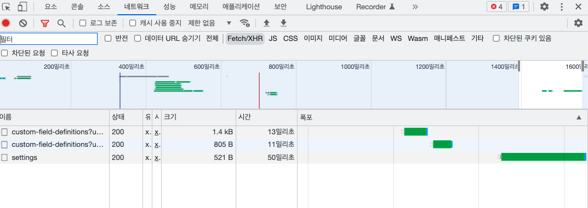

## 데이터 Fetching 전략

### Fetch-on-render

> 데이터 Fetching이 이뤄지고 나서야 관련된 컴포넌트를 렌더링 하는 방식

```jsx
function ArticlePage() {
  const { articles, isLoading } = useArticlesQuery();

  if (isLoading) return <Spinner />;

  return (
    <>
      {articles.map((article, idx) => (
        <ArticleCard key={idx} article={article} />
      ))}
      <TrendArticles />
    </>
  );
}
```

**문제점**

- Waterfall 현상 발생: TrendArticles 컴포넌트는 articles 데이터가 로딩이 완료되어야 렌더링 되기 시작한다.
  만약 TrendArticles 내부에 비동기 데이터를 호출하는 작업이 있다면 articles 데이터가 모두 불러와져야 진행이 가능하다.

  
  ▲ Waterfall 현상

- 나쁜 가독성: 하나의 컴포넌트 코드 내에서 로딩 상태에 대한 로직이 포함되어야 한다. 핵심 로직에 지비중하기 어렵다.

### Fetch-then-render

> Fetch-on-render 방식의 Waterfall 현상을 해결할 수 있도록 비동기 데이터 호출을 Promise.all 로 묶어 병렬적으로 처리하는 방법

```jsx
function ArticlePage({ ... }) {
  const [allArticles, setAllArticles] = useState([]);
  const [trendArticles, setTrendArticles] = useState([]);

  useEffect(() => {
    Promise.all([fetchAllArticles(), fetchTrendArticles()]).then(([allArticles, trendArticles]) => {
      setAllArticles(allArticles);
      setTrendArticles(trendArticles);
    });
  }, []);

  return (
    <>
      <AllArticleList articles={allArticles} />
      <TrendArticleList articles={trendArticles} />
    </>
  );
}
```

**문제점**

- 불필요한 관심사들의 결합
- 다른 비동기 데이터가 완료되어야 렌더링이 가능

### Render-as-you-fetch

> 렌더링 작업과 비동기 데이터 호출 과정이 동시에 이루어진다.
> 비동기 데이터를 호출하는 과정, fallback UI를 보여주는 과정, 완성된 UI를 보여주는 과정 등 기존의 렌더링 과정들이 여러 작은 태스크로 쪼개진 뒤 번갈아 진행된다.

```jsx
function App() {
  return (
    <>
      <Suspense fallback={<Spinner />}>
        <AllArticlePage />
      </Suspense>
      <Suspense fallback={<Spinner />}>
        <TrendArticlesPage />
      </Suspense>
    </>
  );
}
```
