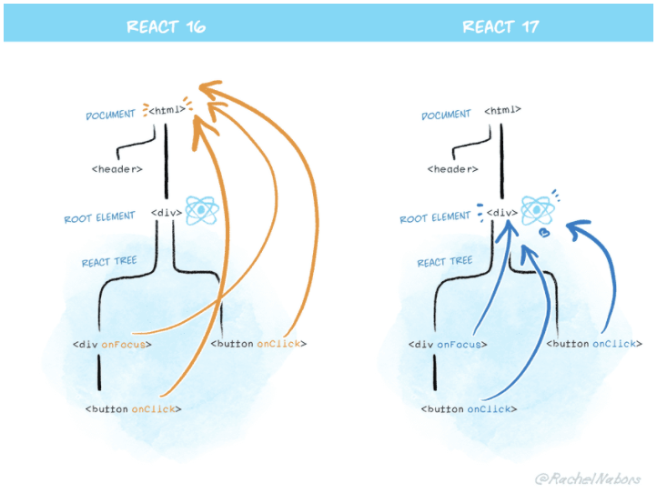
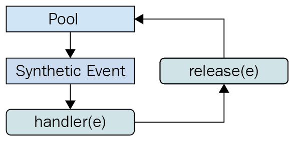
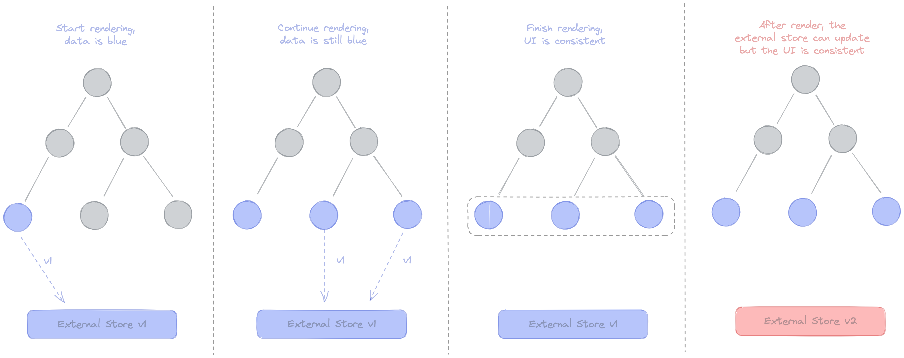

# 13회차

# 10장

리액트 17, 18버전에 어떠한 변화가 있는지 현재 자주쓰는 16버전과 비교해서 살펴보자.

## 리액트 17버전 살펴보기

17버전의 가장 큰 특징은 16과의 호환성이 굉장히 뛰어남.  
어떠한 변경점이 있는지 알아보자.

### 리액트의 점진적인 업그레이드

16 -> 17 은 주 버전 업데이트임.  
기존에 16 버전으로 완성한 웹 애플리케이션을 17로 업그레이드 하려면 작업이 번거롭고 힘듬.  
하지만 **17 버전** 부터는 **점진적인 업그레이드**가 가능.  
어떻게?

1. 기존에 17 버전을 쓰던 프로젝트에 18 버전을 추가로 설치
2. 18 버전의 기능들을 17 버전임에도 자유롭게 쓸 수 있음.  
   => 관리 지점이 많아지지만, 버전 올리기가 부담스러우면 채택해볼만함.
3. 18 버전의 기능들로 교체 후 17 버전 삭제.

### 이벤트 위임 방식의 변경


리액트 16 버전에서는 이벤트가 모두 document에 부착됨.  
하지만 17 버전에서는 이벤트 위임의 대상이 컴포넌트 최상단으로 바뀌었음

- 16 버전에서는 e.stopPropagation을 써도 이벤트 전파를 못막음  
  => 이미 document로 이벤트가 올라가 있기 때문에 컴포넌트 단계에서 어찌할 바가 아님.
- 각 이벤트의 대상이 컴포넌트 수준으로 격리되서 관리하기 용이해짐.  
  => 한 앱에 jQuery, 리액트 16 등이 혼재되어 있어도 문제발생 여지가 좁혀짐.

### import React from 'react'가 더이상 필요 없다: 새로운 JSX transform

React는 기본적으로 JSX문법을 이용.  
=> 브라우저는 이해할 수 없어서 바벨을 통한 변환이 필요했음.  
React에서 변환할 수 있도록 도와주는 친구가 **import React**임.

하지만 React 17 버전 부터는 바벨과 협력해서 **import React**할 필요가 없어짐.  
=> 번들링 크기가 줄고(트리 쉐이킹 단축), 컴포넌트 작성이 더욱 간결해짐.

### 그 밖의 주요 변경 사항

몇 가지 더 봐보자.

#### 이벤트 폴링 제거

리액트에서는 이벤트를 하기 위해 브라우저의 기본 이벤트를 한 번 더 감싸서 사용함.  
=> 이벤트 발생할 때마다 이벤트를 하나 더 만들어야함.  
=> 메모리 할당 작업 추가 발생.. 성능 하락  
이벤트 풀링은 SyntheticEvent 풀을 만들어서 이벤트를 감싸서 가져오는 것.  
  
이벤트가 종료되면 항상 null로 초기화되는 방식.

- SyntheticEvent인 e에 접근하면 이미 초기화된 null만 얻게됨.  
  => e.persist() 같은 추가 처리가 필요.
- 별도 메모리 공간에 합성 이벤트 객체를 할당해야함..

이러한 단점이 있어서 삭제된 개념.

#### useEffect 클린업 함수의 비동기 실행

이벤트가 생성되면 클린업 함수로 이벤트를 제거해야 성능 최적화에 좋음.  
16 버전까지는 동기적으로 실행되서 다른 작업을 방해하는 이슈가 있었으나  
17 버전부터는 비동기적으로 바뀜. 리렌더링이 완전히 끝나면 실행됨.  
=> 최적의 타이밍에 실행되서 성능에 이슈가 없음.

#### 컴포넌트의 undefined 반환에 대한 일관적인 처리

리액트 16, 17 버전에서는 return 을 안쓸 경우, undefined를 반환해줌  
=> 에러가 발생해서 의도치 않은 실수를 방지  
리액트 16 버전에서 forwardRef, memo에서 undefined 반환. 즉, return을 안써도 에러가 발생하지 않았지만. 17 버전부터는 에러가 잘 발생함.
근데 또 18 버전부터는 에러가 안발생함 뭐지? ㅋㅋ

### 정리

점진적으로 업그레이드 해주는 17 버전 강추.

## 리액트 18 버전 살펴보기

18 버전에서 다양한 기능들이 추가됐고, 최신 버전인 18.2.0 버전의 변경점들을 알아보자.

### 새로 추가된 훅 살펴보기

#### useId

Math.random()을 사용해서 컴포넌트에 고유한 값을 줄 경우 에러 발생함.  
=> 하이드레이션을 했을 때 서버 렌더링 값과 클라이언트 값이 불일치하기 때문.  
useId는 에러가 발생하지 않으면서, 고유한 값을 줄 수 있음.

```JS
function Child() {
  const id = useId()
  return <div>{id}</div>
}
```

#### useTransition

UI 변경을 가로막지 않고 상태를 업데이트함.

- 컴포넌트에서만 사용 가능.
- 상태를 변화가 기존에는 동기적으로 발생해서 다른 렌더링 작업을 지연시키게됨
- 비동기 방식으로 상태를 변화시켜서 앱 전체에 영향을 끼치지 않음.  
  => 로딩 화면을 보여주거나 진행 중인 렌더링을 버리고 다시 렌더링 등 가능.

```JS
// isPending으로 로딩중인걸 표현할 수 있음.
// startTransition의 콜백에 상태를 넣어서 적용할 수 있음.
const [isPending, startTransition] = useTransition()
const [tab, setTab] = useState()

startTransition(() => {
 setTab()
})
```

훅을 사용할 수 없으면 startTransition을 import해서 쓸 수도 있다.

#### useDeferredValue

리렌더링이 급하지 않은 친구를 지연시킬 수 있음.  
디바운스와 비슷하지만 이 녀석만의 고유한 장점들이 있음.

- 디바운스는 고정된 지연시간이 필요. 하지만 이 녀석은 첫 번째 렌더링 이후가 기준.
- 사용자의 인터랙션을 차단하지 않음.

```js
import React, { useState, useDeferredValue, useEffect } from "react";

function SearchComponent() {
  const [inputValue, setInputValue] = useState("");
  const deferredInputValue = useDeferredValue(inputValue);

  useEffect(() => {
    // 입력 필드의 값이 변경된 후 일정 시간이 지나야 이 부분이 실행되네.
    if (deferredInputValue) {
      console.log("검색 중:", deferredInputValue);
    }
  }, [deferredInputValue]);

  return (
    <div>
      <input
        type="text"
        value={inputValue}
        onChange={(e) => setInputValue(e.target.value)}
        placeholder="검색어를 입력하세요"
      />
    </div>
  );
}

export default SearchComponent;
```

낮은 우선수위는 useTransition을 사용하고,  
상태 업데이트에 관여하지 않으려면 useDeferredValue를 사용하자.

#### useSyncExternalStore

상태관리 라이브러리를 위한 훅.  
리액트 18버전의 테어링 현상부터 알아야함  
=> 렌더링을 일시 중지하거나 뒤로 미룰수 있게되면서 발생한 동시성 이슈  


1. 첫 컴포넌트는 외부 스토어의 값이 파란색이므로 파란색으로 렌더링됨.
2. 나머지들도 파란색 할라다가 외부 데이터 스토어 값이 빨간색으로 변함
3. 첫 컴포넌트 제외 모두 빨간색으로 렌더링됨..  
   => 같은 데이터 소스임에도 컴포넌트 색상이 달라지는 테어링 현상 발생

```JS
// store.js
let currentCount = 0;
let listeners = [];

export function increment() {
  currentCount++;
  listeners.forEach(listener => listener());
}

export function getCount() {
  return currentCount;
}

export function subscribe(listener) {
  listeners.push(listener);
  return () => {
    listeners = listeners.filter(l => l !== listener);
  };
}

function Counter() {
  // subscribe가 변할때 마다, 두번째 인수인 getCounter 실행.
  const count = useSyncExternalStore(subscribe, getCount);

  return (
    <div>
      <p>Count: {count}</p>
      <button onClick={increment}>Increment</button>
    </div>
  );
}

export default Counter;
```

외부 데이터를 리액트식 규칙을 씌어서 처리할 수 있게해준다.

#### useInsertionEffect

styled-components같이 css-in-js를 적용할 때 서버 사이드에서 스타일을 삽입하게 되면 매우 무거움  
=> 훅에서 이러한 처리를 하게 되면 좋음.

- useEffect와 구조가 같음
- DOM이 실제로 변경되기 전에 동기적으로 실행됨.
- 브라우저가 레이아웃을 계산하기 전에 실행되게 함.

```JS
function Index() {
  useEffect(() => {
    console.log("s") // 3
  })

  useLayoutEffect(() => {
    console.log("s") // 2
  })

  useInsertionEffect(() => {
    console.log("s") // 1
  })
}
```

### react-dom/client

클라이언트에서 리액트 트리를 만들 때 사용되는 API가 변경됨.  
=> 18 버전으로 업그레이드 할 때 반드시 index.{t|j}jsx의 내용을 변경해야함.

#### createRoot

react-dom에 있던 render 메서드를 대체함.  
리액트 18에서는 createRoot와 render를 함께 사용해야함.

```JS
// before
const container = document.getElementById('root')

ReactDOM.render(<App />, container)
↓
// after
const container = document.getElementById('root')

const root = ReactDOM.createRoot(container)
root.render(<App />)
```

#### hydrateRoot

SSR 앱에서 하이드레이션을 하기 위한 메서드.  
DOM 서버 API와 함께 사용됨.
자체적으로 SSR을 구현해서 사용하고 있다면 수정하자.

```JS
// before
const container = document.getElementById('root')

ReactDOM.render(<App />, container)
↓
// after
const container = document.getElementById('root')

const root = ReactDOM.hydrateRoot(container,  <APP />)
```

### react-dom/server

서버에서도 컴포넌트를 생성하는 API에 변경이 있다. 살펴보자..

#### renderToPipeableStream

리액트 컴포넌트를 HTML로 렌더링함.

- 스트림을 지원함, HTML을 점진적으로 렌더링 가능
- 클라이언트에서는 중간에 script를 삽입할 수 있음.
- 서버에서는 Suspense를 사용해 빠르게 렌더링이 필요한 부분만 먼저 렌더링  
  => 비싼 부분은 이 후에 렌더링 시켜서 사용자 경험 업!

#### renderToReadableStream

얘는 renderToPipeableStream 같은 서버가 아닌 웹 스트림 환경에서 작동하는 녀석임.

### 자동 배치

여러 상태 업데이트를 하나의 리렌더링으로 묶어서 업데이트함.

```js
function BatchUpdateExample() {
  const [count, setCount] = useState(0);
  const [text, setText] = useState("");

  const handleClick = () => {
    // React 18에서 자동 배칭
    setCount(count + 1);
    setText("Updated");
  };

  return (
    <div>
      <p>Count: {count}</p>
      <p>Text: {text}</p>
      <button onClick={handleClick}>Update Both</button>
    </div>
  );
}
```

setCount와 setText 두 가지 상태를 한 꺼번에 업데이트 해버림.

### 더욱 엄격해진 엄격 모드

#### 리액트의 엄격 모드

리액트 앱에서 발생하는 잠재적인 버그를 찾는데 도움됨.  
**개발 모드에서만 작동**.

```JS
const root = createRoot(document.getElementById('root'))

root.render(
  <StrictMode>
    <App />
  </StrictMode>,
)
```

- 더 이상 안전하지 않은 특정 생명주기를 사용하는 컴포넌트에 대한 경고.
- 문자열 ref 사용 금지
- findDOMNode에 대한 경고 출력
- 구 Context API 사용 시 경고
- 예상치 못한 부작용 검사

#### 리액트 18에서 추가된 엄격 모드

마운트가 해제된 상태에서도 컴포넌트 내부의 상태값을 유지할 수 있는 기능 추가.  
=> 사용자가 뒤로 앞으로 콤보 써도 이전의 상태를 그대로 유지함.  
이런 기능들을 제공하기 위해 엄격 모드에 새로운 기능들을 도입함.  
**개발 모드에서만 작동**.

- useEffect 두 번 작동하게함.  
  => 복원력을 시험하기에 좋음 클린업 함수 잘쓰자.

### Suspense 기능 강화

컴포넌트를 동적으로 가져올 수 있게 도와줌.

```JS
// Sample Component
export default function SampleComponent() {
  return <h1>hi</h1>
}

// app.jsx
import { Suspense, lazy } from 'react'

const DynamicSampleComponent = lazy(() => import('./SampleComponent'))

export default function App() {
  return (
    <Suspense fallback={<>로딩중</>}>
      <DynamicSampleComponent />
    </Suspense>
  )
}
```

1. lazy로 해당 컴포넌트 렌더링을 지연시킴
2. 로딩 시에 fallback을 보여줌.
3. 로딩이 완료되면 Suspense태그 안의 내용물을 보여줌.

### 인터넷 익스플로러 지원 중단에 따른 추가 폴리필 필요

리액트는 다음 세 개의 최신 JS기능을 사용할 수 있다는 가정하에 배포됨.

- Promise: 비동기 연산이 종료된 이후에 결과값을 확인할 수 있는 객체.
- Symbol: 고유한 객체 속성을 만듬.
- Object.assign: 객체의 열거 가능한 모든 속성을 다른 객체로 넣음.

위의 세 기능을 지원하지 않는 브라우저에서 서비스 하려면 폴리필 추가해야함.

### 알면좋다.

- 컴포넌트에서 undefined를 반환해도 에러 발생 X, null반환과 동일하게 처리
- <Suspense fallback={undefined}>도 null과 동일하게 처리
- renderToNodeStream => renderToPipeableStream 대체됨.

### 정리

리액트 18은 앞으로 큰 이정표가 될 것임. 동시성 모드를 염두에 두고있다면 사용할 라이브러리를 자세히 알아보자.
