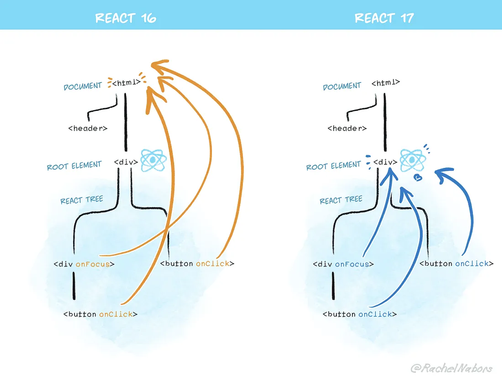
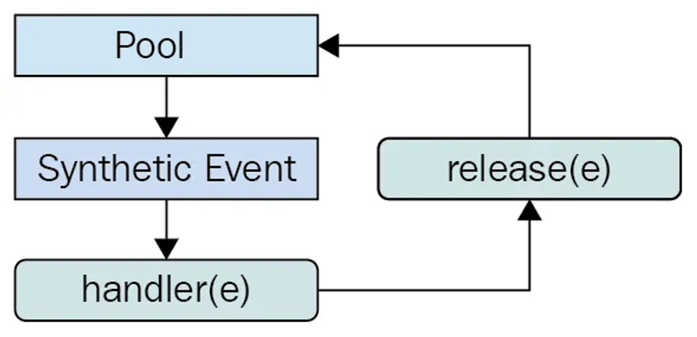
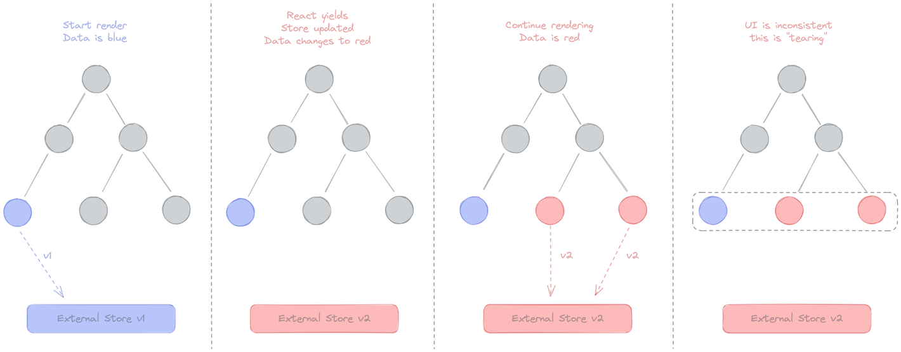

# [10장] 리액트 17과 18의 변경 사항 살펴보기

## 10.1 리액트 17 버전 살펴보기

**기존에 사용하던 코드의 수정을 필요로 하는 변경 사항을 최소화 함. (호환성 깨짐 X)**

16 → 17버전으로의 버전 업은 큰 부담없이 순조롭게 할 수 있다.

**✨리액트의 점진적인 업그레이드**

16에서 더 이상 호환되지 않는 API가 있거나 새로운 리액트 17을 사용하는 데 있어 이전과 작동 방식이 달라질 수 있기 때문에 단행된 주 버전 업데이트다.

**✨이벤트 위임 방식의 변경**

이벤트 위임: 리액트는 이벤트 핸들러를 해당 이벤트 핸들러를 추가한 각각의 DOM 요소에 부탁하는 것이 아니라, 이벤트 타입(click, change)당 하나의 핸들러를 루트에 부착한다.

1. 캡처: 이벤트 핸들러가 타깃 노드에 도달하는 단계
2. 타깃: 이벤트 핸들러가 타깃 노드에 도달하는 단계
3. 버블링: 이벤트가 발생한 요소에서부터 시작해 최상위 요소까지 다시 올라감.

→ 이러한 이벤트 단계의 원리를 활용해 이벤트를 상위 컴포넌트에만 붙이는 것.



리액트는 이벤트 위임방식을 통해 이벤트를 처리한다.
→ 특정 컴포넌트의 버튼에서 클릭 이벤트가 발생하더라도, 실제로 이벤트 핸들러는 해당 버튼에 붙어있는 것이 아닌 root Element (16버전에는 Document, 17버전부터는 root DOM container)에 붙어있게 되는 것.

→ 하나의 애플리케이션에서 서로 다른 두 버전의 리액트가 존재한다고 했을 때, 두 버전의 리액트가 모두 Document Level에 이벤트 리스너를 부착하기 때문에 버그가 생기기 쉬운 환경이 된다!!!!!

**✨import React from ‘react’가 더 이상 필요 없다: 새로운 JSX transform**

17부터 바벨과 협력해 import 구문 없이도 JSX를 변환할 수 있다.

→ 불필요한 import 구문을 삭제해 번들링 크기를 약간 줄일 수 있고, 컴포넌트 작성을 더욱 간결하게 해준다.

**✨그 밖의 주요 변경 사항**

**📍이벤트 풀링 제거**

SyntheticEvent: 브라우저의 기본 이벤트를 한 번 더 감싼 이벤트 객체

리액트는 기본 이벤트가 아닌 한번 래핑한 이벤트를 사용하기 때문에 이벤트가 발생할 때마다 이 이벤트를 새로 만들어야 했고, 그 과정에서 항상 새로 이벤트를 만들 때마다 메모리 할당 작업이 일어날 수밖에 없다. 또한 메모리 누수를 방지하기 위해 이렇게 만든 이벤트를 주기적으로 해제해야 하는 번거로움이 있다.

→ 이벤트 풀링: SyntheticEvent 풀을 만들어서 이벤트가 발생할 때마다 가져오는 것.



1. 이벤트 핸들러가 이벤트를 발생시킨다.
2. 합성 이벤트 풀에서 합성 이벤트 객체에 대한 참조를 가져온다.
3. 이 이벤트 정보를 합성 이벤트 객체에 넣어준다.
4. 유저가 지정한 이벤트 리스너가 실행된다.
5. 이벤트 객체가 초기화되고 다시 이벤트 풀로 돌아간다.

→ 언뜻 보기에는 메모리도 아낄 수 있고, 불필요하게 GC가 자주 동작할 필요도 없어서 효율적인 시스템인 것 같아 보인다. 하지만 이벤트가 트리거 되었을 때 인스턴스 풀을 받아오고 이벤트 핸들러가 종료되자마자 다시 인스턴스를 release하는 방식은 필연적으로 **_비동기 이벤트에 대한 추가적인 대응_** (e.persist())을 필요로 한다.

→ 비동기 코드로 이벤트 핸들러에 접근하기 위해서는 이러한 방식으로 별도 메모리 공간에 합성 이벤트 객체를 할당해야 한다는 점, 모던 브라우저에서는 이와 같은 방식이 성능 향상에 크게 도움이 안 된다는 점때문에 이벤트 풀링 개념이 삭제됐다.

**📍useEffect 클린업 함수의 비동기 실행**

리액트의 useEffect에 있는 클린업 함수는 리액트 16버전까지는 동기적으로 처리됐다.

동기적으로 실행되어 이 클린업 함수가 완료되기 전까지는 다른 작업을 방해하므로 불필요한 성능 저하로 이어지는 문제가 존재했다.

→ 17부터는 화면이 완전히 업데이트된 이후에 클린업 함수가 비동기적으로 실행된다.

**📍컴포넌트의 undefined 반환에 대한 일관적인 처리**

16, 17버전은 컴포넌트 내부에서 undefined를 반환하면 오류가 발생한다. (의도치 않게 잘못된 반환으로 인한 실수를 방지함.)

- 16에서 forwardRef나 memo에서 undefined를 반환하는 경우에는 별다른 에러가 발생하지 않는 문제가 있었음…
- 17부터 다시 에러가 정상적으로 발생함
- 18부터는 undefined를 반환해도 에러가 발생하지 않음.

## 10.2 리액트 18버전 살펴보기

**✨새로 추가된 훅 살펴보기**

**📍useId**

- 컴포넌트 별로 유니크한 값을 생성함 (고유한 ID 생성)
- SSR환경에서 유용하며, 클라이언트와 서버에서 일관된 ID를 생성할 수 있게 도와준다.

```jsx
import React, { useId } from 'react'

const MyComponent = () => {
  const id = useId()

  return (
    <div>
      <label htmlFor={id}>Label</label>
      <input id={id} type="text" />
    </div>
  )
}

export default MyComponent
```

**📍useTransition**

- UI변경을 가로막지 않고 상태를 업데이트할 수 있는 리액트 훅 (중요한 작업을 우선 처리)
- 상태 업데이트를 긴급하지 않은 것으로 간주해 무거운 렌더링 작업을 조금 미룰 수 있고, UX 좋다.

```jsx
const [isPending, startTransition] = useTransition()
// isPending: 트랜지션이 진행 중인지 여부를 나타내는 상태
// startTransition: 트랜지션 업데이트를 시작하는 함수
```

```jsx
import React, { useState, useTransition } from 'react'

const MyComponent = () => {
  const [list, setList] = useState([])
  const [isPending, startTransition] = useTransition()

  const handleClick = () => {
    startTransition(() => {
      // 큰 데이터 세트를 생성하는 작업을 트랜지션으로 처리
      const newList = Array.from(
        { length: 10000 },
        (_, index) => `Item ${index + 1}`
      )
      setList(newList)
    })
  }

  return (
    <div>
      <button onClick={handleClick}>Load Items</button>
      {isPending && <p>Loading...</p>}
      <ul>
        {list.map((item) => (
          <li key={item}>{item}</li>
        ))}
      </ul>
    </div>
  )
}

export default MyComponent
```

- 큰 데이터 세트 로드, 비동기 작업 처리, 애니메이션 등 다양한 사용 사례에서 UI 성능을 향상시키는 데 유용함.

**📍useDeferredValue**

- 리액트 컴포넌트 트리에서 리렌더링이 급하지 않은 부분을 지연할 수 있게 도와주는 훅
- 고정된 지연 시간 없이 첫 번째 렌더링이 완료된 이후에 이 useDeferredValue로 지연된 렌더링을 수행한다. → 이 지연된 렌더링은 중단할 수 있으며 사용자의 인터랙션을 차단하지도 않는다.

```jsx
const deferredValue = useDeferredValue(value)
// value: 지연시키고자 하는 원래 값
// deferredValue: 지연된 값으로, value가 변경된 후 일정 시간 지연된 값을 제공
```

```jsx
import React, { useState, useDeferredValue, useMemo } from 'react'

const FilterList = ({ input }) => {
  // 입력된 값에 따라 필터링된 목록 생성
  const filteredItems = useMemo(() => {
    return items.filter((item) =>
      item.toLowerCase().includes(input.toLowerCase())
    )
  }, [input])

  return (
    <ul>
      {filteredItems.map((item) => (
        <li key={item}>{item}</li>
      ))}
    </ul>
  )
}

const App = () => {
  const [input, setInput] = useState('')
  // 급하지 않은 렌더링을 지연시켜 UI의 응답성을 유지
  const deferredInput = useDeferredValue(input)

  const handleChange = (event) => {
    setInput(event.target.value)
  }

  return (
    <div>
      <input
        type="text"
        value={input}
        onChange={handleChange}
        placeholder="Search..."
      />
      <FilterList input={deferredInput} />
    </div>
  )
}

const items = [
  'Apple',
  'Banana',
  'Cherry',
  'Date',
  'Elderberry',
  'Fig',
  'Grape',
  'Honeydew',
]

export default App
```

입력 필드와 같이 사용자의 즉각적인 피드백이 필요한 부분과 덜 중요한 업데이트를 분리할 수 있다.

**📍useSyncExternalStore**

tearing: 찢어진다. 하나의 state값이 있음에도 서로 다른 값을 기준으로 렌더링되는 현상

- 18에서는 useTranstition, useDeferredValue의 훅처럼 렌더링을 일시 중지하거나 뒤로 미루는 등의 최적화가 가능해지면서 동시성 이슈가 발생할 수 있다.



1. 첫 번째 컴포넌트에서는 외부 데이터 스토어의 값이 파란색이었으므로 파란색 렌더링.
2. 나머지 컴포넌트들도 파란색으로 렌더링 준비
3. 갑자기 외부 데이터 스토어의 값이 빨간색으로 변경
4. 나머지 컴포넌트들은 렌더링 도중에 바뀐 색을 확인해 빨간색으로 렌더링
5. **결과적으로 같은 데이터 소스를 바라보고 있음에도 컴폰넌트 색상이 달라지는 테어링현상 발생..!**

```jsx
const state = useSyncExternalStore(subscribe, getSnapshot, getServerSnapshot)
// subscribe: 스토어의 상태 변경을 구독하는 함수.
// getSnapshot: 현재 스토어 상태를 반환하는 함수.
// getServerSnapshot: SSR을 위한 현재 스토어 상태를 반환하는 함수 (선택 사항).
```

```jsx
1. 외부 스토어 정의
// store.js
// 스토어의 상태
let count = 0;
// 상태 변경 시 호출되는 구독자 목록
const listeners = new Set();

// 상태를 변경하고 구독자에게 알리는 함수
export const increment = () => {
  count += 1;
  listeners.forEach(listener => listener());
};

export const subscribe = (listener) => {
  listeners.add(listener);
  return () => listeners.delete(listener);
};

// 현재 스토어 상태를 반환하는 함수
export const getSnapshot = () => count;

```

```jsx
2. 컴포넌트 구현
// Counter.js
import React from 'react';
import { useSyncExternalStore } from 'react';
import { subscribe, getSnapshot, increment } from './store';

const Counter = () => {
  const count = useSyncExternalStore(subscribe, getSnapshot);

  return (
    <div>
      <p>Count: {count}</p>
      <button onClick={increment}>Increment</button>
    </div>
  );
};

export default Counter;

```

- `useSyncExternalStore`는 외부 스토어의 상태를 구독하고, 상태 변경 시 컴포넌트를 동기적으로 업데이트하는 데 사용된다.
- `subscribe`, `getSnapshot`, `getServerSnapshot` 함수를 통해 외부 스토어와의 통합을 쉽게 설정할 수 있다.

→ Redux, Zustand 등 외부 상태 관리 라이브러리와 원활하게 통합할 수 있다.

**📍useInsertionEffect**

- CSS in js라이브러리를 위한 훅
- 브라우저가 DOM을 업데이트하기 전에 DOM을 변경할 필요가 있을 때 사용함.

```jsx
import React, { useInsertionEffect, useState } from 'react'

const MyComponent = () => {
  const [color, setColor] = useState('red')

  useInsertionEffect(() => {
    // 스타일 태그 생성 및 삽입
    const style = document.createElement('style')
    style.innerHTML = `
      .my-class {
        color: ${color};
      }
    `
    document.head.appendChild(style)

    // 클린업 함수로 이전 스타일 태그 제거
    return () => {
      document.head.removeChild(style)
    }
  }, [color])

  return (
    <div className="my-class">
      This text will be {color}
      <button onClick={() => setColor('blue')}>Change to blue</button>
    </div>
  )
}

export default MyComponent
```

**✨react-dom/client**

**📍createRoot**

- 기존 react-dom에 있던 render메서드를 대체할 새로운 메서드
- 동시성 기능(concurrent features)을 활용할 수 있게 해준다.

```jsx
// index.js
import React from 'react'
import ReactDOM from 'react-dom/client'
import App from './App'

// 기존의 ReactDOM.render 대신 createRoot 사용
const container = document.getElementById('root')
const root = ReactDOM.createRoot(container)

root.render(<App />)
```

**📍hydrateRoot**

- SSR 애플리케이션에서 하이드레이션을 하기 위한 새로운 메서드 (API)
- 이 API는 클라이언트가 이미 서버에서 렌더링된 HTML을 받아서 초기 로드 시간을 단축하고, 초기 페이지 로드에서 사용자에게 더 빠른 응답을 제공한다.

```jsx
// 서버 코드 (예: Express와 ReactDOMServer 사용)
// server.js
import express from 'express'
import React from 'react'
import ReactDOMServer from 'react-dom/server'
import App from './App'

const app = express()

app.get('/', (req, res) => {
  const appHtml = ReactDOMServer.renderToString(<App />)
  const html = `
    <!DOCTYPE html>
    <html lang="en">
      <head>
        <meta charset="UTF-8" />
        <meta name="viewport" content="width=device-width, initial-scale=1.0" />
        <title>React App</title>
      </head>
      <body>
        <div id="root">${appHtml}</div>
        <script src="/client.js"></script>
      </body>
    </html>
  `
  res.send(html)
})

app.listen(3000, () => {
  console.log('Server is running on http://localhost:3000')
})
```

```jsx
// 클라이언트 코드
// index.js
import React from 'react'
import { hydrateRoot } from 'react-dom/client'
import App from './App'

// 서버에서 렌더링된 HTML이 있는 루트 DOM 요소를 선택
const container = document.getElementById('root')

// hydrateRoot를 사용하여 하이드레이션
hydrateRoot(container, <App />)
```

**✨react-dom/server**

**📍renderToPipeableStream**

- 리액트 컴포넌트를 HTML로 렌더링하는 메서드
- 스트림을 지원하는 메서드로, HTML을 점진적으로 렌더링하고 클라이언트에서는 중간에 script를 삽입하는 등의 작업을 할 수 있다.
- 서버에서는 suspense를 사용해 빠르게 렌더링이 필요한 부분을 먼저 렌더링할 수 있다.

> ❓Suspense <br/>
> React에서 비동기 작업(예: 데이터 로딩, 코드 스플리팅 등)을 처리하는 동안 로딩 상태를 관리하고 사용자 경험을 향상시키기 위해 도입된 컴포넌트.
> 대기 중인 비동기 작업이 완료될 때까지 대체 UI를 표시하며, 해당 작업이 완료되면 실제 컴포넌트를 렌더링한다.

```jsx
// 서버 코드 (Express와 renderToPipeableStream 사용)
// server.js
import express from 'express'
import React from 'react'
import { renderToPipeableStream } from 'react-dom/server'
import App from './App'

const app = express()

app.get('/', (req, res) => {
  let didError = false // 오류 발생 여부 추적

  // renderToPipeableStream을 사용하여 React 컴포넌트를 HTML로 렌더링
  const { pipe } = renderToPipeableStream(<App />, {
    // 초기 HTML이 준비되었을 때 호출
    onShellReady() {
      res.statusCode = didError ? 500 : 200
      res.setHeader('Content-Type', 'text/html')
      pipe(res) // 렌더링된 HTML을 클라이언트로 스트림
    },
    // 초기 HTML을 렌더링하는 동안 오류가 발생했을 때 호출
    onShellError() {
      res.statusCode = 500
      res.send('<h1>Server Error</h1>')
    },
    // 렌더링 도중 발생한 모든 오류를 처리
    onError(error) {
      didError = true
      console.error(error)
    },
  })
})

app.listen(3000, () => {
  console.log('Server is running on http://localhost:3000')
})
```

**📍 renderToReadableStream**

- 웹 스트림을 기반으로 작동한다.
- 서버환경이 아닌 클라우드플레어나 디노 같은 웹 스트림을 사용하는 모던 엣지 런타임 환경에서 사용되는 메서드

**✨자동 배치(Automatic Batching)**

- 리액트가 여러 상태 업데이트를 하나의 리렌더링으로 묶어서 성능을 향상시키는 방법

```jsx
// React 18 이전
import React, { useState } from 'react'

function App() {
  const [count, setCount] = useState(0)
  const [text, setText] = useState('')

  const handleClick = () => {
    setTimeout(() => {
      setCount((c) => c + 1)
      setText('Updated') // 두 번의 렌더링 발생
    }, 1000)
  }

  console.log('Rendered') // 두 번 찍힘

  return (
    <div>
      <p>Count: {count}</p>
      <p>Text: {text}</p>
      <button onClick={handleClick}>Update</button>
    </div>
  )
}

export default App
```

```jsx
// React 18 이후

import React, { useState } from 'react'

function App() {
  const [count, setCount] = useState(0)
  const [text, setText] = useState('')

  const handleClick = () => {
    setTimeout(() => {
      setCount((c) => c + 1)
      setText('Updated') // 한 번의 렌더링 발생
    }, 1000)
  }

  console.log('Rendered') // 한 번 찍힘

  return (
    <div>
      <p>Count: {count}</p>
      <p>Text: {text}</p>
      <button onClick={handleClick}>Update</button>
    </div>
  )
}

export default App
```

**✨더욱 엄격해진 엄격모드**

**📍리액트의 엄격모드**

- 리액트 애플리케이션에서 발생할 수도 있는 잠재적인 버그를 찾는 데 도움이 되는 컴포넌트
  - 더 이상 안전하지 않은 특정 생명주기를 사용하는 컴포넌트에 대한 경고
  - 문자열 ref사용 금지
  - findDOMNode에 대한 경고 출력
  - 구 Context API 사용 시 발생하는 경고
  - 예상치 못한 부작용(side-effects) 검사

**엄격모드를 활성화하려면 `<React.StrictMode>`로 감싸면 된다.**

> 부작용(side-effects)
>
> - 클래스형 컴포넌트의 constructor, render, shouldComponentUpdate, getDerivedStateFromProps
> - 클래스형 컴포넌트의 setState의 첫 번째 인수
> - 함수형 컴포넌트의 body
> - useState, useMemo, useReducer에 전달되는 함수

**📍리액트 18에서 추가된 엄격 모드**

- 컴포넌트가 마운트 해제된 상태에서도 (컴포넌트가 렌더링 트리에 존재하지 않는 상태에서도) 컴포넌트 내부의 상태값을 유지할 수 있는 기능을 제공할 예정임.

ex) 사용자가 뒤로가기를 했다가 다시 현재 화면으로 돌아왔을 때 리액트가 즉시 이전의 상태를 그대로 유지해 표시할 준비를 하는 것..

- 컴포넌트가 최초에 마운트될 때 자동으로 모든 컴포넌트를 마운트 해제하고, 두 번째 마운트에서 이전 상태를 복원하게 된다. (개발 모드에서만 적용)

**✨Suspense 기능 강화**

- 컴포넌트를 동적으로 가져올 수 있게 도와주는 기능

```jsx
import React, { Suspense, lazy } from 'react'

// Lazy Component
const LazyComponent = lazy(() => import('./LazyComponent'))

const App = () => {
  return (
    <div>
      <h1>My App</h1>
      <Suspense fallback={<div>Loading...</div>}>
        <LazyComponent />
      </Suspense>
    </div>
  )
}

export default App
```

- Suspense를 사용하여 동적으로 컴포넌트를 가져오고, 로딩 상태를 쉽게 처리할 수 있다.
- 컴포넌트가 로드되는 동안 fallback UI를 제공하여 사용자에게 로딩 상태를 알린다.
- Suspense는 서버 사이드 렌더링과 함께 사용할 수 있어, 초기 로딩 속도를 개선

**✨인터넷 익스플로러 지원 중단에 따른 추가 폴리필 필요**

- 18에서는 리액트를 사용하는 코드에서 `Promise`, `Symbol`, `Object.assign` 이 세 가지 최신 자바스크립트 기능을 사용할 수 있다는 가정하에 배포된다.
- 만약 이 기능을 지원하지 않는 브라우저에서 서비스해야 한다면 폴리필을 반드시 추가해야 한다.

| Promise       | 비동기 작업의 완료/실패를 나타내는 객체 |
| ------------- | --------------------------------------- |
| Symbol        | 고유한 원시 데이터 타입, 속성 키로 사용 |
| Object.assign | 객체의 속성을 복사하여 병합하는 메서드  |

**✨그 밖에 알아두면 좋은 변경사항**

- 컴포넌트에서 `undefined`를 반환해도 에러가 발생하지 않는다. `undefined` 반환은 `null` 반환도 동일하게 처리된다.
- `<Suspense fallback={undefined}>`도 `null`과 동일하게 처리된다.
- `renderToNodeStream`이 지원 중단돼서 `renderToPipeableStream` 사용을 권장한다.

## 참고

- https://blog.mathpresso.com/react-deep-dive-react-event-system-2-1d0ad028308b
