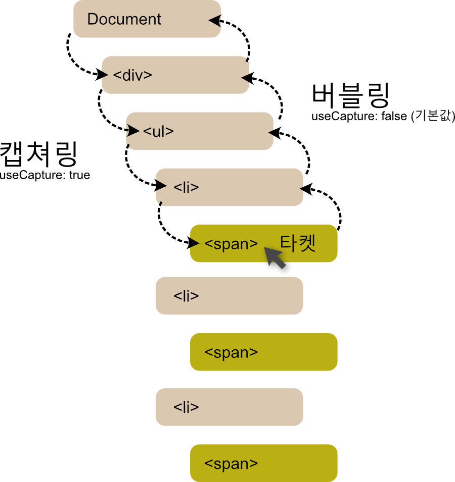
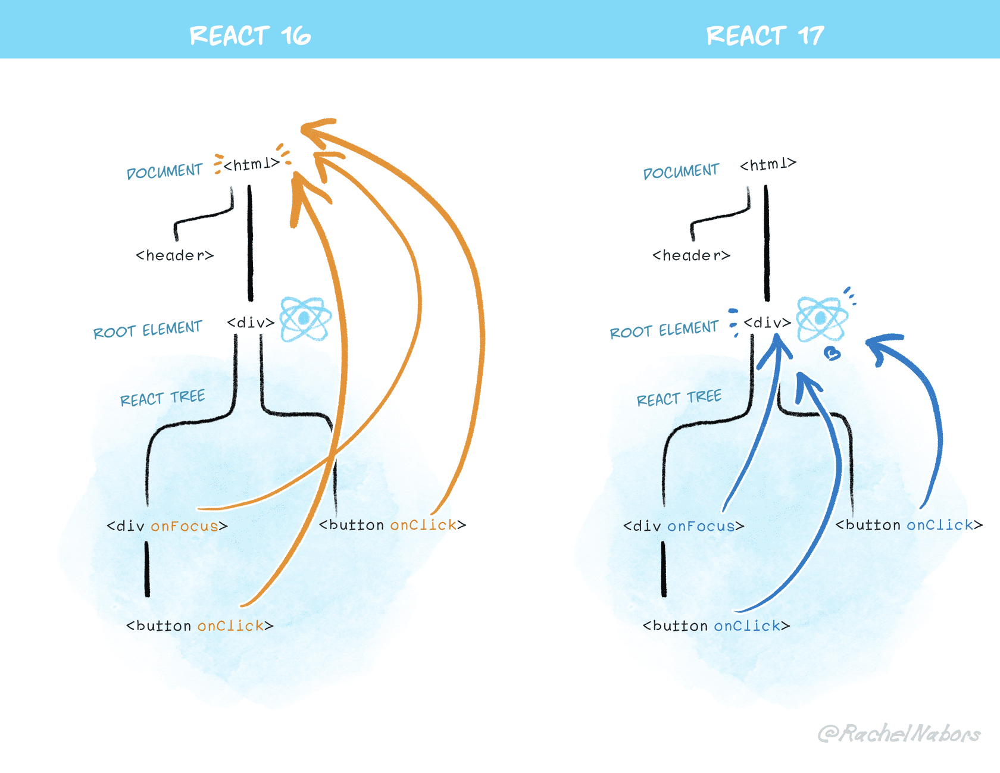
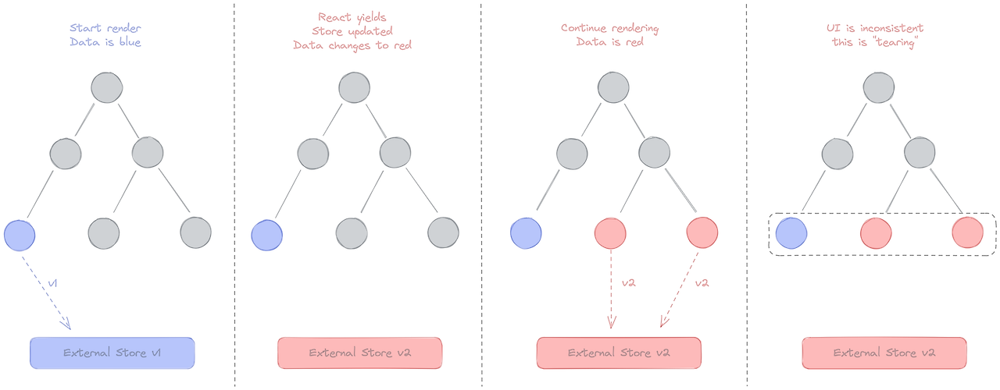
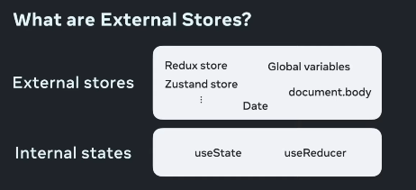

# 10장 리액트 17과 18의 변경 사항 살펴보기

## 10.1 리액트 17 버전 살펴보기

- 호환성이 깨지는 변경 사항을 최소화한 것이 가장 큰 특징
- 리액트 16 버전에서 17버전으로 업그레이드할 수 있도록 함

### 10.1.1 리액트의 점진적인 업그레이드

- 주 버전 업데이트 : 더 이상 호환되지 않는 API나 이전 버전과 작동 방식이 다른 경우
- 버전이 바뀌는 경우 전체 웹 서비스가 새로운 버전으로 완전히 업그레이드 되거나 현재 버전에 머물러 있어야 함
- 리액트 17버전부터는 기존 버전과 새로운 버전을 혼용해서 사용할 수 있도록. 즉 점진적으로 적용할 수 있도록 함 (한 번에 버전 업그레이드하기에 부담스러운 경우)

### 10.1.2 이벤트 위임 방식의 변경

- onClick
  - noop 이라는 핸들러 추가
  - noop (no operation) : 아무 일도 하지 않음
- 직접 DOM을 참조해서 onclick 이벤트를 추가
  - 이벤트 리스너
- 리액트에서 이벤트를 처리하는 법(이벤트 위임)
  
  - 이벤트 핸들러를 각각의 DOM에 부착하는 것이 아닌 이벤트 타입 당 하나의 핸들러를 루트에 부착함
  - `capture` : 핸들러가 트리 최상단부터 실제 이벤트가 발생한 타겟 요소까지 내려가는 것
  - `target` : 이벤트 핸들러가 타깃 노드에 도달. 여기서 이벤트 호출
  - `bubbling` : 이벤트가 발생한 요소부터 최상위까지 다시 올라감
- 이벤트 위임 : 특정 노드에 일일이 이벤트 리스너를 추가하는 대신 특정 노드들을 포함하는 상위 노드에 연결하여 이벤트를 전파하는 것
- 리액트 17 버전 이후 이벤트 버블링으로 인한 혼선을 방지하기 위해 이벤트 위임이 document가 아닌 리액트 컴포넌트의 최상단 트리인 루트 요소로 바뀜
  
  - HTML에서 여러 버전의 React가 공존하며 DOM에 앱을 생성하는 경우
  - 다른 기술로 빌드 된 앱 일부에 React를 사용해 적용할 경우

### 10.1.3 import React from ‘react’가 더 이상 필요 없다: JSX transform

- JSX는 바벨이나 TS를 활용해 일반 JS로 변환하는 과정 필요
- 16버전까지는 이런 JSX 변환처리를 위해 import React form ‘react’ 문 필수
  - React.createElement 함수 수행에 필요
- 17버전 이후 불필요한 import문 필요 없음
  - React.createElement 함수가 아닌 jsx-runtime 을 불러오는 require 구문이 추가됨에 따라 import문 필요 X
  - 코드가 더 간결하고 직관적

### 10.1.4 그 밖의 주요 변경 사항

✅ 이벤트 풀링 제거

- `syntheticEvent`
  - 이벤트 처리하기 위한 이벤트 객체
  - 브라우저의 기본 이벤트를 한 번 더 래핑한 이벤트 객체
- 이벤트가 발생할 때마다 추가적인 메모리 할당 작업이 필요해짐 (메모리 할당)
- `syntheticEvent` 풀을 만들어서 이벤트가 발생할 때마다 가져오는 것

- 이벤트 풀링 시스템에서의 과정
  - 이벤트 핸들러가 이벤트 발생
  - 합성 이벤트 풀에서 합성 이벤트 객체에 대한 참조 가져옴
  - 이 이벤트 정보를 합성 이벤트 객체에 넣어줌
  - 유저가 지정한 이벤트 리스너 실행
  - 이벤트 객체 초기화 후 다시 이벤트 풀로 돌아감

✅ useEffect 클린업 함수의 비동기 실행

- 16버전에는 동기적으로 실행됐기 때문에 성능 저하
- 17버전 이후 화면이 완전히 업데이트된 이후에 클린업 함수가 비동기적으로 실행

✅ 컴포넌트의 undefined 반환에 대한 일관적인 처리

- 컴포넌트 내부에서 undefined를 반환하면 오류 발생
- memo에서 undefined를 반환하는 경우 별도의 에러 발생하지 않는 문제 해결됨

### 10.1.5 정리

- 큰 변화를 최소화하고 다음 버전 업을 위한 버전 업

## 10.2 리액트 18 버전 살펴보기

### 10.2.1 새로 추가된 훅 살펴보기

- hook 대거 추가

📍**useld**

- 컴포넌트별로 유니크한 값을 생성하는 훅

📍 **useTransition**

- UI를 차단하지 않고 상태를 업데이트할 수 있는 훅
- 상태 업데이트를 긴급하지 않은 것으로 간주하여 렌더링 작업 미룰 수 있음
- 상태 변화의 우선순위 지정
- `[isPending, startTransition]` 을 반환
  - ispending : 우선순위가 낮은 일부 상태 업데이트가 지연(실행 보류 중)되고 있음을 알리는 boolean타입
  - startTransition : 낮은 우선순위로 실행할 함수를 인자로 받음 (set 함수)
- 사용자에게 좀 더 자연스러운 서비스 경험
- 유의사항
  - setState와 같이 상태를 업데이트하는 ㅎ마수와 관련된 작업만 가능
  - 다른 모든 동기 상태 업데이트로 인해 실행이 지연될 수 있다(다른 상태 업데이트가 있는 경우 그걸 먼저 처리)
  - 반드시 동기 함수여야 한다. 비동기 함수일 경우 작업을 지연시키는 작업과 비동기로 함수가 실행되는 작업 사이에 불일치가 일어나기 때문

📍 **useDeferredValue**

- 위와 유사하게 낮은 우선순위를 지정하기 위한 훅
- 값의 업데이트 우선순위를 지정 (useTransition은 함수 실행의 우선순위 지정)
  - useTransition -낮은 우선순위로 처리해야 할 작업에 대해 직접적으로 상태를 업데이트할 수 있는 코드에 접근하는 경우
  - useDeferredValue - 값만 받아야 하는 상황
- 디바운스와 비슷
  - 디바운스 : 특정 시간동안 발생하는 이벤트를 하나로 인식해 한 번만 실행
  - 고정된 지연 시간을 필요로 함
- 고정된 지연 시간 없이 첫 번재 렌더링이 완료된 이후에 지연된 렌더링을 수행
- 지연된 렌더링은 중

📍 **useSyncExternalStore**

- `tearing` : 의도치 않게 동일한 상태에 대해 여러가지 UI 형태가 나타나는 것 (시각적 불일치)
- 리액트 18부터는 렌더링을 일시 중지 가능, 즉 동시(concurrent) 렌더링이 이 문제를 유발할 수 있음
  
  1. 외부 데이터 스토어의 값이 파란색이므로 파란색 렌더링
  2. 나머지 컴포넌트들도 파란색으로 렌더링 준비
  3. 그러다 외부 데이터 스토어의 값이 빨간색으로 변경
  4. 나머지 컴포넌트들은 렌더링 도중 바뀐 값을 확인해 빨간색으로 렌더링
  5. 같은 데이터 소스를 바라보는데 컴포넌트의 색상이 다른 테어링 현상 발생



- 이러한 Tearing 을 해결하고 안전하게 외부 저장소의 값을 일관성 있게 사용하기 위해 나온 훅
- 외부 저장소의 값 : 상태관리 라이브러리, DOM 객체 등

```jsx
useSyncExternalStore(
  subscribe: (callback) => Unsubscribe,
  getSnapshot: () => State,
  getServerSnapshot?: () => State
)
```

- `subscribe`
  - 콜백 함수를 받아 스토어에 등록하는 용도
  - 스토어에 있는 값이 변경되면 이 콜백이 호출됨.
  - 이 훅을 사용하는 컴포넌트를 리렌더링
- `getSnapshot`
  - 컴포넌트에 필요한 현재 스토어의 데이터를 반환하는 함수
  - 스토어가 변경되지 않았다면 매번 함수를 호출할 때마다 동일한 값을 반환해야 함
  - 값이 변경됐다면 이전 값과 object.is로 비교해서 컴포넌트 리렌더링
- `getServerSnapshot`
  - SSR 시, 내부 리액트를 하이드레이션하는 도중에만 사용됨
  - 클라이언트 값과 불일치가 발생할 경우 오류 발생

```jsx
import { useSyncExternalStore } from "react";

function subscribe(callback) {
  window.addEventListener("resize", callback);
  return () => {
    window.removeEventListener("resize", callback);
  };
}

const useInnerHeight = () => {
  const innerHeight = useSyncExternalStore(
    subscribe,
    () => window.innerHeight,
    () => 0
  );

  return innerHeight;
};

export default useInnerHeight;
```

- subscribe를 활용해 외부 값이 변경되면 리렌더링이 발생하게 함

📍 **useInsertionEffect**

- CSS - in - js 라이브러리를 위한 훅
- DOM 업데이트 이전에 호출되는 useEffect의 한 형태
- 이 훅 내부에 스타일 삽입하는 코드를 주입해서 브라우저가 레이아웃을 계산하기 전에 실행
- useLayoutEffect는 모든 DOM의 변경 작업이 다 끝난 이후에 실행되는 반면 useInsertionEffect는 DOM 변경 작업 이전에 실행

### 10.2.2 react-dom/client

📍**createRoot**

- 기존 ReactDOM.render 메서드를 대체하는 새로운 메서드

📍**hydrateRoot**

- SSR 애플리케이션에서 하이드레이션을 하기 위한 새로운 메서드

### 10.2.3 react-dom/server

📍**renderToPipeableStream**

- Node.js 환경에서 작동
- 리액트 컴포넌트를 HTML 로 렌더링하는 메서드
- 서버에서 HTML을 미리 렌더해여 클라이언트 측으로 보냄
- 클라이언트에서 `hydrateRoot`를 호출하여 서버에서 생성된 HTML을 상호작용이 가능

📍**renderToReadableStream**

- 웹 스트림을 기반으로 작동

### 10.2.4 자동 배치 (Automatic Batching)

- 리액트가 여러 상태 업데이트를 하나의 리렌더링으로 묶어서 성능을 향상시키는 방법
- 여러 개의 state 업데이트마다 발생하는 불필요한 리렌더링을 막아줌
- 동기,비동기,이벤트 핸들러 등에 관계 없이 렌더링을 배치로 수행

### 10.2.5 더욱 엄격해진 엄격 모드

✅ 리액트의 엄격모드

- `strictMode` : 리액트 애플리케이션에서 발생할 수도 있는 잠재적인 버그를 찾는 데 도움이 되는 컴포넌트
- 개발자 모드에서만 작동

**📍 더 이상 안전하지 않은 특정 생명주기를 사용하는 컴포넌트에 대한 경고**

- 클래스형 컴포넌트 생명주기 메서드 3가지 사용 불가
- 엄격모드에서 UNSAFE\_ 가 붙은 메서드를 사용하면 경고 메세지

**📍문자열 ref 금지**

- 과거 리액트에서 createRef 없이 문자열로 ref 생성하고, 이를 사용해 DOM 노드 참조 가능
  - 문자열로 값을 주는 건 여러 컴포넌트에 겹쳐 사용될 수 있으며 이는 충돌의 여지가 있음
  - 단순 문자열로만 존재하기 때문에 실제로 어떤 ref에서 참조되고 있는지 파악 어렵
  - ref 값을 계속해서 추적해야 하기 때문에 성능 이슈

**📍findDOMNode에 대한 경고 출력**

- `findDOMNode` **:** 클래스형 컴포넌트 인스턴스에서 실제 DOM 요소에 대한 참조를 가져올 수 있는 메서드
- `findDOMNode` 의 문제
  - 부모가 특정 자식만 별도로 렌더링하는 것이 가능. 이는 트리 추상화 구조를 무너뜨림
  - 항상 첫번째 자식을 반환하는데 이는 프래그먼트 사용 시 어색해짐
  - 일회성 API 이기 때문에 자식 컴포넌트가 다른 노드를 렌더링하는 경우 변경 사항 추적 불가

**📍 구 ContextAPI 사용 시 발생하는 경고**

- `childContextTypes` , `getChildContext` :를 사용하는 경우

**📍 예상치 못한 부작용(side-effects) 검사**

- 의도적으로 이중으로 호출
- 모든 컴포넌트는 항상 순수하다고 가정
- 항상 순수한(동일한) 결과물을 내고 있는지 확인하기 위함

**📍 리액트 18에서 추가된 엄격 모드**

- 추후 컴포넌트가 렌더링 트리에 존재하지 않는 상태에도 컴포넌트 내부의 상태값을 유지할 수 있는 기능 추가 예정
- 이 기능을 향후 지원하기 위해 컴포넌트가 최초에 마운트될 때 자동으로 모든 컴포넌트를 마운트 해제하고 두번째 마운트에서 이전 상태 복원 (개발 모드 한정)

### 10.2.6 Suspense 기능 강화

- 컴포넌트의 랜더링을 어떤 작업이 끝날 때까지 잠시 중단시키고 다른 컴포넌트를 먼저 랜더링할 수 있음
- 사용 방법

```jsx
import { Suspense } from "react";
import User from "./User";
import fetchData from "./fetchData";

function Main() {
  return (
    <main>
      <h2>Suspense 사용</h2>
      <Suspense fallback={<p>사용자 정보 로딩중...</p>}>
        <User resource={fetchData("1")} />
      </Suspense>
    </main>
  );
}

export default Main;
```

- Suspense
  - `fallback` : 로딩 시 보여줄 컴포넌트(user 컴포넌트가 로딩 되는 동안)
- 16.6 버전
  - Suspense는 React.lazy를 통해 지연시켜 불러온 컴포넌트를 렌더링
  - fallback UI를 보여주는 사이에 effect가 실행
  - SSR 에서 사용 불가
- 18 버전
  - lazy 컴포넌트가 렌더링 될 때 useLayoutEffect를 실행
  - 스트리밍을 지원하는 서버 렌더 추가

### 10.2.9 정리

- 동시성 렌더링 핵심
- 트리 전체가 계산이 완료된 이후에 DOM 수정이 완료되기까지 기다림
- 메인 스레드를 차단하지 않고 백그라운드에서 수행되며 새로운 화면을 만들 작업을 준비
