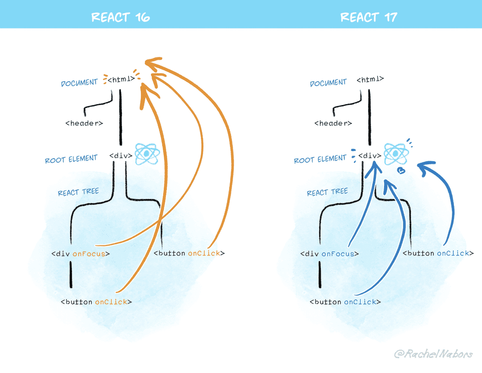
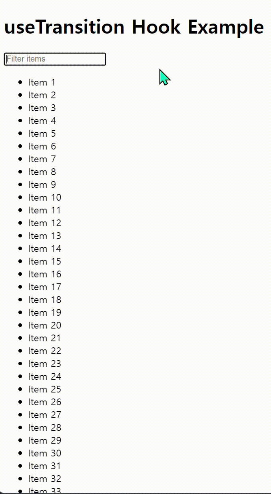
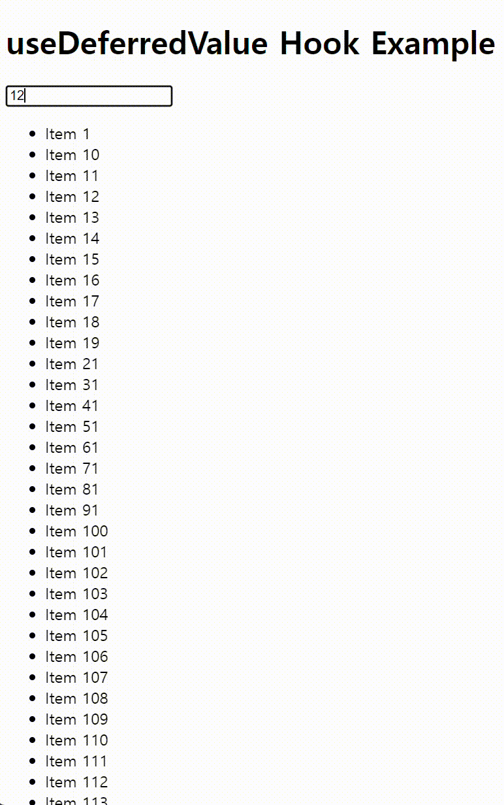
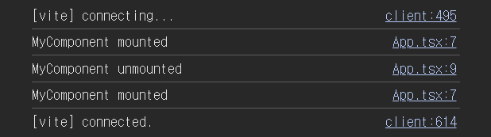

# 10. 리액트 17과 18의 변경 사항 살펴보기

**아직까지도 가장 인기있는건 리액트 16버전이지만, 17과 18을 몰라도 되는건 아니다.**

## 10.1 리액트 17버전 살펴보기

### ✨ 16에서 17로의 변경은 변경사항을 최소화하여 호환성 측면에서 큰 문제없이 마무리되었다.

<br>

### 10.1.1 리액트의 점진적인 업그레이드

---

### 🔖 유의적 버전 기반 업데이트를 통한 리액트의 발전

- 이는 새로운 주 버전이 업데이트될 때마다 기존에 사용하던 버전을 완전히 버려버리는 방식을 택해왔음을 의미

- 하지만 리액트 17버전부턴 "점진적 업그레이드"가 가능해짐

- 여기서 점진적 업그레이드란, 리액트의 다음 버전 기능을 사용하면서도 일부 기능은 그대로 유지하는 유도리있는 업그레이드를 의미

<br>

> 대표적으로 facebook, airbnb, netflix 등이 이런 방식을 채택하여 서비스중

<br>

### 10.1.2 이벤트 위임 방식의 변경

---

### 🔖 리액트는 이벤트 위임을 적극적으로 활용한다.

- 캡처(capture), 타깃(target), 버블링(bubbling)으로 이루어진 이벤트 단계의 원리를 이용해 이벤트를 상위 컴포넌트에 부착시켜 해당 컴포넌트의 하위에 이벤트를 전파시킨다.

- 기존의 16버전은 `document`에서 이벤트 위임을 했으나 17버전부터 리액트 최상단 루트 컴포넌트로 대상이 변경되었다.



- 기존 방식일 경우 발생할 수 있는 문제는 무엇일까?

```jsx
import React, { useEffect } from "react";

function App() {
  useEffect(() => {
    // 직접 document에 이벤트 리스너를 등록
    const handleDocumentClick = (event) => {
      alert("Document clicked!");
    };

    document.addEventListener("click", handleDocumentClick);

    return () => {
      document.removeEventListener("click", handleDocumentClick);
    };
  }, []);

  const handleParentClick = (event) => {
    alert("Parent clicked!");
  };

  const handleButtonClick = (event) => {
    event.stopPropagation(); // 이벤트 전파를 막음
    alert("Button clicked!");
  };

  return (
    <div onClick={handleParentClick} style={{ padding: "50px", border: "1px solid black" }}>
      <h1>리액트 이벤트 위임 문제 예제</h1>
      <button onClick={handleButtonClick} style={{ padding: "10px" }}>
        클릭하세요
      </button>
    </div>
  );
}

export default App;
```

- 해당 코드와 같이 직접 `document`에 이벤트를 등록한 경우, `event.stopPropagation()` 으로 이벤트 전파를 막을 수 없게 된다.

- 또한 하나의 애플리케이션에서 각기 다른 라이브러리와 언어가 혼재한 상황에서 동일한 문제가 발생할 수 있다.

<br>

### 10.1.3 import React from 'react'가 더 이상 필요 없다: 새로운 JSX tranform

---

### 🔖 리액트 17버전부터 babel과 협력하여 JSX를 변환한다.

- 코드가 간결해지는 점 이외에도 내부 로직이 간결해지며, 번들 사이즈도 조금이나마 줄어든다.

<br>

### 10.1.4 그 밖의 주요 변경 사항

---

### 🏷️ 이벤트 풀링 개념 삭제

- 리액트는 이벤트를 처리하기 위해 `SyntheticEvent` 라는 이벤트를 추가로 감싸는 형식으로 이벤트 발생을 처리해왔다.

- 때문에 해당 객체를 이벤트 발생마다 재생성해야 했고, 그만큼 메모리 누수 또한 컸다.

- 해당 이벤트는 서로 다른 이벤트들이 해당 객체를 재사용하여, 비동기 로직에서 이를 사용 시 충돌하는 경우가 존재했다.

<br>

> [합성 이벤트와 이벤트 풀링](https://medium.com/crossplatformkorea/react-%EB%A6%AC%EC%95%A1%ED%8A%B8%EB%A5%BC-%EC%B2%98%EC%9D%8C%EB%B6%80%ED%84%B0-%EB%B0%B0%EC%9B%8C%EB%B3%B4%EC%9E%90-06-%ED%95%A9%EC%84%B1-%EC%9D%B4%EB%B2%A4%ED%8A%B8%EC%99%80-event-pooling-6b4a0801c9b9)

- 비효율적인 로직이라 리액트 17버전부터 삭제되었다.

### 🏷️ useEffect 클린업 함수 비동기 실행

- 16버전 이하까지 클린업 함수는 동기적으로 실행되어 완료 전까지 다른 함수의 실행을 방해했다.

- 17버전부턴 비동기적으로 화면의 업데이트가 끝난 이후에 실행되어 조금이나마 성능의 향상을 얻을 수 있게 되었다.

### 🏷️ 컴포넌트의 undefined 반환에 대한 일관적인 처리

- 컴포넌트가 `undefined` 를 반환할 시 에러가 발생하도록 하는데, 이는 잘못된 반환에 의한 실수를 방지하기 위해서였다.

- 17버전부턴 `memo`나 `forwardRef` 등에서도 정상적으로 에러가 반환된다.

- 18버전부턴 에러를 반환하지 않는다.

<br>

### 10.1.5 정리

- 점직적 업그레이드를 위해 업그레이드를 고려해보도록!

<br>

## 10.2 리액트 18버전 살펴보기

### ✨ 18버전은 17과 다르게 여러가지 다양한 기능들이 추가되었다.

<br>

### 10.2.1 새로 추가된 훅 살펴보기

---

### 🏷️ useId

- 컴포넌트 별로 유니크한 값을 생성하는 훅으로, 서버와 클라이언트의 데이터가 다를 때 발생하는 하이드레이션 에러 등을 대비하기 위해 사용된다.

```jsx
import { useId } from "react";

function InputField() {
  const id = useId();

  return (
    <div>
      <label htmlFor={id}>Enter your name:</label>
      <input id={id} type="text" />
    </div>
  );
}

function App() {
  return (
    <div>
      <h1>useId Hook Example</h1>
      <InputField />
      <InputField />
    </div>
  );
}

export default App;
```

- 해당 예제의 경우 서로 다른 `InputField` 에 각각의 고유한 `id` 값이 `htmlFor`과 `id`에 들어가게 되므로 접근성을 향상시킬 수 있다.

### 🏷️ useTransition

- UI 변경을 막지 않고 상태를 업데이트 가능한 리액트 훅

```jsx
import React, { useState, useTransition } from "react";

const list = Array.from({ length: 2000 }, (_, index) => `Item ${index + 1}`);

function App() {
  const [inputValue, setInputValue] = useState("");
  const [filteredItems, setFilteredItems] = useState(list);
  const [isPending, startTransition] = useTransition();

  const handleChange = (event) => {
    const value = event.target.value;
    setInputValue(value);

    startTransition(() => {
      const filtered = list.filter((item) => item.toLowerCase().includes(value.toLowerCase()));
      setFilteredItems(filtered);
    });
  };

  return (
    <div>
      <h1>useTransition Hook Example</h1>
      <input type="text" value={inputValue} onChange={handleChange} placeholder="Filter items" />
      {isPending && <p>Loading...</p>}
      <ul>
        {filteredItems.map((item, index) => (
          <li key={index}>{item}</li>
        ))}
      </ul>
    </div>
  );
}

export default App;
```

- 해당 코드는 `onChange` 이벤트를 통해 받아온 `value` 값을 저장하고, 이를 `filteredItem`에 필터링된 `value`를 넣는다.

- 위의 로직때문에 렌더링에 제약이 생길 수 있으나, `useTransition`을 통해 이를 해결하였다.

- 이는 리액트18버전의 핵심 변경 사항 중 하나인 동시성(concurrency)를 다룰 수 있는 새로운 훅으로, 성능 향상과 더불어 자연스러운 렌더링을 서비스할 수 있도록 한다.

<br>



### 🚫 실습해본 결과 오히려 리스트가 매우 큰 경우엔 부정적인 경험을 야기할 수 있을 듯 하다..

### 🏷️ useDefferedValue

- `debounce`와 비슷한 개념으로, 리렌더링 시 급하지 않은 부분을 지연시킬 수 있게 도와주는 훅

- `useTransition` 과 비슷하나 `state` 값을 업데이트하는 함수에 감싸느냐, `state` 값 자체를 감싸느냐에 차이를 둘 수 있다.

```jsx
import { useState, useDeferredValue, useMemo } from "react";

const list = Array.from({ length: 2000 }, (_, index) => `Item ${index + 1}`);

function App() {
  const [inputValue, setInputValue] = useState("");
  const defferedValue = useDeferredValue(inputValue);

  const handleChange = (event) => {
    const value = event.target.value;
    setInputValue(value);
  };

  const filteredItems = useMemo(() => {
    return list.filter((item) => item.toLowerCase().includes(inputValue.toLowerCase()));
  }, [defferedValue]);

  return (
    <div>
      <h1>useDeferredValue Hook Example</h1>
      <input type="text" value={inputValue} onChange={handleChange} placeholder="Filter items" />
      <ul>
        {filteredItems.map((item, index) => (
          <li key={index}>{item}</li>
        ))}
      </ul>
    </div>
  );
}

export default App;
```

- `useTransition` 과 비교 실습해본 결과 확실히 데이터 자체 크기가 큰 경우의 로직에선 `useDefferedValue` 훅이 더 잘 먹히는 것을 확인할 수 있었다.



### 🏷️ useSyncExternalStore

- 리액트 17버전까지 존재했던 `useSubscription`을 대체하는 훅

> `useSyncExternalStore` 는 외부 store를 구독할 수 있는 React Hook입니다. - 공식문서

<br>

- 이를 위해 알아야 하는 '테어링' 현상에 대해 간단하게 설명해보자.

  - 하나의 `state` 값만 존재함에도 `state`나 `props`의 값을 기준으로 서로 다른 값에 의해 렌더링이 되는 현상

  - 리액트 17까진 해당하지 않았으나, 18버전부터 위에 설명했던 훅이 등장하며 동시성 이슈가 발생 가능하게 되었다.

  - 렌더링의 '양보'가 가능해져 다른 외부 데이터 소스들이 리액트가 추구하는 동시성 처리가 되어있지 않은 경우 이런 이슈가 발생할 수 있다.

  - 이러한 테어링 현상을 방지하기 위해서 `useSyncExternalStore` 훅을 사용한다.

- 책에는 없는 내용이지만 흥미로워 예제를 가져왔다.

```jsx
import { useSyncExternalStore } from "react";

export default function ChatIndicator() {
  const isOnline = useSyncExternalStore(subscribe, getSnapshot);
  return <h1>{isOnline ? "✅ Online" : "❌ Disconnected"}</h1>;
}

function getSnapshot() {
  return navigator.onLine;
}

function subscribe(callback) {
  window.addEventListener("online", callback);
  window.addEventListener("offline", callback);
  return () => {
    window.removeEventListener("online", callback);
    window.removeEventListener("offline", callback);
  };
}
```

> [브라우저 API 구독](https://ko.react.dev/reference/react/useSyncExternalStore#subscribing-to-a-browser-api)

### 🏷️ useInsertionEffect

- `styled-component`와 같은 `CSS-in-JS`를 더 효율적으로 사용할 수 있게 해주는 훅

- 보통 `CSS-in-JS`는 미리 정의되어있는 스타일들을 사용하기 위해 미리 `<style>` 태그에 삼입하는 작업을 진행하는데, 이건 리액트 관점에서 매우 무거울 수 있는 작업이다.

- DOM이 실제로 변경되기 전에 동기적으로 실행되며, 브라우저가 레이아웃 계산 전에 훅을 실행하며 좀 더 자연스러운 스타일 삽입이 가능하다.

```jsx
// 실행 순서
function Index() {
  useEffect(() => {
    //
  });
  useLayoutEffect(() => {
    //
  });
  useInsertionEffect(() => {
    //
  });
}
```

- `useLayoutEffect`와 거의 비슷한 시점이지만, DOM의 변경 작업이 완료된 후냐 전이냐의 차이가 있다.

<br>

### 10.2.2 react-dom/client

- 클라이언트 기준에서 리액트 18버전으로 업그레이드 시키는 경우 주의해야할 점을 다룬다.

```jsx
import ReactDOM from "react-dom/client";
import App from "./App.tsx";
import "./index.css";

ReactDOM.createRoot(document.getElementById("root")!).render(<App />);
```

- 기존의 `render`에서 `createRoot`를 더해 사용한다.

```jsx
import ReactDOM from "react-dom/client";
import App from "./App.tsx";
import "./index.css";

ReactDOM.createRoot.hydrateRoot(document.getElementById("root")!);
```

- React DOM API와 함께 사용되며, 자체적으로 서버 사이드 렌더링을 구현해 사용하는 경우 이런식으로 변경해야한다.

<br>

### 10.2.3 react-dom/server

---

```jsx
import express from "express";
import React from "react";
import { renderToPipeableStream } from "react-dom/server";
import App from "./src/App";

const PORT = 3000;
const app = express();

app.use(express.static("public"));

app.get("*", (req, res) => {
  res.setHeader("Content-Type", "text/html");

  const stream = renderToPipeableStream(<App />, {
    onShellReady() {
      res.statusCode = 200;
      res.write('<!DOCTYPE html><html><head><title>SSR with React</title></head><body><div id="root">');
      stream.pipe(res);
    },
    onAllReady() {
      res.write('</div><script src="/client.js"></script></body></html>');
      res.end();
    },
    onError(err) {
      console.error(err);
      res.statusCode = 500;
      res.send("Internal Server Error");
    },
  });
});

app.listen(PORT, () => {
  console.log(`Server is listening on http://localhost:${PORT}`);
});
```

- 위 예제는 `Express`와 `react-dom/server`를 사용해 서버 사이드 렌더링을 사용가능한 로직을 구현한 것이다.

- 위와 같은 서버 및 `hydrateRoot` 메서드를 이용해 서버에서 HTML을 렌더링하고 클라이언트에서 이벤트만 추가하는 등 매우 빠른 첫 로딩을 구현 가능하다. (Next의 SSR 로직과 유사)

- 기존의 `renderToNodeStream`의 렌더링 순서에 의존적이던 문제를 개선했다고 볼 수 있다.

### ✅ 번외적으로 웹 스트림을 기반으로 작동하는 `renderToReadableStream` 훅도 있다.

<br>

### 10.2.4 자동 배치(Automatic Batching)

---

### 🔖 여러 상태 업데이트를 하나의 리렌더링으로 묶어 성능을 향상시키는 방법

```jsx
import React, { useState } from "react";
import { createRoot } from "react-dom/client";

function App() {
  const [count, setCount] = useState(0);
  const [text, setText] = useState("");

  const handleClick = () => {
    // 이 경우 배칭이 이루어짐 (한 번의 리렌더링)
    setCount((prevCount) => prevCount + 1);
    setText("Count updated");
  };

  const handleAsyncClick = () => {
    // 이 경우 자동 배칭이 이루어져 한 번의 리렌더링만 발생
    setTimeout(() => {
      setCount((prevCount) => prevCount + 1);
      setText("Count updated");
    }, 1000);
  };

  return (
    <div>
      <h1>{count}</h1>
      <p>{text}</p>
      <button onClick={handleClick}>Update Synchronously</button>
      <button onClick={handleAsyncClick}>Update Asynchronously</button>
    </div>
  );
}

// 리액트 18에서는 createRoot를 사용하여 렌더링합니다.
const container = document.getElementById("root");
const root = createRoot(container);
root.render(<App />);
```

- 기존의 배칭과 다르게, 18버전부턴 `promise`나 `setTimeout`과 같은 비동기 로직에도 배칭이 적용되도록 변경되어 성능이 향상되었다.

<br>

### 10.2.5 더욱 엄격해진 엄격 모드

---

### 🔖 엄격엄격

- 개발자 모드에서만 작동하는 엄격 모드를 통해 잠재적인 버그를 찾아낼 수 있다.

  1. 더 이상 안전하지 않은 특정 생명주기를 사용하는 컴포넌트에 대한 경고를 날린다.

  2. 레거시 문자열 ref를 사용할 시 경고를 날린다.

  3. `findDOMNode`에 대해 경고를 날린다.

  4. 구 Context API 사용 시 경고를 날린다.

  5. 예상치 못한 부작용(side-effect)를 검사한다. (개발자에게 모든 컴포넌트가 항상 순수하다는 것을 확인시켜주기 위함)

- 추가적으로 컴포넌트 최초 마운트 시 자동으로 모든 컴포넌트를 마운트 해제하고 두번째 마운트에서 이전 상태를 복원하는 기능도 추가됐다.

- 이는 순수한 마운트 및 언마운트의 확인과 사이드 이펙트 처리, 리소스 릭 감지를 위해 사용된다.

```jsx
import React, { useState, useEffect } from "react";

function MyComponent() {
  const [count, setCount] = useState(0);

  useEffect(() => {
    console.log("MyComponent mounted");
    return () => {
      console.log("MyComponent unmounted");
    };
  }, []);

  return (
    <div>
      <p>Count: {count}</p>
      <button onClick={() => setCount(count + 1)}>Increment</button>
    </div>
  );
}

function App() {
  return (
    <React.StrictMode>
      <MyComponent />
    </React.StrictMode>
  );
}

export default App;
```



<br>

### 10.2.6 Suspense 기능 강화

---

### 🔖 16.6버전에서 추가된 컴포넌트를 동적으로 가져오는 기능

- 기존에는 컴포넌트가 보이기전에 `useEffect`가 실행된다던가, 서버에서 사용할 수 없는 등 다양한 이슈가 있었다.

```jsx
// LazyComponent
import React from "react";

const LazyComponent = () => {
  return (
    <div>
      <h1>This is a lazy-loaded component!</h1>
      <p>It was loaded asynchronously using React.lazy and Suspense.</p>
    </div>
  );
};

export default LazyComponent;

// App
import React, { Suspense } from 'react';

// React.lazy를 사용하여 LazyComponent를 동적으로 임포트
const LazyComponent = React.lazy(() => import('./LazyComponent'));

function App() {
  return (
    <div>
      <h1>Welcome to React Suspense Example</h1>
      {/* Suspense를 사용하여 로딩 상태를 처리합니다. */}
      <Suspense fallback={<div>Loading...</div>}>
        <LazyComponent />
      </Suspense>
    </div>
  );
}

export default App;

```

- 18버전부터 이슈를 해결하여 정식으로 지원한다.

<br>

### 그 밖에 알아둘만한 사항

- 리액트는 이제 인터넷 익스플로러를 사용하지 않는다는 조건 하에 사용하므로, 폴리필이나 트랜스파일 처리에 주의해야한다.

<br>

### 정리

- 17은 전체적으로 다듬는 느낌이었고, 18은 다듬은 것을 바탕으로 하고싶은거 다 해봤다는 느낌이다.

- 18의 핵심은 결국 동시성 렌더링이며, 이를 통해 개발자는 다양한 이점을 얻어갈 수 있다. 따라서 이를 잘 활용해야 한다.
