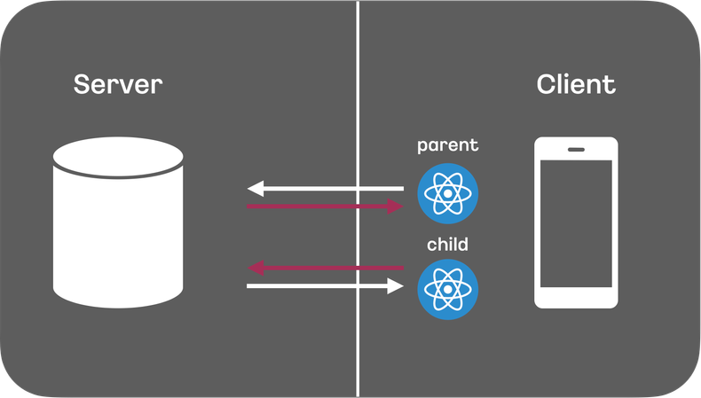
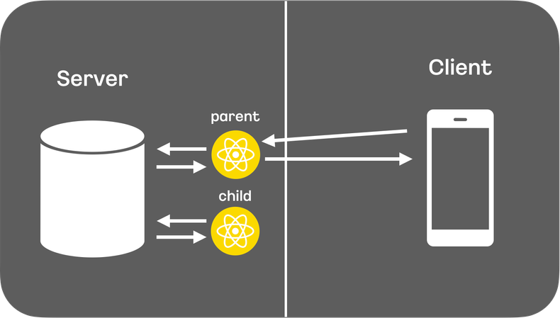

# 11장: Next.js 13과 리액트 18

## 11.1 app 디렉터리의 등장

Next.js 13 버전 이전까지 모든 페이지는 각각의 물리적으로 구별된 파일로 독립돼 있었고, 페이지 공통으로 무언가를 집어 넣을 수 있는 곳은 \_document와 \_app이 유일하다.

- \_document: 페이지에서 쓰이는 `<html>`과 `<body>` 태그를 수정하는 제한적인 용도로 사용된다. 오직 서버에서만 작동하므로 클라이언트 로직을 붙이는 것을 금지하고 있다.
- \_app: 페이지를 초기화하기 위한 용도로 사용되며, 다음과 같은 작업이 가능하다.
  - 공통 레이아웃
  - 페이지 변경 시 상태 유지
  - componentDidCatch를 활용한 에러 핸들링
  - 페이지간 추가적인 데이터 삽입
  - global CSS 주입

13 버전 이전까지 페이지 공통 레이아웃을 유지할 수 있는 방법은 \_app이 유일했다.
이는 각 페이지별로 서로 다른 레이아웃을 유지할 수 없는 단점이 생긴다.

### 라우팅

#### layout.js

Next.js 13부터는 app 디렉터리 내부의 폴더명이 라우팅이 되며, 이 폴더에 포함될 수 있는 파일명은 몇 가지로 제한돼 있다.

layout.js는 예약된 파일명 중 하나로 페이지의 기본적인 레이아웃을 구성하는 요소다.

해당 폴더에 layout이 있다면 그 하위 폴더에 모두 영향을 미친다.

layout은 주소별 공통 UI를 포함할 수 있을뿐만 아니라 \_app, \_document를 대신해 웹페이지를 시작하는 데 필요한 공통 코드를 삽입할 수도 있다.

또 다른 장점은 `<Html>`, `<Head />`처럼 Next.js에서 제공하는 태그를 사용하는 것이 아닌 HTML에서 기본으로 제공하는 태그를 사용해 좀 더 자연스럽게 코드를 작성할 수 있게 됐다.

#### page.js

page가 받는 props는 다음과 같다.

- params: 동적 라우트 파라미터를 사용할 경우 해당 파라미터에 값이 들어온다.
- searchParams: URL에서 `?a=1`과 같은 URLSearchParams를 의미한다.
  예를 들어 `?a=1&b=2`로 접근할 경우 searchParams에는 `{ a: "1", b: "2" }`라는 JS 객체 값이 오게 된다.

#### error.js

해당 라우팅 영역에서 사용되는 공통 에러 컴포넌트다.

error 페이지는 클라이언트 컴포넌트며,
`error:Error` 객체와 에러 바운더리를 초기화할 `reset: () => void`를 props로 받는다.

#### not-found.js

서버 컴포넌트이며, 특정 라우팅 하위의 주소를 찾을 수 없는 404 페이지를 렌더링할 때 사용된다.

#### loading.js

리액트 Suspense를 기반으로 해당 컴포넌트가 불러오는 중임을 나타낼 때 사용할 수 있다.

#### route.js

app 디렉터리가 정식으로 출시되면서 /pages/api와 동일하게 /app/api 지원도 추가됐다.

디렉터리가 라우팅 주소를 담당하며 파일명은 route.js로 통일됐다.

```ts
import { NextRequest } from "next/server";

export async function GET(request: NextRequest) {}

export async function HEAD(request: NextRequest) {}

export async function POST(request: NextRequest) {}

export async function PUT(request: NextRequest) {}

export async function DELETE(request: NextRequest) {}

export async function PATCH(request: NextRequest) {}

export async function OPTIONS(request: NextRequest) {}
```

route.ts 파일 내부에 REST API의 메서드명을 예약어로 선언해 두면
HTTP 요청에 맞게 해당 메서드를 호출하는 방식으로 작동한다.

이 route의 함수들이 받을 수 있는 파라미터는 다음과 같다.

- request: NextRequest 객체이며, fetch의 Request를 확장한 Next.js의 Request이다. 이 객체에서는 요청과 관련된 cookie, headers 등뿐만 아니라 nextUrl 같은 주소 객체도 확인할 수 있다.
- context: params만을 가지고 있는 객체이며, 동적 라우팅 파라미터 객체가 포함돼 있다.

```ts
// app/api/users/[id]/route.ts

export async function GET(
  request: NextRequest,
  context: { params: { id: string } }
) {
  const response = await fetch(
    `https://jsonplaceholder/typicode.com/users/${context.params.id}`
  );

  // ...

  return new Response(JSON.stringify(result), {
    status: 200,
    headers: {
      "content-type": "application/json",
    },
  });
}
```

## 11.2 리액트 서버 컴포넌트

**서버 컴포넌트 !== 서버 사이드 렌더링**

### 기존 리액트 컴포넌트와 서버 사이드 렌더링의 한계

1. **JS 번들 크기가 0인 컴포넌트를 만들 수 없다.**
   브라우저 환경에서 외부 라이브러리를 사용을 했을 때 이는 사용자 기기의 부담이 된다.
   만약 컴포넌트를 서버에서만 렌더링하고 클라이언트는 결과만 받는다면 외부 라이브러리를 다운로드하지 않더라도 사용자에게 보여주고 싶은 컴포넌트를 렌더링할 수 있을 것이다.
2. **백엔드 리소스에 대한 직접적인 접근이 불가능하다.**
   만약 클라이언트에서 데이터베이스에 직접 접근이 가능하다면 거쳐가는 단계가 하나 줄 것이다.
3. **자동 코드 분할이 불가능하다.**
   React.lazy로 코드 분할이 가능하지만 코드 분할이 서버에서 자동으로 수행된다면 더 좋을 것이다.
4. **연쇄적으로 발생하는 클라이언트와 서버의 요청을 대응하기 어렵다.**
   
   
5. **추상화에 드는 비용이 증가한다.**
   컴포넌트가 여러 개가 중첩되고 합성되어 복잡해 보일 수 있지만 서버에서 클라이언트로 전송되는 내용을 계산해서 내려준다면,
   클라이언트에서는 복잡한 작업을 하지 않아도 되고 서버에서 클라이언트로 전송되는 결과물 또한 가벼워질 것이다.
   코드 추상화에 따른 비용은 서버에서만 지불하면 된다.

결국 서버 사이드 렌더링은 정적 콘텐츠를 빠르게 제공하고, 서버에 있는 데이터를 손쉽게 제공할 수 있는 반면 사용자의 인터랙션에 따른 다양한 사용자 경험을 제공하긴 어렵다.

클라이언트 사이드 렌더링은 사용자의 인터랙션에 따라 다양한 것을 제공할 수 있지만 서버에 비해 느리고 데이터를 가져오는 것도 어렵다.

두 구조의 장점을 모두 취하고자 하는 것이 바로 리액트 서버 컴포넌트다.

### 서버 컴포넌트란?

서버 컴포넌트란 서버와 클라이언트 모두에서 컴포넌트를 렌더링할 수 있는 기법을 의미한다.
즉, 일부 컴포넌트는 클라이언트에서, 일부 컴포넌트는 서버에서 렌더링된다.

🛑 클라이언트 컴포넌트는 서버 컴포넌트를 import할 수 없다.
클라이언트 컴포넌트는 서버 컴포넌트를 실행할 방법이 없기 때문에 컴포넌트를 호출할 수 없다.

각각의 컴포넌트의 차이와 제약사항에 대해 알아보자.

- 서버 컴포넌트

  - 요청이 오면 서버에서 딱 한 번 실행되므로 상태를 가질 수 없다. (❌: useState, useReducer)
  - 한 번 렌더링되면 끝이기 때문에 렌더링 생명주기도 사용할 수 없다. (❌: useEffect, useLayoutEffect)
  - 서버에서만 실행되기 때문에 DOM API, window, document 등에 접근할 수 없다.
  - 서버에만 있는 데이터를 async/await으로 접근할 수 있다.

- 클라이언트 컴포넌트
  - 서버 컴포넌트를 불러올 수 없다.
  - 클라이언트가 서버 컴포넌트를 갖는 구조는 가능하다.

### 서버 사이드 렌더링과 서버 컴포넌트의 차이

#### 서버 컴포넌트

서버에서만 렌더링되고 클라이언트로 전송되지 않는 컴포넌트
(서버에서 처리된 결과만 클라이언트로 전송)

이는 클라이언트에서 JS 번들 크기를 줄이는 데 기여하고 로딩 시간을 단축시킨다.

#### 서버 사이드 렌더링

클라이언트에게 전송되기 전에 서버에서 HTML을 생성하는 기술

초기 페이지 로딩 시간을 단축시키고, SEO에 유리하다.

#### 차이점

서버 컴포넌트는 JS 번들 크기를 줄이는 데 중점을 두고 있고,
SSR은 초기 로딩 시간 단축과 SEO 최적화에 초점을 맞추고 있다.

또한 서버 컴포넌트는 서버에서 실행되므로 데이터 fetching과 같은 서버 사이드 로직을 처리하는데 유용하며, SSR은 클라이언트에게 빠르게 컨텐츠를 제공하는데 유리하다.

결론적으로 둘은 대체제가 아닌 상호보완하는 개념이다.

### 서버 컴포넌트는 어떻게 작동하는가?

1. 서버가 렌더링 요청을 받는다.
   서버가 렌더링 과정을 수행해야 하므로 리액트 서버 컴포넌트를 사용하는 모든 페이지는 항상 서버에서 시작된다.
2. 서버는 받은 요청에 따라 컴포넌트를 JSON으로 직렬화한다.
   이때 서버에서 렌더링할 수 있는 것은 직렬화해서 내보내고, 클라이언트 컴포넌트는 플레이스홀더 형식으로 비워두고 나타낸다.
3. 브라우저가 리액트 컴포넌트 트리를 구성한다.
   클라이언트 컴포넌트의 플레이스홀더를 만나면 클라이언트에서 렌더링을 진행할 것이고, 서버에서 만들어진 결과물을 받았다면 이 정보를 기반으로 리액트 트리를 만들 것이다.
   최종적으로 이 트리를 렌더링해 브라우저의 DOM에 커밋한다.

지금까지 살펴본 바를 토대로 리액트 서버 컴포넌트의 작동 방식의 특별한 점을 살펴보자.

1. 서버에서 클라이언트로 정보를 보낼 때 스트리밍 형태로 보냄으로써 클라이언트가 줄 단위로 JSON을 읽고 컴포넌트를 렌더링하여 사용자에게 빠르게 결과물을 보여줄 수 있다는 장점이 있다.
2. 컴포넌트들이 하나의 번들러 작업에 포함돼 있지 않고, 각 컴포넌트별로 번들링이 별개로 돼 있어 필요에 따라 컴포넌트를 지연해서 받거나 따로 받는 등의 작업이 가능해졌다.
3. SSR과는 다르게 결과물이 HTML이 아닌 JSON 형태로 보내진다.
   HTML 대신 단순한 리액트 컴포넌트 구조를 JSON으로 받아서 리액트 컴포넌트 트리의 구성을 최대한 빠르게 할 수 있도록 도와준다.

## 11.3 Next.js에서의 리액트 서버 컴포넌트

### 새로운 fetch 도입과 getServerSideProps, getStaticProps, getInitialProps의 삭제

서버 사이드 렌더링과 정적 페이지 제공을 위해 이용되던 getServerSideProps, getStaticProps, getInitialProps가 /app 디렉터리 내부에서는 삭제됐다.
그 대신 모든 데이터 요청은 웹에서 제공하는 표준 API인 fetch를 기반으로 이뤄진다.

서버 컴포넌트는 데이터가 불러오기 전까지 기다렸다가 데이터가 불러와지면 비로소 페이지가 렌더링되어 클라이언트로 전달될 것이다.

### 정적 렌더링과 동적 렌더링

Next.js 13에서는 정적인 라우팅에 대해서 빌드 타임에 렌더링을 미리 해두고, 동적인 라우팅에 대해서는 서버에 매번 요청이 올 때마다 컴포넌트를 렌더링하도록 하였다.

#### SSG

`fetch(URL, { cache: "force-cache" })` (기본값)

동적인 주소에 대해 캐싱하고 싶은 경우, 즉 getStaticPaths를 흉내 내고 싶다면 `generateStaticParams`를 사용한다.

```ts
export async function generateStaticParams() {
  return [{ id: "1" }, { id: "2" }, { id: "3" }, { id: "4" }];
}

async function fetchData(params: { id: string }) {
  const res = await fetch(`.../${params.id}`);
  const data = await res.json();
  return data;
}
```

#### SSR

`fetch(URL, { cache: "no-store" })`, `fetch(URL, { next: {revalidate: 0} })`

매번 새로운 데이터를 불러온다.

#### ISR

`fetch(URL, { next: { revalidate: 10 }})`

정해진 유효시간 동안 캐싱하고, 지나면 캐시를 파기한다.

### 스트리밍을 활용한 점진적인 페이지 불러오기

SSR은 요청받은 페이지를 모두 렌더링해서 내려줄 때까지는 사용자에게 아무것도 보여줄 수 없다.
그리고 다 받았다 하더라도 사용자가 인터랙션할 수 없는 정적인 페이지이고, 리액트에서 하이드레이션 과정을 거쳐야만 비로소 사용자가 사용할 수 있는 페이지가 된다.

문제는 이 모든 작업이 순차적으로 다 완료돼야만 페이지 하나를 온전하게 볼 수 있다는 것이다.

이를 해결하기 위해 HTML을 작은 단위로 쪼개서 완성되는 대로 클라이언트로 점진적으로 보내는 스트리밍이 도입됐다.
이를 통해 먼저 데이터가 로드되는 컴포넌트를 빠르게 보여주는 방법이 가능하다.

Suspense를 통해 스트리밍을 활용할 수 있다.

- loading.tsx 배치: 전체 page에 대해 Loading 컴포넌트를 보여준다.

```jsx
<Suspense fallback={<Loading />}>
  <Page />
</Suspense>
```

- Suspense 배치: 세분화된 제어를 할 때 직접 Suspense를 배치할 수 있다.

---

### 새로 알게된 개념

- route.ts
- 서버 컴포넌트와 서버 사이드 렌더링의 차이점
- 서버 컴포넌트의 작동 방식
- app 라우터의 SSG, SSR, ISR
- 스트리밍 개념

### 읽으면서 어려웠거나 이해가 잘 안됐던 부분

- 서버 컴포넌트의 내부 동작 방식이 어려웠습니다.
