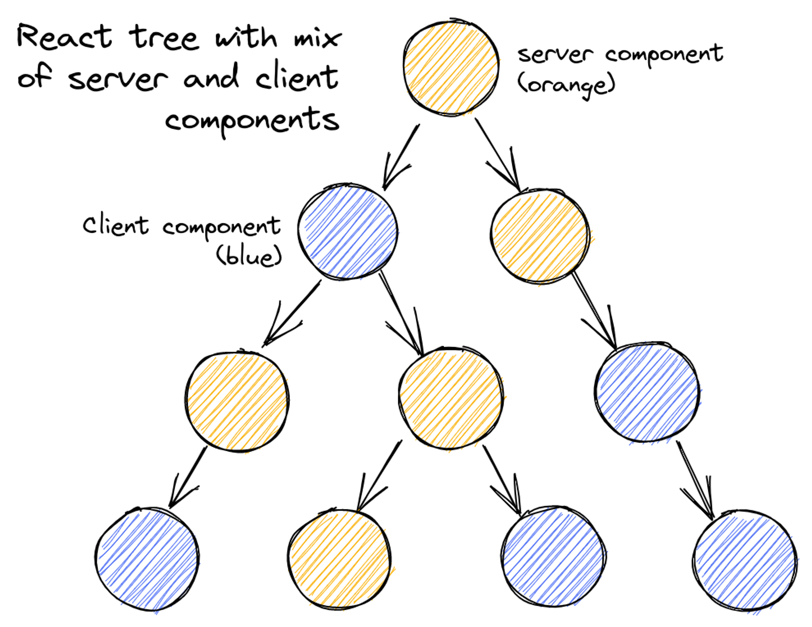

# [11장] Next.js 13과 리액트 18

- Next는 SSR 구조에 많은 변화가 있는 리액트 18을 채택함
- 기존 Next의 큰 약점이었던 레이아웃 지원을 본격적으로 지원하기 시작했고, 바벨을 대체할 러스트 기반 SWC를 뒤이어 웹팩을 대체할 Turbopack까지 출시했다.

| SWC       | Rust 기반의 빠른 JavaScript/TypeScript 컴파일러 |
| --------- | ----------------------------------------------- |
| Turbopack | Rust 기반의 새로운 번들러, Webpack의 대체       |

## 11.1 app 디렉터리의 등장

- document: 페이지에서 쓰이는 `<html>` , `<body>`태그를 수정하거나 서버 사이드 렌더링 시 styled-components 같은 일부 CSS-in-JS를 지원하기 위한 코드를 삽입하는 제한적인 용도로 사용된다. 오직 서버에서만 작동하므로 onClick 같은 이벤트 핸들러 또는 클라이언트 로직을 붙이는 것을 금지하고 있다.
- \_app: 페이지를 초기화하기 위한 용도로 사용됨.
  - 페이지 변경 시에 유지하고 싶은 레이아웃
  - 페이지 변경 시 상태 유지
  - componentDidCatch 를 활용한 에러 핸들링
  - 페이지간 추가적인 데이터 삽입
  - global CSS 주입

→ 12버전까지는 무언가 페이지 공통 레이아웃을 유지할 수 있는 방법은 \_app이 유일했다.

→ 이러한 레이아웃의 한계를 극복하기 위해 나온 것이 app 레이아웃

**✨라우팅**

**📍라우팅을 정의하는 법**

- Next 12 이하: `/pages/a/b.tsx` 또는 `/pages/a/b/index.tsx` 는 모두 동일한 주소로 변환된다.
- Next 13 app : `/app/a/b` 는 `/a/b` 로 변환되며 파일명은 무시된다. 폴더명까지만 주소로 변환된다.

**📍layout.js**

- 루트에 단 하나의 layout을 만들어 둘 수 있다.
- 모든 페이지에 영향을 미치는 공통 레이아웃
- \_app, \_doceument를 하나로 대체할 수 있음.

```jsx
// app/layout.js
export default function Layout({ children }) {
  return (
    <html lang="en">
      <body>
        <header>
          <h1>My Site Header</h1>
        </header>
        <main>{children}</main>
        <footer>
          <p>My Site Footer</p>
        </footer>
      </body>
    </html>
  )
}
```

**📍page.js**

- params: 옵셔널 값. […id]와 같은 동적 라우트 파라미터를 사용할 경우 해당 파라미터에 값이 들어온다.
- searchParams: URL에서 ?a=1과 같은 URLSearchParams를 의미한다.
  - 이 값은 layout에서는 제공되지 않는다.

**📍error.js**

- 해당 라우팅 영역에서 사용되는 공통 에러 컴포넌트
- 특정 라우팅별로 서로 다른 에러 UI를 렌더링하는 것이 가능하다.
- 에러정보를 담고 있는 error: Error객체와 에러 바운더리를 초기화할 reset: () ⇒ void를 props로 받는다.
- 에러바운더리는 클라이언트에서만 작동하므로 error 컴포넌트도 클라이언트 컴포넌트여야 한다.

```jsx
// app/error.js
'use client'

export default function ErrorPage({ error, reset }) {
  return (
    <div>
      <h1>Something went wrong!</h1>
      <p>{error.message}</p>
      <button onClick={() => reset()}>Try Again</button>
    </div>
  )
}
```

**📍not-found.js**

- 특정 라우팅 하위의 주소를 찾을 수 없는 404 페이지 렌더링.

**📍loading.js**

- Suspense를 기반으로 해당 컴포넌트가 불러오는 중임을 나타낼 때
- “use client” 지시자를 사용해 클라이언트에서 렌더링되게 할 수도 있다.

**📍route.js**

```jsx
export async function GET(request: Request) {}

export async function HEAD(request: Request) {}

export async function POST(request: Request) {}

export async function PUT(request: Request) {}

export async function DELETE(request: Request) {}

export async function PATCH(request: Request) {}

// 'OPTIONS'가 정의되지 않은 경우 Next.js는
// 자동으로 'OPTIONS'를 구현하고 루트 핸들러에 정의된 다른 방법에 따라
// 적절한 응답 'Allow' 헤더를 설정합니다.
export async function OPTIONS(request: Request) {}
```

```jsx
// app/api/your-route/route.js

export async function GET(request: Request) {
  // GET 요청 처리
  return new Response(JSON.stringify({ message: 'GET request received!' }), {
    status: 200,
    headers: {
      'Content-Type': 'application/json',
    },
  })
}

export async function HEAD(request: Request) {
  // HEAD 요청 처리
  return new Response(null, {
    status: 200,
    headers: {
      'Custom-Header': 'Value',
    },
  })
}

export async function POST(request: Request) {
  const data = await request.json()
  // POST 요청 데이터 처리
  return new Response(JSON.stringify({ message: 'User created!', data }), {
    status: 201,
  })
}

export async function PUT(request: Request) {
  const data = await request.json()
  // PUT 요청 데이터 업데이트 처리
  return new Response(JSON.stringify({ message: 'User updated!', data }), {
    status: 200,
  })
}

export async function DELETE(request: Request) {
  // DELETE 요청 처리
  return new Response(JSON.stringify({ message: 'User deleted!' }), {
    status: 204,
  })
}

export async function PATCH(request: Request) {
  const data = await request.json()
  // PATCH 요청 데이터 일부 업데이트 처리
  return new Response(JSON.stringify({ message: 'User patched!', data }), {
    status: 200,
  })
}

// OPTIONS 메서드는 명시적으로 정의하지 않아도 Next.js가 자동으로 구현
export async function OPTIONS(request: Request) {
  return new Response(null, {
    status: 204,
    headers: {
      Allow: 'GET,HEAD,POST,PUT,DELETE,PATCH,OPTIONS',
    },
  })
}
```

- route.ts 파일 내부에 REST API 의 get, post, 와 같은 메서드명을 예약어로 선언해두면 HTTP 요청에 맞게 해당 메서드를 호출하는 방식으로 작동한다.

| request | 클라이언트의 요청 정보를 담고 있는 객체       |
| ------- | --------------------------------------------- |
| context | 핸들러에 대한 추가 정보 (예: URL 파라미터 등) |

## 11.2 리액트 서버 컴포넌트

**✨기존 리액트 컴포넌트와 서버 사이드 렌더링의 한계**

- 리액트의 모든 컴포넌트는 클라이언트에서 작동하며, 브라우저에서 자바스크립트 코드 처리가 이뤄진다.
- SSR은 미리 서버에서 DOM을 만들어 오고, 클라이언트에서는 이렇게 만들어진DOM을 기준으로 하이드레이션을 진행한다. 이후 브라우저에서는 상태를 추적하고, 이벤트 핸들러를 DOM에 추가하고, 응답에 따라 렌더링 트리를 변경하기도 한다.

기존 SSR의 단점

- 자바스크립트 번들 크기가 0인 컴포넌트를 만들 수 없다.
- 백엔드 리소스에 대한 직접적인 접근이 불가능하다.
- 자동 코드 분할이 불가능하다.
- 연쇄적으로 발생하는 클라이언트와 서버의 요청에 대응하기 어렵다.
- 추상화에 드는 비용이 증가한다.

→ 모든 문제는 리액트가 클라이언트 중심으로 돌아가기 때문에 발생하는 문제

**→ 서버 사이드 렌더링과 클라이언트 사이드 렌더링 두 구조의 장점을 모두 취하고자 하는 것이 리액트 서버 컴포넌트임!!!**

**✨서버 컴포넌트란?**

- 하나의 언어, 하나의 프레임워크, 하나의 API와 개념을 사용하면서 서버와 클라이언트 모두에서 컴포넌트를 렌더링할 수 있는 기법
- 서버에서 할 수 있는 일은 서버가 처리하게 두고, 서버가 할 수 없는 나머지 작업은 클라이언트인 브라우저에서 수행된다. (클라이언트 컴포넌트는 서버컴포넌트를 import 못함!)



- 서버 컴포넌트
  - 서버 컴포넌트요청이 올 때 서버에서 딱 한 번만 실행되므로 상태를 가질 수 없다.
  - 서버에서만 실행되기 때문에 DOM API, window, document 등에 접근 X
  - 다른 서버 컴포넌트를 렌더링하거나, 클라이언트 컴포넌트, html 요소 렌더링을 렌더링할 수 있다.
- 클라이언트 컴포넌트
  - 클라이언트 컴포넌트브라우저 환경에서만 실행되므로 서버 컴포넌트, 서버 전용 훅, 유틸리티를 불러올 수 없다.
  - 클라이언트 컴포넌트가 자식으로 서버 컴포넌트를 갖는 구조는 가능하다.
  - 공통 컴포넌트서버와 클라이언트 모두에서 사용할 수 있다.
- 리액트는 모든 것을 다 공용 컴포넌트로 판단한다. 즉, 모든 컴포넌트를 다 서버에서 실행 가능한 것으로 분류한다. 대신, 클라이언트 컴포넌트라는 것을 명시하려면 'use client'라고 작성하기!

**✨서버 사이드 렌더링과 서버 컴포넌트의 차이**

- SSR은 응답받은 페이지 전체를 HTML로 렌더링하는 과정을 서버에서 수행한 후 그 결과를 클라이언트에 내려준다.
- SSR의 목저은 초기에 인터랙션은 불가능하지만 정적인 HTML을 빠르게 내려주는 데 초점을 두고 있다.
- 서버 사이드 렌더링과 서버 컴포넌트를 모두 채택하는 것도 가능해질 것이다!!
  - 서버 컴포넌트를 활용해 서버에서 렌더링할 수 있는 컴포넌트는 서버에서 완성해서 제공받은 다음, 클라이언트 컴포넌트는 서버 사이드 렌더링으로 초기 HTML으로 빠르게 전달 받을 수 있다.
  - **이 두 가지 방법을 결합하면 클라이언트 및 서버 컴포넌트를 모두 빠르게 보여줄 수 있고, 동시에 클라이언트에서 내려받아야 하는 자바스크립트의 양도 줄어들어 브라우저의 부담을 덜 수도 있다.**

**✨서버 컴포넌트는 어떻게 작동하는가?**

```jsx
// app/server-component.js
import React from 'react'

// 서버에서만 실행되므로 서버에서 데이터를 패칭할 수 있음
export default async function ServerComponent() {
  const data = await fetch('https://api.example.com/data').then((res) =>
    res.json()
  )

  return (
    <div>
      <h1>Server Component</h1>
      <p>Data fetched from server: {data.message}</p>
    </div>
  )
}
```

## 11.3 Next.js에서의 **리액트 서버 컴포넌트**

**✨새로운 fetch 도입과 getServerSideProps, getStaticProps, getInitialPRops의 삭제**

- 과거 Next의 서버 사이드 렌더링과 정적 페이지 제공으 ㄹ위해 이용되던 getServerSideProps, getStaticProps, getInitialProps가 /app 디렉터리 내부에서는 삭제됐다.
- 그 대신 모든 데이터 요청은 웹에서 제공하는 표준 API 인 fetch를 기반으로 이뤄진다.

**✨정적 렌더링과 동적 렌더링**

- 과거 Next에는 getStaticProps를 활용해 서버에서 불러오는 데이터가 변경되지 않는 경우에 정적으로 페이지를 만들어 제공할 수 있는 기능이 있었다.

**정적 렌더링**

- 데이터가 변경되지 않을 때, 한 번의 빌드 타임에 페이지를 생성하여 서버에 저장하고, 요청 시 마다 동일한 HTML을 제공하는 방식

```jsx
// app/page.js
import React from 'react'

// 정적 데이터를 패칭하여 정적 HTML을 생성
export default async function HomePage() {
  const res = await fetch('https://api.example.com/static-data')
  const data = await res.json()

  return (
    <div>
      <h1>Home Page</h1>
      <p>Data: {data.message}</p>
    </div>
  )
}
```

**동적 렌더링**

- 각 요청 시마다 서버에서 데이터를 패칭하고 페이지를 렌더링하는 방식

```jsx
// app/page.js
import React from 'react'

// 동적 데이터를 패칭하여 각 요청 시마다 새롭게 HTML을 생성
export default async function HomePage() {
  const res = await fetch('https://api.example.com/dynamic-data', {
    cache: 'no-store', // 매 요청마다 새로운 데이터를 패칭
  })
  const data = await res.json()

  return (
    <div>
      <h1>Home Page</h1>
      <p>Data: {data.message}</p>
    </div>
  )
}
```

**✨캐시와 mutating, 그리고 revalidating**

**fetch의 기본 작동을 재정의해 해당 데이터의 유효한 시간(revalidate값)을 정해두고 이 시간이 지나면 다시 데이터를 불러와서 페이지를 렌더링하는 것이 가능하다.**

```jsx
export const revalidate = 60
```

[캐시와 갱신이 이뤄지는 과정]

1. 최초로 해당 라우트로 요청이 올 때는 미리 정적으로 캐시해 둔 데이터를 보여준다.
2. 이 캐시된 초기 요청은 revalidate에 선언된 값만큼 유지된다.
3. 만약 해당 시간이 지나도 일단은 캐시된 데이터를 보여준다.
4. Next.js는 캐시된 데이터를 보여주는 한편, 시간이 경과했으므로 백그라운드에서 다시 데이터를 불러온다.
5. 4번의 작업이 성공적으로 끝나면 캐시된 데이터를 갱신하고, 그렇게 않다면 과거 데이터를 보여준다.

- 이러한 캐시를 전체적으로 무효화하고 싶다면 router에 추가된 refresh 메서드로 router.refresh()를 사용하면 된다.

**✨스트리밍을 활용한 점진적인 페이지 불러오기**

- 하나의 페이지가 다 완성될 때까지 기다리는 것이 아니라 HTML을 작은 단위로 쪼개서 완성되는 대로 클라이언트로 점진적으로 보내는 스트리밍이 도입됐다.
- 스트리밍을 활용하면 모든 데이터가 로드될 때까지 기다리지 않더라도 먼저 데이터가 로드되는 컴포넌트를 빠르게 보여주는 방법이 가능하다.
- 최초 바이트까지의 시간 (TTFB: Time To First Byte)과 최초로 콘텐츠 풀 페인팅 (FCP: First Contetnful Paint)을 개선하는 데 큰 도움을 준다.

[스트리밍 활용 방법]

1. 경로에 loading.tsx 배치
2. Suspense 배치

```jsx
// app/dashboard/page.tsx
import React, { Suspense } from 'react'
const DashboardContent = React.lazy(() => import('./DashboardContent'))

export default function DashboardPage() {
  return (
    <div>
      <h1>Dashboard</h1>
      <Suspense fallback={<Loading />}>
        <DashboardContent />
      </Suspense>
    </div>
  )
}
```

## 11.4 웹팩의 대항마, 터보팩의 등장 (beta)

- Rome, SWC, esbuild의 공통점은 기존에 자바스크립트로 만들어지고 제공되던 기능을 Rust나 Go 같은 다른 언어를 사용해 제공함으로써 자바스크립트 대비 월등히 뛰어난 성능을 보여준다.
- 터보팩: 러스트 기반이라 웹팩 대비 최대 700배, Vite 대비 최대 10배 빠르다.

## 11.5 서버 액션 (alpha)

- API를 굳이 생성하지 않더라도 함수 수준에서 서버에 직접 접근해 데이터 요청 등을 수행할 수 있는 기능
- 서버컴포넌트와 다르게 특정 함수 실행 그 자체만을 서버에서 수행할 수 있다.
- **함수 내부 또는 파일 상단에 “use server” 지시자를 선언해야 한다. + 함수는 반드시 async!!**

**✨form의 action**

- `<form/>` 은 HTML에서 양식을 보낼 때 사용하는 태그.
- action props를 추가해서 이 양식 데이터를 처리할 URI를 넘겨줄 수 있다.

```jsx
// app/actions.js

// 폼 데이터를 처리하는 서버 액션 함수
export async function handleSubmit(formData) {
  // 폼 데이터에서 특정 필드 값 가져오기
  const name = formData.get('name')
  const email = formData.get('email')

  // 서버에서 처리할 로직 (예: 데이터베이스에 저장)
  console.log('Name:', name)
  console.log('Email:', email)

  // 처리 후 클라이언트에 반환할 결과
  return { success: true }
}
```

[server mutation으로 실행할 수 있는 함수]

- redirect: 특정 URL로 리디렉션

```jsx
import { redirect } from 'next/navigation'

export async function handleSubmit(formData) {
  const success = await processFormData(formData)

  if (success) {
    // 처리 성공 시, 다른 페이지로 리디렉션
    redirect('/success')
  } else {
    // 처리 실패 시, 에러 페이지로 리디렉션
    redirect('/error')
  }
}

async function processFormData(formData) {
  // 폼 데이터 처리 로직
  return true
}
```

- revalidatePath: 특정 경로의 페이지를 다시 검증(revalidate)한다. Incremental Static Regeneration(ISR)과 함께 사용되어 정적 페이지를 최신 데이터로 다시 생성한다.

```jsx
import { revalidatePath } from 'next/cache'

export async function updateData(data) {
  await saveDataToDatabase(data)

  // 데이터 업데이트 후 특정 경로 다시 검증
  revalidatePath('/some-path')
}

async function saveDataToDatabase(data) {
  // 데이터베이스 저장 로직
}
```

- revalidateTag: 특정 태그에 속한 모든 경로를 다시 검증한다. 태그를 기반으로 여러 경로를 그룹화하고, 특정 이벤트 발생 시 이들 경로를 모두 다시 검증하는 데 사용된다.

```jsx
import { revalidateTag } from 'next/cache'

export async function handleEvent(eventData) {
  await processEvent(eventData)

  // 이벤트 처리 후 특정 태그에 속한 모든 경로 다시 검증
  revalidateTag('some-tag')
}

async function processEvent(eventData) {
  // 이벤트 처리 로직
}
```

- 태그를 추가해 두면 여러 다양한 fetch 요청을 특정 태그 값으로 구분할 수 있고, revalidateTag를 사용할 경우 이 특정 태그가 추가된 fetch 요청을 모두 초기화 한다.

```jsx
// 특정 태그를 추가하여 fetch 요청
async function fetchData() {
  const data = await fetch('https://api.example.com/data', {
    next: { tags: ['example-tag'] },
  })
  return data.json()
}
```

**✨input의 submit과 image의 formAction**

`input type="submit"` `input type="image"` 에 formAction props으로도 서버 액션을 추가할 수 있다.

**✨startTransition과의 연동**

- useTransition에서 제공하는 startTransition에서도 서버 액션을 활용할 수 있다.

```jsx
// app/actions.js

export async function handleSubmit(formData) {
  const name = formData.get('name')
  const email = formData.get('email')

  // 데이터 처리 로직 (예: 데이터베이스에 저장)
  console.log('이름:', name)
  console.log('이메일:', email)

  return { success: true }
}
```

```jsx
// app/page.js
import React, { useState, useTransition } from 'react'
import { handleSubmit } from './actions'

export default function ContactForm() {
  const [status, setStatus] = useState(null)
  const [isPending, startTransition] = useTransition()

  const onSubmit = async (event) => {
    event.preventDefault()
    const formData = new FormData(event.target)

    startTransition(async () => {
      const result = await handleSubmit(formData)
      setStatus(result.success ? '폼 제출 성공!' : '폼 제출 실패.')
    })
  }

  return (
    <div>
      <h1>문의 양식</h1>
      <form onSubmit={onSubmit}>
        <label>
          이름:
          <input type="text" name="name" required />
        </label>
        <br />
        <label>
          이메일:
          <input type="email" name="email" required />
        </label>
        <br />
        <button type="submit" disabled={isPending}>
          {isPending ? '제출 중...' : '제출'}
        </button>
      </form>
      {status && <p>{status}</p>}
    </div>
  )
}
```

- useTransition을 사용하면 이전과 동일한 로직을 구현하면서도 page단위의 loading.jsx를 사용하지 않아도 된다는 것이다.
- isPending을 활용해 startTransition으로 서버 액션이 실행됐을 때 해당 버튼을 숨기고 로딩 버튼을 노출함으로써 페이지 단위의 로딩이 아닌 좀 더 컴포넌트 단위의 로딩 처리도 가능해진다.

**✨server mutation이 없는 작업**

- 별도의 server mutation을 실행하지 않는다면 바로 이벤트 핸들러에 넣어도 된다.

**✨서버 액션 사용 시 주의할 점**

- 서버 액션은 클라이언트 컴포넌트 내에서 정의될 수 없다. 클라이언트 컴포넌트에서 서버 액션을 쓰고 싶을 때는 앞의 startTransition 예제처럼 ‘use server’로 서버 액션만 모여 있는 파일을 별도로 import 해야 한다.

## 11.6 그 밖의 변화

13.0 → 13.4

- 전체 라우트에서 쓸 수 있는 미들웨어 강화
- SEO를 쉽게 작성할 수 있는 기능 (Head에 메타태그 넣기…)
- 정적으로 내부 링크를 분석할 수 있는 기능

## 11.7 Next.js 13 코드 맛보기

**✨getServerSideProps와 비슷한 서버 사이드 렌더링 구현해보기**

- Next 13과 리액트 18에서는 서버 컴포넌트라면 어디든 서버 관련 코드를 추가할 수 있게 됐다.
- 서버 컴포넌트에서 fetch를 수행하고, 이 fetch에 별다른 cache 옵션을 제공하지 않는다면 getServerSideProps와 매우 유사하게 작동한다.

```jsx
// app/products/page.js
import React from 'react'

export default async function ProductsPage() {
  // 서버에서 데이터를 가져옴 (캐시 옵션 없이)
  const res = await fetch('https://api.example.com/products')
  const products = await res.json()

  return (
    <div>
      <h1>제품 목록</h1>
      <ul>
        {products.map((product) => (
          <li key={product.id}>{product.name}</li>
        ))}
      </ul>
    </div>
  )
}
```

과거 getServerSideProps를 사용하는 애플리케이션에서는 `<script id="__NEXT_DATA__" type="applocation/json">` 라고 하는 특별한 태그가 추가돼 있었고, 이 서버에서 미리 만들어진 정보를 바탕으로 클라이언트에서 하이드레이션을 수행했었다.

리액트 18에서는 서버 컴포넌트에서 렌더링한 결과를 직렬화가능한 (JSON.stringify가 가능한) 데이터로 클라이언트에 제공하고, 클라이언트는 이를 바탕으로 하이드레이션을 진행한다.

**✨getStaticProps와 비슷한 정적인 페이지 렌더링 구현해 보기**

- Next13 전까지는 정적 페이지 생성을 위해 getStaticProps나 getStaticPaths를 이용해 사전에 미리 생성 가능한 경로를 모다운 다음, 이 경로에 대해 내려줄 props를 미리 빌드하는 형식으로 구성돼 있었다.
- 이러한 방법은 헤드리스 CMS같이 사용자 요청에 앞서 미리 빌드해둘 수 있는 페이지를 생성하는 데 매우 효과적이었다.
- 13에서 app이 생겨나면서 getStaticProps와 getStaticPaths는 사라졌지만 이와 유사한 방식을 fetch의 cache를 이용해 구현할 수 있다.

> ❓ **헤드리스 CMS** <br/>
> 콘텐츠 관리 시스템의 일종으로, 전통적인 CMS와는 달리 프론트엔드와 백엔드가 분리되어 있는 구조. 콘텐츠는 API를 통해 전달되며, 다양한 플랫폼과 디바이스에서 사용할 수 있도록 설계되었다.

```jsx
// app/ssg/[id]/page.js
export async function generateStaticParams() {
  const res = await fetch('https://api.example.com/posts')
  const posts = await res.json()

  return posts.map((post) => ({
    id: post.id.toString(),
  }))
}

export default async function PostPage({ params }) {
  // params에서 id를 가져와 fetchPostById 호출
  const data = await fetchPostById(params.id)

  return (
    <div>
      <h1>{data.title}</h1>
      <p>{data.content}</p>
    </div>
  )
}
```

- generateStaticParams를 사용해 주소인 `/app/ssg/[id]` 에서 [id]로 사용 가능한 값을 객체 배열로 모아뒀다.
- page 컴포넌트에서는 이 각각의 id를 props로 받을 때 어떻게 작동할지 미리 정해뒀더,
- fetchPostById

[Next에서 사용하는 fetch에서 줄 수 있는 cache 옵션]

- force-cache: 캐시가 존재한다면 해당 캐시 값을 반환하고, 캐시가 존재하지 않으면 서버에서 데이터를 불러와 가져옴 (기본값)
- no-store: 캐시를 절대 사용하지 않고, 매 요청마다 새롭게 값을 불러옴.

**✨로딩, 스트리밍, 서스펜스**

- Next 13에서는 스트리밍과 리액트의 서스펜스를 활용해 컴포넌트가 렌더링 중이라는 것을 나타낼 수 있다.
- 직접 suspense로 감싸 부분적으로 로딩을 보여주는 것 외에도 기본적으로 loading이라고 하는 파일 예약어를 지원하면서 손쉽게 로딩 라우팅별로 로딩 상태를 나타낼 수 있도록 제공한다.

## 참고

- https://www.plasmic.app/blog/how-react-server-components-work#what-are-react-server-components
- https://reactnext-central.xyz/blog/nextjs/server-action (강추)
- [https://mingeesuh.tistory.com/entry/NEXTjs-SEO-처리하기-feat-Head-meta-태그](https://mingeesuh.tistory.com/entry/NEXTjs-SEO-%EC%B2%98%EB%A6%AC%ED%95%98%EA%B8%B0-feat-Head-meta-%ED%83%9C%EA%B7%B8)
