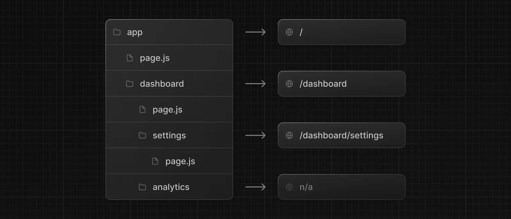
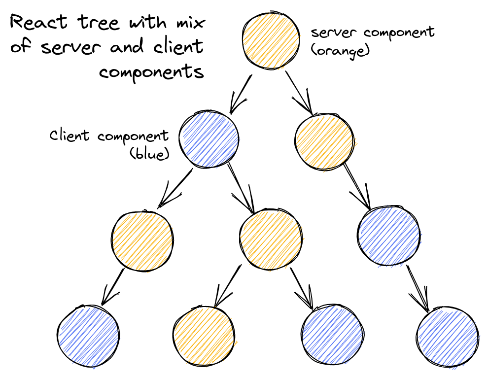

# 11장 Next.js 13과 리액트18

## 11.1 app 디렉터리의 등장

- Next.js 12 버전
  - 각 페이지들이 물리적으로 구별된 파일로 독립되어 있음
  - 네비게이션바처럼 몇몇 페이지에 걸쳐져 사용되는 컴포넌트들을 넣을 수 있는 파일은 \__document,\_app이 유일함_
  - \__document :_ html, body 태그를 수정하거나 스타일 컴포넌트 사용을 위한 코드 삽입 등 서버에서만 작동하기에 클라이언트 로직 X
  - _\_app_ : 페이지를 초기화하기 위한 용도로 사용
    - 페이지 변경 시 유지하고 싶은 레이아웃
    - 페이지 변경 시 상태 유지
    - global CSS 주입
    - 페이지 간 추가적인 데이터 삽입
    - componentDidcatch를 활용한 에러 핸들링
- 페이지별 서로 다른 레이아웃 유지하는 한계 → app 레이아웃 등장

### 11.1.1 라우팅

- /pages 라우팅 방식 → /app 디렉토리로 변경

**📍 라우팅을 정의하는 법**



- Next.js 12 이하 : /pages/a/b.tsx = /pages/a/b/index.tsx 동일
- Next.js 13 app : 파일명은 무시되며 폴더명까지만 주소로 변환

**📍layout.js**

- 페이지의 기본적인 레이아웃을 구성하는 파일
- 레이아웃 이외의 다른 목적으로 사용불가
- 루트에는 단 하나의 layout 만 가능
- 루트의 layout은 페이지 전체에 적용되는 공통 레이아웃
- 각 폴더 하위에 있는 layout은 해당 주소에서만 적용됨
- children을 props로 받아서 렌더링. 그려야 할 컴포넌트를 외부에서 주입
- API 요청과 같은 비동기 작업 수행
- layout 내부에 export defalut 컴포넌트 있어야 함

**📍page.js**

- 페이지 의미 , 예약어
- page가 받는 props
  - params : [id] 처럼 동적 라우트 파라미터 사용하는 경우 해당 파라미터에 값이 들어옴
  - searchParams : URL에서 ?a=1&b=2 과 같은 URLSearchParams를 의미 { a: ’1’, b: ‘2’ },
    - layout에서는 제공되지 않음
    - layout은 페이지 탐색 중에는 리렌더링을 수행하지 않기 때문
- page 규칙
  - export defalut로 내보내는 컴포넌트 있어야 함

**📍error.js**

- 해당 라우팅 영역에서 사용되는 공통 에러 컴포넌트
- 서로 다른 에러 UI 를 렌더링하는 것이 가능해짐
- 에러 바운더리는 클라이언트에서만 작동하므로 error 컴포넌트는 클라이언트 컴포넌트여야 함
- 같은 루트의 layout 에서 에러가 발생하면 해당 error 컴포넌트로 이동하지 않음
  - layout에서 발생하는 에러 처리하고 싶으면 상위 컴포넌트의 error나 app/global-error.js 사용

**📍not-found.js**

- 특정 라우팅 하위의 주소를 찾을 수 없는 404 페이지
- 전체 애플리케이션의 404는 app/not-found.js

**📍loading.js**

- Suspense를 기반으로 해당 컴포넌트가 불러오는 중임을 나타날 때 사용

**📍route.js**

- /app/api 를 기준으로 디렉터링 라우팅 지원
- 디렉터리가 라우팅 주소를 담당 파일명은 route.js
- HTTP 요청에 맞게 해당 메서드를 호출하는 방식으로 작동
- route.ts가 존재하는 폴더 내부에는 page.tsx 존재할 수 없음

```tsx
import { NextRequest } from "next/server";
export async function GET(request: Request) {}

export async function HEAD(request: Request) {}

export async function POST(request: Request) {}

export async function PUT(request: Request) {}

export async function DELETE(request: Request) {}

export async function PATCH(request: Request) {}

// If `OPTIONS` is not defined, Next.js will automatically implement `OPTIONS` and  set the appropriate Response `Allow` header depending on the other methods defined in the route handler.
export async function OPTIONS(request: Request) {}
```

- route 함수들이 받을 수 있는 파라미터
  - `request`
    - NextRequest의 객체
    - fetch의 리퀘스트를 확장한 next.js만의 리퀘스트
    - API 요청과 관련한 cookie,headers 객체 존재
  - `context`
    - params만을 가진 객체
    - 동적 라우팅 파라미터 객체임
    ```tsx
    // app/dashboard/[team]/route.ts
    type Params = {
      team: string;
    };

    export async function GET(request: Request, context: { params: Params }) {
      const team = context.params.team; // '1'
    }

    // Define params type according to your route parameters (see table below)
    ```

## 11.2 리액트 서버 컴포넌트

### 11.2.1 기존 리액트 컴포넌트와 서버 사이드 렌더링의 한계

- 리액트의 컴포넌트는 클라이언트에서 작동
- 브라우저에서 JS 코드 처리가 이뤄짐
- 반면 SSR은 ?
  - 서버에서 DOM을 만들어 오고 클라이언트에서는 받은 DOM을 기준으로 하이드레이션 진행
  - 이후 브라우저에서 상태를 추적하고, 이벤트 핸들러를 추가하기도 함
- 한계점
  1. JS 번들 크기가 0인 컴포넌트를 못 만듦
  - HTML에 위험한 태그를 제거하기 위한 라이브러리 sanitize-html를 사용하는 경우
  - 무거운 라이브러리이기에 사용자 기기의 부담
  - 만약 서버에서만 렌더링하고 클라이언트가 결과만 받으면 클라이언트는 무거운 라이브러리를 다운받지 않아도 렌더링 가능
  ```tsx
  import sanitizenHtml from "sanitize-html";

  function Board({ text }: { text: string }) {
    const html = useMemo(() => sanitizeHtml(text), [text]);

    return <div dangerouslySetInnerHtml={{ __html: html }} />;
  }
  ```
  1. 백엔드 리소스에 대한 직접적인 접근이 불가능
  - 백엔드 데이터에 접근하려면 API 요청을 통해 접근
  - 만약 직접 백엔드 (DB)에 접근해서 원하는 데이터를 가져올 수 있다면 ?
  1. 자동 코드 분할이 불가능
  - 코드 분할 : 거대한 코드 번들 대신, 코드를 여러 작은 단위로 나누어 필요할 때만 동적으로 지연 로딩함으로서 앱을 초기화하는 속도를 높여주는 기법
  - lazy 활용해 이를 구현 but 일일이 lazy로 감싸야 함, 누락하는 경우 발생
  - 컴포넌트가 호출되고 if문으로 판단하기 전까지 어떤 지연 로딩한 컴포넌트를 불러올지 결정 불가
  - 이 코드 분할을 서버에서 자동으로 수행해 준다면 ??
  1. 연쇄적으로 발생하는 클라이언트와 서버의 요청을 대응하기 어려움
  - 최초 컴포넌트의 요청과 렌더링이 끝나기 전까지 하위 컴포넌트의 요청과 렌더링이 끝나지 않는다는 단점
  - 그만큼 서버에 요청하는 횟수도 증가
  - 부모 컴포넌트 결과물에 의존하는 문제
  1. 추상화에 드는 비용 증가
- SSR은 정적 콘텐츠를 빠르게 제공하고, 서버에 있는 데이터를 쉽게 제공하지만 사용자의 인터렉션에 따른 다양한 사용자 경험을 제공하긴 어려움
- CSR은 서버에 비해 느리고 데이터를 가져오는 것도 어려움
- 이 둘의 장점을 취하고자 하는 것이 리액트 서버 컴포넌트

### 11.2.2 서버 컴포넌트란 ?

- 서버 컴포넌트란 하나의 프레임워크, 하나의 API와 개념을 사용하면서 서버와 클라이언트 모두에서 컴포넌트를 렌더링할 수 있는 기법
- 서버,클라이언트에서 각각 렌더링되는 것
- ✨ 클라이언트 컴포넌트는 서버 컴포넌트를 import할 수 없음
- 클라이언트 컴포넌트는 서버 컴포넌트를 실행할 방법이 없기 때문



- 모든 컴포넌트는 서버 컴포넌트가 될 수도 있고 클라이언트 컴포넌트가 될 수도 있음
- 서버 컴포넌트
  - 요청이 오면 그 순간 서버에서 한 번 실행되기 때문에 상태를 가질 수 없음
  - useState,useReducer등 사용 X
  - 렌더링 생명주기 사용 X - 한 번 렌더링되기 때문
  - effect나 state에 의존하는 커스텀 훅도 사용 불가 , 서버에서 제공할 수 있는 기능만 있다면 가능
  - DOM API나 window, document 등에 접근 불가
  - DB, 내부 서비스, 파일 시스템 등 서버에만 있는 데이터를 async,await 으로 접근 가능
  - 클라이언트 컴포넌트, div 태그 , 다른 서버 컴포넌트 등을 렌더링 할 수 있다
- 클라이언트 컴포넌트
  - 브라우저에서만 실행되므로 서버 컴포넌트나 서버 전용 훅, 유틸리티 불러올 수 없음
  - 클라이언트 컴포넌트가 자식으로 서버 컴포넌트를 갖는 구조는 가능, 서버 컴포넌트는 이미 서버에서 만들어진 트리를 주고 클라이언트 컴포넌트는 그 트리를 삽입해서 보여주기 때문
  - 서버 컴포넌트와 클라이언트 컴포넌트를 중첩해서 갖는 위와 같은 구조 가능
- 공용 컴포넌트
  - 서버와 클라이언트에서 모두 사용
- 리액트는 클라이언트와 서버 컴포넌트를 어떻게 구분할까 ?
- 명시적으로 선언하면 파일 최상단에 ‘use client’ or ‘use server’

### 11.2.3 서버 사이드 렌더링과 서버 컴포넌트의 차이

- SSR
  - 응답받은 페이지 전체를 HTML 로 렌더링하는 과정을 서버에서 수행한 후 그 결과를 클라이언트에게 내려줌
  - 이후 클라이언트에서 받은 결과에 하이드레이션 과정을 거침
  - 목적 : 초기에 인터렉션은 불가능하나, 정적인 HTML 을 빠르게 내려줌
  - 초기 HTML이 로딩된 이후에는 클라이언트에서 JS를 다운,파싱,실행
- 서버 컴포넌트를 활용해 서버에서 렌더링할 수 있는 컴포넌트는 서버에서 받고, 클라이언트 컴포넌트는 SSR로 초기 HTML으로 빠르게 전달 받음

### 11.2.4 서버 컴포넌트는 어떻게 작동하는가 ?

- 작동 과정
  - 서버가 렌더링 요청을 받음
  - 서버 컴포넌트를 사용하는 모든 페이지는 서버에서 시작 즉,루트에 있는 컴포넌트는 항상 서버 컴포넌트
  - 서버는 서버 컴포넌트를 JSON으로 직렬화, 클라이언트 컴포넌트는 해당 공간을 플레이스홀더 형식으로 비워두고 나타냄
    - @1 : 나중에 렌더링이 완료됐을 때 들어가야 할 컴포넌트 , 서버에서는 클라이언트에서 리액트 컴포넌트 트리 구성에 필요한 정보를 최대한 많이, 경제적인 포맷으로 전달
  - 브라우저는 이 결과물을 받아 다시 역직렬화한 다음 렌더링 수행
    - 리액트 컴포넌트 트리를 구성, 브라우저가 서버로 스트리밍으로 JSON 결과물을 받으면 이걸 다시 파싱한 결과물을 바탕으로 트리 재구성해서 컴포넌트 만들어 나감
    - 최종적으로 트리를 브라우저의 DOM에 커밋
- M : 클라이언트 컴포넌트 의미
- S : Suspense 의미
- J : 서버에서 렌더링된 서버 컴포넌트
  - 렌더링에 필요한 element, className, props, children
- 서버 컴포넌트의 작동 방식 특징
  - 서버에서 정보를 보낼 떄 스트리밍 형태로 보내어 클라이언트가 줄 단위로 JSON을 읽고 컴포넌트를 렌더링하기 때문에 브라우저에서 빠르게 렌더링할 수 있음
  - 하나의 번들러 작업에 포함돼 있지 않고 각 컴포넌트별로 번들링이 별개로 돼 있어 필요에 따라 컴포넌트를 지연해서 받거나 따로 받는 작업 가능
  - 결과물이 **HTML 이 아닌 JSON 형태로 보내짐** 리액트 컴포넌트 구조를 JSON으로 받아서 트리 구성을 최대한 빠르게 함
- 이러한 특징으로 인해 서버 컴포넌트에서 클라이언트 컴포넌트로 props 넘길 때 직렬화 가능한 데이터를 보내야 하는 것 !! (class나 Date 직렬화 불가)

## 11.3 Next.js 에서의 리액트 서버 컴포넌트

- Next.js에서의 루트 컴포넌트는 각 페이지에 존재하는 page.js
- layout.js도 서버 컴포넌트
- 클라이언트 컴포넌트는 서버 컴포넌트를 children props로 받는 것만 가능

### 11.3.1 새로운 fetch 도입과 getServerSideProps, getStaticProps, getInitialProps의 삭제

- 모든 데이터 요청은 웹에서 제공하는 표준 API인 fetch를 기반
- 서버 컴포넌트 트리 내에서 동일한 요청이 있다면 재요청이 발생하지 않도록 요청 중복 방지함
- 해당 fetch요청에 대한 내용을 서버에서는 렌더링이 한 번 끝날 때까지 캐싱, 클라이언트에서는 별도의 요청이 없는 이상 해당 데이터를 최대한 캐싱해서 중복된 요청을 방지함

### 11.3.2 정적 렌더링과 동적 렌더링

- getStaticProps를 활용해 데이터가 변경되지 않는 경우 정적으로 페에지를 만듦
- 해당 주소로 들어오는 모든 결과물이 같기 때문에 CDN에서 캐싱해 기존 SSR보다 빠르게 데이터 제공하는 장점
- Next.js 13에서는 이렇게 정적인 라우팅은 기본적으로 빌드 타임에 렌더링을 미리 해두고 캐싱함
- 동적인 라우팅은 서버에 매번 요청이 올 때마다 컴포넌트를 렌더링하도록 변경함
- fetch에 no-cache 옵션을 사용하는 경우 Next.js는 해당 요청을 미리 빌드해서 대기시켜 두지 않고 요청이 올 때마다 fetch 요청 이후 렌더링 수행
- next/headers, next/cookie 사용하면 해당 함수는 동적인 연산을 바탕으로 결과를 반환하는 것으로 인식해 정적 렌더링 대상에서 제외
- getStaticPaths를 흉내 내고 싶다면 generateStaticParams 사용
- fetch 옵션
  - fetch(URL, { cache: ‘force-cache’ }) : 기본값이며 불러온 데이터를 캐싱해 해당 데이터로만 관리, getStaticProps와 유사
  - fetch(URL, { cache: ‘no-store’ }), fetch(URL, { { next: { revalidate : 10 } }) : 캐싱하지 않고 매번 새로운 데이터 불러옴 getServerSideProps와 유사
  - fetch(URL, { next: { revalidate : 10 } }) : getStaticProps에 revalidate 추가한 것과 동일 , 정해진 유효시간 동안에는 캐싱하고 이 유효시간이 지나면 캐시 파기

### 11.3.3 캐시와 mutating, 그리고 revaildating

- 데이터의 유효 시간을 정해두고 다시 불러옴
- revaildate 변수 선언해서 페이지 레벨로 정의하는 것도 가능

```tsx
export const revaildate = 60;
```

- 만약 루트에 선언해 두면 하위 모든 라우팅에서 페이지를 60초 간격으로 갱신하여 새로 렌더링 함
- 캐시와 갱신이 이뤄지는 과정
  1. 최초로 해당 라우트로 요청이 오면 미리 정적으로 캐시해 둔 데이터 보여줌
  2. 이 캐시된 초기 요청은 revalidate에 선언된 값만큼 유지
  3. 만약 해당 시간이 지나도 일단은 캐시된 데이터 보여줌
  4. 캐시된 데이터를 보여주지만 시간이 경과했으므로 다시 데이터 불러옴
  5. 4번 작업이 성공적으로 끝나면 캐시된 데이터 갱신하고, 그렇지 않으면 과거 데이터 보여줌
- 캐시를 무효화하고 싶으면 router.refresh() 사용
  - 브라우저 히스토리에 영향 X , 새로고침 X
  - 서버에서 루트부터 데이터를 전체적으로 가져와서 갱신

### 11.3.4 스트리밍을 활용한 점진적인 페이지 불러오기

- 과거 SSR은 요청 받은 페이지를 모두 렌덩링하기 전까지는 사용자에게 아무것도 보여줄 수 없음
- 하이드레이션 과정 전까지 인터렉션 불가
- 하나의 페이지를 만드는 데 모든 작업이 순차적으로 이뤄지기 때문
- HTML 을 작은 단위로 쪼개 클라이언트로 점진적으로 보내는 스트리밍 도입됨
- 데이터가 먼저 로드되는 컴포넌트를 빠르게 보여줌
- TTFB, FCP 개선 (웹 지표)

- 스트리밍 활용하는 방법
  - loading.tsx 활용 : 렌더링 완료되기 전에 보여줄 수 있는 컴포넌트 배치하는 파일
  ```tsx
  <Layout>
  	<Header />
  		<SideNav />
  		<Suspense fallback={<Loading />}>
  	</Page>
  	</Suspense >
  </Layout>
  ```
  - 리액트의 suspense 활용 : 보다 세분화된 제어

## 11.5 서버 액션(alpha)

- API를 굳이 생성하지 않더라도 함수 수준에서 서버에 직접 접근해 데이터 요청 가능
- 서버 컴포넌트와 달리 함수 실행만을 서버에서 수행할 수 있는 장점
- 실행 결과에 따른 다양한 작업도 가능
- 서버 액션을 사용하기 위해 파일 상단에 `"use server"` 선언
- 함수는 반드시 async

```tsx
"use server";

async function serverAction() {}
```

### 11.5.1 form의 action

- 폼 제출 이벤트를 발생시키는 건 클라이언트지만 실제 함수 자체가 실행되는 건 서버
- 클라이언트에서 현재 라우트 주소와 ACTION_ID만 보냄
- 서버에서는 이를 바탕으로 실행
- ‘use server’로 선언돼 있는 내용을 빌드 시점에 미리 클라이언트에서 분리시키고 서버로 옮김
- 클라이언트 번들링 결과물에는 포함 X
- `revalidatePath` : 인수로 넘겨받은 경로의 캐시를 초기화해서 해당 URL에서 즉시 새로운 데이터를 불러옴
- server mutation : 서버에서의 데이터 수정
  - redirect : 특정 주소로 리다이렉트
  - revalidatePath : 해당 주소의 캐시를 즉시 업데이트
  - revalidateTag : 캐시 태그는 fetch 요청시에 추가

### 11.5.2 input의 submit과 image의 formAction

- input type=’submit’, input type=’image’ 로도 서버 액션 추가 가능

### 11.5.3 startTransition과의 연동

- useTransition에서 사용 가능
- 이전과 동일을 구현하면서도 loading.jsx 사용하지 않아도 됨

### 11.5.5 서버 액션 사용 시 주의할 점

- 서버 액션은 클라이언트 컴포넌트 내에서 정의될 수 없음
- props 형태로 서버 액션을 클라이언트 컴포넌트에 넘기는 것또한 가능
